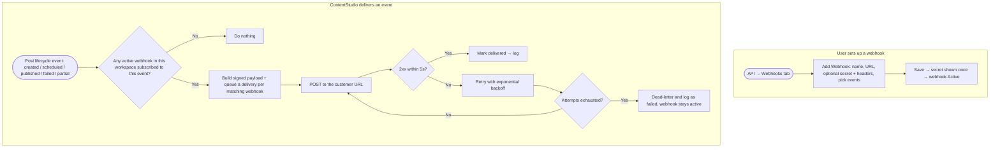
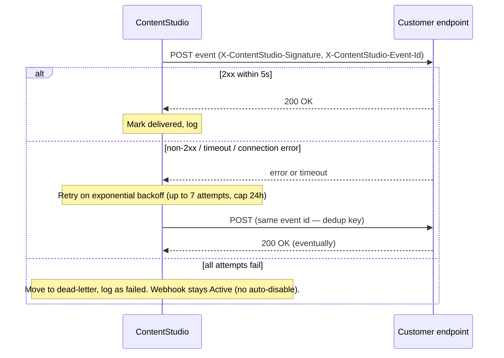

# Workflow — Public / Outbound Webhooks (v1)

**Dev reference:** Zernio webhooks — https://docs.zernio.com/webhooks

---

## 1. Feature Placement

Webhooks live inside the existing **API** module (reached from the **desktop rail → API**, which is also the landing page for API-centric plans; `ApiModule.vue` at `/:workspace/api`). The API page already has a tab bar — **API Key** and **Request Logs**. We add a **third tab: "Webhooks"**.

- **Webhooks tab** has a **sub-toggle with two views — Endpoints and Deliveries** (so we keep 3 top-level tabs, not 4):
  - **Endpoints** — the webhook list (with empty state) + the **Add Webhook** create/edit panel. Opening a webhook shows its detail (events, edit/pause/delete/test) with that webhook's own deliveries.
  - **Deliveries** — a global feed of recent deliveries across all webhooks, filterable by webhook, event, and status (the per-webhook view is just this feed pre-filtered).
  - Webhook deliveries are **outbound** and distinct from the inbound API **Request Logs** tab. Request Logs is a flat top-level tab because there's a single inbound API stream with no parent; webhook deliveries belong to a specific webhook, so they live inside the Webhooks tab.
- The tab and webhook creation are gated by the same plan entitlement that grants API access (`features.api_access`). Workspaces without API access don't see the API module at all.
- Cap: **5 webhook endpoints per workspace.**

---

## 2. Overview diagram

Two journeys: the user **sets up** a webhook, and the system **delivers** events to it.

---

## 3. User Flow (happy path)

1. A developer/admin on an API-enabled plan opens **API** from the desktop rail and clicks the **Webhooks** tab.
2. With none yet, they see the empty state and click **Create Webhook**.
3. In the panel they enter a **Name** ("My app"), a **Payload URL** (`https://myapp.com/webhooks/contentstudio`), optionally generate a **Secret**, optionally add **Custom Headers**, and tick the **events** they want (e.g. `post.published`, `post.failed`, `post.created`).
4. They click **Create Webhook**. The signing **secret is shown once** with a copy button and a "you won't see it again" warning. The webhook appears in the list as **Active**.
5. Later, a post in that workspace publishes. ContentStudio sends a **POST** to the URL with a signed JSON payload whose `event` is `post.published`. The developer's endpoint returns `200`.
6. The developer opens the webhook's **Delivery logs**, sees the successful delivery, expands it to inspect the payload and response, and can **Resend** or **Send a test event** anytime.

---

## 4. Alternative / edge flows

**Delivery retries (multi-system view):**

- **At-least-once + idempotency:** the same event id may arrive more than once (e.g. a lost ack). The customer dedupes on `id` / `X-ContentStudio-Event-Id`.
- **Signature:** if a secret is set, every delivery carries `X-ContentStudio-Signature` = lowercase hex HMAC-SHA256 of the raw body keyed by the secret. The customer recomputes and rejects on mismatch. (No secret → no signature header.)
- **Paused webhook:** events for a paused webhook are not delivered (and not queued). Resuming does **not** backfill missed events.
- **Cap reached:** trying to add a 6th webhook is blocked with a message to delete one or contact about higher limits.
- **No subscribers:** an event with no matching active webhook is simply not delivered (no work queued).
- **Large post content:** content is included in full; for pathologically large posts (>~256KB payload) `content` is truncated and `content_truncated: true` is set — full content remains available via `GET /posts/{id}`.
- **Test event:** "Send test event" delivers a sample payload for the chosen event type so the developer can validate their endpoint before going live; it's flagged as a test and appears in the delivery logs.

---

## 5. Key design decisions

| Decision | Choice | Rationale |
|---|---|---|
| Billing | **Free, no API-credit deduction** | Webhooks are push, not pull; can't be controlled by the customer; reduce polling load. Universal industry norm (Stripe/GitHub/Shopify/Zernio). Protected by plan-gating + endpoint cap instead. |
| v1 event scope | **Publishing lifecycle only:** `post.created`, `post.scheduled`, `post.published`, `post.failed`, `post.partial` | Maps directly to existing hooks (`PlanFinalizerJob`, `PlanObserver`). Inbox/comments/reviews/account events are a clean future phase. |
| Payload shape | **Zernio-style envelope, incl. post content** | `{ id, event, timestamp, workspace_id, post: { id, status, scheduledFor, publishedAt, content, platforms[] } }`. The plan's multi-account fan-out maps to `platforms[]`. |
| Signing | **Optional per-endpoint secret; HMAC-SHA256 over raw body** in `X-ContentStudio-Signature` | Matches Zernio + dev-platform norm; lets customers verify authenticity without calling back. |
| Retries | **Up to 7 attempts, exponential backoff capped at 24h → dead-letter; no auto-disable** | Adopts Zernio's schedule exactly; predictable, well-documented, forgiving of transient outages. |
| Endpoint cap | **5 per workspace** | Bounds delivery fan-out; abuse guard that replaces per-delivery metering. |
| Management surface | **In-app UI only (the Webhooks tab) for v1** | Public `/api/v1` webhook CRUD can follow later; the UI covers the common case first. |
| Delivery infra | **Horizon queued delivery job** (`$tries`/`$backoff`/`failed()`), optional Kafka buffer | Reuses the proven outbound-HTTP-with-retry pattern. |

**Decision worth confirming at PRD gate:** whether to dispatch deliveries directly from a queued job (simpler) or buffer through a Kafka topic first (more decoupled). Recommendation: **direct queued job for v1**, leave Kafka as a scaling option.

---

## 6. Integration with existing features

- **Publisher / Planner (post lifecycle):** the event source. `PlanFinalizerJob` (published/failed/partial) and `PlanObserver` (created) / the scheduled transition feed the dispatcher. Webhook dispatch must be **fault-isolated** — a webhook failure must never affect publishing.
- **API module:** the Webhooks tab sits beside API Key + Request Logs; reuses the page shell, the `features.api_access` gate, and the delivery-logs view modeled on `ApiRequestLogs.vue`.
- **Public API:** webhooks reference the same `post.id` used by `GET /posts/{id}` so customers can fetch full detail; docs join the existing `docs/api/` set.
- **Subscriptions/plans:** availability keys off `features.api_access`; the endpoint cap can live alongside other `SubscriptionLimits`.

---

## 7. Trackable actions (Usermaven candidates)

| Action | Candidate event | Trigger | Why measure |
|---|---|---|---|
| Webhook created | `webhook_created` | User saves a new webhook | Core adoption signal for the feature |
| Webhook deleted | `webhook_deleted` | User deletes a webhook | Churn/abandonment of the feature |
| Test event sent | `webhook_test_sent` | User clicks "Send test event" | Setup/activation funnel — are people validating before going live? |

Payloads stay PII-free (e.g. `{ event_count, events: ['post.published', ...] }`). `webhook_created` is the priority event; the others are nice-to-have. (No event names matching these exist today — confirm against `userMaven.track(` when writing the FE story.)

---

## 8. Scope recommendation (v1 vs later)

**v1 (this epic):**
- Webhooks tab in the API module: list, empty state, create/edit (Name, URL, optional Secret + Generate, optional Custom Headers, Posts-group events), pause/resume, delete, one-time secret reveal.
- Delivery engine: dispatcher hooked to the 5 publishing-lifecycle events, signed payloads, queued delivery with Zernio-style retries → dead-letter.
- Delivery logs + Resend + Send test event.
- Endpoint cap (5), `features.api_access` gating.
- Public API docs page for webhooks (cite Zernio reference).

**Later (not v1):**
- Inbox / comments / reviews / account / ads events.
- Public `/api/v1` webhook management endpoints.
- Plan-tier-scaled endpoint caps; "resend all failed"; richer delivery analytics.
