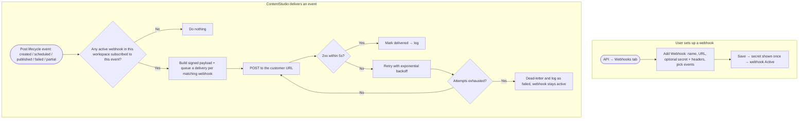

# **PRD: Public / Outbound Webhooks**

**Author:** Ghulam Jaffar (Product Owner)
**Last Updated:** 2026-06-27
**Status:** In Review
**Target Release:** Q3 2026

**Dev reference:** Zernio webhooks — https://docs.zernio.com/webhooks

---

## **1. Overview**

ContentStudio has a public API, but today integrations can only **poll** it to learn when something happens (e.g. "did my scheduled post go out?"). This feature adds **outbound webhooks**: a customer registers one or more URLs, picks the events they care about, and ContentStudio **pushes** a signed JSON payload to those URLs the moment a publishing-lifecycle event occurs — `post.created`, `post.scheduled`, `post.published`, `post.failed`, `post.partial`. It's the push counterpart to the public API, modeled on Zernio's webhooks (HMAC-signed payloads, at-least-once delivery, exponential-backoff retries → dead-letter, delivery logs, test events). Webhooks are **free** and available to anyone with API access.

---

## **2. Problem Statement**

**What problem are we solving?**
API customers have no real-time way to know when a post's state changes. To build anything reactive — update their own dashboard when a post publishes, alert their team when one fails, kick off a downstream workflow — they must repeatedly poll `GET /posts`. Polling is slow (they learn late), wasteful (most calls return no change), and it burns their API request credits.

**Who has this problem?**
Every customer on an API-enabled plan who integrates ContentStudio into their own systems — agencies with internal tooling, SaaS products built on top of ContentStudio, and automation builders (Zapier/Make/n8n-style). The API area is the **landing page for API-centric plans**, so this is the core audience of a growing, developer-focused segment.

**What happens if we don't solve it?**
ContentStudio stays behind developer-first competitors (Zernio, Ayrshare) for whom webhooks are table stakes. Integrations remain clunky and polling-heavy, which inflates API load on our side and credit consumption on theirs, and caps how deeply customers can build on the platform — limiting the stickiness of the API offering.

---

## **3. Goals & Success Metrics**

| Goal | Metric | Target | How We'll Measure |
|---|---|---|---|
| Make webhooks a usable, adopted part of the API | % of API-enabled workspaces with ≥1 active webhook | 25% within 90 days of launch | `webhook_created` (Usermaven) |
| Drive successful integration (not just creation) | % of created webhooks that receive ≥1 successful delivery | ≥ 80% | Delivery records |
| Reduce polling pressure | Drop in `GET /posts` polling volume from webhook-using workspaces | Downward trend in 90 days | API request logs |
| Reliable delivery | Successful-delivery rate (2xx within retry window, excluding customer-side outages) | ≥ 99% | Delivery records |
| Guard rail: webhooks never affect publishing | Publishing success rate unchanged after launch | 0 regression | Publishing metrics |

### **3.1 Analytics Events (Usermaven)**

| Event Name | Trigger | Payload | What we measure with it |
|---|---|---|---|
| `webhook_created` | User saves a new webhook endpoint (FE) | `{ event_count, events }` | Core adoption — how many workspaces set webhooks up, and which events are popular |
| `webhook_test_sent` | User clicks "Send test event" (FE) | `{ event }` | Activation funnel — are people validating their endpoint before going live? |
| `webhook_deleted` | User deletes a webhook (FE) | `{ event_count }` | Abandonment signal |

Naming follows guidelines §19 (snake_case, past tense, no PII). No existing event names match these — confirmed they are new (search `userMaven.track(` before implementing to be safe). `webhook_created` is the priority event; the other two are supporting.

---

## **4. Target Users**

**Primary Persona — API developer / integrator.** A technical user on an API-enabled plan building on top of ContentStudio (internal dashboard, customer-facing SaaS, automation). Cares about reliable, real-time notifications, clear payloads, signature verification, and good delivery logs for debugging. Comfortable with HTTP, HMAC, JSON.

**Secondary Persona — workspace admin / ops.** Sets up a webhook to wire ContentStudio into an existing tool (e.g. a no-code automation, a Slack alert via a relay). Less deep technically; relies on the test-event button and delivery logs to confirm it works.

**Non-Users (out of scope):**
- Workspaces without API access (`features.api_access` = false) — they don't see the API module.
- Non-publishing events (inbox messages, comments, reviews, account changes) — future phase.
- End users who only use the ContentStudio web app and don't integrate externally.

---

## **5. User Stories / Jobs to Be Done**

| ID | As a… | I want to… | So that… | Priority |
|---|---|---|---|---|
| US-1 | API developer | register a URL and choose which post events I receive | my system is notified in real time instead of polling | Must |
| US-2 | API developer | verify each delivery really came from ContentStudio | I can trust the payload before acting on it | Must |
| US-3 | API developer | see a log of what was sent, the response, and retries | I can debug my integration without opening a support ticket | Must |
| US-4 | API developer | send a test event to my endpoint | I can confirm my setup before going live | Must |
| US-5 | Ops/admin | pause or delete a webhook | I can stop deliveries when I'm changing my endpoint | Must |
| US-6 | API developer | know a failed delivery will be retried automatically | a brief outage on my side doesn't lose events | Must |
| US-7 | API developer | resend a specific past delivery | I can recover after fixing my endpoint | Should |
| US-8 | API developer | add custom headers to deliveries | my endpoint's own auth/gateway accepts the request | Should |

---

## **6. Requirements**

### **6.1 Must Have (P0)**

**Management (Webhooks tab in the API module):**
- A **Webhooks** tab in the API module (desktop rail → API), gated by `features.api_access`, with an **Endpoints / Deliveries** sub-toggle.
- Create a webhook with: **Name**, **Payload URL** (required, must be `https`), **optional Secret** (with a "Generate" option), **optional Custom Headers**, and **event subscription** (one or more of the 5 publishing-lifecycle events).
- Edit, **Pause/Resume**, and **Delete** a webhook.
- **One-time secret reveal** on creation/regeneration (copyable, never shown again).
- **Cap of 5 active webhook endpoints per workspace**, enforced with a clear message at the cap.
- Empty state, validation (URL required + https, ≥1 event required).

**Delivery engine:**
- Fire on the 5 events: `post.created`, `post.scheduled`, `post.published`, `post.failed`, `post.partial`, sourced from the post lifecycle.
- **Payload envelope** (Zernio-style), including post content:
  `{ id, event, timestamp, workspace_id, post: { id, status, scheduledFor, publishedAt, content, platforms[]: { platform, status, platformPostId, publishedUrl, error } } }`
- **Headers:** `X-ContentStudio-Signature` (lowercase hex HMAC-SHA256 of the raw body, keyed by the endpoint secret — only when a secret is set) and `X-ContentStudio-Event-Id` (= `id`).
- **At-least-once delivery** with a stable event `id` for idempotency.
- **Retries:** up to **7 attempts**, exponential backoff capped at 24h; success = `2xx` within **5 seconds**; after the last attempt → **dead-letter** (logged, not retried). **No auto-disable** of webhooks on failure.
- **Fault isolation:** webhook dispatch/delivery must never block, delay, or fail post publishing.
- Deliver to **all** active webhooks in the workspace subscribed to the event.

**Delivery logs (lean):**
- A **Deliveries** view (global, filterable by webhook/event/status) and a per-webhook delivery history showing: event, status, attempt number, response code, duration, timestamp, and an expandable **payload sent / response received**.

**Docs:**
- A public API docs page for webhooks (`docs/api/webhooks-endpoint.md` + quick reference, Swagger annotations), citing https://docs.zernio.com/webhooks as the model.

### **6.2 Should Have (P1)**
- **Resend** a specific past delivery from the logs.
- **Custom Headers** per endpoint (in the create/edit form; sent with every delivery).
- **CSV export** of the deliveries view (mirrors the Request Logs tab).

### **6.3 Nice to Have (P2)**
- Plan-tier-scaled endpoint caps (e.g. more endpoints on agency/enterprise).
- "Resend all failed in range" bulk action.
- Delivery analytics (success rate over time per webhook).

### **6.4 Explicitly Out of Scope**
- **Non-publishing events** — inbox messages, comments, reviews, account connect/disconnect, ads (future phase).
- **Public `/api/v1` webhook management endpoints** — v1 manages webhooks in-app only; programmatic CRUD comes later.
- **Mobile** — developer/API feature, web-only; no iOS/Android work.
- **Per-delivery billing / metering** — webhooks are free; protected by plan-gating + the endpoint cap.
- **Backfill of missed events** when a paused webhook resumes.

---

## **7. User Flow (High Level)**

1. A developer/admin on an API-enabled plan opens **API** from the desktop rail and clicks the **Webhooks** tab.
2. They click **Add Webhook**, enter a name + `https` URL, optionally generate a secret and add custom headers, tick the events they want, and save.
3. The signing **secret is shown once**; the webhook is now **Active**.
4. When a post in the workspace hits a subscribed state, ContentStudio sends a **signed POST** to the URL. The endpoint returns `2xx`.
5. If the endpoint errors or times out, ContentStudio **retries** with exponential backoff (up to 7 attempts) before dead-lettering — the post itself is unaffected either way.
6. The developer opens **Deliveries** to inspect what was sent and the response, **resend** if needed, or **send a test event** to validate changes.

---

## **8. Business Rules & Constraints**

| Rule ID | Rule | Rationale |
|---|---|---|
| BR-1 | Webhooks are **free** — no API-credit deduction, not counted against API rate limits | Push, not pull; customer can't control volume; industry norm; reduces polling load |
| BR-2 | Availability is gated by **`features.api_access`** (same flag that grants API access) | Webhooks are part of the API offering; no separate entitlement |
| BR-3 | Max **5 active webhook endpoints per workspace** | Bounds delivery fan-out; abuse guard replacing per-delivery metering |
| BR-4 | Payload URL must be **HTTPS** | Security; signed payloads + content in transit |
| BR-5 | Delivery is **at-least-once**; each event carries a stable `id` used as the dedup key | Retries can re-send; consumers must be idempotent |
| BR-6 | **Signature** (`X-ContentStudio-Signature`, HMAC-SHA256 over raw body) is sent **only when a secret is configured** | Optional secret per Zernio; lets customers verify authenticity |
| BR-7 | Success = `2xx` within **5s**; otherwise retry up to **7 attempts** (exp backoff, cap 24h) → **dead-letter** | Adopts Zernio's schedule; forgiving of transient outages |
| BR-8 | Webhooks are **never auto-disabled** on failure; users pause/delete manually | Avoids silently dropping a customer's integration |
| BR-9 | Webhook dispatch is **fault-isolated** from publishing — a webhook failure cannot affect a post going out | Publishing is the core product; webhooks are best-effort notifications |
| BR-10 | Post **content is included**; if a payload exceeds ~256KB, `content` is truncated and `content_truncated: true` is set (full content via `GET /posts/{id}`) | Keeps payloads bounded without losing data access |
| BR-11 | Paused webhooks receive **no** deliveries; resuming does **not** backfill missed events | Predictable, simple semantics |
| BR-12 | Deliveries are scoped to the **workspace** that owns the webhook | Multi-tenant isolation |

---

## **9. Open Questions**

| Question | Options | Owner | Decision |
|---|---|---|---|
| Dispatch deliveries directly from a queued job vs. buffer through a Kafka topic first | Direct queued job / Kafka buffer | Backend eng | **Working: direct queued (Horizon) job for v1; Kafka as a later scaling option** |
| Delivery-log retention window | 7 / 30 / 90 days | PM + eng | **Working: 30 days for v1** (tunable) |
| Exact dead-letter visibility — surface dead-lettered deliveries distinctly in the log? | Yes / merge with failed | PM | Leaning yes (a "Dead-lettered" status) |
| Should `post.created` fire for drafts, or only when a post is first committed/scheduled? | All creations / scheduled-only | PM | **Working: fire on creation incl. drafts; `post.scheduled` covers scheduling** |

---

## **10. Risks & Mitigations**

| Risk | Likelihood | Impact | Mitigation |
|---|---|---|---|
| A slow/failing customer endpoint backs up or delays publishing | Medium | High | **Fault isolation (BR-9):** deliveries run in separate queued jobs with a 5s timeout; never in the publish path |
| Payload exposes sensitive content (post text) over the wire | Medium | Medium | HTTPS-only (BR-4) + optional HMAC signing; document verification; truncate huge payloads (BR-10) |
| Customer treats at-least-once as exactly-once → duplicate processing | Medium | Medium | Stable event `id` + `X-ContentStudio-Event-Id`; document idempotency clearly (cite Zernio) |
| Retry storms to a dead endpoint waste resources | Low | Medium | Capped exponential backoff, max 7 attempts, then dead-letter; endpoint cap (BR-3) |
| Scope creep into inbox/comment/review events | Medium | Medium | Publishing-lifecycle only for v1 (§6.4); roadmap shown as "coming soon" in UI, not built |
| Customers expect to manage webhooks via the public API | Low | Low | Documented as a later phase; in-app management covers v1 |

---

## **11. Dependencies**

- **Internal:**
  - Post lifecycle hooks — `PlanFinalizerJob` (published/failed/partial) and `PlanObserver` (created) / the scheduled transition — as the event source.
  - The API module shell (`ApiModule.vue`) + `features.api_access` gate + `SubscriptionLimits` for the endpoint cap.
  - Horizon queued-job + retry infrastructure for delivery; optional Kafka (`config/kafka.php`) if buffering.
  - Public API docs tooling (`docs/api/` + L5-Swagger).
- **External:**
  - Customer-provided HTTPS endpoints (outside our control — hence retries + dead-letter).
- **Blockers:**
  - None hard. The direct-job-vs-Kafka decision (§9) should be settled before the delivery-engine story starts, but a direct queued job is a safe default.

---

## **12. Appendix**

- **Workflow & diagrams:** `02-workflow.md` (this feature folder).
- **Prototype UI prompt:** `prototype-ui-prompt.md` (this feature folder) — for generating the Webhooks UI prototype.
- **Reference implementation (the model):** Zernio webhooks — https://docs.zernio.com/webhooks
- **Research & competitive analysis:** `01-research.md` (this feature folder).
- **Codebase anchors:** public API (`routes/api/v1.php`, `ApiKeyMiddleware`), lifecycle hooks (`PlanFinalizerJob`, `PlanObserver`), delivery pattern (`UpdateWebhookForPlatform.php`, `GenerateReportJob`), FE shell (`ApiModule.vue`, `ApiRequestLogs.vue`).

---

## **Changelog**

| Date | Author | Changes |
|---|---|---|
| 2026-06-27 | Ghulam Jaffar | Initial PRD from approved research + workflow; locked decisions (free/unmetered, publishing-lifecycle v1, Zernio-style payload incl. content, API-access gating, 5-endpoint cap, Zernio retry schedule, in-app management v1, Endpoints/Deliveries sub-toggle) |
