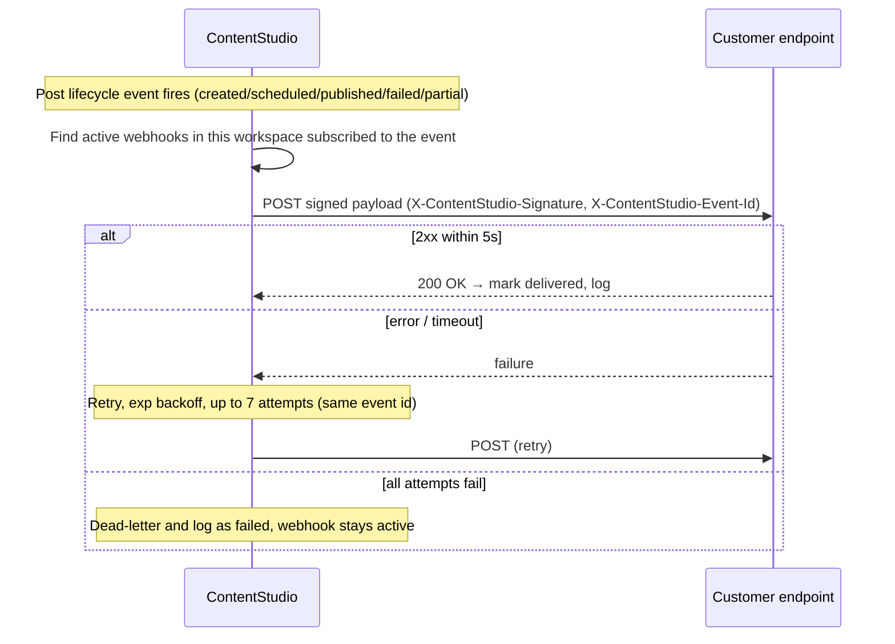
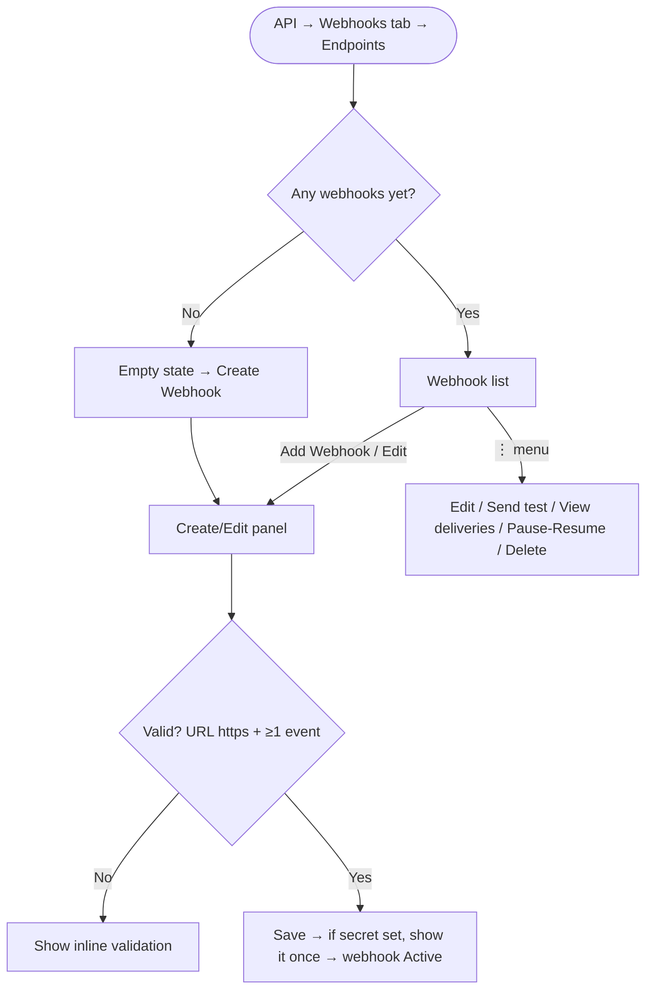

# Epic & Stories — Public / Outbound Webhooks

**Dev reference for all stories:** Zernio webhooks — https://docs.zernio.com/webhooks

> Local markdown deliverable. The PO creates the epic + stories in Shortcut manually using the **New Feature Template**. Nothing is pushed to Shortcut.

---

## EPIC: Public Webhooks for the API

**Description:**

Add outbound (public) webhooks to ContentStudio's API offering. Today, integrations can only poll the public API to learn when something happens; this epic lets a customer register one or more URLs, subscribe to publishing-lifecycle events, and receive a signed JSON payload pushed to their URL the moment a post is **created, scheduled, published, fails, or partially publishes**. It's the push counterpart to the public API, modeled on Zernio's webhooks.

Webhooks are **free** (no API-credit deduction) and available to any workspace with API access (`features.api_access`). Delivery is reliable and best-effort: signed payloads (optional per-endpoint HMAC secret), at-least-once delivery with a stable event id for idempotency, exponential-backoff retries (up to 7 attempts) ending in a dead-letter, and a delivery log for debugging. Critically, webhook delivery is **fault-isolated from publishing** — a failing customer endpoint can never delay or break a post going out.

The experience lives in a new **Webhooks** tab inside the API module (reached from the desktop rail → API), with an **Endpoints** sub-view to create and manage webhooks and a **Deliveries** sub-view to inspect what was sent. v1 covers publishing-lifecycle events only; inbox/comment/review/account events and programmatic webhook management via the public API are explicitly later phases.

**Epic state:** To Do · **Workflow state for stories:** Ready for Dev

---

## Story 1 — [BE] Create webhook endpoints data model & management API

### Description:
As an API customer, I want to register and manage webhook endpoints for my workspace, so I can choose where ContentStudio sends event notifications and which events I receive. This story delivers the data model and the in-app management API (create, list, edit, pause/resume, delete, regenerate secret) that the Webhooks UI is built on. Availability is limited to workspaces with API access, capped at 5 endpoints per workspace.

### Workflow:
1. A workspace with API access opens the Webhooks area and creates a webhook by providing a name, an HTTPS URL, an optional signing secret, optional custom headers, and the events it wants.
2. The system stores the endpoint, returns the signing secret **once** (if one was set/generated), and marks the endpoint active.
3. The customer can later edit the endpoint, pause/resume it, regenerate its secret, or delete it.
4. The system refuses to create a 6th endpoint and refuses non-HTTPS URLs or an empty event list.

### Acceptance criteria:
- [ ] An authenticated workspace **with API access** (`features.api_access`) can create a webhook endpoint with: name, payload URL, optional secret, optional custom headers (key/value pairs), and a non-empty set of subscribed events.
- [ ] Workspaces **without** API access cannot create or list webhooks (the endpoints return forbidden).
- [ ] Subscribable events are exactly the v1 set: `post.created`, `post.scheduled`, `post.published`, `post.failed`, `post.partial`.
- [ ] Payload URL is required and must be `https`; a non-HTTPS or missing URL is rejected with a clear error.
- [ ] At least one event is required; an empty event list is rejected.
- [ ] A workspace can have at most **5 active webhook endpoints**; attempting to create a 6th is rejected with a "limit reached" error.
- [ ] The signing secret is stored so it cannot be read back in plaintext after creation (only its presence is exposed); the plaintext secret is returned **only** at creation/regeneration time.
- [ ] List returns each endpoint's id, name, URL, subscribed events, status (active/paused), custom headers, created time, and a last-delivery summary (status + time) — never the plaintext secret.
- [ ] An endpoint can be edited (name, URL, events, custom headers), **paused/resumed**, have its **secret regenerated** (returns the new plaintext once), and **deleted**.
- [ ] All endpoints are scoped to the workspace; a user cannot read or modify another workspace's webhooks.

### Mock-ups:
N/A — backend only (UI in the FE stories).

### Impact on existing data:
Adds a new `webhook_endpoints` collection. No changes to existing collections.

### Impact on other products:
- Consumed by the Webhooks FE stories. No mobile/Chrome impact (web-only developer feature).
- White-label: works per-workspace like other API features.

### Dependencies:
None (foundational). Blocks **[FE] Build the Webhooks tab — Endpoints view (create & manage webhooks)** and **[BE] Build the webhook event dispatch & delivery engine**.

### Global quality & compliance (wherever applicable)
- [ ] Mobile responsiveness — N/A, backend only
- [ ] Multilingual support — N/A, no user-facing copy
- [ ] UI theming support — N/A, no UI
- [ ] White-label domains impact review
- [ ] Cross-product impact assessment (web, mobile apps, Chrome extension)

### Implementation references
*Pointers from research — not a contract. Engineering may choose a different approach.*

**Codebase:** `contentstudio-backend/` (Laravel 10, MongoDB).
- Mirror the API-key management shape: `app/Http/Controllers/ApiKeyController.php` (`/api/api-keys`) and `app/Models/ApiKey.php` — these are **in-app** management endpoints (not the public `/api/v1`).
- Gate on the same plan flag that grants API access: `features.api_access` (added in `database/migrations/2025_01_23_120000_add_api_key_feature_to_plans.php`). The 5-cap can live alongside other `SubscriptionLimits`.
- Secret handling: generate with `(string) Str::uuid()` or a random token; store hashed/encrypted (don't return after creation) — same "show once" pattern as `ApiKeyController` key generation.
- New `webhook_endpoints` collection (workspace_id, name, url, events[], secret(hashed), custom_headers, status, timestamps).
- Reference: https://docs.zernio.com/webhooks (optional secret, event subscription model).

### Shortcut fields
- **Template:** New Feature Template · **Story type:** Feature · **Project:** Web App · **Group:** Backend · **Epic:** Public Webhooks for the API · **Priority:** High · **Product area:** Integrations · **Skill set:** Backend · **Estimate:** _(empty)_ · **Labels:** none · **Iteration:** PO assigns

---

## Story 2 — [BE] Build the webhook event dispatch & delivery engine

### Description:
As an API customer, I want ContentStudio to reliably send me an event whenever one of my posts is created, scheduled, published, fails, or partially publishes, so my systems stay in sync in real time without polling. This story delivers the dispatcher that hooks into the post lifecycle, the signed Zernio-style payload, and the queued delivery with retries and dead-lettering — all fault-isolated from publishing.

### Workflow:

1. A post in a workspace reaches one of the five lifecycle states.
2. The system finds the workspace's active webhooks subscribed to that event and builds one signed payload per webhook.
3. Each delivery is queued and sent; a `2xx` within 5s is success, otherwise it retries with exponential backoff up to 7 attempts, then dead-letters.
4. Publishing is never affected by webhook delivery outcomes.

### Acceptance criteria:
- [ ] When a post becomes `created`, `scheduled`, `published`, `failed`, or `partially_failed`, the system emits the matching event (`post.created` / `post.scheduled` / `post.published` / `post.failed` / `post.partial`) to every **active** webhook in that workspace subscribed to it.
- [ ] The payload matches the agreed envelope: `{ id, event, timestamp, workspace_id, post: { id, status, scheduledFor, publishedAt, content, platforms[]: { platform, status, platformPostId, publishedUrl, error } } }`.
- [ ] `id` is a unique event id (UUID) and is also sent in the `X-ContentStudio-Event-Id` header; the same id is reused across retries of that event (idempotency key).
- [ ] When the endpoint has a secret, each request includes `X-ContentStudio-Signature` = lowercase-hex HMAC-SHA256 of the **raw request body** keyed by the secret; with no secret, no signature header is sent.
- [ ] A delivery is **successful** when the endpoint returns `2xx` within **5 seconds**; any other status, a timeout, or a connection error is a failure.
- [ ] Failed deliveries retry with exponential backoff, **up to 7 attempts total**, then move to a **dead-letter** state (recorded, not retried further). Webhooks are **not** auto-disabled by failures.
- [ ] Webhook dispatch and delivery are **fully isolated from publishing**: a slow, failing, or erroring webhook delivery never delays, blocks, or fails the post's publishing flow.
- [ ] Paused webhooks receive no deliveries; resuming does not backfill events missed while paused.
- [ ] Post `content` is included in full; if the serialized payload exceeds ~256KB, `content` is truncated and `content_truncated: true` is set.
- [ ] Each delivery attempt is recorded (event id, webhook, event type, attempt number, request, response status/body, duration, timestamp, final state) for the delivery log.
- [ ] No webhook activity consumes API request credits or counts against API rate limits.

### Mock-ups:
N/A — backend only.

### Impact on existing data:
Adds a `webhook_deliveries` collection (delivery attempts/records). Reads existing post (`plans`) data to build payloads; does not modify it.

### Impact on other products:
- Drives the Deliveries FE view. No mobile/Chrome impact.
- White-label: per-workspace, no special handling.

### Dependencies:
Depends on **[BE] Create webhook endpoints data model & management API**. Blocks **[BE] Build webhook delivery logs, test event & resend APIs** and **[FE] Build the Webhooks tab — Deliveries view**.

### Global quality & compliance (wherever applicable)
- [ ] Mobile responsiveness — N/A, backend only
- [ ] Multilingual support — N/A, no user-facing copy
- [ ] UI theming support — N/A, no UI
- [ ] White-label domains impact review
- [ ] Cross-product impact assessment (web, mobile apps, Chrome extension)

### Implementation references
*Pointers from research — not a contract. Engineering may choose a different approach.*

- **Event sources:** `app/Jobs/PlanFinalizerJob.php` (writes `published` / `failed` / `partially_failed` — the publish-complete moment) and `app/Observers/Publish/PlanObserver.php` (`plan_created`); the scheduled transition for `post.scheduled`. Dispatch must be additive and wrapped so a webhook error can't bubble into these (the existing `PlatformObserverTriggerDispatcher` is caught in `PlanFinalizerJob` lines ~87-94 — follow that fault-isolation precedent).
- **Plan → payload:** `app/Models/Publish/Planner/Plans.php`; a plan's multi-account fan-out maps to `platforms[]`. Statuses in `app/Data/Enums/PostStatus.php` (`partially_failed` → `post.partial`).
- **Delivery job:** model on `app/Jobs/UpdateWebhookForPlatform.php` (uses the `Http` facade for outbound calls) + `GenerateReportJob`'s exponential `$backoff`. Set `$tries`/`$backoff` to the Zernio schedule; implement `failed()` → dead-letter record.
- **Event id:** `(string) Str::uuid()`.
- **Optional Kafka buffer:** `config/kafka.php` (`backend_sasl`) — only if decoupling delivery from capture (direct queued job is the v1 default).
- **Retry schedule reference:** https://docs.zernio.com/webhooks (7 attempts, exp backoff capped 24h, 2xx-within-5s, dead-letter, no auto-disable).

### Shortcut fields
- **Template:** New Feature Template · **Story type:** Feature · **Project:** Web App · **Group:** Backend · **Epic:** Public Webhooks for the API · **Priority:** High · **Product area:** Integrations · **Skill set:** Backend · **Estimate:** _(empty)_ · **Labels:** none · **Iteration:** PO assigns

---

## Story 3 — [BE] Build webhook delivery logs, test-event & resend APIs

### Description:
As an API customer, I want to see exactly what ContentStudio sent to my webhook and what came back, send a test event to validate my setup, and resend a past delivery after I fix my endpoint — so I can debug my integration without filing a support ticket. This story exposes the read/ops APIs over the delivery records produced by the delivery engine.

### Workflow:
1. The customer views a list of recent deliveries (globally or for one webhook), filterable by webhook, event, and status, and expands any delivery to see the exact payload sent and response received.
2. The customer sends a **test event** of a chosen type to a webhook and sees the resulting delivery appear in the log.
3. The customer **resends** a specific past delivery and sees a new attempt logged.

### Acceptance criteria:
- [ ] An endpoint returns a paginated list of deliveries for the workspace, filterable by **webhook**, **event type**, and **status** (delivered / failed / pending / dead-lettered), newest first.
- [ ] Each delivery exposes: event type, event id, target webhook, status, attempt number, response status code, duration, timestamp, and the full **payload sent** and **response received** (body/headers) for inspection.
- [ ] A **test event** endpoint sends a sample payload of a chosen event type to a specified webhook; the result is recorded in the delivery log and clearly flagged as a test.
- [ ] A **resend** endpoint re-sends a specific past delivery's event to its webhook (reusing the same event id), recording a new attempt. _(P1)_
- [ ] Delivery records are retained for **30 days** (then eligible for cleanup). _(working default)_
- [ ] All delivery endpoints are workspace-scoped and gated by API access; one workspace cannot read another's deliveries.
- [ ] These endpoints do not consume API request credits.

### Mock-ups:
N/A — backend only.

### Impact on existing data:
Reads `webhook_deliveries`. May add a retention/cleanup mechanism (30-day window).

### Impact on other products:
Drives the Deliveries FE view. No mobile/Chrome impact.

### Dependencies:
Depends on **[BE] Build the webhook event dispatch & delivery engine**. Blocks **[FE] Build the Webhooks tab — Deliveries view (logs, inspect, resend, test)**.

### Global quality & compliance (wherever applicable)
- [ ] Mobile responsiveness — N/A, backend only
- [ ] Multilingual support — N/A, no user-facing copy
- [ ] UI theming support — N/A, no UI
- [ ] White-label domains impact review
- [ ] Cross-product impact assessment (web, mobile apps, Chrome extension)

### Implementation references
*Pointers from research — not a contract. Engineering may choose a different approach.*

- Build on the `webhook_deliveries` records from the delivery-engine story. The test-event and resend paths reuse the same `DeliverWebhookJob` so behavior (signing, retries, logging) is identical to real events.
- Read/list pattern can follow `ApiRequestLogs` / `app/Builders/Analytics/ApiRequestLogBuilder.php` (filtering + pagination), adapted to MongoDB delivery records.
- Reference: https://docs.zernio.com/webhooks (delivery logs with `attemptNumber`, test webhook).

### Shortcut fields
- **Template:** New Feature Template · **Story type:** Feature · **Project:** Web App · **Group:** Backend · **Epic:** Public Webhooks for the API · **Priority:** High · **Product area:** Integrations · **Skill set:** Backend · **Estimate:** _(empty)_ · **Labels:** none · **Iteration:** PO assigns

---

## Story 4 — [FE] Build the Webhooks tab — Endpoints view (create & manage webhooks)

### Description:
As an API customer, I want a Webhooks section in the API page where I can create, view, edit, pause, and delete my webhooks, so I can set up real-time event notifications without touching code. This story builds the **Webhooks** tab and its **Endpoints** sub-view, including the create/edit panel and the one-time secret reveal.

### Workflow:

1. The user opens the **API** page (desktop rail → API), clicks the **Webhooks** tab, and lands on the **Endpoints** sub-view.
2. With no webhooks yet, they see the empty state and click **Create Webhook**.
3. They fill the panel (name, URL, optional secret, optional custom headers, events) and save.
4. If a secret was set/generated, it's shown once with a copy button; the webhook then appears in the list as **Active**.
5. From each list row's menu they can edit, send a test event, view deliveries, pause/resume, or delete.

### Acceptance criteria:
- [ ] A third tab **Webhooks** appears in the API page (alongside API Key and Request Logs), only for workspaces with API access; within it, a `SegmentedControl` sub-toggle shows **Endpoints** and **Deliveries** (Deliveries built in the companion FE story).
- [ ] **Empty state** (shown when no webhooks exist) follows the **approval-workflow setup pattern** — a centered card with an icon, title, body, a "How it works" heading with **three step cards**, a centered primary button, and a help-docs link below it. Copy:
  - **Title:** "Set up your first webhook"
  - **Body:** "Get notified the moment things happen in your workspace. Register a URL, choose the post events you care about, and we'll send a signed request to your endpoint in real time — no polling required."
  - **"How it works"** with three steps (Step 1 / Step 2 / Step 3):
    - **Step 1 — Create a webhook:** "Add your endpoint URL, an optional signing secret, and pick the events you want."
    - **Step 2 — We send events to your URL:** "When a post is created, scheduled, published, or fails, we POST a signed payload to your endpoint."
    - **Step 3 — Verify and handle deliveries:** "Check the signature, return a 2xx, and track every delivery in the log — failed ones retry automatically."
  - **Centered primary button:** "Create your first webhook"
  - **Help link below the button:** "View Webhook Docs"
- [ ] The list shows each webhook's **name**, **URL** (truncated, monospace), subscribed-event tags (`Badge`), a status `Badge` (**Active** / **Paused**), a last-delivery indicator (success/fail + relative time), and a "⋮" menu (`Dropdown`: Edit, Send test event, View deliveries, Pause/Resume, Delete). A counter shows "{n} of 5 webhooks used".
- [ ] **Create/Edit panel** (`Modal`) titled **"New Webhook"** / **"Edit Webhook"**, subtitle "Configure a webhook endpoint to receive events.", with these fields:
  - **Name** (`TextInput`) — placeholder "My Webhook"; helper "A label to help you recognize this webhook."
  - **Payload URL** (`TextInput`) — placeholder "https://example.com/webhooks/contentstudio"; helper "We'll send a POST request to this URL."; errors: "Please enter a URL." / "The URL must start with https://".
  - **Signing secret (optional)** (`TextInput`) — placeholder "Leave blank for no signature"; helper "If set, we sign every request with this secret so you can verify it came from ContentStudio (sent in the X-ContentStudio-Signature header)."; a **Generate** `Button` (tooltip via `v-tooltip`: "Create a strong random secret for you.").
  - **Custom headers (optional)** — an "Add header" `Button` that adds key/value `TextInput` rows (placeholders "Header name (e.g. Authorization)" / "Header value"); helper "Sent with every delivery — useful if your endpoint needs its own authentication." _(P1)_
  - **Events to send** — a "Posts" group with a "Select all post events" `Checkbox` and five `Checkbox` items, each with a one-line description: `post.created` "A post is created (draft or scheduled).", `post.scheduled` "A post is scheduled for a future time.", `post.published` "A post is successfully published.", `post.failed` "A post fails to publish on all platforms.", `post.partial` "A post publishes on some platforms but fails on others."; a disabled, grayed "Accounts · Inbox · Comments · Reviews" group with a "Coming soon" `Badge`.
  - Footer: primary **"Create Webhook"** / **"Save changes"**, secondary **"Cancel"**.
- [ ] The save button is disabled until the URL is a valid `https` URL and at least one event is selected; the events error reads "Select at least one event."
- [ ] On create, if a secret was set/generated, a **one-time reveal** (`Modal`/`Alert`) shows the secret with a copy button and the warning "Copy your signing secret now. For your security, we won't show it again." Closing returns to the list with the new webhook **Active**.
- [ ] **Pause/Resume** updates the status `Badge`; toasts: "Webhook paused. You won't receive events until you resume it." / "Webhook resumed."
- [ ] **Delete** opens a confirm (`Dialog`): title "Delete this webhook?", body "You'll stop receiving events at this URL. This can't be undone.", buttons "Delete" / "Cancel"; success toast "Webhook deleted."
- [ ] At 5 webhooks, "Add Webhook" is disabled with a tooltip/message: "You've reached the limit of 5 webhooks. Delete one to add another."
- [ ] **Loading** state shows a `Loader`/skeleton while the list loads; **error** state shows "We couldn't load your webhooks. Please try again." with a Retry action.
- [ ] Success toasts: "Webhook created." / "Webhook updated."
- [ ] When the user creates a webhook, a `webhook_created` Usermaven event fires with `{ event_count, events }`.
- [ ] When the user deletes a webhook, a `webhook_deleted` Usermaven event fires with `{ event_count }`.
- [ ] All copy is provided via i18n keys; the tab respects white-label theming (theme variable colors, no hardcoded brand colors).

### Mock-ups:
Interactive prototype (mockup): https://claude.ai/artifacts/latest/53a35432-fa6b-4b4f-b4b9-94bbdccecc31 — covers the Webhooks tab, the empty state, the create/edit panel, and the one-time secret reveal. The empty state follows ContentStudio's existing **approval-workflow setup** screen (Settings → Approval Workflows) — match that layout (icon, title, body, three "How it works" step cards, centered create button, help-docs link).

### Impact on existing data:
None (UI). Consumes the management API.

### Impact on other products:
- Desktop web only (the API module is desktop). No mobile/Chrome.
- White-label: must use theme variables; the Webhooks tab appears for white-label workspaces with API access.

### Dependencies:
Depends on **[BE] Create webhook endpoints data model & management API**. Companion: **[FE] Build the Webhooks tab — Deliveries view (logs, inspect, resend, test)** (shares the tab + sub-toggle).

### Global quality & compliance (wherever applicable)
- [ ] Mobile responsiveness (desktop-first developer page; verify it degrades gracefully)
- [ ] Multilingual support (all copy via i18n keys, added to every locale)
- [ ] UI theming support (default + white-label, design library components used)
- [ ] White-label domains impact review
- [ ] Cross-product impact assessment (web, mobile apps, Chrome extension)

### Implementation references
*Pointers from research — not a contract. Engineering may choose a different approach.*

- Add the Webhooks tab in `contentstudio-frontend/src/modules/setting/components/api/ApiModule.vue` — add a third entry to `tabOptions` and a `v-show="activeTab === 'webhooks'"` block, mirroring the existing `request_logs` tab. Gate on the same `hasApiKey` / `useFeatures().canAccess(...)` used for the page.
- Use the `SegmentedControl` (already imported in `ApiModule.vue`) for the Endpoints/Deliveries sub-toggle.
- New components under `src/modules/setting/components/api/` (e.g. `WebhooksEndpoints.vue`, `WebhookFormModal.vue`) — module components must be **explicitly imported** (not auto-registered). Data via a `useWebhooks` composable + TanStack Query, following `useApiKeys` / `useApiRequestLogs` and the `settingKeys` factory.
- API URLs in `src/config/api-utils.js`; HTTP via `proxy`. Follow `contentstudio-frontend/CLAUDE.md` (`<script setup lang="ts">`, `defineModel()`, theme tokens).
- No standalone Tooltip component — use the existing `v-tooltip` directive (as `ApiModule.vue` does). No Pill component — use `Badge` + Tailwind for event tags.
- Search `userMaven.track(` to confirm `webhook_created`/`webhook_deleted` are new before adding.
- **Empty state pattern to reuse:** `src/modules/setting/components/workspace/approval-workflows/ApprovalWorkflowsList.vue` renders the approval-workflow setup screen (icon → title → body → "How it works" 3 step cards → centered create button → help-docs link) from i18n keys under `settings.approval_workflows.*`. Mirror that component's layout for the webhooks empty state, with the copy above under new `settings.webhooks.*` keys.
- Reference: https://docs.zernio.com/webhooks.

### Shortcut fields
- **Template:** New Feature Template · **Story type:** Feature · **Project:** Web App · **Group:** Frontend · **Epic:** Public Webhooks for the API · **Priority:** High · **Product area:** Integrations · **Skill set:** Frontend · **Estimate:** _(empty)_ · **Labels:** none · **Iteration:** PO assigns

---

## Story 5 — [FE] Build the Webhooks tab — Deliveries view (logs, inspect, resend, test)

### Description:
As an API customer, I want to see what ContentStudio sent to my webhooks and what came back, send a test event, and resend a past delivery, so I can confirm my integration works and debug failures myself. This story builds the **Deliveries** sub-view of the Webhooks tab and the per-webhook delivery log.

### Workflow:
1. On the Webhooks tab, the user switches to the **Deliveries** sub-toggle and sees recent deliveries across all their webhooks.
2. They filter by webhook, event, or status, and expand a delivery to inspect the payload sent and the response received.
3. They click **Resend** on a delivery, or **Send test event** for a webhook, and watch the new delivery appear in the log.

### Acceptance criteria:
- [ ] The **Deliveries** sub-view lists recent deliveries (newest first, paginated) with columns: **Event**, **Status**, **Attempt** (e.g. "1 of 7"), **Response** (code), **Duration**, **Time**. Status uses a `Badge`: **Delivered** (success), **Failed**, **Pending**, **Dead-lettered**.
- [ ] Filters (`Dropdown`s) for **Webhook** ("All webhooks"), **Event** ("All events"), and **Status** ("All statuses").
- [ ] Expanding a delivery shows the **Payload sent** (formatted JSON) and **Response received** (status + body), each in a monospace, scrollable block.
- [ ] Each delivery has a **Resend** action (`ActionIcon`/`Button`, tooltip via `v-tooltip`: "Send this exact event to your URL again."); on click, a new attempt is created and a toast shows "Event re-sent. Check the log for the result." _(P1)_
- [ ] A **Send test event** action (from the Endpoints list menu and/or a webhook's detail) opens a `Modal` titled "Send a test event", body "Pick an event type and we'll send a sample payload to your webhook so you can check your setup.", an **Event type** `Dropdown` (default `post.published`), buttons "Send test" / "Cancel"; on send, a toast shows "Test event sent. Check the Deliveries log for the result." and the delivery appears flagged as a test.
- [ ] Opening a specific webhook (from the Endpoints list) shows its detail with the same deliveries table **pre-filtered** to that webhook, plus its subscribed-event tags and Edit/Pause/Delete/Send-test actions.
- [ ] **Export CSV** of the current (filtered) deliveries view. _(P1)_
- [ ] **Empty state**: headline "No deliveries yet", subtext "Events will appear here as soon as they're sent to your webhooks."
- [ ] **Loading** shows a skeleton/`Loader`; **error** shows "We couldn't load your deliveries. Please try again." with Retry.
- [ ] When the user sends a test event, a `webhook_test_sent` Usermaven event fires with `{ event }`.
- [ ] All copy via i18n; white-label theming respected.

### Mock-ups:
Interactive prototype (mockup): https://claude.ai/artifacts/latest/53a35432-fa6b-4b4f-b4b9-94bbdccecc31 — covers the Deliveries view, the payload/response inspector, and the test-event modal.

### Impact on existing data:
None (UI). Consumes the delivery logs / test / resend APIs.

### Impact on other products:
Desktop web only. White-label themed. No mobile/Chrome.

### Dependencies:
Depends on **[BE] Build webhook delivery logs, test-event & resend APIs** and **[FE] Build the Webhooks tab — Endpoints view (create & manage webhooks)** (shares the tab + sub-toggle).

### Global quality & compliance (wherever applicable)
- [ ] Mobile responsiveness (desktop-first; the table scrolls horizontally on narrow widths)
- [ ] Multilingual support (all copy via i18n keys, added to every locale)
- [ ] UI theming support (default + white-label, design library components used)
- [ ] White-label domains impact review
- [ ] Cross-product impact assessment (web, mobile apps, Chrome extension)

### Implementation references
*Pointers from research — not a contract. Engineering may choose a different approach.*

- The deliveries table closely mirrors `contentstudio-frontend/src/modules/setting/components/ApiRequestLogs.vue` (method/status/duration/timestamp columns, filters, CSV export) — reuse its layout/patterns. There is **no** dedicated Table component in the library; follow the existing logs table markup.
- New `WebhookDeliveries.vue` (+ a test-event modal) under `src/modules/setting/components/api/`; data via the `useWebhooks` composable / TanStack Query.
- JSON inspector: a simple monospace `<pre>` with `overflow-x-auto`; no dedicated component needed.
- Search `userMaven.track(` to confirm `webhook_test_sent` is new before adding.
- Reference: https://docs.zernio.com/webhooks (delivery logs, `attemptNumber`, test webhook).

### Shortcut fields
- **Template:** New Feature Template · **Story type:** Feature · **Project:** Web App · **Group:** Frontend · **Epic:** Public Webhooks for the API · **Priority:** High · **Product area:** Integrations · **Skill set:** Frontend · **Estimate:** _(empty)_ · **Labels:** none · **Iteration:** PO assigns

---

## Story 6 — [BE] Document the webhooks API (public docs + reference)

### Description:
As an API developer, I want clear public documentation for webhooks — the events, payload shape, headers, signing, retries, and how to verify a delivery — so I can build and trust my integration. This story adds the webhooks documentation to the existing public API docs.

### Workflow:
1. A developer opens the public API docs and finds a Webhooks page.
2. They read how to create a webhook, the available events, the payload for each, the signature/verification steps, the retry/dead-letter behavior, and idempotency guidance.

### Acceptance criteria:
- [ ] A **Webhooks** page is added to the public API docs covering: what webhooks are, the v1 events (`post.created`, `post.scheduled`, `post.published`, `post.failed`, `post.partial`), the payload envelope (with `platforms[]` and `content`), and the headers (`X-ContentStudio-Signature`, `X-ContentStudio-Event-Id`).
- [ ] Documents **signature verification** (HMAC-SHA256 over the raw body, keyed by the endpoint secret) with a code example, and instructs rejecting unsigned/mismatched requests.
- [ ] Documents **delivery semantics**: at-least-once, idempotency via the event id, the 5s/2xx success rule, the retry schedule (up to 7 attempts, exponential backoff, dead-letter), and that webhooks are never auto-disabled.
- [ ] Documents the **5-endpoint cap**, that webhooks are **free** (no API credits), and how to manage them (in-app for v1).
- [ ] A sample payload is shown for each event type.
- [ ] The docs are discoverable from the existing API docs entry and reference Zernio's docs as prior art where useful.

### Mock-ups:
N/A — documentation.

### Impact on existing data:
None.

### Impact on other products:
Public-facing docs. No app/runtime impact.

### Dependencies:
Depends on **[BE] Create webhook endpoints data model & management API** and **[BE] Build the webhook event dispatch & delivery engine** (the documented surface must be final).

### Global quality & compliance (wherever applicable)
- [ ] Mobile responsiveness — N/A, documentation
- [ ] Multilingual support — N/A, English API docs (matches existing API docs)
- [ ] UI theming support — N/A
- [ ] White-label domains impact review — N/A
- [ ] Cross-product impact assessment — N/A (developer docs)

### Implementation references
*Pointers from research — not a contract. Engineering may choose a different approach.*

- Follow the existing docs shape in `contentstudio-backend/docs/api/` (e.g. `posts-endpoint.md` + a `webhooks-quick-reference.md`), and add `@OA\*` annotations on the webhook controllers; regenerate L5-Swagger (`l5-swagger:generate`).
- Model the structure and tone on https://docs.zernio.com/webhooks (delivery flow, retries table, idempotency, signature verification example).

### Shortcut fields
- **Template:** New Feature Template · **Story type:** Chore · **Project:** Web App · **Group:** Backend · **Epic:** Public Webhooks for the API · **Priority:** High · **Product area:** Integrations · **Skill set:** Backend · **Estimate:** _(empty)_ · **Labels:** none · **Iteration:** PO assigns

---

## Story 7 — [Design] Design the Webhooks experience (tab, setup, create flow, delivery logs)

### Description:
As the product designer, I need to design the full Webhooks experience in the API module so the frontend team has the screens, states, and components to build it. This is the **single design story for the epic** — both `[FE]` stories build against it. It covers the Webhooks tab (Endpoints + Deliveries sub-toggle), the setup/empty state, the create/edit webhook flow, the one-time secret reveal, the webhooks list, and the delivery-logs view with its payload/response inspector — all consistent with the existing API page and the approval-workflow setup screen.

### Workflow / surfaces to design:
1. **Webhooks tab** placement in the API module, with an Endpoints / Deliveries `SegmentedControl` sub-toggle.
2. **Setup/empty state** — match the approval-workflow setup screen: icon, title "Set up your first webhook", body, a "How it works" row of **three step cards**, a centered "Create your first webhook" button, and a "View Webhook Docs" link.
3. **Webhooks list** — rows with name, URL, event tags, status badge (Active/Paused), last-delivery indicator, and a "⋮" menu; an "{n} of 5 webhooks used" counter; "Add Webhook".
4. **Create/Edit panel** — Name, Payload URL, optional Secret (+ Generate), optional Custom Headers (key/value rows), grouped Events checkboxes (Posts group + a grayed "coming soon" future group), inline validation, footer CTAs.
5. **One-time secret reveal** — secret + copy + "won't show again" warning.
6. **Deliveries view** — table (event, status, attempt, response, duration, time), status badges incl. **Dead-lettered**, filters (webhook/event/status), an expandable **payload-sent / response-received JSON inspector**, a Resend action, and a Send-test-event modal.
7. **States** — empty, loading (skeleton), error, populated.

### Acceptance criteria (design deliverables):
- [ ] Figma designs delivered for all surfaces above (tab + sub-toggle, setup/empty state, list, create/edit panel, secret reveal, deliveries view + inspector, test-event modal).
- [ ] Setup/empty state matches the existing approval-workflow setup screen (Settings → Approval Workflows): icon, title, body, three step cards, centered CTA, help-docs link.
- [ ] All states designed: empty, loading (skeleton), error, populated.
- [ ] Visual language defined for status (Active/Paused), event tags, and delivery status (Delivered / Failed / Pending / Dead-lettered) using theme tokens — works under white-label; no hardcoded brand colors; no dark mode.
- [ ] Components mapped to `@contentstudio/ui` (`SegmentedControl`, `Modal`, `TextInput`, `Checkbox`, `Switch`, `Button`, `Badge`, `ActionIcon`, `Icon`, `Alert`, `Pagination`, `Loader`). Any **gaps flagged with a spec** — likely candidates: the key/value Custom-Headers row, the JSON payload/response inspector, the grouped event checklist, and the three-step setup card — note which need new/extended design-system components vs. composition of existing ones (catalog has no Tooltip, Pill/Chip, or Table component today).
- [ ] Redlines/spec for spacing, type, and tokens; responsive behavior for the desktop API page, including how the deliveries table behaves on narrower widths.
- [ ] Hand-off notes reference the interactive prototype and the event/payload model so structure and copy align with the FE stories.

### Mock-ups:
Interactive prototype (starting point): https://claude.ai/artifacts/latest/53a35432-fa6b-4b4f-b4b9-94bbdccecc31. Reference: Zernio webhooks UI + docs https://docs.zernio.com/webhooks.

### Impact on existing data:
None (design).

### Impact on other products:
Desktop web only (the API module). White-label theming required. No mobile/Chrome.

### Dependencies:
Blocks **[FE] Build the Webhooks tab — Endpoints view (create & manage webhooks)** and **[FE] Build the Webhooks tab — Deliveries view (logs, inspect, resend, test)** — both build against these designs. Aligns with the existing API page and approval-workflow patterns.

### Global quality & compliance (wherever applicable)
- [ ] Mobile responsiveness — desktop-first API page; specify graceful narrow-width behavior
- [ ] Multilingual support — design accommodates longer translated strings
- [ ] UI theming support (default + white-label; design-system components)
- [ ] White-label domains impact review
- [ ] Cross-product impact assessment (web, mobile apps, Chrome extension)

### Implementation references
*Pointers from research — not a contract.*
- Match the existing API page (`contentstudio-frontend/src/modules/setting/components/api/ApiModule.vue`) and the approval-workflow setup state (`src/modules/setting/components/workspace/approval-workflows/ApprovalWorkflowsList.vue`, copy under `settings.approval_workflows.*`).
- Component catalog: `docs/ui-components.md`. Reference prototype + Zernio as above.

---

## Suggested build order
1. **[Design] Design the Webhooks experience** (leads; FE builds against it — can start in parallel with the foundational BE work)
2. **[BE] Create webhook endpoints data model & management API** (foundational)
3. **[BE] Build the webhook event dispatch & delivery engine**
4. **[BE] Build webhook delivery logs, test-event & resend APIs**
5. **[FE] Build the Webhooks tab — Endpoints view** (after Design + once the management API lands)
6. **[FE] Build the Webhooks tab — Deliveries view** (after Design + the delivery-log APIs)
7. **[BE] Document the webhooks API** (after the BE surface finalizes)
