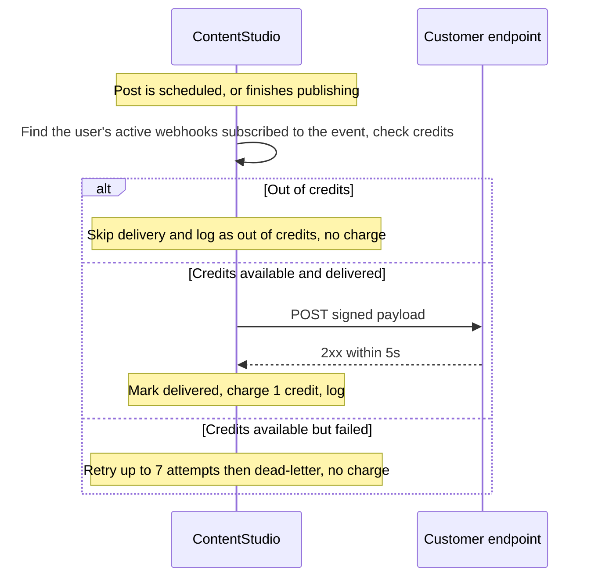
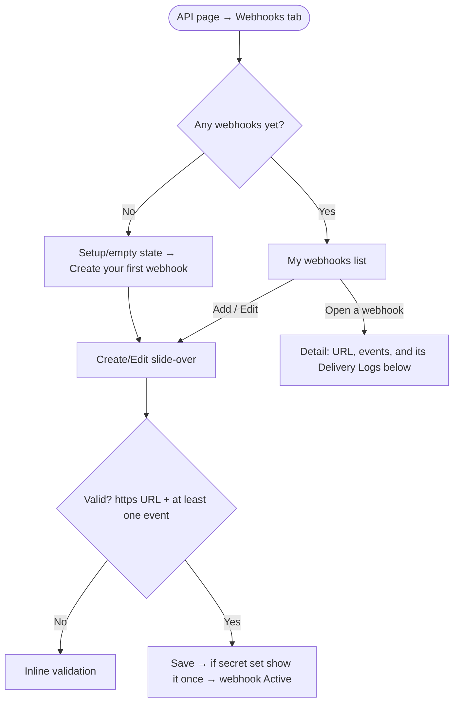

# Epic & Stories — Public / Outbound Webhooks

**Dev reference for all stories:** Zernio webhooks — https://docs.zernio.com/webhooks

> Local markdown deliverable for the PO to create in Helpin. Team is shown by the title prefix (`[BE]`/`[FE]`/`[Design]`); product area is **Integrations**; all stories are **High** priority unless noted.

---

## EPIC: Public Webhooks for the API

**Description:**

Add outbound (public) webhooks to ContentStudio's API offering. Today integrations can only poll the public API to learn when something happens; this epic lets a customer register one or more URLs, subscribe to publishing events, and receive a signed JSON payload pushed to their URL when a post is **scheduled** or **finishes publishing**. It's the push counterpart to the public API, modeled on Zernio's webhooks.

**Webhooks are user-level** — a webhook belongs to the user who creates it, exactly like the API key (not workspace-scoped). They're **metered against the same API-request credit pool**: each **successful** delivery consumes **1 API request**. Delivery is reliable: signed payloads (optional per-endpoint HMAC secret), at-least-once delivery with a stable event id for idempotency, exponential-backoff retries (up to 7 attempts) ending in a dead-letter, and a per-webhook delivery log for debugging. Webhook delivery (and its metering) is **fault-isolated from publishing** — a failing endpoint can never delay or break a post going out.

The experience restructures the API module into **two top-level tabs — `API` and `Webhooks`** — under a slim header with a **compact usage readout** (API calls + webhook deliveries against the shared allowance). v1 events are publishing-only; inbox/comment/review/account events, and programmatic webhook management via the public API, are later phases.

**Epic state:** To Do

---

## Story 1 — [BE] Create webhook endpoints data model & management API

### Description:
As an API customer, I want to register and manage webhook endpoints under my account, so I can choose where ContentStudio sends event notifications and which events I receive. Delivers the data model and the in-app management API (create, list, edit, pause/resume, delete, regenerate secret). Webhooks are **user-level** (owned by the user, like API keys), available to users with API access, capped at 5 per user.

### Acceptance criteria:
- [ ] A user **with API access** (gated like API-key creation) can create a webhook with: name (optional), payload URL, optional secret, optional custom headers (key/value), and a non-empty set of subscribed events.
- [ ] Webhooks are **owned by the user** (not the workspace) — listed for and managed by that user, mirroring how API keys work.
- [ ] Subscribable events are exactly the v1 set: **`post.scheduled`** and **`post.published`** (no `post.created`; `post.published` carries the final outcome — see the delivery-engine story).
- [ ] Payload URL is required and must be `https`; a non-HTTPS or missing URL is rejected with a clear error. Name is optional (defaults to the URL host if blank).
- [ ] At least one event is required.
- [ ] A user can have at most **5 active webhooks**; creating a 6th is rejected with a "limit reached" error. (The cap also bounds delivery cost, since deliveries are metered.)
- [ ] The signing secret is stored so it can't be read back in plaintext (only its presence is exposed); the plaintext is returned **only** at creation/regeneration.
- [ ] List returns each webhook's id, name, URL, subscribed events, status (active/paused), custom headers, created time, and a last-delivery summary — never the plaintext secret.
- [ ] A webhook can be edited (name, URL, events, headers), **paused/resumed**, have its **secret regenerated** (returns the new plaintext once), and **deleted**.
- [ ] A user can only read/modify their own webhooks.

### Mock-ups:
N/A — backend only.

### Impact on existing data:
Adds a `webhook_endpoints` collection keyed by **user_id**. No changes to existing collections.

### Impact on other products:
Consumed by the Webhooks FE story. No mobile/Chrome. White-label: works like other API features.

### Dependencies:
None (foundational). Blocks the delivery-engine and FE stories.

### Open question (confirm with backend):
A user-level webhook receives events for the workspaces the user can access, with `workspace_id` in every payload. Confirm the exact cross-workspace fan-out and which credit pool a delivery is charged to (the event's workspace pool is the working assumption — see the delivery-engine story).

### Global quality & compliance (wherever applicable)
- [ ] Mobile responsiveness — N/A, backend only
- [ ] Multilingual support — N/A, no user-facing copy
- [ ] UI theming support — N/A, no UI
- [ ] White-label domains impact review
- [ ] Cross-product impact assessment (web, mobile apps, Chrome extension)

### Implementation references
*Pointers from research — not a contract.*
- Mirror the **user-level** API-key management: `app/Http/Controllers/ApiKeyController.php` (`/api/api-keys`), `app/Models/ApiKey.php`. Gate like API-key creation; the 5-cap can live alongside `SubscriptionLimits`. Secret = `(string) Str::uuid()`/random, stored hashed, shown once.
- New `webhook_endpoints` collection (user_id, name, url, events[], secret(hashed), custom_headers, status, timestamps).

---

## Story 2 — [BE] Build the webhook event dispatch & delivery engine (with metering)

### Description:
As an API customer, I want ContentStudio to reliably send me an event when one of my posts is scheduled or finishes publishing, so my systems stay in sync without polling. Delivers the dispatcher hooked to the post lifecycle, the signed Zernio-style payload, queued delivery with retries → dead-letter, and credit metering (1 API request per successful delivery) — all fault-isolated from publishing.

### Workflow:

### Acceptance criteria:
- [ ] When a post is **scheduled**, a `post.scheduled` event fires; when a post **finishes publishing**, a `post.published` event fires. `post.published` represents the publish-completion: its payload `status` is one of `published` / `failed` / `partially_failed`, and `platforms[]` carries per-account outcome — so **failures and partial failures are conveyed in the `post.published` event** (no separate `post.failed` / `post.partial` events in v1).
- [ ] Events are delivered to the **owning users' active webhooks** subscribed to that event, for posts in the workspaces those users can access. Every payload includes `workspace_id`.
- [ ] Payload envelope: `{ id, event, timestamp, workspace_id, post: { id, status, scheduledFor, publishedAt, content, platforms[]: { platform, status, platformPostId, publishedUrl, error } } }`.
- [ ] `id` is a unique event id (UUID), also sent as `X-ContentStudio-Event-Id`, reused across retries (idempotency key).
- [ ] When the webhook has a secret, each request includes `X-ContentStudio-Signature` = lowercase-hex HMAC-SHA256 of the **raw body** keyed by the secret; no secret → no signature header.
- [ ] Success = `2xx` within **5 seconds**; otherwise retry with exponential backoff **up to 7 attempts**, then **dead-letter** (recorded, not retried). Webhooks are **never auto-disabled** by failures.
- [ ] **Metering — charge on success:** a successful delivery consumes **1 API request** from the API-request credit pool (the same pool API calls use). Each webhook that receives the event is charged separately.
- [ ] **Retries & failures are free:** at most 1 credit per delivery regardless of attempts; failed/dead-lettered deliveries cost nothing.
- [ ] **Out of credits → pause + log:** before sending, check remaining credits; if exhausted, the delivery is **not sent** and is recorded as `skipped — out of credits` (no charge), resuming after a top-up/credit reset.
- [ ] Dispatch, delivery, and the credit decrement are **fully isolated from publishing** — they never delay, block, or fail a post going out.
- [ ] Paused webhooks receive no deliveries; resuming does not backfill missed events.
- [ ] Post `content` is included in full; if the serialized payload exceeds ~256KB, `content` is truncated and `content_truncated: true` is set.
- [ ] Each delivery is recorded (event id, webhook, event type, response status/body, duration, timestamp, final state incl. `skipped — out of credits`) for the per-webhook delivery log.

### Mock-ups:
N/A — backend only.

### Impact on existing data:
Adds a `webhook_deliveries` collection. Increments the API-request usage counter on successful deliveries (tracked so the UI can break out API-calls vs webhook-deliveries). Reads post (`plans`) data to build payloads; doesn't modify it.

### Impact on other products:
Drives the Webhooks FE tab + usage readout. No mobile/Chrome.

### Dependencies:
Depends on **[BE] Create webhook endpoints data model & management API**. Blocks **[BE] Build webhook delivery logs & test-event APIs** and the FE stories.

### Open question (confirm with backend):
Which credit pool a delivery charges (working assumption: the event's workspace pool, since usage is tracked per workspace today) — ties to the user-level scoping in Story 1.

### Global quality & compliance (wherever applicable)
- [ ] Mobile responsiveness — N/A, backend only
- [ ] Multilingual support — N/A, no user-facing copy
- [ ] UI theming support — N/A, no UI
- [ ] White-label domains impact review
- [ ] Cross-product impact assessment (web, mobile apps, Chrome extension)

### Implementation references
*Pointers from research — not a contract.*
- **Event sources:** `app/Jobs/PlanFinalizerJob.php` (publish completion → `post.published` with status published/failed/partially_failed) and the scheduled transition (`post.scheduled`). Wrap dispatch so a webhook error can't bubble into publishing (follow the caught `PlatformObserverTriggerDispatcher` precedent).
- **Metering:** the per-workspace `used_api_credit` incremented in `ApiKeyMiddleware` for API calls; the delivery job increments the same pool on a 2xx (atomically) and the pre-send check mirrors the middleware's limit check. Track the webhook portion separately for the UI breakdown.
- **Delivery job:** model on `app/Jobs/UpdateWebhookForPlatform.php` (Http facade) + `GenerateReportJob`'s exponential `$backoff`; `failed()` → dead-letter. Event id `(string) Str::uuid()`.

---

## Story 3 — [BE] Build webhook delivery-log & test-event APIs

### Description:
As an API customer, I want to see what ContentStudio sent to a webhook and what came back, and send a test event to validate my setup — so I can debug without a support ticket. Exposes the read + test APIs over the per-webhook delivery records.

### Acceptance criteria:
- [ ] A paginated list of deliveries **for a given webhook** (no global cross-webhook feed in v1), filterable by **status** (all / successful / failed), newest first.
- [ ] Each delivery exposes: event type, event id, status (incl. `skipped — out of credits`), response status code, duration, timestamp, and the **payload sent** + **response received** for inspection. (No attempt-count surfaced in v1.)
- [ ] A **test-event** endpoint sends a sample payload of a chosen event type to a webhook; recorded and flagged as a test. **Test events are free** (no credit).
- [ ] Delivery records retained for **30 days** (then eligible for cleanup).
- [ ] All endpoints are scoped to the owning user; a user can't read another user's deliveries.
- [ ] **No resend endpoint in v1** (deferred).

### Mock-ups:
N/A — backend only.

### Impact on existing data:
Reads `webhook_deliveries`. May add a 30-day retention cleanup.

### Impact on other products:
Drives the Webhooks FE tab's delivery log. No mobile/Chrome.

### Dependencies:
Depends on **[BE] Build the webhook event dispatch & delivery engine**. Blocks **[FE] Build the Webhooks tab**.

### Global quality & compliance (wherever applicable)
- [ ] Mobile responsiveness — N/A · Multilingual — N/A · UI theming — N/A · White-label review · Cross-product assessment

### Implementation references
*Pointers from research — not a contract.*
- Build on `webhook_deliveries`. Test-event reuses the delivery job (but free). List/filter pattern can follow `ApiRequestLogs` / `ApiRequestLogBuilder.php`.

---

## Story 4 — [FE] Restructure the API page into `API` and `Webhooks` tabs with a usage readout

### Description:
As an API customer, I want the API page organized into an **API** section and a **Webhooks** section, with my plan usage visible at a glance, so everything's clean and I can see what I've consumed now that webhook deliveries also draw from my API allowance. This story restructures the page shell, header, and the API tab; the Webhooks tab's contents are the companion story.

### Workflow:
1. The user opens the **API** page (desktop rail → API).
2. A slim header shows the title + a **compact usage readout** (requests used / limit, with an "API calls X · Webhook deliveries Y" subtext, reset date, and "Increase limit").
3. Below it, **two tabs: `API` and `Webhooks`**. The **API** tab has the API-key card on top, then an **`API | Request logs` sub-segment** (API = About/auth + CLI & Agents + the integrations carousel; Request logs = the inbound API request-log table).
4. If usage hits the limit, a slim notice says API calls and webhook deliveries are paused until reset/upgrade.

### Acceptance criteria:
- [ ] The API page presents **two top-level tabs, "API" and "Webhooks"** (`SegmentedControl`), replacing the previous "API Key" / "Request Logs" tabs.
- [ ] A **slim, island-style header** (matching the Planner/Analytics/Listening page headers — not a tall card, no large progress bar) shows: the "API" title + subtitle, and a **compact usage readout** — "{used} / {limit} requests used", a subtext "API calls {n} · Webhook deliveries {m} · Resets {date}", and an **"Increase limit"** action.
- [ ] The usage total reflects **both** API calls and webhook deliveries (one shared allowance).
- [ ] **Limit-reached state:** a slim inline notice appears: "You've used all {limit} API requests for this cycle. API calls and webhook deliveries are paused until {reset date}. Increase your limit to continue." + the Increase-limit action.
- [ ] **API tab:** the existing **API-key card** (masked key, Copy, Regenerate, created date, Revoke) on top, then a **sub-segment `API | Request logs`**:
  - **API** segment: About API key (what it is + how to authenticate + the `X-API-Key` / curl examples), ContentStudio CLI & Agent Access, and the Content Creation & Automation Tools carousel — i.e. today's API-Key-tab content.
  - **Request logs** segment: the inbound API request-log table (today's Request Logs tab) with its filters + Export CSV.
- [ ] Existing API-key and request-log behavior is unchanged inside the API tab (no regression).
- [ ] All copy via i18n; white-label theming respected; no dark mode.

### Mock-ups:
Interactive prototype: https://claude.ai/artifacts/latest/1b42bb94-ddc8-461e-970d-4b7d63e664b7 (final IA — slim header, 2 tabs, API tab sub-segment). Final visual from the design story.

### Impact on existing data:
None (UI). Consumes the existing usage data + the new API-vs-webhook breakdown from the delivery engine.

### Impact on other products:
Desktop web only. White-label themed. No mobile/Chrome.

### Dependencies:
Depends on **[Design] Design the Webhooks experience** and the **[BE] delivery engine** (usage breakdown). Companion: **[FE] Build the Webhooks tab**.

### Global quality & compliance (wherever applicable)
- [ ] Mobile responsiveness (desktop-first; degrade gracefully)
- [ ] Multilingual support (i18n keys in every locale)
- [ ] UI theming support (default + white-label)
- [ ] White-label domains impact review
- [ ] Cross-product impact assessment (web, mobile apps, Chrome extension)

### Implementation references
*Pointers from research — not a contract.*
- Restructure `contentstudio-frontend/src/modules/setting/components/api/ApiModule.vue`: top-level `tabOptions` → `api` / `webhooks`. Inside the `api` tab, keep the API-key card + a sub-`SegmentedControl` `api` / `request_logs` wrapping today's About/CLI/Integrations content and `ApiRequestLogs.vue`.
- Slim the header / `ApiOverviewHeader.vue` to an island-style strip with a compact usage readout + breakdown (extend it to include webhook deliveries). Reuse `handleIncreaseLimit` / `showUpgradeModal`.

---

## Story 5 — [FE] Build the Webhooks tab (manage webhooks + per-webhook delivery logs)

### Description:
As an API customer, I want a Webhooks tab where I can create and manage my webhooks and, by opening one, see its delivery history — so I can set up and debug event notifications without code. The tab is a **list → detail** flow: the list of my webhooks, and a detail view per webhook with its delivery logs below (no global delivery feed).

### Workflow:

### Acceptance criteria:
- [ ] **Setup/empty state** (no webhooks) follows the approval-workflow setup pattern — centered icon, title "Set up your first webhook", body, a "How it works" heading with **three step cards**, a centered "Create your first webhook" button, and a "View Webhook Docs" link. Copy:
  - Body: "Get notified the moment things happen in your account. Register a URL, choose the post events you care about, and we'll send a signed request to your endpoint in real time — no polling required."
  - Step 1 — Create a webhook: "Add your endpoint URL, an optional signing secret, and pick the events you want."
  - Step 2 — We send events to your URL: "When a post is scheduled or finishes publishing, we POST a signed payload to your endpoint."
  - Step 3 — Verify and handle deliveries: "Check the signature, return a 2xx, and track every delivery in the log — failed ones retry automatically."
- [ ] **Webhooks list:** each row shows name, URL (mono, truncated), subscribed-event tags (`Badge`), a status `Badge` (Active/Paused), a last-delivery indicator (success/fail + relative time), and a "⋮" menu (Edit, Send test event, Pause/Resume, Delete). A "{n} of 5 webhooks used" counter; "+ Add webhook" disables at 5 with "You've reached the limit of 5 webhooks. Delete one to add another." A helper: "Each successful delivery uses 1 API request from your plan."
- [ ] **Create/Edit slide-over** (`Modal`/slide-over) titled "New Webhook" / "Edit Webhook":
  - **Name (optional)** — placeholder "My Webhook"; helper "A label to recognize this webhook. If left blank, we'll name it from the URL."
  - **Payload URL** (required) — placeholder "https://example.com/webhooks/contentstudio"; helper "We'll send a POST request here."; errors "Please enter a URL." / "The URL must start with https://".
  - **Signing secret (optional)** — placeholder "Leave blank for no signature"; helper "If set, we sign every request with this secret so you can verify it came from ContentStudio (in the X-ContentStudio-Signature header)."; a **Generate** button.
  - **Custom headers (optional)** — "Add header" → key/value rows; helper "Sent with every delivery — useful if your endpoint needs its own authentication."
  - **Events** — a "Posts" group with "Select all" + two `Checkbox` items: `post.scheduled` "A post is scheduled for a future time.", `post.published` "A post finishes publishing (the payload shows whether it published, failed, or partially failed)." Plus a disabled, grayed "Accounts · Inbox · Comments · Reviews" group with a "Coming soon" `Badge`.
  - Footer: "Create Webhook" / "Save changes" (disabled until a valid `https` URL + ≥1 event), "Cancel". Events error: "Select at least one event."
- [ ] **One-time secret reveal** on create (if a secret was set): shows the secret with copy + "Copy your signing secret now. For your security, we won't show it again."
- [ ] **Pause/Resume** toasts: "Webhook paused. You won't receive events until you resume it." / "Webhook resumed." **Delete** confirm (`Dialog`): "Delete this webhook?" / "You'll stop receiving events at this URL. This can't be undone." / "Delete" / "Cancel"; toast "Webhook deleted." Toasts "Webhook created." / "Webhook updated."
- [ ] **Detail view** (open a webhook): a "← Webhooks" back link; header with name + status `Badge` + a "⋮" menu (Edit, Send test event, Pause/Resume, Delete); **Endpoint URL** with copy; **Subscribed Events** tags; then a **Delivery Logs** section ("Recent webhook deliveries") with a filter (`All` / `Successful` / `Failed`) and a Refresh action.
  - Delivery table columns: **Event**, **Time**, **Status**, **Response** (code). **No Attempts column, no Resend button.** Status `Badge`: Successful (green), Failed (red), Pending (gray), **Skipped — out of credits** (amber).
  - Each row expands to show **Payload sent** (formatted JSON) + **Response received** in monospace scrollable blocks.
  - A **Skipped — out of credits** row shows: "Not sent — you'd run out of API requests. Increase your limit to resume deliveries." (link to the usage readout).
  - Delivery-log empty state: "No deliveries yet" / "Events will appear here as soon as they're sent to this webhook."
- [ ] **Send test event** (from the detail "⋮"): a `Modal` "Send a test event" / "Pick an event type and we'll send a sample payload to your webhook so you can check your setup." / event-type `Dropdown` (default `post.published`) / "Send test" / "Cancel"; the test delivery is **free** and flagged as a test; toast "Test event sent. Check the log for the result."
- [ ] **Loading**: skeleton/`Loader`. **Error**: "We couldn't load this. Please try again." with Retry.
- [ ] When the user creates a webhook, a `webhook_created` Usermaven event fires with `{ event_count, events }`; on delete, `webhook_deleted` with `{ event_count }`; on test, `webhook_test_sent` with `{ event }`.
- [ ] All copy via i18n; white-label theming; no dark mode. **Webhooks are user-level** — copy says "your webhooks", not workspace-scoped.

### Mock-ups:
Interactive prototype: https://claude.ai/artifacts/latest/1b42bb94-ddc8-461e-970d-4b7d63e664b7 (list, empty state, create/edit, secret reveal, detail + delivery logs, test modal). Final visual from the design story.

### Impact on existing data:
None (UI). Consumes the management + delivery-log/test APIs.

### Impact on other products:
Desktop web only. White-label themed. No mobile/Chrome.

### Dependencies:
Depends on **[Design] Design the Webhooks experience**, **[BE] Create webhook endpoints data model & management API**, **[BE] Build webhook delivery-log & test-event APIs**, and **[FE] Restructure the API page** (provides the tab shell + usage readout).

### Global quality & compliance (wherever applicable)
- [ ] Mobile responsiveness (desktop-first; the delivery table scrolls horizontally on narrow widths)
- [ ] Multilingual support (i18n keys in every locale)
- [ ] UI theming support (default + white-label)
- [ ] White-label domains impact review
- [ ] Cross-product impact assessment (web, mobile apps, Chrome extension)

### Implementation references
*Pointers from research — not a contract.*
- New components under `src/modules/setting/components/api/` (e.g. `WebhooksTab.vue`, `WebhookFormModal.vue`, `WebhookDetail.vue`) — module components must be explicitly imported. Data via a `useWebhooks` composable + TanStack Query.
- Delivery table mirrors `ApiRequestLogs.vue` (minus attempts/resend). JSON inspector = monospace `<pre>` `overflow-x-auto`. No Tooltip component → `v-tooltip`; no Pill → `Badge`.
- Empty state: reuse the approval-workflow setup layout (`ApprovalWorkflowsList.vue`, copy under `settings.approval_workflows.*`); add `settings.webhooks.*` keys.
- Confirm `webhook_created`/`webhook_deleted`/`webhook_test_sent` are new (`userMaven.track(`).

---

## Story 6 — [BE] Document the webhooks API (public docs + reference)

### Description:
As an API developer, I want clear public docs for webhooks — events, payload, headers, signing, retries, verification, and credit cost — so I can build and trust my integration.

### Acceptance criteria:
- [ ] A **Webhooks** page covering: what webhooks are, the v1 events (`post.scheduled`, `post.published` — with `post.published` carrying the published/failed/partially_failed outcome), the payload envelope (with `platforms[]` + `content`), and the headers (`X-ContentStudio-Signature`, `X-ContentStudio-Event-Id`).
- [ ] Documents **signature verification** (HMAC-SHA256 over the raw body) with a code example; instructs rejecting unsigned/mismatched requests.
- [ ] Documents **delivery semantics**: at-least-once, idempotency via event id, 5s/2xx success, retry (up to 7 attempts, exp backoff, dead-letter), never auto-disabled.
- [ ] Documents **billing**: each successful delivery consumes 1 API request; retries/failed deliveries/test events are free; out-of-credits pauses delivery. Documents that webhooks are **user-level**, the **5-per-user cap**, and in-app management (v1).
- [ ] A sample payload per event type; discoverable from the existing API docs; references Zernio where useful.

### Mock-ups / Impact:
N/A — documentation. No app/runtime impact.

### Dependencies:
Depends on **[BE] Create webhook endpoints data model & management API** and **[BE] Build the webhook event dispatch & delivery engine**.

### Global quality & compliance (wherever applicable)
- [ ] Mobile responsiveness — N/A · Multilingual — N/A (English API docs) · UI theming — N/A · White-label — N/A · Cross-product — N/A

### Implementation references
*Pointers from research — not a contract.*
- Follow `contentstudio-backend/docs/api/` shape (`posts-endpoint.md` + a `webhooks-quick-reference.md`); add `@OA\*` annotations; regenerate L5-Swagger. Model on https://docs.zernio.com/webhooks.

---

## Story 7 — [Design] Design the Webhooks experience + the API page restructure

### Description:
As the product designer, I need to design the restructured API page and the Webhooks experience so the frontend team has the screens, states, and components. **Single design story for the epic** — both `[FE]` stories build against it. Covers the slim header + usage readout, the 2-tab (API | Webhooks) layout with the API tab's `API | Request logs` sub-segment, and the Webhooks list → detail (with per-webhook delivery logs) flow.

### Workflow / surfaces to design:
1. **Slim island-style header** with a **compact usage readout** (requests used/limit, API-vs-webhook breakdown, reset date, increase-limit) and a **limit-reached** inline state — not a tall card / no big progress bar.
2. **Two top-level tabs: API | Webhooks.**
3. **API tab:** API-key card on top, then an **`API | Request logs` sub-segment** (API = About/auth + CLI & Agents + integrations carousel; Request logs = the request-log table).
4. **Webhooks tab — setup/empty state** (approval-workflow style, three step cards).
5. **Webhooks list** — rows (name, URL, event tags, status, last-delivery, ⋮ menu), "{n} of 5 used", "Add webhook", the "1 API request per delivery" helper.
6. **Create/Edit slide-over** — Name (optional), URL, optional Secret (+ Generate), optional Custom Headers, the two-event Posts group (+ "coming soon" group), validation.
7. **One-time secret reveal.**
8. **Webhook detail** — back link, header (name, status, ⋮), endpoint URL, subscribed events, and a **Delivery Logs** section (filter All/Successful/Failed, Refresh; columns Event/Time/Status/Response; **no attempts column, no resend**; expandable payload/response; **Skipped — out of credits** status with the increase-limit hint).
9. **States:** empty, loading, error, populated, limit-reached.

### Acceptance criteria (design deliverables):
- [ ] Figma designs for all surfaces above, including the slim header + usage readout and the 2-tab + sub-segment restructure.
- [ ] Setup/empty state matches the approval-workflow setup screen pattern.
- [ ] All states designed (empty, loading, error, populated, limit-reached / out-of-credits).
- [ ] Visual language for status (Active/Paused) and delivery status (Successful / Failed / Pending / Skipped-out-of-credits) using theme tokens — white-label safe, no dark mode.
- [ ] Components mapped to `@contentstudio/ui` (`SegmentedControl`, `Modal`, `TextInput`, `Checkbox`, `Switch`, `Button`, `Badge`, `Icon`, `Alert`, `Loader`). **Gaps flagged with a spec** — likely the custom-headers key/value row, the JSON payload/response inspector, the event checklist, the three-step setup card, and the compact usage readout (catalog has no Tooltip, Pill/Chip, or Table component).
- [ ] Redlines/spec for spacing, type, tokens; responsive behavior for the desktop API page incl. the delivery table on narrow widths.

### Mock-ups:
Interactive prototype (final IA): https://claude.ai/artifacts/latest/1b42bb94-ddc8-461e-970d-4b7d63e664b7. Reference: Zernio webhooks UI + docs https://docs.zernio.com/webhooks.

### Impact / Dependencies:
None (design); desktop web only; white-label themed; no mobile/Chrome. Blocks both `[FE]` stories.

### Global quality & compliance (wherever applicable)
- [ ] Mobile responsiveness — desktop-first; specify narrow-width behavior
- [ ] Multilingual support — accommodate longer translated strings
- [ ] UI theming support (default + white-label)
- [ ] White-label domains impact review
- [ ] Cross-product impact assessment (web, mobile apps, Chrome extension)

### Implementation references
*Pointers from research — not a contract.*
- Match `ApiModule.vue` + `ApiOverviewHeader.vue` (the header/usage) and the approval-workflow setup (`ApprovalWorkflowsList.vue`). Component catalog: `docs/ui-components.md`.

---

## Suggested build order
1. **[Design] Design the Webhooks experience + API page restructure** (leads; FE builds against it — can start alongside foundational BE work)
2. **[BE] Create webhook endpoints data model & management API** (foundational, user-level)
3. **[BE] Build the webhook event dispatch & delivery engine (with metering)**
4. **[BE] Build webhook delivery-log & test-event APIs**
5. **[FE] Restructure the API page into `API` and `Webhooks` tabs with a usage readout** (after Design; needs the BE usage breakdown)
6. **[FE] Build the Webhooks tab** (after Design + the BE APIs + the tab shell)
7. **[BE] Document the webhooks API** (after the BE surface finalizes)
