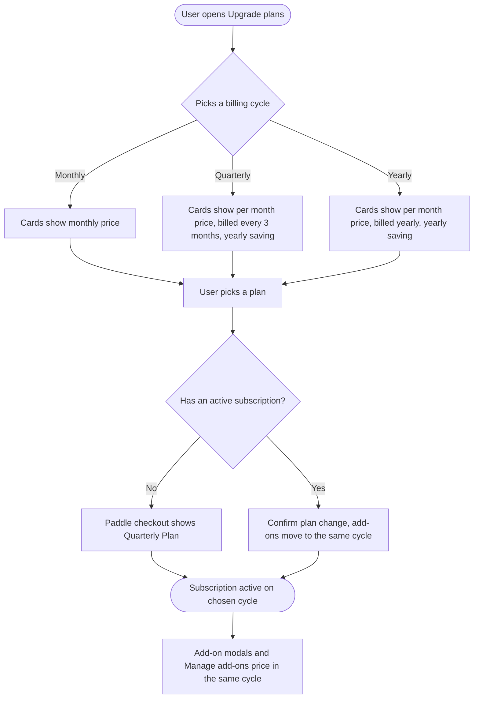
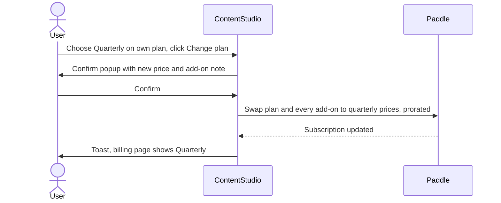

# Workflow: Quarterly Billing Cycle

**Scope:** new Paddle Billing plans only (Standard, Advanced, Agency Unlimited, API plan and their card-trial copies). Legacy plans keep today's two-cycle behavior untouched.

---

## 1. Feature Placement

Quarterly is not a new page. It is a third billing cycle that has to appear correctly everywhere a cycle is chosen, priced or displayed:

| Surface | Where the user meets it | What changes |
|---|---|---|
| **Upgrade plans modal** | Header "Upgrade" button, Settings → Billing → "Upgrade Subscription" / "Change Plan", limit-reached upsells, `/upgrade_subscription`, trial-expired and subscription-expired screens | Toggle becomes Monthly · Quarterly · Yearly. Plan cards and the comparison table price each cycle |
| **Card-trial onboarding** | Onboarding "Start your free trial" page | Same 3-way toggle. Quarterly card trials can be started |
| **Checkout** | Paddle checkout modal after picking a plan | Cycle badge and "Billing cycle:" row say "Quarterly Plan" / "Quarterly" |
| **Billing settings** | Settings → Billing | Plan card shows the cycle and the next renewal amount per quarter |
| **On/off add-on unlock modals** | Social Listening unlock, SAML SSO upgrade, White Label upgrade | Only the tile for the user's current cycle is shown, at that cycle's price |
| **Manage add-ons** | Settings → Billing → "Upgrade Limits", limit-exceeded prompts | Rows show monthly × 3. A Discount line shows the plan's quarterly %, and New Total is discounted. The summary says "Quarterly Plan" and "/ quarterly" |
| **Auto-scale limits** | Settings → Billing → Auto-scale | Unit reads "quarter" for quarterly subscribers |

---

## 2. Workflow Diagram (Overview)

---

## 3. User Flow (happy path: new customer picks quarterly)

1. The user clicks **Upgrade** in the header. The Upgrade plans modal opens with the toggle on **Yearly**, the same default as today.
2. The user clicks **Quarterly**. Every card switches to its quarterly price:
   - The big number is the per-month price, for example **$59/month** for Advanced.
   - Under it: "$177 billed every 3 months".
   - A green pill: "Save $120 per year".
3. The user clicks **Choose Plan** on Advanced. The Paddle checkout opens:
   - The badge reads **Quarterly Plan**.
   - The Order Summary row reads **Billing cycle: Quarterly**.
   - Total is $177 plus tax.
4. The user pays. The subscription is active on Advanced, billed every 3 months.
5. In **Settings → Billing**, the plan card shows **Advanced · Quarterly**, a Renewal Amount of $177, and the next renewal date 3 months out.
6. Later, the user opens **Unlock Social Listening**:
   - They see a single tile, **Quarterly · $254 every 3 months**, already selected.
   - They click **Unlock Social Listening** and confirm. The add-on is added to the quarterly subscription.
7. The user opens **Manage add-ons** and adds 5 social accounts:
   - The row reads "+ $75/quarter": $5 × 5 accounts × 3 months, shown at full price the same way annual rows are today.
   - The summary pill reads **Quarterly Plan**, and "Add-on Additions" reads +$75.
   - The **Discount** row shows **14.49%**.
   - New Total reads "$64.13 / quarterly", which is the discounted amount.

---

## 4. Alternative Flows

### 4.1 Existing monthly or annual subscriber switches to quarterly

1. The user opens Upgrade plans. The toggle is pre-set to **their current cycle**.
2. They click **Quarterly**. On their own plan's card, the CTA changes from "Current Plan" to **Change plan**.
3. They click **Change plan**. The confirm popup shows:
   - Title: "Confirm Plan Change"
   - Body: "You're switching Advanced to quarterly billing. You'll pay $177 every 3 months. Any add-ons on your subscription move to quarterly billing too, and you'll be charged or credited the difference right away."
4. They click **Confirm**. The plan and every add-on move to their quarterly prices in one change, with proration.

### 4.2 Quarterly subscriber opens an add-on unlock modal

- They see only the **Quarterly** tile. Monthly and Annual are not shown, not even disabled.
- For monthly and annual subscribers on the new billing, the modal likewise shows only their own cycle's tile. Today the other tile is shown greyed out, so this changes their view too.

### 4.3 Legacy (Paddle Classic) subscriber

No change. They keep today's two-cycle behavior and never see a Quarterly option:
- Plans modal: the existing legacy notice.
- Add-on modals: both tiles selectable.
- Classic checkout: unchanged.

### 4.4 Card-trial user

- On the onboarding trial page they can pick **Quarterly**. Checkout shows "7 days free" and "Due on {date}: $177".
- A trial user who clicks **Change Trial Plan** keeps today's behavior: the toggle is hidden and they keep their chosen cycle.

### 4.5 Errors

| Situation | What the user sees |
|---|---|
| Quarterly price not available for the chosen plan (misconfiguration) | Toast: "We couldn't load quarterly pricing for this plan. Please try again in a minute, or contact support if it keeps happening." The plan's CTA is disabled while prices fail to load |
| Plan change fails at Paddle | Existing failure toast. The subscription stays on the old cycle |
| Subscription is past due or paused | Existing block message. No cycle change is allowed |

---

## 5. Key Design Decisions

### 5.1 Toggle labels and savings badges

| Option | Pros | Cons |
|---|---|---|
| **A. Monthly · Quarterly "Save up to 14%" · Yearly "Save up to 34%"** (recommended) | Both discounts are visible up front, and annual stays clearly the best | Two badges on one control |
| B. Badge on Yearly only | Cleaner | Quarterly's saving only appears on the cards |

**Recommendation: A.** Stakeholders asked for the discount % to be visible.

### 5.2 Default toggle position

| Option | Recommendation |
|---|---|
| **Current cycle for subscribers, Yearly for everyone else** | **Recommended.** Keeps today's annual-first default and fixes quarterly users landing on Monthly |
| Always Yearly | Subscribers would have to find their own cycle |

### 5.3 Add-on unlock modals

| Option | Recommendation |
|---|---|
| **Show only the current cycle's tile, pre-selected** | **PO decision.** Paddle can't mix cycles on a subscription, so the other tiles are never purchasable |
| Show all, disable the others | Today's behavior. It becomes noisy with three tiles |

### 5.4 Quarterly price in Manage add-ons

**PO decision: mirror annual exactly.**
- Each row and the Additions and Removals lines show the full price: monthly × 3 for quarterly, × 12 for annual.
- The **Discount** line shows the plan's discount %.
- **New Total** is the discounted amount.
- Annual stays exactly as it is today.

---

## 6. Integration with Existing Features

- **Plan limits and credits:** unchanged. Credits still reset monthly, so a quarterly plan gets the same monthly allowances.
- **Upsell entry points:** limit-exceeded modals, AI credit upsells and the listening preview upsell all open the same plans or add-on modals. They get quarterly with no extra work.
- **Auto-scale social accounts:** the per-account unit follows the subscription cycle ("/account/quarter").
- **White-label domains:** the plans modal already hides the API plan there, and quarterly follows the same rules. Colors use theme variables.
- **Public API, CLI and MCP:** the limits response gains `billing_cycle: "quarterly"` alongside `is_annually`.
- **Helpin and Frill widgets:** plan-cycle labels gain "Quarterly".
- **Mobile app:** no impact. It only sells an iOS monthly plan.

---

## 7. Trackable Actions (Usermaven)

All actions reuse existing events. Quarterly only adds a new value to their billing cycle property.

| Action | Existing event | Change |
|---|---|---|
| Completes plan checkout | `plan_upgraded` | `plan_billing_period` gains `'quarterly'`, read from the price's interval and frequency |
| Buys White Label | `white_label_purchased` | `billing_cycle` gains `'quarterly'` |
| Buys quantity add-ons | `addons_limits_updated`, `addon_purchased` | `billing_cycle` gains `'quarterly'`. Prices use ×3, and `total_cost` is the discounted New Total |
| Switches an existing plan to quarterly | `plan_upgraded` (same path) | Same payload, `plan_billing_period: 'quarterly'` |

---

## 8. Scope Recommendation

### v1 (this epic)

- **Backend:**
  - quarterly Paddle prices and plan records
  - a real billing cycle in the API
  - quarterly add-on pricing
  - revenue (MRR) maths
- **Frontend:**
  - 3-way toggle, plan cards, comparison table and card-trial page
  - checkout labels
  - billing settings cycle display
  - single-tile unlock modals (Social Listening, SAML SSO, White Label)
  - Manage add-ons: rows at ×3, quarterly discount on New Total
  - auto-scale unit
  - analytics values
  - the slug lists and cycle mappers
- **Copy fixes in the same modals:**
  - White Label "select a plan" tooltip ($25/$250 → $50/$500)
  - remove the unused SAML subtexts

### Deferred

- Quarterly for legacy (Classic) plans.
- A White Label Reseller purchase modal (none exists today).
- The pre-existing price mismatches (Social Listening plan details, API plan website price).
