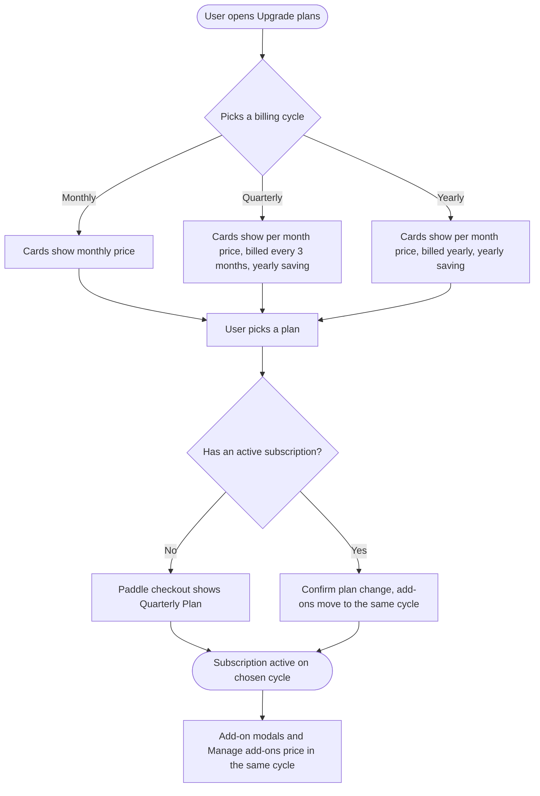

# **PRD: Quarterly Billing Cycle**

**Author:** Ghulam Jaffar (Product Owner)
**Last Updated:** 2026-09-25
**Status:** Approved
**Target Release:** Q4 2026
**Pricing reference (prototype):** https://claude.ai/artifact/Mtqht713YfeT9QYqcNxA6b

---

## **1\. Overview**

ContentStudio sells its plans on two billing cycles, monthly and annual. We are adding a third, **quarterly**, billed every 3 months at about 14% off monthly (10.53% on the API plan). It covers the four current Paddle Billing plans (Standard, Advanced, Agency Unlimited and API plan) and their 7-day card-trial copies. On/off add-ons bought on a quarterly plan get exactly their plan's quarterly discount. The work is mostly making every billing screen understand a third cycle:
- the upgrade plans modal and the card-trial onboarding page
- checkout
- the billing settings page
- the add-on unlock modals
- Manage add-ons

Legacy plans are untouched. Annual prices, and annual add-on prices, stay exactly as they are.

---

## **2\. Problem Statement**

**What problem are we solving?**

Customers choose between the cheapest per-month price, which requires committing a full year up front, and full flexibility at full price. Agencies and SMBs that budget by quarter have no middle option. Many of them stay on monthly, paying 29-34% more than annual and renewing 12 times a year, and every renewal is a chance for a failed payment or a cancellation.

**Who has this problem?**

- **Agencies** that bill their own clients quarterly.
- **SMB marketing teams** with quarterly budgets.
- **Monthly subscribers** who want a saving without committing for a year.

In the category, Sendible is the only competitor with self-serve quarterly billing, and it doesn't advertise it. Hootsuite offers quarterly terms only to enterprise customers, through sales.

**What happens if we don't solve it?**

- **Revenue:** price-sensitive customers stay on monthly, which has more renewal events and more involuntary churn.
- **Missed differentiator:** we miss a cheap way to stand out, since no competitor shows quarterly on its pricing page.
- **Broken billing screens:** billing could still be configured in Paddle, but every screen would show a quarterly subscriber as "Monthly". Add-ons would be priced at monthly rates and revenue reporting would be wrong.

---

## **3\. Goals & Success Metrics**

| Goal | Metric | Target | How We'll Measure |
| ----- | ----- | ----- | ----- |
| Primary: give monthly buyers a committed middle option | Share of new paid subscriptions on quarterly | ≥ 10% in 90 days | `plan_upgraded` with `plan_billing_period: 'quarterly'` |
| Secondary: move existing monthly subscribers up | Monthly → quarterly switches | ≥ 5% of active monthly subscribers in 90 days | Paddle subscription updates + `plan_upgraded` |
| Secondary: add-on attach on quarterly | On/off add-on purchases by quarterly subscribers | At parity with the monthly attach rate | `white_label_purchased`, `addon_purchased`, `addons_limits_updated` by `billing_cycle` |
| Guard rail: don't cannibalize annual | Annual share of new paid subscriptions | Drops by no more than 3 points | Paddle billing data |
| Guard rail: billing correctness | Billing support tickets about the wrong cycle or price | 0 new ticket types after launch | Support inbox tags |

### **3.1 Analytics Events (Usermaven)**

No new event names. Quarterly adds a new value to the cycle property of existing events.

| Event Name | Trigger | Payload | What we measure with it |
| ----- | ----- | ----- | ----- |
| `plan_upgraded` | FE: Paddle checkout completes, or an existing plan is changed to another cycle | `{ plan_name, plan_price, plan_billing_period: 'monthly' \| 'quarterly' \| 'yearly', paddle_customer }` | Quarterly share of new subscriptions, and cycle switches |
| `white_label_purchased` | FE: White Label bought from its upgrade modal | `{ billing_cycle: 'monthly' \| 'quarterly' \| 'annual', new_billing, current_plan }` | White Label attach rate by cycle |
| `addons_limits_updated` | FE: user confirms a purchase in Manage add-ons | `{ billing_cycle: 'monthly' \| 'quarterly' \| 'annually', current_plan, total_cost, addons }` | Quantity add-on revenue by cycle. `total_cost` is the discounted New Total |
| `addon_purchased` | FE: an individual add-on bought through Manage add-ons | `{ billingCycle: 'monthly' \| 'quarterly' \| 'annually', addonName, price, quantity }` | Per-add-on uptake by cycle. For quarterly, `price` is quantity × 3 |

---

## **4\. Target Users**

**Primary Persona:**
**Agency owner or account lead.** They run social for several clients and bill those clients quarterly. They want their tooling cost to line up with their revenue cycle, and they know billing well.

**Secondary Persona:**
**SMB marketing manager.** They work to a quarterly budget. They want a discount without a 12-month commitment, and they are not technical.

**Non-Users (explicitly out of scope):**
- Legacy Paddle Classic, FastSpring, Apple in-app, lifetime and deal-plan customers
- Enterprise contracts sold by sales
- Mobile app purchasers

---

## **5\. User Stories / Jobs to Be Done**

| ID | As a... | I want to... | So that... | Priority |
| ----- | ----- | ----- | ----- | ----- |
| US-1 | Prospective customer | pick Quarterly in the plans toggle and see each plan's per-month price, quarterly charge and yearly saving | I can compare it with monthly and yearly at a glance | Must Have |
| US-2 | Prospective customer | check out on a quarterly plan, including the 7-day card trial | I pay every 3 months | Must Have |
| US-3 | Monthly or annual subscriber | switch my current plan to quarterly | I can change my commitment level without contacting support | Must Have |
| US-4 | Quarterly subscriber | see "Quarterly" and my quarterly renewal amount on the billing page | I know what I'll be charged and when | Must Have |
| US-5 | Quarterly subscriber | buy Social Listening, SAML SSO or White Label at the quarterly price, with only my cycle shown | I'm never offered a price I can't buy | Must Have |
| US-6 | Quarterly subscriber | add extra accounts, users or credits in Manage add-ons, see the quarterly cost and the discount | I know the exact charge before I confirm | Must Have |
| US-7 | Quarterly subscriber | see the auto-scale price per quarter | I understand what extra accounts will cost | Should Have |
| US-8 | Developer using the public API | read the real billing cycle from the limits endpoint | my integration can tell quarterly apart from monthly | Should Have |

---

## **6\. Requirements**

### **6.1 Must Have (P0)**

**Pricing**
- Quarterly prices for the four new Paddle Billing plans and their card-trial copies:
  - Standard $75 ($25/mo)
  - Advanced $177 ($59/mo)
  - Agency Unlimited $357 ($119/mo)
  - API plan $51 ($17/mo)
- Quarterly on/off add-on prices at the plan's quarterly discount, rounded to whole dollars:
  - White Label and White Label Reseller: $129 on Standard, $128 on Advanced and Agency Unlimited
  - SAML SSO: $388 on Standard, $385 on Advanced and Agency Unlimited
  - Social Listening: $254 on Advanced, $385 on Agency Unlimited
- Every quantity add-on gets a quarterly price in Paddle, in all environments.

**Backend**
- A real billing cycle (`monthly` | `quarterly` | `annually`) resolved from the Paddle interval and frequency, and exposed in the plan and limits responses. `is_annually` stays for backward compatibility.
- When a subscription moves to quarterly, every add-on on it moves to its quarterly price in the same change, prorated.

**Frontend: plans and checkout**
- A 3-way billing toggle (Monthly · Quarterly · Yearly) on the plans modal, the comparison table and the card-trial onboarding page.
- Plan cards show the quarterly price, and the CTA states (current, change plan, upgrade, downgrade) work per cycle.
- Checkout labels say "Quarterly Plan" / "Quarterly".

**Frontend: billing page and add-ons**
- The billing page shows the cycle.
- The Social Listening, SAML SSO and White Label unlock modals show only the current cycle's tile for Paddle Billing users.
- Manage add-ons for quarterly:
  - rows at monthly × 3
  - a Discount line with the plan's quarterly %
  - a discounted New Total
  - "Quarterly Plan" and "/ quarterly" labels

**Analytics**
- The analytics payloads carry `quarterly` (§3.1).

### **6.2 Should Have (P1)**

- The auto-scale unit reads "quarter" for quarterly subscribers.
- The public API `billing_cycle` field is documented, and the CLI and MCP surface it.
- Revenue (MRR) reporting counts a quarterly charge as a third per month.
- Plan-cycle labels in the Helpin and Frill widgets include "Quarterly".
- The "Prorated charges" tooltip in Manage add-ons says "billing period" instead of "month".

### **6.3 Nice to Have (P2)**

- Copy fixes in the touched modals:
  - White Label "select a plan" tooltip ($25/$250 → $50/$500)
  - remove the unused SAML subtexts

### **6.4 Explicitly Out of Scope**

- Quarterly for legacy Paddle Classic or any non-Paddle-Billing plan.
- Changing annual plan prices or annual add-on prices.
- AI Auto-Reply pricing (it is not an on/off add-on).
- A White Label Reseller purchase modal (none exists today).
- A quarterly version of the Social Listening launch promo.
- Mobile app changes.
- Fixing pre-existing price mismatches: Social Listening plan details, API plan website price.

---

## **7\. User Flow (High Level)**

1. The user opens Upgrade plans from the header, Settings → Billing, or any upsell.
2. The user picks **Quarterly** on the toggle. Subscribers land on their own cycle; everyone else starts on Yearly.
3. Plan cards show "$59/month · $177 billed every 3 months · Save $120 per year".
4. The user picks a plan:
   - New buyers go to checkout, labelled "Quarterly Plan".
   - Existing subscribers confirm a plan change, and their add-ons move with it.
5. The billing page shows "Quarterly" and the quarterly renewal amount.
6. Add-on modals show only the quarterly option at the quarterly price. Manage add-ons prices rows at × 3 and discounts the total.

The cycle-switch sequence diagram is in the workflow doc, §4.1.

---

## **8\. Business Rules & Constraints**

| Rule ID | Rule | Rationale |
| ----- | ----- | ----- |
| BR-1 | Quarterly is offered only on the Standard, Advanced, Agency Unlimited and API plans on Paddle Billing, and their card-trial copies | Legacy plans run on a different billing stack |
| BR-2 | Quarterly plan prices: $75 / $177 / $357 / $51 every 3 months (13.79% / 14.49% / 14.39% / 10.53% off monthly) | PO-approved pricing, 2026-09-25 |
| BR-3 | A quarterly on/off add-on price = monthly price × 3 × (1 − plan's quarterly discount), rounded to the nearest whole dollar | Add-ons inherit the plan's quarterly discount exactly, never a custom one |
| BR-4 | Annual plan and annual add-on prices do not change (White Label $500, SAML SSO $1,440, Social Listening $843 / $1,282) | PO decision. Annual add-ons keep their own discounts |
| BR-5 | Every item on a subscription shares one billing cycle. Changing the plan's cycle moves every add-on to the same cycle in the same change | Paddle can't mix cycles on one subscription |
| BR-6 | For Paddle Billing users, add-on unlock modals show only the current cycle's option | The other cycles can never be bought, so showing them only confuses |
| BR-7 | In Manage add-ons, rows and the Additions/Removals lines show full price (monthly × 3 or × 12). The Discount line shows the plan's %, and New Total is the discounted amount | Keeps today's annual layout. The PO confirmed rows stay undiscounted |
| BR-8 | Credits keep resetting monthly for every cycle | Quarterly plans get the same monthly allowances as other cycles |
| BR-9 | Legacy Classic users never see a Quarterly option anywhere | Avoids offering a price their billing can't charge |

---

## **9\. Open Questions**

| Question | Options | Owner | Due Date | Decision |
| ----- | ----- | ----- | ----- | ----- |
| Where is White Label Reseller bought today, and does that path need a quarterly option? | Sales-assisted only / add a path later | Ghulam Jaffar | Before sprint start | Pending |
| Should the Social Listening launch promo get a quarterly version (e.g. 40% off the first quarter)? | Yes / No promo on quarterly | Ghulam Jaffar | Before launch | Pending |
| API plan monthly price is $15 on the website but $19 in the app. Quarterly is based on $19. Is that correct? | Keep $19 / move to $15 and re-derive | Ghulam Jaffar | Before Paddle prices are created | Pending |

---

## **10\. Risks & Mitigations**

| Risk | Likelihood | Impact | Mitigation |
| ----- | ----- | ----- | ----- |
| A missed two-cycle check shows a quarterly user as "Monthly" somewhere, or charges them monthly add-on prices | High | High | One backend billing cycle field that every screen reads, instead of slug sniffing. QA checklist per surface |
| An add-on is left on its old cycle when a subscription switches, so Paddle rejects the change | Medium | High | The backend swaps every item in one prorated update. QA covers switching with add-ons attached |
| Quarterly cannibalizes annual | Medium | Medium | Keep a gap of 14+ points to annual, keep Yearly as the default with "Save up to 34%". Watch the annual-share guard rail |
| Paddle price IDs missing in one environment | Medium | Medium | A price-configuration checklist per environment. The UI disables the CTA and shows an error toast if prices fail to load |
| MRR reports double-count or undercount quarterly revenue | Medium | Medium | Update the revenue maths in the same epic |
| Three tiles or badges crowd the plans modal on small screens | Low | Low | The FE toggle story requires the 3-way toggle to fit at 375px wide |

---

## **11\. Dependencies**

- **Internal, Paddle price configuration:** quarterly prices for plans, card-trial copies and every add-on, in sandbox, staging and production. They are referenced in backend `config/paddle.php` and the frontend price map.
- **Internal, backend billing:**
  - the cycle resolver
  - `*-quarterly` plan records
  - the `billing_cycle` API field
  - quarterly add-on price lookups (White Label, SAML SSO, Social Listening tiers, quantity add-ons, auto-scale)
  - MRR maths
- **Internal, frontend billing module:** the plans modal, checkout, billing settings page, the three unlock modals and Manage add-ons.
- **External, Paddle Billing:** 3-month prices (`interval: month`, `frequency: 3`), proration on cycle change, and one billing cycle per subscription.
- **Blockers:** the API plan price decision (open question 3) must land before the Paddle prices are created.

---

## **12\. Appendix**

- Pricing reference page: https://claude.ai/artifact/Mtqht713YfeT9QYqcNxA6b
- Workflow doc, with the cycle-switch sequence diagram
- Research doc, with the competitor analysis and codebase map
- Paddle, subscription creation and billing cycles: https://developer.paddle.com/build/lifecycle/subscription-creation
- Sendible quarterly discounts: https://support.sendible.com/hc/en-us/articles/19771965502493-Subscription-discounts

---

## **Changelog**

| Date | Author | Changes |
| ----- | ----- | ----- |
| 2026-09-25 | Ghulam Jaffar | Initial draft. Pricing locked, annual add-on prices unchanged, AI Auto-Reply excluded, Manage add-ons rows kept undiscounted |
