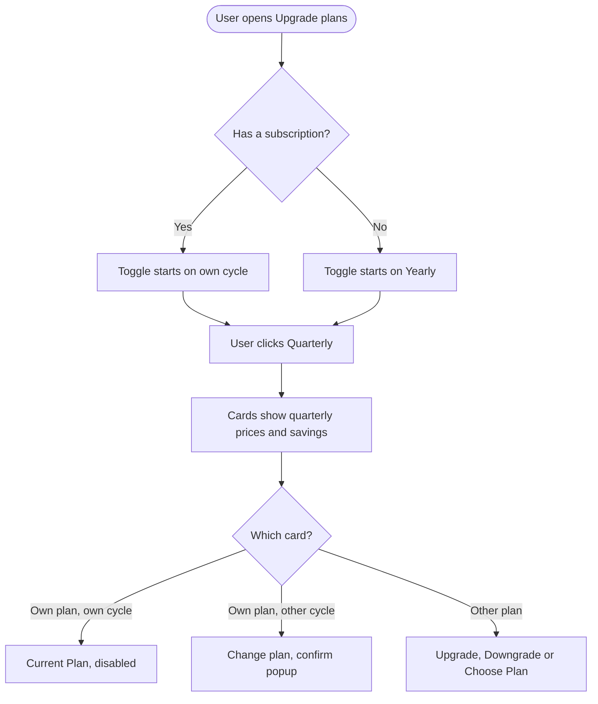
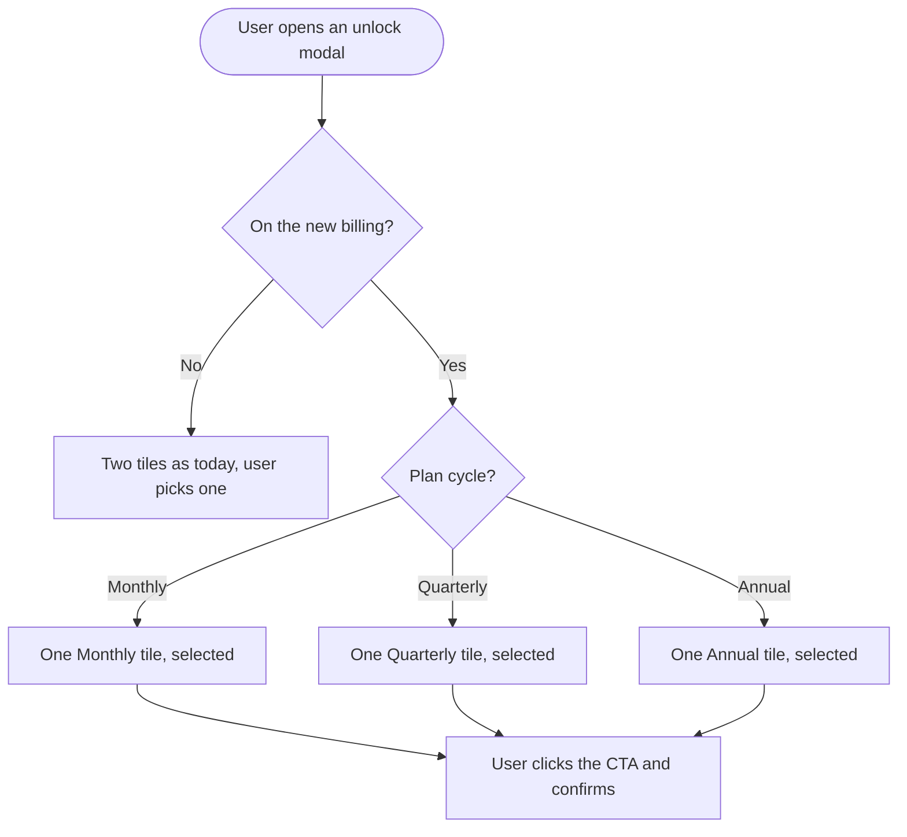

# Epic: Quarterly Billing Cycle

## Epic description

**Pricing reference (prototype):** https://claude.ai/artifact/Mtqht713YfeT9QYqcNxA6b

ContentStudio sells its plans on two billing cycles today, monthly and annual. This epic adds a third, **quarterly**. It is billed every 3 months at about 14% off the monthly price: Standard $75, Advanced $177, Agency Unlimited $357 and the API plan $51 per quarter. It covers the four current plans on the new billing and their 7-day card-trial copies. Legacy plans keep today's two cycles, and annual plan and annual add-on prices don't change.

On/off add-ons bought on a quarterly plan get exactly their plan's quarterly discount:
- White Label and White Label Reseller: $129 on Standard, $128 on Advanced and Agency Unlimited
- SAML SSO: $388 on Standard, $385 on Advanced and Agency Unlimited
- Social Listening: $254 on Advanced, $385 on Agency Unlimited

In Manage add-ons, quarterly works the way annual does today. Rows are monthly × 3, a Discount line shows the plan's quarterly %, and the New Total is discounted.

Most of the work is making every billing surface understand a third cycle:
- the plans toggle and cards
- the card-trial onboarding page
- checkout
- the billing page
- the add-on unlock modals, which now show only the customer's own cycle
- Manage add-ons and auto-scale

The backend exposes one real billing cycle so the screens stop guessing from plan names. Success means a meaningful share of new subscriptions choose quarterly without eating into annual, and no quarterly customer ever sees "Monthly" or a monthly price.

The Research, Workflow and PRD docs are attached to this epic.

---

## Stories

1. [BE] Add quarterly Paddle prices and plan records for the new billing plans
2. [BE] Return the real billing cycle for every subscription
3. [BE] Price add-ons on quarterly subscriptions
4. [FE] Add a Quarterly option to the plans toggle, plan cards and comparison table
5. [FE] Show the quarterly cycle in checkout, the billing page and cycle labels
6. [FE] Show only the current billing cycle in add-on unlock modals
7. [FE] Price quarterly add-ons in Manage add-ons and auto-scale
8. [FE] Add the Quarterly billing option to the contentstudio.io pricing page

---

## [BE] Add quarterly Paddle prices and plan records for the new billing plans

### Description:

As a **customer choosing a plan**, I want to be able to subscribe to Standard, Advanced, Agency Unlimited or the API plan on quarterly billing, including the 7-day card trial, so that I'm charged every 3 months at the quarterly price.

This story creates the quarterly plan prices in Paddle and the matching ContentStudio plans. Plan limits and features are identical to the same plan on monthly or annual. Only the price and the billing interval differ.

---

### Workflow:

1. A customer picks a quarterly plan in the plans modal and completes checkout.
2. ContentStudio recognises the purchase as that plan on quarterly billing and applies the plan's usual limits and features.
3. A customer who already has a subscription switches their plan to quarterly. They are charged or credited the prorated difference right away and billed every 3 months from then on.

---

### Acceptance criteria:

**Prices**
- [ ] Paddle has quarterly prices (billed every 3 months) in sandbox, staging and production:
  | Plan | Price every 3 months |
  |---|---|
  | Standard | $75 |
  | Advanced | $177 |
  | Agency Unlimited | $357 |
  | API plan | $51 |
- [ ] Each plan also has a card-trial quarterly price at the same amount, with the same 7-day free trial as the existing card-trial prices
- [ ] No discount code is applied to quarterly purchases. The quarterly price is already the discounted price, so the checkout total equals the amounts above plus tax

**Plans**
- [ ] A ContentStudio plan exists for each quarterly price (8 in total, including card-trial copies). Each one has exactly the same limits and features as the same plan on monthly
- [ ] A subscription created or updated with a quarterly price is recognised as the matching quarterly plan, and the customer gets that plan's limits and features immediately
- [ ] The existing upgrade and plan-change flow accepts a quarterly price:
  - The change is prorated immediately.
  - Past-due and paused subscriptions are blocked exactly as today.
- [ ] A trial or card-trial user can pick a quarterly plan, and after the trial is billed $75 / $177 / $357 / $51 every 3 months
- [ ] Credits (AI, X posting, API, auto-reply) keep resetting monthly for quarterly subscribers, with the same monthly allowances as the plan's other cycles
- [ ] Legacy plans are unchanged and have no quarterly option

---

### Mock-ups:

N/A, backend only. Pricing reference (prototype): https://claude.ai/artifact/Mtqht713YfeT9QYqcNxA6b

---

### Impact on existing data:

- New plan records are added, and existing plan records are untouched.
- Existing subscriptions keep their current cycle until the customer changes it.

---

### Impact on other products:

- **Revenue reporting and analytics:** they see a new plan type (see **[BE] Return the real billing cycle for every subscription**).
- **Mobile app:** no impact.

---

### Dependencies:

- PRD open question on the API plan price ($15 on the website vs $19 in the app) must be settled before the Paddle prices are created.

---

### Global quality & compliance (wherever applicable)

- [ ] Mobile responsiveness — N/A, backend only
- [ ] Multilingual support (frontend + backend, translations available or fallback handled)
- [ ] UI theming support — N/A, backend only
- [ ] White-label domains impact review
- [ ] Cross-product impact assessment (web, mobile apps, Chrome extension)
- [ ] Developer surfaces coverage (any new or changed API is reflected in the public API, CLI, MCP server and automation apps, N/A when nothing API-facing changes)

---

## [BE] Return the real billing cycle for every subscription

### Description:

As a **ContentStudio user, and as a developer building on our public API**, I want the app and the API to know whether my subscription is monthly, quarterly or annual, so that every screen, integration and report shows my real billing cycle instead of guessing.

Today the backend only answers "annual or not", so a quarterly subscription would be reported as monthly. This story adds one billing cycle value, derived from how Paddle bills the subscription, and uses it for the API, analytics and revenue reporting.

---

### Workflow:

1. A quarterly subscriber opens any billing screen. The app receives "quarterly" as their billing cycle and labels everything accordingly.
2. A developer calls the public limits endpoint and reads `billing_cycle: "quarterly"` next to the existing `is_annually: false`.
3. Finance opens revenue reports. A $357 quarterly charge counts as $119 of monthly recurring revenue.

---

### Acceptance criteria:

- [ ] A subscription billed every month reports `billing_cycle: "monthly"`, every 3 months reports `"quarterly"`, and every year reports `"annually"`
- [ ] The plan details and the subscription limits responses include `billing_cycle`
- [ ] `is_annually` is still returned: `true` only for annual subscriptions and `false` for quarterly, so existing clients keep working
- [ ] The limits response includes the discount % for the subscription's current cycle, matching what is actually billed (for example Advanced quarterly 14.49%, Advanced annual 28.99%, monthly 0)
- [ ] The public API documentation for the limits endpoint lists `billing_cycle` with its three values
- [ ] The CLI and MCP server return `billing_cycle` wherever they return subscription limits
- [ ] Revenue reporting counts a quarterly charge as one third per month. For example, a $357 quarterly charge adds $119 to MRR and $1,428 to ARR
- [ ] Server-side billing events sent to Usermaven carry `quarterly` for quarterly subscriptions, not `month`
- [ ] Legacy subscriptions report `monthly` or `annually` exactly as they are billed today

---

### Mock-ups:

N/A, backend only. Pricing reference (prototype): https://claude.ai/artifact/Mtqht713YfeT9QYqcNxA6b

---

### Impact on existing data:

No data migration. The cycle is derived from the existing Paddle billing information stored on each subscription.

---

### Impact on other products:

- **Public API, CLI, MCP and automation apps:** a new response field.
- **Revenue dashboards:** quarterly is counted correctly.
- **Mobile app:** no impact.

---

### Dependencies:

- **[BE] Add quarterly Paddle prices and plan records for the new billing plans**

---

### Global quality & compliance (wherever applicable)

- [ ] Mobile responsiveness — N/A, backend only
- [ ] Multilingual support (frontend + backend, translations available or fallback handled)
- [ ] UI theming support — N/A, backend only
- [ ] White-label domains impact review
- [ ] Cross-product impact assessment (web, mobile apps, Chrome extension)
- [ ] Developer surfaces coverage (any new or changed API is reflected in the public API, CLI, MCP server and automation apps, N/A when nothing API-facing changes)

---

## [BE] Price add-ons on quarterly subscriptions

### Description:

As a **quarterly subscriber**, I want every add-on I buy to be billed quarterly at my plan's quarterly discount, so that my plan and add-ons renew together on one invoice at the price I was shown.

Paddle can't mix billing cycles on one subscription. Every add-on therefore needs a quarterly price, and switching a plan to quarterly has to move its add-ons with it.

---

### Workflow:

1. A quarterly subscriber on Advanced unlocks Social Listening. They are charged $254 for the quarter, prorated to their renewal date.
2. They add 5 social accounts in Manage add-ons. They are charged the discounted quarterly amount shown in the modal.
3. A monthly subscriber with White Label switches to quarterly. The plan and White Label both move to their quarterly prices in one prorated change.

---

### Acceptance criteria:

**On/off add-ons**
- [ ] Paddle has quarterly prices in sandbox, staging and production for each on/off add-on, per plan:
  | Add-on | Standard | Advanced | Agency Unlimited |
  |---|---|---|---|
  | White Label | $129 | $128 | $128 |
  | White Label Reseller | $129 | $128 | $128 |
  | SAML SSO | $388 | $385 | $385 |
  | Social Listening | not offered | $254 | $385 |
- [ ] Buying White Label, SAML SSO or Social Listening on a quarterly subscription adds the quarterly price for the customer's plan, and never a monthly or annual price
- [ ] The API plan has no on/off add-ons, so no API plan prices are created for them
- [ ] Annual and monthly add-on prices are unchanged: White Label $50 / $500, SAML SSO $150 / $1,440, Social Listening $99 / $843 and $150 / $1,282

**Quantity add-ons**
- [ ] Every quantity add-on has a quarterly price: workspaces, social accounts (every tier), team members, media storage, automations, AI text / image / video / clip credits, X posting credits, API credits, auto-reply credits, listening topics, listening mentions
- [ ] The amount charged for quantity add-ons on a quarterly subscription equals the Manage add-ons New Total: monthly unit price × quantity × 3, less the plan's quarterly discount (13.79% / 14.49% / 14.39% / 10.53%)
- [ ] The Manage add-ons preview returns the same amount the customer is then charged

**Auto-scale**
- [ ] The social account auto-scale quote for a quarterly subscriber returns the per-account price per quarter, with unit `quarter`

**Cycle switches**
- [ ] When a subscription switches to or from quarterly, every add-on on it moves to its price for the new cycle in the same prorated change
- [ ] If any add-on has no price for the new cycle, the change is rejected with a clear error and the subscription stays exactly as it was

---

### Mock-ups:

N/A, backend only. Pricing reference (prototype): https://claude.ai/artifact/Mtqht713YfeT9QYqcNxA6b

---

### Impact on existing data:

New add-on prices are added. Existing add-on subscriptions are unchanged until the customer changes cycle.

---

### Impact on other products:

- **Manage add-ons, auto-scale and unlock modals** read these prices (see the FE stories).
- **Mobile app:** no impact.

---

### Dependencies:

- **[BE] Add quarterly Paddle prices and plan records for the new billing plans**
- **[BE] Return the real billing cycle for every subscription**

---

### Global quality & compliance (wherever applicable)

- [ ] Mobile responsiveness — N/A, backend only
- [ ] Multilingual support (frontend + backend, translations available or fallback handled)
- [ ] UI theming support — N/A, backend only
- [ ] White-label domains impact review
- [ ] Cross-product impact assessment (web, mobile apps, Chrome extension)
- [ ] Developer surfaces coverage (any new or changed API is reflected in the public API, CLI, MCP server and automation apps, N/A when nothing API-facing changes)

---

## [FE] Add a Quarterly option to the plans toggle, plan cards and comparison table

### Description:

As a **prospective customer or existing subscriber**, I want to pick Quarterly next to Monthly and Yearly and see each plan's quarterly price and saving, so that I can choose the billing cycle that fits my budget and switch to it myself.

This covers:
- the Upgrade plans modal, including every place it opens from: header Upgrade, Settings → Billing, limit upsells, the upgrade page and the trial or subscription expired screens
- the plan comparison table
- the card-trial onboarding page

---

### Workflow:

1. The user opens Upgrade plans:
   - A subscriber sees the toggle set to their own cycle.
   - Everyone else sees it on **Yearly**.
2. The user clicks **Quarterly**. Every card shows its per-month price, "$X billed every 3 months" and a "Save $Y per year" pill.
3. On their own plan's card:
   - If they are already on quarterly, the CTA reads **Current Plan**.
   - If they are on another cycle, it reads **Change plan**.
4. They click **Change plan** and see the confirm popup explaining the new price and that their add-ons move too. They click **Confirm**.
5. A new customer clicks **Choose Plan** and goes to checkout at the quarterly price.
6. On the onboarding trial page, the same toggle lets a card-trial user start a 7-day trial on a quarterly plan.

---

### Acceptance criteria:

**Toggle**
- [ ] The billing toggle is a `SegmentedControl` with three options, in this order: **Monthly**, **Quarterly**, **Yearly**
- [ ] **Quarterly** shows a badge "Save up to 14%". **Yearly** keeps its badge "Save up to 34%". Both badges use theme colors
- [ ] Hovering each option shows its tooltip:
  - Monthly: "Pay month to month. Change or cancel anytime."
  - Quarterly: "Pay every 3 months and save compared with monthly. Example: Advanced is $177 every 3 months instead of $207."
  - Yearly: "Pay once a year for the biggest saving. Example: Advanced is $588 a year instead of $828."
- [ ] The toggle starts on the user's current cycle when they have an active subscription (a quarterly subscriber lands on Quarterly), and on **Yearly** otherwise
- [ ] The same toggle appears in the comparison table's sticky header and on the card-trial onboarding page. Changing it in one place updates the cards and the table together
- [ ] The toggle stays hidden in the "Change Trial Plan" context, exactly as today
- [ ] At 375px wide, all three options and both badges stay readable without overlapping. The badges can wrap under their labels

**Plan cards on Quarterly**

- [ ] With Quarterly selected, each card shows:
  | Plan | Large price | Line under it | Pill |
  |---|---|---|---|
  | Standard | $25/month | $75 billed every 3 months | Save $48 per year |
  | Advanced | $59/month | $177 billed every 3 months | Save $120 per year |
  | Agency Unlimited | $119/month | $357 billed every 3 months | Save $240 per year |
  | API plan | $17/month | $51 billed every 3 months | Save $24 per year |
- [ ] The comparison table shows $25/mo, $59/mo, $119/mo and $17/mo in its price row when Quarterly is selected
- [ ] Monthly and Yearly cards and prices are unchanged
- [ ] On white-label domains, the API plan card stays hidden exactly as today

**CTA states**
- [ ] The card for the user's own plan on their own cycle shows **Current Plan**, disabled
- [ ] The card for their own plan on a different cycle shows **Change plan**
- [ ] Other cards show **Upgrade**, **Downgrade**, **Switch** or **Choose Plan** by the same rules as today

**Confirm and checkout**
- [ ] Clicking **Change plan** to move cycle opens a confirm popup:
  - Title: "Confirm Plan Change"
  - Body: "You're switching {plan name} to {cycle} billing. You'll pay {amount} {period}. Any add-ons on your subscription move to {cycle} billing too, and you'll be charged or credited the difference right away."
  - Buttons: "Confirm" and "Cancel"
  - Example: "You're switching Advanced to quarterly billing. You'll pay $177 every 3 months. ..."
  - {period} reads "every month", "every 3 months" or "every year"
- [ ] Choosing a quarterly plan without an active subscription opens checkout at the quarterly price, including for card-trial users on the onboarding page
- [ ] If quarterly prices can't be loaded for a plan:
  - That card's CTA is disabled.
  - A toast shows: "We couldn't load quarterly pricing for this plan. Please try again in a minute, or contact support if it keeps happening."
- [ ] A legacy subscriber sees no Quarterly option and the existing legacy notice, unchanged

**Analytics**
- [ ] When a quarterly checkout or cycle change completes, a `plan_upgraded` Usermaven event fires with `{ plan_name, plan_price, plan_billing_period: 'quarterly', paddle_customer }`

---

### Mock-ups:

See PRD section 7. Pricing reference: https://claude.ai/artifact/Mtqht713YfeT9QYqcNxA6b

---

### Impact on existing data:

None.

---

### Impact on other products:

Every upsell that opens the plans modal gets the Quarterly option automatically. The mobile app is not affected.

---

### Dependencies:

- **[BE] Add quarterly Paddle prices and plan records for the new billing plans**
- **[BE] Return the real billing cycle for every subscription**

---

### Global quality & compliance (wherever applicable)

- [ ] Mobile responsiveness (frontend only, N/A for backend-only stories)
- [ ] Multilingual support (frontend + backend, translations available or fallback handled)
- [ ] UI theming support (default + white-label, design library components are being used)
- [ ] White-label domains impact review
- [ ] Cross-product impact assessment (web, mobile apps, Chrome extension)
- [ ] Developer surfaces coverage — N/A, frontend only, nothing API-facing changes

---

## [FE] Show the quarterly cycle in checkout, the billing page and cycle labels

### Description:

As a **quarterly subscriber**, I want checkout, my billing page and every plan label in the app to say "Quarterly", so that I always know how often I'm billed and never see my plan described as monthly.

Today checkout, the billing page and several plan-label helpers only know monthly and annual, so a quarterly plan would show up as "Monthly".

---

### Workflow:

1. The user picks a quarterly plan. The checkout's Order Summary shows the **Quarterly Plan** badge and "Billing cycle: Quarterly".
2. The user pays and opens **Settings → Billing**. The plan card reads "Billed every 3 months" under the plan name, with "Renewal Amount: $177 / quarter" and the next renewal date.
3. In the subscriptions table, the renewal amount also reads "$177 / quarter".
4. Anywhere the app decides what the user can upgrade to, a quarterly Agency Unlimited subscriber is treated as being on the highest plan, the same as monthly or annual. The same goes for other plan-based features, such as the Social Listening tier.

---

### Acceptance criteria:

**Checkout**
- [ ] For a quarterly price, the checkout badge reads **Quarterly Plan** and the Order Summary row reads **Billing cycle: Quarterly**
- [ ] With a card trial, the badge still reads "{days} days free". The "Due on {date}" line shows the quarterly amount (for example $177)
- [ ] Monthly and annual checkouts are unchanged ("Monthly Plan" / "Annual Plan")

**Billing page**
- [ ] The billing page plan card shows a line under the plan name:
  - "Billed every 3 months" for quarterly
  - "Billed monthly" for monthly
  - "Billed yearly" for annual
- [ ] **Renewal Amount** shows the amount with a period suffix: "$177 / quarter", "$69 / month" or "$588 / year"
- [ ] The subscriptions table's Renewal Amount column uses the same suffixes

**Plan logic and labels**
- [ ] A quarterly subscriber gets exactly the same upgrade options, highest-plan behavior, add-on access and Social Listening tier as a subscriber on the same plan on monthly or annual
- [ ] The Helpin and Frill feedback widgets label a quarterly subscriber's plan cycle as "Quarterly"
- [ ] Legacy subscribers see today's labels, unchanged

---

### Mock-ups:

See PRD section 7. Pricing reference: https://claude.ai/artifact/Mtqht713YfeT9QYqcNxA6b

---

### Impact on existing data:

None.

---

### Impact on other products:

The Helpin and Frill widgets receive a new cycle value. The mobile app is not affected.

---

### Dependencies:

- **[BE] Return the real billing cycle for every subscription**

---

### Global quality & compliance (wherever applicable)

- [ ] Mobile responsiveness (frontend only, N/A for backend-only stories)
- [ ] Multilingual support (frontend + backend, translations available or fallback handled)
- [ ] UI theming support (default + white-label, design library components are being used)
- [ ] White-label domains impact review
- [ ] Cross-product impact assessment (web, mobile apps, Chrome extension)
- [ ] Developer surfaces coverage — N/A, frontend only, nothing API-facing changes

---

## [FE] Show only the current billing cycle in add-on unlock modals

### Description:

As a **customer on the new billing**, I want the Social Listening, SAML SSO and White Label unlock modals to show only the option for my own billing cycle, at the right price, so that I'm never offered a price I can't actually buy.

Add-ons always bill on the same cycle as the plan. Today these modals show both Monthly and Annual and grey out the one that doesn't apply, and a quarterly customer would see both enabled with nothing selected. After this story, customers on the new billing see a single tile for their cycle, already selected. Legacy customers keep both tiles.

---

### Workflow:

1. A quarterly subscriber on Advanced opens **Unlock Social Listening**. They see one tile, **Quarterly · $254 every 3 months**, already selected.
2. They click **Unlock Social Listening**. The confirm dialog opens, and they click **Proceed**.
3. The add-on is added to their subscription and billed with it every 3 months.
4. A monthly subscriber opening **Unlock Organization Single Sign-On** sees one tile, **Monthly · $150/month**, already selected.

---

### Acceptance criteria:

**Single-tile behavior (customers on the new billing)**
- [ ] In the Social Listening, SAML SSO and White Label unlock modals, a customer on the new billing sees exactly one price tile: the one for their current cycle. It is already selected
- [ ] The other cycles' tiles are not shown at all (not greyed out). The "You currently have {currentPlan} billing enabled..." tooltip no longer appears
- [ ] The CTA is enabled as soon as the modal opens, for anyone with billing access. Users without billing access see the existing no-access tooltip

**Tiles**
- [ ] Monthly tile:
  - Label "Monthly"
  - Price "$99/month" (Social Listening, Advanced), "$150/month" (Social Listening, Agency Unlimited), "$150/month" (SAML SSO) or "$50/month" (White Label)
  - Subtext "Billed with your plan every month."
- [ ] Quarterly tile:
  - Label "Quarterly"
  - Price "{amount} every 3 months"
  - Subtext "Billed with your plan every 3 months. Includes your plan's {discount}% quarterly discount."
  - Amounts and discounts by plan:
    | Add-on | Standard (13.79%) | Advanced (14.49%) | Agency Unlimited (14.39%) |
    |---|---|---|---|
    | Social Listening | not offered | $254 | $385 |
    | SAML SSO | $388 | $385 | $385 |
    | White Label | $129 | $128 | $128 |
- [ ] Annual tile:
  - Label "Annual" (White Label changes from "Yearly" to "Annual" for consistency)
  - Price "$843/year" / "$1,282/year" (Social Listening), "$1,440/year" (SAML SSO) or "$500/year" (White Label), unchanged
  - Subtext "Billed with your plan once a year."

**Purchase and confirm**
- [ ] Confirming a purchase on a quarterly plan adds the add-on at the quarterly price shown on the tile
- [ ] Confirm dialogs keep their current titles and bodies. After success, the existing success toast and reload happen as today

**Legacy customers**
- [ ] Legacy customers still see both Monthly and Annual tiles, can pick either, and check out as today. They never see a Quarterly tile

**Copy fixes**
- [ ] The White Label "select a plan" tooltip reads "Please select a plan to continue: $50/month or $500/year" (today it says $25/month and $250/year)
- [ ] The unused SAML SSO strings "Billed monthly. Cancel anytime." and "Billed annually. Save $300." are removed from all 10 language files

**Analytics**
- [ ] When White Label is bought on a quarterly plan, the `white_label_purchased` Usermaven event fires with `{ billing_cycle: 'quarterly', new_billing: true, current_plan }`

---

### Mock-ups:

See PRD section 7. Pricing reference: https://claude.ai/artifact/Mtqht713YfeT9QYqcNxA6b

---

### Impact on existing data:

None.

---

### Impact on other products:

- **New-billing monthly and annual customers:** they also move to the single-tile view, and the greyed-out second tile disappears.
- **Legacy customers:** unchanged.
- **Mobile app:** not affected.

---

### Dependencies:

- **[BE] Return the real billing cycle for every subscription**
- **[BE] Price add-ons on quarterly subscriptions**

---

### Global quality & compliance (wherever applicable)

- [ ] Mobile responsiveness (frontend only, N/A for backend-only stories)
- [ ] Multilingual support (frontend + backend, translations available or fallback handled)
- [ ] UI theming support (default + white-label, design library components are being used)
- [ ] White-label domains impact review
- [ ] Cross-product impact assessment (web, mobile apps, Chrome extension)
- [ ] Developer surfaces coverage — N/A, frontend only, nothing API-facing changes

---

## [FE] Price quarterly add-ons in Manage add-ons and auto-scale

### Description:

As a **quarterly subscriber**, I want Manage add-ons and auto-scale to show quarterly prices with my plan's quarterly discount, so that I know exactly what extra accounts, users or credits will cost me before I confirm.

Manage add-ons works the same way for quarterly as it does for annual today:
- rows and the Additions/Removals lines show the full price for the cycle (monthly × 3)
- the Discount line shows the plan's quarterly %
- New Total is the discounted amount

---

### Workflow:

1. A quarterly subscriber on Advanced opens **Settings → Billing → Upgrade Limits**. Manage add-ons opens, and the Billing Summary pill reads **Quarterly Plan**.
2. They add 5 social accounts:
   - The row shows "+ $75/quarter" ($5 × 5 accounts × 3 months).
   - The summary shows "Add-on Additions: +$75".
   - "Discount: 14.49%".
   - "New Total: $64.13 / quarterly".
3. They click **Confirm Purchase**, confirm, and are charged the New Total, prorated for the rest of their quarter.
4. In **Auto-scale limits**, the helper reads "...approx. $12.83/account/quarter + tax...".

---

### Acceptance criteria:

**Manage add-ons**
- [ ] For a quarterly subscriber, the Billing Summary pill reads **Quarterly Plan**. Monthly and annual still read "Monthly Plan" and "Annual Plan"
- [ ] Each row shows its cost as the monthly unit price × quantity × 3, with the suffix "/quarter". Example: 5 extra social accounts at $5 read "+ $75/quarter"
- [ ] "Add-on Additions" and "Add-on Removals" use the same undiscounted × 3 amounts. Annual keeps its undiscounted × 12 rows exactly as today
- [ ] A **Discount** line shows the plan's quarterly discount: Standard 13.79%, Advanced 14.49%, Agency Unlimited 14.39%, API plan 10.53%
- [ ] **New Total** shows the discounted amount with the suffix "/ quarterly". Example: "$64.13 / quarterly" for the 5 accounts on Advanced
- [ ] The amount the customer is charged matches the New Total, prorated for the rest of the quarter
- [ ] The "Prorated charges will apply" tooltip reads, for every cycle: "You're charged or refunded only for the time left in your current billing period. Example: if 1 month is left on your quarterly plan, you pay for 1 month of the new add-ons."
- [ ] Monthly and annual amounts, discounts and totals are unchanged

**Auto-scale**
- [ ] For a quarterly subscriber, the Auto-scale limits helper and confirm text read "approx. {price}/account/quarter + tax", using the quarterly price from the backend

**Analytics**
- [ ] When the purchase is confirmed on a quarterly plan, the `addons_limits_updated` Usermaven event fires with `{ billing_cycle: 'quarterly', current_plan, total_cost, addons }`, where `total_cost` is the discounted New Total
- [ ] For X posting credits bought on a quarterly plan, the `addon_purchased` Usermaven event fires with `{ billingCycle: 'quarterly', addonName: 'X (Twitter) Posting Limits', price: quantity × 3, quantity }`

---

### Mock-ups:

See PRD section 7. Pricing reference: https://claude.ai/artifact/Mtqht713YfeT9QYqcNxA6b

---

### Impact on existing data:

None.

---

### Impact on other products:

Limit-exceeded prompts that open Manage add-ons get quarterly pricing automatically. The mobile app is not affected.

---

### Dependencies:

- **[BE] Return the real billing cycle for every subscription**
- **[BE] Price add-ons on quarterly subscriptions**

---

### Global quality & compliance (wherever applicable)

- [ ] Mobile responsiveness (frontend only, N/A for backend-only stories)
- [ ] Multilingual support (frontend + backend, translations available or fallback handled)
- [ ] UI theming support (default + white-label, design library components are being used)
- [ ] White-label domains impact review
- [ ] Cross-product impact assessment (web, mobile apps, Chrome extension)
- [ ] Developer surfaces coverage — N/A, frontend only, nothing API-facing changes

---

## [FE] Add the Quarterly billing option to the contentstudio.io pricing page

### Description:

As a **visitor comparing ContentStudio plans on contentstudio.io/pricing**, I want to see a Quarterly option next to Monthly and Yearly with its price and saving, so that I can pick the billing cycle that fits my budget before I sign up.

The app is getting a quarterly billing cycle (billed every 3 months, about 14% off monthly). The public pricing page has to show the same option and the same numbers as the app, so customers see one price everywhere. This ticket covers the plan cards and the billing toggle on the website pricing page only.

---

### Workflow:

1. A visitor opens **contentstudio.io/pricing**. The billing toggle shows **Monthly · Quarterly · Yearly**, with **Yearly** selected by default, as today.
2. The visitor clicks **Quarterly**. Each plan card switches to its quarterly price:
   - the large price is the per-month equivalent, for example **$59/month** for Advanced
   - the line under it reads "$177 billed every 3 months"
   - the green pill reads "Save $120/yr"
3. The visitor clicks the card's CTA and continues to sign-up exactly as today.

---

### Acceptance criteria:

**Toggle**
- [ ] The billing toggle has three options, in this order: **Monthly**, **Quarterly**, **Yearly**
- [ ] **Quarterly** shows the badge "Save up to 14%". **Yearly** keeps "Save up to 34%"
- [ ] **Yearly** stays the default selection when the page loads
- [ ] The toggle fits and stays readable at phone width (375px)

**Plan cards with Quarterly selected**
- [ ] Each card shows exactly these values:
  | Plan | Large price | Line under it | Green pill |
  |---|---|---|---|
  | Standard | $25/month | $75 billed every 3 months | Save $48/yr |
  | Advanced | $59/month | $177 billed every 3 months | Save $120/yr |
  | Agency Unlimited | $119/month | $357 billed every 3 months | Save $240/yr |
  | API plan | $17/month | $51 billed every 3 months | Save $24/yr |
- [ ] Monthly and Yearly card values are unchanged:
  | Plan | Monthly | Yearly |
  |---|---|---|
  | Standard | $29/month | $19/month, $228 billed annually, Save $120/yr |
  | Advanced | $69/month | $49/month, $588 billed annually, Save $240/yr |
  | Agency Unlimited | $139/month | $99/month, $1,188 billed annually, Save $480/yr |
  | API plan | $19/month | $15/month, $180 billed annually, Save $48/yr |
- [ ] Enterprise stays "Contact Sales", with no quarterly price
- [ ] All other card content (features, limits, CTAs, trial copy) is unchanged

**Reference discounts (for checking, not for display)**
- [ ] The quarterly discounts behind these prices are Standard 13.79%, Advanced 14.49%, Agency Unlimited 14.39% and API plan 10.53% off monthly. Annual is 34.48% / 28.99% / 28.78% / 21.05%. The cards show the dollar saving, and only the toggle badge shows a %
- [ ] The prototype's "12-month cost comparison" section is for testing and development only and is **not** shown on the website

---

### Mock-ups:

Pricing reference (prototype): https://claude.ai/artifact/Mtqht713YfeT9QYqcNxA6b. Use the **Plans** table for the card values. Its "Testing and development only" section is not for the website.

---

### Impact on existing data:

None.

---

### Impact on other products:

- **Web app:** the in-app plans modal shows the same prices and toggle (see **[FE] Add a Quarterly option to the plans toggle, plan cards and comparison table**).
- **Mobile app:** not affected.

---

### Dependencies:

- Part of the **Quarterly Billing Cycle** epic on the Engineering team.
- **[BE] Add quarterly Paddle prices and plan records for the new billing plans**: the website should go live only when quarterly can actually be bought in the app.
- The PRD's open question on the API plan monthly price ($15 on the website today vs $19 in the app) should be settled first. The quarterly $51 assumes $19.

---

### Global quality & compliance (wherever applicable)

- [ ] Mobile responsiveness (frontend only, N/A for backend-only stories)
- [ ] Multilingual support (frontend + backend, translations available or fallback handled)
- [ ] UI theming support — N/A, marketing website, not the app theme
- [ ] White-label domains impact review — N/A, the public website is not white-labelled
- [ ] Cross-product impact assessment (web, mobile apps, Chrome extension)
- [ ] Developer surfaces coverage — N/A, website only, nothing API-facing changes
