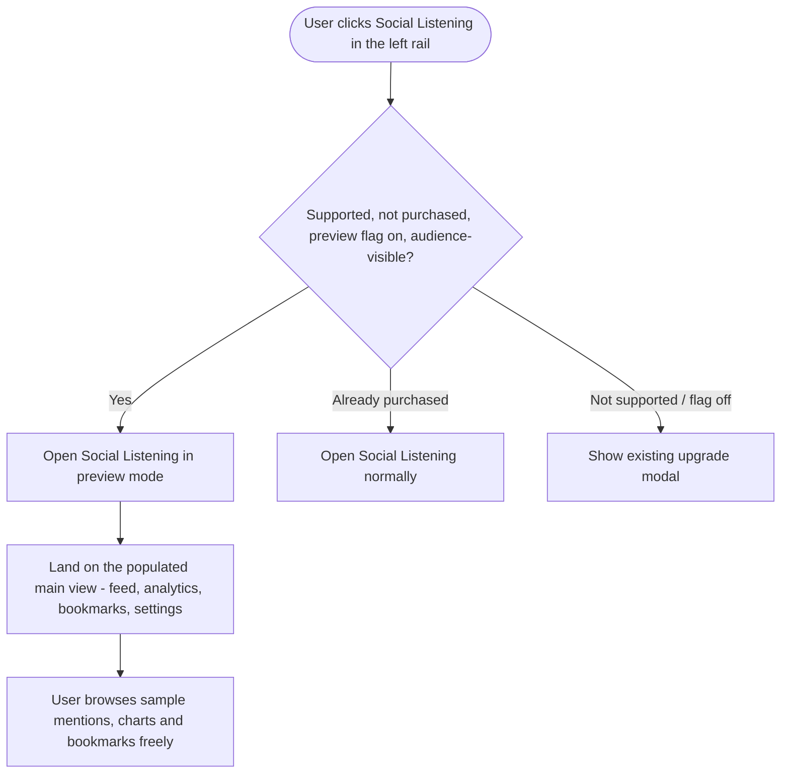

# Social Listening — Sample-Data Preview Mode · Epic & Stories

**Platform:** Web only. **Scope:** Frontend + Design. No backend, no mobile.

---

## Epic: Social Listening — Sample-Data Preview Mode

Social Listening is a paid addon currently behind a hard paywall — non-purchasers see a lock in the desktop rail, and clicking it only opens the upgrade modal, so they never experience the feature or understand its value.

This epic replaces the lock with a **try-before-you-buy preview**. Eligible non-purchasers are let into the real module and land on the populated post-setup view, filled with clearly-labeled **sample data** (mentions, analytics, bookmarks). Contextual purchase CTAs — a persistent top banner, an end-of-mentions card, and a sidebar card above the usage bar — all open the existing upgrade modal, now carrying a 7-day money-back guarantee. Personalize/write actions (adding a keyword, saving a bookmark, editing settings) intercept with the upgrade modal — "lock the action, not the view."

The goal is to let users feel the value and convert. The whole experience ships behind a feature flag; the experience for users who already purchased the addon is unchanged.

**Stories:** 3 × `[FE]` + 1 × `[Design]` · all **Web App**.

| # | Story | Priority |
|---|---|---|
| S-1 | [FE] Let eligible non-purchasers into Social Listening preview with sample data | High |
| S-2 | [FE] Add preview upsell surfaces — banner, purchase cards & 7-day refund | High |
| S-3 | [FE] Intercept personalize actions in preview with the upgrade modal | Medium |
| S-4 | [Design] Design Social Listening preview surfaces | High |

### New Usermaven events introduced by this epic
| Event | Payload | Fires from |
|---|---|---|
| `listening_preview_entered` | `{ entry_point: 'nav_rail' \| 'direct_route', is_trial: boolean }` | S-1 |
| `listening_preview_cta_clicked` | `{ position: 'top_banner' \| 'end_of_list' \| 'sidebar' }` | S-2 |
| `listening_preview_locked_action` | `{ action: 'add_keyword' \| 'save_bookmark' \| 'create_view' \| 'edit_settings' \| 'create_alert' }` | S-3 |
| `listening_upgrade_modal_opened` *(existing — reuse)* | `{ entry_point: 'preview_top_banner' \| 'preview_end_of_list' \| 'preview_sidebar' \| 'preview_locked_action', gate_state: 'preview' }` | S-2, S-3 |
| `social_listening_purchased` *(existing — no change)* | `{ billing_cycle, addon_name: 'Social Listening', price }` | existing modal |

---

## S-1 · [FE] Let eligible non-purchasers into Social Listening preview with sample data
**Project:** Web App · **Group:** Frontend · **Skill:** Frontend · **Product area:** Analytics · **Priority:** High · **Type:** Feature

### Description
As a user on a plan that supports Social Listening but who hasn't purchased the addon, I want to open Social Listening and explore a fully populated version of it — instead of hitting a lock — so that I can understand what the feature does and whether it's worth buying.

### Workflow

1. A preview-eligible user sees Social Listening in the left rail **without a lock icon** (today it shows a lock).
2. The user clicks it and is taken **into** the module, landing on the main post-setup view — not the connect/setup wizard.
3. The mentions feed shows **10–15 sample mentions** across multiple networks with a realistic mix of positive, neutral, and negative sentiment. The analytics and bookmarks sections are likewise populated with sample data.
4. Every sample item carries a small **"Sample"** badge so it is never mistaken for real data.
5. Visiting the listening URL directly also lands the user in preview mode (no redirect to the upgrade modal).
6. Users who already purchased the addon, and users on plans where listening isn't supported, see no change.

### Acceptance criteria
- [ ] A user who is audience-visible (super admin / admin, or has billing visibility) **and** on a plan where Social Listening is supported but **not purchased** enters "preview mode" when the preview feature flag is ON.
- [ ] In preview mode, the Social Listening left-rail item shows **no lock icon** and routes into the module (no upgrade modal on click).
- [ ] Preview users land on the **main populated view** (mentions feed by default), never the setup/connect wizard.
- [ ] The mentions feed renders **10–15 sample mentions** spanning at least 3 networks with a mix of positive, neutral, and negative sentiment.
- [ ] The analytics section and bookmarks section render with sample data (no empty states shown in preview).
- [ ] Each sample mention, chart, and bookmark displays a **"Sample"** badge (copy: **"Sample"**) using the `Badge` component.
- [ ] Switching between feed / analytics / bookmarks / settings tabs works and stays within preview (no setup wizard, no redirect).
- [ ] Direct navigation to the listening route in preview mode loads the module instead of redirecting to the upgrade modal.
- [ ] Users who have **purchased** the addon see the real, unchanged experience (real data, real fetches).
- [ ] Users on plans where listening is **not supported**, or when the preview flag is OFF, see the **current** locked behavior (lock icon + upgrade modal + route redirect).
- [ ] While sample data renders, the user briefly sees the existing skeleton/loading state, then sample content — no network error states appear in preview.
- [ ] When the user enters preview mode, a `listening_preview_entered` Usermaven event fires with `{ entry_point: 'nav_rail' | 'direct_route', is_trial }`.

### Mock-ups
See **[Design] Design Social Listening preview surfaces**.

### Impact on existing data
None. Sample data is frontend-only and never written to the backend; no real topics, mentions, or usage records are created or fetched in preview mode.

### Impact on other products
- Desktop left-rail behavior changes for preview-eligible users only (lock removed).
- The dashboard Social Listening CTA and the listening route guard must agree on preview eligibility so the rail, the route, and any deeplink stay consistent.
- No mobile impact (web-only). No Chrome extension impact.

### Dependencies
- **[Design] Design Social Listening preview surfaces** (for the "Sample" badge placement and overall preview look).

### Global quality & compliance (wherever applicable)
- [ ] Mobile responsiveness (frontend only, N/A for backend-only stories)
- [ ] Multilingual support (frontend + backend, translations available or fallback handled)
- [ ] UI theming support (default + white-label, design library components are being used)
- [ ] White-label domains impact review
- [ ] Cross-product impact assessment (web, mobile apps, Chrome extension)

### Implementation references
*Pointers from research — not a contract. Engineering may choose a different approach.*

**Primary entry points:**
- `contentstudio-frontend/src/modules/listening/composables/useListeningApp.ts` — `gateState` computed (`loading | not_supported | locked | setup | active`); a new `preview` branch is the core change.
- `contentstudio-frontend/src/modules/listening/composables/useListeningAccess.ts` — `isListeningSupported`, `isListeningUnlocked`; good home for an `isListeningInPreviewMode` signal.
- `contentstudio-frontend/src/modules/listening/utils/access.ts` — `getListeningNavState()` and `canOpenListeningRoute()` decide the rail lock and route guard; both currently return locked unless `supported && unlocked && !trial`.
- `contentstudio-frontend/src/components/layout/useHeaderNavigation.ts` — rail item builds `showLock` / `disabledAction: 'listening-upgrade'`.
- `contentstudio-frontend/src/modules/listening/routes.ts` — `beforeEnter` guard redirects locked users home with `{ listening_upgrade: 'locked' }`.
- `contentstudio-frontend/src/modules/listening/views/ListeningAppView.vue` — renders sections by `gateState`.

**Sample data:**
- `contentstudio-frontend/src/modules/listening/mocks/` already has `mentions.ts` (only 3 today — expand to 10–15), `analytics.ts`, `bookmarks.ts`, `views.ts`, `alerts.ts`. Fixtures use the real `ListeningMention` type so they render through existing components. **Exact fixture shape/structure is the dev's call.**

**Existing pattern to follow:**
- `contentstudio-frontend/src/modules/approval-workflows/composables/usePlannerApprovalDemo.ts` — established "module-level flag + decoration function" demo precedent.

**Usermaven:**
- `const { trackUserMaven } = useUserMaven()` from `contentstudio-frontend/src/composables/useUserMaven.ts`; call `trackUserMaven('listening_preview_entered', {...})`.

**Gotcha:**
- The route guard and the nav-state helper mirror each other on purpose — update both, or a direct URL hit and a rail click will disagree.

---

## S-2 · [FE] Add preview upsell surfaces — banner, purchase cards & 7-day refund
**Project:** Web App · **Group:** Frontend · **Skill:** Frontend · **Product area:** Analytics · **Priority:** High · **Type:** Feature

### Description
As a non-purchaser exploring Social Listening in preview mode, I want clear, well-placed prompts to unlock the addon — reassured by a money-back guarantee — so that I can buy it the moment I see the value, without hunting for how.

### Workflow
1. While exploring the preview, the user always sees a **persistent top banner** explaining they're viewing sample data, with an **Unlock Social Listening** button. The banner does not scroll away.
2. When the user scrolls to the **end of the sample mentions list**, they see a full-width **purchase card** restating the value plus the 7-day guarantee.
3. In the left sidebar, **directly above the usage/limits bar**, the user sees a compact **upgrade card** with the value prop, a CTA, and the guarantee line.
4. Clicking any of these CTAs opens the existing Social Listening upgrade modal.
5. Inside the modal, the user sees a **7-day money-back guarantee** line near the purchase button, lowering the risk of buying.

### Acceptance criteria

**Top banner (persistent)**
- [ ] In preview mode, a persistent banner appears at the top of the Social Listening module and stays visible while the user scrolls.
- [ ] Banner copy: **"You're exploring Social Listening with sample data. Add your own keywords to start monitoring real conversations about your brand and competitors."**
- [ ] Banner has a primary CTA button labeled **"Unlock Social Listening"**.
- [ ] Banner has an info icon (`ℹ`); on hover it shows: **"This is example data so you can see how Social Listening works. Nothing is being monitored yet — unlock the addon and add your keywords to track real mentions."**
- [ ] The banner is built with the `Alert` (or design-approved banner) component and uses theme-aware classes (`text-primary-cs-500`, `bg-primary-cs-50`, etc.) — no hardcoded colors.

**End-of-list purchase card**
- [ ] After the last sample mention in the feed, a full-width purchase card renders.
- [ ] Headline: **"That's the end of the sample mentions"**
- [ ] Body: **"This is just a preview. Unlock Social Listening to track real mentions of your brand, competitors, and keywords across X, Reddit, Threads, and more — with sentiment, trends, and instant alerts."**
- [ ] CTA button: **"Unlock Social Listening"**
- [ ] Guarantee line: **"7-day money-back guarantee — no questions asked."**

**Sidebar upgrade card**
- [ ] A compact upgrade card renders in the sidebar **directly above the usage/limits bar**.
- [ ] Headline: **"Unlock Social Listening"**
- [ ] Body: **"Monitor real conversations about your brand and competitors as they happen."**
- [ ] CTA button: **"Unlock now"**
- [ ] Subtext: **"7-day money-back guarantee."**

**Refund in the upgrade modal**
- [ ] The Social Listening upgrade modal shows a guarantee line near the purchase CTA: **"✓ 7-day money-back guarantee — if Social Listening isn't the right fit, get a full refund within 7 days, no questions asked."**
- [ ] The guarantee line shows for both Monthly and Annual selections and for both pricing tiers.

**Behavior & tracking**
- [ ] All three CTAs (top banner, end-of-list card, sidebar card) open the existing upgrade modal (`listening-upgrade-modal`).
- [ ] Clicking a CTA fires `listening_preview_cta_clicked` with `{ position: 'top_banner' | 'end_of_list' | 'sidebar' }`.
- [ ] When the modal opens from a preview CTA, the existing `listening_upgrade_modal_opened` event fires with `{ entry_point: 'preview_top_banner' | 'preview_end_of_list' | 'preview_sidebar', gate_state: 'preview' }`.
- [ ] All upsell surfaces render **only** in preview mode — never for purchasers or in the locked/not-supported states.
- [ ] All new copy is added to the `listening` namespace across all 8 locale files (`en, fr, de, it, es, el, zh, pl`); non-English may fall back to English until translated.

### Mock-ups
See **[Design] Design Social Listening preview surfaces**.

### Impact on existing data
None. These are presentational surfaces; the purchase itself uses the existing addon checkout flow, unchanged.

### Impact on other products
- Adds a guarantee line to the shared `ListeningUpgradeModal`, which is also opened from the rail, route redirect, and dashboard banner — the line should read correctly in all those entry points too. No mobile or Chrome impact.

### Dependencies
- **[FE] Let eligible non-purchasers into Social Listening preview with sample data** (preview mode must exist for these surfaces to render).
- **[Design] Design Social Listening preview surfaces** (final layout/visuals for banner and cards).

### Global quality & compliance (wherever applicable)
- [ ] Mobile responsiveness (frontend only, N/A for backend-only stories)
- [ ] Multilingual support (frontend + backend, translations available or fallback handled)
- [ ] UI theming support (default + white-label, design library components are being used)
- [ ] White-label domains impact review
- [ ] Cross-product impact assessment (web, mobile apps, Chrome extension)

### Implementation references
*Pointers from research — not a contract. Engineering may choose a different approach.*

**Primary entry points:**
- `contentstudio-frontend/src/modules/listening/views/ListeningAppView.vue` — mount the persistent top banner above the main content area.
- `contentstudio-frontend/src/modules/listening/views/ListeningFeedView.vue` — render the end-of-list card after the mentions list / before load-more.
- `contentstudio-frontend/src/modules/listening/components/nav/ListeningPrimaryNav.vue` + `components/shared/ListeningUsageBar.vue` — place the sidebar card immediately above the usage bar.
- `contentstudio-frontend/src/modules/listening/components/ListeningUpgradeModal.vue` — add the guarantee line near the CTA (~the existing feature-list / CTA block). The modal already fires `social_listening_purchased` on success.

**Usermaven:**
- Reuse `listening_upgrade_modal_opened` (already used in `ListeningAppView.vue` and `Home.vue`); add the `preview_*` entry-point values rather than inventing a new "modal opened" event.

**i18n:**
- `contentstudio-frontend/src/locales/*/listening.json` — suggested key group `listening.preview.*` (banner, end_card, sidebar_card, refund).

---

## S-3 · [FE] Intercept personalize actions in preview with the upgrade modal
**Project:** Web App · **Group:** Frontend · **Skill:** Frontend · **Product area:** Analytics · **Priority:** Medium · **Type:** Feature

### Description
As a non-purchaser in the Social Listening preview, when I try to make the sample data "mine" — add a keyword, save a bookmark, change a setting — I want to be told this needs the full addon and be given a clear way to unlock it, so that my intent to use it for real is captured at exactly the right moment.

### Workflow
1. While in preview, the user tries a personalize/write action: add a keyword or topic, bookmark a mention, create or edit a saved view, change a setting, or set up an alert.
2. Instead of performing the action, the existing Social Listening upgrade modal opens, so the user can unlock the addon.
3. The user can dismiss the modal and keep browsing the sample data.

### Acceptance criteria
- [ ] In preview mode, attempting any of these opens the upgrade modal (`listening-upgrade-modal`) instead of performing the action: adding a keyword/topic, bookmarking/unbookmarking a mention, creating/editing/duplicating/deleting a saved view, changing any setting, creating an alert.
- [ ] The sample data is **not** modified by these attempts (read-only preview).
- [ ] Browsing actions (scrolling, opening a mention's detail, switching tabs, expanding a chart) are **not** intercepted — only personalize/write actions are.
- [ ] When an action is intercepted, a `listening_preview_locked_action` Usermaven event fires with `{ action: 'add_keyword' | 'save_bookmark' | 'create_view' | 'edit_settings' | 'create_alert' }`.
- [ ] When the modal opens from an intercepted action, the existing `listening_upgrade_modal_opened` event fires with `{ entry_point: 'preview_locked_action', gate_state: 'preview' }`.
- [ ] Dismissing the modal returns the user to the preview with sample data intact.
- [ ] Purchasers and locked/not-supported users see no change to these actions.

### Mock-ups
See **[Design] Design Social Listening preview surfaces** (intercept uses the existing upgrade modal — no new modal design needed).

### Impact on existing data
None. The interception prevents writes; nothing is persisted in preview.

### Impact on other products
None beyond the listening module. Web-only.

### Dependencies
- **[FE] Let eligible non-purchasers into Social Listening preview with sample data** (preview mode + sample data must exist).

### Global quality & compliance (wherever applicable)
- [ ] Mobile responsiveness (frontend only, N/A for backend-only stories)
- [ ] Multilingual support (frontend + backend, translations available or fallback handled)
- [ ] UI theming support (default + white-label, design library components are being used)
- [ ] White-label domains impact review
- [ ] Cross-product impact assessment (web, mobile apps, Chrome extension)

### Implementation references
*Pointers from research — not a contract. Engineering may choose a different approach.*

**Primary entry points:**
- `contentstudio-frontend/src/modules/listening/composables/useListeningFeed.ts` — bookmark, view create/duplicate/update/delete, sentiment override handlers (each already fires its own `listening_*` event today; in preview, short-circuit to the modal instead).
- `contentstudio-frontend/src/modules/listening/composables/useListeningSettings.ts` — settings/topic-type handlers.
- `contentstudio-frontend/src/modules/listening/composables/useListeningSetupWizard.ts` — keyword/topic creation entry (also has `listening_setup_upgrade_cta_clicked`).

**Pattern:**
- A single `guardPreviewAction(action)` helper that, when `isListeningInPreviewMode` is true, fires `listening_preview_locked_action` + opens `listening-upgrade-modal` and returns early — wrap each write handler with it.

---

## S-4 · [Design] Design Social Listening preview surfaces
**Project:** Web App · **Group:** Design · **Skill:** Design · **Product area:** Analytics · **Priority:** High · **Type:** Feature

### Description
As the team building the Social Listening preview, we need a clear, on-brand visual design for the preview surfaces so that sample data is unmistakably labeled and the purchase prompts feel helpful, not naggy.

### Workflow
1. Designer reviews the preview concept (sample-data main view with contextual purchase prompts).
2. Designer delivers Figma designs for each surface, using ContentStudio's design system and theme tokens.
3. Designer hands off specs (spacing, component usage, states) to frontend.

### Acceptance criteria
- [ ] Design for the **persistent top banner** (sample-data message + "Unlock Social Listening" CTA + info icon), styled so it reads as informative, not alarming.
- [ ] Design for the **per-item "Sample" badge** used on mentions, charts, and bookmarks.
- [ ] Design for the **end-of-list purchase card** (headline, body, CTA, guarantee line).
- [ ] Design for the **sidebar upgrade card** placed directly above the usage/limits bar (compact, with CTA + guarantee line).
- [ ] Design for the **7-day money-back guarantee** treatment inside the existing upgrade modal.
- [ ] All designs use existing `@contentstudio/ui` components where possible (`Alert`, `Button`, `Badge`, `Icon`) and ContentStudio theme tokens (white-label safe) — no hardcoded brand colors.
- [ ] No dark mode and no RTL variants (not supported).
- [ ] Designs cover the desktop web layout and how surfaces reflow on smaller widths.

### Mock-ups
This story produces the mock-ups; link the Figma file here on completion.

### Impact on existing data
N/A — design only.

### Impact on other products
N/A — design only. Web-only feature.

### Dependencies
None (blocks the FE stories).

### Global quality & compliance (wherever applicable)
- [ ] Mobile responsiveness — N/A, design story (covers desktop web only; feature is web-only)
- [ ] Multilingual support — N/A, design story (copy provided by FE stories)
- [ ] UI theming support (default + white-label, design library components are being used)
- [ ] White-label domains impact review
- [ ] Cross-product impact assessment — N/A, web-only feature
