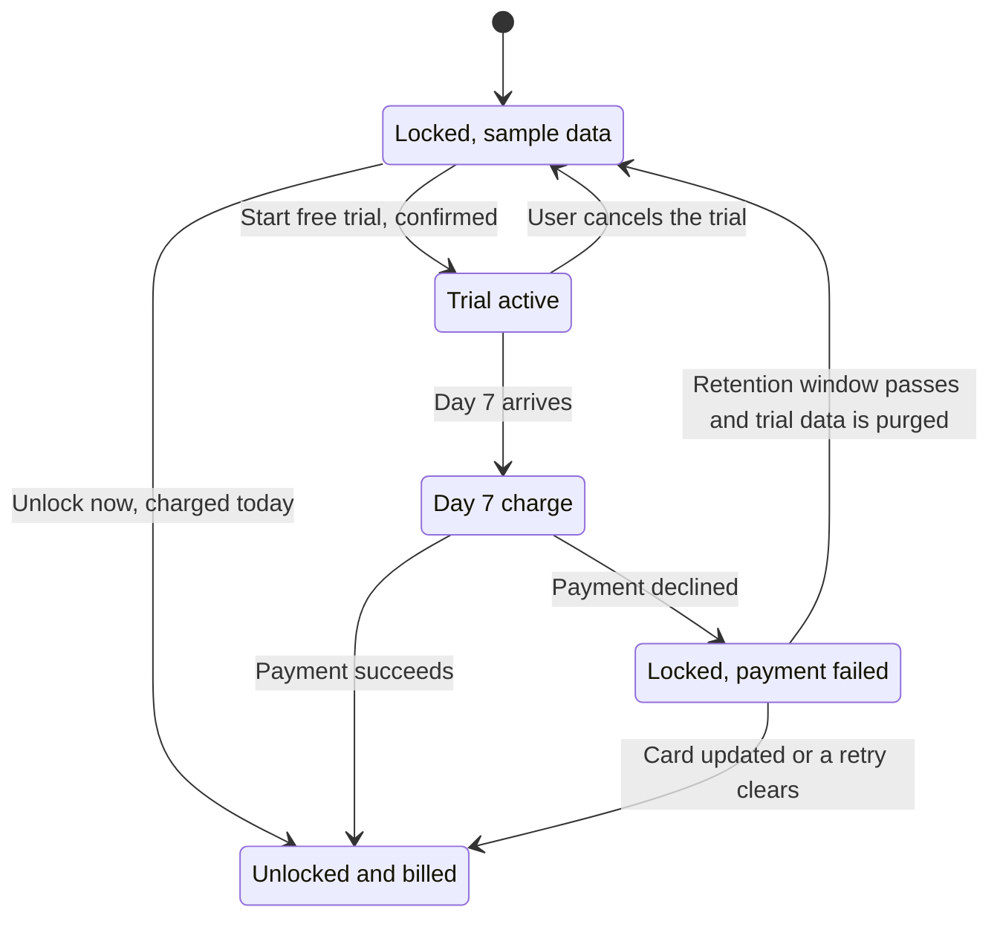

# Epic: Social Listening 7-day free trial

## Goal

Let paid-plan workspaces that have not bought Social Listening try it free for 7 days, then convert them automatically by charging the add-on on day 7. Keep a direct-purchase path for people who do not want to wait, and handle a failed day-7 charge gracefully instead of silently locking the feature.

## Why

Social Listening is a $99 to $150 add-on sold from a single modal, with no way to experience the real product first. Everything behind the modal today is sample data. A trial lets a workspace run its own topics against real mentions for a week, which is the only way most buyers can judge whether the add-on is worth it. Because the card is already on file and the charge happens automatically, a trial start is a deferred purchase rather than a lost sale.

## Scope

- A second CTA in the existing Social Listening unlock modal: `Start 7-day free trial` alongside `Unlock now`
- A confirmation dialog that states the trial end date and the exact amount before the trial starts
- One billing-cycle box for Paddle Billing subscriptions, two for Paddle Classic
- A countdown banner across Listening for the duration of the trial, plus a cancel path
- Automatic charge on day 7, with the add-on joining the existing subscription
- A blocking trial-ended modal when the day-7 charge fails, with card-update and retry for billing admins and an admin contact list for everyone else
- A trial row in the billing add-ons table

## Out of scope

- Mobile. Social Listening does not exist in the Flutter app
- Trials for any other add-on
- Changing Social Listening pricing, tiers, or the bundled topic and mention allowances
- Self-serve extension of a trial

## Success metrics

- Share of locked workspaces that start a trial, measured on `social_listening_trial_started`
- Trial to paid conversion, measured as day-7 `social_listening_purchased` with `source: 'trial'` over trials started
- Net new Social Listening add-on revenue versus the 90 days before launch
- Failed day-7 charges as a share of trials reaching day 7, and how many of those recover within the retry window

## Stories

1. `[Design] Design the Social Listening trial modals, banners and locked states`
2. `[FE][BE] Ship the 7-day Social Listening trial with auto-charge on day 7`

---

# `[Design] Design the Social Listening trial modals, banners and locked states`

### Description:

As a product designer, I want finished designs for every screen the Social Listening trial touches, so that engineering can build the trial without inventing layout, states, or copy along the way.

---

### Workflow:

1. Designer reviews the current Social Listening unlock modal and the sample-data preview experience it sits on top of.
2. Designer produces the unlock modal with two CTAs, in both of its billing variants: one cycle box for subscriptions that already have a billing cycle, two cycle boxes for subscriptions where the user picks one.
3. Designer produces the trial confirmation dialog that appears after the trial CTA is pressed.
4. Designer produces the in-trial banner in its normal and final-48-hours variants, and the cancel-trial confirmation.
5. Designer produces the trial row for the billing add-ons table.
6. Designer produces the trial-ended modal in both permission variants, over the same blurred background.
7. Designer specifies the blurred backdrop treatment and hands the whole set to engineering with every string written out.

---

### Acceptance criteria:

- [ ] Unlock modal is designed with two side-by-side CTAs, `Unlock now` as the secondary and `Start 7-day free trial` as the primary, with the trial button given more width
- [ ] Two variants of the unlock modal are delivered: one showing a single billing-cycle box labelled with the cycle the subscription is already on, and one showing two selectable cycle boxes with neither pre-selected
- [ ] The two-box variant includes the state where no cycle is selected: both CTAs disabled with the tooltip `Please select a plan to continue`
- [ ] A third variant is delivered for workspaces that have already used their trial, showing only `Unlock Social Listening`
- [ ] The trial confirmation dialog is designed, listing the trial end date, the exact amount, the card it will be charged to, and the subscription it joins
- [ ] In-trial banner is designed in two variants: a neutral countdown for the bulk of the trial and a warning-toned variant for the final 48 hours
- [ ] Cancel-trial confirmation dialog is designed with a destructive primary action
- [ ] Billing add-ons table row is designed in its trial state, with a status badge distinct from the active state
- [ ] Trial-ended modal is designed for users who can manage billing, with `Retry payment` and `Update card details` actions and a payment-detail summary
- [ ] Trial-ended modal is designed for users who cannot manage billing, listing the Super admin and any admins with billing access, with no card actions
- [ ] Both the unlock modal and the trial-ended modal are shown in context, sitting over the sample-data Listening page with the background blurred as well as dimmed, and the blur radius and scrim opacity are specified
- [ ] Every string in every state is written out in the design file, including button labels, tooltips, toasts, and the singular and plural forms of the day countdown
- [ ] Designs use existing design system components wherever one exists, and any component that does not exist yet is called out by name with a description of what is needed
- [ ] All designs are delivered at desktop width and at the narrow breakpoint the unlock modal already supports
- [ ] The white-label variant of the unlock modal is covered, where the intro video panel is absent and the modal is narrower

---

### Mock-ups:

Working design canvas, to be finalised in this story: https://claude.ai/artifact/HJd9qq3A6yAZBvCHfpjhV3

The canvas already contains the agreed direction for every screen listed in the acceptance criteria. This story turns that direction into production-ready designs in the team's design tool.

---

### Impact on existing data:

None. This story produces designs only.

---

### Impact on other products:

None. Social Listening is a web-only feature. It does not exist in the mobile app or the Chrome extension.

---

### Dependencies:

None. This story blocks `[FE][BE] Ship the 7-day Social Listening trial with auto-charge on day 7`.

---

### Global quality & compliance (wherever applicable)

- [ ] Mobile responsiveness (frontend only, N/A for backend-only stories)
- [ ] Multilingual support (frontend + backend, translations available or fallback handled)
- [ ] UI theming support (default + white-label, design library components are being used)
- [ ] White-label domains impact review
- [ ] Cross-product impact assessment (web, mobile apps, Chrome extension)

---

# `[FE][BE] Ship the 7-day Social Listening trial with auto-charge on day 7`

### Description:

As a workspace admin on a paid plan that supports Social Listening, I want to try the add-on free for 7 days and have it charged automatically at the end, so that I can judge the feature on my own brand's mentions before committing to the price.

---

### Workflow:

1. User on a paid plan opens Listening and sees the sample-data preview with the "Unlock Social Listening" modal, as they do today. The page behind the modal is blurred so the sample data is not readable through it.
2. User sees two buttons at the bottom of the modal: `Unlock now` and `Start 7-day free trial`.
3. If the user's subscription already has a billing cycle, the modal shows a single box with that cycle and its price, and there is nothing to choose. If the subscription does not, the modal shows both monthly and annual boxes with neither selected, and both buttons stay disabled until the user picks one.
4. User clicks `Start 7-day free trial` and a confirmation dialog appears stating the date the trial ends, the exact amount that will be charged on that date, the card it will be charged to, and the subscription it joins.
5. User confirms. The modal closes, Social Listening unlocks immediately with their own topics and real mentions, and a success toast confirms the trial has started.
6. For the rest of the trial, every Listening screen carries a banner counting down the days and naming the charge date and amount, with a `Cancel trial` action. In the last 48 hours the banner changes tone to a warning.
7. User can cancel from that banner or from the add-ons table in Billing. Cancelling locks Social Listening again straight away and charges nothing.
8. On day 7 the add-on is charged and joins the user's existing subscription. Nothing interrupts the user: the banner simply disappears and the add-on shows as active in Billing.
9. If the charge fails, Social Listening locks again and the trial-ended modal opens the next time the user visits any Listening screen, over the same blurred page.
10. A user who can manage billing sees the amount, card and decline date, and can retry the payment or update their card details. Anyone else sees the Super admin and any admins with billing access, and is told to ask one of them.
11. If the card is updated or one of the automatic retries goes through, Social Listening unlocks on its own and the modal stops appearing.

---

### Acceptance criteria:

**Unlock modal**

- [ ] The unlock modal shows two buttons for eligible workspaces: `Unlock now` as a secondary button and `Start 7-day free trial` as the primary button, with the trial button rendered wider than `Unlock now`
- [ ] `Unlock now` keeps today's behaviour exactly: it charges the add-on immediately and unlocks Social Listening
- [ ] For a subscription that already carries a billing cycle, the modal renders exactly one billing-cycle box, labelled `Monthly, matching your plan` or `Annual, matching your plan`, showing that cycle's price, with its radio pre-selected. No second box and no disabled box is rendered
- [ ] For a subscription with no billing cycle of its own, the modal renders both `Monthly` and `Annual` boxes with neither selected, and both CTAs are disabled with the tooltip `Please select a plan to continue` until one is chosen
- [ ] Prices shown match the workspace's plan tier: `$150/month` and `$1,282/year` on Agency-family plans, `$99/month` and `$843/year` on Advanced plans
- [ ] When a promotional price is active, the amount shown in the modal, the confirmation dialog and the banner all match the amount that will actually be charged
- [ ] Footnote below the buttons reads: `Unlock now charges {price} today. The trial is free until {date}, then the same {price} is added to your {plan name} subscription unless you cancel.`
- [ ] For a subscription that has already used its trial, the trial button is not rendered and the modal shows only `Unlock Social Listening`, with the note `You have already used your free trial of Social Listening. The add-on is billed from the day you unlock it.`
- [ ] Users without billing permission see the existing admin-contact tooltip on both buttons and cannot start a trial
- [ ] The trial is not offered in sample or demo workspaces, or on plans that do not support Social Listening
- [ ] The page behind the modal is blurred as well as dimmed, so the sample-data feed is not readable through the overlay

**Trial confirmation dialog**

- [ ] Clicking `Start 7-day free trial` opens a confirmation dialog titled `Start your 7-day free trial?`
- [ ] Dialog body reads: `You get the full Social Listening experience straight away: your own topics, real mentions, sentiment and alerts. Nothing is charged today.`
- [ ] Dialog lists three rows: `Free until` with the trial end date, `Then you pay` with the amount and the card it will be charged to, and `Added to` with the subscription name
- [ ] Dialog footnote reads: `Cancel any time before {date}, from the banner at the top of Listening or from Billing, and you pay nothing.`
- [ ] Dialog buttons are `Not now` and `Start free trial`
- [ ] While the trial is being started, the primary button shows a loading indicator and both buttons are disabled
- [ ] On success the dialog and the unlock modal both close, Social Listening is immediately usable, and a success toast reads `Your 7-day free trial has started. Social Listening is unlocked until {date}.`
- [ ] On failure an error toast reads `We could not start your trial. Please try again or contact support.` and the unlock modal stays open

**During the trial**

- [ ] Social Listening behaves exactly as a purchased add-on for the duration of the trial, including real topics, real mentions, alerts and analytics, with no sample data
- [ ] A banner appears at the top of every Listening screen reading `Free trial, {n} days left.` followed by `On {date} we add Social Listening to your {plan name} subscription and charge {price}. Everything you set up now stays put.`
- [ ] The banner uses the singular form `Free trial, 1 day left.` when one day remains
- [ ] In the final 48 hours the banner switches to a warning tone and reads `Your trial ends tomorrow.` or `Your trial ends today.` followed by `We will charge {price} to the card ending {last4} on {date} and Social Listening stays on. Cancel before then and you pay nothing.`
- [ ] The banner carries a `Cancel trial` action and a link through to billing
- [ ] Billing shows a Social Listening row in the add-ons table with the status `Free trial`, the next charge as `{price} on {date}`, and a `Cancel trial` action
- [ ] `Cancel trial` opens a confirmation reading `Cancel your free trial?` with the body `Social Listening locks again straight away and you will not be charged. Your topics, views, alerts and mentions are kept for 30 days in case you change your mind.` and the buttons `Keep my trial` and `Cancel trial`
- [ ] Cancelling locks Social Listening immediately, charges nothing, and shows the toast `Your free trial has been cancelled. You have not been charged.`
- [ ] A cancelled trial counts as used, so the trial CTA does not come back for that subscription

**Day 7, charge succeeds**

- [ ] On day 7 the add-on is charged at the price and cycle quoted when the trial started, and joins the workspace's existing subscription so there is one invoice and one renewal date
- [ ] No modal, toast or forced reload interrupts a user who is on a Listening screen when the charge clears
- [ ] The trial banner disappears and the billing add-ons row changes from `Free trial` to `Active` with the next renewal date
- [ ] The existing guard that prevents stacking a second Social Listening add-on SKU on a subscription also applies to a trial conversion
- [ ] Mentions collected during the trial count against the plan allowance from the first day of the trial, so no usage counter resets on day 7

**Day 7, charge fails**

- [ ] A failed day-7 charge locks Social Listening and records the workspace as having a failed trial payment
- [ ] The next time any user visits a Listening screen, a modal opens automatically over the blurred page and cannot be dismissed with a close icon
- [ ] For a user who can manage billing the modal is titled `Your Social Listening trial has ended` with the subtitle `We could not take the payment, so Social Listening is locked for now. Update your card and it comes straight back.`
- [ ] That modal lists `Amount`, `Card` and `Attempted` with the real values from the failed transaction, and carries an assurance box reading `Your topics, saved views, alerts and every mention collected during the trial are safe. We keep them for 30 days, and everything reappears exactly as you left it.`
- [ ] That modal offers `Back to dashboard`, `Retry payment` and `Update card details`, where `Update card details` opens the same payment-update page the existing past-due banner opens, including its fallback when no failed-transaction URL is available
- [ ] A successful retry unlocks Social Listening and shows the toast `Payment received. Social Listening is unlocked.`
- [ ] A failed retry shows the toast `That payment did not go through either. Please update your card details.` and the modal stays open
- [ ] Footnote reads `We keep retrying on our side for a few days. If one of those attempts goes through, Social Listening unlocks on its own and this message disappears.`
- [ ] For a user who cannot manage billing the modal is titled `Social Listening is locked again` with the subtitle `The free trial ended on {date} and the payment for the add-on did not go through.`
- [ ] That modal reads `Only Super admin or admins with billing access can manage billing. Ask one of them to update the card:` and lists each of them by email with their role, using the same admin list the unlock modal already uses
- [ ] That modal offers `Back to dashboard` and `Email an admin`, and offers no card or retry action
- [ ] If any automatic retry succeeds while the workspace is in the failed state, Social Listening unlocks without any user action and the modal stops appearing
- [ ] Topics, views, alerts and mentions created during the trial are retained for 30 days after a failed charge, and the workspace returns to the sample-data preview once that window passes

**Analytics**

- [ ] When a user confirms the trial confirmation dialog, a `social_listening_trial_started` Usermaven event fires with `{ billing_cycle, price, plan_tier }`
- [ ] When a user confirms cancelling a trial, a `social_listening_trial_cancelled` Usermaven event fires with `{ days_remaining, plan_tier }`
- [ ] When the day-7 charge succeeds, the existing `social_listening_purchased` event fires with its existing payload plus `source: 'trial'`
- [ ] When the day-7 charge fails, a `social_listening_trial_payment_failed` event fires with `{ billing_cycle, price, plan_tier }`

**Copy and components**

- [ ] All new strings are added to the translation files and render through the translation layer, with English as the fallback
- [ ] All new UI is built from `@contentstudio/ui` components: `Modal` for both modals, `Dialog` for the confirmations, `Button` for every action, `Radio` for the cycle boxes, `Badge` for the billing status, `Alert` for the banners, and `Loader` for the in-flight states
- [ ] Requires a blurred-backdrop treatment behind the unlock modal and the trial-ended modal. The `Modal` component's overlay is a flat scrim today, so either the component gains a blurred-backdrop variant or these two modals supply their own overlay. Flag to the design system owner before building
- [ ] No colour is hardcoded. Primary surfaces use `bg-primary-cs-50`, `text-primary-cs-700` and `border-primary-cs-200`, and the failed state uses the existing danger tokens, so white-label domains re-theme correctly
- [ ] The billing-cycle switching tooltip and the disabled opposite-cycle box are removed from the unlock modal, along with their translation strings, since a subscription with a known cycle now shows only one box

---

### Mock-ups:

https://claude.ai/artifact/HJd9qq3A6yAZBvCHfpjhV3

Final designs are delivered by `[Design] Design the Social Listening trial modals, banners and locked states`.

---

### Impact on existing data:

- A subscription gains a trial state: whether a trial is running, when it ends, and whether this subscription has already used its trial. The used marker must be stored against the subscription, not the workspace, so a new workspace cannot be used to claim a second trial.
- Workspaces that have already bought Social Listening are unaffected. They never see the trial CTA and their existing add-on is untouched.
- Topics, saved views, alerts and mentions created during a trial are ordinary Social Listening records. They survive a successful conversion untouched, and are retained for 30 days after a cancelled or failed trial before being purged.
- Mention and topic usage counters run from the first day of the trial, so no counter is reset when the trial converts.

---

### Impact on other products:

Web only. Social Listening has no module in the mobile app and no surface in the Chrome extension, so neither needs a change. Billing emails and invoices will show the add-on as a new line on the existing subscription, which is the same shape a direct purchase already produces.

---

### Dependencies:

- Depends on: `[Design] Design the Social Listening trial modals, banners and locked states`
- Requires trial-capable Paddle pricing to be configured for both the newer subscription billing and the older checkout-based billing, at both the Advanced and Agency price points and on both monthly and annual cycles. If the older billing path cannot be configured in time, the trial button can ship for the newer path first and those users continue to see only `Unlock now`.
- Requires the PO to confirm the retention window after a failed or cancelled trial. The copy in this story assumes 30 days.

---

### Global quality & compliance (wherever applicable)

- [ ] Mobile responsiveness (frontend only, N/A for backend-only stories)
- [ ] Multilingual support (frontend + backend, translations available or fallback handled)
- [ ] UI theming support (default + white-label, design library components are being used)
- [ ] White-label domains impact review
- [ ] Cross-product impact assessment (web, mobile apps, Chrome extension)
