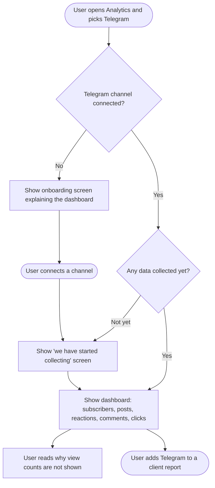
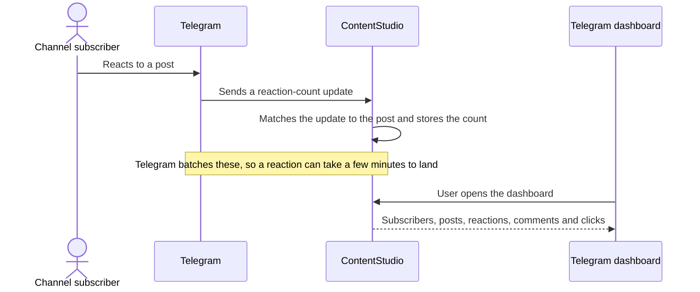
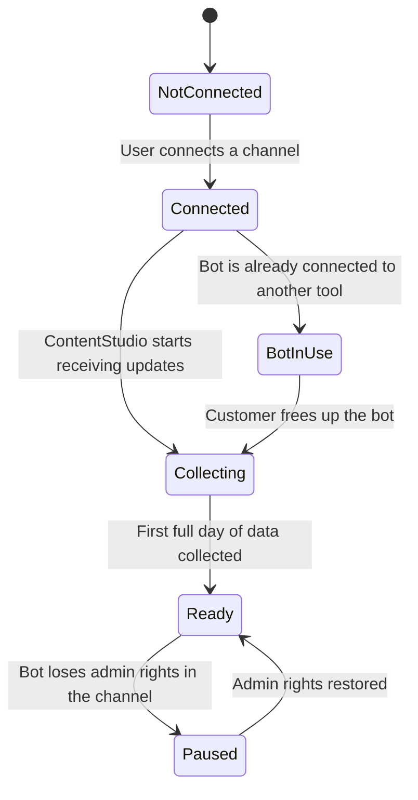

# Telegram Analytics — Workflow Design

**Feature:** Telegram Analytics for ContentStudio
**Date:** August 27, 2026
**Pipeline Step:** 02 — Workflow
**Depends on:** `01-research.md` (approved 27 Aug 2026)

> **Locked going in:** Bot-API only. No view counts. Third-party data vendors ruled out.

---

## 1. Feature Placement

### Primary — a Telegram dashboard in Analytics

Telegram joins the existing per-platform dashboards. Nothing about the navigation model changes.

| Where | What appears |
|---|---|
| **Analytics → Telegram** | New tab in the analytics network list, alongside Facebook, Instagram, LinkedIn, X, TikTok, YouTube, Pinterest and Google Business Profile |
| **Route** | `/analytics/telegram/:accountId?` — same shape as every other platform |
| **Account switcher** | Connected Telegram channels and groups appear in the standard analytics account selector |
| **Analytics → Overview** | Telegram contributes to the cross-network summary |
| **Reports** | Telegram sections available in scheduled and downloadable PDF reports |
| **Looker Studio** | Telegram fields exposed through the existing connector |

### Secondary — a new state in the connect flow

The connection flow gains one visible state it doesn't have today: **the bot is already in use somewhere else.** This appears in all three places a customer can connect Telegram:

- Settings → Social Accounts
- EasyConnect (agency client-facing connection page)
- The reconnect path in the external/cloud connect screen

Everything else about connecting stays exactly as it is.

---

## 2. Workflow Diagrams

### 2a. Overview — what the user does

### 2b. How a reaction becomes a number on the dashboard

This is the part that behaves unlike every other network in the product, so it is worth drawing. Nothing here is something the user does — it happens whether they are looking or not.

### 2c. What state a connected channel can be in

---

## 3. User Flow — the happy path

1. The user goes to **Analytics** and selects **Telegram** from the network list.
2. If they have more than one Telegram channel connected, they pick one from the account selector at the top — the same selector they use for every other network.
3. They choose a date range using the standard date picker, and can compare it against the previous period.
4. The dashboard loads with:
   - **Summary cards** — subscribers now, how that changed over the period, posts published, total reactions, total comments, total link clicks
   - **Subscriber growth** — a line chart over the selected period
   - **Publishing activity** — how many posts went out, and what kind (text, photo, video, album, file)
   - **Reactions** — total reactions and a breakdown of which emoji people used
   - **Posts** — every post in the period with its reactions, comments and clicks, sortable
   - **Top and least performing posts**
   - **AI insights** — the same treatment every other network dashboard gets
5. Near the top of the dashboard, a short line explains that Telegram doesn't share view counts with any third-party tool, with a link to where the user can see views in Telegram itself.
6. The user clicks a post and sees its detail — the content that went out, when, and how people responded.
7. The user adds Telegram to a client report, or exports the period as PDF.

---

## 4. Alternative Flows

### 4a. No Telegram account connected

The user sees the standard analytics onboarding empty state — Telegram logo, a short explanation of what the dashboard shows, four short info cards, a **Connect** button, and a **Learn more** link. Clicking **Connect** opens the existing Telegram connection modal.

### 4b. Just connected — no data yet

Because Telegram has no historical data to give us, a freshly connected channel has nothing to show. Rather than an empty chart, the user sees a dedicated screen explaining that collection has started, what will appear, and roughly when. The subscriber count is available immediately, so it is shown even in this state.

**This is not an error and must not look like one.**

### 4c. The bot is already connected to another tool

Detected when the user connects, and again during the one-off migration for existing accounts. The customer's bot can only report to one place at a time.

The user is told plainly that this bot is already sending its activity somewhere else, what that means (reactions and comments won't be tracked), and what they can do about it. **ContentStudio does not silently take the bot over** — publishing still works normally, and the dashboard shows subscriber and posting data with engagement metrics marked unavailable.

### 4d. Channel has no linked discussion group

Comments only exist on Telegram channels that have a discussion group attached. Where there isn't one, the comments card explains that rather than showing a zero — "zero comments" and "comments aren't set up" are different things and shouldn't look the same.

### 4e. Group connected instead of a channel

Groups behave differently from channels — there's no broadcast audience and "posts" are conversation. Groups get a reduced dashboard (see design decision D2).

### 4f. Bot loses admin rights in the channel

If the customer removes the bot, updates stop. The dashboard keeps showing data collected up to that point, with a banner explaining that collection has paused and how to resume it. Existing data is never deleted.

### 4g. Period with no posts

The charts render with an honest empty period rather than a broken axis, and the posts list explains that nothing was published in the selected range.

---

## 5. Key Design Decisions

### D1 — How to handle the absence of view counts

Views are the number Telegram admins care most about, and the first support ticket will be about them. How we handle their absence is a product decision, not an oversight to hide.

| Option | Description |
|---|---|
| **A. Say nothing** | Just don't show a views card |
| **B. Explain it inline** ✅ | A short, plainly-worded line near the top of the dashboard saying Telegram doesn't share view counts with third-party tools, with a link to where the user can see them in Telegram |
| **C. Greyed-out card** | Show a disabled "Views" card with a tooltip |

**Recommendation: B.** Option A guarantees a support ticket and makes us look incomplete. Option C is worse — a permanently disabled card reads as broken software, and it invites "when will this be enabled?" forever. Option B turns a limitation into a moment of credibility: we're telling the user something true about Telegram that our competitors don't. It also sets accurate expectations before they build a report on it.

### D2 — Do groups get a dashboard in v1?

Research found that every mature bot-based Telegram analytics tool (Combot, TeleMe, Metricgram) is a *group* tool, because a bot in a group can see far more than a bot in a channel. Our publishing supports both, so users have both connected.

| Option | Description |
|---|---|
| **A. Channels only** | Groups show "analytics not available for groups" |
| **B. Both, reduced set for groups** ✅ | Groups get member count, posting activity, and reactions on posts we published |
| **C. Both, full community dashboard for groups** | Adds top contributors, peak activity hours, message volume |

**Recommendation: B.** Option A leaves customers who connected a group staring at nothing, with no explanation of why the product accepted their group but won't measure it. Option C is genuinely attractive and is where the differentiation is — but it needs the bot's privacy mode switched off, which only the customer can do in BotFather, and we'd be building a community-analytics product inside an analytics dashboard. **B ships something honest for groups now and leaves C as a clear v2**, especially since we can detect the privacy-mode setting and know in advance which customers could benefit.

### D3 — What to do when the bot is already in use elsewhere

| Option | Description |
|---|---|
| **A. Take the bot over** | Register our webhook regardless |
| **B. Refuse to connect** | Block the account until the customer frees the bot |
| **C. Connect, warn, degrade gracefully** ✅ | Connect the account, publish normally, show subscriber and posting data, mark engagement metrics unavailable, and explain why |

**Recommendation: C.** Option A silently breaks whatever else the customer is running on that bot — unacceptable, and they may never work out what happened. Option B is too blunt: it would block publishing, which works perfectly well without a webhook, over an analytics-only concern. C keeps everything that can work working, and is honest about the one part that can't.

### D4 — When to register webhooks for accounts that are already connected

| Option | Description |
|---|---|
| **A. All at once** ✅ | A one-off job sweeps every connected Telegram account |
| **B. On next interaction** | Register only when the customer next touches the account |

**Recommendation: A**, with the safety rule from research: always check whether a webhook is already registered elsewhere before setting one, and never overwrite a customer's existing one. Option B means data collection starts at wildly different times per customer and some accounts never start at all. A is a single controlled operation with a known blast radius, and customers see no disruption.

### D5 — How far back does the dashboard claim to go?

Telegram gives no history, so every series starts when collection starts. The date picker will happily let a user select last quarter.

**Recommendation:** allow any date range the picker supports, but where the range extends before collection began, say so on the chart rather than rendering a flat line that looks like zero activity. A flat line at zero is a lie; "we weren't collecting yet" is not.

---

## 6. Integration with Existing Features

| Feature | How Telegram plugs in |
|---|---|
| **Analytics Overview** | Telegram contributes to the cross-network summary, with its available metrics only |
| **Scheduled & downloadable reports** | Telegram sections available in PDF reports. This is the agency pain point research identified — it's the reason the feature earns its place |
| **Looker Studio connector** | Telegram fields exposed alongside other networks |
| **Social accounts / connect flow** | Gains the "bot in use elsewhere" state; otherwise unchanged |
| **EasyConnect** | Same connection changes, on the client-facing page |
| **Planner & Composer** | Posts published through ContentStudio link through to their performance |
| **Link shortener** | Supplies click counts — the metric no competitor has for Telegram |
| **AI insights** | Telegram gets the same insights treatment as every other network |
| **Social Listening** | **Not in scope.** Telegram isn't a listening source today; public mention monitoring is a separate feature |

---

## 7. Trackable Actions (Usermaven candidates)

> **Context worth flagging:** the analytics module currently has **no Usermaven tracking at all** — there are zero `userMaven.track()` calls anywhere under it. Anything proposed here establishes a pattern rather than following one, so the set is deliberately small and limited to actions that answer a real question.

| Action | Proposed event | Trigger | What it tells us |
|---|---|---|---|
| User opens the Telegram dashboard for the first time | `telegram_analytics_first_viewed` | First dashboard load per user | Adoption — are connected customers finding it? |
| User adds Telegram to a report | `telegram_analytics_added_to_report` | Telegram section included in a scheduled or downloaded report | Whether the agency reporting use case — the main justification for the feature — is real |
| User clicks through the missing-views explanation | `telegram_views_explainer_opened` | User clicks the link explaining why views aren't shown | Whether the explanation is doing its job, or whether we should expect support volume |
| Connection blocked by a bot already in use | `telegram_bot_conflict_shown` | The "bot in use elsewhere" state is displayed | How common this actually is — currently a guess, and it affects how much we invest in handling it |

Deliberately **not** tracked: date-range changes, account switching, chart interactions. They generate volume without answering anything we'd act on.

---

## 8. Scope Recommendation

### v1 — ship this

**Data collection**
- Receive Telegram updates for reactions, comments and posts
- Daily subscriber count collection
- Register update delivery on connect, remove on disconnect, and sweep existing accounts once — never overwriting a bot already in use elsewhere
- Move chat discovery onto stored events, which also fixes the existing 24-hour discovery gap

**Dashboard**
- Summary, subscriber growth, publishing activity, reactions with emoji breakdown, posts list, top/least posts, AI insights
- The missing-views explanation
- Onboarding empty state, collecting state, paused state, bot-conflict state
- Groups get the reduced set (D2, option B)

**Reporting**
- Telegram in the Overview, in PDF reports, and in Looker Studio

### v2 — defer

- **Community analytics for groups** — top contributors, peak hours, message volume (Combot-style). Needs privacy mode off; genuinely differentiating
- **Comment sentiment** — using the existing AI insights service over discussion-group comments
- **Best time to post**, once enough history exists to make it meaningful
- **Channel-vs-channel comparison** for customers running several
- **Opt-in advanced statistics** — the MTProto path that would unlock views and forwards, pending the security and legal decision that research left open

### Explicitly out of scope

- View counts, forwards, reach, subscriber traffic sources, join/leave churn, competitor comparison, fake-subscriber detection, ad effectiveness — none are reachable (see `01-research.md` §2d)
- Any backfill of data from before collection starts — it does not exist
- Telegram in Social Listening — separate feature
- Mobile — the Flutter codebase isn't available to assess; web-only for now

---

## 9. Open Items Carried Into the PRD

1. **Mobile.** Flutter repo not mounted; scope unassessed.
2. **MTProto as a stated v2.** Keep it on the public roadmap, or rule it out on security grounds?
3. **How common is the bot conflict?** Affects how much D3 handling is worth building. The dev who built the integration is best placed to estimate.
4. **Group privacy mode.** We can detect whether a customer's bot can read group messages — worth surfacing to them as a "turn this on to unlock more" prompt in v2, or leave it silent?
