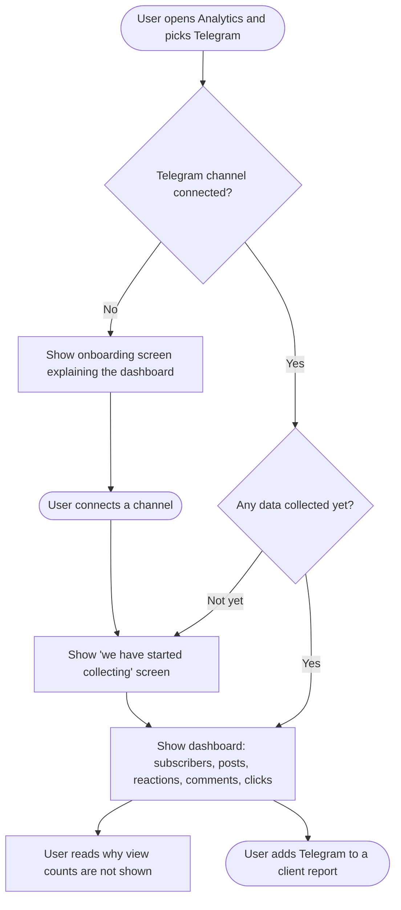

# **PRD: Telegram Analytics**

**Author:** Tehreem Shehzadi
**Last Updated:** August 27, 2026
**Status:** In Review
**Target Release:** Q4 2026

---

## **1. Overview**

Telegram publishing shipped in April 2026, but customers who connect a Telegram channel get no performance data back — it is the only network in ContentStudio that publishes without a dashboard. This feature adds a Telegram analytics dashboard alongside the existing per-platform dashboards, and puts Telegram into the cross-network Overview, PDF reports and Looker Studio export.

The defining constraint is that **Telegram gives bots no statistics at all** — no view counts, no forwards, no subscriber history. Verified against Bot API 10.3 (24 Aug 2026). We therefore build the dashboard from what our bot can legitimately observe: subscriber counts, reactions broken down by emoji, comments from linked discussion groups, posting activity, and link clicks from ContentStudio's own shortener. We ship without views and say so plainly in the UI. No competitor in ContentStudio's benchmark set offers Telegram analytics at all, so a modest, honest dashboard is a category-first.

---

## **2. Problem Statement**

**What problem are we solving?**

Customers can schedule to Telegram from ContentStudio but cannot measure anything. To see how a Telegram post performed, they have to leave ContentStudio and open Telegram's own statistics screen, which is admin-only, single-channel, app-only, has a fixed rolling window with no period comparison, and cannot be exported. There is no way to put Telegram numbers into a client report next to Instagram and LinkedIn numbers, so agencies either hand-assemble it in a spreadsheet or leave Telegram out of the report entirely — which makes the report look incomplete and makes ContentStudio look like it only half-supports the network.

Separately, the current connection flow has a latent defect: chat discovery reads Telegram's update buffer, which only retains 24 hours. A customer who adds our bot to their channel on Monday and returns to connect it on Thursday sees an empty list with no error explaining why.

**Who has this problem?**

Every workspace with a connected Telegram channel or group. It is felt most acutely by:

- **Agencies** producing monthly multi-network client reports — the reporting gap is a recurring, visible embarrassment
- **Media publishers and community brands** who run Telegram as a primary channel and optimise on post timing and format
- **Prospects evaluating ContentStudio against Publer**, which is the only competitor marketing Telegram analytics

**What happens if we don't solve it?**

- Telegram publishing looks unfinished — we ask customers to publish somewhere we can't measure
- Agencies keep excluding Telegram from client reports, so the network delivers less perceived value than it should
- We forfeit a clear competitive first: none of Buffer, Hootsuite, Sprout Social, Later, Loomly, Sendible, Agorapulse, SocialBee or Metricool offers Telegram analytics
- The 24-hour discovery defect keeps generating "my channel doesn't appear" support tickets that nobody can diagnose from the outside

---

## **3. Goals & Success Metrics**

| Goal | Metric | Target | How We'll Measure |
| ----- | ----- | ----- | ----- |
| **Primary** — Telegram customers actually use the dashboard | Share of workspaces with a connected Telegram account that open the dashboard | 45% within 90 days of launch | `telegram_analytics_first_viewed` |
| **Primary** — Close the agency reporting gap | Share of Telegram-connected workspaces that include Telegram in a report | 25% within 90 days | `telegram_analytics_added_to_report` |
| **Secondary** — The missing-views explanation works | Support tickets asking where Telegram view counts are | Fewer than 10 in the first 90 days | Support tagging + `telegram_views_explainer_opened` |
| **Secondary** — Fix the discovery defect | "Channel not appearing during connection" tickets | Zero after migration completes | Support tagging |
| **Guard rail** — No disruption to Telegram publishing | Telegram publishing success rate | No measurable change vs. pre-launch baseline | Existing publishing logs |
| **Guard rail** — Don't break customers' other bot tooling | Accounts where an existing third-party webhook was overwritten | Zero | Migration job audit log |

### **3.1 Analytics Events (Usermaven)**

> **Context:** the analytics module has **no Usermaven tracking today** — a search of `contentstudio-frontend/src/modules/analytics/` for `userMaven.track(` returns zero results. These events establish the pattern rather than following one, so the set is deliberately small and each event answers a question we would act on. The existing `connected_social_accounts` event is reused rather than duplicated.

| Event Name | Trigger | Payload | What we measure with it |
| ----- | ----- | ----- | ----- |
| `telegram_analytics_first_viewed` | FE — first time a user loads the Telegram dashboard in a workspace | `{ account_type: 'channel' \| 'group' }` | Adoption; whether connected customers find the dashboard |
| `telegram_analytics_added_to_report` | FE — a Telegram section is included in a scheduled or downloaded report | `{ report_type: 'scheduled' \| 'download' }` | Whether the agency reporting use case — the feature's main justification — is real |
| `telegram_views_explainer_opened` | FE — user clicks the link in the missing-views explanation | `{ }` | Whether the explanation is landing, or whether to expect support volume |
| `telegram_bot_conflict_shown` | FE — the "bot already in use elsewhere" state is displayed during connection | `{ source: 'settings' \| 'easy_connect' \| 'reconnect' }` | How common the conflict actually is — currently unknown, and it determines how much handling is worth building |
| `connected_social_accounts` | **Existing event, reused.** FE — Telegram account connection completes | `{ platform: 'telegram' }` | Account-connection funnel, consistent with every other platform |

**Note:** `connected_social_accounts` currently fires from `useSocialAccountsModal.ts` and `ExternalCloudConnect.vue`, but **not** from the Telegram connect composable — so Telegram connections are presently untracked. Wiring it up is in scope.

Deliberately **not** tracked: date-range changes, account switching, chart interactions, section expansion. High volume, no decision attached.

---

## **4. Target Users**

**Primary Persona:**
**Agency account manager** — manages 5–30 client workspaces, several with Telegram channels. Produces a monthly PDF report per client. Comfortable with analytics dashboards, not technical about APIs. Cares that the report looks complete and that the numbers can be explained to a client without hedging. Currently either omits Telegram or pastes screenshots into a slide.

**Secondary Persona:**
**In-house community or content manager** — runs one or two Telegram channels as a primary distribution channel, often alongside a linked discussion group. Posts several times a week. Wants to know which formats and times hold subscribers. Today they check Telegram's own statistics screen on their phone.

**Non-Users (explicitly out of scope):**

- Customers wanting **competitor** Telegram intelligence — channel rankings, comparison against channels they don't own. That requires crawled public data and is a different product.
- Customers wanting Telegram **mention monitoring** — that belongs to Social Listening, where Telegram is not currently a source.
- Customers wanting to measure Telegram **advertising** performance — requires view and traffic-source data we cannot obtain.
- **Mobile app users** — the Flutter codebase is not available to assess, so this release is web-only.

---

## **5. User Stories / Jobs to Be Done**

| ID | As a... | I want to... | So that... | Priority |
| ----- | ----- | ----- | ----- | ----- |
| US-1 | Community manager | see how my Telegram subscriber count is changing over time | I can tell whether my content is growing the channel | Must Have |
| US-2 | Community manager | see how many people reacted to each post, and with which emoji | I can tell which posts actually landed | Must Have |
| US-3 | Agency account manager | include Telegram in my monthly client PDF report | the report covers every network the client uses | Must Have |
| US-4 | Content manager | see all my Telegram posts in one list with their engagement, sortable | I can find my best and worst performers quickly | Must Have |
| US-5 | Any Telegram customer | understand why view counts aren't shown | I don't think the product is broken or waste time looking for them | Must Have |
| US-6 | Community manager | see how many comments each post got in my discussion group | I can tell which posts started conversations | Should Have |
| US-7 | Marketer | see how many people clicked the links in my Telegram posts | I can measure traffic, not just engagement | Should Have |
| US-8 | Customer who just connected | understand that data collection has started and what to expect | I'm not confused by an empty dashboard | Must Have |
| US-9 | Customer whose bot is used elsewhere | be told clearly that engagement tracking won't work and why | I can decide whether to free up the bot | Must Have |
| US-10 | Agency account manager | see Telegram in the cross-network Overview | I get a single picture of the client's performance | Should Have |
| US-11 | Customer with a connected group | see the metrics that are meaningful for a group | connecting a group doesn't feel unsupported | Should Have |
| US-12 | Any Telegram customer | get AI insights on my Telegram performance | I get a read on the data without interpreting charts myself | Nice to Have |

---

## **6. Requirements**

### **6.1 Must Have (P0)**

* Receive Telegram updates for reactions, comments and channel posts, for every connected Telegram account
* Register update delivery when an account connects; remove it when the account disconnects; re-register when the bot token changes
* One-off migration registering update delivery for all already-connected Telegram accounts, **without overwriting a webhook already registered by another tool**
* The migration can be run in **report-only mode** first — inspecting every account and reporting what it would do, changing nothing
* Detect and handle the case where a customer's bot is already delivering updates elsewhere — connect the account, keep publishing working, mark engagement metrics unavailable, explain why
* Move chat discovery onto stored connection events rather than Telegram's 24-hour update buffer, in **both** the Settings connect flow and the EasyConnect client-facing flow
* Collect subscriber count for every connected channel and group on a daily schedule
* Telegram dashboard at `/analytics/telegram/:accountId?` with: summary cards, subscriber growth, publishing activity, reactions with emoji breakdown, posts list, top and least performing posts
* Plain-language explanation of why view counts are not shown, with a link to where the user can see them in Telegram
* Dashboard states: onboarding empty state, collecting-data state, paused state (bot lost admin rights), bot-conflict state
* Groups receive a reduced dashboard: member count, posting activity, and reactions on posts published through ContentStudio
* **Link click counts per post**, sourced from ContentStudio's existing link shortener, with coverage shown (how many posts in the period carried a trackable link)
* Posts with no shortened link show a distinct "no tracked links" state, never a click count of zero
* Telegram sections available in scheduled and downloadable PDF reports
* All Usermaven events specified in §3.1

### **6.2 Should Have (P1)**

* Comment counts per post, sourced from the linked discussion group where one exists, with a distinct state where no discussion group is configured
* Telegram contribution to the cross-network Analytics Overview
* Telegram fields exposed through the Looker Studio connector
* AI insights section, matching the treatment every other network dashboard receives — **blocked pending legal review** of Telegram's AI/ML terms (see §9, §10). Everything else in the dashboard is unaffected by that review
* Date ranges extending before collection began are labelled as such rather than rendered as zero activity
* Post detail view showing content, publish time and engagement

### **6.3 Nice to Have (P2)**

* Reaction distribution trend over the selected period, not just totals
* Comparison against the previous period on summary cards
* Channel-vs-channel comparison for customers running several Telegram accounts

### **6.4 Explicitly Out of Scope**

* **View counts, forwards, reach, and view-rate (ERR)** — not exposed to bots in any Bot API version
* **Subscriber traffic sources, join/leave churn split, mute rate, top-hours from Telegram, subscriber languages** — MTProto only
* **Competitor channel comparison, channel rankings, fake-subscriber detection, ad effectiveness** — require crawled public data
* **Any backfill of data predating collection** — it does not exist and cannot be reconstructed
* **Community analytics for groups** — top contributors, peak activity hours, message volume. Deferred to v2; requires the customer to disable privacy mode in BotFather
* **Comment sentiment analysis** — deferred to v2
* **Best time to post** — deferred until enough history exists to be meaningful
* **MTProto opt-in advanced statistics** — pending an unresolved security and legal decision
* **Telegram in Social Listening** — separate feature
* **Mobile** — Flutter codebase unavailable to assess; web-only this release
* **Third-party Telegram data vendors** — ruled out on cost, coverage and terms-of-service grounds

---

## **7. User Flow (High Level)**

1. User opens **Analytics** and selects **Telegram**
2. User picks a channel or group from the account selector, if they have more than one
3. User chooses a date range, optionally comparing against the previous period
4. Dashboard loads: summary cards, subscriber growth, publishing activity, reactions by emoji, posts list, top and least performers, AI insights
5. User reads the short explanation of why view counts are not available
6. User opens a post to see its content and how people responded
7. User includes Telegram in a client report, or exports the period as PDF

`02-workflow.md` also contains a sequence diagram showing how a reaction reaches the dashboard, and a state diagram covering the states a connected channel can be in.

---

## **8. Business Rules & Constraints**

| Rule ID | Rule | Rationale |
| ----- | ----- | ----- |
| BR-1 | View counts, forwards and reach are never shown, estimated, or derived for Telegram | Telegram does not expose them to bots. Estimating them would produce numbers that contradict what the customer sees in Telegram |
| BR-2 | Every Telegram metric series begins on the date collection started for that account. No data is backfilled | No historical data exists to backfill |
| BR-3 | A date range extending before collection began is labelled as such and never rendered as zero activity | A flat line at zero misrepresents absence of collection as absence of activity |
| BR-4 | ContentStudio never overwrites an update-delivery registration made by another tool | Doing so would silently break the customer's other systems |
| BR-5 | A bot conflict never blocks account connection or publishing | Publishing works without update delivery; an analytics-only limitation must not degrade a working feature |
| BR-6 | Engagement metrics are marked unavailable — not zero — where they cannot be collected | Zero and unavailable mean different things and must never look the same |
| BR-7 | Comments are only reported where the channel has a linked discussion group and our bot is an administrator in it | This is the only way comment data is observable |
| BR-8 | Groups receive the reduced metric set: member count, posting activity, and reactions on posts published through ContentStudio | Group analytics beyond this requires privacy mode disabled, which only the customer can change |
| BR-9 | Reaction and comment data is never presented as real-time | Telegram batches these updates and they can lag several minutes |
| BR-10 | Losing update delivery pauses collection; it never deletes previously collected data | Data loss on a recoverable condition is unacceptable |
| BR-11 | Telegram analytics is available on the same plans that already permit Telegram accounts | Telegram is already in the plan comparison; analytics introduces no new API cost, so no new gating is justified |
| BR-12 | Subscriber count is collected at most once per day per account | Telegram documents aggressive member-count polling as a ban trigger |
| BR-13 | A post published without a shortened link shows "no tracked links", never a click count of zero | Clicks are only observable on links ContentStudio shortened. Showing zero would misreport an untracked post as an unsuccessful one |
| BR-14 | Wherever total link clicks is shown, the number of posts it covers is shown with it | Shortening is opt-in at composition, so click totals are inherently partial. Stating coverage keeps the number honest |

---

## **9. Open Questions**

| Question | Options | Owner | Due Date | Decision |
| ----- | ----- | ----- | ----- | ----- |
| How common is the "bot already in use elsewhere" case? | Rare / Occasional / Common | Telegram integration dev | Before story estimation | **Answered by the migration's report-only run** — it counts affected accounts against real data rather than an estimate. Dev input still useful beforehand, but no longer blocking |
| Do we keep MTProto advanced statistics on the public roadmap, or rule it out on security grounds? | Keep as stated v2 / Rule out now | PO + Security | Before launch messaging | Pending |
| Should mobile be assessed for this release? | Mount Flutter repo and scope / Web-only for now | PO | Before story writing | Pending — currently assumed web-only |
| Do we prompt group owners to disable privacy mode to unlock richer group analytics later? | Prompt in v1 / Silent until v2 / Never | PO | v2 planning | Pending |
| Should the missing-views explanation link to Telegram's own statistics screen, or to a ContentStudio help article? | Telegram / Help article / Both | PO + Support | Before FE story | Pending |
| Is the migration run in one sweep or staged by workspace tier? | Single sweep / Staged | PO + Eng | After the report-only run | Pending — decide from the report-only numbers, not in advance |
| Does Telegram's AI/ML terms restriction cover our AI insights section? | Ship as normal / Gate behind explicit per-channel consent / Drop for Telegram | PO + Legal | Before AI insights work starts | **Pending — treat AI insights as blocked until answered.** Telegram prohibits using platform data for AI/ML development or deployment, with a narrow consent exception |

---

## **10. Risks & Mitigations**

| Risk | Likelihood | Impact | Mitigation |
| ----- | ----- | ----- | ----- |
| Migration overwrites a customer's existing bot webhook, silently breaking their own tooling | Low | Medium | Always check for an existing registration before setting ours; never overwrite; flag and surface the account instead (BR-4). The migration runs in **report-only mode first**, so the real blast radius is known before anything changes. Audit-log every decision |
| Customers expect view counts and perceive the dashboard as broken or incomplete | **High** | Medium | Prominent plain-language explanation (US-5), support briefed before launch, help article published at launch, `telegram_views_explainer_opened` monitored |
| Changing chat discovery introduces a regression in the live connect flow | Medium | High | Discovery changes are limited to two call sites in one connector; publishing is untouched and independently verifiable. Both Settings and EasyConnect paths must be tested — they share the same controller methods |
| The EasyConnect path is overlooked because it is a separate route group | Medium | High | Explicitly named in P0 requirements; every connect-flow story must cover both entry points |
| Dashboard looks empty for weeks after launch because no history exists | **High** | Medium | Dedicated collecting-data state (US-8) that explains what will appear and when; subscriber count shown immediately since it is available on day one |
| Reaction updates lag, and customers report numbers as "wrong" | Medium | Low | Never present engagement as real-time (BR-9); note the delay in the UI |
| Comment data unavailable for most channels because few have discussion groups | Medium | Low | Distinct "not configured" state rather than a zero (BR-6); comments are P1, not P0 |
| Link clicks is new work — no click read-back exists in ContentStudio today | Medium | Medium | Scoped explicitly as new work, not reuse. Promoted to P0 because it is the dashboard's only business-outcome metric and its only competitive differentiator; cutting it would worsen the "dashboard feels incomplete" risk above. If scope must give, **comments** (P1, and unavailable for most channels anyway) is the cheaper cut |
| Aggressive subscriber polling triggers Telegram rate limiting or a ban | Low | High | Once-daily cap per account (BR-12); honour `Retry-After`; reuse the existing per-account concurrency controls in the analytics fetchers |
| Group customers feel short-changed by the reduced metric set | Medium | Low | Explain in-product what groups support and why; community analytics is a stated v2 |
| Scope creep toward competitor intelligence or mention monitoring | Medium | Medium | Explicitly excluded in §6.4 and §4 non-users |
| Telegram's terms restrict using platform data for AI/ML, which may cover the AI insights section | Medium | Medium | AI insights held pending legal review (§9). It is P1, not P0, so deferring costs nothing. A narrow consent exception exists for explicit, per-channel, informed consent — legal to advise whether we can rely on it |

---

## **11. Dependencies**

**Internal:**

* **Telegram publishing integration** (shipped April 2026) — this feature modifies its connect flow. The two chat-discovery call sites and both connect entry points (Settings and EasyConnect) are affected. Publishing itself is untouched
* **Analytics pipeline** — Telegram needs its own ingestion services, storage tables, API handlers and route registration, following the existing per-platform pattern
* **Analytics frontend module** — reuses the dashboard shell, card wrapper, date picker, account selector, and loading/error/empty states
* **Link shortener** — supplies the shortened links (already applied at composition time, so Telegram inherits them). Reading click counts back is new work, not reuse
* **AI insights service** — supplies the insights section
* **Reports and Looker Studio connector** — Telegram sections and fields
* **Analytics empty-state onboarding screens** — Telegram should adopt the same pattern rather than inventing a variant
* **Analytics observability and data retention work** — Telegram storage should follow whatever retention policy that establishes, not a Telegram-specific one

**External:**

* **Telegram Bot API** — hard ceiling on what is collectable. No statistics methods exist and none are expected. Reaction updates require explicitly opting in; they are batched and delayed
* **Customer-owned bot tokens** — each account carries its own bot. We depend on the customer keeping the bot an administrator, and on the bot not being used by another tool
* **Linked discussion groups** — comment data depends on customer-side configuration we cannot set

**Blockers:**

* None blocking the start of work. The mobile scope question and the MTProto roadmap question can be resolved in parallel; neither gates v1

---

## **12. Appendix**

* **Research:** `docs/features/telegram-analytics/01-research.md` — competitor analysis across three market camps, full metric-by-metric feasibility ledger (§2d), Telegram API surface analysis (§3), codebase analysis (Part B)
* **Workflow:** `docs/features/telegram-analytics/02-workflow.md` — feature placement, three diagrams, user and alternative flows, design decisions D1–D5
* **Prior feature:** `docs/features/telegram-integration/` — the April 2026 publishing epic whose connect flow this modifies
* **Related analytics work:** `docs/stories/analytics-empty-state-screens/`, `docs/stories/analytics-api-consistency/`, `docs/stories/analytics-observability-and-data-retention/`, `docs/stories/analytics-php-to-golang-migration/`
* **Adjacent research:** `docs/stories/analytics-network-research-bluesky-threads/` — the other two publish-without-analytics networks
* **Designs:** To be produced — see §9 for open copy decisions
* **Key external references:** Telegram Bot API 10.3 (24 Aug 2026), Telegram Bot API changelog, Telegram API Terms of Service, MTProto channel statistics documentation

---

## **Changelog**

| Date | Author | Changes |
| ----- | ----- | ----- |
| 2026-08-27 | Tehreem Shehzadi | Initial draft from approved research and workflow. Bot-API-only scope and reduced group metric set locked by PO |
