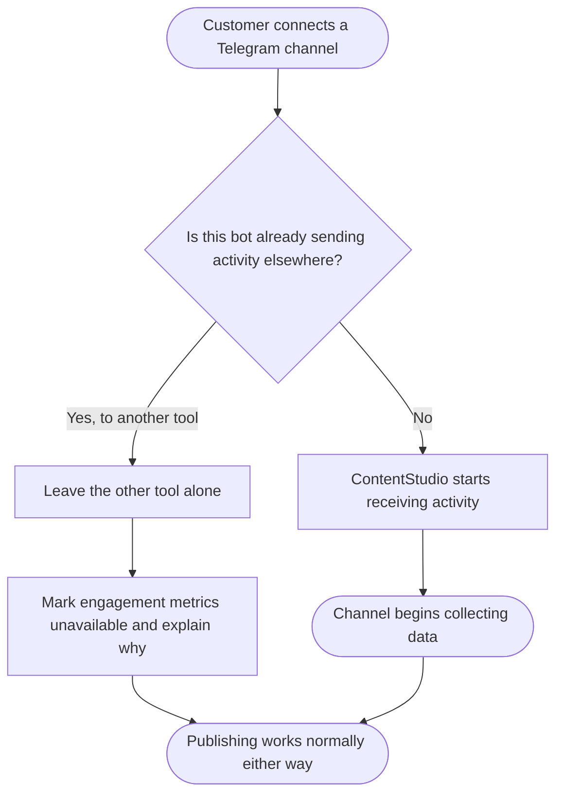
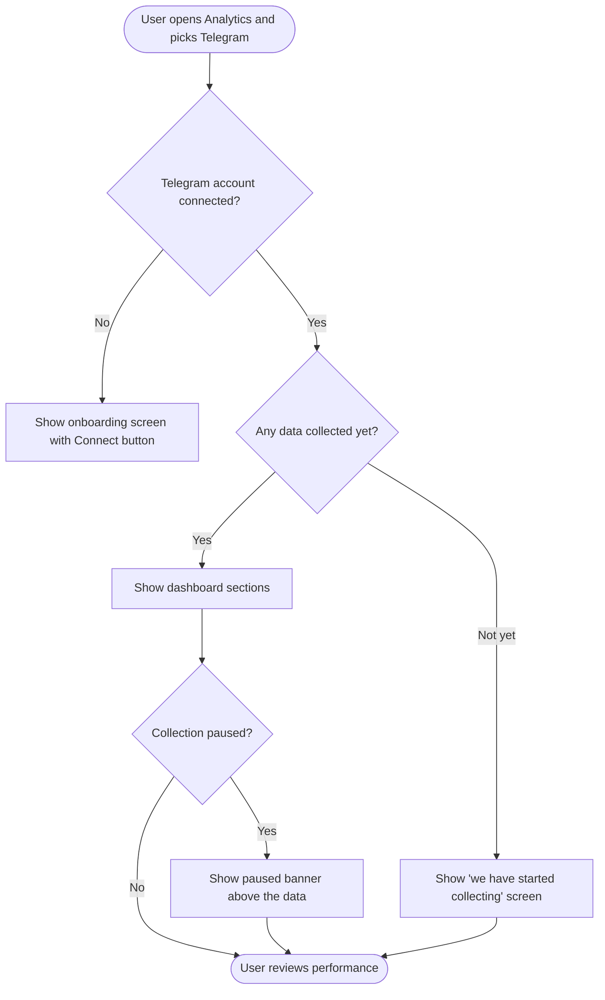
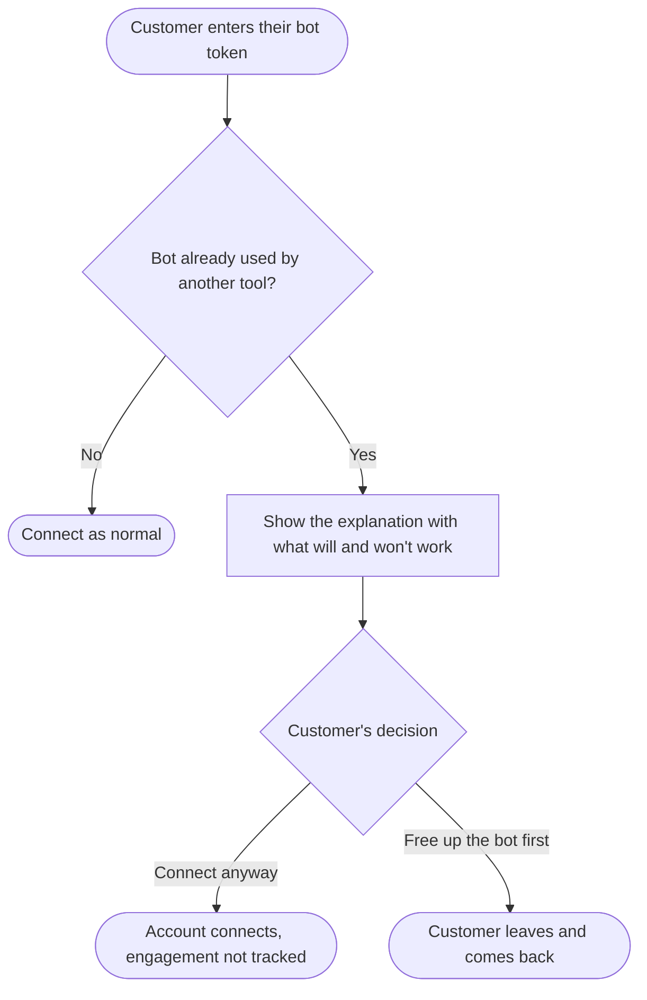

# Telegram Analytics — Epic & Stories

**Date:** August 27, 2026
**Pipeline Step:** 04 — Epic + Stories
**Source:** `03-prd.md` (approved 27 Aug 2026)

> **For the Product Owner.** Nothing here is pushed anywhere. Recreate the epic and each story in the tracker by hand. Stories carry no metadata block — set type, project, group, epic, priority, product area, skill set, estimate, labels and iteration yourself when creating them.

---

## Epic

### Telegram Analytics

ContentStudio has published to Telegram since April 2026, but customers who connect a Telegram channel get nothing back — no subscriber trend, no post performance, no way to include Telegram in a client report. It is the only network in the product that publishes without a dashboard, and agencies producing monthly multi-network reports either hand-assemble Telegram numbers in a spreadsheet or leave the network out entirely.

This epic adds a Telegram analytics dashboard alongside the existing per-platform dashboards, and puts Telegram into the cross-network Overview, scheduled PDF reports and the Looker Studio export. The defining constraint is that Telegram shares no statistics with third-party tools at all — no view counts, no forwards, no subscriber history. The dashboard is therefore built from what is genuinely observable: subscriber counts, reactions broken down by emoji, comments from linked discussion groups, posting activity, and link clicks from ContentStudio's own shortener. We ship without view counts and explain that plainly in the product rather than leaving customers to wonder. No competitor in ContentStudio's benchmark set offers Telegram analytics at all, so an honest dashboard is a category first.

Delivering it requires ContentStudio to start receiving activity from Telegram, which it does not do today. That changes how Telegram accounts connect — including the agency-facing EasyConnect flow — and along the way fixes an existing defect where channels silently fail to appear during connection. Publishing is unaffected throughout, no connected account is disconnected, and no existing data is deleted.

**Release:** Q4 2026 · **Platform:** Web only — mobile is a known follow-on, not in this release.

> **⚠️ On link clicks (stories 5, 7 and 9):** ContentStudio already shortens links when a post is composed, so Telegram posts carry shortened links with no Telegram-specific work. But nothing in ContentStudio reads click counts *back* from a shortener today — that retrieval and per-post attribution is genuinely new work, and these stories assume it. Because shortening is opt-in, a post with no shortened link must show **"no tracked links"** rather than zero, and any click total must state **how many posts it covers**.

> **⚠️ Before creating stories 5 and 7:** both include an **AI insights** section. Telegram's terms of service restrict using platform data for AI and machine learning, with only a narrow consent exception. This needs a legal answer first. AI insights is the only part of the dashboard affected — if the answer is no, drop those two acceptance criteria and everything else ships unchanged.

---

## Stories

1. [BE] Receive and store Telegram channel activity for analytics
2. [BE] Register and remove Telegram activity delivery across the account lifecycle
3. [BE] Move Telegram chat discovery onto stored connection events
4. [BE] Collect Telegram subscriber counts on a daily schedule
5. [BE] Build the Telegram analytics data pipeline and dashboard API
6. [Design] Design the Telegram analytics dashboard and its data-availability states
7. [FE] Build the Telegram analytics dashboard
8. [FE] Show when a Telegram bot is already connected to another tool
9. [FE] Add Telegram to the cross-network Overview and scheduled reports
10. [BE] Expose Telegram analytics in the Looker Studio connector

---

### [BE] Receive and store Telegram channel activity for analytics

### Description:

As a ContentStudio customer with a connected Telegram channel, I want ContentStudio to know what happens on my channel — when I post, when people react, when they comment — so that my Telegram dashboard can show me how my content is performing.

Telegram does not let anyone ask for this information after the fact. There is no way to request "the reactions on this post" or "the posts from last week". Telegram sends activity out as it happens, to one destination per bot, or it is lost permanently. ContentStudio does not receive any of this today, so nothing is being recorded and nothing can be recovered retrospectively.

This story creates the receiving path: a destination Telegram can deliver activity to, verification that the activity genuinely came from Telegram, safe handling of the duplicates Telegram sends when it thinks a delivery failed, and storage of the activity that the dashboard needs.

### Workflow:

This story has no user-facing screen. The activity below is received continuously, whether or not anyone is looking at the dashboard.

1. A customer publishes a post to their Telegram channel — either through ContentStudio, or directly in the Telegram app.
2. ContentStudio receives notice of the post and records it, including what kind of post it was (text, photo, video, album, or file).
3. A subscriber reacts to the post. ContentStudio receives the updated reaction totals for that post, including which emoji were used, and records them.
4. If the channel has a discussion group attached and ContentStudio's bot is an administrator there, a subscriber's comment is received and counted against the post it belongs to.
5. The customer changes ContentStudio's bot permissions, or removes it from the channel. ContentStudio records this so the dashboard can explain that collection has paused.

### Acceptance criteria:

- [ ] Telegram can deliver channel activity to ContentStudio for any connected Telegram account
- [ ] Activity that cannot be verified as genuinely originating from Telegram is rejected and not recorded
- [ ] Each connected account's activity is verified independently — activity for one customer's bot cannot be accepted using another customer's verification
- [ ] Reaction totals are received for channel posts, including the count per individual emoji
- [ ] Reaction totals are only received when explicitly requested from Telegram as part of the activity subscription
- [ ] Posts published directly in Telegram, outside ContentStudio, are recorded alongside posts published through ContentStudio
- [ ] Each recorded post captures its type: text, photo, video, album, or file
- [ ] Posts published through ContentStudio are matched to the originating ContentStudio post
- [ ] Comments are counted per post where the channel has a linked discussion group and ContentStudio's bot is an administrator in it
- [ ] Where no discussion group is linked, comments are recorded as unavailable rather than zero
- [ ] Receiving the same activity twice does not double-count reactions, comments, or posts
- [ ] Activity is accepted and acknowledged quickly enough that Telegram does not retry the delivery
- [ ] Events indicating the bot was added to, removed from, or had its permissions changed in a chat are recorded
- [ ] Chats that migrate from a group to a supergroup are recorded so the account continues to resolve correctly
- [ ] When the bot loses the permissions it needs, the account is marked as paused for collection and previously collected data is retained
- [ ] Activity that cannot be processed is logged with enough detail to diagnose it, and does not stop other activity being processed
- [ ] Telegram publishing behaviour is unchanged by this story

### Mock-ups:

N/A — backend only.

### Impact on existing data:

New storage for Telegram posts, per-post reaction counts by emoji, per-post comment counts, and bot permission events. No existing data is modified or removed. Connected Telegram accounts are not altered by this story.

### Impact on other products:

None directly. This story creates the data that **[BE] Build the Telegram analytics data pipeline and dashboard API** consumes. Telegram publishing, Composer, and the Planner are unaffected.

### Dependencies:

Depends on: **[BE] Register and remove Telegram activity delivery across the account lifecycle** — activity cannot be received until delivery is registered for an account.

### Global quality & compliance (wherever applicable)

- [ ] Mobile responsiveness — N/A, backend-only story
- [ ] Multilingual support (frontend + backend, translations available or fallback handled)
- [ ] UI theming support — N/A, backend-only story
- [ ] White-label domains impact review
- [ ] Cross-product impact assessment (web, mobile apps, Chrome extension)

---

### [BE] Register and remove Telegram activity delivery across the account lifecycle

### Description:

As a ContentStudio customer, I want my Telegram channel to start being measured as soon as I connect it and stop when I disconnect it, without me having to do anything — and without ContentStudio breaking any other tool I happen to run on the same bot.

Each Telegram account in ContentStudio uses a bot that the customer created and supplied. A bot can only send its activity to one destination at a time. Some customers already use their bot with another tool, and if ContentStudio simply took the bot over, that other tool would stop working with no warning and no obvious cause. This story registers ContentStudio as the destination where it is safe to do so, detects when it is not, and never overwrites a destination somebody else set.

It also covers the one-off pass over Telegram accounts connected before this feature existed, so those customers get a dashboard without having to reconnect anything. That pass runs in **report-only mode first**: it inspects every account and reports what it *would* do, changing nothing. We look at the report, confirm the numbers, and only then run it for real.

### Workflow:

1. A customer connects a Telegram channel or group, from Settings, from the agency client connection page, or by reconnecting an existing account.
2. ContentStudio checks whether that bot is already sending its activity somewhere else.
3. If it is not, ContentStudio registers itself as the destination and the channel begins collecting data.
4. If it is already sending activity to another tool, ContentStudio leaves that arrangement untouched, connects the account anyway, and marks engagement metrics as unavailable for it.
5. Either way, the customer can publish to the channel exactly as before.
6. When the customer disconnects the account, ContentStudio stops receiving its activity.
7. When the customer replaces the bot token on an existing account, ContentStudio registers the new bot and stops receiving from the old one.
8. For accounts connected before this feature existed, ContentStudio first produces a report of what would happen to each one, changing nothing. Once that report is reviewed, the same pass is run for real.

### Acceptance criteria:

- [ ] Connecting a Telegram account registers ContentStudio to receive that account's activity
- [ ] Before registering, ContentStudio checks whether the bot is already delivering activity to another destination
- [ ] Where another destination is already set and it is not ContentStudio, ContentStudio does not overwrite it
- [ ] An account whose bot is in use elsewhere still connects successfully and can still publish
- [ ] An account whose bot is in use elsewhere is marked so the dashboard can show engagement metrics as unavailable
- [ ] Disconnecting a Telegram account stops ContentStudio receiving its activity
- [ ] Replacing the bot token on an existing account registers the new bot and stops receiving from the previous one
- [ ] Registration happens for all three connection paths: Settings, the agency client connection page, and reconnecting an existing account
- [ ] The one-off pass can be run in report-only mode, which inspects every account and changes nothing
- [ ] Report-only mode reports, per account and as totals: how many would be registered, how many would be skipped because the bot is in use elsewhere, and how many would fail — with the reason for each
- [ ] Report-only mode makes no calls that alter any bot's activity delivery
- [ ] Report-only mode can be run any number of times with no effect on accounts or data
- [ ] A one-off pass registers activity delivery for every Telegram account connected before this feature shipped
- [ ] The one-off pass applies the same no-overwrite rule and skips any account whose bot is already in use elsewhere
- [ ] The one-off pass records, for every account it processes, whether it registered, skipped, or failed — and why
- [ ] The one-off pass can be re-run safely without duplicating work or changing already-registered accounts
- [ ] No account is disconnected by the one-off pass
- [ ] No previously collected or published data is deleted by the one-off pass
- [ ] Telegram publishing continues to work throughout, for every account, registered or not

### Mock-ups:

N/A — backend only. The customer-facing message for the bot-in-use case is specified in **[FE] Show when a Telegram bot is already connected to another tool**.

### Impact on existing data:

Every existing connected Telegram account gains a collection status indicating whether ContentStudio is receiving its activity, and where it is not, the reason. No account records are removed and no credentials change.

### Impact on other products:

Touches the Telegram connection flow, which is shared by Settings and the agency client connection page. Publishing, Composer and the Planner are unaffected. The customer's own tooling on the same bot is deliberately left alone.

### Dependencies:

Blocks: **[BE] Receive and store Telegram channel activity for analytics**, **[FE] Show when a Telegram bot is already connected to another tool**.
Related: **[BE] Move Telegram chat discovery onto stored connection events** — both change the connection flow and should be tested together.

### Global quality & compliance (wherever applicable)

- [ ] Mobile responsiveness — N/A, backend-only story
- [ ] Multilingual support (frontend + backend, translations available or fallback handled)
- [ ] UI theming support — N/A, backend-only story
- [ ] White-label domains impact review
- [ ] Cross-product impact assessment (web, mobile apps, Chrome extension)

---

### [BE] Move Telegram chat discovery onto stored connection events

### Description:

As a customer connecting a Telegram channel, I want ContentStudio to reliably find the channels my bot has been added to, however long ago I added it, so that I am not staring at an empty list wondering what I did wrong.

Today, when a customer enters their bot token, ContentStudio asks Telegram for the bot's recent activity and works out which chats it belongs to from that. Telegram only keeps that activity for 24 hours. A customer who adds the bot to their channel on Monday and comes back to connect it on Thursday sees an empty list, with nothing explaining why. Once ContentStudio starts receiving activity continuously, the same information can be recorded permanently as it arrives — making discovery both reliable and independent of how recently the bot was used.

This affects both places a customer can connect Telegram: Settings, and the agency client connection page.

### Workflow:

1. A customer enters their bot token on the Telegram connection screen.
2. ContentStudio shows every channel and group the bot has been added to — regardless of when it was added — with each one's name, photo, type and member count.
3. Each entry indicates whether the bot has permission to post there, and where it does not, what is missing.
4. The customer selects the channels they want to connect and confirms.
5. A customer who has just added the bot to a new channel sees that channel appear without having to post in it first.

### Acceptance criteria:

- [ ] Chat discovery returns every chat the bot has been added to, regardless of how long ago
- [ ] A chat the bot was added to more than 24 hours before the customer connects is still discovered
- [ ] Discovery returns each chat's name, photo, type (channel, group or supergroup) and member count, as it does today
- [ ] Discovery indicates whether the bot can post in each chat, and gives the reason where it cannot
- [ ] Chats that migrated from a group to a supergroup resolve to the correct current chat
- [ ] Validating a single chat by its identifier continues to work, including for migrated chats
- [ ] Discovery works identically from Settings and from the agency client connection page
- [ ] Discovery no longer depends on Telegram's short-lived recent-activity buffer
- [ ] A bot newly added to a chat is discoverable without the customer needing to post in that chat first
- [ ] Connecting an account, validating a chat, and adding chats all behave as they do today from the customer's point of view, apart from the improvements above

### Mock-ups:

N/A — backend only. No change to the connection screens.

### Impact on existing data:

Chats the bot belongs to are recorded as their membership events arrive, rather than being derived on demand. Accounts connected before this change are unaffected and remain connected.

### Impact on other products:

Changes behaviour shared by the Settings connection flow and the agency client connection page — both must be verified. Publishing is unaffected.

### Dependencies:

Depends on: **[BE] Receive and store Telegram channel activity for analytics** — discovery reads the membership events that story records.
Related: **[BE] Register and remove Telegram activity delivery across the account lifecycle**.

### Global quality & compliance (wherever applicable)

- [ ] Mobile responsiveness — N/A, backend-only story
- [ ] Multilingual support (frontend + backend, translations available or fallback handled)
- [ ] UI theming support — N/A, backend-only story
- [ ] White-label domains impact review
- [ ] Cross-product impact assessment (web, mobile apps, Chrome extension)

---

### [BE] Collect Telegram subscriber counts on a daily schedule

### Description:

As a Telegram channel owner, I want to see whether my subscriber count is going up or down over time, so that I can tell whether my content is growing the channel.

Telegram will tell us how many subscribers a channel has right now, but it keeps no history and will not tell us who joined or left. The only way to produce a growth chart is for ContentStudio to record the number regularly from the day the account is connected. This means the chart starts on the connection date and can never be backfilled — there is no historical data in existence to recover.

Telegram also treats aggressive checking of subscriber counts as abuse, so this must be paced conservatively.

### Workflow:

This story has no user-facing screen.

1. Once a day, ContentStudio records the current subscriber count for every connected Telegram channel and group.
2. The recorded numbers build up over time into the growth chart the customer sees on their dashboard.
3. Where a channel's count cannot be read — because the bot lost access, for example — the day is recorded as unavailable rather than as zero.

### Acceptance criteria:

- [ ] Subscriber count is recorded once per day for every connected Telegram channel and group
- [ ] A given account's subscriber count is never requested more than once per day
- [ ] The first count is recorded as soon as an account connects, so a brand-new account is not blank
- [ ] Where the count cannot be read, the day is recorded as unavailable, not as zero
- [ ] An account whose count cannot be read does not prevent other accounts being recorded
- [ ] When Telegram asks ContentStudio to slow down, the wait it specifies is honoured before retrying
- [ ] Requests are spread out rather than sent for all accounts simultaneously
- [ ] Accounts whose collection is paused are skipped without generating errors
- [ ] Previously recorded counts are never overwritten or deleted by a later run

### Mock-ups:

N/A — backend only.

### Impact on existing data:

New daily subscriber records per Telegram account. Nothing existing is modified. No history exists before the first collection for each account.

### Impact on other products:

None. Subscriber counts are already read during account connection; this adds a scheduled record of the same information.

### Dependencies:

None blocking. Feeds **[BE] Build the Telegram analytics data pipeline and dashboard API**.

### Global quality & compliance (wherever applicable)

- [ ] Mobile responsiveness — N/A, backend-only story
- [ ] Multilingual support (frontend + backend, translations available or fallback handled)
- [ ] UI theming support — N/A, backend-only story
- [ ] White-label domains impact review
- [ ] Cross-product impact assessment (web, mobile apps, Chrome extension)

---

### [BE] Build the Telegram analytics data pipeline and dashboard API

### Description:

As a Telegram customer, I want my channel's activity turned into the charts and lists I see on my dashboard, for whatever date range I choose, so that I can understand my performance without doing any arithmetic myself.

Raw activity — a reaction here, a post there, a subscriber count each day — is not a dashboard. This story processes what has been collected into the sections the dashboard displays, and makes them available for a selected date range, with the option to compare against the preceding period. It follows the same structure as the other network dashboards so that Telegram behaves consistently with Facebook, LinkedIn and the rest.

Telegram groups are included with a reduced set of sections, because a group has no broadcast audience and its posts are conversation rather than publication.

### Workflow:

This story has no user-facing screen. It supplies the data for **[FE] Build the Telegram analytics dashboard**.

1. Activity collected from Telegram, plus subscriber counts and link click data, is processed into per-period figures.
2. When a customer opens their dashboard and picks a date range, each section is available for that range.
3. Where a requested range extends earlier than the day collection started for that account, the response says so, so the dashboard can label it rather than showing zero.

### Acceptance criteria:

- [ ] A summary section returns subscribers now, change over the period, posts published, total reactions, total comments and total link clicks
- [ ] A subscriber growth section returns the daily subscriber count across the selected period
- [ ] A publishing activity section returns posts published across the period, broken down by post type
- [ ] A reactions section returns total reactions and a breakdown by individual emoji
- [ ] A posts section returns every post in the period with its reactions, comments and link clicks, and can be sorted by each
- [ ] A top and least performing posts section returns the best and worst performers for the period
- [ ] An AI insights section is available, consistent with the other network dashboards
- [ ] All sections accept a date range and support comparison against the preceding period
- [ ] Where a requested range starts before collection began for that account, the response identifies which part of the range has no data
- [ ] Metrics that cannot be collected for an account are returned as unavailable, distinct from a value of zero
- [ ] Comments are returned as unavailable for channels with no linked discussion group, distinct from zero comments
- [ ] Engagement metrics are returned as unavailable for accounts whose bot is in use by another tool
- [ ] Telegram groups return the reduced set: summary, member count over time, publishing activity, and reactions on posts published through ContentStudio
- [ ] Telegram groups do not return sections that have no meaning for a group
- [ ] No section returns, derives, or estimates view counts, forwards, reach, or view rate
- [ ] Link click figures come from ContentStudio's link shortener and are attributed to the post that carried the link
- [ ] A post published without a shortened link returns "no tracked links" for clicks, distinct from a click count of zero
- [ ] Any total click figure is returned together with the number of posts in the period that carried a trackable link
- [ ] Requesting data for an account with no data yet returns an empty result rather than an error
- [ ] Section responses follow the same shape as the other network dashboards

### Mock-ups:

N/A — backend only. See PRD section 7.

### Impact on existing data:

New processed Telegram analytics storage. Reads the activity, subscriber and link click data collected by other stories in this epic. No existing analytics data for other networks is affected.

### Impact on other products:

Adds Telegram to the analytics data layer used by the dashboards, the cross-network Overview, scheduled reports and the Looker Studio export. Other networks are unaffected.

### Dependencies:

Depends on: **[BE] Receive and store Telegram channel activity for analytics**, **[BE] Collect Telegram subscriber counts on a daily schedule**.
Blocks: **[FE] Build the Telegram analytics dashboard**, **[FE] Add Telegram to the cross-network Overview and scheduled reports**, **[BE] Expose Telegram analytics in the Looker Studio connector**.

### Global quality & compliance (wherever applicable)

- [ ] Mobile responsiveness — N/A, backend-only story
- [ ] Multilingual support (frontend + backend, translations available or fallback handled)
- [ ] UI theming support — N/A, backend-only story
- [ ] White-label domains impact review
- [ ] Cross-product impact assessment (web, mobile apps, Chrome extension)

---

### [Design] Design the Telegram analytics dashboard and its data-availability states

### Description:

As a designer, I want to design the Telegram analytics dashboard and the several states it can be in, so that customers get a dashboard that is consistent with the other networks and is honest about what Telegram does and does not share.

Telegram is the first network in ContentStudio where a headline metric is permanently unavailable rather than temporarily missing. It is also the first where the data starts on the connection date rather than going back in time. Both need a visual treatment that reads as deliberate rather than broken — and the treatment should be reusable, because Bluesky and Threads will face the same problem.

### Workflow:

1. Designer reviews the existing per-platform analytics dashboards for layout, card structure and section rhythm.
2. Designer designs the Telegram dashboard sections: summary cards, subscriber growth, publishing activity, reactions with emoji breakdown, posts list, top and least performers, and AI insights.
3. Designer designs the reactions-by-emoji visualisation, which has no equivalent on any other network.
4. Designer designs the treatment for the missing view counts — a short explanation that sits with the dashboard without dominating it.
5. Designer designs each data-availability state: onboarding empty state, data-collecting state, collection-paused state, comments-not-configured state, and engagement-unavailable state.
6. Designer designs the reduced dashboard for Telegram groups.
7. Designer hands over to frontend.

### Acceptance criteria:

- [ ] Telegram dashboard layout is designed and consistent with the existing per-platform dashboards
- [ ] Reactions-by-emoji visualisation is designed
- [ ] The missing-view-counts explanation is designed so it reads as informative, not as an error or a disabled feature
- [ ] Onboarding empty state is designed, following the existing analytics onboarding empty state pattern
- [ ] Data-collecting state is designed, clearly distinct from an error and from an empty result
- [ ] Collection-paused state is designed, showing previously collected data alongside the explanation
- [ ] Comments-not-configured state is designed, visually distinct from a comment count of zero
- [ ] Engagement-unavailable state is designed for accounts whose bot is in use elsewhere
- [ ] Reduced group dashboard is designed
- [ ] Unavailable metrics are visually distinct from zero values throughout
- [ ] Designs cover desktop and responsive breakpoints
- [ ] The unavailable-metric and data-collecting treatments are documented as reusable for other networks with limited data
- [ ] Designs use existing design system components wherever they exist, and any gap is flagged explicitly

### Mock-ups:

This story produces them.

### Impact on existing data:

None.

### Impact on other products:

The unavailable-metric and data-collecting patterns are intended for reuse by any future network with limited analytics coverage.

### Dependencies:

Blocks: **[FE] Build the Telegram analytics dashboard**.

### Global quality & compliance (wherever applicable)

- [ ] Mobile responsiveness (frontend only, N/A for backend-only stories)
- [ ] Multilingual support (frontend + backend, translations available or fallback handled)
- [ ] UI theming support (default + white-label, design library components are being used)
- [ ] White-label domains impact review
- [ ] Cross-product impact assessment (web, mobile apps, Chrome extension)

---

### [FE] Build the Telegram analytics dashboard

### Description:

As a Telegram channel owner, I want a dashboard in ContentStudio showing how my channel and my posts are performing, so that I can improve what I publish without leaving the product or opening Telegram on my phone.

This is the customer-facing dashboard. It sits alongside the other network dashboards, uses the same account selector and date picker, and shows what Telegram genuinely makes available. It also has to handle several states no other network dashboard has: data that only starts on the connection date, a headline metric that will never exist, and engagement that may be unavailable if the customer's bot is being used elsewhere.

### Workflow:

1. The user opens **Analytics** and selects **Telegram**.
2. If they have several Telegram accounts connected, they choose one from the account selector.
3. They pick a date range, optionally comparing against the previous period.
4. The dashboard loads its sections.
5. The user reads the short note explaining that Telegram does not share view counts, and can follow the link to find out more.
6. The user sorts the posts list to find their best and worst performers.
7. The user opens a post to see what was published and how people responded.

### Acceptance criteria:

**Navigation and shell**

- [ ] Telegram appears in the analytics network list alongside the other platforms
- [ ] Selecting Telegram opens the Telegram dashboard for the selected account
- [ ] Connected Telegram channels and groups appear in the standard analytics account selector
- [ ] The standard date range picker is available, including comparison against the previous period
- [ ] Section layout, cards and loading behaviour match the other per-platform dashboards

**Sections**

- [ ] Summary cards show, in this order: Subscribers, Posts published, Link clicks, Reactions, Comments
- [ ] The Link clicks card states how many posts the figure covers, using this copy: "across [n] of [total] posts"
- [ ] Subscriber growth chart renders across the selected period
- [ ] Publishing activity shows posts published, broken down by post type
- [ ] Reactions section shows total reactions and a breakdown by individual emoji
- [ ] Posts list shows every post in the period with reactions, comments and link clicks, sortable by each
- [ ] A post with no shortened link shows "No tracked links" in place of a click count, never 0
- [ ] Top and least performing posts sections render for the selected period
- [ ] AI insights section renders, consistent with the other network dashboards
- [ ] Clicking a post opens its detail, showing what was published, when, and how people responded
- [ ] Telegram groups show only the reduced set: summary, member count over time, publishing activity, and reactions on posts published through ContentStudio

**The missing view counts**

- [ ] A short explanation appears near the top of the dashboard, using this copy:
  - **Heading:** "Why there are no view counts here"
  - **Body:** "Telegram doesn't share view counts with any outside tool, including ContentStudio. You can see views on each post inside the Telegram app. Everything below — reactions, comments, and clicks — is what Telegram does share with us."
  - **Link label:** "See views in Telegram"
- [ ] No card, chart, tooltip or export anywhere on the dashboard shows, estimates or derives views, forwards, reach or view rate
- [ ] The explanation is styled as information, not as a warning or an error

**States**

- [ ] **No Telegram account connected** — the standard analytics onboarding empty state is shown, using this copy:
  - **Headline:** "See how your Telegram channel is performing"
  - **Subtext:** "Connect a Telegram channel to track your subscribers, see which posts people react to, and include Telegram in your client reports."
  - **CTA button:** "Connect Telegram"
  - **Secondary link:** "Learn more"
- [ ] **Connected, no data collected yet** — a dedicated state is shown, using this copy:
  - **Headline:** "We've started collecting your Telegram data"
  - **Subtext:** "Telegram doesn't share past activity, so your charts begin from today. Check back tomorrow to see your first full day. Your subscriber count is already below."
  - The current subscriber count is displayed even in this state
- [ ] The collecting state does not use error styling and shows no error icon
- [ ] **Collection paused** — a banner appears above the existing data, using this copy:
  - **Message:** "We've stopped receiving updates from this channel. This usually means the ContentStudio bot was removed or lost its admin permissions. Your existing data is safe."
  - **Action label:** "How to fix this"
- [ ] Previously collected data remains visible while collection is paused
- [ ] **Engagement unavailable (bot in use elsewhere)** — reaction and comment cards show this copy instead of a value:
  - **Label:** "Not available"
  - **Tooltip:** "This channel's bot is sending its activity to another tool, so we can't track reactions or comments here. Your subscriber count and posting activity are unaffected."
- [ ] **No tracked links** — where a post carried no shortened link, the clicks value is replaced with:
  - **Label:** "No tracked links"
  - **Tooltip:** "We can only count clicks on links that ContentStudio shortened for you. This post didn't have any, so there's nothing to count — it doesn't mean nobody clicked."
- [ ] **Comments not configured** — the comments card shows this copy instead of a value:
  - **Label:** "Not set up"
  - **Tooltip:** "Comments only exist on Telegram channels that have a discussion group attached. Add a discussion group to your channel in Telegram, and comments will start appearing here."
- [ ] **Date range starts before collection began** — the affected part of the chart is labelled with: "No data before [date] — this is when we started collecting."
- [ ] **No posts in the selected period** — the posts list shows: "No posts published in this date range. Try selecting a wider range."
- [ ] **Loading** — skeleton loading states are shown per section, matching the other dashboards
- [ ] **Error** — a section that fails to load shows the standard analytics section error state with a retry action

**Tooltips**

- [ ] Subscribers card tooltip: "How many people are subscribed to this channel right now. For example, if this says 1,240, that's your current audience size."
- [ ] Posts published card tooltip: "How many posts went out to this channel in the dates you selected — including posts you published directly in Telegram, not just through ContentStudio."
- [ ] Reactions card tooltip: "How many times people reacted to your posts with an emoji, like 👍 or ❤️, in the dates you selected."
- [ ] Comments card tooltip: "How many comments people left on your posts. Comments come from the discussion group attached to your channel."
- [ ] Link clicks card tooltip: "How many times people clicked the links in your Telegram posts. We can only count links that ContentStudio shortened for you — for example, a post where you pasted a raw link won't be counted here."

**Components and theming**

- [ ] Existing design system components are used for buttons, badges, tooltips, alerts and loading indicators
- [ ] No hardcoded colour values are used; theme-aware classes are used throughout so white-label domains render correctly
- [ ] All copy above is added as translation keys, with entries in every locale

**Analytics events**

- [ ] When a user loads the Telegram dashboard for the first time in a workspace, a `telegram_analytics_first_viewed` Usermaven event fires with `{ account_type: 'channel' | 'group' }`
- [ ] When a user clicks the link in the missing-view-counts explanation, a `telegram_views_explainer_opened` Usermaven event fires with `{ }`

### Mock-ups:

See PRD section 7. Detailed designs come from **[Design] Design the Telegram analytics dashboard and its data-availability states**.

### Impact on existing data:

None. This story reads existing data only.

### Impact on other products:

Adds a network to the analytics module. Other dashboards are unaffected. New translation keys are added across all locales.

### Dependencies:

Depends on: **[BE] Build the Telegram analytics data pipeline and dashboard API**, **[Design] Design the Telegram analytics dashboard and its data-availability states**.

### Global quality & compliance (wherever applicable)

- [ ] Mobile responsiveness (frontend only, N/A for backend-only stories)
- [ ] Multilingual support (frontend + backend, translations available or fallback handled)
- [ ] UI theming support (default + white-label, design library components are being used)
- [ ] White-label domains impact review
- [ ] Cross-product impact assessment (web, mobile apps, Chrome extension)

---

### [FE] Show when a Telegram bot is already connected to another tool

### Description:

As a customer connecting a Telegram channel whose bot I already use somewhere else, I want ContentStudio to tell me plainly what will and won't work, so that I can decide whether to free up the bot instead of discovering the gap weeks later in my dashboard.

A Telegram bot can only send its activity to one tool at a time. Where a customer's bot is already reporting to something else, ContentStudio deliberately leaves that alone rather than taking it over — which means publishing works normally, but reactions and comments cannot be tracked for that channel. This story is the message that explains it, shown in every place a customer can connect Telegram.

### Workflow:

1. The customer enters their bot token on the Telegram connection screen — in Settings, on the agency client connection page, or while reconnecting an existing account.
2. ContentStudio detects that the bot is already sending its activity to another tool.
3. The customer sees an explanation of what this means: publishing and subscriber tracking will work, reactions and comments will not.
4. The customer either continues and connects the account anyway, or leaves to free the bot up in the other tool first.
5. If they connect anyway, the account works normally for publishing, and the dashboard shows engagement metrics as unavailable.

### Acceptance criteria:

- [ ] Where the bot is already in use by another tool, an explanation appears on the Telegram connection screen before the customer completes the connection, using this copy:
  - **Heading:** "This bot is already connected to another tool"
  - **Body:** "Telegram only lets a bot send its activity to one tool at a time, and this one is already sending to something else. We've left that alone so nothing of yours breaks. You can still connect this channel and publish to it as normal — but we won't be able to show reactions or comments in your Telegram analytics."
  - **Helper text:** "Want the full picture? Disconnect this bot from your other tool, or create a new bot just for ContentStudio, then come back and reconnect."
  - **Primary button:** "Connect anyway"
  - **Secondary button:** "Cancel"
- [ ] Choosing "Connect anyway" completes the connection normally
- [ ] Choosing "Cancel" returns the customer to the connection screen without connecting
- [ ] The explanation is shown when connecting from Settings
- [ ] The explanation is shown when connecting from the agency client connection page
- [ ] The explanation is shown when reconnecting an existing account
- [ ] The explanation is styled as information requiring a decision, not as a failure
- [ ] Connection is never blocked because of this condition
- [ ] An account connected in this state publishes exactly as any other Telegram account does
- [ ] All copy above is added as translation keys, with entries in every locale
- [ ] Existing design system components are used for the message, buttons and helper text
- [ ] No hardcoded colour values are used; theme-aware classes are used so white-label domains render correctly
- [ ] When the explanation is displayed, a `telegram_bot_conflict_shown` Usermaven event fires with `{ source: 'settings' | 'easy_connect' | 'reconnect' }`
- [ ] When a Telegram account connection completes, a `connected_social_accounts` Usermaven event fires with `{ platform: 'telegram' }` — this event does not currently fire for Telegram and is added by this story

### Mock-ups:

See PRD section 7.

### Impact on existing data:

None. This story displays a state determined by the backend.

### Impact on other products:

Adds a state to the Telegram connection flow shared by Settings, the agency client connection page and the reconnect path. Other platforms' connection flows are unaffected. Also closes an existing gap where Telegram account connections were not being tracked at all.

### Dependencies:

Depends on: **[BE] Register and remove Telegram activity delivery across the account lifecycle** — that story determines and exposes the bot-in-use state.
Related: **[FE] Build the Telegram analytics dashboard** — shows the matching unavailable state on the dashboard itself.

### Global quality & compliance (wherever applicable)

- [ ] Mobile responsiveness (frontend only, N/A for backend-only stories)
- [ ] Multilingual support (frontend + backend, translations available or fallback handled)
- [ ] UI theming support (default + white-label, design library components are being used)
- [ ] White-label domains impact review
- [ ] Cross-product impact assessment (web, mobile apps, Chrome extension)

---

### [FE] Add Telegram to the cross-network Overview and scheduled reports

### Description:

As an agency account manager, I want Telegram included in my cross-network Overview and in the PDF reports I send to clients, so that my monthly report covers every network the client actually uses instead of quietly omitting one.

This is the reason the epic earns its place. Today a client running a Telegram channel gets a report with a Telegram-shaped hole in it, and the account manager either pastes in screenshots or explains the gap. Adding Telegram to the Overview and the report generator closes that.

### Workflow:

1. The user opens **Analytics → Overview** for a workspace with a connected Telegram account.
2. Telegram appears alongside the other networks, contributing the metrics it has.
3. The user builds or schedules a report and sees Telegram available as a section to include.
4. The user includes Telegram and generates the report.
5. The generated PDF contains the Telegram section, with the same explanation about view counts that appears on the dashboard.

### Acceptance criteria:

- [ ] Telegram appears in the cross-network Overview for workspaces with a connected Telegram account
- [ ] Telegram contributes only the metrics it has; metrics it cannot supply are shown as unavailable rather than zero
- [ ] The Overview does not show, estimate or derive views, forwards or reach for Telegram
- [ ] Telegram is available as a selectable section when building or scheduling a report
- [ ] A generated PDF report includes the Telegram section when selected
- [ ] The Telegram report section includes this note: "Telegram doesn't share view counts with outside tools, so this section shows reactions, comments and clicks instead."
- [ ] Telegram accounts with no data yet show the collecting state in reports rather than an empty section
- [ ] Telegram groups contribute their reduced metric set to the Overview and reports
- [ ] Report layout and styling match the existing per-network report sections
- [ ] All copy above is added as translation keys, with entries in every locale
- [ ] No hardcoded colour values are used; theme-aware classes are used so white-label domains render correctly
- [ ] When a report containing a Telegram section is scheduled or downloaded, a `telegram_analytics_added_to_report` Usermaven event fires with `{ report_type: 'scheduled' | 'download' }`

### Mock-ups:

See PRD section 7.

### Impact on existing data:

None. Existing saved and scheduled reports are unaffected and continue to render as before.

### Impact on other products:

Extends the Overview and the report generator. Other networks' sections are unaffected.

### Dependencies:

Depends on: **[BE] Build the Telegram analytics data pipeline and dashboard API**, **[FE] Build the Telegram analytics dashboard**.

### Global quality & compliance (wherever applicable)

- [ ] Mobile responsiveness (frontend only, N/A for backend-only stories)
- [ ] Multilingual support (frontend + backend, translations available or fallback handled)
- [ ] UI theming support (default + white-label, design library components are being used)
- [ ] White-label domains impact review
- [ ] Cross-product impact assessment (web, mobile apps, Chrome extension)

---

### [BE] Expose Telegram analytics in the Looker Studio connector

### Description:

As an agency building custom client dashboards outside ContentStudio, I want Telegram data available through the Looker Studio connector, so that my custom reporting covers every network my client uses.

Customers who have outgrown the built-in reports build their own dashboards on ContentStudio's Looker Studio connector. Telegram is currently absent from it, so those dashboards have the same gap the built-in reports do.

### Workflow:

This story has no ContentStudio screen. The user works in Looker Studio.

1. The user connects ContentStudio as a data source in Looker Studio, as they do today.
2. Telegram fields are available for selection alongside the other networks' fields.
3. The user builds charts and tables from Telegram data for a chosen date range.

### Acceptance criteria:

- [ ] Telegram fields are available through the Looker Studio connector
- [ ] Available fields cover subscribers, posts published, reactions, comments and link clicks
- [ ] Field naming and types are consistent with how the other networks expose their fields
- [ ] No field exposes, estimates or derives views, forwards, reach or view rate
- [ ] Metrics that cannot be collected for an account are returned as unavailable, distinct from zero
- [ ] Date ranges extending before collection began return no data for the earlier portion rather than zero values
- [ ] Telegram groups expose only their reduced field set
- [ ] Existing Looker Studio dashboards built on other networks continue to work unchanged

### Mock-ups:

N/A — backend only.

### Impact on existing data:

None. Adds fields to an existing connector.

### Impact on other products:

Extends the Looker Studio connector. Existing connected dashboards are unaffected.

### Dependencies:

Depends on: **[BE] Build the Telegram analytics data pipeline and dashboard API**.

### Global quality & compliance (wherever applicable)

- [ ] Mobile responsiveness — N/A, backend-only story
- [ ] Multilingual support (frontend + backend, translations available or fallback handled)
- [ ] UI theming support — N/A, backend-only story
- [ ] White-label domains impact review
- [ ] Cross-product impact assessment (web, mobile apps, Chrome extension)
