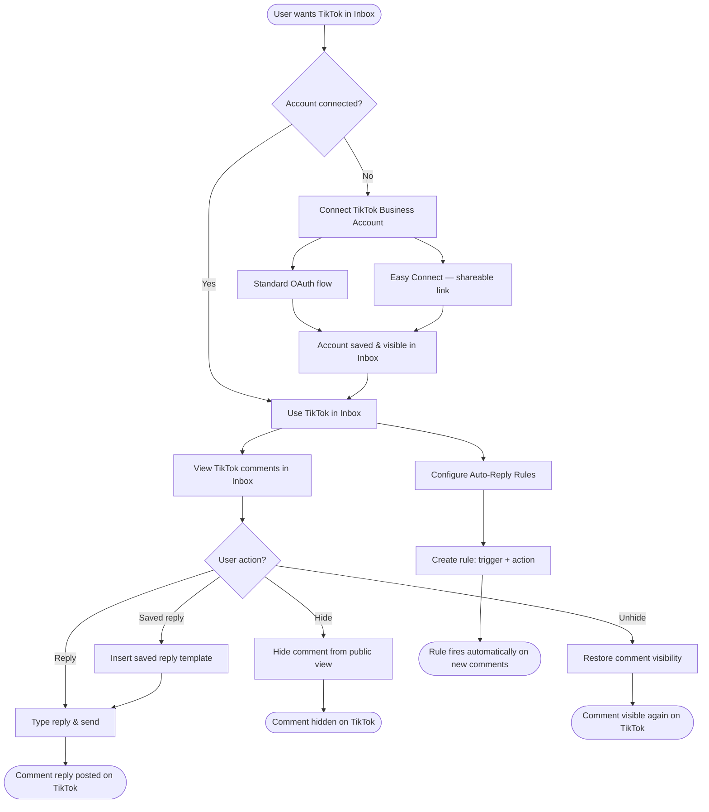
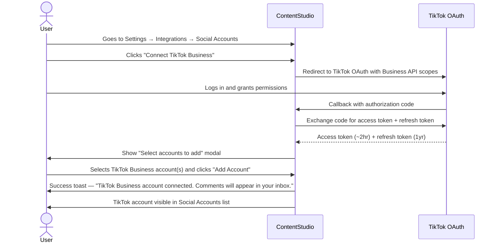
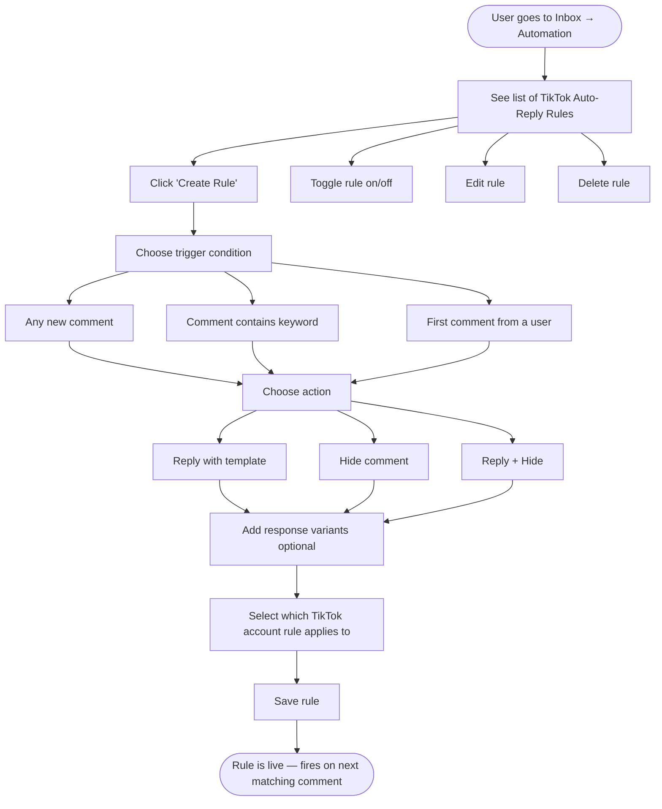

# Workflow Design — TikTok Business Account Inbox

**Feature:** TikTok Inbox — view & reply to comments, connect TikTok Business accounts, auto-reply rules
**Date:** 2026-04-30

---

## 1. Feature Placement

| Surface | Location |
|---|---|
| Account connection | Settings → Integrations → Social Accounts → "Connect TikTok Business" |
| Easy Connect | Settings → Integrations → Social Accounts → Easy Connect tab → Generate link |
| Inbox — comment view | Inbox → filter by TikTok channel |
| Auto-reply rules | Inbox → Automation → TikTok Auto-Reply Rules (new section) |

TikTok comments appear in the existing unified inbox alongside Facebook, Instagram, LinkedIn, and YouTube. No separate TikTok-only inbox is created.

---

## 2. High-Level Overview Diagram

---

## 3. Flow A — Connect TikTok Business Account (Standard OAuth)

**User steps:**
1. User navigates to Settings → Integrations → Social Accounts
2. User clicks "Connect a New Account" and selects TikTok Business
3. A TikTok authorization window opens — user logs in and grants permissions
4. ContentStudio shows a "Select Accounts" modal listing all TikTok Business accounts under the authenticated user
5. User selects the account(s) to add and clicks "Add to Inbox"
6. Success toast appears: *"TikTok Business account connected. Comments will start appearing in your inbox within a few minutes."*
7. The connected account appears in the Social Accounts list with a TikTok badge

**Error states:**
- OAuth denied by user → modal closes, toast: *"TikTok connection was cancelled. Try again or contact support if this keeps happening."*
- Token exchange fails → toast: *"We couldn't connect your TikTok account. Please try again."*
- Business API scopes not granted → warning banner: *"Some TikTok permissions are missing. Comment management may not work. Reconnect to grant full access."*

---

## 4. Flow B — Easy Connect (Shareable Link)

**Use case:** The TikTok account is managed by someone else (a client, an influencer) who needs to authorize without sharing their TikTok login credentials with the agency.

**User steps:**
1. User (agency manager) navigates to Settings → Integrations → Easy Connect
2. User selects "TikTok Business" from the platform list and clicks "Generate Link"
3. ContentStudio generates a unique shareable link (e.g., `app.contentstudio.io/connect/tt/abc123`) — valid for 7 days
4. User copies the link and shares it with the account owner (via email, Slack, etc.)
5. Account owner opens the link → sees a ContentStudio-branded page explaining what access is being requested
6. Account owner clicks "Authorize with TikTok" → goes through TikTok OAuth → grants permission
7. ContentStudio stores the tokens and sends a notification to the manager: *"[Account owner] has connected their TikTok Business account."*
8. The new account appears in the workspace's Social Accounts list

**Error states:**
- Link expired (>7 days) → account owner sees: *"This connection link has expired. Ask your workspace manager to generate a new one."*
- Account already connected → toast to manager: *"This TikTok account is already connected to your workspace."*

---

## 5. Flow C — View & Reply to TikTok Comments in Inbox

**User steps:**
1. User navigates to Inbox from the left sidebar
2. User optionally filters by TikTok channel using the channel/platform filter (TikTok appears alongside Facebook, Instagram, etc.)
3. TikTok comments appear as inbox items — each shows:
   - Commenter username + avatar
   - Comment text
   - Timestamp
   - Video thumbnail + title the comment was posted on
   - Platform badge (TikTok icon)
4. User clicks a comment to open the conversation thread
5. The thread shows the original video context at the top (thumbnail + title + link to TikTok)
6. User sees nested replies if any exist
7. User types a reply in the composer (character counter shown — max 150 chars)
8. User optionally clicks "Saved Replies" to insert a pre-written template
9. User clicks "Send" — reply is posted to TikTok
10. Success indicator: reply appears in the thread immediately

**Hide/Unhide flow:**
- User clicks the "⋮" (more actions) menu on a comment → selects "Hide Comment"
- Comment is hidden from public view on TikTok
- In Inbox, comment displays a "Hidden" badge
- User can click "Unhide" to restore visibility

**Error states:**
- Reply fails (API error) → toast: *"Your reply couldn't be sent. Check your TikTok account connection and try again."*
- TikTok token expired → banner on the inbox item: *"Your TikTok account needs to be reconnected to reply to comments."* with "Reconnect" CTA
- Comment deleted by creator before reply → toast: *"This comment no longer exists on TikTok."*

---

## 6. Flow D — Auto-Reply Rules

**User steps:**
1. User navigates to Inbox → Automation tab
2. User sees a list of existing auto-reply rules (or empty state if none)
3. User clicks "Create Rule"
4. A rule builder modal opens with these fields:
   - **Rule name** — internal label (e.g., "Reply to price questions")
   - **Applies to** — select which TikTok Business account(s) this rule covers
   - **Trigger condition** — one of: All new comments / Comment contains keyword(s) / First comment from a user
   - **Keyword(s)** — visible only when "Contains keyword" is selected; supports comma-separated keywords
   - **Action** — one of: Reply with template / Hide comment / Reply + Hide
   - **Response template(s)** — one or more reply variants; if multiple, ContentStudio rotates them randomly to avoid spam detection
5. User saves the rule
6. Rule appears in the list with on/off toggle
7. When a new comment arrives matching the trigger, ContentStudio automatically fires the action

**Edge cases:**
- Rule with keyword trigger: matching is case-insensitive, partial match (e.g., keyword "price" matches "What's the price?")
- Multiple rules match same comment → only the first matching rule fires (rules are prioritized by creation order; user can drag to reorder)
- TikTok rate limits hit during auto-reply batch → system queues retries with exponential backoff; user sees no disruption

**Error states:**
- Auto-reply fails for a comment → comment flagged in Inbox with: *"Auto-reply failed. Click to retry or reply manually."*
- TikTok account disconnected → all rules for that account paused; banner: *"Auto-reply rules for [Account Name] are paused because the account needs reconnecting."*

---

## 7. Key Design Decisions

### Decision 1 — TikTok DMs: include in v1 or defer?

**Option A: Include TikTok DMs (Business Messaging API) in v1**
- Pro: More complete inbox experience; matches Hootsuite's offering
- Con: The Business Messaging API is geo-restricted (Americas, Asia-Pacific, Africa, Australia only); requires a separate API surface and approval; adds significant scope
- **Recommendation: Defer to Phase 2.** Build the comment management foundation first. DMs can be added as a follow-up once the TikTok Business Account connection is stable.

### Decision 2 — Auto-reply rule engine: TikTok-only or multi-platform?

**Option A: Build TikTok-specific auto-reply only**
- Pro: Focused scope, ships faster
- Con: If we extend to other platforms later, we'll need to rebuild the rule engine

**Option B: Build a generic rule engine that starts with TikTok**
- Pro: Reusable for Facebook, Instagram, YouTube comments; better long-term investment
- Con: More upfront design work
- **Recommendation: Build a generic rule engine (backed by `InboxAutoReplyRule` model with a `platform` field), but expose only TikTok rules in the UI for v1.** This avoids a rebuild when extending to other platforms.

### Decision 3 — Where to surface auto-reply rules?

**Option A: Under Inbox → sidebar/filter area**
- Pro: Contextually close to inbox
- Con: Clutters the inbox layout

**Option B: Under Inbox → dedicated Automation tab**
- Pro: Clean separation; scalable as more rule types are added
- **Recommendation: Inbox → Automation tab.** This mirrors the pattern other tools (Sprout Social) use and leaves room for future automation types.

---

## 8. Integration with Existing Features

| Existing Feature | Integration |
|---|---|
| Unified Inbox | TikTok comments appear as first-class inbox items alongside all other platforms — no separate view needed |
| Saved Replies | Existing saved reply infrastructure works for TikTok; no changes needed beyond ensuring TikTok is not excluded from the platform filter |
| Social Accounts | TikTok Business Accounts appear in the Social Accounts list alongside other platforms; reconnect banner pattern matches Instagram's |
| Easy Connect | Existing `ExternalLinkIntegrationController` + `ExternalCloudConnect.vue` extended to support TikTok Business account scope |
| Auto-Reply (new) | Net-new feature; designed as platform-agnostic rule engine scoped to TikTok for v1 |

---

## 9. Scope — v1 vs. Phase 2

### v1 (this epic)
- ✅ Connect TikTok Business Account via standard OAuth
- ✅ Easy Connect (shareable link)
- ✅ View TikTok comments in the unified inbox
- ✅ Reply to TikTok comments (inline, 150 char limit)
- ✅ Hide / unhide TikTok comments
- ✅ Saved replies support for TikTok
- ✅ Post/video context visible on each comment card
- ✅ Auto-reply rules (keyword trigger, all comments, first-comment trigger → reply template / hide / both)
- ✅ Response variants (randomized rotation)
- ✅ Reconnect banner for expired TikTok tokens

### Phase 2 (defer)
- ❌ TikTok Business Messaging (DMs) — geo-restricted, separate API approval required
- ❌ Ad comment management (Ads Manager API, separate partnership)
- ❌ Bulk comment actions (hide multiple at once)
- ❌ Auto-reply for other platforms (rule engine is designed for this, UI is TikTok-only in v1)
- ❌ TikTok comment sentiment tagging
- ❌ Team assignment / comment routing
- ❌ Inbox performance reporting (response rate, first-response time)
