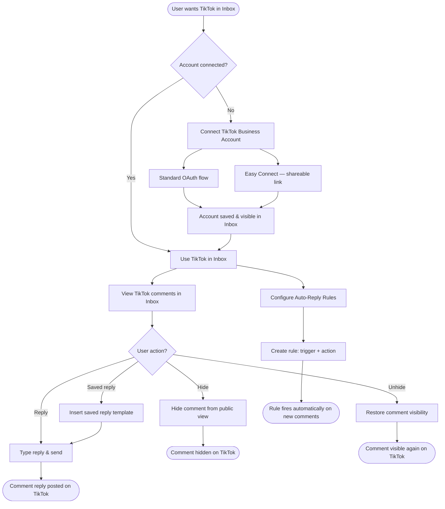

# PRD: TikTok Business Account Inbox — Comments, Connection & Auto-Reply

**Author:** Tehreem Shehzadi
**Last Updated:** 2026-04-30
**Status:** In Review
**Target Release:** Q2 2026

---

## 1. Overview

ContentStudio's social inbox currently supports Facebook, Instagram, LinkedIn, YouTube, and Google My Business — but not TikTok. As TikTok has become a primary engagement channel for brands (with comment sections serving as a key customer touchpoint), the absence of TikTok comment management forces users to context-switch to the native TikTok app, breaking their unified workflow.

This feature adds TikTok Business Account support across three areas: (1) account connection via standard OAuth and easy connect (shareable link), (2) viewing and replying to TikTok video comments inside ContentStudio's existing unified inbox, and (3) an auto-reply rule engine that fires responses or hides comments automatically based on configurable triggers. The auto-reply capability is a meaningful differentiator — both Hootsuite and Sprout Social lock this behind their most expensive plans, while ContentStudio will make it available at standard tiers.

---

## 2. Problem Statement

**What problem are we solving?**

ContentStudio users who manage TikTok Business Accounts cannot engage with their TikTok comment sections from within ContentStudio. They must log into the TikTok app separately, monitor comments manually, and reply one by one — with no saved replies, no automation, and no unified view alongside their other platforms. For teams managing multiple brands or high-volume accounts, this creates significant operational overhead and slow response times (TikTok's algorithm rewards fast comment engagement with increased reach).

**Who has this problem?**

- Social media managers at agencies handling multiple client TikTok accounts
- Brand social teams posting regularly on TikTok and fielding high volumes of repetitive comments (pricing, availability, "where to buy", etc.)
- ContentStudio workspace owners who have already connected TikTok for publishing but get no inbox value from that connection

Approximately 40–60% of ContentStudio workspaces have at least one TikTok account connected for publishing — these are all potential inbox users on day one.

**What happens if we don't solve it?**

- Users who want a unified TikTok inbox must use Hootsuite or Sprout Social as a secondary tool — increasing churn risk
- ContentStudio's inbox remains incomplete for any TikTok-first brand strategy
- Competitors continue to use "TikTok inbox" as a differentiator in sales comparisons
- The existing TikTok publishing connection delivers no ongoing value beyond scheduling — inbox would convert it into a daily-use touchpoint

---

## 3. Goals & Success Metrics

| Goal | Metric | Target | How We'll Measure |
|---|---|---|---|
| Drive TikTok inbox adoption | % of workspaces with TikTok connected that enable inbox | 30% within 60 days of launch | Product analytics (workspace feature flags) |
| Increase daily inbox sessions | DAU of Inbox feature among TikTok-connected workspaces | +20% vs. pre-launch baseline | Product analytics |
| Reduce TikTok-related support churn | Support tickets citing "TikTok not in inbox" as reason for churn/downgrade | Reduce to 0 within 30 days | Intercom tags |
| Auto-reply adoption | % of TikTok-inbox workspaces that create at least 1 auto-reply rule | 25% within 90 days | Product analytics |
| Guard rail — no inbox regression | Error rate and reply success rate for existing platforms | No degradation | Error monitoring (Sentry/Datadog) |

---

## 4. Target Users

**Primary Persona: Agency Social Media Manager**
Manages 5–20 client TikTok accounts across different brands. Needs to monitor and respond to comments on all accounts from one place. Responds to repetitive questions (price, availability, shipping) dozens of times per day. Values saved replies and auto-reply to save time. Not highly technical — needs the connection flow to be simple.

**Secondary Persona: Brand Social Media Manager**
Works in-house at a mid-size brand. Manages 1–3 TikTok accounts. Posts regularly and fields comments from customers. Wants to see TikTok comments alongside Instagram and Facebook in one unified inbox rather than juggling apps.

**Non-Users (out of scope):**
- TikTok personal account holders (feature requires TikTok Business Account)
- Users who only use ContentStudio for publishing and have no inbox use case
- Users seeking TikTok DM / Business Messaging management (geo-restricted API — Phase 2)

---

## 5. User Stories / Jobs to Be Done

| ID | As a... | I want to... | So that... | Priority |
|---|---|---|---|---|
| US-1 | Social media manager | Connect my TikTok Business account to ContentStudio | I can manage TikTok comments from my unified inbox | Must Have |
| US-2 | Agency manager | Generate a shareable TikTok connection link for a client | The client can authorize without sharing their TikTok credentials with me | Must Have |
| US-3 | Social media manager | See all TikTok comments in my ContentStudio inbox | I don't need to switch to the TikTok app to monitor engagement | Must Have |
| US-4 | Social media manager | Reply to TikTok comments inline | I can respond to my audience quickly from one place | Must Have |
| US-5 | Social media manager | See which video a comment was posted on | I have context before I reply, without navigating to TikTok | Must Have |
| US-6 | Social media manager | Hide or unhide a TikTok comment from ContentStudio | I can moderate my comment section without opening TikTok | Must Have |
| US-7 | Social media manager | Use saved reply templates when replying to TikTok comments | I can respond to common questions in seconds instead of typing each time | Must Have |
| US-8 | Social media manager | Set up an auto-reply rule that fires when a comment contains certain keywords | Common questions get answered automatically, even outside working hours | Must Have |
| US-9 | Social media manager | Set up an auto-reply rule for all new comments or first comments from a user | I can welcome new commenters or acknowledge every comment without manual effort | Should Have |
| US-10 | Social media manager | Add multiple response variants to an auto-reply rule | ContentStudio rotates responses so my replies don't look robotic or trigger spam detection | Should Have |
| US-11 | Social media manager | Turn auto-reply rules on and off without deleting them | I can pause automation during campaigns that need a personal touch | Should Have |
| US-12 | Social media manager | Get notified when my TikTok account needs reconnecting | Auto-reply and inbox don't silently break when my token expires | Must Have |

---

## 6. Requirements

### 6.1 Must Have (P0)

- TikTok Business Account OAuth 2.0 connection (with Business API scopes for comment read/reply/hide)
- Easy Connect (shareable link) for TikTok Business Accounts, using existing `ExternalLinkIntegrationController` pattern
- TikTok comments surfaced in the existing unified inbox alongside all other platforms
- Each comment card displays: commenter username + avatar, comment text, timestamp, video thumbnail + title, TikTok platform badge
- Inline reply to TikTok comments with 150-character limit enforced and character counter displayed
- Saved replies available when composing TikTok comment replies
- Hide / unhide TikTok comments from within the inbox
- Video context panel shown when a comment thread is open (thumbnail + title + link to TikTok)
- TikTok channel filter in inbox (platform/channel filter already supports multi-platform; TikTok added as an option)
- Token refresh handled in background (access token ~2hr; refresh token 1yr) — user is not interrupted unless refresh fails
- Reconnect banner shown in inbox when TikTok token cannot be refreshed, with "Reconnect" CTA
- Auto-reply rule engine for TikTok: trigger (all comments / keyword match / first comment from a user) → action (reply with template / hide / reply + hide)
- Multiple response variants per rule (randomized rotation)
- Auto-reply rules can be toggled on/off per rule
- Auto-reply rule priority ordering (drag to reorder)
- Auto-reply failure flagged per comment with retry option

### 6.2 Should Have (P1)

- Nested reply threading visible in conversation view (TikTok comment replies shown indented)
- Rule scoped to specific TikTok accounts (not just all accounts in workspace)
- Auto-reply activity log — a history view showing which rule fired for which comment
- Reconnect email notification when TikTok token cannot be refreshed (in addition to in-app banner)

### 6.3 Nice to Have (P2)

- Bulk hide (select multiple comments and hide in one action)
- Like a comment from ContentStudio
- Auto-reply rate limit display (show user how many auto-replies have fired today vs. TikTok's limits)
- Auto-reply pause during specified hours (e.g., pause 9pm–8am to avoid off-hours replies)

### 6.4 Explicitly Out of Scope (v1)

- TikTok Business Messaging (DMs) — requires separate API approval, geo-restricted to certain markets
- TikTok ad comment management (Ads Manager API, requires separate partnership tier)
- Auto-reply for platforms other than TikTok (rule engine backend supports it; UI is TikTok-only)
- Sentiment analysis or AI-generated reply suggestions
- Team assignment / routing of TikTok comments to specific agents
- Inbox performance analytics (response rate, first-response time) for TikTok
- Comment deletion (hide/unhide is sufficient for v1 moderation)

---

## 7. User Flow (High Level)

### Connection Flow

1. User navigates to Settings → Integrations → Social Accounts
2. User clicks "Connect a New Account" and selects TikTok Business
3. TikTok OAuth window opens — user logs in and grants Business API permissions
4. ContentStudio shows "Select Accounts" modal listing all TikTok Business accounts
5. User selects account(s) and clicks "Add to Inbox"
6. Success toast: *"TikTok Business account connected. Comments will start appearing in your inbox within a few minutes."*

### Easy Connect Flow

1. Agency manager goes to Settings → Integrations → Easy Connect
2. Selects TikTok Business and clicks "Generate Link"
3. Copies the 7-day link and sends it to the account owner
4. Account owner opens the link, sees what permissions are requested, and authorizes via TikTok OAuth
5. Manager receives in-app notification: *"[Account Name] has connected their TikTok Business account."*

### Inbox & Reply Flow

1. User opens Inbox — TikTok comments appear alongside other platforms
2. User filters by TikTok channel (optional) to see only TikTok comments
3. User clicks a comment — thread opens showing video context + commenter details
4. User types a reply (150-char counter shown) or inserts a saved reply
5. User clicks Send — reply posted to TikTok; appears in thread immediately
6. For moderation: user clicks ⋮ → Hide Comment; comment shows "Hidden" badge in Inbox

### Auto-Reply Flow

1. User navigates to Inbox → Automation tab
2. User clicks "Create Rule"
3. Rule builder modal: sets rule name, selects account(s), picks trigger, sets action, adds response variants
4. User saves — rule is live immediately
5. On new comment match: ContentStudio fires the action automatically

---

## 8. Business Rules & Constraints

| Rule ID | Rule | Rationale |
|---|---|---|
| BR-1 | TikTok Business Account required — personal TikTok accounts cannot be connected for inbox use | TikTok's comment management API requires Business Account authentication |
| BR-2 | Comment reply text must not exceed 150 characters | TikTok API hard limit for comment replies |
| BR-3 | Only one auto-reply rule fires per incoming comment | Prevents multiple automated replies on the same comment, which TikTok may flag as spam |
| BR-4 | Rules are evaluated in priority order; first matching rule wins | Deterministic behavior when multiple rules could match |
| BR-5 | Auto-reply response variants are rotated randomly when multiple are defined | Avoids identical repeated replies that TikTok's spam detection may penalize |
| BR-6 | Easy Connect links expire after 7 days | Security — prevents old links from being used to gain unauthorized workspace access |
| BR-7 | Token refresh is attempted silently in the background; reconnect is only required if the refresh token itself expires or is revoked | Minimize user disruption from TikTok's short access token TTL (~2 hours) |
| BR-8 | Auto-reply rules are paused automatically if the associated TikTok account's token cannot be refreshed | Prevents silent failures where rules appear active but aren't firing |
| BR-9 | Keyword matching is case-insensitive and partial (substring match) | Maximizes trigger coverage — "price" matches "What's the price?" and "Pricing info?" |
| BR-10 | Comment hide/unhide actions are reflected in ContentStudio's inbox UI immediately (optimistic update) | Provides responsive feedback; reverting on API error if the action fails |

---

## 9. Open Questions

| Question | Options | Owner | Due Date | Decision |
|---|---|---|---|---|
| Should auto-reply for TikTok require a feature flag or be available to all plans? | All plans / Pro+ only / Add-on | Product / Growth | 2026-05-10 | Pending |
| What is the TikTok API tier required for comment management — standard Business API or a higher partner tier? | Standard / Partner / Both | Engineering | 2026-05-07 | Pending |
| Should the reconnect notification be in-app only, or also send an email? | In-app only / Email + in-app | Product | 2026-05-10 | Pending |
| Should we show a TikTok comment count badge on the Inbox nav item when unread TikTok comments exist? | Yes (consistent with other platforms) / No | Design | 2026-05-14 | Pending |
| Is TikTok Business Messaging (DMs) geo-restriction likely to be lifted in relevant markets by Phase 2? | Research needed | Engineering / BD | 2026-06-01 | Pending |

---

## 10. Risks & Mitigations

| Risk | Likelihood | Impact | Mitigation |
|---|---|---|---|
| TikTok changes Business API access requirements or revokes ContentStudio's API access | Medium | High | Build on documented stable endpoints; monitor TikTok developer changelog; maintain fallback messaging in UI |
| Auto-reply triggers TikTok spam detection if replies are too frequent or repetitive | Medium | High | Enforce response variant rotation; add cooldown between auto-replies per user (e.g., 1 auto-reply per commenter per 24hrs); document best practices in onboarding |
| TikTok's short access token TTL (~2hr) causes frequent refresh failures, breaking inbox for users | Medium | High | Implement robust background refresh with retry; escalate to reconnect only on hard failure; proactive monitoring |
| ContentStudio's TikTok API application is limited to sandbox/dev tier and cannot access all business accounts | Medium | High | Confirm API approval tier early in engineering phase; this is a blocker |
| Comment ingestion latency — polling per-video is required (API needs `video_id`), which could be slow for accounts with many videos | Medium | Medium | Implement incremental polling (only recently published videos); webhook-first with polling as fallback |
| Inbox performance regression from adding TikTok as a new platform to the queue system | Low | Medium | Load test `InboxQueueMasterJob` with TikTok volumes before launch; implement queue prioritization |
| Easy Connect link shared with unintended recipients grants workspace access | Low | High | Links are one-time use after authorization; expire in 7 days; audit log of who used the link |

---

## 11. Dependencies

**Internal:**
- Existing `InboxQueueMasterJob` must be extended to process TikTok comment fetching — backend team owns this
- `TiktokHelper.php` (token refresh) and `TiktokController.php` (webhook) — existing code extended, not replaced
- `ExternalLinkIntegrationController.php` — Easy Connect flow reused with TikTok Business scope
- `InboxDetailsRepository` — platform-agnostic, no changes needed for basic storage
- New `InboxAutoReplyRule` and `InboxAutoReplyTrigger` models — net-new, no existing infrastructure to reuse
- Frontend `MessageComposer.vue` — must be updated to support TikTok's 150-char limit (currently only handles Instagram/Facebook limits)

**External:**
- TikTok Business API access approval — ContentStudio must be approved for `comment.read`, `comment.write`, `comment.hide` scopes under the Business Account API
- TikTok OAuth must be configured with Business Account scopes (different from the publishing OAuth currently in use)
- TikTok webhook subscription — ContentStudio must register webhook endpoint with TikTok for real-time comment notifications

**Blockers:**
- TikTok Business API tier approval must be confirmed before engineering begins — if only sandbox access is available, comment management for production accounts is blocked
- Design mockups for the auto-reply rule builder modal must be available before FE implementation begins

---

## 12. Appendix

- Research & competitor analysis: [TikTok Inbox — Research & Competitor Analysis](https://app.shortcut.com/contentstudio-team/write/IkRvYyI6I3V1aWQgIjY5ZjM0ZTM2LTdjNWQtNDI3Ni04OWE5LTdjOWEwMmY3ZTM4YSI=)
- Workflow diagrams: `docs/features/tiktok-inbox-comments/02-workflow.md` (local pipeline reference — not for Shortcut)
- Shortcut Epic: https://app.shortcut.com/contentstudio-team/epic/101858
- TikTok Business API reference: https://business-api.tiktok.com/portal
- Competitor: Hootsuite TikTok inbox — https://help.hootsuite.com/hc/en-us/articles/6212575038619
- Competitor: Sprout Social TikTok — https://support.sproutsocial.com/hc/en-us/articles/6136430596621

---

## Changelog

| Date | Author | Changes |
|---|---|---|
| 2026-04-30 | Tehreem Shehzadi | Initial draft |
