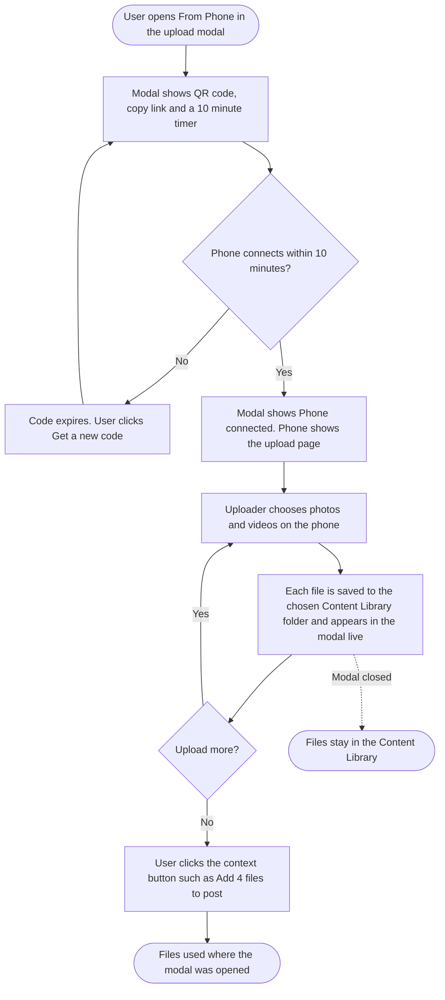
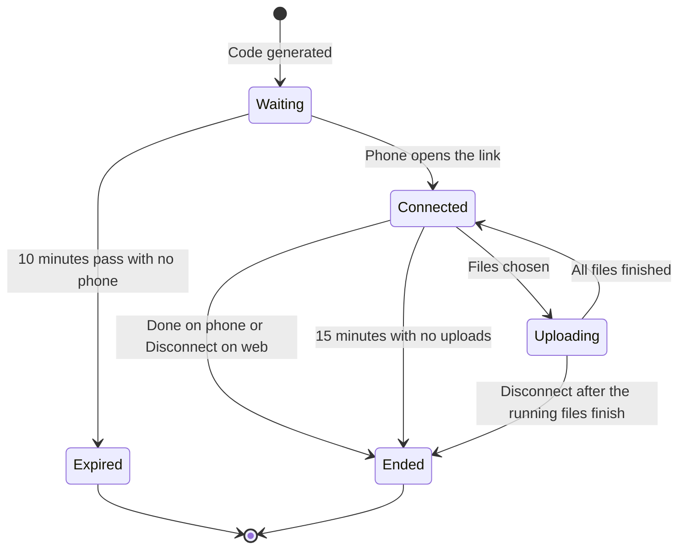
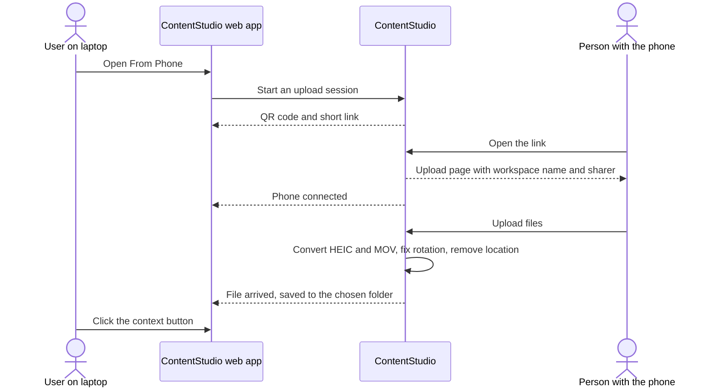

# Upload from Phone (Scan QR): Workflow Design

> Based on the Research doc for this feature and the finalized prototype at https://claude.ai/artifact/FbSZdddf9VP63dHSUsBJGJ.
>
> **One rule drives the whole design:** the phone only ever uploads to the Content Library. The web app decides what to do with the files. The phone never needs to know whether the modal was opened from the Composer, an automation or the AI chat, so it has one screen for every case, and it keeps working after the modal closes.

---

## 1. Feature Placement

| Where | What changes |
|---|---|
| **Upload modal, left menu** | A new **From Phone** item with a "New" badge, at the end of the list. Selecting it replaces the right side with the QR panel. The existing Folder selector at the bottom works as it does today. |
| **Composer media box** | A **From Phone** chip next to Content Library, Drive and Dropbox. It opens the upload modal with From Phone selected. |
| **Every other place the modal opens** | The feature appears for free because the modal is shared: Content Library page, Automation (Evergreen, CSV bulk upload), AI chat, AI Content Library uploads, AI Studio tools, and the single-image pickers (workspace logo, brand logo, profile image, custom thumbnail). |
| **Phone** | A new standalone mobile web page opened from the QR code or link. It needs no login and no app, and it uses the white-label domain and branding when the workspace has one. |
| **Hidden** | On mobile browsers and inside the ContentStudio mobile app. Never hidden by role: everyone who can open the upload modal sees it. |

---

## 2. Workflow Overview

### Session lifecycle

### Live upload, across the two devices

---

## 3. User Flow (happy path, from the Composer)

1. The user writes a post in the Composer and clicks the **From Phone** chip in the media box.
2. The upload modal opens with **From Phone** selected. The right side shows:
   - a QR code;
   - "Scan within 9:59 · Get a new code" under it;
   - "Can't scan? Copy the link and open it on any phone." with the link and a **Copy link** button;
   - three short steps and an "upload only" note.
3. The user points the phone camera at the code and taps the link that appears.
4. The phone opens the upload page:
   - the heading reads "Upload files" with the line "Anything you add is sent right away.";
   - a card shows "Sending to [workspace name] / Shared by [user's name]";
   - the upload box has "Choose photos and videos" and "Use camera".
5. The modal changes to **Phone connected** with a Disconnect button, and the 10-minute timer goes away.
6. On the phone, the user picks 4 photos and videos. Each file shows its own progress bar, and the heading reads "Uploading 2 of 4".
7. In the modal, each file appears as a tile with progress, then a thumbnail. The header reads "Uploading 2 of 4", then "4 files ready", with "Saved to Content Library". HEIC files arrive as JPG and MOV files as MP4.
8. The phone shows "4 files sent / [workspace name] has them now." with **Add more** and a **Done** button.
9. The user clicks **Add 4 files to post** in the modal. The modal closes, the files are in the post, and a toast reads "4 files added to your post".
10. The user taps **Done** on the phone, which shows "All set / [workspace name] has your files. You can close this page."

**From other places,** steps 1 to 8 are identical and only the final button changes:

| Opened from | Final button | What it does |
|---|---|---|
| Composer | Add N files to post | Attaches the files to the post |
| Content Library page | Done | Closes the modal. The files are already in the folder. |
| Automation (Evergreen, CSV bulk upload) | Use in automation | Hands the files to the automation form |
| AI chat | Attach to chat | Attaches the files to the chat message |
| AI Content Library, AI Studio tools | Use these files | Hands the files to the tool that opened the modal |
| Single-image pickers (logos, profile image, custom thumbnail) | Use selected image | The user clicks one received image to select it (the first is preselected), and it's applied. The rest stay in the library. |

---

## 4. Alternative Flows

| # | Situation | What the user sees |
|---|---|---|
| A1 | **Nobody scans within 10 minutes** | The QR code fades. "This code has expired / For your security, codes last 10 minutes." and a **Get a new code** button. |
| A2 | **Old or ended link opened** | The phone shows a centered card: "This link has ended / To keep uploading, ask [sender name] for a new link, or scan a new code in ContentStudio." |
| A3 | **Connection drops on the phone** (screen lock, tunnel, weak signal) | An amber card: "Connection lost / Uploads pick up where they stopped once you're back online." with **Try again**. The file shows "Paused at 46%". It resumes on its own when the connection returns. |
| A4 | **Workspace storage runs out** | **Phone:** a red card "Not enough space / These files need 312 MB, but only 40 MB is left. Try fewer or smaller files, or ask [sender name] to free up space." Each blocked file shows "Not uploaded". **Web:** "Workspace storage is full / 2 files didn't upload. 24.96 GB of 25 GB is used. Free up space in the Content Library or upgrade your plan to add more storage." with **Open Content Library**. No role-based button. |
| A5 | **More files than the platform allows** (for example an Instagram carousel) | All files are saved to the library. A blue card: "Instagram allows [limit] items per carousel / All 24 files are saved to your Content Library. The first [limit] will go in this post." with **Choose which ones** and **Add first [limit]**. |
| A6 | **Images and a video mixed where the platform doesn't allow it** | The Composer's existing validation messages apply after attaching. Nothing new. |
| A7 | **User closes the modal mid-upload** | Uploads keep going. A toast reads "Uploads will keep going. Find them in Content Library › Uncategorized (Main)." (it names the chosen folder). Reopening From Phone shows the same session and its files. |
| A8 | **User clicks Disconnect** | Files already uploading finish. The session ends, and the phone shows A2 on its next action. The modal goes back to a fresh QR code. |
| A9 | **15 minutes with no uploads after connecting** | The session ends. It behaves like A8. |
| A10 | **User generates a new code while one is active** | The old session ends. There is one active session per user. |
| A11 | **Composer open in two tabs** | Files arrive only in the tab that created the code. |
| A12 | **File type not accepted** (for example a .zip) | The phone shows the file as "Not uploaded / This file type isn't supported". The others continue. |
| A13 | **More than 100 files in one session** | The phone shows "Upload limit reached / This link takes up to 100 files. Ask [sender name] for a new one." |
| A14 | **Link forwarded to someone else** | It works for them. That is the client use case, limited by the 10-minute window, upload-only access and Disconnect. |

---

## 5. Key Design Decisions

### 5.1 Where the files go: always the library, or "attach only"

| Option | Trade-off |
|---|---|
| **A. Always save to the Content Library, then use it (recommended, settled)** | Nothing is ever lost when the modal closes. The phone needs one screen for every context. |
| B. Offer "attach to this post only" | The library stays cleaner, but closing the modal loses files and the phone needs per-context screens. |

**Settled: A.**

### 5.2 Expiry model

| Option | Trade-off |
|---|---|
| **A. A fixed 10 minutes to connect, then keep the session open while in use, ending after 15 minutes with no uploads (recommended, settled)** | The risky window (a leaked screenshot or link) stays short, and big videos on mobile data never get cut off. |
| B. A flat 10 minutes for everything | Simpler, but it kills long uploads. |
| C. User-selectable expiry | Adds a decision nobody can make well, and most people would pick the longest. |

**Settled: A.** A longer connect window may come later. Longer-lived share links were rejected.

### 5.3 How the phone uploads

| Option | Trade-off |
|---|---|
| **A. Reuse the web app's upload routes, authenticated by the session token (recommended)** | One pipeline for type checks, quota, folders and thumbnails. It inherits resumable uploads. It needs HEIC, orientation and GPS handling added to the path it uses. |
| B. A separate phone-only upload endpoint | Isolated, but a second copy of validation, quota and folder logic to keep in sync. |

**Recommendation: A.** The added media handling benefits every upload, not just the phone.

### 5.4 Who sees From Phone

**Settled by the PO: no role-based hiding.** Everyone who can open the upload modal sees From Phone. It is hidden only on mobile browsers and inside the mobile app, where the user is already on their phone. There is no separate upload permission to key off.

### 5.5 Single-image pickers (logos, profile image, custom thumbnail)

**Settled by the PO: include them.** The flow is the same. The final button is "Use selected image": the user clicks one received image (the first is preselected), and the rest stay in the library.

### 5.6 File size

**Settled by the PO: no per-file cap.** Only the workspace storage quota applies, the same as desktop uploads today. The phone's helper text lists types only: "Photos, videos and PDFs".

---

## 6. Integration with Existing Features

| Feature | How it connects |
|---|---|
| **Upload modal** | A new last tab. It reuses the Folder selector, the storage meter and the per-context insert logic. |
| **Composer** | A new chip in the media box. The final button attaches via the existing insert path, so the Composer's platform validation (carousel limits, one video at a time) applies unchanged. |
| **Content Library** | Every phone file lands here, in the chosen folder, attributed to the user who started the session and tagged as uploaded from a phone. The Filters drawer gets an "Uploaded from" section (Anywhere / From phone) to show only those files. |
| **Storage quota** | The same workspace storage limit applies and is checked before each batch. |
| **Automation** | The Evergreen and CSV bulk upload modals get the tab. "Use in automation" hands files over the way Content Library selection does today. |
| **AI chat** | The chat's upload modal gets the tab. "Attach to chat" attaches them the way Content Library selection does today. |
| **White-label** | The QR link and the phone page use the agency's domain, logo and product name. Uploads go through the white-label upload path. |
| **Mobile app (Flutter)** | No change in v1. From Phone is hidden inside the app. |
| **Public API / CLI / MCP** | No change. This is a browser-to-browser handoff with no developer surface. The session endpoints are internal. |

---

## 7. Trackable Actions (Usermaven candidates)

No existing media or upload events can be reused. The only one is `media_note_added`.

| Candidate event | Trigger | Fires from | Why |
|---|---|---|---|
| `phone_upload_code_generated` | The QR code is shown (first open or Get a new code) | FE (web) | The top of the funnel, compared with connected |
| `phone_upload_connected` | A phone opens the link and the modal shows Phone connected | FE (web, on the live event) | Measures whether people understand the flow |
| `phone_upload_session_ended` | The session ends by Done, Disconnect, idle timeout or expiry | BE (the phone may just close) | Files and size per session, failure rate, share of sessions with at least one file |
| `phone_upload_files_used` | The user clicks the context button (Add to post, Attach to chat, …) | FE (web) | Use compared with other media sources, broken down by context |

Proposed payloads, to finalize in the PRD:
- `source` (composer, content_library, automation, ai_chat, other)
- `number_of_files`, `total_size_mb`, `failed_files`
- `end_reason`
- `device_os` (ios, android, other). No PII.

---

## 8. Scope Recommendation

### v1

- The From Phone tab in the upload modal, and the From Phone chip in the Composer.
- QR code, copy link and short link, the 10-minute connect window, Get a new code, Disconnect, one active session per user.
- The session stays open while in use and ends after 15 minutes with no uploads.
- The mobile web upload page: gallery pick, camera, multiple files, per-file progress, Add more, Done.
- Live arrival in the modal, the per-context final button, and closing the modal doesn't lose anything.
- HEIC to JPG, MOV to MP4, EXIF orientation, GPS removal, and chunked, resumable uploads.
- Edge states A1 to A14.
- White-label domain and branding.
- Hidden on mobile browsers and in the app. Shown for every role and in every place the upload modal opens, including single-image pickers.
- An "Uploaded from" filter in the Content Library (Anywhere / From phone), a View shortcut on the modal-closed toast, and "Uploaded from phone" in file details.
- Four Usermaven events.
- One [Design] story covering the prototype handoff to design-system components.

### Defer (only if usage justifies it)

- A longer connect window.
- Opening the ContentStudio app instead of the browser when it's installed.
- A named "trusted phone" that skips scanning.
- Virus scanning for all uploads, not just phone uploads.

### Explicitly out of scope

- Longer-lived share links (24 hours or 7 days).
- A PIN on the phone page.
- Editing, cropping or captions on the phone.
- Several phones or several uploaders in one session.
- Any Flutter app work.
- Any public API, CLI or MCP surface.
