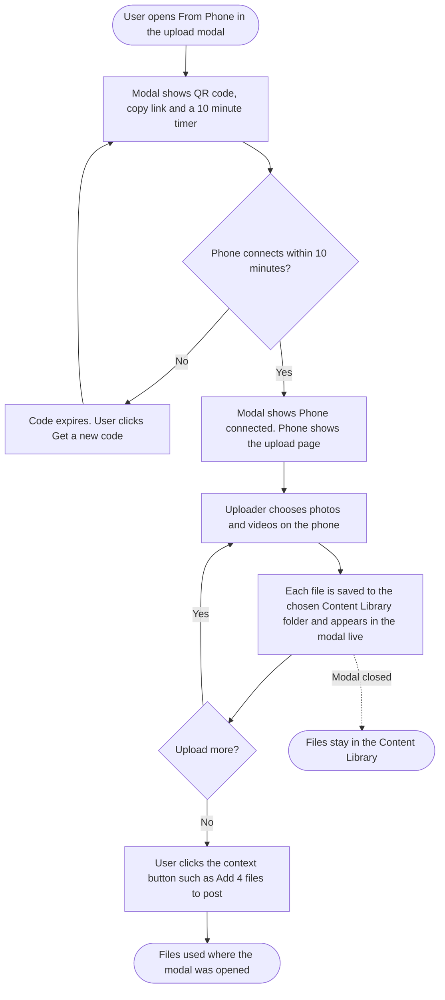

# **PRD: Upload from Phone (Scan QR)**

**Author:** Product Team
**Last Updated:** 2026-09-28
**Status:** Approved
**Target Release:** Q4 2026

---

## **1. Overview**

Upload from Phone lets anyone on ContentStudio's web app pull photos and videos off a phone in seconds:
1. They open **From Phone** in the media upload modal and scan the QR code with the phone camera, or open the copied link.
2. They pick files on a simple mobile web page, with no app and no login.
3. The files land in the Content Library and appear live in the modal, ready to add to a post, an automation or an AI chat.

The link can also be sent to someone else, such as a client, who uploads straight into the workspace. It removes the most common detour in a social media manager's day: emailing or messaging their own photos to themselves before they can post them.

---

## **2. Problem Statement**

**What problem are we solving?**

Most social content is shot on a phone (events, products, behind the scenes), but most ContentStudio scheduling happens on a laptop. To get a file from one to the other, users email it to themselves, send it through WhatsApp Web, or wait for Google Photos or Drive to sync, then download it and upload it again. Every post that uses fresh phone content pays this cost. Photos also lose quality along the way when a messaging app compresses them.

**Who has this problem?**

- **Social media managers and small business owners** who create their own content on their phones. This is most active ContentStudio users.
- **Agencies** whose clients hold the photos. Today the client has to email files or share a Drive folder.

**What happens if we don't solve it?**

- Users keep leaving ContentStudio mid-task to move files, which slows every post and makes the Composer feel incomplete compared with tools that have a phone bridge (Canva has one in its Uploads panel).
- Agencies keep collecting client media outside the product.
- Every time a user reaches for another tool first, they have less reason to start their work in ContentStudio.

---

## **3. Goals & Success Metrics**

| Goal | Metric | Target | How We'll Measure |
| ----- | ----- | ----- | ----- |
| Primary: people use it | Share of weekly active workspaces that complete at least one phone upload session | 15% within 90 days of launch | Usermaven `phone_upload_session_ended` with `number_of_files` > 0 |
| People understand the flow | Codes generated that lead to a connected phone | 60% or more | `phone_upload_connected` ÷ `phone_upload_code_generated` |
| Uploads succeed | Share of files that upload without failing | 97% or more, and no device or browser below 90% | `phone_upload_session_ended` `failed_files` ÷ `number_of_files`, split by `device_os` |
| The files get used | Sessions whose files are used through the context button | 50% or more of sessions with files | `phone_upload_files_used` ÷ sessions with files |
| Guard rail: storage cost | Change in average media storage per workspace | No more than 10% above the pre-launch trend | Existing storage usage reporting |
| Guard rail: abuse | Sessions hitting the per-session rate limit | Under 1% | Backend logs |

### **3.1 Analytics Events (Usermaven)**

No existing upload or media event can be reused. A search for `userMaven.track(` found only `media_note_added`.

| Event Name | Trigger | Payload | What we measure with it |
| ----- | ----- | ----- | ----- |
| `phone_upload_code_generated` | **FE (web).** A QR code is shown, on first open of From Phone or on Get a new code | `{ source, is_regenerated }` | The top of the funnel, and how often codes expire unused |
| `phone_upload_connected` | **FE (web).** The modal receives the "phone connected" update | `{ source, device_os }` | The share of codes that get scanned, and the device mix |
| `phone_upload_files_used` | **FE (web).** The user clicks the context button (Add N files to post, Use in automation, Attach to chat, Use these files, Use selected image) | `{ source, number_of_files }` | Whether phone files get used, by context, and comparison with other media sources |
| `phone_upload_session_ended` | **BE.** The session ends by Done, Disconnect, idle timeout, a replacement session, or expiry before connecting | `{ source, end_reason, number_of_files, total_size_mb, failed_files, device_os }` | Files and size per session, failure rate by device, share of sessions with at least one file |

**Value sets:**
- `source`: `composer`, `content_library`, `automation`, `ai_chat`, `ai_tools`, `image_picker`
- `end_reason`: `done`, `disconnect`, `idle_timeout`, `replaced`, `expired_unscanned`
- `device_os`: `ios`, `android`, `other`

There is no PII in any payload.

---

## **4. Target Users**

**Primary Persona:**
Sana, a social media manager at a restaurant group. She shoots dishes and events on her iPhone all day and schedules posts from her laptop in the afternoon. She isn't technical. She wants the photos from her camera roll in the Composer without thinking about how they get there.

**Secondary Persona:**
Omar, an agency account manager. His clients send him product photos. He wants to send a client a link, have them upload from their phone, and find the files in the right workspace folder.

**The uploader behind the link:**
Anyone who opens the link on a phone. It could be the user themself, a teammate or a client. They may never have heard of ContentStudio, so every word on the phone page has to make sense to them.

**Non-Users (explicitly out of scope):**
- Users already on a phone. The mobile browser and the mobile app hide the option, because they can upload directly.
- Anyone wanting a permanent, long-lived "client upload portal". This is a short-lived handoff, not a file-request product.

---

## **5. User Stories / Jobs to Be Done**

| ID | As a... | I want to... | So that... | Priority |
| ----- | ----- | ----- | ----- | ----- |
| US-1 | Web app user | see a QR code and a copyable link when I choose From Phone | I can connect my phone in one scan | Must Have |
| US-2 | Person holding the link | upload photos and videos without installing an app or logging in | it takes seconds, even if I'm a client | Must Have |
| US-3 | Web app user | watch the files appear in the modal as they upload, already saved to my chosen folder | I don't refresh or hunt for them | Must Have |
| US-4 | Web app user | use the files right where I opened the modal (post, automation, AI chat, image picker) | I finish the task I started | Must Have |
| US-5 | Web app user | close the modal without losing anything | a half-finished upload is never wasted | Must Have |
| US-6 | Web app user | disconnect the phone and have the link stop working | nobody can keep sending files | Must Have |
| US-7 | iPhone user | have my HEIC photos and MOV videos just work | I don't have to convert anything | Must Have |
| US-8 | Person holding the link | have my location removed from photos | I don't leak where I live or work | Must Have |
| US-9 | Person holding the link | be told clearly what to do when something goes wrong (link ended, no space, connection lost) | I'm never stuck | Must Have |
| US-10 | Agency user on a white-label domain | have the link and the phone page show my agency's domain and brand | my clients never see ContentStudio branding | Must Have |
| US-11 | Product team | measure how the flow performs | we know whether it's worth expanding | Should Have |

---

## **6. Requirements**

### **6.1 Must Have (P0)**

**Web app: entry and QR panel**
- A **From Phone** item at the end of the upload modal's left menu, with a "New" badge, in every place the modal opens. That includes the Composer, Content Library page, Evergreen and CSV bulk upload, AI chat, AI Content Library, AI Studio tools and the single-image pickers.
- A **From Phone** chip in the Composer media box that opens the modal on that tab.
- The QR panel shows:
  - the QR code;
  - a live "Scan within m:ss" timer counting down from 10:00;
  - **Get a new code**;
  - the short link in a read-only field with **Copy link**;
  - three short steps;
  - the note "This link can only upload. It can't see your library or posts."
- The existing Folder selector sets the destination folder. The default is Uncategorized (Main).
- From Phone is hidden on mobile browsers (by device, not window width) and inside the ContentStudio mobile app. It is **never hidden by role**.

**Session**
- Each code starts an upload session for one workspace, one folder and one opening context. The session is created by, and attributed to, the signed-in user.
- A code can connect a phone for 10 minutes. After that, the web app shows the expired state.
- There is one active session per user. Generating a new code ends the previous session.
- Once a phone connects, the session stays open while in use. It ends on Done on the phone, Disconnect on the web, or 15 minutes with no uploads. Files already uploading always finish.
- The token allows uploading only. It can't read the library, posts, workspace settings or account data.
- A session is limited to 100 files. Past the limit, the phone shows the limit message.

**Phone page**
- A standalone mobile web page on the workspace's domain (white-label when configured) with no login.
- The header shows the brand logo and name and "Secure link".
- It shows "Sending to [workspace name] / Shared by [sender's name]". It never shows folder names or uses "your workspace" or "your library".
- Users can pick several photos and videos from the gallery, or take a photo or video with the camera.
- Each file has its own progress bar. The heading counts "Uploading N of M".
- The phone accepts the same file types as desktop uploads. There is **no per-file size cap**. Only the workspace storage quota applies.
- After uploading, it shows "N files sent" with **Add more** and **Done**. Done ends the session and shows "All set".

**Live arrival and final action**
- The modal switches to "Phone connected" with the device type and a **Disconnect** button.
- Files appear as tiles with progress, then thumbnails, under "Uploading N of M", then "N files ready" and "Saved to Content Library".
- The final button depends on where the modal was opened:
  - Composer: **Add N files to post**
  - Content Library: **Done**
  - Automation: **Use in automation**
  - AI chat: **Attach to chat**
  - AI tools: **Use these files**
  - Single-image pickers: **Use selected image**
- Attaching goes through the same path as picking from the Content Library, so platform validation applies unchanged.
- Closing the modal keeps the session and uploads running and shows a toast naming the folder. Reopening From Phone shows the same session and files.
- Files arrive only in the browser tab that created the code.

**Media handling**
- HEIC and HEIF photos are converted to JPG. MOV videos are converted to MP4.
- EXIF orientation is applied, so photos never appear rotated.
- GPS and location metadata are removed before the file is stored.
- Uploads are chunked and resumable. A dropped connection resumes from where it stopped.
- The same type validation and storage quota check as desktop uploads apply, checked before each batch.

**Edge states** (the copy lives in the FE stories)
- Code expired before scan
- Link ended
- Connection lost, with auto-resume and Try again
- Storage full, on both the phone and the web
- More files than the platform allows
- Unsupported file type
- Session file limit reached

**White-label**
- The QR link, the short link and the phone page use the white-label domain, logo and product name.
- Uploads on white-label domains go through the white-label upload path.

### **6.2 Should Have (P1)**

- The four Usermaven events in §3.1.
- The device type in the connected pill ("iPhone connected", "Android phone connected").
- **Uploaded from filter.** Every phone upload is tagged with the source `phone_upload` and its session ID. The Content Library's Filters drawer gets an "Uploaded from" section (Anywhere / From phone), with an active "From phone" chip, an empty state, a **View** shortcut on the modal-closed toast, and an "Uploaded from phone" line in file details. No backfill: files from before launch carry no tag.

### **6.3 Nice to Have (P2)**

- Tapping the QR code on the web app enlarges it for scanning from a distance.

### **6.4 Explicitly Out of Scope**

- Longer-lived share links (24 hours or 7 days) and an expiry selector.
- A PIN on the phone page.
- Editing, cropping or captions on the phone.
- Several phones or several uploaders in one session.
- A "trusted phone" that skips scanning.
- Opening the ContentStudio mobile app from the QR code.
- Virus scanning. Desktop uploads don't have it either. It is tracked as a risk.
- Any Flutter app work.
- Any public API, CLI or MCP surface.

---

## **7. User Flow (High Level)**

1. The user clicks **From Phone** (a chip in the Composer media box, or the left menu of the upload modal anywhere in the app).
2. The modal shows a QR code, a 10-minute timer and a copyable link. The user picks a folder or keeps Uncategorized (Main).
3. The user, or anyone they send the link to, scans the code or opens the link on a phone.
4. The phone shows the upload page for the workspace. The modal shows "Phone connected".
5. The uploader picks photos and videos. Each one uploads with its own progress and is converted and cleaned on the way.
6. The files appear in the modal live, already saved to the chosen folder.
7. The user clicks the context button (for example **Add 4 files to post**). The files are used there, and the phone can finish with **Done**.
8. If the modal was closed at any point, the files are still in the Content Library.

The session lifecycle (state diagram) and the cross-device sequence diagram are in the workflow doc.

**Prototype:** https://claude.ai/artifact/FbSZdddf9VP63dHSUsBJGJ

---

## **8. Business Rules & Constraints**

| Rule ID | Rule | Rationale |
| ----- | ----- | ----- |
| BR-1 | Phone uploads always go to the Content Library, into the folder picked in the modal. There is no "attach only" mode. | Nothing is lost when the modal closes, and the phone needs one screen for every context. |
| BR-2 | A code can connect a phone only within 10 minutes of being shown. The window is fixed, with no selector. | Keeps the risky window, a leaked screenshot or link, short. |
| BR-3 | A connected session ends on Done, Disconnect, 15 minutes with no uploads, or a new code from the same user. | Stops the link staying useful longer than needed. |
| BR-4 | A file that is already uploading always finishes, even if the session ends meanwhile. | Never cut off a big video halfway. |
| BR-5 | One active session per user. | Limits exposure and keeps the modal state simple. |
| BR-6 | The session token can only upload. It can't read any workspace data. | Anyone may hold the link, including a client. |
| BR-7 | Files are attributed to the user who started the session, in the session's workspace. | Clear ownership in the Content Library and correct quota accounting. |
| BR-8 | The workspace storage quota applies, checked before each batch. There is no per-file size cap. | Matches desktop uploads (PO decision, 2026-09-28). |
| BR-9 | A session accepts at most 100 files. | Abuse protection for a no-login upload path. |
| BR-10 | GPS and location metadata are always removed. EXIF orientation is always applied. HEIC becomes JPG and MOV becomes MP4. | Privacy for the uploader, and files that just work on every platform. |
| BR-11 | The phone page never uses role-based UI, never says "your workspace" or "your library", and never shows folder names. | We can't know who opened the link. |
| BR-12 | From Phone is hidden on mobile browsers and in the mobile app, and never hidden by role. | The user is already on the phone. There is no upload permission to key off (PO decision, 2026-09-28). |
| BR-13 | Files arrive only in the browser tab that created the code. | Prevents files landing in the wrong draft when the Composer is open twice. |
| BR-14 | On white-label domains, every link and the phone page use the white-label domain and branding. | Agencies' clients must never see ContentStudio branding. |
| BR-15 | Every file saved through a phone session is tagged `phone_upload` with its session ID. Nothing else is ever tagged `phone_upload`, and older files are not backfilled. | Lets the Content Library filter phone uploads, including ones a client sent. |

---

## **9. Open Questions**

| Question | Options | Owner | Due Date | Decision |
| ----- | ----- | ----- | ----- | ----- |
| What is the per-session file limit (BR-9)? | 100 files / 250 files / 500 files | PO | 2026-09-28 | **100 files** |
| Is 15 minutes the right idle timeout after connecting? | 10 / 15 / 30 minutes | PO | 2026-09-28 | **15 minutes** |
| Short link format | `<domain>/u/<code>` with a 6 to 8 character code / full session URL | Backend lead | During BE story | Pending, recommend the short code |
| Does the external transcoding service reliably turn MOV into MP4 for every phone video, or do we need a fallback? | Transcoding service as-is / CloudConvert fallback | Backend lead | During BE story | Pending |
| Should phone uploads get virus scanning even though desktop uploads don't? | Parity (none) / Scan phone uploads only / Scan all uploads later | PO + Security | Before launch | Pending, recommend parity in v1 |

---

## **10. Risks & Mitigations**

| Risk | Likelihood | Impact | Mitigation |
| ----- | ----- | ----- | ----- |
| HEIC photos from iPhones arrive unconverted, because the upload path the web app uses for large files doesn't convert HEIC today | High (confirmed in code) | High | The BE story adds HEIC conversion, orientation and GPS removal to the path the phone uses. QA with real iPhone photos. |
| A no-login upload link gets abused to dump files or spam a workspace | Medium | Medium | Upload-only token, 10-minute connect window, one session per user, per-session file limit, rate limiting per session, Disconnect, and the storage quota. |
| iOS Safari suspends uploads when the screen locks or the user switches apps | High | Medium | Resumable chunked uploads, auto-resume on return, "Keep this page open until they finish", and the Connection lost card with Try again. |
| White-label uploads go through the white-label proxy instead of direct storage, which is slower and heavier for big videos | Medium | Medium | Reuse the existing white-label upload path. Load-test with large videos on a white-label domain. |
| Direct-to-storage uploads from phone browsers fail on CORS or resumable setup | Medium | High | Confirm the storage CORS rules allow the phone page origins, including white-label. Real-device QA on iOS Safari, Android Chrome and Samsung Internet. |
| Users think the link is a long-lived client portal and send it by email, and it has expired by the time the client opens it | Medium | Low | "This link has ended" tells the client exactly who to ask. Monitor `expired_unscanned`. Longer links are an explicit later option. |
| MOV to MP4 depends on an external transcoding service | Low | Medium | Confirm behavior during the BE story, and fall back to the existing CloudConvert path. |
| Location metadata leaks in files uploaded before this feature, or through other upload paths | Medium | Low | Out of scope for v1, but GPS removal is added to the shared path, so other uploads benefit too. |

---

## **11. Dependencies**

**Internal**

- **Upload modal:** `contentstudio-frontend/src/modules/publish/components/media-library/components/UploadMediaModal.vue` and `SideTabs.vue`. The new tab must be appended at the end, because existing tabs are opened by numeric index.
- **Per-context insert logic:** `MediaLibraryTab.vue` `handleInsert()` and `composables/useMediaInsertion.ts`, reused for the final button.
- **Composer media box:** `contentstudio-frontend/src/modules/composer/components/MediaSourceToolbar.vue`.
- **Upload pipeline:** `MediaLibraryAssetsController` `generateSignedUrls` / `processUploadedGCSMedia` and the multipart path, plus FE `useGCSUpload.ts` and `useMediaUploadQueue.ts`. These need a session-token variant that attributes files to the session creator.
- **Storage quota:** `SubscriptionLimits::availableMediaLimits`.
- **Real-time:** Centrifugo via `Realtime::broadcast`, `Channels.php`, `CentrifugoAuthToken.php`, and FE `modules/common/services/realtime/`, following the `useMediaImportRealtime.ts` precedent. This needs a new phone-upload channel namespace.
- **Public page pattern:** FE `guest` routes, and the encrypted expiring token precedent in `ExternalLinkIntegrationController`.
- **White-label:** public `GET /whitelabel/getDomainDetails`, `useWhiteLabelApplication.ts`, `useBrandName.ts`.
- **Composer platform validation:** `modules/composer/features/validation/`.
- **Design:** a [Design] story that turns the prototype into design-system components.

**External**

- The GCS resumable upload and CORS configuration.
- The external transcoding service (MOV to MP4) and its CloudConvert fallback.
- A QR code generation library. **New dependency, needs approval.** There is none in the frontend today.

**Blockers**

- None. The per-session file limit (100) and idle timeout (15 minutes) are set.

---

## **12. Appendix**

- **Prototype:** https://claude.ai/artifact/FbSZdddf9VP63dHSUsBJGJ. It has the interactive flow, three phone states, three phone edge states and the web edge states.
- **Research:** the research doc for this feature. It covers the product decisions, the edge cases, and the codebase analysis with file paths.
- **Workflow:** the workflow doc for this feature. It has the overview flowchart, the session state diagram, the cross-device sequence diagram and alternative flows A1 to A14.
- **Related existing work:** Content Library upload modal redesign. This feature adds a tab to the same modal and should follow its sidebar design if that ships first.
- **Competitive note:** Canva has a QR upload-from-phone flow in its Uploads panel. None of the major social schedulers is known to have one. This is unverified and needs a check before any marketing claim.

---

## **Changelog**

| Date | Author | Changes |
| ----- | ----- | ----- |
| 2026-09-28 | Product Team | Initial draft from the exploration chat, the finalized prototype and the codebase analysis |
| 2026-09-28 | Product Team | PO decisions applied: no per-file size cap, no role-based hiding, single-image pickers included |
| 2026-09-28 | Product Team | PRD approved. Session file limit set to 100, idle timeout to 15 minutes. |
| 2026-10-05 | Product Team | Added the Uploaded from filter (P1): phone uploads are tagged and filterable in the Content Library. Removed the filter from out of scope. |
