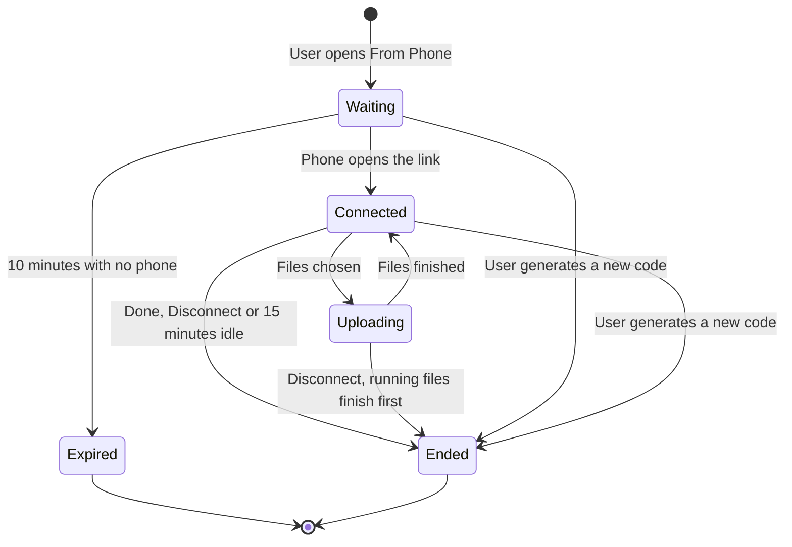
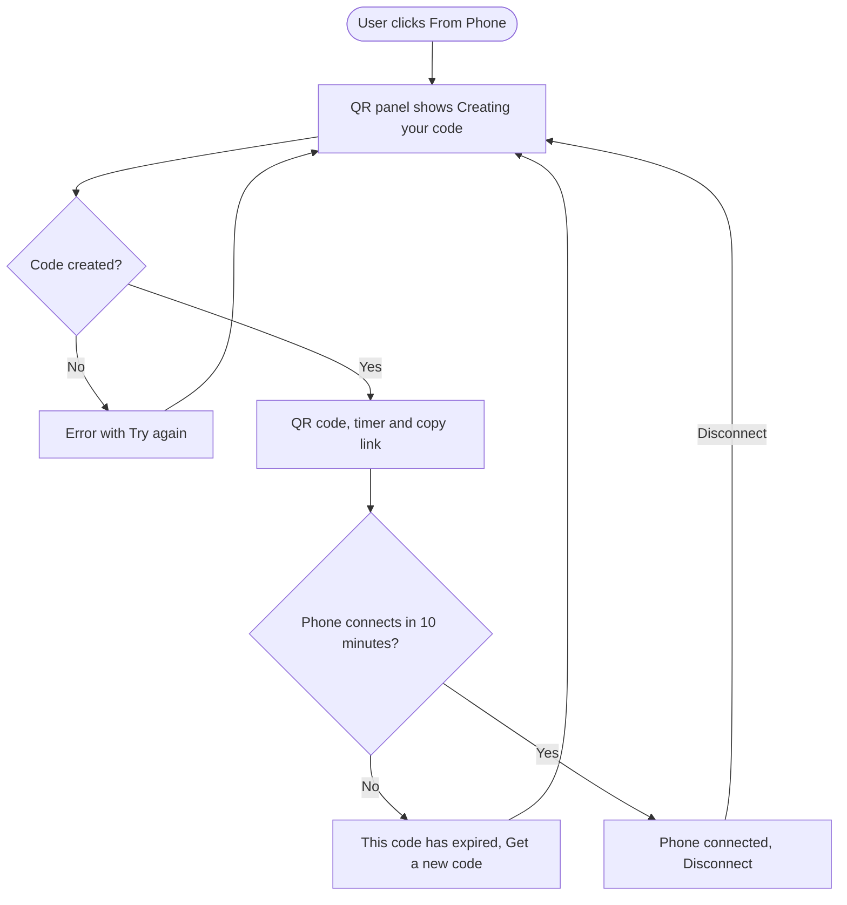
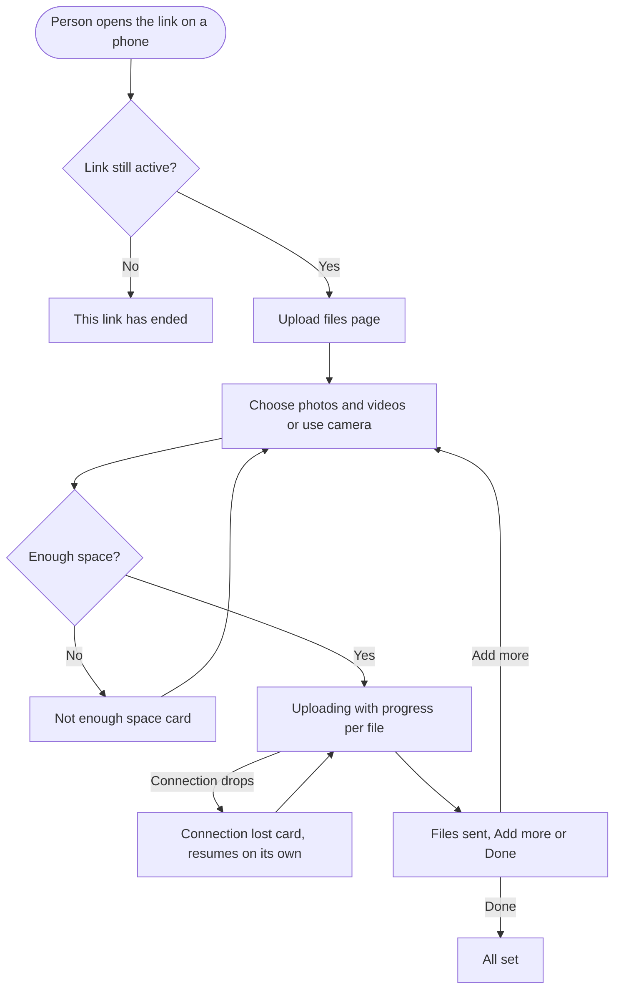

# Epic + stories: Upload from Phone (Scan QR)

7 stories. Nothing is pushed to any tracker until the PO approves the push.

---

## Epic: Upload from Phone (Scan QR)

Most social content is shot on a phone, and most ContentStudio scheduling happens on a laptop. Today, getting a file from one to the other means emailing it to yourself, sending it through WhatsApp Web, or waiting for a cloud drive to sync, then downloading it and uploading it again. Every post that uses fresh phone content pays that cost. Agencies pay it twice, because their clients hold the photos.

Upload from Phone removes the detour:
1. In the media upload modal, anywhere in the app, the user opens **From Phone**. They get a QR code and a link they can copy.
2. They scan the code with the phone camera, or send the link to anyone, such as a client.
3. On a simple mobile web page with no app and no login, the person on the phone picks photos and videos.
4. The files land in the chosen Content Library folder and appear live in the modal. From there, one button uses them where the modal was opened: in a post, an automation, the AI chat or an image picker. Closing the modal loses nothing.

A code can connect a phone for 10 minutes. After that the session stays open while it's in use, and it ends on Done, Disconnect or 15 minutes of inactivity. The link can only upload. iPhone HEIC photos and MOV videos are converted, photos are straightened, and location data is removed. White-label workspaces get their own domain and branding on the link and the phone page. Canva has a similar flow in its Uploads panel, and none of the major social schedulers is known to have one.

**Prototype:** https://claude.ai/artifact/FbSZdddf9VP63dHSUsBJGJ

### Out of scope

- Longer-lived share links (24 hours or 7 days) and an expiry selector.
- A PIN on the phone page.
- Editing, cropping or captions on the phone.
- Several phones or uploaders in one session.
- A trusted phone that skips scanning.
- Opening the mobile app from the QR code.
- A "Recent phone uploads" filter.
- Virus scanning. Desktop uploads don't have it either.
- Any Flutter app work.
- Any public API, CLI or MCP surface.

### Stories

1. [Design] Design the Upload from Phone modal tab, phone upload page and edge states
2. [BE] Create upload-only phone sessions with QR link, expiry and live updates
3. [BE] Accept phone uploads into the Content Library through the session link
4. [BE] Convert HEIC and MOV, fix rotation and remove location data on uploaded media
5. [FE] Add the From Phone tab and QR code to the upload modal
6. [FE] Show phone uploads live in the upload modal and use them where it was opened
7. [FE] Build the mobile upload page for Upload from Phone

---

## [Design] Design the Upload from Phone modal tab, phone upload page and edge states

### Description

As a designer handing off Upload from Phone, I want the finalized prototype turned into design-system screens, so that frontend developers build exactly what was agreed. The goal is no guessing on layout, states or copy.

The prototype is final on flow and copy. It still uses hand-drawn elements, not library components. This story maps every screen to `@contentstudio/ui` components and fills in the few states the prototype doesn't draw.

### Workflow

1. The designer opens the prototype and reviews every frame:
   - the interactive web and phone flow;
   - phone Ready, Uploading and Uploaded;
   - phone Link ended, Storage full and Connection lost;
   - the web edge states.
2. They rebuild the web modal's From Phone tab with the design-system list item, badge, button, text input, progress and alert components. They follow the Content Library upload modal redesign's sidebar if that has shipped.
3. They rebuild the phone page as a mobile layout, using the same components where the web library has them.
4. They add the states the prototype doesn't draw:
   - QR code loading;
   - QR code couldn't be created;
   - phone page loading;
   - phone page can't load;
   - unsupported file type;
   - upload limit reached;
   - the single-image picker's "Use selected image" selection state.
5. They show the white-label variant: agency logo, agency name and agency primary color, with no ContentStudio branding on the phone page.
6. They hand off with every piece of copy exactly as written in the FE stories.

### Acceptance criteria

- [ ] Every prototype frame has a matching design-system screen. That covers the web QR panel, web connected, web receiving files, web files ready, phone Ready, phone Uploading, phone Uploaded, phone All set, and the edge states listed below.
- [ ] These edge states are designed:
  - web: code expired, storage full, more files than the platform allows;
  - phone: link ended, not enough space, connection lost, unsupported file type, upload limit reached.
- [ ] Loading and error states are designed for creating the QR code and for opening the phone page.
- [ ] The single-image picker variant shows how one received image is selected and how "Use selected image" looks.
- [ ] The phone page is designed at 390 px wide, with touch targets of at least 44 px.
- [ ] The white-label variant of the phone page uses the agency logo, name and primary color, with no ContentStudio branding.
- [ ] Colors use the theme's primary color tokens, not fixed blues, so white-label colors apply.
- [ ] Every component used exists in `@contentstudio/ui` or is flagged as a gap. The QR code block is a known gap.
- [ ] All copy in the designs matches the FE stories word for word.

### Mock-ups

Prototype: https://claude.ai/artifact/FbSZdddf9VP63dHSUsBJGJ. This story produces the final designs.

### Impact on existing data

None.

### Impact on other products

- The web app's upload modal gains a tab. If the Content Library upload modal redesign ships first, the new tab follows its sidebar pattern.
- No change to the mobile app or the Chrome extension.

### Dependencies

None. This story unblocks **[FE] Add the From Phone tab and QR code to the upload modal**, **[FE] Show phone uploads live in the upload modal and use them where it was opened** and **[FE] Build the mobile upload page for Upload from Phone**.

### Global quality & compliance (wherever applicable)

- [ ] Mobile responsiveness (frontend only, N/A for backend-only stories)
- [ ] Multilingual support (frontend + backend, translations available or fallback handled)
- [ ] UI theming support (default + white-label, design library components are being used)
- [ ] White-label domains impact review
- [ ] Cross-product impact assessment (web, mobile apps, Chrome extension)
- [ ] Developer surfaces coverage: N/A, design only, nothing API-facing changes

---

## [BE] Create upload-only phone sessions with QR link, expiry and live updates

### Description

As a ContentStudio user, I want to start a short-lived, upload-only session that a phone can join by scanning a code or opening a link. That way I can get files off a phone without logging in on it, and nobody holding the link can do anything except upload.

This story owns the session itself:
- creating it;
- the link and short code;
- the 10-minute connect window;
- staying open while in use and ending on Done, Disconnect or 15 minutes idle;
- one active session per user;
- the 100-file limit;
- the live updates that tell the web app a phone connected, a file arrived, a file failed or the session ended.

The upload itself is **[BE] Accept phone uploads into the Content Library through the session link**.

### Workflow

1. The user opens From Phone in the upload modal, with a folder picked. ContentStudio creates a session for that user, workspace, folder and opening context. It returns a link and a short code for the QR code.
2. The web app shows the code and counts down 10 minutes.
3. Someone opens the link on a phone within the 10 minutes. ContentStudio marks the session connected and tells the web app, which shows "Phone connected".
4. As files upload, ContentStudio tells the web app about each file: its progress, when it's saved, or that it failed and why.
5. The session ends when:
   - the phone taps Done;
   - the web app clicks Disconnect;
   - 15 minutes pass with no uploads;
   - the same user generates a new code.

   Files already uploading still finish. The web app is told the session ended.
6. Opening the link after the session ends, or after 10 minutes with no phone, returns "ended".

### Acceptance criteria

- [ ] A signed-in user who can open the upload modal can start a session for a workspace they belong to, with a folder (or Uncategorized) and an opening context.
- [ ] Starting a session returns a link on the workspace's domain, the white-label domain when one is configured, and a short code no longer than 8 characters that the link carries.
- [ ] The link can connect a phone only within 10 minutes of the session being created. After that, opening it returns an "ended" result.
- [ ] Opening the link within the window marks the session connected and returns only the workspace name, the sender's name, and the branding needed for the page. It returns nothing else from the workspace.
- [ ] Once connected, the session stays open while uploads keep arriving. It ends after 15 minutes with no upload activity.
- [ ] The session ends when the phone reports Done or when the web app reports Disconnect.
- [ ] A file already uploading when the session ends finishes and is saved. No new files are accepted after the end.
- [ ] Starting a new session ends the same user's previous active session.
- [ ] A session accepts at most 100 files. The 101st is refused with a "limit reached" result.
- [ ] Requests using the link are rate-limited per session. Too many requests in a short time are refused, and the session stays usable afterwards.
- [ ] The session link can't read the Content Library, posts, workspace settings or account data. Any such request with it is refused.
- [ ] The web app that created the session receives live updates, and only that browser tab receives them:
  - phone connected, including the device type (iPhone, Android or other);
  - file progress;
  - file saved;
  - file failed, with a reason (storage full, unsupported type, limit reached);
  - session ended, with the reason.
- [ ] No other user, and no other tab of the same user, receives another session's live updates.
- [ ] The web app can ask for a session's current state and files, so a reopened modal shows the same session.
- [ ] When a session ends for any reason, a `phone_upload_session_ended` Usermaven event fires server-side with `{ source, end_reason, number_of_files, total_size_mb, failed_files, device_os }`. `end_reason` is one of `done`, `disconnect`, `idle_timeout`, `replaced`, `expired_unscanned`.

### Mock-ups

N/A. Backend only. For context, see the prototype: https://claude.ai/artifact/FbSZdddf9VP63dHSUsBJGJ

### Impact on existing data

- Adds a new store of upload sessions: owner, workspace, folder, opening context, status, timestamps and file counters.
- No change to existing media records.

### Impact on other products

- Adds a new live-update channel for phone upload sessions next to the existing ones. Existing channels are unchanged.
- No change to the mobile app, the Chrome extension or the public API.

### Dependencies

None. This story unblocks **[BE] Accept phone uploads into the Content Library through the session link** and **[FE] Add the From Phone tab and QR code to the upload modal**.

### Global quality & compliance (wherever applicable)

- [ ] Mobile responsiveness: N/A, backend only
- [ ] Multilingual support (frontend + backend, translations available or fallback handled)
- [ ] UI theming support: N/A, backend only
- [ ] White-label domains impact review
- [ ] Cross-product impact assessment (web, mobile apps, Chrome extension)
- [ ] Developer surfaces coverage: N/A, the session endpoints are internal to the web app and the phone page, and nothing public changes

---

## [BE] Accept phone uploads into the Content Library through the session link

### Description

As the person holding a phone upload link, I want my photos and videos to upload reliably, even over mobile data, and land in the right workspace folder. That way the ContentStudio user can use them straight away, and a dropped connection never means starting over.

The phone page uploads through the same pipeline as desktop uploads, authenticated by the session link instead of a login:
- the same file type checks;
- the same storage quota;
- the same folders and thumbnails;
- the same resumable uploads;
- the same white-label upload route.

Each file is attributed to the user who started the session.

### Workflow

1. The person on the phone picks files.
2. ContentStudio checks the batch against the workspace's remaining storage and the session's 100-file limit, and checks each file's type.
3. Accepted files upload in chunks. If the connection drops, the upload resumes from the last finished chunk.
4. Each finished file is saved to the session's folder in the Content Library, owned by the user who started the session. It gets the same thumbnail and details as a desktop upload.
5. Files that can't be accepted are reported with a reason: not enough space, unsupported type or limit reached. The other files continue.

### Acceptance criteria

- [ ] A connected session link can upload photos, videos and PDFs, using the same accepted types as desktop uploads.
- [ ] There is no per-file size limit. Only the workspace storage quota applies.
- [ ] Before a batch starts, the files' total size is checked against the remaining workspace storage. A batch that doesn't fit is refused with the space needed and the space left, and nothing from it is stored.
- [ ] A file of an unsupported type is refused with an "unsupported type" reason. The rest of the batch continues.
- [ ] A file beyond the session's 100-file limit is refused with a "limit reached" reason.
- [ ] Uploads are resumable. A connection dropped mid-file resumes from where it stopped and doesn't restart the file.
- [ ] Each saved file appears in the session's folder, or Uncategorized when none was picked. It is owned by the user who started the session and counts against that workspace's storage.
- [ ] Saved files get the same thumbnails and details as a desktop upload of the same file.
- [ ] On a white-label domain, uploads work end to end through the white-label domain.
- [ ] Uploads work from iOS Safari, Android Chrome and Samsung Internet. That includes direct-to-storage uploads from the phone page's origin.
- [ ] An upload request without a valid, active session link is refused.
- [ ] After the session ends, new uploads are refused and a file already in progress finishes.

### Mock-ups

N/A. Backend only. For context, see the prototype: https://claude.ai/artifact/FbSZdddf9VP63dHSUsBJGJ

### Impact on existing data

- New Content Library records are created exactly like desktop uploads. There is no new field on existing media.
- Storage usage grows with phone uploads.

### Impact on other products

- Uses the shared upload pipeline, so any change here must not alter desktop uploads.
- No change to the mobile app or the Chrome extension.

### Dependencies

- Depends on **[BE] Create upload-only phone sessions with QR link, expiry and live updates**.
- Pairs with **[BE] Convert HEIC and MOV, fix rotation and remove location data on uploaded media**, which is needed before launch.

### Global quality & compliance (wherever applicable)

- [ ] Mobile responsiveness: N/A, backend only
- [ ] Multilingual support (frontend + backend, translations available or fallback handled)
- [ ] UI theming support: N/A, backend only
- [ ] White-label domains impact review
- [ ] Cross-product impact assessment (web, mobile apps, Chrome extension)
- [ ] Developer surfaces coverage: N/A, the upload route is internal to the phone page, and nothing public changes

---

## [BE] Convert HEIC and MOV, fix rotation and remove location data on uploaded media

### Description

As a ContentStudio user, I want photos and videos from my phone to just work: iPhone HEIC photos usable as JPG, iPhone MOV videos usable as MP4, photos the right way up, and no location data inside them. Then I never have to convert anything, and I never leak where a photo was taken when I post it.

Today, HEIC is converted only on some upload routes, the route used for large and direct uploads skips it, and nothing removes location data. This story makes these steps part of the shared upload pipeline. Phone uploads depend on it, and desktop uploads get the same benefit.

### Workflow

1. A user, or the person with a phone upload link, uploads an iPhone photo saved as HEIC.
2. It appears in the Content Library as a JPG, the right way up, with its location data removed.
3. They upload an iPhone video saved as MOV. It appears as an MP4 that every social network accepts.
4. They use either file in a post without any extra step.

### Acceptance criteria

- [ ] A HEIC or HEIF photo uploaded through any Content Library upload route, including the phone page, is stored and shown as a JPG.
- [ ] A MOV video uploaded through any Content Library upload route is stored as an MP4 that publishes to every supported platform.
- [ ] If MOV conversion fails, the file is marked failed with a clear reason. A broken file is never stored silently.
- [ ] A photo taken sideways or upside down appears upright in the Content Library, the Composer preview and the published post.
- [ ] Stored photos contain no GPS or other location metadata. Test by uploading a photo with location data and inspecting the stored file.
- [ ] Converted files keep their visible quality. A converted 12 MP HEIC photo stays at its original pixel size.
- [ ] Desktop uploads of the same files behave the same way as phone uploads.
- [ ] Files that don't need conversion (JPG, PNG, MP4) upload exactly as before, apart from location removal and rotation.

### Mock-ups

N/A. Backend only. For context, see the prototype: https://claude.ai/artifact/FbSZdddf9VP63dHSUsBJGJ

### Impact on existing data

- Existing stored files are unchanged. Only new uploads are converted and cleaned.
- New HEIC and MOV uploads are stored as JPG and MP4, so their file names and extensions change on upload.

### Impact on other products

- Applies to every Content Library upload in the web app, not just phone uploads.
- The mobile app's uploads benefit if they use the same routes, with no app change needed.
- No change to the Chrome extension.

### Dependencies

None. **[BE] Accept phone uploads into the Content Library through the session link** relies on it before launch.

### Global quality & compliance (wherever applicable)

- [ ] Mobile responsiveness: N/A, backend only
- [ ] Multilingual support: N/A, no user-facing text
- [ ] UI theming support: N/A, backend only
- [ ] White-label domains impact review
- [ ] Cross-product impact assessment (web, mobile apps, Chrome extension)
- [ ] Developer surfaces coverage (confirm the public API media upload gets the same conversion and cleaning, since it shares the pipeline)

---

## [FE] Add the From Phone tab and QR code to the upload modal

### Description

As a ContentStudio user on a laptop, I want a From Phone option wherever I add media, showing a QR code I can scan and a link I can copy. That way I can connect my phone, or send the link to someone else, in seconds.

This story adds the entry points and the QR panel, up to and including "Phone connected". Showing the files as they arrive, and the final button, are in **[FE] Show phone uploads live in the upload modal and use them where it was opened**.

### Workflow

1. In the Composer, the user clicks the **From Phone** chip in the media box. Elsewhere, they open the upload modal and click **From Phone** in the left menu.
2. The modal opens on From Phone. While the code is created, the QR area shows a loader and "Creating your code…".
3. The QR code appears with:
   - "Scan within 9:59 · Get a new code" under it;
   - the link in a field with **Copy link**;
   - three steps and a note on the right.
4. The user picks a folder in the Folder selector at the bottom, or keeps Uncategorized (Main).
5. The user scans the code with a phone, or clicks **Copy link** and sends it on.
6. When a phone opens the link, the right side changes to "Phone connected". The header shows a device pill such as "iPhone connected" and a **Disconnect** button. The timer disappears.
7. If nobody connects within 10 minutes, the code fades and the expired state appears. **Get a new code** starts again.
8. Clicking **Disconnect** ends the session and shows a fresh code.

### Acceptance criteria

**Entry points and visibility**
- [ ] The upload modal's left menu has a **From Phone** item with a phone icon and a "New" `Badge`, at the end of the list. All existing menu items keep their position and keep opening the same tab.
- [ ] From Phone appears everywhere the upload modal opens:
  - Composer
  - Content Library page
  - Evergreen and CSV bulk upload automations
  - AI chat
  - AI Content Library
  - AI Studio tools
  - workspace logo, brand logo, profile image and custom thumbnail pickers
- [ ] The Composer media box has a **From Phone** chip with a phone icon and a "New" `Badge`, next to the Content Library, Drive and Dropbox chips. Clicking it opens the upload modal on From Phone.
- [ ] The chip and the menu item are hidden when the web app is opened on a phone or tablet browser, detected by device, not by window width. A narrow desktop window still shows them.
- [ ] From Phone is never hidden by role. Every user who can open the upload modal sees it.
- [ ] From Phone shows on white-label domains, with the white-label domain in the link.

**QR panel**
- [ ] The modal header title reads "Upload from Phone".
- [ ] While the code is being created, the QR area shows a `Loader` and "Creating your code…".
- [ ] If the code can't be created, the QR area shows "We couldn't create a code. Check your connection and try again." and a **Try again** `Button`.
- [ ] Once created, the panel shows:
  - the QR code;
  - under it, "Scan within 9:59 · Get a new code", with the timer counting down every second and **Get a new code** as a text button;
  - the label "Can't scan? Copy the link and open it on any phone.";
  - a read-only `TextInput` holding the link, and a **Copy link** `Button`;
  - on the right, the heading "Upload from your phone" and three numbered steps:
    1. "Point your phone's camera at the code."
    2. "Tap the link that appears. No app or login needed."
    3. "Choose your files. They show up here as they upload."
  - a note with a shield icon: "This link can only upload. It can't see your library or posts."
- [ ] Clicking **Copy link** copies the link, and the button reads "Copied" for 2 seconds.
- [ ] Clicking **Get a new code** replaces the code and link and restarts the timer at 10:00. The old link stops working.
- [ ] Requires new dependency and component: QR code rendering. There is no QR library or QR component in the web app today, so adding one needs approval. The QR code must be scannable by the default camera app on current iOS and Android phones, at the size shown.
- [ ] The existing Folder selector at the bottom sets where the files go. Its default is Uncategorized (Main), or the folder the modal was opened from on the Content Library page.

**Expired, connected, disconnect**
- [ ] If no phone connects within 10 minutes, the QR code fades and the panel shows:
  - "This code has expired" and "For your security, codes last 10 minutes.";
  - a **Get a new code** `Button` over the faded code.
- [ ] When a phone opens the link, within 2 seconds:
  - the right side shows "Phone connected" and "Choose files on your phone. They'll show up here.";
  - the header shows a green pill reading "iPhone connected", "Android phone connected" or "Phone connected", depending on the device;
  - the header shows a **Disconnect** text button;
  - the timer disappears.
- [ ] Clicking **Disconnect** ends the session and shows a newly created code. Files already uploading still finish and still appear.
- [ ] Opening From Phone while the user already has an active session in this tab shows that session, not a new code.
- [ ] Opening From Phone in a second browser tab starts a new session, and the first tab's session ends.

**Analytics**
- [ ] When a QR code is shown, a `phone_upload_code_generated` Usermaven event fires with `{ source, is_regenerated }`:
  - `source` is one of `composer`, `content_library`, `automation`, `ai_chat`, `ai_tools`, `image_picker`;
  - `is_regenerated` is `true` after Get a new code or Disconnect.
- [ ] When the modal shows "Phone connected", a `phone_upload_connected` Usermaven event fires with `{ source, device_os }`, where `device_os` is `ios`, `android` or `other`.

**Components**
- [ ] The menu item uses `ListItem`. Buttons use `Button`. The badge uses `Badge`. The link field uses `TextInput`. The loader uses `Loader`.
- [ ] Colors use theme classes (`text-primary-cs-500`, `bg-primary-cs-50` and so on), never fixed blues.

### Mock-ups

See the prototype: https://claude.ai/artifact/FbSZdddf9VP63dHSUsBJGJ (interactive flow and web edge states), and the designs from **[Design] Design the Upload from Phone modal tab, phone upload page and edge states**.

### Impact on existing data

None.

### Impact on other products

- The shared upload modal gains a tab in every place it opens. Existing tabs keep their order and behavior.
- The Composer media box gains a chip.
- No change to the mobile app or the Chrome extension.

### Dependencies

- Depends on **[Design] Design the Upload from Phone modal tab, phone upload page and edge states**.
- Depends on **[BE] Create upload-only phone sessions with QR link, expiry and live updates**.

### Global quality & compliance (wherever applicable)

- [ ] Mobile responsiveness: N/A, the option is hidden on phone and tablet browsers
- [ ] Multilingual support (frontend + backend, translations available or fallback handled)
- [ ] UI theming support (default + white-label, design library components are being used)
- [ ] White-label domains impact review
- [ ] Cross-product impact assessment (web, mobile apps, Chrome extension)
- [ ] Developer surfaces coverage: N/A, nothing API-facing changes

---

## [FE] Show phone uploads live in the upload modal and use them where it was opened

### Description

As a ContentStudio user, I want the files from my phone to appear in the modal as they upload, already saved to the Content Library, and one button that uses them where I opened the modal. Then I finish the post, automation or chat I started without hunting for the files, and closing the modal never loses anything.

### Workflow

1. With a phone connected, the person on the phone picks 4 files.
2. The modal shows a tile per file with its name, size and progress. The header reads "Uploading 2 of 4", and on the right, "Saved to Content Library".
3. Each tile finishes with a thumbnail and a green check. HEIC files show as .jpg and MOV files as .mp4.
4. When all are done, the header reads "4 files ready" and the context button becomes active:
   - in the Composer, **Add 4 files to post**;
   - from the Content Library page, **Done**;
   - in an automation, **Use in automation**;
   - in the AI chat, **Attach to chat**;
   - in AI tools, **Use these files**;
   - in a single-image picker, **Use selected image**.
5. The user clicks it. The modal closes and the files are used there. In the Composer, a toast reads "4 files added to your post".
6. If the user closes the modal while files are still arriving, uploads keep going and a toast says where to find them. Reopening From Phone shows the same files.

### Acceptance criteria

**Arrival**
- [ ] Each file the phone starts uploading appears as a tile within 2 seconds, showing the file name, the size and a `Progress` bar. The status line reads "Waiting", then the percentage, then "Uploaded".
- [ ] A finished tile shows the thumbnail and a green check. Videos show a play icon on the thumbnail.
- [ ] HEIC files appear with a .jpg name and MOV files with a .mp4 name once saved.
- [ ] The header reads "Uploading N of M" while files are arriving, and "N files ready" when all have finished ("1 file ready" for one).
- [ ] Next to the header, a green check and "Saved to Content Library" show once the first file is saved.
- [ ] Files appear only in the browser tab that created the code.

**Final button**
- [ ] The footer keeps the Folder selector. The primary `Button` on the right depends on where the modal was opened:

  | Opened from | Button (all files ready) | Result |
  |---|---|---|
  | Composer | "Add N files to post" | Files are added to the post, and the toast "N files added to your post" appears |
  | Content Library page | "Done" | The modal closes and the folder shows the new files |
  | Evergreen or CSV bulk upload | "Use in automation" | Files are added to the automation form |
  | AI chat | "Attach to chat" | Files are attached to the chat message |
  | AI Content Library or AI Studio tools | "Use these files" | Files are handed to the tool |
  | Workspace logo, brand logo, profile image or custom thumbnail picker | "Use selected image" | The selected image is applied |

- [ ] While any file is still uploading, the button is disabled and shows the same label without the count ("Add to post", "Use in automation", "Attach to chat", "Use these files", "Use selected image"). "Done" stays enabled.
- [ ] In a single-image picker, received images can be selected one at a time by clicking a tile, and the first image is preselected. Videos and PDFs show as not selectable, and the button stays disabled until an image is selected.
- [ ] Adding to a post goes through the same path as picking from the Content Library. The Composer's existing platform checks apply unchanged: carousel limits, one video at a time, and mixed image and video rules.

**Platform limit**
- [ ] When more files are ready than the post's platform allows (for example Instagram's carousel limit), the modal shows an info `Alert` above the button:
  - title "[Platform] allows [limit] items per [post type]", for example "Instagram allows 10 items per carousel";
  - text "All 24 files are saved to your Content Library. The first 10 will go in this post.";
  - the buttons change to **Choose which ones** (secondary) and **Add first 10** (primary);
  - the limit comes from the same platform rules the Composer uses.
- [ ] **Choose which ones** opens the Content Library tab with the received files preselected, so the user can change the selection before adding.

**Storage full**
- [ ] When the phone's files don't fit in the workspace's storage, the modal shows an error `Alert`:
  - title "Workspace storage is full";
  - text "2 files didn't upload. 24.96 GB of 25 GB is used. Free up space in the Content Library or upgrade your plan to add more storage.", with the real counts and sizes;
  - a primary **Open Content Library** `Button`;
  - tiles that didn't upload show "Not uploaded" in red.
- [ ] No role-based button appears in this state.

**Other failures**
- [ ] A file refused as an unsupported type shows its tile with "Not uploaded" and the line "This file type isn't supported".
- [ ] When the session's 100-file limit is reached, the modal shows an info `Alert`: "This link has reached its limit of 100 files. Get a new code to add more.", with a **Get a new code** `Button`.

**Closing and reopening**
- [ ] Closing the modal while files are uploading keeps the uploads going, and shows the toast "Uploads will keep going. Find them in Content Library › [folder name]." with the chosen folder's name.
- [ ] Reopening From Phone in the same tab, while the session is active, shows the same session and its files.
- [ ] Closing the modal after files are ready, without clicking the button, leaves them in the Content Library. Nothing is attached.

**Analytics**
- [ ] When the user clicks the context button, a `phone_upload_files_used` Usermaven event fires with `{ source, number_of_files }`. `source` is one of `composer`, `content_library`, `automation`, `ai_chat`, `ai_tools`, `image_picker`.

**Components**
- [ ] Buttons use `Button`, alerts use `Alert`, and progress bars use `Progress`. Toasts use the app's existing toast.
- [ ] Colors use theme classes, never fixed blues. Status greens and reds use the neutral status colors already used in the app.

### Mock-ups

See the prototype: https://claude.ai/artifact/FbSZdddf9VP63dHSUsBJGJ ("Interactive flow" and "Web app edge states"), and the designs from **[Design] Design the Upload from Phone modal tab, phone upload page and edge states**.

### Impact on existing data

None beyond the files already saved by **[BE] Accept phone uploads into the Content Library through the session link**.

### Impact on other products

- Reuses the existing way each place takes files from the Content Library, so the Composer, automations, AI chat, AI tools and image pickers need no separate change.
- No change to the mobile app or the Chrome extension.

### Dependencies

- Depends on **[FE] Add the From Phone tab and QR code to the upload modal**.
- Depends on **[BE] Accept phone uploads into the Content Library through the session link**.

### Global quality & compliance (wherever applicable)

- [ ] Mobile responsiveness: N/A, the option is hidden on phone and tablet browsers
- [ ] Multilingual support (frontend + backend, translations available or fallback handled)
- [ ] UI theming support (default + white-label, design library components are being used)
- [ ] White-label domains impact review
- [ ] Cross-product impact assessment (web, mobile apps, Chrome extension)
- [ ] Developer surfaces coverage: N/A, nothing API-facing changes

---

## [FE] Build the mobile upload page for Upload from Phone

### Description

As the person holding a phone upload link, whether that's the ContentStudio user, a teammate or a client, I want a simple page on my phone where I pick photos and videos and send them. I shouldn't need an app or an account, and I should always know where the files are going and what to do if something goes wrong.

The page is written for anyone. It never says "your workspace" or "your library", never shows folder names, and every error points to the person who shared the link.

### Workflow

1. The person scans the code or opens the link. The page opens on the workspace's domain, with the brand's logo and name at the top and "Secure link" on the right.
2. They see "Upload files" and "Anything you add is sent right away." A card shows "Sending to [workspace name]" and "Shared by [sender's name]".
3. They tap **Choose photos and videos** to pick from the gallery, or **Use camera** to take a photo or video.
4. Each file shows a row with a thumbnail, name and progress bar. The heading reads "Uploading 2 of 4" and "Keep this page open until they finish."
5. When all are done, the heading reads "4 files sent" and "[workspace name] has them now." The upload box offers **Add more**, and a **Done** button sits at the bottom.
6. They tap **Done** and see "All set".

### Acceptance criteria

**Page basics**
- [ ] The page opens without login on the workspace's domain. On a white-label domain it shows the white-label logo and product name, and never "ContentStudio".
- [ ] The header shows the brand logo and name on the left, and a lock icon with "Secure link" on the right.
- [ ] The page is laid out for phones from 360 px wide, with touch targets of at least 44 px.
- [ ] The page shows text in the phone's browser language when ContentStudio supports it, and falls back to English.
- [ ] Nowhere on the page says "your workspace" or "your library", shows a folder name, or shows anything that depends on who opened it.
- [ ] While the page loads, it shows a `Loader` centered with "Opening upload page…".
- [ ] If the page can't reach ContentStudio, it shows "Can't connect right now / Check your connection and try again." with a **Try again** button. The product name follows white-label.

**Ready**
- [ ] The heading reads "Upload files", with the line "Anything you add is sent right away." under it.
- [ ] A card with a briefcase icon shows "Sending to", then the workspace name in bold, then "Shared by [sender's first and last name]".
- [ ] The upload box shows a cloud icon and **Choose photos and videos**, the helper line "Photos, videos and PDFs", a divider, and a **Use camera** button with a camera icon.
- [ ] **Choose photos and videos** opens the phone's picker with multiple selection for photos, videos and PDFs.
- [ ] **Use camera** opens the camera for a photo or video.
- [ ] The footer reads "Location data is removed from photos", with a shield icon.

**Uploading**
- [ ] The heading reads "Uploading N of M", with the line "Keep this page open until they finish."
- [ ] Each file shows a row with a thumbnail, file name, progress bar and status: "Waiting", the percentage, then a green check and "Uploaded".
- [ ] The upload box's main button reads **Add more** while files upload and after.

**Sent and Done**
- [ ] When all files finish, the heading reads "N files sent" ("1 file sent" for one), with the line "[workspace name] has them now."
- [ ] A full-width primary **Done** button sits at the bottom.
- [ ] Tapping **Done** ends the session. The page shows a green check, "All set", and "[workspace name] has your files. You can close this page."

**Edge states**
- [ ] **Link ended:** opening an ended or expired link shows a centered card with a broken-link icon, "This link has ended", and "To keep uploading, ask [sender's name] for a new link, or scan a new code in [product name]."
- [ ] **Not enough space:** when the chosen files don't fit, a red `Alert` appears under the heading:
  - title "Not enough space";
  - text "These files need [size], but only [size] is left. Try fewer or smaller files, or ask [sender's name] to free up space.";
  - each blocked file shows its size and "Not uploaded" in red;
  - the upload box stays below so the person can pick again.
- [ ] **Connection lost:** when the connection drops mid-upload, an amber `Alert` appears:
  - title "Connection lost";
  - text "Uploads pick up where they stopped once you're back online.";
  - a **Try again** button;
  - the affected file shows "Paused at N%";
  - uploads resume on their own when the connection returns, without tapping anything.
- [ ] **Unsupported file:** a refused file shows its row with "Not uploaded" and the line "This file type isn't supported". The other files continue.
- [ ] **Upload limit reached:** when the session's 100-file limit is hit, an amber `Alert` shows "Upload limit reached / This link takes up to 100 files. Ask [sender's name] for a new one." Files beyond the limit show "Not uploaded".
- [ ] **Session ended while the page is open** (Disconnect or idle timeout on the web): the next action shows the "This link has ended" card. A file already uploading finishes first.

**Components and theming**
- [ ] Colors use theme classes, so the white-label primary color applies. Buttons use `Button`, alerts use `Alert` and progress bars use `Progress`.

### Mock-ups

See the prototype: https://claude.ai/artifact/FbSZdddf9VP63dHSUsBJGJ (Phone 1, 2 and 3, and the phone edge states Link ended, Storage full and Connection lost), and the designs from **[Design] Design the Upload from Phone modal tab, phone upload page and edge states**.

### Impact on existing data

None.

### Impact on other products

- This is a new public page in the web app, the first no-login page that uploads into a workspace.
- It doesn't run inside the mobile app. From Phone is hidden there.
- No change to the Chrome extension.

### Dependencies

- Depends on **[Design] Design the Upload from Phone modal tab, phone upload page and edge states**.
- Depends on **[BE] Create upload-only phone sessions with QR link, expiry and live updates**.
- Depends on **[BE] Accept phone uploads into the Content Library through the session link**.

### Global quality & compliance (wherever applicable)

- [ ] Mobile responsiveness (frontend only, N/A for backend-only stories)
- [ ] Multilingual support (frontend + backend, translations available or fallback handled)
- [ ] UI theming support (default + white-label, design library components are being used)
- [ ] White-label domains impact review
- [ ] Cross-product impact assessment (web, mobile apps, Chrome extension)
- [ ] Developer surfaces coverage: N/A, nothing API-facing changes
