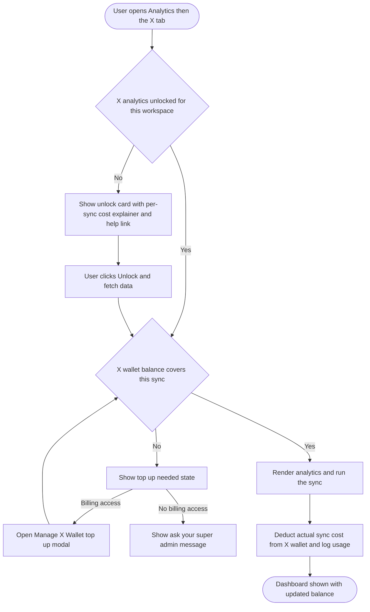
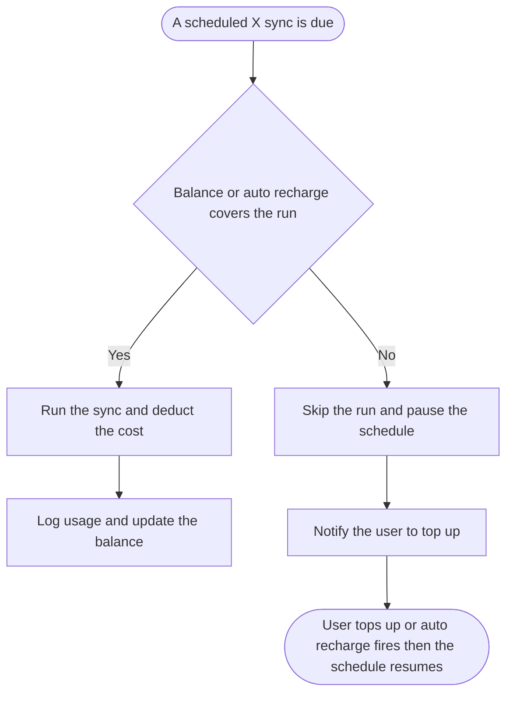

# 02 — Workflow Design: X (Twitter) Analytics Pay-Per-Use Metering + Wallet Gating

**Feature slug:** `x-analytics-metering`
**Pipeline:** `/feature` — Step 2 (Workflow)

> **Decided (research gate):** cost is shown in **dollars** and charged against the **existing X Pay-Per-Use Credit Wallet**. The older analytics "credits used" count is retired as a user-facing spend unit (kept only internally as the driver of the dollar cost). Unlock/consent is **per workspace**. Scheduled syncs that the wallet cannot cover **auto-pause and notify**. Web-only for v1. Never expose X's raw cost or ContentStudio's markup (BR-12).

---

## 1. Feature Placement

Everything lives inside surfaces that already exist. No new top-level navigation.

- **Analytics → X (Twitter) tab.** When X analytics is not yet unlocked for the workspace, the dashboard area shows an **in-page unlock / consent card** over a blurred demo dashboard (reusing the `CompetitorAnalyticsLanding.vue` + `CompetitorDummyGraphs.vue` pattern). Once unlocked and funded, the normal dashboard renders and every sync shows its cost.
- **Sync Data button** (`AnalyticsTabsHeader.vue`). Carries a live dollar estimate for the next sync.
- **Sync settings modal** (`SyncDateRangeModal.vue`, twitter mode). Tweet-count dropdown (`10-150`, default 30) with a **live cost estimate that recalculates as the count changes**; the primary CTA reads the cost. When the wallet cannot cover it, the CTA switches to a top-up state.
- **Scheduled sync settings modal** (`TwitterJobSettingsModal.vue`). Shows the **projected per-run cost** for the chosen frequency and tweet count, plus the auto-pause behavior when unfunded.
- **Always-visible X wallet balance** near the X analytics header, with a top-up shortcut for billing users.
- **Billing → X Wallet card** (`src/modules/setting/components/billing/`). Gains an **Enable X analytics** toggle (account-level master switch), visible and actionable only to billing-capable users. Reuses the existing Manage X Wallet top-up modal.

### Two-level gate

| Level | Who | What it controls |
|---|---|---|
| **Account master enable** (billing X Wallet card toggle) | Billing-capable users only (`can_see_subscription` / super admin) | Whether the account is allowed to spend wallet dollars on X analytics at all |
| **Per-workspace consent** (in-page unlock card) | Any user who opens the X analytics tab in that workspace | A one-time acknowledgement that refreshing X analytics here draws from the shared X wallet |

A billing-capable user reaching a locked workspace can enable and consent in one action from the card. A non-billing user in an account where the master switch is off sees an "ask your super admin" state.

---

## 2. Workflow Diagram (overview)

---

## 3. User Flow (happy path)

1. A user opens **Analytics** and selects the **X (Twitter)** tab. Because X analytics is metered, the workspace shows a one-time **unlock card**: it explains that X moved to pay-per-use, that refreshing X analytics here draws from the shared **X wallet**, the per-sync cost in dollars, and a **learn-more link**. Behind it sits a blurred demo dashboard so the value is visible.
2. The user clicks **Unlock and fetch data**. The wallet has enough balance, so ContentStudio runs the first sync, renders the dashboard, deducts the **actual** sync cost, and shows the **updated balance**.
3. For later refreshes the user clicks **Sync data**. The sync modal shows a tweet-count dropdown and a **live dollar estimate** that updates as the count changes. The primary button reads the cost, for example **"Sync 30 tweets for about $0.16."**
4. On a successful sync the cost is **deducted** and recorded in the X wallet **usage log**, and the always-visible balance updates.
5. For hands-off refreshes the user opens **scheduled sync settings**, picks a frequency (daily / weekly / monthly) and a tweet count, and sees the **projected per-run cost**. Scheduled runs consume automatically while the wallet stays funded.

---

## 4. Alternative / edge flows

- **Insufficient balance at a manual sync.** The sync modal's primary CTA switches to a top-up state. Billing users get **"Top up X wallet"** which opens the Manage X Wallet modal, then returns them to the sync. Non-billing users see **"Ask your super admin to top up the X wallet."** No sync runs and nothing is deducted.
- **Insufficient balance for a scheduled run.** The run is **skipped**, the schedule is **paused**, and the user is notified to top up (reusing the wallet low-balance notification). It resumes when the wallet is topped up or auto-recharge succeeds. Mirrors the publishing rule of "fails, not held."

- **Auto-recharge on.** When the balance dips below the user's threshold and they are under their monthly spending limit (or unlimited), the wallet tops up automatically, so manual and scheduled syncs keep flowing.
- **Account master switch off.** In an account where X analytics has not been enabled in billing, the X tab shows the unlock card in an "enable required" state. Billing users can enable it there or from the X Wallet card; non-billing users are told to ask their super admin.
- **Failed sync (X API error).** Nothing is deducted (charge only on a successful fetch). The user can retry.
- **Estimate vs actual.** The pre-sync figure is framed as an estimate ("about $X"). The **actual** charge is based on the tweets actually returned and is what appears in the usage log. If fewer tweets exist than requested, the user is charged only for what came back.
- **Cost transparency (BR-12).** Only the price the user pays is shown. X's raw per-read cost and ContentStudio's markup are never surfaced.

---

## 5. Key Design Decisions

**D1 — Cost unit: dollars (DECIDED).** Show "about $X" for a sync, with the tweet count as the visible driver. Rationale: consistent with the dollar wallet, lowest cognitive load, users already think in dollars from the X news. The old abstract analytics "credits" count is retired as a spend unit.

**D2 — One wallet, no second currency (DECIDED).** Analytics spends from the same account-level X wallet as publishing, and posts entries to the same usage ledger under a new consumption type (analytics sync). Rationale: a single balance and history is far clearer than parallel currencies, and the ledger was designed generic for exactly this.

**D3 — Unlock granularity: per workspace, spend from the account wallet (DECIDED).** Each workspace shows the consent card once; the money always comes from the one shared account-level wallet. Rationale: matches how users navigate analytics per workspace while keeping billing centralized.

**D4 — Scheduled sync when unfunded: auto-pause + notify (DECIDED).** A scheduled run that the balance and auto-recharge cannot cover is skipped, the schedule pauses, and the user is notified. Rationale: mirrors the publishing "fails, not held" rule and avoids silent repeated failures.

**D5 — Deduct on successful fetch, charge the actual (RECOMMENDED).** Show the estimate before, deduct after the sync returns, based on the tweets actually read. Rationale: never charge for a failed or empty sync; matches the wallet's "no charge on failure" principle. *(Alternative considered: charge the estimate up front and refund the difference. Rejected as more moving parts and more refund edge cases.)*

**D6 — Two-level gate: account master enable plus per-workspace consent (RECOMMENDED).** A billing toggle authorizes spending on analytics account-wide; the in-page card records per-workspace acknowledgement. A billing user can do both in one click from the card. Rationale: keeps the spend decision with billing-capable users while giving every workspace a clear heads-up. *(Alternative: card-only, no billing toggle. Rejected because admins need one place to turn the capability on or off and to see it as a wallet setting.)*

**D7 — No confirm dialog in v1 (RECOMMENDED).** Every sync is one click with the dollar cost shown on the button; no extra confirmation step. Rationale: syncs are inexpensive (max ~150 tweets) and visibility is already high, so a dialog would add friction for little protection. A threshold-based confirm can come later if usage data shows bill-shock risk.

---

## 6. Integration with existing features

- **X Pay-Per-Use Credit Wallet** (`docs/features/x-pay-per-use-credits/`, under dev): analytics reuses the balance, usage ledger, config-driven pricing (`upstream_cost` + markup), Manage X Wallet top-up modal, auto-recharge, monthly spending limit, and the `can_see_subscription` / super-admin permission gating. Analytics adds a new **consumption type** to the ledger and a **deduct-on-successful-fetch** hook. **Hard dependency: the wallet must land first.**
- **Analytics module** (`src/modules/analytics/**`): the unlock card, the per-sync cost preview on the Sync Data button and in `SyncDateRangeModal.vue`, the projected recurring cost in `TwitterJobSettingsModal.vue`, and the always-visible balance. The existing `credits_used` readout and its tooltip are replaced by the dollar cost.
- **Billing** (`src/modules/setting/components/billing/`): the X Wallet card gains the **Enable X analytics** toggle (admin only).
- **Analytics data pipeline** (`contentstudio-social-analytics-go`): the fetch job (`twitter-fetcher`) and the manual `triggerJob` path deduct on a successful fetch and report the **actual tweet count read** so the charge reconciles to reality. Both the manual and scheduled paths consume.

---

## 7. Trackable Actions (Usermaven candidates)

Following the wallet's convention (snake_case, past tense, no PII) and the existing `x_*` event family. Top-up itself already emits `x_credits_purchased` from the wallet, so it is not duplicated here.

| Action | Candidate event | Trigger | Dispatch | Payload |
|---|---|---|---|---|
| Admin enables X analytics metering | `x_analytics_enabled` | Enable X analytics toggle turned on in billing | FE | `{}` |
| Workspace unlocks / consents to metered X analytics | `x_analytics_unlocked` | User confirms the in-page unlock card | FE | `{}` |
| A sync completes and is charged | `x_analytics_sync_charged` | Successful fetch deducts from the wallet | BE | `{ amount_usd, tweet_count, source: 'manual' \| 'scheduled' }` |
| A manual sync is blocked by an empty wallet | `x_analytics_sync_blocked_insufficient_balance` | Sync attempted with too-low balance | FE | `{}` |
| A scheduled sync is auto-paused for low balance | `x_analytics_schedule_paused_insufficient_balance` | Scheduled run skipped and paused | BE | `{}` |

---

## 8. Scope Recommendation

**v1 (this epic):**
- In-page unlock / consent card for X analytics (per workspace) over a blurred demo dashboard, with the cost explainer and a learn-more link, plus the "enable required" and "ask your super admin" states.
- Live per-sync **dollar** cost preview on the Sync Data button and in the sync settings modal, recalculating as the tweet count changes.
- Balance gate on manual syncs: block when unfunded, with a top-up CTA (billing) or ask-super-admin message (non-billing).
- Deduct on successful fetch, charged on the actual tweets read, logged to the X wallet usage ledger as an analytics-sync entry.
- Scheduled sync: projected per-run cost in job settings, and auto-pause + notify when unfunded.
- Billing: **Enable X analytics** toggle on the X Wallet card (admin only).
- Always-visible X wallet balance in the X analytics surface.
- Pricing from the wallet's config; never expose raw cost or markup.
- Usermaven events per §7.

**Defer to v2+:**
- Threshold-based confirm dialog for unusually large syncs.
- Free reuse of very recently synced data instead of re-charging.
- Extending metering to X inbox and listening (separate epics, same wallet).
- Per-connected-account unlock granularity if agencies ask for it.
