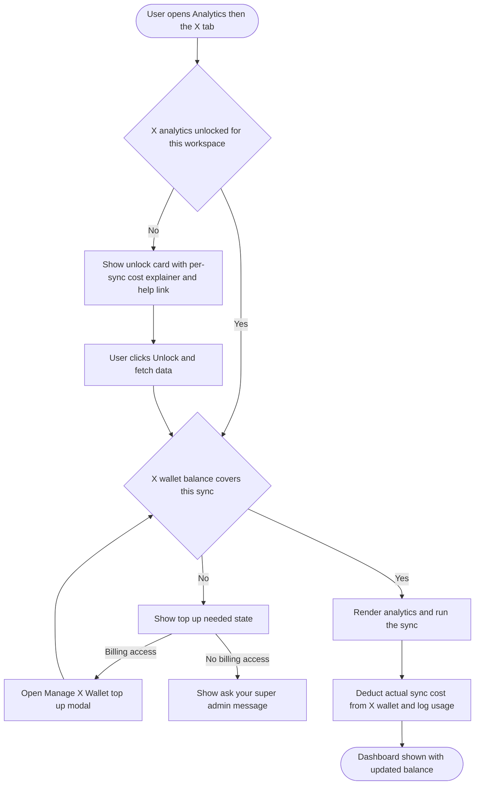

# PRD: X (Twitter) Analytics Pay-Per-Use Metering + Wallet Gating

**Author:** Ghulam Jaffar (Product Owner)
**Last Updated:** 2026-08-03
**Status:** In Review
**Target Release:** Q4 2026 (after the X Pay-Per-Use Credit Wallet ships)

---

## 1. Overview

X (Twitter) moved its API to **pay-per-use pricing**, so every X analytics refresh now costs ContentStudio real money: each sync reads one user profile (~$0.010) plus the tweets the user asked for at **$0.005 per tweet read**. This feature meters X analytics: X analytics is gated behind a one-time **per-workspace unlock card**, every sync shows its **cost before it runs** and updates live as the user changes the tweet count, and the **actual cost is deducted on a successful fetch** and recorded.

Metering is **dual-currency**, keyed off the user's cohort (decided by the existing `WalletService::isEnabledForUser` logic). **Wallet users** (new and provisioned accounts) pay in **dollars** from the prepaid X Credit Wallet, the same balance used for X publishing. **Legacy users** who hold the old X posting-credit add-on stay on the **credit** system permanently (flagged `x_wallet_disabled = true`); they pay in **X credits** deducted from their existing posting-credit allowance, converted at the verified rate of **1 credit = $0.0166** (60 credits = $1). Both cohorts pay the same real cost for a sync; only the unit and the top-up path differ. The whole feature is built around one principle: **the user always sees what a sync costs before they spend, and can never be surprise-billed.**

> Note: today an analytics sync charges **nothing** for anyone. The `credits_used` value shown in analytics is purely an informational count of X API reads (`rawTweetsFetched (+1)`), never a deduction. Charging analytics is net-new for **both** currencies.

---

## 2. Problem Statement

**What problem are we solving?**
X's per-read API pricing means X analytics is no longer free to serve: a single 30-tweet sync costs ContentStudio about $0.16 in raw X fees, and a heavy 150-tweet sync on a schedule several times a week multiplies fast across thousands of connected accounts. Today X analytics syncs run with no cost ceiling and no user-visible price. There is no way to recover the cost, no way for a user to see what a refresh will cost, and no guard against runaway spend. The analytics module already fetches an internal `credits_used` count per sync but has no prepaid balance, no pre-sync price, and no gate.

**Who has this problem?**
Two parties. **ContentStudio** carries uncapped, growing X API cost on every analytics sync. **Users** who rely on X analytics need it to keep working, but (post X-pricing news) now expect that X data may cost extra and want to see and control that cost rather than have it hidden or the feature quietly removed.

**What happens if we don't solve it?**
ContentStudio either eats unbounded X analytics cost (margin erosion that scales with usage) or is forced to throttle or drop X analytics (as Later and Loomly did), frustrating paying customers. A transparent, wallet-metered model recovers cost with margin while keeping X analytics available and, uniquely in this market, showing users exactly what each sync costs before they spend.

---

## 3. Goals & Success Metrics

| Goal | Metric | Target | How We'll Measure |
|---|---|---|---|
| Recover X analytics API cost with margin | Gross margin on X analytics syncs | ≥ 20% markup (per wallet pricing config) | Usage ledger + pricing config |
| Keep X analytics adopted after gating | % of X-analytics workspaces that unlock and run ≥ 1 paid sync | ≥ 60% of previously-active X-analytics workspaces in 90 days | Usermaven (`x_analytics_unlocked`, `x_analytics_sync_charged`) |
| No bill shock | X-analytics-related billing support tickets | < 1% of X-analytics workspaces | Support data |
| Cost visibility works | % of blocked syncs that convert to a top-up within 24h | ≥ 40% | Usermaven (`x_analytics_sync_blocked_insufficient_balance` → `x_credits_purchased`) |
| Guard rail: scheduled spend stays intentional | Auto-paused scheduled syncs that resume after top-up | ≥ 50% resume within 7 days | Usermaven (`x_analytics_schedule_paused_insufficient_balance`) |

### 3.1 Analytics Events (Usermaven)

New events for this feature. Top-up itself already emits `x_credits_purchased` from the wallet feature and is **not** duplicated here. Before implementing, search `contentstudio-frontend/src/` for `userMaven.track(` to confirm none of these names already exist.

| Event Name | Trigger | Payload | What we measure with it |
|---|---|---|---|
| `x_analytics_enabled` | Billing user turns on the Enable X analytics toggle | `{}` | Account-level adoption of the capability |
| `x_analytics_unlocked` | User confirms the in-page unlock/consent card in a workspace (FE) | `{}` | Per-workspace activation; unlock funnel |
| `x_analytics_sync_charged` | A successful sync deducts from the wallet or credit balance (BE, server-side on fetch completion) | `{ amount, unit: 'usd' \| 'credits', tweet_count, source: 'manual' \| 'scheduled' }` | Sync volume, spend, manual vs scheduled split, currency split |
| `x_analytics_sync_blocked_insufficient_balance` | A manual sync is attempted with too-low balance or too-few credits (FE) | `{ unit: 'usd' \| 'credits' }` | Friction; top-up conversion trigger; cohort split |
| `x_analytics_schedule_paused_insufficient_balance` | A scheduled run is skipped and its schedule paused (BE) | `{}` | Scheduled-spend friction; resume behavior |

Naming follows guidelines §19 (snake_case, past tense, no PII). These map 1:1 to acceptance criteria in the FE/BE stories.

---

## 4. Target Users

**Primary Persona — Analyst / social media manager who views X analytics.** Opens the X analytics dashboard, runs manual syncs, and sets up scheduled refreshes. Cares about fresh, complete X data and about knowing what a refresh costs before running it. May or may not have billing access.

**Secondary Persona — Workspace super admin / billing owner.** Owns the X wallet, turns X analytics metering on, tops up, sets auto-recharge and the monthly spending limit, and watches spend. Cares about predictable cost and not overpaying.

**Non-Users (out of scope):**
- Users on platforms other than X (this is X-analytics-only; other platforms' analytics stay unmetered).
- Mobile app users (X metering is web-first per the wallet PRD; no Flutter/iOS/Android work in this epic).
- X **publishing**, **inbox**, and **listening** metering (publishing is already handled by the wallet feature; inbox and listening are future epics on the same wallet).

---

## 5. User Stories / Jobs to Be Done

| ID | As a… | I want to… | So that… | Priority |
|---|---|---|---|---|
| US-1 | Analyst | see what an X analytics sync will cost before I run it | I am never surprised by the charge | Must |
| US-2 | Analyst | have the cost update as I change the tweet count | I can choose a cheaper or fuller sync knowingly | Must |
| US-3 | Analyst | be told clearly when the wallet cannot cover a sync, and who to ask | I know why it did not run and how to fix it | Must |
| US-4 | Super admin | turn X analytics metering on or off for the account | I control whether we spend on X analytics at all | Must |
| US-5 | Super admin | see X analytics syncs in the same wallet usage log as publishing | I have one place to audit all X spend | Must |
| US-6 | Analyst | know that a scheduled X sync will pause (not silently fail forever) if the wallet runs dry, and be notified | my automated refreshes stay under control | Must |
| US-7 | Analyst without billing access | understand X analytics is metered and who can fund it | I am not stuck when the wallet is empty | Must |
| US-8 | Super admin | see the projected recurring cost when I set a scheduled X sync | I can budget the automation | Should |

---

## 6. Requirements

### 6.1 Must Have (P0)

- **Dual-currency metering keyed off cohort.** The currency for a given account is decided by the existing `WalletService::isEnabledForUser` logic. Wallet users are charged in dollars from the X wallet; legacy add-on users are charged in X credits from their posting-credit allowance. Every cost preview, balance display, gate message, and top-up path renders in the user's own currency. No account is ever shown both.
- **Per-workspace unlock / consent card** on the X analytics tab, shown over a blurred demo dashboard, explaining that refreshing X analytics draws from the shared X wallet (or X credits for legacy users), the per-sync cost in the user's currency, and a learn-more link. Includes the "enable required" and "ask your super admin" states.
- **Account master enable** (wallet cohort): an **Enable X analytics** toggle on the billing X Wallet card, actionable only by billing-capable users (`can_see_subscription` / super admin), **off by default**. Legacy users have no X Wallet card, so they have no master toggle; for them the per-workspace unlock card is the only gate (they are already paying customers via the credit add-on).
- **Live per-sync cost preview in dollars** on the Sync Data button and inside the sync settings modal, **recalculating as the tweet count changes** (`10-150`, default 30).
- **Balance gate on manual syncs**: when the wallet (and auto-recharge) or the credit balance cannot cover the sync, block it, deduct nothing, and show a top-up CTA (billing users) or an "ask your super admin" message (non-billing users). For wallet users the top-up CTA opens the Manage X Wallet modal; for legacy users it opens the existing X posting-credit add-on purchase flow (buy more `$5 / 300` packs).
- **Deduct on successful fetch, charged on the actual tweets read** (not the estimate, and nothing on failure or empty result). Wallet users: deducted from the X wallet and recorded in the shared usage ledger as an **analytics-sync** type. Legacy users: deducted from the `x_posting_credits` allowance (the same balance posting uses) and reflected in the credit usage view.
- **Scheduled sync metering**: show the projected per-run cost (in the user's currency) in the scheduled sync settings modal; when a scheduled run cannot be funded, **skip it, pause the schedule, and notify** the user; resume on top-up, a credit pack purchase, a successful auto-recharge, or the monthly credit reset.
- **Always-visible balance** in the X analytics surface, shown as dollars for wallet users and as X credits for legacy users, with a top-up shortcut for billing users.
- **Pricing from the wallet's config-driven rate** (upstream cost + markup); for legacy users the same cost is converted to credits at 1 credit = $0.0166 and rounded up. **Never expose X's raw cost or the markup** (BR-12 from the wallet PRD).
- **Usermaven events** per §3.1.

### 6.2 Should Have (P1)

- **Estimated-vs-actual reconciliation**: after a sync, show the actual amount charged (from tweets actually returned) alongside the estimate, so the number the user saw is visibly honored.
- **Projected recurring spend summary** for a scheduled sync (for example, "about $0.16 per run, roughly $4.80 per month at daily").
- **Low-balance surfacing inside the analytics view** (not only in billing), so an analyst sees the wallet is running low before a sync is blocked.

### 6.3 Nice to Have (P2)

- **Threshold-based confirm dialog** for unusually large syncs (only above a configurable dollar amount).
- **Free reuse of very recently synced data** (offer cached data at no charge when it is still fresh, instead of re-charging).
- **Cheaper-path nudge** (for example, suggesting a smaller tweet count when the balance is low).

### 6.4 Explicitly Out of Scope

- X **publishing** metering (already covered by the X Pay-Per-Use Credit Wallet epic).
- X **inbox** and **listening** metering (future epics on the same wallet).
- **Date-range-based** X analytics (X analytics is count-based; the API takes no start/end time, so there is no date range to price).
- **Mobile** app changes (web-first for v1).
- A **second currency** or separate analytics credit balance (analytics spends from the one X dollar wallet).
- Building the wallet, top-up modal, auto-recharge, or usage ledger (reused from the wallet epic).

---

## 7. User Flow (High Level)

1. A user opens **Analytics** and selects the **X (Twitter)** tab. If the workspace has not unlocked X analytics, the **unlock card** appears over a blurred demo dashboard, explaining the pay-per-use model, the per-sync cost, and a learn-more link.
2. The user clicks **Unlock and fetch data**. If the account has not enabled X analytics, a billing user can enable it here (non-billing users are told to ask their super admin).
3. If the wallet has enough balance, ContentStudio runs the first sync, renders the dashboard, **deducts the actual cost**, and updates the balance. If not, the top-up state appears.
4. For later refreshes, the user clicks **Sync data**; the sync modal shows the tweet-count dropdown and a **live dollar estimate**, and the button reads the cost. On success the cost is deducted and logged.
5. For hands-off refreshes, the user sets a **scheduled sync** (frequency + tweet count) and sees the **projected per-run cost**. Scheduled runs consume automatically while funded; an unfunded run pauses the schedule and notifies the user.

A second diagram covering the scheduled-sync auto-pause behavior is in `02-workflow.md` §4.

---

## 8. Business Rules & Constraints

| Rule ID | Rule | Rationale |
|---|---|---|
| BR-1 | Cost per sync = X cost × the wallet's configured markup, where X cost = (tweets read × per-post-read rate) + one user-read rate. Read from the wallet pricing config, not hardcoded. | Recover cost with margin; no deploy when X changes prices |
| BR-2 | Deduct only on a **successful** fetch, charged on the **actual** tweets returned; nothing on failure or empty result | Never charge for a failed or empty sync |
| BR-3 | Spend comes from the **account/super-admin-level X wallet**, shared with publishing; analytics posts a distinct **analytics-sync** entry to the same usage ledger | One balance, one history, clearer audit |
| BR-4 | Deduction is **atomic** (atomic decrement + ledger insert, idempotent per sync) | Concurrent manual + scheduled syncs must not double-charge or lose a deduction |
| BR-5 | Insufficient balance → the sync **does not run** (manual) or the scheduled run is **skipped and the schedule paused** (scheduled); not held or silently retried forever | Predictable behavior, no silent repeated failures |
| BR-6 | X analytics metering is **off by default** per account; a billing-capable user must enable it (via the billing toggle or by unlocking from the card) | Explicit opt-in; no spend before an admin decides |
| BR-7 | Only **billing-capable users** (`can_see_subscription` / super admin) can enable metering or top up; others see "ask your super admin" | Mirrors the wallet and white-label permission pattern |
| BR-8 | Unlock/consent is recorded **per workspace**; spend always draws from the single account-level wallet | Matches per-workspace analytics navigation with centralized billing |
| BR-9 | The pre-sync figure is an **estimate**; the charge is the **actual**. X analytics is **count-based** (no date range) | X API takes tweet count, not a time window |
| BR-10 | **Never** expose X's raw per-read cost or ContentStudio's markup; show only the price the user pays | Protects margin; avoids "why the fee?" friction (wallet BR-12) |
| BR-11 | Currency is decided per account by `WalletService::isEnabledForUser`. Wallet users pay dollars; legacy add-on users (`x_wallet_disabled = true`) pay X credits. Never mix currencies for one account | Reuse the one implemented cohort gate; do not invent a new flag |
| BR-12 | Legacy credit cost per sync = the same cost basis as the wallet, converted at **1 credit = $0.0166** (60 credits = $1) and **rounded up** to whole credits | Both cohorts pay the same real cost; whole-credit charges match the existing credit model |
| BR-13 | Legacy analytics charges decrement the **same `x_posting_credits` allowance** posting uses; insufficient credits route the top-up CTA to the existing add-on purchase flow (`$5 / 300` packs) | One credit balance for the legacy cohort; reuse the add-on purchase path |
| BR-14 | A single large sync can cost more credits than a plan's whole monthly allowance (for example ~46 credits for 150 tweets vs a Standard plan's 45/month). The gate blocks it and prompts a top-up rather than partial-syncing | Predictable behavior; no surprise partial data |

---

## 9. Open Questions

| Question | Options | Owner | Decision |
|---|---|---|---|
| Does the same markup % apply to analytics reads as to publishing? | Same flat markup / analytics-specific | PM + Billing | Working: same config-driven markup |
| How are legacy X-credit users charged for analytics? | Charge credits / keep free / separate meter | PM | **Decided: charge X credits** from the `x_posting_credits` allowance, cost-proportional at 1 credit = $0.0166 |
| Read-pricing config for analytics | needs `post_read` + `user_read` rates added to `x_pay_per_use.php` | Billing eng | **Open**: the config today only has post-write costs; analytics read rates are net-new and must be added |
| Estimated-vs-actual: single "about $X" or a range when requested tweets may exceed available? | Single estimate + reconcile / range | PM | Leaning single estimate + reconcile (P1) |
| Should the existing internal `credits_used` value be shown to users at all, or fully replaced by the dollar cost? | Replace fully / keep as secondary detail | PM | Leaning replace fully with dollars |
| Does an auto-paused scheduled sync require a manual "resume," or does a successful top-up/auto-recharge resume it automatically? | Manual resume / auto-resume | PM + BE | **Decided: auto-resume** on the next due run once the wallet is funded (top-up or auto-recharge) |
| Threshold-confirm dialog and free fresh-data reuse — v1 or v2? | v1 / v2 | PM | Deferred to v2 (§6.3) |

---

## 10. Risks & Mitigations

| Risk | Likelihood | Impact | Mitigation |
|---|---|---|---|
| Users perceive X analytics as "newly paywalled" and churn | Medium | High | Unlock card frames the X pay-per-use context (not a ContentStudio choice); transparent per-sync cost; publishing wallet already normalizes the model |
| Scheduled syncs silently drain the wallet | Medium | High | Projected per-run cost shown at setup; auto-pause + notify when unfunded; auto-recharge with monthly spending limit |
| Estimate and actual charge diverge and erode trust | Medium | Medium | Charge on actual tweets read, reconcile visibly (P1), never charge more than shown per tweet rate |
| Two credit concepts (posting credits vs analytics) confuse users | Medium | Medium | Retire the analytics "credits used" spend unit; one dollar wallet; consistent copy |
| Concurrency double-charge across manual + scheduled | Medium | Medium | Atomic decrement + idempotent per-sync deduction + ledger |
| Wallet epic slips, blocking this feature | Medium | High | Sequence explicitly after the wallet; build against its ledger/pricing/permission contracts |

---

## 11. Dependencies

- **Internal:**
  - **X Pay-Per-Use Credit Wallet** (`docs/features/x-pay-per-use-credits/`) — the balance, atomic deduction + usage ledger, config-driven pricing, Manage X Wallet top-up modal, auto-recharge, monthly spending limit, and `can_see_subscription` permission gating. **Hard dependency; must land first.**
  - **Analytics module** (`contentstudio-frontend/src/modules/analytics/**`) — the X analytics view, the Sync Data button and `SyncDateRangeModal.vue` (twitter mode), the `TwitterJobSettingsModal.vue`, and the existing `credits_used` readout being replaced.
  - **Billing UI** (`contentstudio-frontend/src/modules/setting/components/billing/**`) — where the Enable X analytics toggle lives on the X Wallet card.
  - **Analytics data pipeline** (`contentstudio-social-analytics-go`) — the `twitter-fetcher` and manual `triggerJob` paths, which must deduct on a successful fetch and report the actual tweet count read (`src/services/twitter/twitter-fetcher/run.go`, `src/api/immediate_work_apis.go`, `src/cmd/jobs/fetcher/twitter.go`).
  - **Feature-unlock precedent** — `CompetitorAnalyticsLanding.vue`, `CompetitorUpgradeModal.vue`, `CompetitorDummyGraphs.vue` for the in-page gate.
  - **Legacy credit system** — `WalletService::isEnabledForUser` (cohort gate), the `x_posting_credits` allowance and its decrement path, `IncreaseLimitsAddon` (credit rate), `src/modules/composer/utils/xCredits.ts`, and the existing X posting-credit add-on purchase flow (`TwitterPostingAddon.vue`, the `$5 / 300` pack) reused as the legacy top-up path.
- **External:** X (Twitter) API pay-per-use pricing ($0.005 per post read, ~$0.010 per user read); Paddle top-up mechanism (via the wallet).
- **Blockers:** The X wallet's balance getter and deduct/consume endpoint must exist (backend foundation on the unmerged `feature/cont-2623-story-1-credit-consumption-engine-foundation` branch) before this feature can deduct.

---

## 12. Appendix

- **Workflow & full UX detail:** `02-workflow.md` (this feature folder).
- **Research (competitor + codebase):** `01-research.md` (this feature folder).
- **Wallet feature it extends:** `docs/features/x-pay-per-use-credits/` (PRD, workflow, epic + stories).
- **Codebase anchors:** frontend `src/modules/analytics/views/twitter/**`, `src/modules/analytics/components/common/SyncDateRangeModal.vue`, `src/modules/analytics/views/twitter/components/TwitterJobSettingsModal.vue`, `src/modules/setting/components/billing/**`, `src/modules/composer/utils/xCredits.ts`, `src/components/common/TwitterPostingAddon.vue`; backend `app/Services/Billing/XWallet/WalletService.php` (cohort gate), `app/Libraries/Account/IncreaseLimitsAddon.php` (credit rate), `config/x_pay_per_use.php` (wallet pricing config); Go `src/clients/social/twitter.go`, `src/services/twitter/twitter-fetcher/run.go` (`credits_used = rawTweetsFetched (+1)`), `src/cmd/jobs/fetcher/twitter.go`.

### 12.1 Verified credit facts (from code, branch `features`)

**Credit rate (universal, all plans):** 1 X posting credit = **$0.0166** · 60 credits = $1 · 300-credit pack = $5. Verified via `IncreaseLimitsAddon::X_POSTING_LIMIT = 60`, the `300 / $5` pack, and billing math `5/300`.

**Per-plan monthly X posting-credit allowance** (after all migrations):

| Plan tier | Monthly X credits | ≈ $ value |
|---|---|---|
| Standard / Starter / Empowerers / Growth | 45 | ~$0.75 |
| Advanced / Pro / Basic | 80 | ~$1.33 |
| Agency / Professional / Enterprise / Max | 150 | ~$2.50 |
| Trial | 0 | $0 |
| Lifetime (LTD) | 0 | $0 |

**Illustrative sync cost in credits** (cost-proportional, rounded up): 30 tweets ≈ 10 credits · 80 tweets ≈ 25 credits · 150 tweets ≈ 46 credits (exceeds a Standard plan's whole monthly allowance, see BR-14).

**Cohort gate:** `WalletService::isEnabledForUser` (kill switch → per-user `x_wallet_disabled` → force-disabled ids → wallet-has-activity → has-active-credit-addon → default wallet). Legacy add-on holders were backfilled to `x_wallet_disabled = true` and stay on credits with no forced dollar conversion. This supersedes the X-wallet PRD's "convert add-on to dollars" migration note, which is not implemented.

---

## Changelog

| Date | Author | Changes |
|---|---|---|
| 2026-08-03 | Ghulam Jaffar | Initial PRD from approved research + workflow; cost in dollars, per-workspace unlock, scheduled auto-pause, master toggle off by default |
