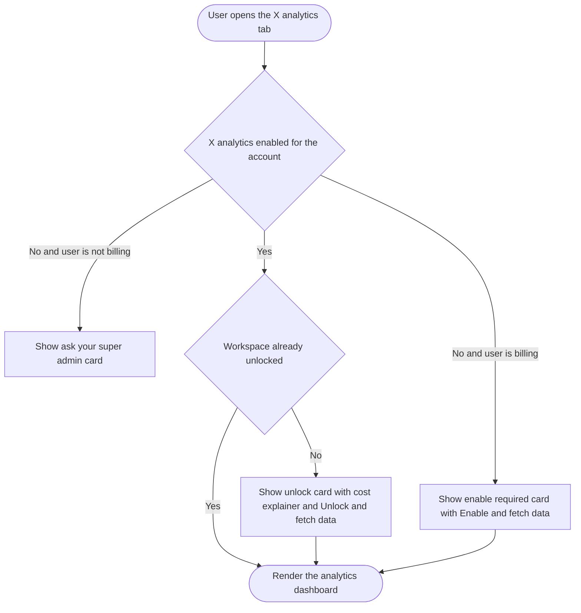
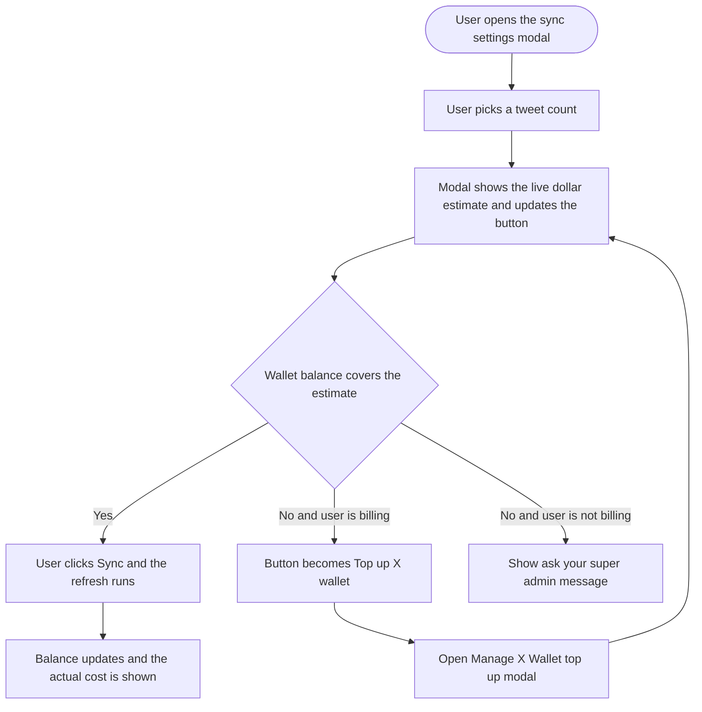

# 04 — Epic + Stories: X (Twitter) Analytics Pay-Per-Use Metering

**Feature slug:** `x-analytics-metering`
**Pipeline:** `/feature` — Step 4 (Epic + Stories)
**Depends on epic:** X (Twitter) Pay-Per-Use Credit Wallet (must ship first)

> These stories are documentation for the Product Owner to create in the tracker manually. Structure each story with the New Feature Template sections. Per current team preference, no trailing PM "fields" block is included; priorities are in the story table below. Web-only for v1 (no mobile stories). No em dashes in user-facing copy. Never expose X's raw per-read cost or ContentStudio's markup.

---

## Epic

**Title:** X (Twitter) Analytics Pay-Per-Use Metering

**Description:**

X moved its API to pay-per-use pricing, so every X analytics refresh now costs real money: one user-profile read plus $0.005 for each tweet read. This epic meters X analytics against the existing prepaid X Credit Wallet (the same dollar balance used for X publishing). X analytics is gated behind a one-time per-workspace unlock card, every sync shows its dollar cost before it runs and updates live as the user changes the tweet count, and the actual cost is deducted from the wallet on a successful fetch and recorded in the shared usage log.

The guiding principle is total cost visibility: a user always sees what a sync will cost before they spend, is never surprise-billed, and is told clearly when the wallet cannot cover a sync and who can fund it. Billing-capable admins turn the capability on with an Enable X analytics toggle on the X Wallet card (off by default). Scheduled syncs show their projected per-run cost and auto-pause with a notification when the wallet runs dry, resuming automatically once it is funded again.

This epic reuses the wallet's balance, atomic deduction, usage ledger, config-driven pricing, top-up modal, auto-recharge, and permission model. It adds only the analytics-specific pieces: the unlock gate, the per-sync cost preview, the balance gate, the scheduled-sync metering, and the billing toggle. Mobile, X inbox, and X listening metering are out of scope.

---

## Stories

| # | Title | Type | Priority | Depends on |
|---|---|---|---|---|
| 1 | [Design] Design the X analytics metering experience | Design | High (P0) | X wallet epic |
| 2 | [BE] Meter X analytics syncs against the X wallet | Backend | High (P0) | X wallet epic |
| 3 | [BE] Enforce X analytics enablement and unlock, and auto-pause unfunded scheduled syncs | Backend | High (P0) | X wallet epic |
| 4 | [FE] Gate X analytics behind a per-workspace unlock card | Frontend | High (P0) | Stories 1, 3 |
| 5 | [FE] Show live per-sync cost and gate manual X analytics syncs on wallet balance | Frontend | High (P0) | Stories 1, 2 |
| 6 | [FE] Show projected cost and auto-pause messaging for scheduled X analytics syncs | Frontend | Medium (P1) | Stories 1, 2, 3 |
| 7 | [FE] Add the Enable X analytics toggle to the billing X Wallet card | Frontend | High (P0) | Stories 1, 3 |

---

## Story 1 — [Design] Design the X analytics metering experience

### Description
As the design owner for this epic, I want to design every new X analytics metering surface so that engineering has a single, consistent visual spec for the unlock gate, the per-sync cost preview, the insufficient-balance states, the scheduled-sync messaging, and the billing toggle, all matched to the existing X wallet look and feel.

### Workflow
1. Designer reviews the existing X wallet surfaces (X Wallet billing card, Manage X Wallet modal, top-up calculator) and the current X analytics dashboard, sync modal, and scheduled job settings modal so the new pieces match.
2. Designer produces the states listed in Acceptance criteria and hands off with copy, spacing, and component usage annotated against the design system.

### Acceptance criteria
- [ ] Unlock / consent card is designed for the X analytics tab, sitting over a blurred demo dashboard, with all four states: not enabled for the account, enabled but not yet consented in this workspace, no billing access (ask super admin), and wallet empty at unlock time.
- [ ] Per-sync cost preview is designed for both the Sync Data button and the sync settings modal, including how the dollar figure and the tweet count appear together and how the value updates when the count changes.
- [ ] Insufficient-balance state is designed for the sync modal, with the billing variant (top up) and the non-billing variant (ask super admin).
- [ ] Always-visible wallet balance placement in the X analytics surface is designed, with a top-up shortcut for billing users.
- [ ] Scheduled sync settings additions are designed: projected per-run cost, projected recurring spend, and the auto-pause explanation.
- [ ] Enable X analytics toggle is designed on the X Wallet billing card, including the off, on, and no-access states.
- [ ] Estimated-vs-actual reconciliation display is designed (what the user sees after a sync completes).
- [ ] All designs use existing design system components and the primary theme variables (no hardcoded colors), and specify no dark mode and no RTL.

### Mock-ups
This story produces the mock-ups. Reference: PRD section 7 for the flow.

### Impact on existing data
None. Design only.

### Impact on other products
Web only. Mobile, Chrome extension not in scope for this epic.

### Dependencies
- Depends on the X wallet surfaces from the epic **X (Twitter) Pay-Per-Use Credit Wallet** being designed and available to match against.

### Global quality & compliance (wherever applicable)
- [ ] Mobile responsiveness (design specifies responsive behavior for web)
- [ ] Multilingual support (copy handed off for translation)
- [ ] UI theming support (default + white-label, design library components are being used)
- [ ] White-label domains impact review
- [ ] Cross-product impact assessment (web, mobile apps, Chrome extension)

---

## Story 2 — [BE] Meter X analytics syncs against the X wallet

### Description
As the platform, I want to charge X analytics syncs to the shared X wallet based on what a sync actually reads, so that ContentStudio recovers its X API cost with margin while the user is only ever charged for a successful sync and only for the tweets actually returned.

### Workflow
This is a backend story. Behavior, from the user's point of view: before a sync runs, the system knows whether the wallet can cover it and what it will cost. After a successful sync, the wallet balance drops by the sync's cost and a new line appears in the X wallet usage log. A failed or empty sync costs nothing.

### Acceptance criteria
- [ ] A per-sync cost is computed from the wallet's pricing config as: (number of tweets to read times the configured per-post-read rate) plus one configured user-read rate, times the configured markup. Rates come from the wallet config, never hardcoded.
- [ ] An endpoint returns the projected cost for a given tweet count so the frontend can show a live estimate. It returns the payable dollar amount only, never the raw X cost or the markup.
- [ ] Before a manual sync runs, the system checks the account X wallet balance. If the balance (after any auto-recharge) cannot cover the projected cost, the sync is rejected with a clear "insufficient X wallet balance" reason and nothing is deducted.
- [ ] On a successful sync, the wallet is charged the actual cost based on the number of tweets actually returned (not the estimate), even when fewer tweets were available than requested.
- [ ] A failed sync or a sync that returns zero tweets deducts nothing.
- [ ] The deduction is atomic and idempotent per sync, so a manual and a scheduled sync running close together cannot double-charge or lose a charge.
- [ ] Each charge writes a usage-ledger entry of a distinct analytics-sync type, recording date, workspace, connected X account, tweet count, cost, and resulting balance, visible in the existing X wallet usage log alongside publishing entries.
- [ ] When a sync is charged, an `x_analytics_sync_charged` Usermaven event fires server-side with `{ amount_usd, tweet_count, source: 'manual' | 'scheduled' }`.
- [ ] The wallet balance for X analytics is the same account-level balance used for X publishing (no separate analytics balance).

### Mock-ups
N/A, backend only.

### Impact on existing data
- Adds a new consumption type to the existing X wallet usage ledger. No change to the wallet balance model itself.
- The analytics fetch path begins reporting the actual number of tweets read so the charge can reconcile to reality.

### Impact on other products
Web only. Charges apply to any X analytics sync regardless of trigger surface. Mobile not in scope.

### Dependencies
- Depends on the X wallet balance, atomic deduction, usage ledger, and pricing config from the epic **X (Twitter) Pay-Per-Use Credit Wallet**.
- Consumed by **[FE] Show live per-sync cost and gate manual X analytics syncs on wallet balance**.

### Global quality & compliance (wherever applicable)
- [ ] Mobile responsiveness — N/A, backend only
- [ ] Multilingual support (error reasons returned support translation on the frontend)
- [ ] UI theming support — N/A, backend only
- [ ] White-label domains impact review
- [ ] Cross-product impact assessment (web, mobile apps, Chrome extension)

### Implementation references
*Pointers from research — not a contract. Engineering may choose a different approach.*

**Primary entry points:**
- `contentstudio-social-analytics-go/src/services/twitter/twitter-fetcher/run.go` — the fetch loop already counts tweets fetched (`rawTweetsFetched`); this is the actual-tweets-read figure the charge should reconcile against.
- `contentstudio-social-analytics-go/src/api/immediate_work_apis.go` and `src/models/kafka/twitter.go` (`NTweets`) — the manual sync trigger path carrying the requested tweet count.
- `contentstudio-social-analytics-go/src/cmd/jobs/fetcher/twitter.go` — the scheduled path (`jobSetting.PostCount`).
- The wallet balance getter and deduct/consume engine live in the wallet backend foundation (`contentstudio-backend`, unmerged branch `feature/cont-2623-story-1-credit-consumption-engine-foundation`). Reuse its atomic decrement plus ledger insert; do not reimplement.

**Gotcha:**
- X analytics is count-based. `FetchUserTweets` sends only `max_results` and `pagination_token`, no time window, so cost must key off tweet count, not a date range.
- Requested count and returned count can differ (an account with fewer tweets than requested). Charge on returned count.

---

## Story 3 — [BE] Enforce X analytics enablement and unlock, and auto-pause unfunded scheduled syncs

### Description
As the platform, I want to store whether an account has enabled X analytics metering and whether each workspace has consented, and to auto-pause scheduled X syncs when the wallet cannot fund them, so that the capability is strictly opt-in and automated refreshes never drain the wallet silently or fail forever.

### Workflow
This is a backend story. Behavior, from the user's point of view: X analytics stays off until an admin turns it on. Each workspace confirms once before it starts spending. A scheduled refresh that cannot be paid for is skipped and paused, the user is notified, and it starts running again on its own once the wallet is funded.

### Acceptance criteria
- [ ] An account-level "X analytics enabled" flag is stored, defaulting to off for all accounts.
- [ ] Only billing-capable users (permission `can_see_subscription` or super admin) can change the flag; a request from a non-billing user is rejected.
- [ ] A per-workspace "X analytics unlocked" state is stored and returned so the frontend knows whether to show the unlock card in a given workspace.
- [ ] Turning the flag on for the first time also allows the workspace unlock to proceed in the same action for a billing user.
- [ ] When a scheduled X sync is due and the wallet (after any auto-recharge) cannot cover it, the run is skipped, the schedule is set to a paused state, and nothing is deducted.
- [ ] When a paused schedule's next run is due and the wallet can now cover it (via top-up or a successful auto-recharge), the schedule resumes automatically with no manual step.
- [ ] When a scheduled run is auto-paused for low balance, an `x_analytics_schedule_paused_insufficient_balance` Usermaven event fires server-side.
- [ ] The account-enabled state and the per-workspace unlock state are readable by the frontend in one call so the analytics tab can decide what to render without extra round trips.

### Mock-ups
N/A, backend only.

### Impact on existing data
- Adds an account-level X analytics enabled flag (default off) and a per-workspace unlock record.
- Adds a paused state to the existing X analytics scheduled job settings.

### Impact on other products
Web only. Scheduled sync auto-pause applies wherever scheduled X syncs run. Mobile not in scope.

### Dependencies
- Depends on the X wallet balance and auto-recharge from the epic **X (Twitter) Pay-Per-Use Credit Wallet**.
- Consumed by **[FE] Gate X analytics behind a per-workspace unlock card**, **[FE] Add the Enable X analytics toggle to the billing X Wallet card**, and **[FE] Show projected cost and auto-pause messaging for scheduled X analytics syncs**.

### Global quality & compliance (wherever applicable)
- [ ] Mobile responsiveness — N/A, backend only
- [ ] Multilingual support (notification copy supports translation on the frontend)
- [ ] UI theming support — N/A, backend only
- [ ] White-label domains impact review
- [ ] Cross-product impact assessment (web, mobile apps, Chrome extension)

### Implementation references
*Pointers from research — not a contract. Engineering may choose a different approach.*

**Primary entry points:**
- `contentstudio-social-analytics-go/src/cmd/jobs/fetcher/twitter.go` — `shouldScheduleTwitterAccount` gates daily/weekly/monthly/never; the pause/skip decision fits alongside this schedule gate.
- Scheduled job settings persistence around `createTwitterJobApi` / `updateTwitterJobApi` (frontend `src/api/analytics-composables.ts`) and its backend counterpart.

**Existing pattern to follow:**
- Reuse the wallet's permission gate `hasPermission('can_see_subscription')` plus super-admin check for the enable flag; do not invent a new permission flag.

---

## Story 4 — [FE] Gate X analytics behind a per-workspace unlock card

### Description
As a user opening X analytics in a workspace for the first time, I want a clear card that explains X analytics now draws from our shared X wallet and what a refresh costs, so that I understand the cost before any money is spent and can unlock the dashboard knowingly.

### Workflow

1. User opens Analytics and selects the X (Twitter) tab.
2. If X analytics has not been enabled for the account, the user sees an enable-required card. A billing user sees an Enable and fetch data button. A non-billing user sees a message to ask their super admin.
3. If X analytics is enabled but this workspace has not unlocked it yet, the user sees the unlock card explaining the pay-per-use model, the per-sync cost, and a learn more link, with an Unlock and fetch data button. Behind the card is a blurred demo dashboard.
4. The user clicks the primary button. The first sync runs (subject to wallet balance, handled by the manual sync story) and the real dashboard replaces the card.
5. Once unlocked, the workspace goes straight to the dashboard on future visits.

### Acceptance criteria
- [ ] When the X analytics tab opens and the account has not enabled X analytics, a card is shown over a blurred demo dashboard.
- [ ] For a billing-capable user, the enable-required card shows the title "Turn on X (Twitter) analytics", the body "X now charges per data pull, so refreshing X analytics uses your X wallet balance, the same balance you use for X posting. Turn it on to start pulling X analytics.", a primary button "Enable and fetch data", and a learn more link opening the help doc in a new tab.
- [ ] For a non-billing user, the ask-admin card shows the title "X (Twitter) analytics is off", the body "X analytics uses your workspace X wallet. Ask your super admin to turn on X analytics and top up the wallet.", and no enable button.
- [ ] When X analytics is enabled but the workspace has not unlocked it, the unlock card shows the title "Refreshing X (Twitter) analytics uses your X wallet", the body "X charges per data pull. Each refresh here costs from your shared X wallet, based on how many tweets you pull. You will always see the cost before you sync.", a primary button "Unlock and fetch data", and the learn more link.
- [ ] The blurred demo dashboard uses placeholder data and is visibly non-interactive behind the card.
- [ ] When a billing user confirms the enable-required card, X analytics is enabled for the account and the workspace is unlocked in the same action, then the first sync is attempted.
- [ ] When a user confirms the unlock card, the workspace is marked unlocked and the first sync is attempted.
- [ ] Once a workspace is unlocked, reopening the X analytics tab renders the dashboard directly with no card.
- [ ] When the user confirms the unlock card (or the enable-and-unlock action), an `x_analytics_unlocked` Usermaven event fires with `{}`.
- [ ] All copy is available in every locale under `src/locales`, added in one commit.

### Mock-ups
See PRD section 7 and the [Design] story.

### Impact on existing data
Reads the account-enabled and per-workspace-unlock states. Writes the unlock state when the user confirms.

### Impact on other products
Web only. Mobile not in scope.

### Dependencies
- Depends on **[BE] Enforce X analytics enablement and unlock, and auto-pause unfunded scheduled syncs**.
- Depends on **[Design] Design the X analytics metering experience**.
- The first-sync attempt behavior lives in **[FE] Show live per-sync cost and gate manual X analytics syncs on wallet balance**.

### Global quality & compliance (wherever applicable)
- [ ] Mobile responsiveness (frontend, responsive web)
- [ ] Multilingual support (all card copy translated in 8 locales)
- [ ] UI theming support (default + white-label, design library components are being used)
- [ ] White-label domains impact review
- [ ] Cross-product impact assessment (web, mobile apps, Chrome extension)

### Implementation references
*Pointers from research — not a contract. Engineering may choose a different approach.*

**Primary entry points:**
- `contentstudio-frontend/src/modules/analytics/views/twitter/MainComponent.vue` — the X analytics view where the gate renders.
- `contentstudio-frontend/src/modules/analytics/views/competitor/common/CompetitorAnalyticsLanding.vue`, `CompetitorUpgradeModal.vue`, and `CompetitorDummyGraphs.vue` — the closest existing in-page locked and blurred-demo precedent to mirror.
- `contentstudio-frontend/src/modules/analytics/components/common/PlatformTooltip.vue` — existing analytics tooltip pattern (the current `credits_used` tooltip lives here and is being replaced by the dollar cost).

**Suggested components:**
- `Button` for the primary action; `Alert` for the ask-admin variant; `Icon` or `ActionIcon` with `CstPopup` for the learn more affordance (no standalone Tooltip exists in the library).

---

## Story 5 — [FE] Show live per-sync cost and gate manual X analytics syncs on wallet balance

### Description
As a user refreshing X analytics, I want to see exactly what a sync will cost before I run it, updating as I change how many tweets to pull, and to be told clearly when the wallet cannot cover it, so that I am never surprise-billed and always know how to proceed.

### Workflow

1. User clicks Sync data on the X analytics tab. The sync settings modal opens in its X mode with the tweet-count dropdown.
2. The modal shows a live estimate, for example "This sync will cost about $0.16 for 30 tweets". As the user changes the tweet count, the estimate and the primary button update immediately.
3. If the wallet covers the estimate, the user clicks the primary button, for example "Sync 30 tweets for about $0.16", and the refresh runs.
4. When the refresh completes, the balance updates and the actual amount charged is shown next to the estimate.
5. If the wallet cannot cover the estimate, a billing user sees the button change to Top up X wallet, which opens the Manage X Wallet top up modal, then returns to the sync. A non-billing user sees a message to ask their super admin.
6. The current X wallet balance is always visible near the sync controls, with a top-up shortcut for billing users.

### Acceptance criteria
- [ ] The X sync settings modal shows a live cost estimate in dollars for the selected tweet count, with the copy "This sync will cost about {amount} for {count} tweets".
- [ ] Changing the tweet count updates the estimate and the primary button label within a moment, with no page reload.
- [ ] When the balance covers the estimate, the primary button reads "Sync {count} tweets for about {amount}" and runs the sync when clicked.
- [ ] The Sync data button on the analytics header also shows the estimate for the current default tweet count.
- [ ] After a sync completes, the actual amount charged is shown next to the estimate with the copy "Charged {actual}", and the visible balance updates.
- [ ] When the balance cannot cover the estimate and the user is billing-capable, the primary button becomes "Top up X wallet" and opens the Manage X Wallet top up modal.
- [ ] When the balance cannot cover the estimate and the user is not billing-capable, an inline message shows "Your X wallet is too low for this sync. Ask your super admin to top up." and the sync cannot start.
- [ ] The current X wallet balance is visible near the sync controls at all times, shown as "X wallet: {balance}".
- [ ] A learn more affordance next to the cost explains the pricing in plain language: "You pay from your X wallet for each refresh. Cost depends on how many tweets you pull. For example, pulling 30 tweets costs about $0.16."
- [ ] The estimate and all amounts show only the price the user pays, never the raw X cost or any markup.
- [ ] When a manual sync is blocked because the balance is too low, an `x_analytics_sync_blocked_insufficient_balance` Usermaven event fires with `{}`.
- [ ] All new copy is available in every locale under `src/locales`, added in one commit.

### Mock-ups
See PRD section 7 and the [Design] story.

### Impact on existing data
Reads the X wallet balance and the projected cost. Replaces the existing analytics credits-used readout with the dollar cost.

### Impact on other products
Web only. Mobile not in scope.

### Dependencies
- Depends on **[BE] Meter X analytics syncs against the X wallet** for the projected cost, the balance gate, and the actual charge.
- Depends on **[Design] Design the X analytics metering experience**.
- Reuses the Manage X Wallet top up modal from the epic **X (Twitter) Pay-Per-Use Credit Wallet**.

### Global quality & compliance (wherever applicable)
- [ ] Mobile responsiveness (frontend, responsive web)
- [ ] Multilingual support (all copy translated in 8 locales)
- [ ] UI theming support (default + white-label, design library components are being used)
- [ ] White-label domains impact review
- [ ] Cross-product impact assessment (web, mobile apps, Chrome extension)

### Implementation references
*Pointers from research — not a contract. Engineering may choose a different approach.*

**Primary entry points:**
- `contentstudio-frontend/src/modules/analytics/components/common/SyncDateRangeModal.vue` — the sync modal; its twitter mode already emits `{ nTweets }` from a tweet-count dropdown `[10, 20, 30, 50, 80, 100, 120, 150]`. The estimate is a pure function of this count.
- `contentstudio-frontend/src/modules/analytics/views/common/AnalyticsTabsHeader.vue` — the Sync Data button (`handleSyncData`).
- `contentstudio-frontend/src/modules/analytics/components/common/composables/useManualSync.ts` — the manual sync trigger.

**Existing pattern to follow:**
- Per repo state rules, read the wallet balance and the projected cost via TanStack Query (a new function in `src/api`), not Pinia. Keep only view state in Pinia.
- Model the top-up shortcut on the wallet's existing Manage X Wallet modal and the `useAddonHighlight` pattern for routing an insufficient-balance CTA to the wallet.

**Gotcha:**
- The current `credits_used` count in `useTwitterAnalytics.ts` and its tooltip in `PlatformTooltip.vue` are the old model. Replace the user-facing count with the dollar cost; keep the count only as the internal driver of the amount.

---

## Story 6 — [FE] Show projected cost and auto-pause messaging for scheduled X analytics syncs

### Description
As a user setting up automatic X analytics refreshes, I want to see what each scheduled run will cost and understand that runs pause if the wallet runs dry and resume once it is funded, so that I can budget my automation and trust it will not silently fail or drain the wallet.

### Workflow
1. User opens the scheduled sync settings for X analytics.
2. User picks a frequency (daily, weekly, or monthly) and a tweet count. The modal shows the projected per-run cost and the projected recurring spend for that frequency.
3. User saves. Scheduled runs consume from the X wallet automatically while it is funded.
4. If a scheduled run cannot be paid for, it is skipped, the schedule pauses, and the user is notified. When the wallet is funded again, the schedule resumes on its own.

### Acceptance criteria
- [ ] The scheduled sync settings modal shows the projected per-run cost for the selected tweet count with the copy "Each run costs about {amount} for {count} tweets".
- [ ] The modal shows the projected recurring spend for the selected frequency with the copy "About {monthly amount} per month at this schedule".
- [ ] The modal explains the pause behavior with the copy "If your X wallet runs low, scheduled runs pause and we will let you know. They start again automatically once you top up."
- [ ] When a scheduled run has been auto-paused for low balance, the X analytics tab shows a notice with the copy "Scheduled X analytics refreshes are paused because your X wallet is low." plus a Top up X wallet action for billing users, or "Ask your super admin to top up." for non-billing users.
- [ ] The projected costs show only the price the user pays, never the raw X cost or any markup.
- [ ] All new copy is available in every locale under `src/locales`, added in one commit.

### Mock-ups
See PRD section 7 and the [Design] story.

### Impact on existing data
Reads the scheduled job settings, the projected cost, and the paused state. No new writes beyond the existing job settings.

### Impact on other products
Web only. Mobile not in scope.

### Dependencies
- Depends on **[BE] Meter X analytics syncs against the X wallet** for the projected cost.
- Depends on **[BE] Enforce X analytics enablement and unlock, and auto-pause unfunded scheduled syncs** for the paused state and auto-resume.
- Depends on **[Design] Design the X analytics metering experience**.

### Global quality & compliance (wherever applicable)
- [ ] Mobile responsiveness (frontend, responsive web)
- [ ] Multilingual support (all copy translated in 8 locales)
- [ ] UI theming support (default + white-label, design library components are being used)
- [ ] White-label domains impact review
- [ ] Cross-product impact assessment (web, mobile apps, Chrome extension)

### Implementation references
*Pointers from research — not a contract. Engineering may choose a different approach.*

**Primary entry points:**
- `contentstudio-frontend/src/modules/analytics/views/twitter/components/TwitterJobSettingsModal.vue` — the scheduled X sync settings modal (`job_type`, `trigger_day`, `post_count`).
- `contentstudio-frontend/src/modules/analytics/views/twitter/composables/useTwitterAnalytics.ts` — where the job settings are read and saved.

**Suggested components:**
- `Alert` for the paused notice; `Button` for the top-up action.

---

## Story 7 — [FE] Add the Enable X analytics toggle to the billing X Wallet card

### Description
As a super admin managing billing, I want a toggle on the X Wallet card to turn X analytics metering on or off for the account, so that I control whether we spend on X analytics and can see it as a clear wallet setting.

### Workflow
1. Super admin opens Billing and finds the X Wallet card.
2. The card shows an Enable X analytics toggle, off by default.
3. The admin turns it on. X analytics becomes available to unlock in the account's workspaces.
4. A user without billing access who views the card sees the toggle state but cannot change it, with a note to contact their super admin.

### Acceptance criteria
- [ ] The X Wallet billing card shows an Enable X analytics row using the `Switch` component, off by default.
- [ ] The row label reads "X (Twitter) analytics" with a description "Let this account pull X analytics using the X wallet. X charges per data pull, so each refresh costs from your balance."
- [ ] Only billing-capable users (permission `can_see_subscription` or super admin) can change the toggle.
- [ ] A user without billing access sees the toggle in a read-only state with the copy "Only your super admin can change this."
- [ ] Turning the toggle on makes X analytics available to unlock in the account's workspaces; turning it off hides X analytics behind the enable-required card again.
- [ ] When the toggle is turned on, an `x_analytics_enabled` Usermaven event fires with `{}`.
- [ ] All new copy is available in every locale under `src/locales`, added in one commit.

### Mock-ups
See PRD section 7 and the [Design] story.

### Impact on existing data
Reads and writes the account-level X analytics enabled flag.

### Impact on other products
Web only. Mobile not in scope.

### Dependencies
- Depends on **[BE] Enforce X analytics enablement and unlock, and auto-pause unfunded scheduled syncs**.
- Depends on **[Design] Design the X analytics metering experience**.
- Sits on the X Wallet card from the epic **X (Twitter) Pay-Per-Use Credit Wallet**.

### Global quality & compliance (wherever applicable)
- [ ] Mobile responsiveness (frontend, responsive web)
- [ ] Multilingual support (all copy translated in 8 locales)
- [ ] UI theming support (default + white-label, design library components are being used)
- [ ] White-label domains impact review
- [ ] Cross-product impact assessment (web, mobile apps, Chrome extension)

### Implementation references
*Pointers from research — not a contract. Engineering may choose a different approach.*

**Primary entry points:**
- `contentstudio-frontend/src/modules/setting/components/billing/` — the billing UI where the X Wallet card lives (`EnrolledPlanView.vue` and its `sections/`).
- The X Wallet card itself comes from the wallet epic; this story adds a row to it.

**Existing pattern to follow:**
- Reuse the `hasPermission('can_see_subscription')` plus super-admin gate used across billing (`TopHeaderBar.vue`, `FeatureAddOnModal.vue` ask-super-admin fallback). Do not invent a new flag. Flipping a billing gate is a stop-and-ask change.
