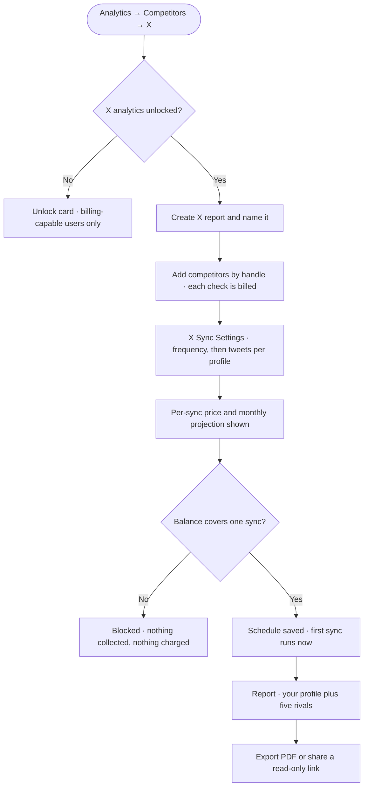
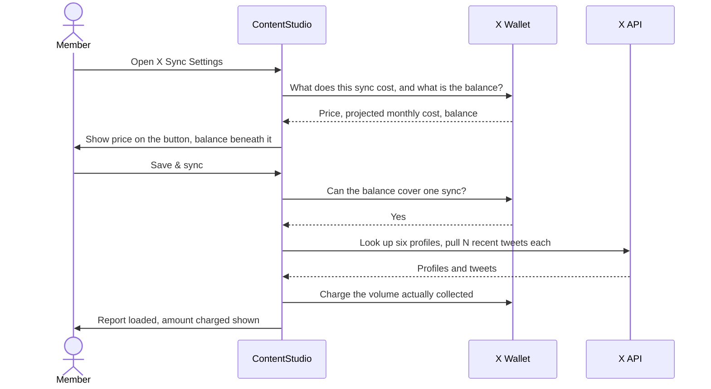
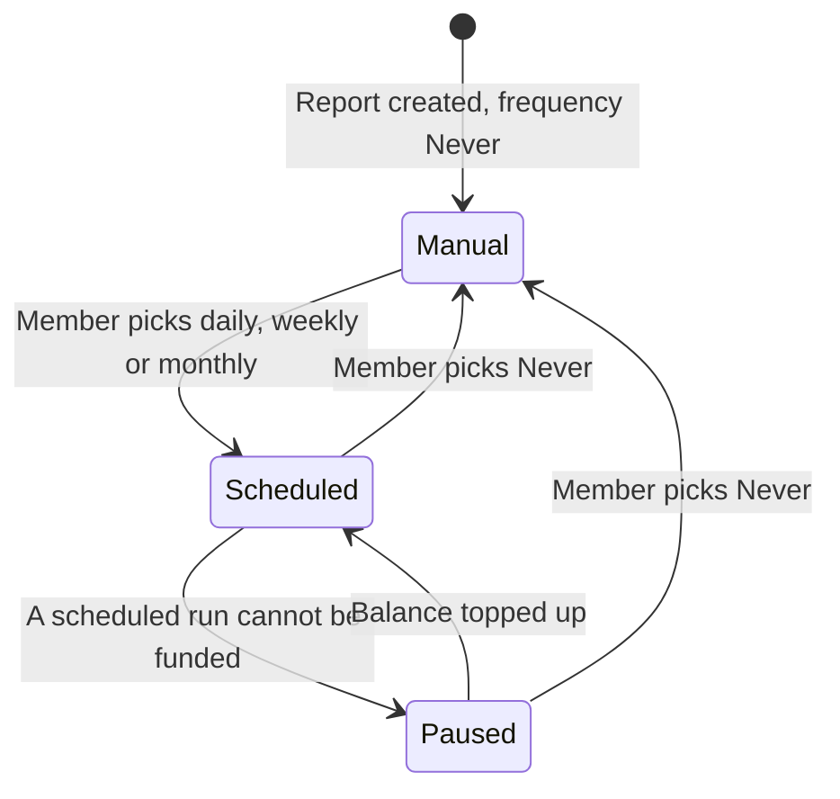

# 02 — Workflow Design: X (Twitter) Competitor Analytics

**Feature slug:** `x-competitor-analytics`
**Date:** 2026-08-21
**Status:** Backfilled after the epic and stories were written, so this documents the flow as it was actually scoped — including the decision to copy the X analytics sync-schedule modal.

---

## 1. Feature Placement

X competitor analytics is a **third platform inside an existing module**, not a new destination. Nothing new appears in the left navigation.

| Level | Where |
|---|---|
| Module | **Analytics → Competitors** |
| Entry point | A platform switcher above the reports list: **Facebook · Instagram · X** |
| Reports list | Report tiles for the selected platform, plus a **Create X report** action |
| Report screen | A per-platform report screen, sibling to the Facebook and Instagram ones |
| Sync settings | **X Sync Settings** modal, opened from the report screen or straight after creating a report |
| Spending gates | The existing competitor-analytics plan gate controls access; the existing X analytics unlock controls spending |
| Money | The existing X wallet, or the legacy X posting-credit allowance — no new balance |

**Two gates, deliberately different jobs.** The plan gate answers *"can this workspace see competitor analytics at all?"* and already exists for Facebook and Instagram. The X analytics unlock answers *"is this workspace set up to spend on X data?"* and already exists for X platform analytics. A workspace that passes the first but not the second can open the X tab and read the empty state, but cannot create a report.

---

## 2. Workflow Diagram (Overview)

### 2.1 The metered sync, as a multi-system exchange

### 2.2 The schedule lifecycle

---

## 3. User Flow (happy path)

1. Member opens **Analytics → Competitors** and selects **X** in the platform switcher.
2. With no X reports yet, they see the X empty state, which states up front what a full report costs to sync.
3. They click **Create X report**, and the **Add competitors** modal opens with their own connected X profile already pinned at the top, labelled as theirs, not counted toward the five slots.
4. They name the report.
5. They type a competitor's exact handle and click **Verify**. The helper text has already told them a check costs money. ContentStudio confirms the account with X and adds it as a row showing name, handle and follower count.
6. They repeat up to five times. A running cost line above the footer updates as rows are added, and always names their own profile as part of what they will pay for.
7. They click **Create report**. The report is created empty, and the **X Sync Settings** modal opens over it — so the decision to spend is separate from the decision to build.
8. They pick a **Sync frequency**: Daily, Weekly, Monthly, or Never. Weekly reveals a weekday picker; Monthly reveals a day-of-month picker.
9. They pick **Tweets per profile**. The summary row, the per-sync price and the projected monthly cost all update together.
10. They confirm with **Save & sync — {price}**. The schedule is saved and the first sync starts immediately.
11. Progress shows per profile. They can close the modal and the report keeps showing progress.
12. The report loads and a toast tells them the amount actually charged.
13. They read the comparison, switch the selected profile in the per-profile sections, and open individual posts.
14. They export a PDF in the language they choose, or share a read-only link that never triggers a billed sync.

---

## 4. Alternative and edge flows

| Situation | What happens |
|---|---|
| **Handle not found** | Inline message naming the handle. No row added. Charged only if X charged us for the lookup. |
| **Protected account** | Rejected with an explanation that X only shares data for public profiles. **The customer is still charged**, because X returned the profile — the one error state that costs money. |
| **Suspended account** | Rejected with an explanation. No row added. |
| **Handle already in the report** | Rejected without contacting X, so nothing is spent. |
| **Five competitors already added** | Handle field and Verify both disabled, with a message to remove one first. |
| **Balance too low to verify a handle** | Verify disabled, funding message replaces the helper text. |
| **Balance too low to sync** | Confirm disabled, warning band with a funding action. Nothing collected, nothing charged, previous report data kept. |
| **Member cannot see billing** | Every shortfall message tells them to ask an admin. No funding action offered. |
| **Spend cap reached** | Distinct message from insufficient balance, naming the reset date. |
| **Some profiles fail mid-sync** | Report still loads. Failed profiles are flagged in place. Only collected profiles are charged. |
| **Sync fails entirely** | Nothing charged. Report keeps its previous data. Retry offered. |
| **Scheduled run cannot be funded** | Run skipped, schedule paused, member notified. Resumes on its own once funded. |
| **Competitor becomes protected or suspended after being added** | Flagged on their row and tile. Historical data stays visible. The rest of the report is unaffected. |
| **Competitor changes handle** | Kept by permanent account ID, displayed with the new handle, noted as previously something else. |
| **Posts published before impressions existed** | Rendered as a dash, never a zero, and excluded from impression averages. |
| **Report never synced** | Report screen shows a prompt to sync rather than empty charts, and no section requests data. |
| **Shared read-only link opened** | Full report renders unauthenticated with no sync control, no price and no balance anywhere. Never triggers a sync. |
| **Date range predates the first sync** | Shows the data that exists, plus the date tracking began. |

---

## 5. Key Design Decisions

### 5.1 Sync model

| Option | Consequence |
|---|---|
| Always-on daily cron, like Facebook and Instagram | ~$35/month per report at 30 tweets. Unshippable — often more than the customer's subscription. |
| On-demand only, no scheduling | Cheapest to build and safest, but every refresh needs a human, and the report goes stale between visits. |
| **Schedule picker with a Never option** ✅ | One control covers both models. Copies the X analytics sync-schedule modal, so the pattern is already familiar and already built once. Costs the auto-pause path. |

**Recommendation: the schedule picker.** It is what the PO chose, and the deciding argument is that the X analytics modal already solves this exact problem — frequency, conditional day field, count dropdown — so copying it is cheaper than inventing an on-demand-only variant, and it gives the customer the fine-grained spend control that a binary manual/automatic choice does not.

### 5.2 Adding competitors

| Option | Consequence |
|---|---|
| Typeahead search, like Facebook page search | **Not buildable.** X API v2 has no user-search endpoint — only exact lookup by handle or ID. Even if it existed, it would bill a lookup per keystroke. |
| **Exact handle entry with an explicit Verify action** ✅ | One billed lookup per deliberate action, and the customer knows before they click. |

**Recommendation: exact handle entry.** This is not a cost optimisation, it is the only option. Worth stating loudly because the Facebook flow uses free page search and everyone will expect parity.

### 5.3 Who pays for handle checks

| Option | Consequence |
|---|---|
| ContentStudio absorbs them | Negligible cost to us, no micro-charge for a typo, and the mock-up's "checking a handle is free" copy becomes true. Needs an abuse guard. |
| **The customer pays** ✅ | Consistent with every other X cost. Requires a second balance gate on the Add competitors modal and its own ledger entry. |

**Decision: the customer pays.** Locked by the PO. The consequence to design around is that a *protected* account is a billed failure — X returns the profile, so we are charged to discover the account cannot be tracked.

### 5.4 The workspace's own profile lookup

| Option | Consequence |
|---|---|
| Read it fresh on every sync | Simple, and every sync of the same shape costs the same. Buys the same profile twice within minutes of report creation. |
| **Reuse a snapshot under 15 minutes old** ✅ | Saves five profile lookups on a first sync. Makes a first sync cheaper than later ones, which the live cost preview handles correctly. |

**Recommendation: reuse.** Charging twice for the same read minutes apart is indefensible once a customer notices. Still open for the PO to overrule in favour of flat pricing.

### 5.5 Default tweets per profile

| Option | Cost of one full sync | Against a Standard plan's 45 credits/month |
|---|---|---|
| 10 | $0.43 / 22 credits | Two syncs affordable |
| **20** ✅ | $0.79 / 40 credits | One sync, most of the allowance |
| 30 (as shown in the mock-up) | $1.15 / 58 credits | **Exceeds the whole allowance** |

**Recommendation: 20.** The mock-up shows 30 selected, but a default that a whole plan tier cannot afford once is the wrong default.

### 5.6 The missing reaction widget

Facebook competitor reports have a **Post Reactions Distribution** chart. X has no reaction types at all, so there is no equivalent. Options were to omit the slot entirely, or fill it with the closest honest analog. **Recommendation: an engagement-type split** — likes, reposts, replies, quotes and bookmarks as a stacked bar — occupying the same position in the layout so the report does not read as missing a section.

---

## 6. Integration with existing features

| Feature | How this connects |
|---|---|
| **Competitor analytics (Facebook, Instagram)** | Shares the reports list, empty state, Add Competitor modal, report-screen layout, export modal and share-link machinery. X is a third value in the platform config, not a parallel module. |
| **Competitor Analytics Revamp** | X should be built on the revamped components, so this epic starts after that one lands. |
| **X platform analytics** | Shares the API surface, the sync-schedule modal pattern, the count dropdown, the cohort currency rule and the unlock gate. The workspace's own profile appears in both, so engagement must be computed identically or the same profile will disagree between the two reports. |
| **X wallet / legacy X credits** | Reuses balance, atomic deduction, usage ledger, pricing config, top-up and the permission model. Adds two consumption types and no new billing concepts. |
| **Billing and permissions** | Funding actions are gated on the existing see-billing permission. |
| **PDF report generator** | Adds one report type and its section list. The export modal is shared with platform analytics, so that must not regress. |
| **Public share links** | An X report must render unauthenticated and must never trigger a billed sync. |
| **AI insights** | Inherited from the Facebook and Instagram competitor reports, with X vocabulary — reposts, not shares, and never reactions. |

---

## 7. Trackable Actions (Usermaven candidates)

| Candidate event | Trigger | Why it earns tracking |
|---|---|---|
| `x_competitor_handle_checked` | A handle check completes, whatever the outcome (FE) | The customer pays for these, so the share that end in not-found or protected is a spend-waste metric, not a vanity one |
| `x_competitor_report_created` | A new X competitor report is saved (FE) | Adoption, and whether people fill all five slots |
| `x_competitor_sync_charged` | A sync successfully deducts from the balance (BE) | Sync volume, spend, and the wallet-versus-credits split |
| `x_competitor_sync_blocked_insufficient_balance` | A sync is attempted with too low a balance (FE) | Friction, and the top-up conversion trigger |
| `x_competitor_schedule_saved` | A frequency other than the current one is saved (FE) | Whether anyone schedules at all, and how aggressively |
| `x_competitor_schedule_paused_insufficient_balance` | A scheduled run is skipped and its schedule paused (BE) | Whether scheduling is quietly failing for the credit cohort |

**Not tracked:** opening a report, changing the date range, switching the selected profile in a chart, sorting a table, opening the export modal. All read-only navigation. Report export reuses the existing `analytics_report_sections_customized` event with the X competitor platform value rather than adding a new one.

---

## 8. Scope Recommendation

**v1**
- X as a platform in competitor analytics: report create, edit, delete, five-competitor cap against the workspace's own profile
- Add competitors by exact handle, with all six outcome states, metered
- X Sync Settings modal: frequency with a Never option, conditional day pickers, tweets per profile, live per-sync price and monthly projection, balance gate, three cohort states
- Scheduled runs with auto-pause when unfunded and automatic resume
- Report screen at Facebook parity minus reaction distribution, plus impressions and bookmarks
- Two X-only additions: an impressions comparison and an engagement-type split
- PDF export with an X competitor section list, and read-only share links
- AI insights on the X report

**v2**
- Competitor spike alerting
- Share of voice and mention volume, which need the search endpoints and net-new spend
- Best-time-to-post heatmap
- An average-of-tracked-profiles benchmark row
- One report spanning Facebook, Instagram and X together

**Out**
- Follower demographics, sentiment, ad detection
- Any historical backfill before a report's first sync — X does not sell it at any price
