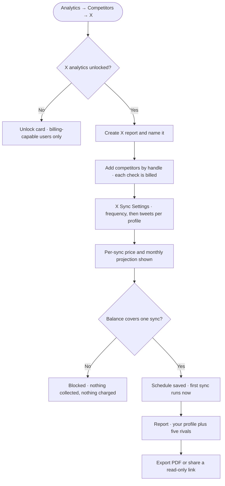

# PRD: X (Twitter) Competitor Analytics

**Author:** Product (pipeline-generated, PO-reviewed)
**Last Updated:** 2026-08-21
**Status:** In Review
**Target Release:** Q4 2026, after the X wallet, X analytics metering, and competitor analytics revamp epics

---

## 1. Overview

Competitor analytics lets a workspace compare up to five rival profiles against its own connected profile — followers, posting activity, engagement, hashtags, bios, and best and worst posts, side by side. It supports Facebook and Instagram today. This feature adds **X** as a third platform in the same module, with the same five-competitor cap and the same report shape: a full report is six profiles, the workspace's own plus five rivals.

The report looks familiar; the economics do not. Meta gives us competitor data free, so a daily cron refreshes every report for everyone. X charges per profile looked up and per post read, so the same always-on refresh would cost about **$35 a month per report** — frequently more than the customer's entire subscription. X competitor analytics is therefore **metered and customer-scheduled**: the customer picks how often the report refreshes and how many recent tweets to pull per profile, sees the price before committing, and is charged to the same X wallet or X credit allowance that X publishing and X platform analytics already use. In exchange, X gives us two things Meta never will — **competitor impressions and bookmarks**.

---

## 2. Problem Statement

**What problem are we solving?**

A workspace that competes on X has no way to benchmark itself inside ContentStudio. It can see its own X analytics, and it can benchmark competitors on Facebook and Instagram, but the moment its category lives on X — SaaS, media, crypto, politics, developer tools — the Competitors module is empty for the network that matters most to it. The workaround is a second subscription to Rival IQ or Sprout at $239–249/month, or manual spreadsheet tracking.

We also have a narrower, self-inflicted version of the problem: we are **already building X platform analytics on a metered pay-per-use model**. Once a customer is paying per read for their own X data, the absence of the competitor view makes the metering look like a tax rather than a capability.

**Who has this problem?**

- Workspaces with a connected X account — the addressable set for this feature.
- Agencies in particular, who benchmark on behalf of clients and are asked for competitive context in every monthly report. They are also the cohort most likely to hold several reports at once, and therefore the cohort most exposed to runaway spend.
- Marketers in categories where X is the primary channel and Facebook engagement is effectively dead.

**What happens if we don't solve it?**

- **Competitive disadvantage in a category where everybody else ships it.** Rival IQ, Sprout Social, Hootsuite and Brandwatch all support X competitor tracking. It reads as a table-stakes gap, not a missing nice-to-have.
- **The X metering story stays incomplete.** We are asking customers to accept per-read billing for X analytics without giving them the feature that most justifies paying for X data.
- **Churn risk at renewal for X-primary workspaces**, who need a second tool anyway and may consolidate on the one that does both.
- **No new support burden if we skip it** — this is a pure opportunity cost, which is why it sits behind the wallet and metering epics rather than in front of them.

---

## 3. Goals & Success Metrics

| Goal | Metric | Target | How we'll measure |
|---|---|---|---|
| **Primary** — X-competing workspaces adopt the feature | Workspaces with ≥1 X competitor report, among those with a connected X account | **12%** within 90 days of release | `x_competitor_report_created` |
| **Primary** — reports get used, not abandoned after one look | Share of X competitor reports with ≥2 syncs in their first 30 days | **60%** | `x_competitor_sync_charged` |
| **Secondary** — the spend model is genuinely affordable | Median monthly X competitor spend per active report | **under $5** | X usage ledger, filtered to competitor consumption types |
| **Secondary** — scheduling is actually used, so reports stay fresh | Share of reports with a frequency other than Never | **50%** | `x_competitor_schedule_saved` |
| **Guard rail** — nobody is surprise-billed | Support conversations mentioning an unexpected X charge | **0** in the first 60 days | Intercom tagging |
| **Guard rail** — paid handle checks aren't wasted | Share of handle checks ending not-found, protected or suspended | **under 15%** | `x_competitor_handle_checked`, split by `result` |
| **Guard rail** — scheduling doesn't fail silently for credit accounts | Share of schedules paused for insufficient balance in any 30-day window | **under 20%** | `x_competitor_schedule_paused_insufficient_balance` |
| **Guard rail** — we don't exhaust our shared platform read cap | Share of the monthly X post-read cap consumed by competitor syncs | **under 25%** | Ops monitoring on the platform-level guard |

The two guard rails on handle checks and paused schedules exist because this feature charges the customer for a failure mode. If either drifts, the pricing model is wrong, not the funnel.

### 3.1 Analytics Events (Usermaven)

Six new events. Report export reuses the existing `analytics_report_sections_customized` event with the X competitor platform value rather than adding a new one. Search `contentstudio-frontend/src/` for `userMaven.track(` before implementing to confirm none of these names already exist.

| Event Name | Trigger | Payload | What we measure with it |
|---|---|---|---|
| `x_competitor_handle_checked` | A handle check completes, whatever the outcome (FE) | `{ result: 'verified' \| 'not_found' \| 'protected' \| 'suspended' }` | How often a paid check is wasted on a typo or an untrackable account |
| `x_competitor_report_created` | Member saves a new X competitor report (FE) | `{ competitor_count }` | Adoption, and whether people fill all five slots |
| `x_competitor_sync_charged` | A successful sync deducts from the wallet or credit balance (BE, on fetch completion) | `{ amount, unit: 'usd' \| 'credits', profile_count, tweets_per_profile }` | Sync volume, spend, and currency split |
| `x_competitor_sync_blocked_insufficient_balance` | A sync is attempted with too low a balance (FE) | `{ unit: 'usd' \| 'credits' }` | Friction, and top-up conversion trigger |
| `x_competitor_schedule_saved` | Member saves a sync frequency other than the one already set (FE) | `{ frequency: 'daily' \| 'weekly' \| 'monthly' \| 'never', tweets_per_profile }` | Whether people schedule at all, and how aggressively |
| `x_competitor_schedule_paused_insufficient_balance` | A scheduled run is skipped and its schedule paused (BE) | `{ unit: 'usd' \| 'credits' }` | Scheduled-spend friction, and resume behaviour |

These are the spec of record. Story-level acceptance criteria must match them exactly; if one has to change, change both.

---

## 4. Target Users

**Primary persona — the X-primary marketer.**
Runs social for a brand whose audience genuinely lives on X: SaaS, developer tools, media, finance, politics. Already connected their X account and already looks at its analytics. Comfortable with the idea that X data costs money, because they have seen the API pricing news, but has no tolerance for being billed without being told first. Wants to know whether their engagement rate is normal for their category and what their rivals are posting that works.

**Secondary persona — the agency account manager.**
Manages several client workspaces and is asked for competitive context in every monthly report. Values the PDF export and the shareable read-only link more than the dashboard itself. Most likely to hold multiple reports and to hit spend caps, and least likely to be the person who can top up a balance — so every shortfall message must tell them who to ask.

**Secondary persona — the billing-capable admin.**
Does not read competitor reports. Unlocks X analytics, funds the wallet, and wants a defensible line-item answer to "what did we spend on X last month". Served by the itemised usage ledger, not by the report.

**Non-users, explicitly out of scope:**
- Workspaces without a connected X account — nothing here applies to them.
- Mobile app and Chrome extension users. Competitor analytics is web-only, and the load-bearing parts of this experience are the cost preview and the balance gate, which would need their own mobile design pass.
- Anyone wanting competitor *listening* — mentions, share of voice, sentiment. That needs the X search endpoints and net-new spend.
- Legacy X-credit accounts are **not** excluded, but they are served with clear eyes: one full sync at the default costs about 40 of a Standard plan's 45 monthly credits.

---

## 5. User Stories / Jobs to Be Done

| ID | As a... | I want to... | So that... | Priority |
|---|---|---|---|---|
| US-1 | X-primary marketer | add up to five rival X profiles to a report by their handle | I can compare them against my own profile in one view | Must Have |
| US-2 | X-primary marketer | see what a sync will cost before it runs | I never discover a charge after the fact | Must Have |
| US-3 | X-primary marketer | choose how often the report refreshes | I control the spend instead of paying for data I won't look at | Must Have |
| US-4 | X-primary marketer | compare followers, engagement rate, impressions and posting activity side by side | I can tell whether my numbers are normal for my category | Must Have |
| US-5 | X-primary marketer | see my rivals' best and worst performing posts | I can work out what to copy and what to avoid | Must Have |
| US-6 | Agency account manager | export the report as a PDF in my client's language | I can put it in a monthly deck without rebuilding it | Should Have |
| US-7 | Agency account manager | share a read-only link to the report | a client can look without a ContentStudio login, and without spending my balance | Should Have |
| US-8 | Billing-capable admin | see competitor spend itemised separately from X publishing and X analytics | I can answer what we spent and why | Must Have |
| US-9 | Team member without billing access | be told who can fund the account when the balance is short | I'm not stuck at a dead end | Must Have |
| US-10 | X-primary marketer | be told when a scheduled sync was skipped for lack of funds | I don't trust a stale report as current | Must Have |
| US-11 | X-primary marketer | know that a rival went private or got suspended | I understand why their numbers stopped moving | Should Have |
| US-12 | X-primary marketer | see how impressions compare, not just followers | I can judge reach rather than audience size | Should Have |

---

## 6. Requirements

### 6.1 Must Have (P0)

- X appears as a third platform in Analytics → Competitors, with its own reports list, empty state and report screen.
- Report create, edit and delete, capped at five competitors, always compared against the workspace's own connected X profile, which is added automatically and does not consume a slot.
- Competitors are added by **exact handle** with an explicit verify action. No typeahead search — the X API has no user-search endpoint.
- All six handle-check outcomes are handled distinctly: verified, not found, protected, suspended, already added, limit reached.
- Every handle check is metered and charged, with its own balance gate on the Add competitors modal.
- **X Sync Settings** modal copying the X analytics sync-schedule modal: sync frequency first (Daily, Weekly, Monthly, Never), a weekday picker when weekly, a day-of-month picker when monthly, then tweets per profile (10–150, default 20).
- Live per-sync price and, for any frequency other than Never, a projected monthly cost. Both update as the controls change.
- The summary always counts every profile including the workspace's own — six for a full report.
- Balance gate: an unaffordable sync is refused outright. Never a partial sync.
- Charging happens on success, on the volume actually collected, atomically and idempotently.
- Scheduled runs, with skip-and-pause when unfunded and automatic resume once funded.
- Dual-currency handling throughout: dollars for wallet accounts, X credits for legacy accounts, never both on one screen.
- Report screen at Facebook parity minus reaction distribution: overview tiles, performance scatter, comparative table, followers vs net change, posting activity by post type, post-type grid, per-type activity tables, most engaged hashtags, post engagement, engagement over time, top and least performing posts, bio analysis, AI insights.
- Two X-only widgets: **impressions comparison** and **engagement type split** (likes, reposts, replies, quotes, bookmarks) in the slot Facebook uses for reactions.
- Per-competitor problem states — protected, suspended, deleted, renamed — that never break the rest of the report.
- Follower growth measured from the first sync forward, stated plainly in the UI.
- Read-only share links that render the full report unauthenticated and never trigger a billed sync.
- Spend guards: a configurable per-workspace monthly cap, plus a platform-level guard on our shared X read allowance.
- Itemised usage-ledger entries distinguishing handle checks from syncs, and scheduled runs from manual ones.

### 6.2 Should Have (P1)

- PDF export with an X competitor section list and the eight-language selector.
- Engagement rate switchable between by-followers and by-impressions.
- Reuse of a profile snapshot under 15 minutes old, so a first sync does not re-buy profiles just verified.
- Top and least performing posts selectable per profile, defaulting to the first profile in the report.
- Hashtag drill-down showing a single tag broken out by profile.

### 6.3 Nice to Have (P2)

- A hint under a blocked state suggesting a smaller tweet count to bring the cost down.
- Reconciliation messaging when the amount charged differs from the quote.
- Per-profile sync progress rather than a single spinner.

### 6.4 Explicitly Out of Scope

- **Any mobile or Chrome extension surface.** Web only.
- **Share of voice, mentions, sentiment.** Needs the X search endpoints: recent search covers seven days, full-archive is Enterprise at $42k+/month. Net-new API surface and net-new spend.
- **Competitor demographics** — age, gender, country, interests. X exposes none of it for any account, including your own.
- **Competitor impressions beyond `impression_count`, profile clicks, link clicks, video completion funnels.** Owner-only, last 30 days only.
- **Reaction-type breakdown.** X has no reactions.
- **Historical backfill before a report's first sync.** X returns a current follower count only, and sells no history at any price.
- **Ads and promoted post detection.** Not in the public API.
- **Posts older than roughly the most recent 3,200 per profile.** Hard timeline ceiling.
- **Protected and private accounts.** Rejected at add time.
- **Competitor spike alerting.** Deferred to v2.
- **A cross-network competitor report** spanning Facebook, Instagram and X together. Deferred to v2.

---

## 7. User Flow (High Level)

1. Member opens **Analytics → Competitors** and selects **X**.
2. They click **Create X report**, name it, and add up to five competitors by exact handle — each verification billed, with the price stated before they click.
3. The report is created empty and **X Sync Settings** opens over it.
4. They choose a sync frequency and a tweets-per-profile count, watching the per-sync price and projected monthly cost update together.
5. They confirm. The schedule is saved and the first sync runs immediately.
6. The report loads and they are told what was actually charged.
7. They read the comparison, export a PDF, or share a read-only link.
8. The report refreshes on its schedule, pausing and notifying them if funds run out.

The sequence diagram for the metered sync and the state diagram for the schedule lifecycle are in `02-workflow.md` sections 2.1 and 2.2.

---

## 8. Business Rules & Constraints

| Rule ID | Rule | Rationale |
|---|---|---|
| BR-1 | A report holds at most 5 competitors, always compared against the workspace's own X profile, which is added automatically and never occupies a slot | Matches Facebook and Instagram exactly; a full report is 6 billed profiles |
| BR-2 | Competitors are added by exact handle. No search-as-you-type, ever | The X API has no user-search endpoint, and a per-keystroke lookup would bill per keystroke |
| BR-3 | Every handle check that returns a profile is charged — **$0.012, or 1 X credit** — including when that profile turns out to be protected | X bills per resource returned; a protected account still returns a profile |
| BR-4 | A handle already in the report is rejected without contacting X, and is never charged | No spend for a mistake we can detect locally |
| BR-5 | A handle check that returns no account is charged only if X charges us for it | Must be confirmed in our developer portal before release |
| BR-6 | Competitors are stored by permanent X account ID; handles are display-only and re-resolved on every sync | X handles are mutable, account IDs are not |
| BR-7 | Prices come from the pricing configuration, never hardcoded | A rate change must not need a release |
| BR-8 | Costs are quoted before any spend, and always in the account's own currency | No surprise billing, and no mixed currencies |
| BR-9 | An account sees exactly one currency. `$` and `credits` never appear on the same screen | The two cohorts are billed on different models |
| BR-10 | Never expose X's raw per-read cost or our markup. Show only the price the customer pays | Inherited from the X analytics metering epic |
| BR-11 | A sync is charged on success only, for the volume actually collected, atomically and idempotently | A retried or duplicated request charges once |
| BR-12 | An unaffordable sync is refused entirely. Never partially collected to fit the balance | A half-report the customer paid for is worse than no report |
| BR-13 | When some profiles in a sync fail, only the successfully collected profiles are charged | Pay for what arrived |
| BR-14 | Replies are excluded from collected tweets; original posts, reposts and quote posts are included | Cost is unchanged either way, but replies would crowd out real posts for chatty accounts |
| BR-15 | Total engagement is likes + reposts + replies + quotes + bookmarks, identical to X platform analytics | The workspace's own profile appears in both reports and must not disagree |
| BR-16 | Follower change is derived only from snapshots taken since the report's first sync. No backfill is implied or attempted | X returns a current count only |
| BR-17 | A profile snapshot under 15 minutes old is reused rather than re-collected | Never buy the same read twice within minutes |
| BR-18 | Opening, filtering, sorting, exporting or sharing a report never collects new data and never charges | Only an explicit or scheduled sync spends money |
| BR-19 | A shared read-only link never triggers a sync, however stale the report | An anonymous viewer must not be able to spend the owner's balance |
| BR-20 | A scheduled run that cannot be funded is skipped and its schedule paused, not retried indefinitely, and resumes automatically once funded | Protects the balance without making the customer rebuild the schedule |
| BR-21 | Spending requires the same X analytics unlock that X platform analytics requires; access to the module is governed by the existing competitor plan gate | Two gates, two distinct jobs, no third gate invented |
| BR-22 | Only users permitted to see billing may trigger a top-up; everyone else is told who to ask | Existing permission model |
| BR-23 | A configurable per-workspace monthly spend cap applies, and competitor activity counts toward the platform-level guard on our shared X allowance | Protects both the customer and our shared read ceiling |
| BR-24 | Posts with no impressions figure render as a dash, never a zero, and are excluded from impression averages | `impression_count` is absent for posts before December 2022 |

---

## 9. Open Questions

| Question | Options | Owner | Due | Decision |
|---|---|---|---|---|
| Does a sync reuse a just-verified profile, or re-read it? | Reuse within 15 min / always re-read for flat pricing | PO | Before BE work starts | **Assumed: reuse.** Stories are written this way |
| How is a sub-cent price displayed? | `$0.012` / round to `$0.01` and absorb the difference / show only a running total | PO + Design | Before FE copy is finalised | Pending — stories currently say `$0.012` |
| Does the projected monthly cost gate the schedule, or only inform? | Inform only / block a frequency the balance can't sustain | PO | Before FE work starts | **Assumed: inform only.** Gating would block most credit accounts from Daily |
| Does X charge for a lookup that returns no account? | Charged / not charged | Engineering | Before release | Pending — must be confirmed in the developer portal |
| What is the default per-workspace monthly spend cap? | A dollar figure, or off by default | PO + Finance | Before release | Pending |
| Build after the competitor revamp and X analytics metering, or in parallel? | Sequential / parallel | PO + Eng lead | Before sprint planning | **Assumed: sequential.** X opens the third-platform seams |
| Do we surface competitor impressions prominently? | Prominent / de-emphasised | PO | Locked | **Decided: prominent**, accepting "why not for Facebook?" questions |

---

## 10. Risks & Mitigations

| Risk | Likelihood | Impact | Mitigation |
|---|---|---|---|
| **Legacy credit accounts cannot afford the feature.** One full sync at the default is ~40 of a Standard plan's 45 monthly credits, and creating a five-competitor report plus one sync is ~45 — the entire allowance | **High** | High | Default of 20 rather than 30; a smaller-count hint on blocked states; explicit copy that the allowance is shared with X publishing; the paused-schedule path treated as a normal state, not an edge case |
| **Scheduled spend surprises someone.** A daily schedule at the default projects ~$23.70/month per report, and an agency with three reports sees triple | Medium | High | Projected monthly cost shown at the moment the frequency is chosen; per-workspace spend cap; itemised ledger; auto-pause rather than silent overspend |
| **The design deck contradicts the pricing model.** The existing mock-up states that checking a handle is free, and its sync mock undercounts profiles and misprices the sync | **Certain — already true** | Medium | The `[Design]` story carries an explicit review-and-correction pass over the deck before engineering builds from it |
| **We exhaust our shared X read allowance.** The monthly post-read cap is per app, shared with X publishing and X platform analytics | Medium | High | Platform-level guard, monitoring alarm at a configured threshold, and a spending limit in our developer portal |
| **Two stacked gates confuse users.** A workspace can pass the competitor plan gate but not the X analytics unlock | Medium | Low | Each gate has distinct copy and a distinct action; the empty state is readable before unlocking |
| **A protected account is a billed failure.** The customer pays to learn an account cannot be tracked | Medium | Medium | Copy that names the reason plainly; an info tooltip warning to check spelling before verifying; tracked via `x_competitor_handle_checked` so the rate is visible |
| **Competitors rename or go private**, breaking a report mid-life | Medium | Low | Stored by permanent account ID; per-profile problem states preserve historical data without breaking the report |
| **The same profile disagrees between the X platform report and the X competitor report** | Medium | Medium | BR-15 pins the engagement formula to the existing platform-analytics definition |
| **Impressions are absent for older posts**, producing misleading zeros | High | Low | BR-24: render a dash, exclude from averages, and say why in the UI |
| **X changes its pay-per-use rates**, invalidating every quoted figure | Medium | Medium | BR-7: all rates config-driven, no release needed; illustrative prices in stories are labelled as expected test values, not constants |

---

## 11. Dependencies

**Internal — hard**
- **X (Twitter) Pay-Per-Use Credit Wallet** epic: balance, atomic deduction, usage ledger, pricing config (`config/x_pay_per_use.php`), top-up flow, and the permission model. Must ship first.
- **X (Twitter) Analytics Pay-Per-Use Metering** epic: the `post_read` and `user_read` rates in the pricing config, the cost-preview and wallet-gate components, the cohort currency rule from `WalletService::isEnabledForUser`, and the unlock pattern. Competitor analytics is the **second consumer** of all of it — the goal is to add zero new billing concepts.

**Internal — soft, but strongly advised**
- **Competitor Analytics Revamp (Facebook + Instagram)**: the revamped empty state, Add Competitor modal, report screen and export modal. Building X on the pre-revamp components would mean rebuilding it.
- **X platform analytics**, which is the reference implementation for the sync-schedule modal (`TwitterJobSettingsModal.vue` — frequency, weekday and day-of-month controls, and the tweet-count option list `[10, 20, 30, 50, 80, 100, 120, 150]`) and for the count-based sync pattern (`SyncDateRangeModal.vue` in `mode="twitter"`).

**Codebase integration points**
- Frontend: `src/modules/analytics/composables/competitor/constants.ts` (`PLATFORMS`, endpoint maps), `views/competitor/{facebook,instagram}/` report screens, `components/competitor/ManageCompetitorsModal.vue` (the 5-competitor cap and the `platform === 'instagram'` branches), `utils/reportSections.ts` (export section lists).
- Laravel: `app/Http/Controllers/Analytics/Analyze/{Facebook,Instagram}CompetitorController.php` and matching builders and repos; `CompetitorsRepo::addUpdateCompetitor` upserts by `competitor_id` + `platform_type`; routes in `routes/web/analytics.php`.
- Go: `src/models/db/mongo/competitors.go` already carries `platform_type`, so storage generalises with no schema change; `src/cmd/competitor-jobs/main.go` takes `-socialNetwork`; `src/clients/social/twitter.go` supplies auth and pagination for a new `x_competitor.go`; `src/services/reports/catalog/competitor.go` is the widget source of truth.

**External**
- X API v2 pay-per-use rates and the monthly post-read cap, both subject to change by X.
- A spending limit configured in our X developer portal.

**Blockers before work begins**
- Confirming whether X charges for a lookup that returns no account (BR-5).
- The design deck correction pass, since the current deck states that handle checks are free.

---

## 12. Appendix

- **Research:** `01-research.md` — X API deep dive, pricing arithmetic, codebase analysis, widget parity table.
- **Workflow:** `02-workflow.md` — feature placement, overview flowchart, metered-sync sequence diagram, schedule state diagram, key design decisions with options and rationale.
- **Epic and stories:** `04-epic-and-stories.md` — the eight stories, the PO-locked decision table, the full widget set, and all UI copy.
- **Design inputs:** `design-prompt.md`, `design-prompt-followup.md`, and the X Sync Settings mock-ups (`xsync.png`, `image.png`). Note the deck's known errors, recorded in section 10.
- **Epic infographic:** `epic-infographic.html` — the cost model at a glance, for the epic description.
- **Competitive analysis:** Rival IQ (~$239/mo), Sprout Social (~$249/seat/mo), Hootsuite (~$99/mo), Brandwatch (enterprise). All ship X competitor tracking; none exposes competitor impressions or bookmarks, because both are new capabilities of the paid API tier.
- **Key external sources:** X API pricing and metrics documentation, verified July 2026. Rates used throughout: **$0.005 per post read, $0.010 per user read**, X bills per resource returned rather than per request.

---

## Changelog

| Date | Author | Changes |
|---|---|---|
| 2026-08-18 | Product | Research completed (`01-research.md`) |
| 2026-08-20 | Product | Epic and eight stories authored. PO locked: customer pays for handle checks; impressions prominent; built on revamped components |
| 2026-08-21 | Product | Sync model changed — the sync modal now copies the X analytics sync-schedule modal, so **scheduling is in v1** with Never as the manual option. Reversed the earlier on-demand-only decision. Added recurring-cost projection, auto-pause and resume, and two schedule events |
| 2026-08-21 | Product | Workflow doc and this PRD backfilled from the approved research and the as-scoped stories. Event payload key harmonised to `tweets_per_profile` |
