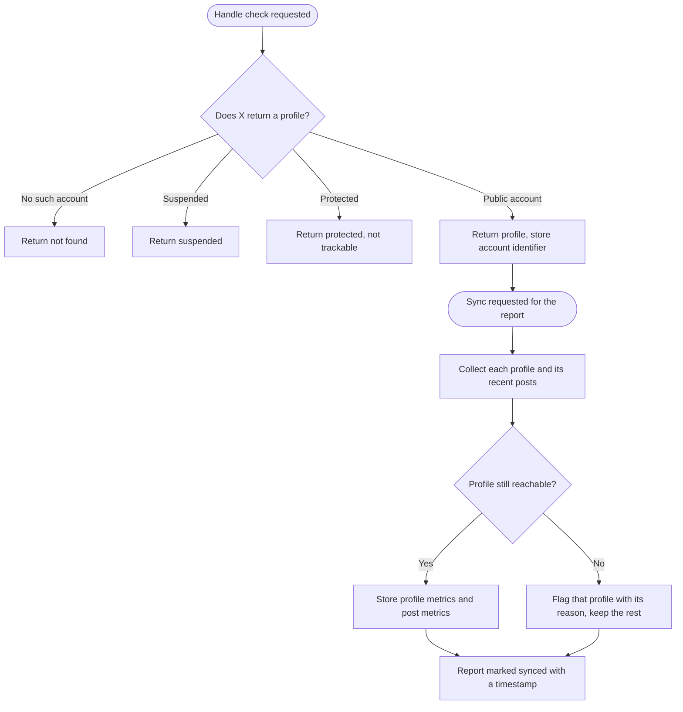
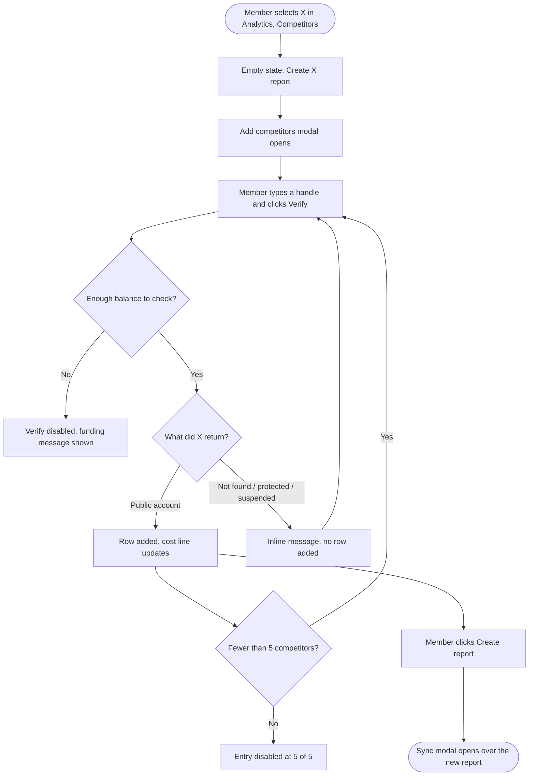
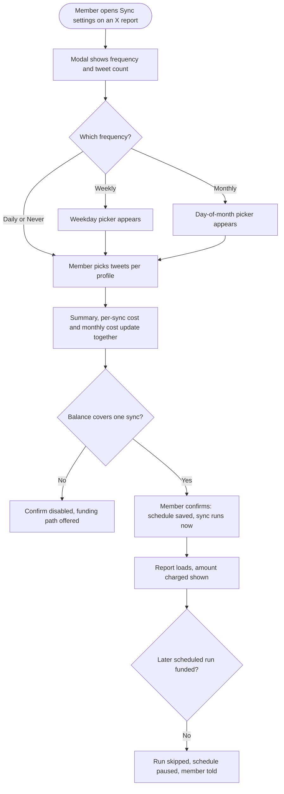

# 04 — Epic + Stories: X (Twitter) Competitor Analytics

**Feature slug:** `x-competitor-analytics`
**Pipeline:** `/feature` — Step 4 (Epic + Stories)
**Date:** 2026-08-20
**Depends on epics:** X (Twitter) Pay-Per-Use Credit Wallet → X (Twitter) Analytics Pay-Per-Use Metering → Competitor Analytics Revamp (Facebook + Instagram)

> These stories are documentation for the Product Owner to recreate in the tracker by hand. Nothing is pushed anywhere. Web only for v1 — no mobile stories. Never expose X's raw per-read cost or ContentStudio's markup in user-facing copy: show only the price the customer pays.

> **Dual-currency model (applies to every story).** The currency for an account is decided by the existing wallet gate. **Wallet accounts** pay in **dollars** from the X wallet. **Legacy accounts** holding the old X posting-credit add-on pay in **X credits** from their monthly allowance, at the verified rate 1 credit = $0.0166, cost-proportional and rounded up. An account only ever sees one currency: `$` and `credits` must never appear on the same screen.

---

## Epic

**Title:** X (Twitter) Competitor Analytics

**Description:**

Competitor analytics today lets a workspace compare up to 5 rival profiles against its own connected profile on Facebook or Instagram — followers, posting activity, engagement, hashtags, bios, and top and least performing posts, side by side. This epic adds **X as a third platform** in the same module, with the same 5-competitor cap and the same report shape: a full report is six profiles, the workspace's own plus five rivals.

The difference is the economics, and it drives every design decision here. Facebook and Instagram competitor data is free, so a daily cron refreshes it for everyone. X charges per profile looked up and per post read, so an always-on cron would cost roughly $35 a month per report — likely more than the customer's whole subscription. X competitor analytics is therefore **on demand and metered**: the customer chooses how many recent posts to include per profile, sees exactly what the sync will cost before confirming, and the cost is charged to the same X wallet or X credit allowance that X publishing and X platform analytics already use. Checking a handle to add a competitor is a paid profile lookup too, and it is charged the same way.

Data-wise X is richer than Meta: we can see a competitor's **impressions** and **bookmarks**, which Facebook and Instagram never expose. It is also poorer in one place — X has no reaction types, so Facebook's Post Reactions Distribution has no equivalent and is replaced by an engagement-type split. And X returns only a *current* follower count, so follower growth is measured from the first sync forward, with no backfill, ever. The report says so plainly rather than showing a misleading flat line.

The epic reuses the wallet's balance, atomic deduction, usage ledger, config-driven pricing, top-up flow, and permission model wholesale, and it is built on the revamped Facebook and Instagram competitor components rather than the pre-revamp ones. It adds only the X-specific pieces: handle verification, the X data pipeline, the X report screen and its two X-only widgets, the metered sync, and the X export section list.

---

## PO-locked decisions

These were decided at the research review gate and are treated as settled by the stories below.

| # | Decision | Consequence |
|---|---|---|
| **D1** | **The customer pays for handle checks.** Verification is not absorbed by ContentStudio. A single check costs **$0.012**, or **1 X credit** on a legacy credit plan. | The Add competitors modal needs its own cost line and its own balance gate, and the design deck's "Checking a handle is free" copy is wrong and must be corrected. |
| **D2** | **The sync modal is a copy of the existing X analytics sync-schedule modal** — sync frequency first, then the tweet count. Scheduling is therefore **in** v1, with **Never** as the manual-only option. | Brings recurring runs, a projected monthly cost, and the auto-pause-when-unfunded path into scope. Reverses the earlier on-demand-only decision. |
| **D3** | **Tweets per profile is a fixed dropdown** — 10, 20, 30, 50, 80, 100, 120, 150 — defaulting to **20**. | The option list is copied from the X analytics modal. No free-text field, which would invite an unpayable bill. The default stays 20 rather than the 30 shown in the mock-up, because 30 costs 58 credits against a Standard plan's 45 a month. |
| **D4** | **Replies are excluded from the fetch; original posts, reposts, and quote posts are included.** | Chatty accounts don't have their post sample flooded with one-word replies. Cost is unchanged either way, since we pay for the number of posts we ask for. |
| **D5** | **Impressions and bookmarks are shown prominently**, including two X-only widgets. | Accepted risk: invites "why can't I see this for my Facebook competitors?" |
| **D6** | **Legacy X-credit accounts get the feature**, with the credit-cohort copy throughout. | Creating a five-competitor report and syncing it once costs **5 credits for the handle checks plus about 40 for the sync — 45, exactly a Standard plan's entire monthly allowance**. The low-balance and blocked states are the common path, not the edge case. |
| **D7** | **Built on the revamped Facebook and Instagram competitor components**, not the pre-revamp ones. | This epic starts after the Competitor Analytics Revamp epic lands. |
| **D8** | **Access is governed by the existing competitor-analytics plan gate; spending is governed by the existing X analytics unlock.** | No third gate is invented. A workspace that can see Facebook competitors can see the X tab, but cannot spend until X analytics is unlocked. |

**Still open, and assumed as stated below until the PO says otherwise:** whether the sync reuses a just-verified profile instead of paying to read it twice within minutes. The stories assume **yes, within a 15-minute freshness window**, with the cost preview always computed from the reads the sync will actually perform. If the PO prefers flat, always-identical sync pricing, drop the reuse and every first sync costs about 5 credits more.

---

## What the report shows

The widget set the report screen and the PDF both render. Everything here comes from the two X endpoints already in use for X platform analytics — no new API surface.

| Widget | Metrics | X-specific note |
|---|---|---|
| Competitor tiles | Followers, engagement rate, impressions | Third stat is X-only |
| Performance comparison (scatter) | Engagement rate vs followers, sized by posts per week | — |
| Comparative table | Followers, change in followers, average posts per week and its change, total impressions, engagement rate by followers and its change, engagement rate by impressions, bookmarks, listed count | Last four columns are X-only |
| Followers vs net change | Total followers, net change over the range | Measured from first sync forward only |
| Posting activity by post type | Post count and engagement per type: text, image, video, GIF, poll, link, repost, quote | X type list |
| Post type insights grid | Per-type mini charts | — |
| Activity by competitors, per type | Posts, total engagement, average engagement rate per type | Instagram has these today; X gets them too |
| Most engaged hashtags | Tag, profiles using it, times used, engagement per post, engagement per follower, engagement rate by follower | — |
| Post engagement | Average engagement vs posts per week | Facebook has this, Instagram does not |
| Post engagement over time | Posts and engagement per day, per profile | — |
| **Impressions comparison** | Total and average impressions per post | **New, X only** |
| **Engagement type split** | Likes, reposts, replies, quotes, bookmarks as a stacked bar | **New, X only — replaces reaction distribution** |
| Top performing posts | 5 posts per profile with impressions, engagement, likes, reposts, replies, quotes, bookmarks | — |
| Least performing posts | Same fields | — |
| Bio analysis | Bio text and length, location, website, joined date, verified type, listed count, following count | Richer than Meta |
| AI insights | Inherited from the Facebook and Instagram reports | Needs X vocabulary: reposts, not shares |

**Deliberately absent, because X does not expose it for accounts we don't own:** follower history before tracking starts, audience demographics, profile and link clicks, video completion rates, reaction-type breakdown, anything about private accounts, posts older than roughly the most recent 3,200, mentions and share of voice, and ads.

---

## Analytics events (Usermaven)

New events for this feature. Search the frontend for existing `userMaven.track(` calls before implementing to confirm none of these names already exist. Report export reuses the existing `analytics_report_sections_customized` event with the X competitor platform value rather than adding a new one.

| Event Name | Trigger | Payload | What we measure |
|---|---|---|---|
| `x_competitor_handle_checked` | A handle check completes, whatever the outcome (FE) | `{ result: 'verified' \| 'not_found' \| 'protected' \| 'suspended' }` | How often a paid check is wasted on a typo or an untrackable account |
| `x_competitor_report_created` | User saves a new X competitor report (FE) | `{ competitor_count }` | Adoption, and whether people fill all 5 slots |
| `x_competitor_sync_charged` | A successful sync deducts from the wallet or credit balance (BE, on fetch completion) | `{ amount, unit: 'usd' \| 'credits', profile_count, tweets_per_profile }` | Sync volume, spend, and currency split |
| `x_competitor_sync_blocked_insufficient_balance` | A sync is attempted with too low a balance (FE) | `{ unit: 'usd' \| 'credits' }` | Friction, and top-up conversion trigger |
| `x_competitor_schedule_saved` | Member saves a sync frequency other than the one already set (FE) | `{ frequency: 'daily' \| 'weekly' \| 'monthly' \| 'never', tweets_per_profile }` | Whether people schedule at all, and how aggressively |
| `x_competitor_schedule_paused_insufficient_balance` | A scheduled run is skipped and its schedule paused (BE) | `{ unit: 'usd' \| 'credits' }` | Scheduled-spend friction, and resume behaviour |

---

## Stories

| # | Title | Type | Priority | Depends on |
|---|---|---|---|---|
| 1 | [Design] Design the X competitor analytics experience | Design | High (P0) | Revamp + metering epics |
| 2 | [BE] Build the X competitor data pipeline: verify handles, fetch profiles and posts, store metrics | Backend | High (P0) | X wallet epic |
| 3 | [BE] Meter X competitor handle checks and syncs against the X wallet | Backend | High (P0) | Data pipeline story + metering epic |
| 4 | [BE] Serve the X competitor report data endpoints | Backend | High (P0) | Data pipeline story |
| 5 | [BE] Add X competitor reports to the PDF report generator | Backend | Medium (P1) | Report data endpoints story |
| 6 | [FE] Add X to competitor analytics: platform switcher, reports list, and Add competitors modal | Frontend | High (P0) | Design + metering stories |
| 7 | [FE] Build the X competitor sync settings modal with schedule, live cost, and balance gating | Frontend | High (P0) | Design + metering stories |
| 8 | [FE] Build the X competitor report screen | Frontend | High (P0) | Design + report data endpoints stories |

---

## Story 1 — `[Design]` Design the X competitor analytics experience

### Description
As the design owner for this epic, I want to design and sign off every X competitor analytics surface so that engineering has one consistent visual spec for the X tab, the Add competitors modal and its paid handle check, the sync cost modal in all three balance states, the report screen including its two X-only widgets, and the per-profile problem states — all matched to the revamped Facebook and Instagram competitor screens and the existing X wallet look and feel.

This story also carries a **design review and correction pass** over the existing X competitor mockup deck. That deck was produced before the pricing model was settled and states that checking a handle is free. It is not free: the customer is charged for every handle check. The deck must be corrected before engineering builds from it.

### Workflow
1. Designer reviews the revamped Facebook and Instagram competitor screens (empty state, Add Competitor modal, report screen, export modal) so the X versions read as a third platform in an existing module, not a standalone tool.
2. Designer reviews the existing X wallet and X platform analytics surfaces (wallet card, top-up modal, sync cost preview, balance line) so every price, balance, and top-up affordance matches what X analytics already ships.
3. Designer walks the existing X competitor mockup deck and logs every place it contradicts the settled pricing model, starting with the "checking a handle is free" claim.
4. Designer produces the corrected states listed in Acceptance criteria, annotated with copy, spacing, and design-system component usage, and hands off to engineering.
5. Designer confirms with the Product Owner that no screen mixes dollar and credit currencies before handing off.

### Acceptance criteria

#### Review and correction pass
- [ ] Every screen in the existing X competitor mockup deck is reviewed against the settled pricing model, and each contradiction is logged with the screen name and the corrected copy.
- [ ] The Add competitors modal helper text no longer claims a handle check is free, and instead states the price in the account's own currency.
- [ ] No screen shows both a dollar amount and a credit amount. Each screen is delivered as a wallet variant and a credits variant.
- [ ] No user-facing copy anywhere uses the words "read", "fetch", or "API call", and no screen exposes X's own per-item price or ContentStudio's markup.

#### Platform entry and empty state
- [ ] The platform switcher above the reports list is designed with Facebook, Instagram, and X, X selected.
- [ ] The X empty state is designed with a headline, supporting copy that anchors a real sync price, a two-step explainer, and a primary call to action.

#### Add competitors modal
- [ ] The modal is designed with the workspace's own profile pinned above a divider, labelled as the user's own, with no remove control and not counted toward the 5 competitor slots.
- [ ] A handle entry field with a confirm action is designed, replacing any search-as-you-type treatment, with helper text stating the cost of a check.
- [ ] Six handle-check result states are designed: verified, not found, protected, suspended, already added, and limit reached with the entry field and confirm action disabled.
- [ ] The verified row is designed showing avatar, display name, handle, and follower count.
- [ ] A running cost line above the footer is designed, showing what syncing the current set of profiles will cost and updating as rows are added and removed.
- [ ] A balance line is designed under the modal subtitle, with a top-up affordance for accounts that can pay.
- [ ] An insufficient-balance state is designed for the handle check itself, where the confirm action is disabled and the customer is told how to add funds.

#### Sync modal
- [ ] The sync modal is designed as a standalone modal opening over the report, not as a step in a creation wizard, with no back control.
- [ ] The sync modal copies the field order of the existing X analytics sync-schedule modal: **sync frequency first, then tweets per profile**. The earlier instruction to leave a sync-frequency picker out of the deck no longer applies.
- [ ] The conditional day fields are designed: a weekday picker when the frequency is weekly, a day-of-month picker when it is monthly, and neither for daily or never.
- [ ] The projected monthly cost is designed alongside the per-sync cost, and the two are visually distinguishable so nobody reads the monthly figure as the amount about to be charged.
- [ ] A paused-schedule state is designed, both inside this modal and as a notice on the report screen, with the path back to funding.
- [ ] The tweets-per-profile control is designed as a fixed-option dropdown, not a free-text field.
- [ ] The summary block is designed to count all six profiles explicitly, so the user's own profile is visibly part of what they are paying for.
- [ ] Three balance states are designed: sufficient wallet balance, sufficient credits, and insufficient balance with the primary action disabled and a funding path offered.
- [ ] The price appears both in the cost block and on the primary button.
- [ ] A syncing-in-progress state is designed, including what the user sees if they navigate away and come back.

#### Report screen
- [ ] Every widget in the epic's widget table is designed, in a defined render order, matched to the revamped Facebook report layout.
- [ ] The two X-only widgets — impressions comparison and engagement type split — are designed as new charts, with the engagement type split visibly occupying the slot Facebook uses for reaction distribution.
- [ ] The comparative table is designed with its X column set, including a treatment for horizontal scrolling within the card at narrow widths given the wider column count.
- [ ] A follower-history disclaimer is designed on the followers widget, explaining that growth is measured from the first sync onward.
- [ ] A treatment is designed for posts with no impressions data, distinct from a genuine zero.
- [ ] Per-profile problem states are designed inside a synced report: a competitor who became protected, was suspended, was deleted, or changed handle since the last sync — each shown without breaking the rest of the report.
- [ ] A never-synced state is designed for a report that exists but has no data yet.
- [ ] Loading, empty, and error states are designed for every widget.
- [ ] The export modal is designed with the X competitor section list.
- [ ] The shared read-only view of an X report is designed, with no sync control and no price anywhere.

#### Quality
- [ ] All designs use existing design system components and theme variables, with no hardcoded colors, so white-label domains render correctly.
- [ ] Designs specify responsive behavior down to mobile widths for every screen.
- [ ] Any control the design needs that does not exist in the design system today is called out explicitly as a library gap.

### Mock-ups
This story produces and corrects the mock-ups. The existing deck is the input; the corrected deck is the output.

### Impact on existing data
None. Design only.

### Impact on other products
Web only. The mobile app and Chrome extension do not surface competitor analytics and are out of scope for this epic.

### Dependencies
- Depends on **[FE] Revamp Facebook competitor analytics: empty state, Add Competitor modal, report screen, and PDF export** being designed and available to match against.
- Depends on **[Design] Design the X analytics metering experience** for the wallet balance line, cost preview, and insufficient-balance patterns this epic reuses.

### Global quality & compliance (wherever applicable)

- [ ] Mobile responsiveness (design specifies responsive behavior for web)
- [ ] Multilingual support (copy handed off for translation into all 8 supported languages)
- [ ] UI theming support (default + white-label, design library components are being used)
- [ ] White-label domains impact review
- [ ] Cross-product impact assessment (web, mobile apps, Chrome extension)

---

## Story 2 — `[BE]` Build the X competitor data pipeline: verify handles, fetch profiles and posts, store metrics

### Description
As a workspace owner tracking rivals on X, I want ContentStudio to confirm a handle exists before it is added and then collect that profile's public metrics and recent posts when I ask for a sync, so that the report I am paying for is accurate, keyed to the right account even if the rival renames themselves, and honest about accounts it cannot see.

**Every handle check is a paid profile lookup.** X bills us for each profile it returns, so confirming a single handle costs the customer **$0.012**, or **1 X credit** on a legacy credit plan. That is why handles are entered exactly rather than searched, why several handles saved together go to X as one combined request, and why a profile collected minutes ago is reused rather than bought again. The charging itself belongs to **[BE] Meter X competitor handle checks and syncs against the X wallet** — this story must route every lookup through it and must never reach X outside it.

### Workflow

1. A workspace member asks to add a competitor by handle. The system confirms with X whether that account exists and is publicly visible, and returns one of: verified with the profile summary, not found, suspended, or protected. Because the lookup is billed, the check is refused before it reaches X if the member's balance cannot cover it.
2. A verified competitor is stored against the report by its permanent account identifier, not its handle, so a later rename does not orphan it.
3. When a sync is requested, the system collects for every profile in the report — the workspace's own X profile plus each competitor — the current profile metrics and the requested number of most recent posts.
4. Replies are left out of the collected posts. Original posts, reposts, and quote posts are included.
5. Each profile's display handle is refreshed as part of the sync, so a renamed competitor shows its current handle.
6. If an individual profile has become unreachable since it was added, that profile is flagged with the reason and the sync completes for everyone else rather than failing outright.
7. The report records when it was last synced and how many posts per profile were collected.

### Acceptance criteria

#### Handle verification
- [ ] A handle check against a public account returns the account's display name, handle, follower count, and avatar.
- [ ] A handle that does not exist on X returns a distinct not-found outcome.
- [ ] A suspended account returns a distinct suspended outcome.
- [ ] A protected account returns a distinct protected outcome and cannot be added to a report.
- [ ] A handle already present in the report returns a distinct already-added outcome without contacting X.
- [ ] Handle input is accepted with or without a leading `@`, and with surrounding whitespace, without changing the outcome.
- [ ] A verified competitor is stored against the report by its permanent X account identifier; the handle is stored for display only.
- [ ] Verifying more than one handle in a single save is sent to X as one combined request rather than one request per handle, so the customer is not billed once per handle where a single lookup would do.
- [ ] Every handle check is charged as a profile lookup — **$0.012**, or **1 X credit** on a legacy credit plan, at the rates current when this was written — through **[BE] Meter X competitor handle checks and syncs against the X wallet**. Rates are read from the pricing configuration, never hardcoded.
- [ ] No code path reaches X for a profile lookup outside the metering path, so no check can happen unbilled.
- [ ] A handle check is refused before it reaches X when the member's balance cannot cover it.
- [ ] Whether X charges for a lookup that returns no account is confirmed against our developer portal before release, and the metering behavior in **[BE] Meter X competitor handle checks and syncs against the X wallet** matches the answer.

#### Sync
- [ ] A sync collects data for the workspace's own X profile plus every competitor in the report — six profiles for a full report.
- [ ] The number of posts collected per profile matches the number the customer selected.
- [ ] Replies are excluded from collected posts; original posts, reposts, and quote posts are included.
- [ ] For every collected post, the system stores likes, reposts, replies, quotes, bookmarks, impressions, publish time, post type, hashtags used, and a link back to the post on X.
- [ ] Total engagement for a post is the sum of its likes, reposts, replies, quotes, and bookmarks — the same definition X platform analytics already uses, so the workspace's own profile reports the same figure in both places.
- [ ] For every profile, the system stores follower count, following count, lifetime post count, listed count, bio text, location, website, join date, and verified type.
- [ ] A profile snapshot already collected within the last 15 minutes is reused instead of being collected again, so adding competitors and immediately syncing does not pay for the same profile twice.
- [ ] Each profile's stored handle is refreshed on every sync, so a renamed competitor displays its current handle.
- [ ] Posts with no impressions figure available are stored as having no value, distinguishable from a genuine zero.
- [ ] A profile that has become protected, suspended, or deleted since it was added is flagged with that reason and the sync completes successfully for the remaining profiles.
- [ ] A profile that returns fewer posts than requested is stored with what it returned, and the report does not treat the shortfall as an error.
- [ ] The report records its last successful sync time and the posts-per-profile figure used.
- [ ] Follower change is derived only from snapshots this system has taken; no attempt is made to present follower history from before the report's first sync.
- [ ] Two syncs requested for the same report at the same time result in one collection run, not two — including when a manual sync coincides with a scheduled run.
- [ ] A collection run records whether it was triggered manually or by a schedule, so spend can be attributed to each.
- [ ] A sync that fails before collecting anything leaves the report's previous data intact and viewable.

#### Quality
- [ ] Competitor account identifiers are stored as text, so large numeric X identifiers are never truncated or rounded.
- [ ] Sync activity is logged with the report, the profile count, and the posts-per-profile figure, so spend can be reconciled against the usage ledger.

### Mock-ups
N/A — backend only.

### Impact on existing data
Adds X competitor profile and post storage alongside the existing Facebook and Instagram competitor storage. Existing competitor records already carry a platform marker, so no change is needed to how Facebook and Instagram competitors are stored, and no migration or backfill is required. No X competitor history exists before this ships, so every X report starts empty by definition.

### Impact on other products
Draws on the same X API allowance as X publishing and X platform analytics. Because that allowance is shared across all customers, the platform-level spend guard in **[BE] Meter X competitor handle checks and syncs against the X wallet** applies to this pipeline too.

### Dependencies
- Depends on the pricing configuration delivered by the epic **X (Twitter) Analytics Pay-Per-Use Metering**, which is where the per-profile and per-post rates live.

### Global quality & compliance (wherever applicable)

- [ ] Mobile responsiveness — N/A, backend only
- [ ] Multilingual support (error reasons returned as codes the frontend can translate, not as English strings)
- [ ] UI theming support — N/A, backend only
- [ ] White-label domains impact review
- [ ] Cross-product impact assessment (web, mobile apps, Chrome extension)

---

## Story 3 — `[BE]` Meter X competitor handle checks and syncs against the X wallet

### Description
As a customer whose X data costs real money, I want to be quoted the exact price of a handle check or a report sync before it happens, charged only for what actually succeeded, and stopped with a clear explanation when my balance cannot cover it, so that I am never surprise-billed and never left with a half-finished report I paid for.

### Workflow
1. A workspace member opens the Add competitors modal or the sync modal. The system quotes the price of the action they are about to take, in that account's own currency, based on exactly what it will collect.
2. The member confirms. The system checks the balance covers the quote.
3. If the balance is short, nothing is collected and nothing is charged. The member is told the shortfall and, if they are allowed to fund the account, how to top up.
4. If the balance covers it, the data is collected. On success the actual cost is deducted and written to the shared X usage log, itemized so competitor spend is distinguishable from X publishing and X platform analytics spend.
5. If collection fails outright, nothing is charged.
6. If some profiles in a sync could not be collected, only the profiles that were actually collected are charged.

### Acceptance criteria

#### Quoting
- [ ] A quote endpoint returns the price of a sync for a given report and posts-per-profile figure, counting every profile in the report including the workspace's own.
- [ ] A quote endpoint returns the price of a single handle check.
- [ ] Quotes are calculated from the pricing configuration, never from hardcoded values, so a rate change takes effect without a release.
- [ ] At the rates current when this was written, a handle check quotes **$0.012** and a full six-profile sync at the default 20 posts per profile quotes **$0.79** — or **1** and **40** X credits respectively. These are expected values for testing, not constants to hardcode.
- [ ] A quote reflects the 15-minute profile-snapshot reuse, so a sync run immediately after adding competitors is quoted the lower price it will actually incur.
- [ ] Quotes are returned in the account's own currency only — dollars for wallet accounts, X credits for legacy credit accounts — and never both.
- [ ] Credit quotes are proportional to cost and rounded up to the next whole credit.
- [ ] No quote or charge response exposes X's own per-item price or ContentStudio's markup.

#### Charging handle checks
- [ ] A handle check that returns a profile is charged, including when that profile turns out to be protected and therefore cannot be tracked.
- [ ] A handle check that returns no account is charged only if X charges us for it, per the finding confirmed in **[BE] Build the X competitor data pipeline: verify handles, fetch profiles and posts, store metrics**.
- [ ] An already-added handle is rejected without contacting X and is never charged.
- [ ] A handle check is blocked before it reaches X when the balance cannot cover it.
- [ ] Handle-check charges are written to the usage log under a consumption type distinct from sync charges, so the two can be reported on separately.

#### Charging syncs
- [ ] A sync is charged only after data has been successfully collected, never up front.
- [ ] A sync is charged for the volume actually collected, not the volume quoted.
- [ ] When some profiles in a sync fail, only the successfully collected profiles are charged.
- [ ] A sync whose balance check fails collects nothing and charges nothing, and the report keeps its previous data.
- [ ] A sync is never partially collected to fit the available balance — it either runs in full or is refused.
- [ ] Deductions are atomic and idempotent: a retried or duplicated sync request charges once.
- [ ] Sync charges are written to the shared X usage log under a consumption type that identifies them as competitor syncs.
- [ ] When a sync is charged, an `x_competitor_sync_charged` event fires with `{ amount, unit, profile_count, tweets_per_profile }`.

#### Scheduled runs
- [ ] A quote endpoint returns the projected recurring cost for a given frequency and tweets-per-profile figure, so the modal can show a monthly total alongside the per-sync price.
- [ ] Each scheduled run is charged on the same terms as a manual sync: on success, for the volume actually collected, atomically and once.
- [ ] A scheduled run whose balance check fails is skipped without charging, and its schedule is paused rather than retried indefinitely.
- [ ] A paused schedule resumes automatically once the balance can cover a run again, without the member having to reconfigure it.
- [ ] When a scheduled run is skipped for insufficient balance, an `x_competitor_schedule_paused_insufficient_balance` event fires with `{ unit }`.
- [ ] Setting a report's frequency to never cancels its schedule and charges nothing.
- [ ] Scheduled and manual spend are distinguishable in the usage log, so a customer can see which runs they asked for.

#### Guards
- [ ] A configurable per-workspace monthly spend cap applies to X competitor activity, and a sync that would exceed it is refused with a distinct reason the frontend can present.
- [ ] X competitor activity counts toward the platform-level guard on our shared X allowance, alongside X publishing and X platform analytics.
- [ ] An operational alarm fires when platform-wide X competitor consumption crosses a configured threshold within a billing period.
- [ ] Opening a shared read-only report link never triggers a collection and never charges anyone, however stale the report is.
- [ ] Viewing an already-synced report, changing its date range, sorting a table, switching a chart's selected profile, or exporting it never triggers a collection and never charges anyone.
- [ ] Only users permitted to see billing can trigger a top-up; every other member sees the shortfall and is told to contact someone who can fund the account.
- [ ] X competitor spending requires the same X analytics unlock that X platform analytics requires; a workspace without it cannot be quoted or charged.

### Mock-ups
N/A — backend only. The customer-facing presentation of these quotes and refusals is specified in **[FE] Add X to competitor analytics: platform switcher, reports list, and Add competitors modal** and **[FE] Build the X competitor sync settings modal with schedule, live cost, and balance gating**.

### Impact on existing data
Adds two consumption types to the existing shared X usage log. No change to the wallet balance model, the credit allowance model, or existing ledger entries. Existing X publishing and X platform analytics charges are unaffected and stay distinguishable from competitor charges.

### Impact on other products
Shares one balance with X publishing and X platform analytics, so competitor spending reduces what is available for posting and for platform analytics. Legacy credit accounts are drawing on the same monthly allowance as their X publishing, which the frontend must state plainly.

### Dependencies
- Depends on **[BE] Build the X competitor data pipeline: verify handles, fetch profiles and posts, store metrics**.
- Depends on the epic **X (Twitter) Pay-Per-Use Credit Wallet** for balance, atomic deduction, the usage ledger, and the permission model.
- Depends on **[BE] Meter X analytics syncs against the X wallet** for the pricing configuration and the cohort currency rule this story reuses.

### Global quality & compliance (wherever applicable)

- [ ] Mobile responsiveness — N/A, backend only
- [ ] Multilingual support (refusal reasons returned as codes the frontend can translate, not as English strings)
- [ ] UI theming support — N/A, backend only
- [ ] White-label domains impact review
- [ ] Cross-product impact assessment (web, mobile apps, Chrome extension)

---

## Story 4 — `[BE]` Serve the X competitor report data endpoints

### Description
As a workspace member reading an X competitor report, I want every table and chart on the screen to load its own data for the date range I have chosen, so that the report is usable and responsive rather than waiting on one large request, and so that a single failing section does not blank the whole page.

### Workflow
1. A member opens a synced X competitor report and picks a date range.
2. Each section of the report requests the data it needs for that range and renders as soon as it arrives.
3. Sections that select a single profile — the per-profile engagement charts and the top and least performing post lists — request data for the profile the member has selected and update when they change it.
4. Every response is derived from data already collected by a sync. Opening or filtering a report never collects anything new.

### Acceptance criteria
- [ ] An endpoint returns the comparative table figures for every profile in the report: followers, change in followers, average posts per week and its change, total impressions, engagement rate by followers and its change, engagement rate by impressions, bookmarks, and listed count.
- [ ] An endpoint returns followers and net follower change per profile over the selected range, based only on snapshots taken since the report's first sync.
- [ ] An endpoint returns the performance comparison figures: engagement rate, followers, and posts per week per profile.
- [ ] An endpoint returns posting activity by post type per profile, across the X post types: text, image, video, GIF, poll, link, repost, and quote.
- [ ] An endpoint returns per-post-type activity figures per profile: posts, total engagement, and average engagement rate.
- [ ] An endpoint returns the most engaged hashtags across the report, with the profiles using each tag, times used, engagement per post, engagement per follower, and engagement rate by follower.
- [ ] An endpoint returns the figures for a single hashtag broken down by profile.
- [ ] An endpoint returns average engagement and posts per week per profile for the post engagement chart.
- [ ] An endpoint returns posts and engagement per day for a single selected profile.
- [ ] An endpoint returns total and average impressions per post per profile.
- [ ] An endpoint returns the engagement type split per profile: likes, reposts, replies, quotes, and bookmarks.
- [ ] An endpoint returns the top and the least performing posts for a single selected profile, each with impressions, total engagement, likes, reposts, replies, quotes, bookmarks, publish time, post type, and a link to the post on X.
- [ ] An endpoint returns bio analysis per profile: bio text and length, location, website, join date, verified type, listed count, and following count.
- [ ] Engagement rate by followers is calculated the same way the Facebook and Instagram competitor endpoints calculate it, so the same profile compares consistently across platforms.
- [ ] Engagement rate by impressions is returned as total engagement over total impressions for the range.
- [ ] Posts with no impressions figure are excluded from impressions averages rather than counted as zero.
- [ ] A profile flagged as protected, suspended, or deleted is still returned, carrying its flag, with whatever data was collected before it became unreachable.
- [ ] A report with no successful sync yet returns an explicit never-synced state rather than empty data sets.
- [ ] Requesting a date range that predates the report's first sync returns only the data that exists, together with the date the report started tracking.
- [ ] Every endpoint is available to a valid shared read-only report link without authentication, and returns the same figures an authenticated member sees.
- [ ] AI insights are generated for X competitor reports using X terminology — reposts rather than shares, and no reference to reactions.

### Mock-ups
N/A — backend only.

### Impact on existing data
Read-only over the storage added by **[BE] Build the X competitor data pipeline: verify handles, fetch profiles and posts, store metrics**. No change to Facebook or Instagram competitor endpoints, which keep their current responses.

### Impact on other products
None beyond the competitor analytics module. Shared report links serve these endpoints unauthenticated, so they must not leak anything beyond what the report itself shows.

### Dependencies
- Depends on **[BE] Build the X competitor data pipeline: verify handles, fetch profiles and posts, store metrics**.

### Global quality & compliance (wherever applicable)

- [ ] Mobile responsiveness — N/A, backend only
- [ ] Multilingual support (AI insight text generated in the requested language, English fallback)
- [ ] UI theming support — N/A, backend only
- [ ] White-label domains impact review
- [ ] Cross-product impact assessment (web, mobile apps, Chrome extension)

---

## Story 5 — `[BE]` Add X competitor reports to the PDF report generator

### Description
As a workspace member who reports to a client or a manager, I want to export an X competitor report as a PDF in the language I choose, so that I can share a competitor comparison with people who do not have a ContentStudio login.

### Workflow
1. A member opens a synced X competitor report and chooses to export it.
2. They pick which sections to include and which language the PDF should be written in.
3. The generated PDF contains the chosen sections, in the report's own order, written in the chosen language.

### Acceptance criteria
- [ ] The report generator recognises X competitor reports as an exportable report type.
- [ ] Every widget in the epic's widget table is available as an exportable section, including the two X-only widgets.
- [ ] The X-only impressions comparison and engagement type split sections render in the PDF with the same figures the screen shows.
- [ ] No reaction distribution section is offered for X competitor reports, since X has no reaction types.
- [ ] Top and least performing post sections render one block per profile, so a six-profile report produces six blocks per section.
- [ ] Exporting with a subset of sections selected produces a PDF containing exactly those sections.
- [ ] The PDF renders in each of the 8 supported report languages, with English as the fallback for any missing translation.
- [ ] Profiles flagged as protected, suspended, or deleted appear in the PDF with their flag rather than being silently omitted.
- [ ] A report with no successful sync yet cannot be exported, and the refusal reason is returned as a code the frontend can present.
- [ ] Generating an export never collects new data from X and never charges anyone.
- [ ] Exporting from a shared read-only link produces the same PDF an authenticated member gets.

### Mock-ups
N/A — backend only. The section picker and language selector are specified in **[FE] Build the X competitor report screen**.

### Impact on existing data
Adds one report type to the generator's catalog. Facebook and Instagram competitor exports keep their existing section lists and are unaffected.

### Impact on other products
The export modal is shared with platform analytics exports, so the section list added here must not alter the sections offered for any other report type.

### Dependencies
- Depends on **[BE] Serve the X competitor report data endpoints**.
- Depends on the language selector delivered by **[FE] Revamp Facebook competitor analytics: empty state, Add Competitor modal, report screen, and PDF export**.

### Global quality & compliance (wherever applicable)

- [ ] Mobile responsiveness — N/A, backend only
- [ ] Multilingual support (all 8 report languages, English fallback)
- [ ] UI theming support — N/A, backend only
- [ ] White-label domains impact review
- [ ] Cross-product impact assessment (web, mobile apps, Chrome extension)

---

## Story 6 — `[FE]` Add X to competitor analytics: platform switcher, reports list, and Add competitors modal

### Description
As a workspace member who competes on X, I want to create an X competitor report by entering my rivals' handles, and to see what each handle check and each sync will cost me before I commit, so that I can build a competitor comparison for X without accidentally spending my whole monthly X allowance.

### Workflow

1. Member goes to Analytics, then Competitors, and selects **X** in the platform switcher above the page title.
2. With no X reports yet, they see the X empty state and click **Create X report**.
3. The **Add competitors** modal opens. Their own connected X profile is already pinned at the top, labelled as theirs, and does not use one of the 5 competitor slots.
4. Member types a competitor's exact handle and clicks **Verify**. ContentStudio confirms the account with X, which costs them a small amount, stated in the helper text before they click.
5. A confirmed account is added as a row showing its avatar, name, handle, and follower count. The cost line above the footer updates to reflect what syncing this set of profiles will cost.
6. A handle that cannot be tracked shows an inline message explaining why, and no row is added.
7. Member repeats until they have up to 5 competitors, then names the report and clicks **Create report**.
8. The report is created empty and the sync modal opens over it, so the member decides separately whether to spend on a first sync.

### Acceptance criteria

#### Platform switcher and reports list
- [ ] A `SegmentedControl` above the page title offers Facebook, Instagram, and X, and remembers the member's last selection within the session.
- [ ] Selecting X lists only X competitor reports; Facebook and Instagram reports are unaffected and keep their current behavior.
- [ ] Each X report tile shows the report name, its competitor count, its X logo, and when it was last synced, or that it has never been synced.
- [ ] A report that has never been synced is visually distinguishable from a synced one in the list.
- [ ] The header action reads **Create X report** when X is selected.
- [ ] A member whose plan does not include competitor analytics sees the existing upgrade gate, unchanged, for X as for the other two platforms.
- [ ] A member in a workspace where X analytics has not been unlocked can open the X tab and see the empty state, but the create action is disabled with an explanation and a path to the unlock.

#### Add competitors modal — structure
- [ ] The modal uses the `Modal` component and lists the workspace's own connected X profile above a divider under a **Your profile** heading, labelled **(you)**, with no remove control.
- [ ] The own profile is not counted toward the 5 competitor slots.
- [ ] Competitor rows sit under a **Competitors** heading, each with an `Avatar`, display name, handle, follower count, and a remove control.
- [ ] The competitor count is shown once, in the section heading, as **{n} of 5 competitors added** — there is no second counter in the footer.
- [ ] A report name field is required, and the modal cannot be saved without it.
- [ ] At 5 competitors the handle field and **Verify** are both disabled.
- [ ] Opening the modal for an existing report pre-fills its name and competitors, and the title and save button reflect that this is an edit.
- [ ] Cancelling discards unsaved changes, and any handle checks already paid for in that session are not refunded, which the confirmation on cancel makes clear.
- [ ] The save button is disabled while a check or save is in flight, so a double click cannot create two reports.
- [ ] Removing a competitor does not charge anything.

#### Handle checking
- [ ] The handle field is a `TextInput` with a **Verify** `Button` beside it, and there is no search-as-you-type behavior anywhere in the modal.
- [ ] A handle is accepted with or without a leading `@` and with surrounding whitespace.
- [ ] While a check is in flight the field shows a `Loader` and **Verify** is disabled.
- [ ] A confirmed account is added as a row and the handle field clears, ready for the next one.
- [ ] Each of the six outcomes — verified, not found, protected, suspended, already added, limit reached — shows its own message, and only the verified outcome adds a row.
- [ ] The helper text states what a single handle check costs, in the account's own currency, before the member clicks **Verify**.
- [ ] When the balance cannot cover a check, **Verify** is disabled and a funding message is shown in place of the helper text.
- [ ] When a check completes, an `x_competitor_handle_checked` Usermaven event fires with `{ result: 'verified' | 'not_found' | 'protected' | 'suspended' }`.
- [ ] When a report is saved, an `x_competitor_report_created` Usermaven event fires with `{ competitor_count }`.

#### Cost and balance display
- [ ] A cost line sits above the footer showing what syncing the current set of profiles will cost, and updates as rows are added and removed.
- [ ] The cost line names the member's own profile as part of what they are paying for.
- [ ] A balance line sits under the modal subtitle, with a top-up link for members allowed to see billing and no link for those who are not.
- [ ] Wallet accounts see dollar amounts only; legacy credit accounts see credit amounts only. No screen shows both.
- [ ] Legacy credit accounts are told their competitor spend shares the same allowance as their X publishing.
- [ ] No copy anywhere in the modal exposes X's own price or ContentStudio's markup, and no copy uses the words "read", "fetch", or "API call".

### UI copy

#### Empty state
- **Headline:** No X competitor reports yet
- **Subtext (wallet):** Add up to 5 competitors and compare them against your own X profile — followers, engagement rate and posting activity side by side. A full report costs about $0.79 each time you sync it.
- **Subtext (credits):** Add up to 5 competitors and compare them against your own X profile — followers, engagement rate and posting activity side by side. A full report costs about 40 X credits each time you sync it.
- **Step 1 title:** Add competitor profiles
- **Step 1 body:** Enter each competitor's X handle and we'll confirm the account exists. Up to 5 competitors per report.
- **Step 2 title:** Sync when you want fresh data
- **Step 2 body:** X charges us for the data in this report, so it updates only when you sync it — and you'll always see the cost first.
- **CTA:** Create X report

#### Locked-state copy
- **X analytics not unlocked:** Unlock X analytics for this workspace to build competitor reports. X charges for its data, so this workspace needs to be set up for X spending first. — CTA **Unlock X analytics**
- **No billing access variant:** Ask an admin who manages billing to unlock X analytics for this workspace.

#### Add competitors modal
- **Title:** Add competitors
- **Subtitle:** Compare up to 5 X profiles against your own.
- **Balance line (wallet):** X Wallet balance: {amount} — **Top up**
- **Balance line (credits):** X credits remaining this month: {used} of {total}
- **Credits footnote:** Shared with your X publishing credits.
- **Report name label:** Report name
- **Report name placeholder:** e.g. Coffee brands on X
- **Report name error:** Please enter a report name.
- **Own profile heading:** Your profile
- **Own profile label:** (you)
- **Competitors heading:** Competitors — **{n} of 5 competitors added**
- **Handle field label:** Competitor handle
- **Handle placeholder:** `@handle`
- **Verify button:** Verify
- **Helper text (wallet):** Enter the exact handle — we'll confirm the account exists before adding it. Confirming a handle costs $0.012.
- **Helper text (credits):** Enter the exact handle — we'll confirm the account exists before adding it. Confirming a handle costs 1 X credit.
- **Info icon (`ℹ`) beside the helper text:** X charges us every time we look up a profile, even to check that it exists. Double-check the spelling before you hit Verify so you don't pay for a typo.
- **Empty handle error:** Enter a handle to verify.
- **Cost line (wallet):** Syncing your profile + {n} competitors will cost {amount}.
- **Cost line (credits):** Syncing your profile + {n} competitors will cost {n} X credits.
- **Primary CTA:** Create report
- **Secondary CTA:** Cancel
- **Cancel confirmation:** Discard this report? The handles you already verified won't be added, and those checks aren't refunded. — **Discard** / **Keep editing**
- **Info band:** X charges us for the data in this report, so it updates only when you sync it — and you'll always see the cost first.

#### Handle check result messages
- **Verified row:** {Display name} · {@handle} · {follower count} followers
- **Not found:** We couldn't find {@handle} on X. Check the spelling and try again.
- **Protected:** {@handle} is a protected account. X only shares data for public profiles, so it can't be tracked.
- **Suspended:** {@handle} is suspended on X and has no data to track.
- **Already added:** {@handle} is already in this report.
- **Limit reached:** You've added 5 of 5 competitors. Remove one to add another.
- **Check failed (X unreachable):** We couldn't reach X just now, so nothing was charged. Try again in a moment.
- **Not enough balance (wallet):** Your X Wallet doesn't have enough balance to verify a handle. Top up to continue. — CTA **Top up wallet**
- **Not enough balance (credits):** You don't have enough X credits left this month to verify a handle. Buy more credits to continue. — CTA **Buy credits**
- **Not enough balance, no billing access:** Ask an admin who manages billing to top up your X balance.

#### Loading and error states
- **Reports list loading:** Skeleton report tiles.
- **Reports list failed to load:** We couldn't load your X competitor reports. — CTA **Try again**
- **Handle check in flight:** Inline `Loader` in the handle field, **Verify** disabled.
- **Save failed:** We couldn't create your report. Nothing was charged for the sync. — CTA **Try again**

### Mock-ups
See the corrected mock-up deck produced by **[Design] Design the X competitor analytics experience**.

### Impact on existing data
No change to existing Facebook or Instagram competitor reports, their tiles, or their Add Competitor flow. Adding X to the platform switcher changes which reports the list shows but not how any report is stored.

### Impact on other products
The reports list and Add Competitor modal are shared with Facebook and Instagram, so both must be re-tested for regressions. Competitor analytics is web only — the mobile app and Chrome extension do not surface it.

### Dependencies
- Depends on **[Design] Design the X competitor analytics experience**.
- Depends on **[BE] Meter X competitor handle checks and syncs against the X wallet** for the handle-check quote, the balance gate, and the charge.
- Depends on **[FE] Revamp Facebook competitor analytics: empty state, Add Competitor modal, report screen, and PDF export**, whose revamped empty state and Add Competitor modal this story extends.
- Opens the sync modal delivered by **[FE] Build the X competitor sync settings modal with schedule, live cost, and balance gating**.
- No standalone tooltip component exists in the design system today. The `ℹ` hover content above needs the existing popover approach rather than a new component.

### Global quality & compliance (wherever applicable)

- [ ] Mobile responsiveness (frontend only, N/A for backend-only stories)
- [ ] Multilingual support (frontend + backend, translations available or fallback handled)
- [ ] UI theming support (default + white-label, design library components are being used)
- [ ] White-label domains impact review
- [ ] Cross-product impact assessment (web, mobile apps, Chrome extension)

---

## Story 7 — `[FE]` Build the X competitor sync settings modal with schedule, live cost, and balance gating

### Description
As a workspace member who spends real money on X data, I want one modal where I set how often this report refreshes and how many recent tweets to pull for each profile, and which shows me what that costs per sync and per month before I commit, so that I choose my spending level deliberately instead of discovering it later.

This modal is a **copy of the existing X analytics sync-schedule modal**, in the same field order — sync frequency first, then the tweet count — with the competitor cost block, balance line and confirmation footer beneath it. Choosing **Never** as the frequency is how a member keeps a report manual-only, so one control covers both scheduled and on-demand refreshing.

### Workflow

1. Member opens an X competitor report that has never been synced, or clicks **Sync settings** on one that has, and the modal opens over the report.
2. The modal shows the report's current sync frequency and tweets-per-profile setting, or the defaults if it has never been configured.
3. Member picks a **Sync frequency**. Weekly reveals a weekday picker, Monthly reveals a day-of-month picker, and Never means the report refreshes only when they ask for it.
4. Member picks **Tweets per profile** and watches the summary, the cost of one sync, and the projected monthly cost update together.
5. If the balance covers one sync, the member confirms. The schedule is saved and a sync starts immediately.
6. Progress is shown per profile. The member can close the modal and the report keeps showing progress.
7. When the sync finishes, the report loads and the member is told what was actually charged.
8. If a later scheduled run cannot be funded, that run is skipped, the schedule pauses, and the member is told. It resumes on its own once the balance can cover a run again.

### Acceptance criteria

#### Structure and controls
- [ ] The modal is titled **X Sync Settings** and uses the `Modal` component, opening over the report rather than as a step in the report-creation wizard, with no back control in the footer.
- [ ] The field order copies the existing X analytics sync-schedule modal exactly: **Sync frequency first, then Tweets per profile**.
- [ ] **Sync frequency** is a `Dropdown` offering exactly **Daily**, **Weekly**, **Monthly** and **Never**, matching the X analytics modal's options.
- [ ] Choosing **Weekly** reveals a weekday `Dropdown` offering Monday through Sunday.
- [ ] Choosing **Monthly** reveals a day-of-month `Dropdown`.
- [ ] Choosing **Daily** or **Never** shows neither day field, and switching away from weekly or monthly hides the one that was showing.
- [ ] The confirm action stays disabled until a revealed day field has a value.
- [ ] **Tweets per profile** is a `Dropdown` offering exactly 10, 20, 30, 50, 80, 100, 120 and 150, defaulting to **20**, with no free-text entry.
- [ ] The summary row counts **every profile in the report including the member's own** — six for a full report — and shows the resulting tweet total. It never reads "5 profiles".
- [ ] Changing either dropdown updates the summary, the per-sync cost and the projected monthly cost in the same interaction, with no separate refresh.
- [ ] The cost block shows what one sync costs.
- [ ] When the frequency is anything other than Never, the cost block also shows the projected cost per month for that frequency, visually distinct from the per-sync figure so the monthly total is never mistaken for the amount about to be charged.
- [ ] When the frequency is Never, no monthly projection is shown.
- [ ] The confirm button carries the price, and its label reflects what will happen: **Sync now — {price}** when the frequency is Never, **Save & sync — {price}** otherwise.
- [ ] Reopening the modal shows the saved frequency, day and tweet count rather than the defaults.
- [ ] Closing or cancelling the modal saves nothing, syncs nothing and charges nothing.
- [ ] The modal shows when the report was last synced, or that it has never been synced.

#### Balance states
- [ ] Wallet accounts see every price and the balance in dollars, with a top-up link for members allowed to see billing.
- [ ] Legacy credit accounts see every price and the balance in credits, with a buy-credits link for members allowed to see billing, plus a note that the allowance is shared with X publishing.
- [ ] No screen or copy shows dollars and credits together.
- [ ] When the balance cannot cover a single sync, the confirm button is disabled and a warning band explains the shortfall with a funding action.
- [ ] A member without billing access sees the shortfall and is told to ask an admin, with no funding action offered.
- [ ] When a sync is blocked for insufficient balance, an `x_competitor_sync_blocked_insufficient_balance` Usermaven event fires with `{ unit: 'usd' | 'credits' }`.
- [ ] When a per-workspace spend cap would be exceeded, the confirm button is disabled with the cap explained, distinct from an insufficient-balance message.
- [ ] A member can still choose a frequency whose projected monthly cost exceeds their current balance, as long as one sync is affordable — the projection is information, not a gate — and the copy makes clear the schedule will pause if funds run out.

#### Schedule behaviour
- [ ] Saving a frequency different from the one already set fires an `x_competitor_schedule_saved` Usermaven event with `{ frequency, tweets_per_profile }`.
- [ ] Setting the frequency to **Never** cancels any existing schedule, and the modal confirms the report will now refresh only on request.
- [ ] A report whose schedule has been paused for insufficient balance shows that state in this modal, with the reason and a funding action.
- [ ] A paused schedule is also surfaced on the report screen itself, not only inside this modal.
- [ ] The member is told a paused schedule resumes on its own once funded, so nobody assumes they must rebuild it.

#### Running and results
- [ ] While a sync runs, progress is shown per profile so the member can see which profiles are done.
- [ ] Navigating away and returning to the report shows the sync still in progress rather than an idle report.
- [ ] The sync action is disabled while a sync is already running for that report.
- [ ] On completion the report loads its data and the member is told the amount actually charged.
- [ ] When the amount charged differs from the quoted price, the completion message states the amount charged, not the quote.
- [ ] When some profiles fail, the member is told which ones and that only collected profiles were charged.
- [ ] When a sync fails entirely, the member is told nothing was charged and the report keeps its previous data.
- [ ] Opening a synced report, changing its date range, or exporting it never opens this modal and never charges anything.

### UI copy

#### Modal
- **Title:** X Sync Settings
- **Subtitle:** X charges for each profile and tweet we read. Choose how often to sync and how many recent tweets to pull for each profile.
- **Balance line (wallet):** X Wallet balance: {amount} — **Top up**
- **Balance line (credits):** X credits remaining this month: {used} of {total}
- **Credits footnote:** Shared with your X publishing credits.
- **Last synced:** Last synced {relative time} · **Never synced**
- **Frequency label:** Sync frequency
- **Frequency options:** Daily · Weekly · Monthly · Never
- **Frequency helper text:** Syncing more often keeps the report fresher but costs more. Choose Never to refresh it only when you ask.
- **Never option helper:** This report will only update when you click Sync.
- **Weekday label:** Day of the week
- **Weekday placeholder:** Select a day
- **Day-of-month label:** Day of the month
- **Day-of-month placeholder:** Select a date
- **Day field error:** Choose which day this report should sync on.
- **Count label:** Tweets per profile
- **Count tooltip:** How many of each profile's most recent tweets we'll pull in. More tweets give a fuller picture of what they post and how it performs, but cost more. 20 is usually enough to spot a pattern.
- **Summary left:** You + {n} competitors × {count} tweets
- **Summary right:** {total} tweets
- **Per-sync cost (wallet):** This sync will cost {amount}
- **Per-sync cost (credits):** This sync will cost {n} X credits
- **Monthly projection (wallet):** About {amount} a month at this frequency
- **Monthly projection (credits):** About {n} X credits a month at this frequency
- **Footnote:** You're only charged for data we successfully fetch. Nothing is charged if a sync fails.
- **Primary CTA, frequency Never:** Sync now — {price}
- **Primary CTA, any schedule:** Save & sync — {price}
- **Secondary CTA:** Cancel

#### Blocked states
- **Insufficient balance (wallet):** Your X Wallet doesn't have enough balance for this sync. Top up to continue. — CTA **Top up wallet**
- **Insufficient balance (credits):** You don't have enough X credits left this month for this sync. Buy more credits to continue. — CTA **Buy credits**
- **Insufficient balance, no billing access:** Ask an admin who manages billing to top up your X balance before syncing.
- **Spend cap reached:** This workspace has reached its monthly limit for X competitor syncs. It resets on {date}.
- **Fewer tweets hint, shown under a blocked state:** Try a smaller number of tweets per profile to bring the cost down.
- **Schedule affordable warning:** Your balance covers this sync but not a full month at this frequency. We'll pause the schedule if funds run out, and pick it up again once you top up.

#### Schedule states
- **Schedule saved toast:** This report will now sync {frequency, in words}. We've started the first sync.
- **Never saved toast:** This report will only sync when you ask it to.
- **Paused notice (wallet):** Syncing is paused because your X Wallet ran out of balance on {date}. Top up and it will pick up again on its own. — CTA **Top up wallet**
- **Paused notice (credits):** Syncing is paused because you ran out of X credits on {date}. It will pick up again once you have credits. — CTA **Buy credits**

#### Progress and results
- **Syncing headline:** Collecting X data
- **Syncing subtext:** This usually takes under a minute. You can close this and come back — we'll keep going.
- **Per-profile progress:** {@handle} · Collected · Collecting · Waiting
- **Success toast (wallet):** Your X competitor report is up to date. {amount} was charged to your X Wallet.
- **Success toast (credits):** Your X competitor report is up to date. {n} X credits were used.
- **Partial success:** Your report is up to date, but we couldn't collect {n} of {total} profiles. You were only charged for the profiles we collected.
- **Total failure:** We couldn't collect your X data and nothing was charged. Your report still shows the data from your last sync. — CTA **Try again**
- **Never-synced report, before any sync:** This report has no data yet. Sync it to compare your profile against your competitors. — CTA **Sync now**

#### Illustrative prices for QA
Prices come from configuration, so these are the expected values at the current rates for a **full six-profile report** — the workspace's own profile plus five competitors — and will move if the rates change.

| Tweets per profile | Total tweets | Per sync (wallet) | Per sync (credits) |
|---|---|---|---|
| 10 | 60 | $0.43 | 22 |
| **20 (default)** | **120** | **$0.79** | **40** |
| 30 | 180 | $1.15 | 58 |
| 50 | 300 | $1.87 | 94 |
| 80 | 480 | $2.95 | 149 |
| 100 | 600 | $3.67 | 185 |
| 120 | 720 | $4.39 | 221 |
| 150 | 900 | $5.47 | 275 |

Monthly projections at the default 20 tweets per profile:

| Frequency | Runs per month | Projected monthly (wallet) | Projected monthly (credits) |
|---|---|---|---|
| Daily | ~30 | $23.70 | 1,200 |
| Weekly | ~4.3 | $3.40 | 172 |
| Monthly | 1 | $0.79 | 40 |
| Never | 0 | — | — |

At 30 tweets per profile a daily schedule projects about **$34.50 a month**, which is the figure the epic description refers to.

### Mock-ups
See the corrected mock-up deck produced by **[Design] Design the X competitor analytics experience**. The reference mock-up for this modal is the X Sync Settings screen, with three corrections carried into this story: the summary row must count six profiles rather than five, the per-sync price for six profiles at 30 tweets is **$1.15** rather than the $0.99 shown, and the day-of-month picker that the X analytics modal shows for a monthly frequency is missing from the mock-up.

### Impact on existing data
Adds a stored sync frequency, day, and tweets-per-profile setting per X competitor report. The X analytics platform sync schedule is a separate setting on a separate screen and is unaffected. Facebook and Instagram competitor reports keep their existing always-on daily refresh with no schedule UI.

### Impact on other products
Spending here draws on the same X balance as X publishing and X platform analytics, which the copy states plainly for credit accounts. A scheduled competitor sync competes for that balance with scheduled X analytics syncs, so a workspace running both can exhaust its allowance faster than either feature suggests on its own. Web only.

### Dependencies
- Depends on **[Design] Design the X competitor analytics experience**.
- Depends on **[BE] Meter X competitor handle checks and syncs against the X wallet** for the per-sync quote, the recurring-cost projection, the balance gate, the spend cap, the charged amount, and the auto-pause and resume behaviour.
- Mirrors the existing X analytics sync-schedule modal, which is the reference implementation for the frequency, weekday and day-of-month controls and for the tweet-count option list.
- Opened from **[FE] Add X to competitor analytics: platform switcher, reports list, and Add competitors modal** and from **[FE] Build the X competitor report screen**.

### Global quality & compliance (wherever applicable)

- [ ] Mobile responsiveness (frontend only, N/A for backend-only stories)
- [ ] Multilingual support (frontend + backend, translations available or fallback handled)
- [ ] UI theming support (default + white-label, design library components are being used)
- [ ] White-label domains impact review
- [ ] Cross-product impact assessment (web, mobile apps, Chrome extension)

---

## Story 8 — `[FE]` Build the X competitor report screen

### Description
As a workspace member who has paid to sync an X competitor report, I want one screen that compares my profile against my rivals on followers, engagement, impressions, posting habits, hashtags, bios, and their best and worst posts, so that I can see where I stand on X and decide what to change about my own posting.

### Workflow
1. Member opens an X competitor report from the reports list.
2. If the report has never been synced, they see a prompt to sync it rather than an empty dashboard.
3. On a synced report, the member picks a date range and every section loads for that range.
4. Member reads the comparison sections top to bottom: the profile tiles, the performance scatter, the comparative table, followers, posting activity, hashtags, engagement, impressions, the engagement type split, top and least performing posts, and bio analysis.
5. In the sections that focus on one profile at a time, the member switches profile from a dropdown in the section heading and only that section changes.
6. Member clicks a post to open its preview with the post's own statistics.
7. Member exports the report as a PDF, choosing sections and language, or shares a read-only link.
8. Member clicks **Sync** whenever they want fresher data, which opens the sync modal.

### Acceptance criteria

#### Screen shell
- [ ] The report screen shows the report name, the X logo, the competitor count, the last synced time, a date range picker, a **Sync** action, an **Export** action, and a **Share** action.
- [ ] A report that has never been synced shows a prompt to sync instead of empty charts, and no section requests data.
- [ ] Changing the date range reloads every section and never triggers a sync or a charge.
- [ ] Selecting a range that starts before the report's first sync shows the sections with the data that exists, plus a note giving the date tracking started.
- [ ] Each section loads independently, so a slow or failing section does not block the rest of the screen.
- [ ] Every section has its own skeleton loading state, empty state, and error state with a retry action.

#### Comparison sections
- [ ] Profile tiles show, per profile, the avatar, display name, handle, followers, engagement rate, and total impressions, with the highest and lowest values in the report visually marked.
- [ ] The member's own profile is visually distinguished from the competitors in the tiles and wherever profiles are listed.
- [ ] A performance comparison scatter plots engagement rate against followers for every profile.
- [ ] The comparative table shows, per profile: followers, change in followers, average posts per week, change in average posts per week, total impressions, engagement rate by followers, change in engagement rate, engagement rate by impressions, bookmarks, and listed count.
- [ ] The comparative table scrolls horizontally inside its own card at narrow widths, and the page body never scrolls sideways.
- [ ] Table columns that are sortable today on the Facebook report are sortable here, with the same sort indicator.
- [ ] A followers section shows total followers and net change per profile, with a note that growth is measured from the report's first sync onward.
- [ ] A posting activity section shows post count and engagement per X post type: text, image, video, GIF, poll, link, repost, and quote.
- [ ] A post type insights grid shows one chart per post type, two per row.
- [ ] Per-post-type activity tables show posts, total engagement, and average engagement rate per profile.
- [ ] A hashtags section lists the most engaged hashtags with the profiles using each, times used, engagement per post, engagement per follower, and engagement rate by follower, and expanding a tag shows its breakdown by profile.
- [ ] A post engagement section compares average engagement against posts per week per profile.
- [ ] A post engagement over time section shows posts and engagement per day for one selected profile at a time.
- [ ] An impressions comparison section shows total and average impressions per post per profile.
- [ ] An engagement type split section shows likes, reposts, replies, quotes, and bookmarks per profile as a stacked bar, and occupies the position the Facebook report uses for reaction distribution.
- [ ] No reaction distribution section appears anywhere on the X report.
- [ ] A bio analysis section shows, per profile: bio text, bio length, location, website, join date, verified type, listed count, and following count.
- [ ] AI insights appear on the X report using X terminology, referring to reposts rather than shares and never to reactions.

#### Top and least performing posts
- [ ] Top performing posts and least performing posts are two separate stacked sections, in that order, each with its own visible heading.
- [ ] Each section shows up to 5 posts for the selected profile.
- [ ] Each section heading includes a `Dropdown` listing every profile in the report with its avatar, and both default to the first profile.
- [ ] Changing one section's profile does not change the other's.
- [ ] Each post card shows impressions, total engagement, likes, reposts, replies, quotes, bookmarks, publish date, and post type.
- [ ] Clicking a post opens its preview with the post's statistics and a link to open it on X.
- [ ] A profile with no posts in the range shows an empty state naming that profile.

#### Profile-level problem states
- [ ] A profile that has become protected since it was added shows an inline notice on its tile and in the tables, and its historical data stays visible.
- [ ] A profile that has been suspended or deleted shows an inline notice, and its historical data stays visible.
- [ ] A profile whose handle changed since the last sync shows its current handle without breaking any section.
- [ ] Posts with no impressions figure show a dash rather than a zero, and are excluded from impressions averages.
- [ ] Profile problem states never blank the report or block other profiles from rendering.

#### Export and share
- [ ] The export modal offers the X competitor section list, matching the sections on the screen, with no reaction distribution section.
- [ ] The export modal keeps its existing behavior: all sections ticked by default, select all, section search, selected count, and validation when nothing is selected.
- [ ] The export modal's language selector offers the 8 supported languages and defaults to the member's interface language.
- [ ] The export action is disabled while report data is loading, with an explanatory tooltip, and on a never-synced report.
- [ ] When export sections are customized, the existing `analytics_report_sections_customized` Usermaven event fires, carrying the X competitor platform value — no new export event is introduced.
- [ ] A shared read-only link renders the full X report without authentication, with no **Sync** action, no price, and no balance anywhere on the screen.
- [ ] Opening a shared link never triggers a sync.

#### Quality
- [ ] Every chart, table, and card uses design system components and theme tokens, with no hardcoded colors, so white-label domains render correctly.
- [ ] All copy renders through translations and exists in all 8 locales, falling back to English rather than showing a raw key.
- [ ] Every section stays readable and usable down to mobile widths, with wide tables and charts scrolling inside their own cards.

### UI copy

#### Section headings
- Competitors
- Competitors' performance comparison
- Competitors' comparative table
- Competitors by total followers vs net change in followers
- Posting activity by post type
- Post type insights
- Activity by competitors
- Most engaged hashtags
- Post engagement
- Post engagement over time
- Impressions comparison
- Engagement type split
- Top performing posts
- Least performing posts
- Bio analysis

#### Tooltips
- **Engagement rate by followers:** How much engagement an average post gets compared to the profile's follower count. Example: a profile with 10,000 followers averaging 100 likes, replies and reposts per post has a 1% engagement rate. Higher usually means a more engaged audience.
- **Engagement rate by impressions:** How much engagement a post gets compared to how many times it was seen. Example: a post seen 5,000 times with 250 likes, replies and reposts has a 5% rate. This tells you whether the people who saw it actually reacted.
- **Impressions:** How many times a post was seen on X. X shares this for public posts, so you can see it for your competitors too, which you can't do on Facebook or Instagram.
- **Bookmarks:** How many people saved a post to read later. X is the only network that shares this, and it's a strong sign a post was genuinely useful.
- **Listed count:** How many public X lists this profile appears on. People add accounts to lists to keep track of them, so a high number suggests the profile is seen as worth following in its field.
- **Engagement type split:** What kind of engagement each profile gets — likes, reposts, replies, quotes and bookmarks. A profile with lots of replies is starting conversations; one with lots of reposts is being shared.
- **Verified type:** Which kind of X verification the profile has, if any — for example a paid blue check, a business account or a government account.
- **Posts per week:** How often the profile posts, on average, over the period you've selected.

#### Notes and disclaimers
- **Follower history note:** Follower growth is measured from {date}, the first time you synced this report. X only shares a profile's current follower count, so there's no history before that.
- **Impressions gap note:** Some posts don't have impressions data. X only started sharing this in late 2022, so older posts show a dash instead of a number.
- **Replies note on posting activity:** Replies aren't counted here. This report includes original posts, reposts and quote posts.
- **Stale data note:** Last synced {relative time}. Sync again for fresher numbers.

#### Empty, loading and error states
- **Never synced:** This report has no data yet — **Sync it to compare your profile against your competitors.** — CTA **Sync now**
- **Section empty:** No data for {profile} in this date range. Try a wider range, or sync more posts per profile.
- **Section error:** We couldn't load this section. — CTA **Try again**
- **Whole report failed:** We couldn't load this report. — CTA **Try again**
- **Loading:** Skeleton placeholders per section.

#### Profile problem states
- **Protected:** {@handle} is now a protected account, so we can't collect new data for it. The figures below are from your last sync while it was public.
- **Suspended:** {@handle} has been suspended on X. The figures below are from your last sync.
- **Deleted:** {@handle} no longer exists on X. The figures below are from your last sync.
- **Handle changed:** {@handle} was previously {@old_handle}.

### Mock-ups
See the corrected mock-up deck produced by **[Design] Design the X competitor analytics experience**.

### Impact on existing data
None. This story renders data collected by the sync; it stores nothing. Facebook and Instagram report screens are untouched, though the export modal and the shared-report view are shared with them and with platform analytics, so both need regression testing.

### Impact on other products
The export modal is shared with platform analytics exports, so adding the X competitor section list must not change the sections offered for any other report. Competitor analytics is web only; the mobile app and Chrome extension do not surface it.

### Dependencies
- Depends on **[Design] Design the X competitor analytics experience**.
- Depends on **[BE] Serve the X competitor report data endpoints**.
- Depends on **[BE] Add X competitor reports to the PDF report generator** for the export to produce a PDF.
- Depends on **[FE] Revamp Facebook competitor analytics: empty state, Add Competitor modal, report screen, and PDF export** for the revamped report layout, the split top and least post sections, and the export language selector this story builds on.
- Opens the sync modal delivered by **[FE] Build the X competitor sync settings modal with schedule, live cost, and balance gating**.

### Global quality & compliance (wherever applicable)

- [ ] Mobile responsiveness (frontend only, N/A for backend-only stories)
- [ ] Multilingual support (frontend + backend, translations available or fallback handled)
- [ ] UI theming support (default + white-label, design library components are being used)
- [ ] White-label domains impact review
- [ ] Cross-product impact assessment (web, mobile apps, Chrome extension)

---

## Suggested build order

1. **[Design] Design the X competitor analytics experience** — unblocks all three frontend stories and corrects the existing deck before anyone builds from it.
2. **[BE] Build the X competitor data pipeline: verify handles, fetch profiles and posts, store metrics** — nothing else can be tested without data.
3. **[BE] Meter X competitor handle checks and syncs against the X wallet** — needed before any frontend surface can quote or charge.
4. **[BE] Serve the X competitor report data endpoints** — can run in parallel with metering.
5. **[FE] Add X to competitor analytics: platform switcher, reports list, and Add competitors modal** and **[FE] Build the X competitor sync settings modal with schedule, live cost, and balance gating** — build together, since a report is worthless until it can be synced.
6. **[FE] Build the X competitor report screen**.
7. **[BE] Add X competitor reports to the PDF report generator** — last, since export is the only P1 in the epic and the screen is the more valuable half.

## Out of scope for v1

Deferred to a follow-up: share of voice and mention volume, a best-time-to-post heatmap, an average-of-tracked-profiles benchmark row, a single report spanning Facebook, Instagram and X together, a topics breakdown from X's own post classification, and a per-competitor language mix.

Out entirely, because X does not expose the data for accounts we do not own: follower demographics, sentiment, ad detection, and any historical backfill before a report's first sync.

## No mobile story

Competitor analytics is a web-only module and the mobile app does not surface it, so this epic has no `[Flutter]` story. This matches the X analytics metering epic, which is also web only. If competitor reports are ever added to the mobile app, the metered sync flow would need its own mobile design pass first, because the cost preview and balance gate are the load-bearing parts of this experience.
