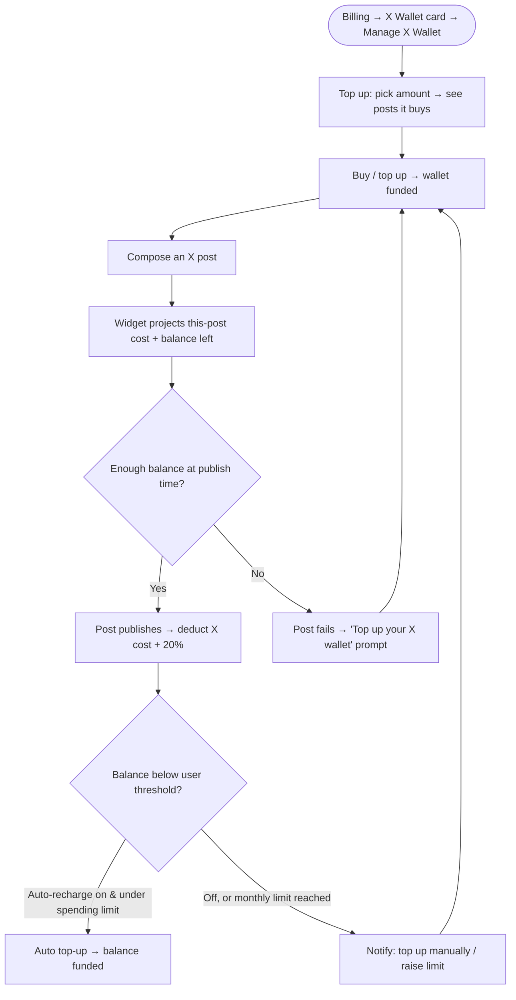

# Workflow Design — X (Twitter) Pay-Per-Use Credit Wallet

> Research was done up front (codebase exploration + model decisions) and is not repeated here. Model is **decided**: a prepaid dollar-credit wallet for X publishing, deducting per post at X's cost + 20%. v1 = **publishing only**, architected to extend to X inbox/analytics/listening later.

## 1. Feature Placement

- **X is REMOVED from the Manage Add-ons / Increase Limits modal.** The wallet is prepaid, not a monthly/annual recurring add-on, so it no longer belongs among the cycle-based add-ons.
- **New "X Wallet" card on the Billing page** (placed under/near the Usage Limits card). Shows the **current balance** at a glance (+ a low-balance / auto-recharge-on indicator) with a primary **Manage X Wallet** CTA and an optional **View usage** shortcut.
- **"Manage X Wallet" modal — one modal, two tabs:**
  - **Tab A — Top up & auto-recharge:** balance header · calculator (slider: plain/URL posts → estimated cost → suggested top-up) · **Buy / Top up** CTA · auto-recharge settings (enable, recharge-when-below threshold, top-up amount, **Monthly spending limit**, or **Allow unlimited spending**). *Buy + configure in one go.*
  - **Tab B — Usage:** full per-post log (date, account, had URL, cost, balance after) + breakdown + CSV export. The card's **View usage** shortcut deep-links here.
- **Composer (PostingSchedule).** The existing Twitter usage widget changes from "posts used / daily limit" to a **projection** of cost vs balance (no monthly framing, no progress bar), since the wallet is only charged when a post **actually publishes**. It is **collapsed by default** (to avoid info overload), showing just the **X-specific** post cost and balance, led by the X icon and worded "This X post will cost: $… · Remaining X Wallet balance: $…" so it's clearly the X cost only (not the whole multi-platform post), with a "Show cost details" toggle. **Expanded**, it adds the already-queued X posts and their projected cost, the projected balance after all of them, and a transparency note ("charged when each post publishes, not now"). Any over-balance warning shows even when collapsed. See §4 for the warning states and the URL heads-up popup.

No new top-level navigation; everything lives in the existing Composer + Billing surfaces.

## 2. Workflow Diagram (overview)

## 3. User Flow (happy path)

1. A super-admin opens **Billing**, sees the **X (Twitter) Wallet card** with their current balance, and clicks **Manage X Wallet**.
2. In the **Manage X Wallet modal** (Top up & auto-recharge tab), they pick a top-up amount and see live what the resulting balance buys ("what your balance gets you" — plain vs link posts).
3. They click **Buy / Top up**; the wallet balance increases.
4. They compose an X post. The composer widget shows **"This post will cost ~$0.018 (≈ $0.24 if it has a link) · Balance: $X left."**
5. They publish. On success, the cost is **deducted** from the balance (per delivered tweet for threads). The widget/balance updates.
6. Over time the balance drops. If **auto-recharge** is on and they're under their **monthly spending limit** (or unlimited), the wallet tops up automatically and posting continues uninterrupted.

## 4. Alternative / edge flows

- **URL post (cost jump) + heads-up popup:** the widget always shows running cost/balance (no popup for normal consumption). Because a link post costs ~13× a plain post, a **one-time heads-up popup** appears when **(a)** an X account is selected, **(b)** the post contains a URL, and **(c)** focus leaves the text editor. It tells the user the link makes this post cost more, shows the **plain vs URL cost**, and **projects their balance after** publishing, so they can decide whether to keep the link. It has a **"Don't show again"** option (persisted per user) and is **non-blocking** — purely informational.
- **Insufficient balance (at publish):** when a post actually publishes without enough balance, it **fails** with a clear "insufficient X balance" reason (auto-recharge, if on and under the spending limit, tops up first and avoids this).
- **Projected over-balance warning (in the composer widget):** because deduction happens at publish time, the widget projects the **whole queue** (already-scheduled X posts + this one) against the balance and warns when the projected spend exceeds it. Copy branches on auto-recharge:
  - **Auto-recharge OFF:** "Your $X balance won't cover everything you've queued. Posts publish in order until it runs out (about **N of M**), and the rest will fail unless you top up." + Manage X Wallet.
  - **Auto-recharge ON, within monthly spending limit:** "Your balance is low, but auto-recharge is on. It will top up automatically (up to your monthly spending limit) so your posts should keep publishing. They would only pause if the limit is reached."
  - **Auto-recharge ON, unlimited:** "Your balance is low, but auto-recharge is on with no limit, so all your posts will publish."
  - The widget is always framed as an **estimate** ("charged when each post publishes, not now") since we can't guarantee the outcome.
  - **No billing access (collaborator / not the super admin, can't manage billing):** every "Manage X Wallet" / "Top up" CTA — here and anywhere else in the composer/widget — is replaced with a non-actionable message: *"Ask your workspace's super admin to add X wallet credits."* Mirrors the existing white-label / Social-Listening "contact your super admin" pattern (`hasPermission('can_see_subscription')`). Only super-admins / billing-capable users see top-up/manage CTAs and the X Wallet card.
- **Failed publish:** if X's API call fails, **nothing is deducted**. Partial thread → only delivered tweets are deducted.
- **Monthly spending limit reached:** auto top-ups pause; the user is notified ("You've reached your monthly X spending limit. Top up manually or raise the limit to continue."). The **Monthly spending limit resets at the start of each month**, so auto-recharge resumes next month, or immediately if the user raises the limit. Users who never want posting to pause can choose **Allow unlimited spending** (no limit; auto-recharge keeps the wallet topped up and the saved card is charged as needed).
- **Scheduled/queued post at publish time with too-low balance:** the post **fails** with a clear "insufficient X balance" reason (handled like other publish failures), and the user is notified to top up — posts are **not** held indefinitely. Auto-recharge (if on and under the spending limit, or unlimited) tops up first and avoids this.
- **Migration / first wallet:** on rollout, accounts receive an initial wallet per the allocation rules in **§9** (trial $0.50; existing-with-add-on = prorated remaining add-on value; existing-without-add-on = $0.30 × connected X accounts; new subscribers keep their trial balance), with a one-time explainer.
- **No exemptions:** custom developer apps are no longer supported, so **all** X posting goes through the ContentStudio app and is metered — there are no exempt accounts.
- **Trial users:** X publishing is currently paused for trials (existing banner) — out of scope here.

## 5. Key Design Decisions

**D1 — Billing mechanism: prepaid one-off top-up (DECIDED).**
Options: (a) prepaid credit top-up = an ordinary one-time purchase; (b) post-paid metered billing; (c) Paddle metered product.
→ **Prepaid one-off (a).** It sidesteps the fact that our Paddle integration has no metered/usage billing today — selling "$10 of credits" is a standard purchase and deduction is internal. (Billing-eng to confirm the cleanest Paddle one-off-purchase mechanism + how auto-recharge re-triggers it.)

**D2 — Wallet scope: account / super-admin level (recommended).**
The current X daily limit is enforced at the super-admin level (shared across their workspaces). Recommend the credit wallet is **one balance per super-admin/account**, shared across their workspaces — consistent with today and simpler for agencies. (Alternative: per-workspace wallets — more granular but more billing surface. Open for confirmation.)

**D3 — Pricing stored as config, not hardcoded (recommended).**
Store `upstream_cost` + `markup` (→ derived `cs_price`) per action type in an admin-editable config, so when X changes prices or we tune the 20%, no deploy is needed. The composer/calculator read the live rate.

**D4 — Deduction must be atomic (recommended).**
The existing AI-credit precedent uses non-atomic read-modify-write (race-prone). Use an **atomic balance decrement + a usage-ledger insert** so concurrent scheduled posts can't lose or double-charge a deduction.

**D5 — Pull X out of Manage Add-ons into a dedicated X Wallet card + modal (DECIDED).**
Because the wallet is prepaid (not cycle-based), X is **removed** from the recurring Manage Add-ons / Increase Limits modal and gets its own **X Wallet card** on the billing page → a **tabbed "Manage X Wallet" modal** (Tab A: Top up & auto-recharge · Tab B: Usage). Keeps the prepaid flow out of the recurring-add-on UI and puts buy + auto-recharge config in one place. *(Alternative considered — two separate modals, buy vs logs — rejected: one tabbed modal keeps purchase + recharge config together per the "configure in one go" goal, with logs as a non-intrusive second tab.)*

## 6. Integration with existing features

- **Composer / Planner publishing:** deduction hooks into the X publish success path; the daily-limit gate (`isXPostingLimitReached`) is replaced by a balance check. Scheduled posts deduct at publish time.
- **Billing:** X is **removed** from the recurring Manage Add-ons / Increase Limits modal; a new standalone **X Wallet card + tabbed modal** handles balance, top-up, auto-recharge, and usage. Reuse the AI Video Credits calculator pattern for the top-up calculator.
- **Paddle:** new one-off credit-top-up purchase + auto-recharge re-trigger (vs today's subscription add-on).
- **Replaces:** the fixed daily `x_posting_credits` limit and the $5-for-5-posts/day add-on.
- **Future (same wallet):** X inbox (DM reads/sends), analytics (post/user reads), listening (mention reads) — X meters all of these, so the ledger is generic from day one.

## 7. Trackable Actions (Usermaven candidates)

| Action | Candidate event | Trigger | Notes |
|---|---|---|---|
| Buys X credits | `x_credits_purchased` | top-up purchase completes | payload `{ amount_usd, source: 'manual' \| 'auto_recharge' }` |
| Enables/updates auto-recharge | `x_auto_recharge_configured` | saves auto-recharge settings | `{ threshold_usd, topup_usd, spending_limit_usd, unlimited, enabled }` |
| Auto-recharge fires (server) | `x_auto_recharge_triggered` | balance < threshold → top-up | BE-dispatched; `{ amount_usd }` |
| Spending limit reached (server) | `x_spending_limit_reached` | auto top-up blocked by the spending limit | BE-dispatched |
| Post blocked by empty balance | `x_post_blocked_insufficient_balance` | publish blocked at composer/planner | adoption/friction signal |
| Opens the usage breakdown | *(skip — minor view event)* | — | per guidelines, don't track view-only |

Reuse the existing `addon_purchased` event family where it already fits the purchase; the events above are the new pay-per-use-specific ones.

## 8. Scope Recommendation

**v1 (this epic):**
- Prepaid X credit wallet (account-level balance) + atomic deduction on publish (per delivered tweet, no charge on failure).
- Composer widget redesign (per-post cost + balance + URL jump + top-up prompt).
- Manage Add-ons: balance + **Manage** modal = calculator (posts → est. cost → credits) + auto-recharge (threshold, top-up amount) + monthly spending limit (or unlimited); selection auto-fills purchase.
- **View usage** modal: per-action unit cost + usage + full per-post log (date, account, had URL, cost, balance after); CSV export.
- Migration: free starter credits + one-time explainer + convert existing add-on value to credits.
- Usage Limits card X row → balance + Manage.
- Pricing config (upstream + markup); Usermaven events.

**Defer to v2+:**
- Extending the wallet/ledger to X **inbox, analytics, listening** (design generic now, wire later).
- Per-type markup experiments; per-workspace (vs account) wallets if agencies ask.
- Held-vs-failed behavior refinements for scheduled posts (start with the simpler of the two).

## 9. Initial wallet allocation (rollout & migration)

The wallet lives at the **super-admin / account level** (shared across that account's workspaces). At rollout, each account's starting balance is set by these rules:

- **Trials (from rollout onward):** **$0.50** granted to the account wallet at trial start. Usable on any X post type, any amount, within that balance. To post more, a trial user must **upgrade (subscribe) first, then buy an add-on** — add-ons are not purchasable while on trial.
- **New subscribers (trial → paid):** **no extra grant** — they keep whatever remains of the $0.50 (consumed is consumed; leftover carries forward). For more, they buy the add-on.
- **Existing users WITH the current X add-on:** convert the **unused portion of the add-on into wallet dollars**, added automatically. Formula = **amount paid × fraction of the billing cycle still unused**. e.g. a $60 annual add-on with 6 months left → **$30** added to the wallet.
- **Existing users WITHOUT the add-on:** check connected X accounts at the **super-admin level across all workspaces**:
  - **0 X accounts → no allotment.**
  - **≥1 X account → grant `$0.30 × (number of connected X accounts)`**, one-time. Per-account, **regardless of plan** (context: Standard allows up to 5 X accounts, Advanced up to 10, Agency 25+).
- **Amounts are tunable** ($0.50 trial grant, $0.30 per X account) but the **format is fixed**: trials get a flat grant; existing-without-add-on is per-connected-X-account.
- **The API plan** ($19, 10 socials) is included in all wallet rules: same $0.50 trial grant, same allocation, same per-plan defaults. API-plan posts publish via the public API and still deduct from the wallet (the composer FE surfaces don't apply to API-only posting).

### Per-plan auto-recharge defaults (pre-filled when auto-recharge is enabled; off by default; all editable)
| Plan | Monthly spending limit | Top-up amount | Recharge when below |
|---|---|---|---|
| API | $10 | $5 | $1 |
| Standard | $10 | $5 | $1 |
| Advanced | $20 | $10 | $2 |
| Agency | $50 | $10 | $3 |

Limit ≈ $2 per account (API matched to Standard); ~30–36% of plan price. Larger Agency-tier variants start at the Agency defaults and can raise them.

### Transition emails (existing users with an X account — NOT trials / new users)
Two one-off emails accompany the rollout, sent **only to existing users who have at least one connected X account** (trial and new/upcoming users are excluded):
1. **Pre-rollout announcement** (sent before the switch): explains X publishing is moving from the included daily-limit + add-on model to **pay-per-use**, what's changing, the per-post pricing (plain vs URL), and the **rollout date** — with enough detail to prepare.
2. **Rollout-day email** (sent on switch): tells each user their **starting wallet** — how much was granted, or that their **existing add-on was converted to a $X balance** — how to use it, and the **consumption rates** (plain post ≈ $0.018, URL post ≈ $0.24).

## 10. Open questions (carry into PRD)
- CSV export of usage log — v1 or v2? (Minor; everything else is decided.)

_(Resolved: markup 20% → $0.018 / $0.24 · **per-plan auto-recharge defaults** (see §9; auto-recharge off by default) · auto-recharge cap is a **Monthly spending limit** (resets each month) with an **Allow unlimited spending** option · add-on conversion = amount paid × unused-cycle fraction · wallet scope = account/super-admin level · allocation amounts per §9 · **API plan included** · insufficient balance → post **fails** (not held) · **no exemptions** (custom developer apps no longer supported, all X posting is metered).)_
