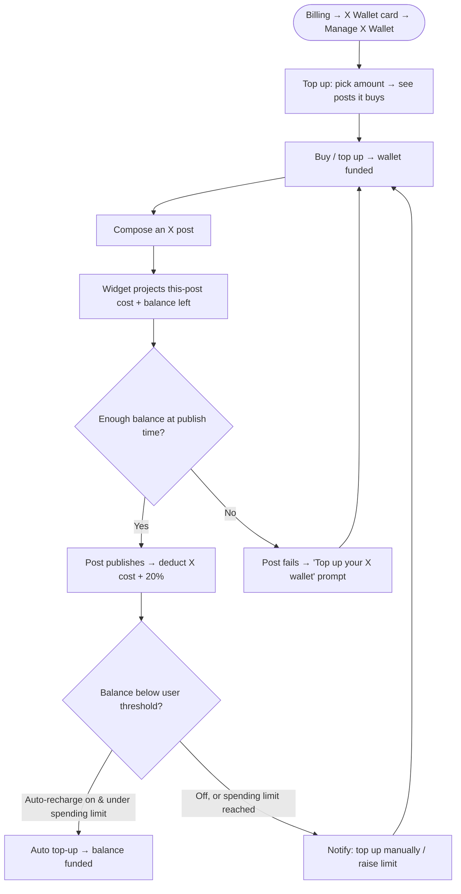

# PRD: X (Twitter) Pay-Per-Use Credit Wallet

**Author:** Ghulam Jaffar (Product Owner)
**Last Updated:** 2026-06-24
**Status:** In Review
**Target Release:** Q3 2026

---

## 1. Overview

X (Twitter) moved its publishing API to **pay-per-use pricing** — ContentStudio is now charged per post ($0.015 plain, $0.20 for a post containing a link) against a prepaid balance it holds with X. ContentStudio's old X model (a fixed daily post limit + a $5-for-5-posts/day recurring add-on) no longer fits. This feature replaces it with a **prepaid dollar-credit wallet for X**: users hold a non-expiring dollar balance, each published post deducts at X's cost + a 20% service fee ($0.018 plain / $0.24 link), and they top up when low — with optional auto-recharge and a spending limit. It's fully transparent in the composer and billing, and is architected so the same wallet later covers X inbox, analytics, and listening.

---

## 2. Problem Statement

**What problem are we solving?**
X's new per-post API pricing means every X post costs ContentStudio real money, with link posts ~13× pricier than plain ones. The current fixed daily-limit + recurring add-on model can't represent that variable, per-post cost — it either caps users arbitrarily or exposes ContentStudio to uncontrolled cost. A temporary credit stopgap is live, but the permanent fix needs a true usage-priced model.

**Who has this problem?**
Every workspace that publishes to X through ContentStudio's app (all plans). X publishing is a core, high-volume action, so this touches a large share of active users.

**What happens if we don't solve it?**
ContentStudio either eats unbounded X API cost or throttles X posting in ways that frustrate paying customers — risking churn, support load, and margin erosion. A transparent, cost-aligned model protects margin while keeping X posting available to everyone.

---

## 3. Goals & Success Metrics

| Goal | Metric | Target | How We'll Measure |
|---|---|---|---|
| Recover X API cost with margin | Gross margin on X posting | ≥ 20% (markup) | Billing + usage ledger |
| Keep X posting flowing (no hard paywall) | % of X-posting workspaces that top up / use the wallet | 60% of active X workspaces in 90 days | Usermaven (`x_credits_purchased`) |
| Smooth transition for existing users | X-posting volume retention post-rollout | ≥ 90% of pre-rollout volume | Usage ledger |
| Guard rail: no surprise-bill backlash | X-billing support tickets | < 1% of X-posting workspaces | Support data |

### 3.1 Analytics Events (Usermaven)

| Event Name | Trigger | Payload | What we measure with it |
|---|---|---|---|
| `x_credits_purchased` | Wallet top-up purchase completes | `{ amount_usd, source: 'manual' \| 'auto_recharge' }` | Top-up conversion + volume; manual vs auto split |
| `x_auto_recharge_configured` | User saves auto-recharge settings | `{ enabled, threshold_usd, topup_usd, spending_limit_usd, unlimited }` | Auto-recharge adoption + config patterns |
| `x_auto_recharge_triggered` | Balance < threshold → auto top-up fires (server) | `{ amount_usd }` (BE-dispatched) | How often auto-recharge keeps posting alive |
| `x_spending_limit_reached` | Auto top-up blocked by the spending limit (server) | `{}` (BE-dispatched) | Friction at the cap; tuning guidance |
| `x_post_blocked_insufficient_balance` | A post is blocked/fails for empty wallet | `{}` | Friction; lost-post risk; top-up prompts |

Naming follows guidelines §19 (snake_case, past tense, no PII). These map 1:1 to AC in the FE/BE stories.

---

## 4. Target Users

**Primary Persona — Workspace Super Admin / billing owner.** Owns the subscription, tops up the wallet, sets auto-recharge + spending limit, and watches cost. Cares about predictable spend and not over-paying.

**Secondary Persona — Team member / collaborator who posts to X.** Composes and schedules X posts; needs to see what a post costs and whether it'll publish — but **cannot** manage billing (sees "ask your super admin" instead of top-up CTAs).

**Non-Users (out of scope):** trial users beyond their $0.50 starter grant (they upgrade to buy more); users on platforms other than X (this is X-only for v1); inbox/analytics/listening metering (future).

---

## 5. User Stories / Jobs to Be Done

| ID | As a… | I want to… | So that… | Priority |
|---|---|---|---|---|
| US-1 | Super admin | top up a prepaid X balance in dollars | I only pay for the X posting we actually do | Must |
| US-2 | Team member | see what a post will cost and my balance before publishing | I'm not surprised and I know if it'll go out | Must |
| US-3 | Team member | be warned when a link makes a post much pricier | I can decide whether to keep the link | Must |
| US-4 | Super admin | turn on auto-recharge with a spending limit (or unlimited) | posting never silently stops, but I stay in control of spend | Must |
| US-5 | Super admin | see a per-post usage log and an honest cost breakdown | I can audit where the money goes | Must |
| US-6 | Existing customer | keep posting after the switch without losing what I paid for | the transition feels fair | Must |
| US-7 | Team member without billing access | know who to ask when the wallet is low | I'm not stuck | Must |
| US-8 | Super admin | estimate how many posts a top-up buys | I can choose the right amount | Should |

---

## 6. Requirements

### 6.1 Must Have (P0)
- Prepaid **dollar wallet** at the account/super-admin level (shared across the account's workspaces); **non-expiring**.
- **Deduct on publish** at X cost + 20% ($0.018 plain / $0.24 link); per **delivered** tweet for threads; **no deduction on failure**.
- Replace the daily-limit gate: a post **fails with a clear "insufficient X balance" reason** when the wallet can't cover it (and auto-recharge can't).
- **Composer wallet widget** — projection (no month, no bar): balance, this-post cost, queued-posts cost, projected balance after, transparency note, and over-balance warning states (incl. the no-billing-access "ask your super admin" variant).
- **URL heads-up popup** (X selected + URL present + editor blur), one-time, with "Don't show again."
- **X Wallet card** on the billing page (X removed from Manage Add-ons) → **Manage X Wallet modal** (Tab A Top up & auto-recharge, Tab B Usage), with **Manage** → Tab A and **View usage** → Tab B.
- Top-up calculator + **"what your balance gets you"** card (resulting balance), **Buy / Top up**.
- **Auto-recharge** (threshold, top-up amount default $10) + **Spending limit** (fixed, no reset, X-style copy) + **Allow unlimited spending**.
- **Usage log** (date, account, type, cost, balance after) + cost breakdown (X's cost vs 20% fee) + CSV export.
- **Pricing stored as editable config** (upstream cost + markup), not hardcoded.
- **Initial allocation & migration** (per §8) + the two **transition emails** (existing X users only).
- **Usermaven events** per §3.1.

### 6.2 Should Have (P1)
- "Projected consumption vs balance" meter in the composer widget (repurposed bar).
- Low-balance / spending-limit-reached notifications surfaced outside the composer.

### 6.3 Nice to Have (P2)
- Per-type markup tuning (different markup for link posts).
- Per-workspace wallets (vs account-level) for agencies.

### 6.4 Explicitly Out of Scope
- Metering X **inbox / analytics / listening** (architected for, not built now).
- Mobile app changes (X publishing pay-per-use is web-first for v1).
- Custom developer-app exemptions (custom dev apps are no longer supported — all X posting is metered).
- "Hold" behavior for under-funded scheduled posts (they fail, not held).

---

## 7. User Flow (High Level)

1. Super admin opens **Billing → X Wallet card → Manage X Wallet**, picks a top-up amount (sees what it buys), and **Buys / tops up**.
2. A user composes an X post; the **widget projects** this post's cost + the queued posts' cost against the balance. Adding a link triggers the **heads-up popup**.
3. On publish, the cost is **deducted** (per delivered tweet; nothing on failure).
4. When the balance runs low: **auto-recharge** tops up (if on and under the spending limit / unlimited); otherwise the user is told to top up — or, without billing access, to ask their super admin.

---

## 8. Business Rules & Constraints

| Rule ID | Rule | Rationale |
|---|---|---|
| BR-1 | Charge per post = X cost × 1.20 ($0.018 plain, $0.24 link); link detected at publish time | Recover cost + 20% margin transparently |
| BR-2 | Deduct only on **successful** publish; per delivered tweet for threads | Never charge for failed/undelivered posts |
| BR-3 | Wallet is **account/super-admin level**, shared across workspaces, **non-expiring** | Matches today's X-limit scope; prepaid simplicity |
| BR-4 | Balance deduction is **atomic** (no read-modify-write race) | Concurrent scheduled posts mustn't lose/double-charge |
| BR-5 | Insufficient balance → post **fails** with a clear reason (not held) | Avoid stale content + complex hold state |
| BR-6 | Spending limit is a **fixed total, no cycle reset**; raised manually; or **unlimited** | Our wallet is prepaid, not metered-per-cycle like X |
| BR-7 | Only **billing-capable users** (super admin / `can_see_subscription`) see top-up/manage CTAs + the wallet card; others see "ask your super admin" | Mirrors white-label / listening permission pattern |
| BR-8 | **No exemptions** — all X posting goes through the ContentStudio app and is metered | Custom dev apps no longer supported |
| BR-9 | Initial allocation: trial **$0.50**; new subscribers keep leftover; existing-without-add-on **$0.30 × connected X accounts** (0 if none); existing-with-add-on **amount paid × unused-cycle fraction** | Fair, no-loss transition (decided) |
| BR-10 | Trial users must **upgrade before** buying a top-up (add-ons not purchasable on trial) | Existing trial billing constraint |

---

## 9. Open Questions

| Question | Options | Owner | Decision |
|---|---|---|---|
| Final markup % and whether link posts mark up differently | Flat 20% / per-type | PM + Billing | Working: flat 20% |
| Starter-wallet & per-account amounts | $0.50 trial / $0.30 per X account | PM | Set, tunable pre-launch |
| Cleanest Paddle mechanism for a non-subscription one-off top-up + auto-recharge re-trigger | One-off product / charge | Billing eng | **Blocking spike** |
| CSV export of usage log in v1 | v1 / v2 | PM | Leaning v1 |

---

## 10. Risks & Mitigations

| Risk | Likelihood | Impact | Mitigation |
|---|---|---|---|
| Existing users feel downgraded (X posting was bundled) | Medium | High | One-time goodwill wallet + add-on conversion at paid value + clear transition emails |
| Surprise bills from auto-recharge | Medium | High | Spending limit (fixed, manual-raise) + explicit "unlimited" opt-in + notifications |
| Link posts drain wallets fast (~13× cost) | High | Medium | URL heads-up popup + obvious cost in widget + calculator |
| Paddle can't cleanly do one-off top-ups | Medium | High | Billing-eng spike before build; prepaid one-off is far simpler than metered |
| Concurrency double-charge / lost deduction | Medium | Medium | Atomic balance decrement + usage ledger + idempotency keys |

---

## 11. Dependencies

- **Internal:** Billing/Paddle integration (one-off top-up + auto-recharge re-trigger — billing-eng spike); the X publish path (deduct hook on success); pricing config store; usage ledger; transactional email (two transition emails); the temporary credit model it replaces.
- **External:** X (Twitter) API pricing ($0.015 / $0.20) and reliable URL detection mirroring X's; Paddle one-off/usage capabilities.
- **Blockers:** Paddle one-off top-up mechanism confirmation (§9).

---

## 12. Appendix
- Workflow & full UX detail: `02-workflow.md` (this feature folder).
- Interactive prototypes: pay-per-use wallet simulator + composer/wallet UX prototype (Lovable).
- Temporary credit-model fix (the "before"): current production behavior.

---

## Changelog
| Date | Author | Changes |
|---|---|---|
| 2026-06-24 | Ghulam Jaffar | Initial PRD from finalized workflow + prototype decisions |
