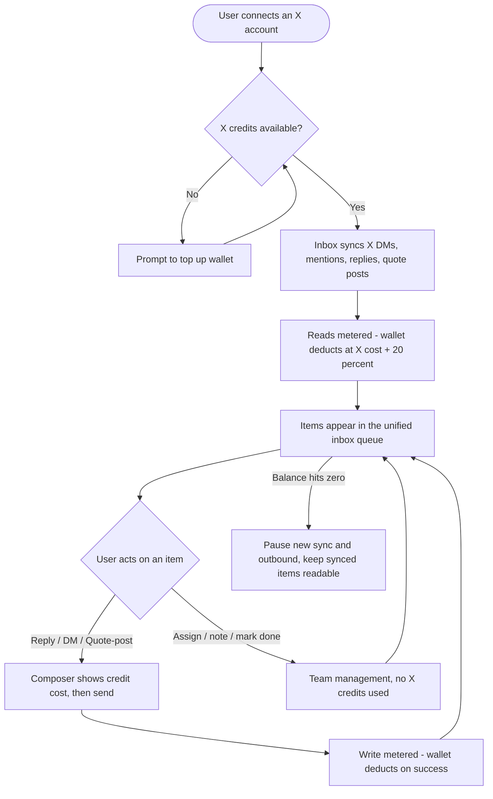
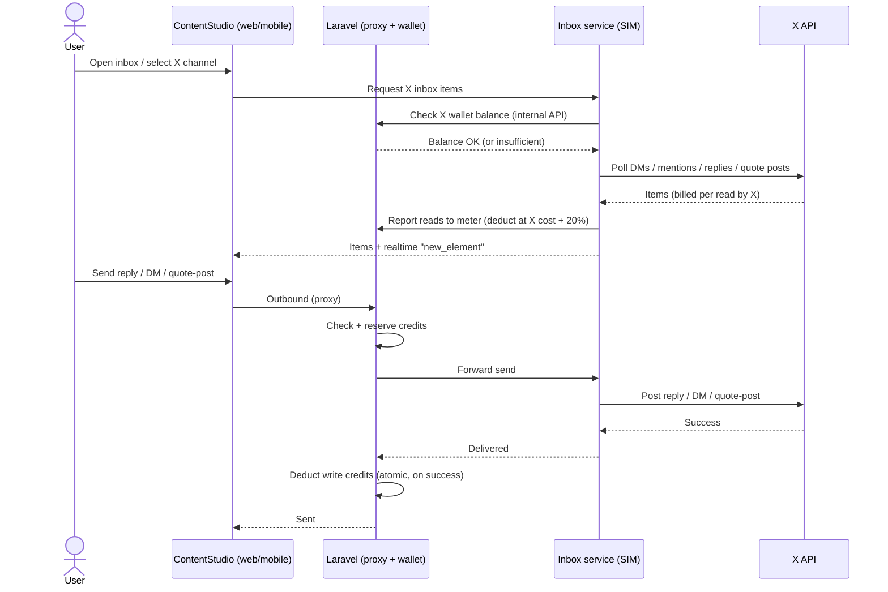

# Workflow — X (Twitter) in the Social Inbox (pay-per-use)

Derived from `01-research.md`. Billing decisions locked: reuse the existing X wallet, **X cost
+ 20% markup**, meter both reads (sync) and writes (outbound). Scope: DMs, mentions, replies,
quote posts (incl. outbound quote-posting, pending X-tier verification), web + iOS + Android.

---

## 1. Feature Placement

- **Web** (`contentstudio-frontend/src/modules/inbox-revamp/`): X becomes a first-class channel
  in the existing Inbox (`/:workspace/inbox/...`) — selectable in the channel filter alongside
  Facebook, Instagram, LinkedIn, GMB, YouTube (today X is deliberately excluded via one guard in
  `useInboxUI.ts`). X conversations (DMs) and X posts (mentions / replies / quote posts) appear in
  the same unified queue, buckets, and detail views.
- **Connect entry point:** the existing X connection flow (Integrations / "Connect account"), which
  already provisions X API access (`developer_app`) and the credit wallet. No separate inbox connect.
- **Locked-until-enabled:** X accounts show a **lock icon** in the channel filter until the workspace's
  X wallet/credits are enabled; clicking the lock opens setup (top-up + the per-account sync-settings modal).
- **Per-account sync-settings modal** (like X analytics): choose **frequency** (near-real-time / 15 min /
  hourly / manual) and toggle which **interaction types** to sync (DMs / mentions / replies / quote posts),
  with a **generic per-frequency estimated cost** + a manual "Refresh now". Only enabled types sync/bill.
- **Credit surfaces (web):** a persistent **X credit balance chip** in the inbox header, an inline
  **cost preview** in the reply/DM composer (reuse `TwitterPostUsageAlert.vue` + `calcXCredits`),
  low-balance banners, and a **top-up modal** (reuse `TwitterPostingAddon.vue` / billing flow).
- **Billing settings:** the X wallet (balance, usage incl. inbox, top-up) is surfaced in billing settings,
  coordinating with the in-development X wallet feature.
- **Mobile:** **Android** inbox already renders X (DMs via `ChatActivity`, posts/mentions via
  `TwitterPostsActivity`) — extend to full parity (quote posts) + credit gating. **iOS** inbox adds
  X as a channel (new rendering). Wallet top-up on mobile = **webview to the web Paddle flow** in v1
  (neither app has native billing UI). Balance/cost are shown read-only from the API.

---

## 2. Overview diagram (high-level journey)

---

## 3. User Flow (happy path)

1. User connects an X account (or already has one connected). If the workspace has no X credits, the
   inbox shows a "top up to enable X" prompt; user tops up via the existing wallet flow.
2. The inbox begins syncing that X account's **DMs, mentions, replies to its posts, and quote posts**
   (from the connect point forward — X does **not** backfill history). Each sync reads from X and
   **deducts credits** for the items returned (at X cost + 20%), respecting the 24h read-dedup.
3. X items appear in the same unified queue as other platforms, with an X badge, correct grouping
   (DMs as conversations; mentions/replies/quote posts as posts), and read/unread + assignment states.
4. User opens an X item. The reply/DM composer shows a **live credit cost** before sending
   (e.g. "This reply will use ~0.018 credits; a reply with a link uses ~0.24").
5. User sends a reply, DM, or quote-post. On success, the write is **metered** (deducted from the
   wallet) and the sent item appears in the thread. Assign / note / mark-done / archive use **no** credits.
6. The inbox header balance updates; low-balance banners appear at staged thresholds.

---

## 4. Connect + credit-gated sync (sequence)

---

## 5. Alternative & edge flows

- **Insufficient credits — outbound:** send is blocked with "You're out of X credits — top up to
  reply." Draft is preserved. (Mirrors the publishing `insufficientCreditsResponse` + composer
  `credits_full` precedent.)
- **Insufficient credits — sync:** new X syncing pauses; already-synced conversations stay readable;
  a banner offers top-up. **Never drop incoming messages** — resume sync after top-up.
- **BYO X app accounts (`developer_app_id`):** these use the customer's own X API quota. Consistent
  with publishing today, they are **exempt from ContentStudio credit consumption** (design decision D4).
- **X rate limits hit** (esp. DM reads ~15 req/15 min): back off, show "syncing paused, retrying in N
  min," don't burn credits retrying blindly; respect X `Retry-After`.
- **Mentions older than ~7 days:** not available on pay-per-use (recent-search only) — surface as
  "X shows mentions from the last 7 days."
- **Quote-post outbound not permitted by X tier:** if the write endpoint is unavailable, hide/disable
  "quote post" and keep plain reply as the outbound primitive (feature-flag it — design decision D2).
- **Send fails at X:** no credits deducted (deduct only on success); show error, keep draft.
- **Account disconnected / token expired:** show reconnect banner (existing inbox pattern), pause sync.

---

## 6. Key Design Decisions

### D1 — How X inbox **reads** get metered (the crux)
Reads happen in SIM (Python); the wallet is in Laravel. Options:

| Option | How | Trade-off |
|---|---|---|
| **A. SIM→Laravel internal API (recommended)** | SIM checks balance before a sync cycle and reports items-read to a Laravel wallet endpoint that deducts (batched per cycle). Reuses the existing JWT-authed Laravel↔SIM bridge + the `InternalApiMiddleware` internal-route pattern (already used for auto-reply active-rules). | Slight latency + a new internal endpoint; keeps the wallet single-source-of-truth in Laravel. Best fit with today's architecture. |
| B. Wallet logic moves into SIM | SIM owns deduction directly against a replicated balance. | Fast, no cross-service chatter, but splits wallet ownership across two services — reconciliation + drift risk. |
| C. Pre-authorized local budget | Laravel grants SIM a periodic credit budget; SIM deducts locally and reconciles. | Fewer calls; more complex, risk of over/under-spend between reconciliations. |

**Recommendation: A**, with **batched per-cycle deduction** (deduct for items actually returned, honoring X's 24h dedup so re-polled items aren't re-charged). Atomic deduction on the Laravel side.

### D2 — Sync cadence (a priced lever)
X reads cost money and DM reads are rate-limited. Options: fixed periodic (e.g. 15 min) · **user-controlled per-account cadence** (Real-time / 15 min / Hourly / Manual, each showing its credit implication) · manual-only.
**Recommendation:** default **periodic (15 min)** + **manual "Refresh now"**, with **user-selectable cadence per account** as a v1 delighter that directly controls credit burn. "Real-time" for DMs is bounded by X's ~15 req/15 min limit — label it "near-real-time."

### D3 — Modeling mentions & quote posts
The inbox element model is conversation/post/review — no mention/quote type. Options: reuse `post` for mentions/replies/quote posts (fastest, some UX compromise) vs. add X-specific element types (cleaner, an API-contract change in SIM + generated DTOs).
**Recommendation:** **reuse `post`** for mentions/replies/quote posts and `conversation` for DMs in v1 (with X-specific badges/threading), and revisit dedicated types in v2 if UX demands. Confirm with the SIM backend team (API contract).

### D4 — BYO-app accounts & metering
Publishing exempts custom-app (`developer_app_id`) accounts from shared-app credit consumption; the wallet PRD says custom apps are being discontinued.
**Recommendation:** for v1, **exempt BYO-app accounts** (consistent with publishing) and meter only shared-app accounts; revisit if custom apps are retired.

### D5 — Mobile wallet UI
Neither app has native billing UI. Options: native IAP/checkout (heavy, store-policy risk) vs **webview to the web Paddle top-up** (mirrors how plan upgrades work today) vs read-only balance + "top up on web."
**Recommendation:** v1 = **show balance + cost natively (read-only from API), top up via webview** to the existing web flow. Native purchase deferred.

---

## 7. Integration with existing features

- **Wallet / billing:** reuse the X wallet, the `x_posting_credits` addon + Paddle top-up, and the
  web credit components (`xCredits.ts`, `TwitterPostUsageAlert.vue`, `TwitterPostingAddon.vue`,
  `useTwitterLockGate.ts`). Adds `inbox_read` / `inbox_send` action types to the pricing/ledger.
- **Existing inbox:** X rides the same queue, buckets, assignment, notes, saved replies, tags, and
  realtime (`new_message` / `new_comment` / `new_element`) as other platforms.
- **Auto-reply:** X inherits the existing auto-reply bridge once SIM emits X events (note: auto-replies
  that send are metered writes).
- **Connect / integrations:** reuse the X account connection + `developer_app` provisioning.
- **AI reply (web-only):** the composer's AI reply/improve stays web-only (per platform rules); it does
  not come to mobile.

---

## 8. Trackable Actions (Usermaven candidates)

| Action | Candidate event | Trigger |
|---|---|---|
| X account enabled for inbox | `connected_social_accounts` (reuse) | X account starts syncing in inbox |
| X inbox reply/DM/quote sent | `x_inbox_reply_sent` | outbound send succeeds; payload `{ workspace_id, type: dm\|reply\|quote, has_link }` |
| Credits topped up | `addon_purchased` (reuse) | wallet top-up completes |
| Ran out of credits | `x_inbox_credits_depleted` | balance hits zero and sync/outbound pauses |
| Sync cadence changed | `x_inbox_sync_cadence_changed` | user changes an account's cadence; payload `{ cadence }` |

(Search `userMaven.track(` before finalizing names — reuse `connected_social_accounts` / `addon_purchased`.)

---

## 9. Scope Recommendation (v1 vs v2)

**v1:**
- X as an inbox channel on **web + Android + iOS**: DMs, mentions, replies, quote posts (read) in the
  unified queue with assignment/notes/status/tags.
- Outbound **reply + DM + quote-post** (quote-post behind a flag pending X-tier verification).
- **Credit metering** of reads (batched per sync) + writes, via the existing wallet at **X cost + 20%**,
  with balance chip, cost preview, low-balance banners, graceful degradation, BYO-app exemption.
- **User-selectable sync cadence** per account; manual refresh.
- Mobile: native balance/cost display; **top-up via webview**.

**Defer to v2:**
- Dedicated X mention/quote element types (if v1 `post` reuse proves limiting).
- Native mobile purchase/top-up UI.
- Per-account/-workspace credit budgets & caps; usage forecasting dashboard.
- AI reply suggestions for X on mobile (AI stays web-only regardless).
- Advanced response-time SLA analytics inside the inbox.
