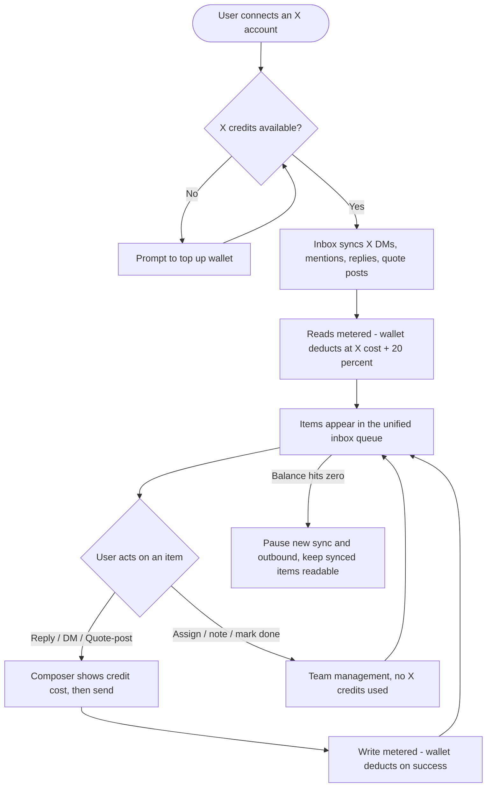

# **PRD: X (Twitter) in the Social Inbox (pay-per-use)**

**Author:** Product Team
**Last Updated:** 2026-08-03
**Status:** In Review
**Target Release:** Q4 2026

---

## **1. Overview**

Bring X (Twitter) into ContentStudio's social inbox so users can manage X **DMs, mentions,
replies to their posts, and quote posts** in the same unified queue they already use for
Facebook, Instagram, LinkedIn, GMB, and YouTube — reply, DM, assign, note, and resolve without
leaving ContentStudio. Because X's API is metered (it now charges per read and per write),
X inbox usage is billed through the **existing X pay-per-use credit wallet** at **X's cost + a
20% markup**, metering both syncing (reads) and outbound actions (writes). This lets ContentStudio
offer X inbox — which most mid-market competitors dropped or bolt on as a flat surcharge — with
usage-fair pricing, while never absorbing an unbounded X API bill.

---

## **2. Problem Statement**

**What problem are we solving?**
ContentStudio's social inbox unifies engagement across platforms, but **X is deliberately
excluded** (a hard guard in the web inbox). Users who manage an X presence must leave ContentStudio
and use X natively to see and answer DMs, mentions, and replies — breaking the "one inbox" promise
and fragmenting team workflows (assignment, notes, statuses, SLAs) for a major network.

**Who has this problem?**
Any workspace that manages an X account for support or engagement — social media managers, agencies
managing client X accounts, and support teams. X is one of the most engagement- and complaint-heavy
networks, so its absence from the inbox is conspicuous.

**What happens if we don't solve it?**
- Competitive disadvantage: Sprout/Hootsuite include X (in expensive plans); Agorapulse/Metricool sell
  it as an add-on. A "unified inbox" without X reads as incomplete.
- Users maintain a second workflow in the native X app; missed/late responses hurt their brands.
- We forgo a monetization lever: X inbox usage can fund itself (and margin) via the credit wallet.

---

## **3. Goals & Success Metrics**

| Goal | Metric | Target | How We'll Measure |
| ----- | ----- | ----- | ----- |
| Primary — adopt X inbox | % of X-connected workspaces that action ≥1 X inbox item | 35% in 90 days | Product analytics (`x_inbox_reply_sent`) |
| Secondary — monetize fairly | X inbox credit revenue vs. X API cost (margin ≥ markup) | ≥ 20% net margin | Billing + usage ledger |
| Secondary — engagement completeness | X items answered from ContentStudio vs. left unactioned | 50% of synced actionable items answered | Inbox action data |
| Guard rail — cost safety | Workspaces exceeding expected X read cost without matching credit deduction | ~0 (no unmetered reads) | Usage-ledger reconciliation vs. X billing |
| Guard rail — trust | Support tickets citing "surprise" credit deductions | < 1% of X inbox workspaces | Support tags |

### **3.1 Analytics Events (Usermaven)**

| Event Name | Trigger | Payload | What we measure with it |
| ----- | ----- | ----- | ----- |
| `connected_social_accounts` (reuse) | X account OAuth completes | `{ platform: 'twitter' }` | X connection funnel (existing event) |
| `x_inbox_reply_sent` (FE) | An X reply/DM/quote-post send succeeds from the inbox | `{ workspace_id, type: 'dm'\|'reply'\|'quote', has_link }` | X inbox adoption & action volume; link-cost mix |
| `x_inbox_sync_cadence_changed` (FE) | User changes an X account's sync cadence | `{ workspace_id, cadence: 'realtime'\|'15m'\|'hourly'\|'manual' }` | How users manage credit burn |
| `addon_purchased` (reuse) | Wallet top-up checkout completes | `{ addon: 'x_posting_credits' }` | Top-up conversion (existing event) |
| `x_inbox_credits_depleted` (BE) | Wallet hits zero and X sync/outbound pauses | `{ workspace_id }` | Depletion frequency; degradation impact |

*(Reuse `connected_social_accounts` and `addon_purchased`; confirm exact names via `userMaven.track(`
search before build. These become testable AC in the FE/BE stories and must match this spec.)*

---

## **4. Target Users**

**Primary Persona:** *Social media manager / community manager* — answers DMs, mentions, and replies
across networks daily; wants X in the same queue with assignment, notes, and statuses; not deeply
technical; cares about speed and not missing messages.

**Secondary Persona:** *Agency owner / account admin* — manages multiple client X accounts, controls
spend, and needs the credit cost of X to be predictable and attributable per client/workspace.

**Non-Users (out of scope):** users who only publish to X and don't do engagement; users wanting
X **listening**/monitoring of arbitrary keywords (that's Listening, not inbox); enterprises needing
full-archive mention history (pay-per-use is recent-only).

---

## **5. User Stories / Jobs to Be Done**

| ID | As a... | I want to... | So that... | Priority |
| ----- | ----- | ----- | ----- | ----- |
| US-1 | Social media manager | see my X DMs, mentions, replies & quote posts in the unified inbox | I manage X without leaving ContentStudio | Must Have |
| US-2 | Social media manager | reply, DM, and quote-post from the inbox | I respond in-context and fast | Must Have |
| US-3 | Social media manager | see the credit cost before I sync/send X | I'm never surprised by deductions | Must Have |
| US-4 | Agency owner | top up and see the X credit balance in the inbox | I keep X engagement running | Must Have |
| US-5 | Agency owner | choose each X account's sync cadence | I control how fast credits burn | Should Have |
| US-6 | Team lead | assign, note, and resolve X items | my team collaborates without collisions | Must Have |
| US-7 | Mobile user | manage X inbox on iOS/Android | I can respond on the go | Must Have |
| US-8 | Agency owner | keep reading already-synced X items when credits run out | a zero balance doesn't hide history | Should Have |

---

## **6. Requirements**

### **6.1 Must Have (P0)**
- X appears as a channel in the inbox (web + iOS + Android) with DMs (conversations) and mentions /
  replies / quote posts (posts) in the unified queue, filters, and buckets.
- X accounts appear **locked** (lock icon) in the channel filter until the workspace's X wallet/credits
  are enabled; clicking the lock opens setup (top-up + sync settings). (BR-12)
- **Per-account sync-settings modal** (like X analytics): choose sync **frequency**
  (near-real-time / 15 min / hourly / manual) and toggle which **interaction types** to sync
  (DMs, mentions, replies, quote posts), with a **generic per-frequency estimated cost** and a manual
  "Refresh now". Only enabled types are synced/billed. (BR-13)
- Outbound **reply**, **DM**, and **quote-post** from the inbox (quote-post behind a verification flag — see BR-9).
- **Dual billing support:** X inbox usage bills against whichever X billing model the workspace is
  already on — **X plan credits** (existing count-based pool, shared with X publishing) for
  long-standing workspaces, **X pay-per-use wallet** (dollars, X cost + 20%) for newer ones. The
  segmentation rule and the credit rate card are **owned by the existing X billing work**; this epic
  adheres to them and does not redefine either. (BR-1, BR-1a, BR-14)
- **Metering** of reads (batched per sync cycle) and writes (on success) in either model; honor X's
  24h read-dedup.
- **Credit surfaces:** live balance in the inbox header, per-action cost preview in the composer,
  staged low-balance warnings, and top-up — each rendered in the workspace's own unit (credits or
  dollars) via the existing wallet/Paddle flow.
- **X billing in billing settings:** balance, usage breakdown (incl. inbox), and top-up surfaced in
  billing settings for both models (coordinates with the in-development X wallet feature).
- **Graceful degradation** at zero balance: pause new sync + block outbound; keep already-synced
  items readable; never drop incoming messages; resume on top-up.
- Team management on X items (assign, note, status, tags) with **no** credit cost.
- BYO-app (`developer_app_id`) accounts exempt from credit consumption (consistent with publishing).
- Real-time updates for X via the existing inbox realtime channel.

### **6.2 Should Have (P1)**
- Clear onboarding copy at X-connect explaining metering, no history backfill, and rough cost.
- Auto-recharge / monthly spending-limit management in the billing wallet section (if supported).

### **6.3 Nice to Have (P2)**
- Per-account / per-workspace credit budgets & caps.
- Usage forecasting / burn-rate view (days-to-empty).
- Saved-reply and auto-reply parity for X (auto-reply sends are metered writes).

### **6.4 Explicitly Out of Scope**
- The X wallet itself (reused, not built here) and any wallet redesign.
- **The old/new workspace segmentation rule and the X credit rate card** — both already handled by the
  existing X billing work. This epic consumes them; it does not define, duplicate, or change them.
- Migrating credit-billed workspaces onto the pay-per-use wallet.
- Dedicated new inbox element **types** for mentions/quote posts (v1 reuses `post`); revisit in v2.
- Native mobile purchase/IAP UI (v1 tops up via webview to the web flow).
- Full-archive / >7-day mention history (X pay-per-use is recent-only).
- X **listening**/keyword monitoring beyond the account's own mentions.
- AI reply suggestions on mobile (AI stays web-only).

---

## **7. User Flow (High Level)**

1. User connects an X account (existing flow) → X credits are provisioned/available.
2. Inbox syncs the account's DMs, mentions, replies, and quote posts (from connect forward; no backfill),
   metering reads at X cost + 20%.
3. X items appear in the unified queue with an X badge and correct grouping.
4. User opens an item; the composer shows the credit cost of a reply/DM/quote-post.
5. User sends; the write is metered on success; team actions (assign/note/status) cost nothing.
6. Balance updates in the header; low-balance banners appear; at zero, sync/outbound pause gracefully.

*(Connect + credit-gated sync sequence diagram and edge flows: see `02-workflow.md` §4–§5.)*

---

## **8. Business Rules & Constraints**

| Rule ID | Rule | Rationale |
| ----- | ----- | ----- |
| BR-1 | For workspaces on the **pay-per-use wallet**, X inbox usage is billed at **X's API cost + 20% markup** (read $0.006, DM read $0.012, write $0.018, link write $0.24, DM send $0.018). | Cover cost + margin; matches wallet pricing. |
| BR-1a | For workspaces on **plan credits**, X inbox usage is billed in credits using the **existing X credit rate card**, drawn from the **same monthly pool as X publishing** (one balance, one top-up, one reset). This epic introduces no new rates and no separate inbox allowance. | Two billing models are live; old workspaces keep the model they know. |
| BR-14 | Which model applies is decided by the **existing X billing segmentation** (already handled outside this epic). The inbox reads that decision and bills accordingly — it never re-implements the split, and never charges an action twice. | One source of truth for billing mode; avoids drift between publishing and inbox. |
| BR-2 | Both **reads (sync)** and **writes (outbound)** deduct credits; team actions (assign/note/status/tags) do not. | Reads are X's dominant cost; management shouldn't be penalized. |
| BR-3 | Reads are deducted **per item returned**, honoring X's **24h dedup** (re-polled items within 24h aren't re-charged). | Aligns deduction with actual X billing. |
| BR-4 | Write credits deduct **only on success**; failed sends cost nothing. | Fairness; mirrors publishing. |
| BR-5 | Wallet checks/deductions must be **atomic** and reconcile with the usage ledger. | Concurrency safety across sync + sends. |
| BR-6 | At zero balance: **pause new sync + block outbound; keep synced items readable; never drop incoming**; resume on top-up. | Trust; don't lose messages. |
| BR-7 | **BYO-app accounts** (`developer_app_id`) are exempt from credit consumption. | They use their own X API quota (consistent with publishing). |
| BR-8 | Mentions/replies/quote posts are limited to X's **~7-day recent window**; no backfill on connect. | Pay-per-use API constraint; set expectations. |
| BR-9 | **Outbound quote-posting** is gated behind a feature flag pending verification of X's write-endpoint tier; if unavailable, hide it and keep plain reply. | X reportedly moved quote-post writes to Enterprise (~Apr 2026). |
| BR-10 | Respect X **rate limits** (esp. DM reads ~15 req/15 min); back off on 429 + `Retry-After`, don't burn credits retrying. | API stability + cost control. |
| BR-11 | Cost/balance must be shown **before** a metered action (sync enablement + each send). | Transparency; the core trust requirement. |
| BR-12 | X accounts are **locked** in the inbox until the workspace's X wallet/credits are enabled; the lock is the entry to setup/top-up. | Pay-per-use gating; mirrors the X posting lock-gate. |
| BR-13 | Sync **frequency** and **interaction-type toggles** are **per X account**; only enabled types are synced and billed. The cost estimate is a generic per-frequency figure (not per-account volume). | User control over credit burn; honest estimates. |

---

## **9. Open Questions**

| Question | Options | Owner | Due Date | Decision |
| ----- | ----- | ----- | ----- | ----- |
| Is outbound quote-posting available on ContentStudio's X API tier? | Available / Enterprise-only | Eng (X API) | Before FE quote-post work | Pending (BR-9) |
| Confirm the "existing wallet" is the shared dollar wallet vs. the count stopgap | Dollar wallet / count model | Backend | Before BE metering story | **Resolved — both.** Old workspaces bill in plan credits, new ones on the pay-per-use wallet; the inbox supports both (BR-1, BR-1a, BR-14) |
| Where do X inbox **reads** get metered (SIM↔wallet)? | SIM→Laravel internal API (rec.) / wallet-in-SIM / pre-authorized budget | Backend + SIM | Design phase | Recommend SIM→Laravel internal API (D1) |
| Reuse `post` element type for mentions/quote posts vs. new types? | Reuse `post` / new types | SIM backend + FE | Before FE build | Recommend reuse in v1 (D3) |
| Mobile top-up: webview vs native | Webview (rec.) / native IAP | Mobile | Before mobile build | Recommend webview (D5) |
| Exact X DM auth scopes (OAuth 1.0a vs 2.0 dm.read/dm.write) | — | Eng (X API) | Before DM work | Pending — verify at docs.x.com |

---

## **10. Risks & Mitigations**

| Risk | Likelihood | Impact | Mitigation |
| ----- | ----- | ----- | ----- |
| Users perceive credit deductions as "surprise" charges | High | High | Cost preview before every metered action; onboarding copy; itemized usage log; staged low-balance warnings (BR-11) |
| X read metering has no cross-service home today (SIM↔wallet) | High | High | Design D1 (SIM→Laravel internal API); batch per-cycle deduction; reconcile against ledger |
| Continuous polling burns credits fast | High | Medium | Honor 24h dedup; user-selectable cadence; sensible default (15 min); rate-limit-aware backoff |
| Outbound quote-posting blocked by X tier | Medium | Medium | Feature-flag it (BR-9); ship reply/DM regardless; verify tier before promising |
| Non-atomic deduction causes over/under-charge under concurrency | Medium | High | Atomic wallet ops + ledger reconciliation (BR-5) |
| DM read rate limit (~15/15 min) throttles "real-time" | High | Low | Label as near-real-time; queue + backoff; don't retry-spend |
| Mobile has no wallet UI (greenfield) | High | Medium | v1 webview top-up + read-only balance; native deferred (D5) |
| iOS inbox has no X rendering (greenfield) vs. Android mostly built | Medium | Medium | Scope iOS X rendering explicitly; reuse Android patterns; per-platform stories |
| SIM repo not verified in this analysis | Medium | Medium | Confirm strategy registry, schemas, sync cadence in SIM before estimating |

---

## **11. Dependencies**

- **Internal:**
  - **X pay-per-use credit wallet** — inbox bills against it; add `inbox_read` / `inbox_send` action
    types + pricing config + usage-ledger entries. (PO confirms it exists; verify shape.)
  - **`social-inbox-manager` (SIM)** — add an X sync strategy + ingest/poll; emit realtime; expose a
    read-metering hook to the wallet. Laravel proxy (`InboxServiceClient`, `Api/V1/Inbox/*`) for outbound.
  - **X account connection** + `developer_app` provisioning (existing).
  - **Web credit components** to reuse (`xCredits.ts`, `TwitterPostUsageAlert.vue`,
    `TwitterPostingAddon.vue`, `useTwitterLockGate.ts`), `x_posting_credits` addon + Paddle.
- **External:**
  - **X API v2** — pay-per-use pricing/limits, DM Account Activity + recent-search, write-endpoint
    availability by tier (quote-post), OAuth DM scopes. Rates/limits change; verify at docs.x.com.
- **Blockers:**
  - Confirm wallet shape + the SIM↔wallet read-metering approach (D1) before BE build.
  - Verify X tier for outbound quote-posting (BR-9) before that FE slice.

---

## **12. Appendix**

- Functional/flow detail: `02-workflow.md` (this feature folder)
- Research + competitor analysis + X pricing: `01-research.md`
- X API pricing: docs.x.com/x-api/getting-started/pricing
- Related existing feature: X pay-per-use credits (publishing) — `contentstudio-backend/docs/features/x-pay-per-use-credits/`
- Reusable web credit UI: `contentstudio-frontend/src/modules/composer/**` (xCredits, TwitterPostUsageAlert, TwitterPostingAddon)
- Designs (Figma): _to be attached by PO_

---

## **Changelog**

| Date | Author | Changes |
| ----- | ----- | ----- |
| 2026-08-03 | Product Team | Initial draft from research + workflow; billing = X cost + 20% markup, wallet reused, reads + writes metered |
