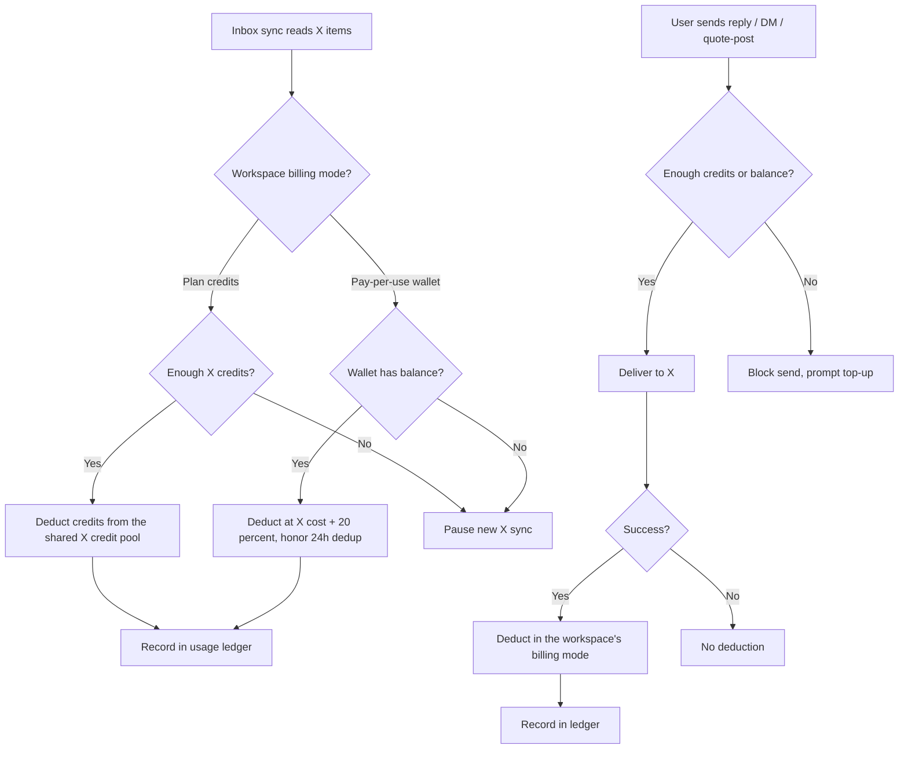
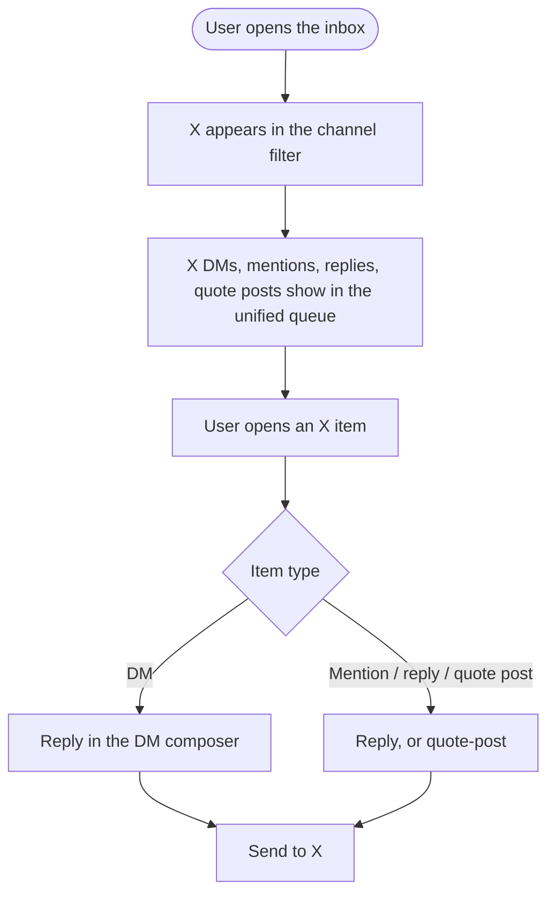
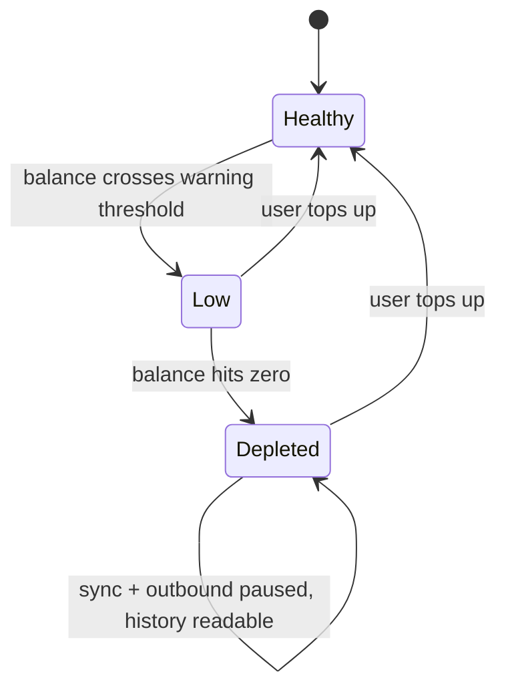

# Epic + Stories — X (Twitter) in the Social Inbox (pay-per-use)

Local deliverable. Nothing is pushed to Shortcut. The PO creates the epic + stories in Shortcut
manually, selecting the **New Feature Template** for each story. Stories reference each other by
full title (never number).

---

## EPIC — X (Twitter) in the Social Inbox (pay-per-use)

**Description**

Bring X (Twitter) into ContentStudio's social inbox so users manage X **DMs, mentions, replies,
and quote posts** in the same unified queue they already use for Facebook, Instagram, LinkedIn,
GMB, and YouTube — replying, DMing, assigning, noting, and resolving without leaving ContentStudio.
X is deliberately excluded from the inbox today; this epic makes it a first-class channel on web,
iOS, and Android.

Because X's API is metered (it charges per read and per write), X inbox usage is billed — metering
both syncing (reads) and outbound actions (writes). **Two billing models run side by side**, matching
how X billing already works elsewhere in the product: long-standing workspaces are billed in **X plan
credits** (the existing count-based pool shared with X publishing), and newer workspaces are billed
through the **X pay-per-use wallet** at **X's cost + a 20% markup**. The epic adheres to the existing
segmentation and rate card rather than defining its own.

The experience is built for transparency in either model: a live balance in the inbox, cost shown
before every metered action, staged low-balance warnings, and graceful degradation (pause sync +
outbound when empty, keep synced conversations readable) so an empty balance never loses messages.
Team-management actions (assign, note, status, tags) never cost credits, and BYO-app accounts (using
their own X API keys) are exempt from consumption.

This positions ContentStudio ahead of competitors who either bury X in $200+/seat plans, charge a
flat per-profile surcharge, or dropped X inbox entirely — by pricing X fairly per actual usage.

**Target release:** Q4 2026 · **Priority:** High · **Epic state:** To Do

**Stories (9):**
1. [BE] Add X as a sync strategy in the social inbox service (ingest DMs, mentions, replies, quote posts)
2. [BE] Meter X inbox usage against the workspace's X billing mode (plan credits or pay-per-use wallet)
3. [FE] Add X as a channel in the web inbox (locked until enabled) with reply, DM, and quote-post
4. [FE] Per-account X sync settings modal (frequency, interaction-type toggles, estimated cost)
5. [FE] X balance, cost preview, low-balance & top-up in the web inbox
6. [FE] Surface X billing in billing settings (credits or wallet balance, top-up, inbox usage)
7. [iOS] Add X to the mobile inbox with credit gating
8. [Android] Complete X in the mobile inbox with credit gating
9. [Design] X inbox — web credit surfaces, sync-settings modal, states, and mobile X rendering

---

## 1. [BE] Add X as a sync strategy in the social inbox service (ingest DMs, mentions, replies, quote posts)

### Description
Enable the social inbox backend to ingest a connected X account's **DMs, mentions, replies to its
posts, and quote posts**, so these appear in the unified inbox alongside other platforms. Today the
inbox service has no X strategy; this story adds one, mapping X activity into the existing inbox data
model and emitting real-time updates, and exposes the metering signals the billing story consumes.

### Workflow
1. When an X account is connected and has inbox enabled, the service begins syncing its DMs,
   mentions, replies, and quote posts from the connect time forward (X provides no history backfill).
2. Incoming X activity is stored as inbox items — DMs as conversations; mentions, replies, and quote
   posts as posts — and surfaced through the same list/detail/realtime paths as other platforms.
3. Outbound sends (reply, DM, quote-post) received from the app are delivered to X, and the sent item
   materializes in the thread.
4. Each sync reports the number of items read so usage can be metered (see the billing story).

### Acceptance criteria
- [ ] A connected X account's DMs, mentions, replies, and quote posts are ingested and stored as inbox items (DMs → conversation; mentions/replies/quote posts → post), scoped to the workspace.
- [ ] X items appear in the unified inbox list, buckets (all/unassigned/assigned/mine/done/archived), and detail views via the same endpoints as other platforms.
- [ ] Real-time updates for new X items/messages are emitted on the existing inbox realtime channel.
- [ ] Outbound reply, DM, and quote-post are delivered to X; on success the sent item appears in the thread; on failure an error is returned and nothing is marked sent.
- [ ] Syncing starts from connect time forward; no historical backfill is attempted; mentions/replies/quote posts respect X's ~7-day recent window.
- [ ] Sync honors **per-account settings**: a sync **frequency** (near-real-time / every 15 min / hourly / manual-only) and per-interaction-type **enable toggles** (DMs, mentions, replies, quote posts) — disabled types are not fetched (and therefore not billed).
- [ ] Per-account X sync settings (frequency + enabled types) are **persisted** and exposed via an API the web client reads/writes (used by the sync-settings modal); a **manual "sync now"** trigger is supported (like the X analytics manual sync).
- [ ] Each sync cycle reports items-read (with enough detail to honor X's 24-hour read de-duplication) to the billing/metering hook, and outbound sends report a write occurred on success.
- [ ] X polling respects X rate limits (including the tight DM read limit): on `429`/`Retry-After`, the service backs off and does not retry-spend.
- [ ] BYO-app X accounts (their own developer app) are ingested using their own API access and flagged so billing can exempt them.

### Mock-ups
N/A — backend only.

### Impact on existing data
Adds X (`platform: 'x'`/`twitter`) records into the existing inbox collections (conversations,
messages, comments). No new collections required (follows the existing "add a platform" pattern).
No changes to other platforms' data.

### Impact on other products
- Web + mobile inbox consume the new X items (see the FE/iOS/Android stories).
- Auto-reply inherits X once X events are emitted (auto-reply sends are metered writes).

### Dependencies
- Depends on: **[BE] Meter X inbox usage against the workspace's X billing mode (plan credits or pay-per-use wallet)** for the metering hook contract (build in parallel; agree the interface early).

### Global quality & compliance (wherever applicable)
- [ ] Mobile responsiveness — N/A, backend only
- [ ] Multilingual support — N/A, no user-facing copy
- [ ] UI theming support — N/A, backend only
- [ ] White-label domains impact review
- [ ] Cross-product impact assessment (web, mobile apps, Chrome extension)

### Implementation references
*Pointers from research — not a contract. Engineering may choose a different approach.*
- The inbox backend is the separate **`social-inbox-manager` (SIM)** service (FastAPI/Kafka/Mongo/Pusher), not the Laravel monolith. **SIM source was not available in research — verify internals first** (start at `social-inbox-manager/docs/ARCHITECTURE.md`).
- Follow the **strategy-per-platform** pattern (`app/social_sync/<platform>_strategy.py`; Facebook/Instagram as templates) — add an X strategy + ingest/poll + register in the sync dispatch. Reuse the `inbox_details` / `inbox_messages` / `inbox_comments` repos with `platform: 'x'`.
- Laravel side: add X to `config/integrations.php` `inbox_channels` and social-platform configs; outbound proxies via `app/Http/Controllers/Api/V1/Inbox/*` → `InboxServiceClient` → SIM (`/inbox/send_text_message`, `/inbox/send_media_message`). The WhatsApp-inbox research doc is the closest "add a platform" template (but predates the SIM-centric architecture).
- X specifics: DMs/mentions via Account Activity API + recent-search; **reads are metered by X**, so favour webhook push where available and minimize redundant polling (honor 24h dedup).

### Shortcut fields
- **Template:** New Feature Template · **Story type:** feature · **Project:** Web App · **Group:** Backend
- **Epic:** X (Twitter) in the Social Inbox (pay-per-use) · **Priority:** High · **Product Area:** Inbox · **Skill Set:** Backend
- **Estimate:** _(empty)_ · **Labels:** _(none)_ · **Iteration:** _(PO assigns)_

---

## 2. [BE] Meter X inbox usage against the workspace's X billing mode (plan credits or pay-per-use wallet)

### Description
Bill X inbox usage against whichever X billing model the workspace is already on. **Two models run
side by side:** long-standing workspaces are billed in **X plan credits** (the existing count-based
credit system, shared with X publishing), and newer workspaces are billed through the **X pay-per-use
wallet** in dollars at **X's API cost + 20% markup**. Both **syncing (reads)** and **outbound actions
(writes)** are metered in either model, and every deduction is recorded in a usage ledger.

The inbox does **not** decide which model applies and does **not** define credit rates — the
workspace's billing mode and the X credit rate card are both handled by the existing X billing work.
This story consumes that decision and bills accordingly. When a workspace runs out — credits or
wallet balance — X syncing and outbound pause gracefully while already-synced conversations stay
readable. This is the billing core the inbox UI reads from.

### Workflow

1. On each X sync, the service resolves the workspace's X billing mode, checks that it has enough
   credits (or wallet balance) and deducts for the items returned (honoring X's 24h de-dup),
   recording each deduction in the usage ledger.
2. On an outbound reply/DM/quote-post, the balance is checked, the action is delivered to X, and the
   deduction happens **only on success** — in the workspace's billing mode.
3. Team-management actions (assign, note, status, tags) never deduct credits in either model.
4. When credits or wallet balance are insufficient, syncing pauses and outbound is blocked with a
   top-up prompt; already-synced conversations remain readable.

### Acceptance criteria

**Billing mode routing**
- [ ] Every metered X inbox action resolves the workspace's X billing mode using the **existing** X billing segmentation (plan credits for long-standing workspaces, pay-per-use wallet for newer ones) — this story **adheres to** that rule and does not define, duplicate, or override it.
- [ ] A workspace is billed in exactly one model at a time; no action is ever double-charged against both credits and the wallet.
- [ ] If a workspace's billing mode changes, subsequent X inbox actions bill in the new mode with no manual intervention, and the usage ledger records which mode each entry was charged in.

**Pay-per-use wallet workspaces**
- [ ] X inbox reads are deducted at **$0.006 per post/mention/reply/quote read** and **$0.012 per DM read** (X cost + 20%), per item returned, honoring X's 24-hour read de-duplication (re-polled items within 24h are not re-charged).
- [ ] X inbox writes are deducted at **$0.018 per reply/quote-post**, **$0.24 per post containing a link**, and **$0.018 per DM sent** (X cost + 20%), **only on successful delivery**.
- [ ] Deductions draw from the **same X wallet** as publishing/analytics (shared balance), not a separate inbox balance.
- [ ] Pricing (X base cost + markup) is configuration-driven, not hardcoded, so rates can be updated without a deploy.

**Plan-credit workspaces**
- [ ] X inbox reads and writes are deducted in **X credits using the existing X credit rate card** — this story does not introduce new rates; the per-action credit costs come from the shipped rate card configuration.
- [ ] Inbox usage draws from the **same monthly X credit pool as X publishing** (a single shared balance and a single top-up path) — there is no separate inbox credit allowance.
- [ ] Because the pool is shared, inbox activity can exhaust the credits that publishing also needs; the depletion behaviour below applies to both, and the clients warn the user before the pool runs low.
- [ ] Write deductions happen **only on successful delivery**; reads honor X's 24-hour de-duplication so re-polled items are not charged twice.
- [ ] The monthly credit reset applies to inbox usage exactly as it does to publishing usage — no separate reset.

**Both models**
- [ ] Team-management actions (assign, note, mark done/pending, archive, tag) deduct **no** credits in either model.
- [ ] All deductions are **atomic** and appended to a usage ledger with: timestamp, workspace/account, action type (`inbox_read` / `inbox_send`), billing mode, quantity, charged amount (credits or dollars), underlying X cost, and resulting balance.
- [ ] **BYO-app accounts** (their own `developer_app_id`) are exempt in both models — their X inbox reads/writes deduct nothing.
- [ ] When credits or wallet balance are insufficient, **new X syncing pauses** and **outbound X actions are blocked**; already-synced conversations remain readable; no incoming messages are dropped; syncing/outbound resume automatically after top-up or the monthly reset.
- [ ] The current balance, the workspace's billing mode, and recent X inbox usage are readable by the web + mobile clients (for the balance chip, cost preview, and usage display), so a client can render the correct unit (credits vs dollars) without guessing.
- [ ] The applicable per-action rate card is readable by the clients so the sync-settings modal can compute a **generic per-frequency cost estimate** in the workspace's own unit.
- [ ] Only **enabled** interaction types are metered (a disabled type is neither fetched nor billed).
- [ ] When the balance reaches zero and X sync/outbound pause, an `x_inbox_credits_depleted` Usermaven event fires (server-side) with `{ workspace_id, billing_mode }`.

### Mock-ups
N/A — backend only (UI in the FE/mobile stories).

### Impact on existing data
Adds X inbox action types (`inbox_read`, `inbox_send`) to the pricing config and usage ledger of both
billing models, and records the billing mode on each ledger entry. Wallet workspaces draw down the
same X wallet balance used by publishing/analytics; credit workspaces draw down the same monthly X
credit pool used by X publishing (no new limit, no new reset). No changes to other platforms' billing.

### Impact on other products
- Web + mobile inbox read balance/cost/billing mode from this story and render the matching unit.
- **X publishing shares the credit pool** for credit-billed workspaces — inbox usage now competes
  with publishing for the same monthly credits. Regression-test that publishing's checks, deduction,
  top-up, and monthly reset still behave correctly once inbox also draws on the pool.
- Shares the wallet with publishing/analytics for wallet workspaces — verify the shared balance
  semantics don't regress those flows.

### Dependencies
- Depends on: **[BE] Add X as a sync strategy in the social inbox service (ingest DMs, mentions, replies, quote posts)** for the read/write metering signals.

### Implementation references
*Pointers from research — not a contract. Engineering may choose a different approach.*
- **Reads happen in SIM; the wallet is in Laravel** — no connection today. Recommended (workflow D1): SIM calls a **Laravel internal wallet endpoint** (reuse the JWT-authed Laravel↔SIM bridge + `InternalApiMiddleware` internal-route pattern) to check + **batch-deduct per sync cycle**. Outbound deduction wraps the Laravel inbox proxy (`InboxConversationController` `send_text_message`/`send_media_message`).
- **Both billing backends are live and both are targets.** The count-based credit model is shipped: `used_x_posting_credits` on the workspace doc vs. `limits.x_posting_credits`, rate card + helpers in `app/Helpers/Billing/PlanHelper.php` (`calculateXPostingCreditCost`, `checkAvailableXPostingCredits`, `hasInsufficientXPostingCredits`, `deductXPostingCredits`), Paddle addon `x_posting_credits`, monthly `usedCredits:reset` cron. The dollar wallet + generic usage ledger comes from the X pay-per-use wallet work (`contentstudio-backend/docs/features/x-pay-per-use-credits/`). Route to whichever the workspace is on rather than picking one.
- **Gotcha — the shipped credit deduction is non-atomic** (`deductXPostingCredits` is read-modify-write). Inbox sync deducts far more frequently than publishing does, so the race window that is tolerable for posting is not tolerable here; make the credit path atomic or serialize per workspace before wiring sync to it.
- **Don't re-implement the old/new split or the credit rates** — the segmentation rule and the X credit rate card are owned by the existing X billing work. Read them from that configuration; if a helper doesn't exist yet, ask for one rather than inlining a date check or a rate table in the inbox path.
- BYO-app exemption mirrors publishing's `$isContentStudioApp` check (`TwitterPlatform.php`); `developer_app.analytics_enabled` on `developer_apps`.
- Pricing: X base rates are read $0.005 / DM read $0.010 / write $0.015 / link $0.20 / DM send $0.015; apply +20%.

### Global quality & compliance (wherever applicable)
- [ ] Mobile responsiveness — N/A, backend only
- [ ] Multilingual support — N/A, no user-facing copy (client copy in FE stories)
- [ ] UI theming support — N/A, backend only
- [ ] White-label domains impact review
- [ ] Cross-product impact assessment (web, mobile apps, Chrome extension)

### Shortcut fields
- **Template:** New Feature Template · **Story type:** feature · **Project:** Web App · **Group:** Backend
- **Epic:** X (Twitter) in the Social Inbox (pay-per-use) · **Priority:** High · **Product Area:** Inbox · **Skill Set:** Backend
- **Estimate:** _(empty)_ · **Labels:** _(none)_ · **Iteration:** _(PO assigns)_

---

## 3. [FE] Add X as a channel in the web inbox (locked until enabled) with reply, DM, and quote-post

### Description
As a user, I want my X account's DMs, mentions, replies, and quote posts in the web inbox alongside
my other platforms, and to reply, DM, and quote-post from there — so I manage X without leaving
ContentStudio. X is excluded from the inbox today; this story makes it a selectable channel and wires
X sending through the existing composer. Because X is pay-per-use, X accounts appear **locked** in the
channel filter until the workspace's X wallet/credits are enabled — clicking the lock starts setup
(top-up + sync settings). (Credit balance, cost preview, and top-up UI are a separate story; this story
handles surfacing X, the locked state, and sending.)

### Workflow

1. In the inbox, **X** appears in the channel filter with the other platforms; the user selects it.
2. X items appear in the unified queue with an X badge — DMs as conversations; mentions, replies, and
   quote posts as posts — with correct thread grouping and read/unread + assignment states.
3. The user opens an X item and replies, sends a DM, or quote-posts from the composer; the sent item
   appears in the thread.
4. Team actions (assign, note, mark done, tag) work on X items exactly as on other platforms.
5. New X activity arrives in real time.

### Acceptance criteria
- [ ] X appears as a selectable channel in the inbox channel filter alongside Facebook, Instagram, LinkedIn, GMB, and YouTube (X is no longer excluded).
- [ ] An X account whose X wallet/credits are **not yet enabled** shows a **lock icon** in the channel filter/account list, with the tooltip: "Unlock X for your inbox — X uses pay-per-use credits."
- [ ] Clicking a locked X account opens the setup path (top-up + the sync-settings modal); once the wallet is enabled the lock is removed and the account syncs normally.
- [ ] X DMs render as conversations; X mentions, replies, and quote posts render as posts, each with an X badge and correct thread grouping.
- [ ] The inbox buckets, filters, search, assignment, notes, statuses, and tags all work on X items.
- [ ] The user can send a **reply**, a **DM**, and a **quote-post** on the appropriate X item types from the existing composer; sent items appear in the thread; send errors show a message and preserve the draft.
- [ ] **Quote-post** as an outbound action is behind a feature flag: when X access doesn't permit it, the "Quote post" action is hidden/disabled with the tooltip: "Quote posting isn't available on your current X plan."
- [ ] New X items/messages appear in real time without a manual refresh.
- [ ] Empty state for X (no items yet): headline "No X messages yet" · subtext "New DMs, mentions, replies, and quote posts will appear here once they come in. X shows activity from about the last 7 days."
- [ ] Loading and error states render for the X list and detail (skeleton while loading; on load failure: "Couldn't load X messages. Retry." with a Retry action).
- [ ] When an X reply/DM/quote-post send succeeds, an `x_inbox_reply_sent` Usermaven event fires with `{ workspace_id, type: 'dm'|'reply'|'quote', has_link }`.

### Mock-ups
See PRD section 7 and the [Design] story. Mockups to be attached by the PO.

### Impact on existing data
None (client-only). Consumes X inbox items from the backend.

### Impact on other products
- Pairs with the mobile stories for X on iOS/Android.
- Credit gating on send is finalized in **[FE] X credit balance, cost preview, low-balance & top-up in the web inbox**.

### Dependencies
- Depends on: **[BE] Add X as a sync strategy in the social inbox service (ingest DMs, mentions, replies, quote posts)**.
- Related: **[FE] X credit balance, cost preview, low-balance & top-up in the web inbox** (the credit UX layered on send).

### Implementation references
*Pointers from research — not a contract. Engineering may choose a different approach.*
- Remove the `if (item.name === 'twitter') return` guard in `filteredChannels` and seed `selectedChannels.twitter = []` in `src/modules/inbox-revamp/composables/useInboxUI.ts`. `InboxPlatform` already includes `'twitter'`, and `getSocialImageRounded('twitter')` already yields the X badge.
- Send is platform-agnostic (`platform_type`) via `useSendTextMessageMutation` / `useSendCommentMutation` (`src/api/inbox-revamp.ts`); route X through the same. Real-time rides existing `new_message`/`new_comment`/`new_element` events (`views/InboxView.vue`).
- Mentions/quote posts reuse the `post` element type in v1 (workflow D3) — confirm the backend emits them that way.

### Global quality & compliance (wherever applicable)
- [ ] Mobile responsiveness (frontend)
- [ ] Multilingual support (all 8 locales)
- [ ] UI theming support (default + white-label; design library components)
- [ ] White-label domains impact review
- [ ] Cross-product impact assessment (web, mobile apps, Chrome extension)

### Shortcut fields
- **Template:** New Feature Template · **Story type:** feature · **Project:** Web App · **Group:** Frontend
- **Epic:** X (Twitter) in the Social Inbox (pay-per-use) · **Priority:** High · **Product Area:** Inbox · **Skill Set:** Frontend
- **Estimate:** _(empty)_ · **Labels:** _(none)_ · **Iteration:** _(PO assigns)_

---

## 4. [FE] Per-account X sync settings modal (frequency, interaction-type toggles, estimated cost)

### Description
As a user enabling X in the inbox, I want to choose — **per X account** — how often it syncs and which
interaction types to bring in, and see the estimated cost, so I control how much X syncing costs me.
This mirrors the per-account sync scheduling we already offer for X analytics. The modal is the setup
step a locked X account opens, and it's reachable again later from the account's settings.

The estimate is shown in the workspace's own billing unit — **credits** for workspaces on X plan
credits, **dollars** for workspaces on the X pay-per-use wallet — using the rate card the backend
reports for that workspace.

### Workflow
1. From a locked X account (or its settings), the user opens **X sync settings** for that account.
2. The user picks a **sync frequency** and toggles which **interaction types** to sync (DMs, mentions,
   replies, quote posts).
3. The modal shows an **estimated credit cost** for the chosen frequency + enabled types (with a caveat
   that actual cost depends on activity volume).
4. The user saves; the account begins (or updates) syncing per those settings. A **"Refresh now"** action
   triggers an immediate manual sync.

### Acceptance criteria
- [ ] The modal is **per X account** (each connected X account has its own settings), matching the per-account X analytics sync pattern.
- [ ] **Sync frequency** options: "Near real-time", "Every 15 minutes", "Hourly", "Manual only" (single-select). "Near real-time" is labeled as bounded by X limits.
- [ ] **Interaction-type toggles** (independent on/off): "Direct messages", "Mentions", "Replies to your posts", "Quote posts". At least one type must be enabled to turn syncing on; disabled types are not synced or billed.
- [ ] An **estimated cost** line updates as frequency/types change, in the workspace's own unit: credits — "Estimated cost: about {n} credits/day at this frequency." · wallet — "Estimated cost: about {amount}/day at this frequency." Both carry the caveat "Actual cost depends on how much activity your account gets." (Estimate is a generic per-frequency figure from the rate card, not per-account volume.)
- [ ] The unit shown comes from the billing mode the backend reports; the modal never hardcodes credits or dollars.
- [ ] If the workspace has no credits/balance, the modal shows: "You'll need X credits to start syncing." (wallet: "You'll need X balance to start syncing.") with a "Top up" action, and Save stays disabled until credits/balance are available (or Save records settings and prompts top-up — dev's choice, but syncing must not start without them).
- [ ] A **"Refresh now"** action performs an immediate one-off sync of the account's enabled types (subject to available credits and rate limits).
- [ ] Saving persists the settings (per Story 1's settings API) and applies them to syncing.
- [ ] Copy uses theme tokens and exists in all 8 locales.
- [ ] When the user saves changed sync settings, an `x_inbox_sync_cadence_changed` Usermaven event fires with `{ workspace_id, cadence }`.

### UI Copy
- Modal title: **X sync settings — @{handle}**
- Intro: "Choose how often to sync this X account and what to bring into your inbox. X charges for every sync, so syncing less often or turning off some types costs less."
- Section "Sync frequency": Near real-time · Every 15 minutes · Hourly · Manual only
- Helper under frequency: "More frequent syncing finds new messages faster but costs more."
- Section "What to sync": Direct messages · Mentions · Replies to your posts · Quote posts (each a toggle)
- Estimated cost — credits: "Estimated cost: about {n} credits/day at this frequency." · wallet: "Estimated cost: about {amount}/day at this frequency." · caveat (both): "Actual cost depends on how much activity your account gets."
- Primary CTA: **Save sync settings** · secondary: **Refresh now** · nothing-available inline: "You'll need X credits to start syncing." / "You'll need X balance to start syncing." + **Top up**
- For credit-billed workspaces only, under the estimate: "These credits are shared with X publishing."

### Mock-ups
See PRD section 7 and the [Design] story. Mockups to be attached by the PO.

### Impact on existing data
None (client-only). Reads/writes the per-account X sync settings exposed by the backend.

### Impact on other products
- Mobile v1 shows the account's sync status; full editing of sync settings is web-first (mobile may open it via webview or defer editing).

### Dependencies
- Depends on: **[BE] Add X as a sync strategy in the social inbox service (ingest DMs, mentions, replies, quote posts)** (settings API + manual sync) and **[BE] Meter X inbox usage against the workspace's X billing mode (plan credits or pay-per-use wallet)** (rate card for the estimate).
- Related: **[FE] Add X as a channel in the web inbox (locked until enabled) with reply, DM, and quote-post** (the lock opens this modal).

### Implementation references
*Pointers from research — not a contract. Engineering may choose a different approach.*
- Mirror the existing **X analytics per-account job settings** modal pattern (`TwitterJobSettingsModal` / `createTwitterJob`/`updateTwitterJob` referenced in `useTwitterAnalytics`) for the frequency scheduling shape.
- Compute the estimate client-side from the rate card (Story 2) × a generic per-frequency volume assumption; reuse `xCredits.ts` rates where applicable.

### Global quality & compliance (wherever applicable)
- [ ] Mobile responsiveness (frontend)
- [ ] Multilingual support (all 8 locales)
- [ ] UI theming support (default + white-label; design library components)
- [ ] White-label domains impact review
- [ ] Cross-product impact assessment (web, mobile apps, Chrome extension)

### Shortcut fields
- **Template:** New Feature Template · **Story type:** feature · **Project:** Web App · **Group:** Frontend
- **Epic:** X (Twitter) in the Social Inbox (pay-per-use) · **Priority:** High · **Product Area:** Inbox · **Skill Set:** Frontend
- **Estimate:** _(empty)_ · **Labels:** _(none)_ · **Iteration:** _(PO assigns)_

---

## 5. [FE] X balance, cost preview, low-balance & top-up in the web inbox

### Description
As a user, I want to see my X balance in the inbox, know what each X action costs before I do it, get
warned before I run out, and top up in a click — so X's metered billing feels transparent and I'm
never surprised. This story adds the credit surfaces around the X inbox, reusing the existing X credit
components.

**Two billing models must be supported**: workspaces on **X plan credits** see a credit count and
credit costs, and workspaces on the **X pay-per-use wallet** see a dollar balance and dollar costs.
The client renders whichever the workspace is on — it never guesses or hardcodes one unit. Everything
else (thresholds, banners, blocked sends, top-up entry point) behaves identically in both.
(Per-account sync frequency lives in the sync-settings modal story.)

### Workflow

1. The inbox header shows a live **X credit balance**.
2. When composing an X reply/DM/quote-post, the composer shows the **credit cost** before sending
   (higher if the reply contains a link).
3. As the balance drops, **staged low-balance banners** appear; the user can **top up** in a click.
4. At zero, X sync and outbound are **paused** with a clear message; existing conversations stay
   readable; topping up resumes them.
5. In settings, the user can set each X account's **sync frequency**, which controls credit burn, and
   trigger a **manual refresh**.

### Acceptance criteria

**Balance and cost, in the workspace's own unit**
- [ ] The inbox header shows the workspace's current X balance whenever an X account is active — "X credits: {balance}" for credit-billed workspaces, "X balance: {amount}" for wallet workspaces.
- [ ] The unit shown always comes from the billing mode reported by the backend; the client never assumes one model or renders both.
- [ ] Before sending an X reply/DM/quote-post, the composer shows the cost in that unit: credits — "This will use about {n} credits." · wallet — "This will cost about {amount}."
- [ ] When the reply contains a link, the higher cost is shown: credits — "Replies with a link use more — about {n} credits." · wallet — "Replies with a link cost more — about {amount}."
- [ ] For credit-billed workspaces, the header/banner copy makes the shared pool explicit: "These credits are shared with X publishing."

**Warnings, blocking and top-up (identical in both models)**
- [ ] A low-balance banner appears at staged thresholds: credits — "You're running low on X credits ({n} left). Top up to keep syncing and replying." · wallet — "You're running low on X balance ({amount} left). Top up to keep syncing and replying." with a "Top up" button.
- [ ] When depleted, a banner shows: "You're out of X credits. Syncing and sending for X are paused. Your existing X conversations stay available — top up to resume." (wallet: "out of X balance") with a "Top up" button.
- [ ] For credit-billed workspaces the depleted banner also warns about the shared pool: "This also pauses X publishing until your credits reset or you top up."
- [ ] When the user tries to send an X action with insufficient credits/balance, the send is blocked inline: "You're out of X credits — top up to reply." (draft preserved) with a "Top up" button.
- [ ] The "Top up" action opens the top-up flow for the workspace's model — the existing X credit addon purchase for credit workspaces, the wallet top-up for wallet workspaces; on completion the balance refreshes and any paused X sync/outbound resumes.
- [ ] For credit-billed workspaces, a monthly credit reset also clears the paused state without a top-up.
- [ ] BYO-app X accounts (own API keys) show no cost or balance gating in either model (they're not metered); if helpful, show "Uses your own X API — no ContentStudio credits."
- [ ] A one-time note is shown when enabling X for the inbox, matching the workspace's model — wallet: "X charges per action. ContentStudio charges X's API cost plus 20%. Both syncing new activity and sending replies or DMs use your X balance." · credits: "Syncing new activity and sending replies or DMs both use X credits, shared with your X publishing." Both versions add: "X only provides about the last 7 days of mentions, and past messages aren't imported when you connect."
- [ ] All copy uses theme tokens (no hardcoded colors) and exists in all 8 locales.
- [ ] When a top-up completes, the existing `addon_purchased` Usermaven event fires with `{ addon: 'x_posting_credits' }`.

### Mock-ups
See PRD section 7 and the [Design] story. Mockups to be attached by the PO.

### Impact on existing data
None (client-only). Reads balance/usage and sync-cadence settings from the backend.

### Impact on other products
- Reuses the shared X wallet UI also used by publishing; keep behavior consistent.
- Mobile shows a read-only balance/cost and tops up via webview (see mobile stories).

### Dependencies
- Depends on: **[BE] Meter X inbox usage against the workspace's X billing mode (plan credits or pay-per-use wallet)** (balance, usage, cadence).
- Depends on: **[FE] Add X as a channel in the web inbox with reply, DM, and quote-post** (the send surface the cost preview attaches to).

### Implementation references
*Pointers from research — not a contract. Engineering may choose a different approach.*
- Reuse `src/modules/composer/utils/xCredits.ts` (`calcXCredits`), `composer/components/TwitterPostUsageAlert.vue` (cost preview/warnings), `components/common/TwitterPostingAddon.vue` (top-up), `useTwitterLockGate.ts` (locked → open purchase modal), and `fetchTwitterPostingLimitsApi` for balance. Existing i18n namespaces: `composer.twitter_usage_alert.*`, `common.twitter_posting_addon.*`.
- Composer already has a `credits_full` server-error path (`inbox.message_composer.ai.notifications.credits_full`) — precedent for the out-of-credits send state.

### Global quality & compliance (wherever applicable)
- [ ] Mobile responsiveness (frontend)
- [ ] Multilingual support (all 8 locales)
- [ ] UI theming support (default + white-label; design library components)
- [ ] White-label domains impact review
- [ ] Cross-product impact assessment (web, mobile apps, Chrome extension)

### Shortcut fields
- **Template:** New Feature Template · **Story type:** feature · **Project:** Web App · **Group:** Frontend
- **Epic:** X (Twitter) in the Social Inbox (pay-per-use) · **Priority:** High · **Product Area:** Inbox · **Skill Set:** Frontend
- **Estimate:** _(empty)_ · **Labels:** _(none)_ · **Iteration:** _(PO assigns)_

---

## 6. [FE] Surface X billing in billing settings (credits or wallet balance, top-up, inbox usage)

### Description
As an account admin / agency owner, I want to see and manage my X billing in billing settings —
balance, top-up, and a usage breakdown that now includes X **inbox** — so I can track and control X
spend across publishing, analytics, and inbox in one place.

Because **two billing models are live**, the section renders whichever applies to the workspace: the
**X credits** view (credits left this month, monthly limit, reset date) for credit-billed workspaces,
or the **X pay-per-use credits** view (dollar balance, auto-recharge, spending limit) for wallet
workspaces. Only one is ever shown. The wallet itself is being introduced separately (in development);
this story ensures billing settings surfaces both models with the inbox dimension included.

### Workflow
1. The user opens billing settings.
2. They see the X pay-per-use credits section: current balance, what it's used for, a usage breakdown
   (now including inbox), and a top-up action.
3. They top up; the balance updates.

### Acceptance criteria
- [ ] Billing settings shows the workspace's X billing section with its current balance — **X pay-per-use credits** (dollar balance) for wallet workspaces, **X credits** (credit count and monthly limit) for credit-billed workspaces. Only the applicable one is shown.
- [ ] It states that the balance is shared across X **publishing, analytics, and inbox** — for credit-billed workspaces this must be explicit, since inbox now draws on the same monthly pool as publishing.
- [ ] A **usage breakdown** shows consumption including X **inbox** (syncing reads + sends) alongside publishing and analytics, sourced from the usage ledger, in the workspace's own unit.
- [ ] For credit-billed workspaces the breakdown also shows credits remaining this month and the reset date, so a user can see whether inbox activity is eating into publishing credits.
- [ ] A **Top up** action opens the top-up flow for the workspace's model; the balance refreshes on completion.
- [ ] If the wallet supports **auto-recharge** and/or a **monthly spending limit**, they are surfaced and manageable here (wallet workspaces only).
- [ ] All copy uses theme tokens and exists in all 8 locales.
- [ ] On top-up completion, the existing `addon_purchased` Usermaven event fires with `{ addon: 'x_posting_credits' }` (do not double-count if the same completion is tracked elsewhere).

### UI Copy

**Wallet workspaces**
- Section title: **X pay-per-use credits**
- Balance: "Balance: {amount}"
- Subtext: "This balance is used across X publishing, analytics, and inbox."
- Usage rows: "Inbox — syncing & replies: {amount}" · "Publishing: {amount}" · "Analytics: {amount}"
- Primary CTA: **Top up balance**
- (If supported) "Auto-recharge when my balance runs low" · "Monthly spending limit"

**Credit-billed workspaces**
- Section title: **X credits**
- Balance: "{n} of {limit} credits left this month · resets {date}"
- Subtext: "These credits are shared across X publishing, analytics, and inbox — replying to DMs and syncing new activity use the same credits as publishing."
- Usage rows: "Inbox — syncing & replies: {n} credits" · "Publishing: {n} credits" · "Analytics: {n} credits"
- Primary CTA: **Top up credits**

### Mock-ups
See PRD section 7 and the [Design] story. Mockups to be attached by the PO.

### Impact on existing data
None (client-only). Reads wallet balance + the usage ledger.

### Impact on other products
Shares the wallet UI with publishing/analytics — keep consistent; coordinate with the in-development X wallet feature so the section isn't duplicated.

### Dependencies
- Depends on: **[BE] Meter X inbox usage against the workspace's X billing mode (plan credits or pay-per-use wallet)** (balance + inbox usage in the ledger).
- Coordinates with the in-development X pay-per-use wallet feature (the wallet itself is not built by this epic).

### Implementation references
*Pointers from research — not a contract. Engineering may choose a different approach.*
- The `x_posting_credits` addon already surfaces in billing limits (`src/modules/billing/constants/billingAddonCatalog.ts`, `ADDON_KEYS.X_POSTING_CREDITS`); balance/limit render via `billing/components/LimitItem.vue` and `setting/components/billing/LimitCard.vue`; top-up via `useBilling().handleIncreaseLimitsClick(ADDON_KEYS.X_POSTING_CREDITS)`. Add the inbox usage rows from the wallet's usage ledger.

### Global quality & compliance (wherever applicable)
- [ ] Mobile responsiveness (frontend)
- [ ] Multilingual support (all 8 locales)
- [ ] UI theming support (default + white-label; design library components)
- [ ] White-label domains impact review
- [ ] Cross-product impact assessment (web, mobile apps, Chrome extension)

### Shortcut fields
- **Template:** New Feature Template · **Story type:** feature · **Project:** Web App · **Group:** Frontend
- **Epic:** X (Twitter) in the Social Inbox (pay-per-use) · **Priority:** Medium · **Product Area:** Billing · **Skill Set:** Frontend
- **Estimate:** _(empty)_ · **Labels:** _(none)_ · **Iteration:** _(PO assigns)_

---

## 7. [iOS] Add X to the mobile inbox with credit gating

### Description
As an iOS user, I want to manage my X DMs, mentions, replies, and quote posts in the mobile inbox and
send replies/DMs/quote-posts — so I can handle X on the go. The iOS inbox supports other platforms but
does not surface X today; this story adds X rendering and sending, shows the X credit balance/cost
read-only, surfaces the **locked-until-enabled** state, and routes top-up to the web flow.

### Workflow
1. The user opens the inbox on iOS; X items (DMs, mentions, replies, quote posts) appear with an X badge.
2. The user opens an X item and replies, DMs, or quote-posts; sent items appear in the thread.
3. The X credit balance and per-action cost are visible; when out of credits, sending is blocked with a prompt to top up on the web.

### Acceptance criteria
- [ ] An X account whose X wallet/credits aren't enabled shows a **lock icon**; tapping it routes to the web top-up/setup flow (webview). Once enabled, the lock is removed.
- [ ] X DMs, mentions, replies, and quote posts render in the iOS inbox with an X badge and correct grouping (DMs as conversations; the rest as posts).
- [ ] The user can send a reply, DM, and quote-post (quote-post hidden/disabled when X access doesn't permit it, with the tooltip: "Quote posting isn't available on your current X plan.").
- [ ] Inbox management (assign, note, status, tags) works on X items.
- [ ] The X balance is shown read-only in the unit the backend reports for that workspace — a credit count for credit-billed workspaces, a dollar balance for pay-per-use wallet workspaces. The app renders whichever it receives and never hardcodes one model.
- [ ] Before sending, the cost is shown in the same unit ("This will use about {n} credits." / "This will cost about {amount}."); team actions show no cost.
- [ ] When out of credits/balance, sending X actions is blocked with: "You're out of X credits. Top up on the web to continue." (wallet: "out of X balance") and a button opening the web top-up flow in a webview; existing X conversations stay readable.
- [ ] BYO-app X accounts are not credit-gated in either model.
- [ ] New X items appear via the existing real-time mechanism.
- [ ] All new copy is localized per the app's existing localization approach.

### Mock-ups
See PRD section 7 and the [Design] story. Mockups to be attached by the PO.

### Impact on existing data
None (client-only).

### Impact on other products
Mirrors the web X inbox; pairs with the Android story.

### Dependencies
- Depends on: **[BE] Add X as a sync strategy in the social inbox service (ingest DMs, mentions, replies, quote posts)** and **[BE] Meter X inbox usage against the workspace's X billing mode (plan credits or pay-per-use wallet)**.

### Implementation references
*Pointers from research — not a contract. Engineering may choose a different approach.*
- iOS (`contentstudio-ios-v2/`, UIKit/Swift): the inbox exists (FB/IG/LinkedIn/GMB) but **X is not surfaced** — only an account-filter reference + dormant tweet model fields (`ElementDetails.swift`: `retweetCount`, `tweetAttachment`). Per-platform rendering is hardcoded `if platform == …` chains in `PlatformPostViewController`, `ConversationViewController`, `InboxTableTableViewController` — add an X asset + branches, and cell types for mention/quote. Send path (`ServiceManager.Reply` / `sendChatMessage`) is platform-agnostic. No native billing UI exists → top-up via webview.

### Global quality & compliance (wherever applicable)
- [ ] Mobile responsiveness (native iOS)
- [ ] Multilingual support (app localization)
- [ ] UI theming support — N/A (no dark mode; standard app theming)
- [ ] White-label domains impact review
- [ ] Cross-product impact assessment (web, mobile apps, Chrome extension)

### Shortcut fields
- **Template:** New Feature Template · **Story type:** feature · **Project:** Mobile · **Group:** Frontend _(assign the iOS/mobile team at creation — no dedicated mobile group in config)_
- **Epic:** X (Twitter) in the Social Inbox (pay-per-use) · **Priority:** High · **Product Area:** iOS Mobile · **Skill Set:** Frontend
- **Estimate:** _(empty)_ · **Labels:** _(none)_ · **Iteration:** _(PO assigns)_

---

## 8. [Android] Complete X in the mobile inbox with credit gating

### Description
As an Android user, I want full X inbox support — DMs, mentions, replies, and quote posts — with
sending and credit visibility. The Android inbox already has substantial X support (DMs, posts,
mentions); this story completes it (quote posts), adds credit balance/cost, the **locked-until-enabled**
state, and gating, and routes top-up to the web flow.

### Workflow
1. The user opens the inbox on Android; X DMs, mentions, replies, and quote posts appear with an X badge.
2. The user replies, DMs, or quote-posts; sent items appear in the thread.
3. The X credit balance and per-action cost are visible; out of credits blocks sending with a top-up prompt.

### Acceptance criteria
- [ ] An X account whose X wallet/credits aren't enabled shows a **lock icon**; tapping it routes to the web top-up/setup flow (webview). Once enabled, the lock is removed.
- [ ] X DMs, mentions, replies, and **quote posts** render in the Android inbox (completing existing X support) with correct grouping.
- [ ] The user can send a reply, DM, and quote-post (quote-post hidden/disabled when X access doesn't permit it, tooltip: "Quote posting isn't available on your current X plan.").
- [ ] Inbox management (assign, note, status, tags) works on X items.
- [ ] The X balance is shown read-only in the unit the backend reports for that workspace (credit count for credit-billed workspaces, dollar balance for pay-per-use wallet workspaces); before sending, the cost is shown in the same unit; team actions show no cost.
- [ ] When out of credits/balance, sending X actions is blocked with: "You're out of X credits. Top up on the web to continue." (wallet: "out of X balance") opening the web top-up flow in a webview; existing X conversations stay readable.
- [ ] BYO-app X accounts are not credit-gated in either model.
- [ ] New X items appear via the existing real-time mechanism.
- [ ] All new copy is localized per the app's existing localization approach.

### Mock-ups
See PRD section 7 and the [Design] story. Mockups to be attached by the PO.

### Impact on existing data
None (client-only).

### Impact on other products
Mirrors the web X inbox; pairs with the iOS story.

### Dependencies
- Depends on: **[BE] Add X as a sync strategy in the social inbox service (ingest DMs, mentions, replies, quote posts)** and **[BE] Meter X inbox usage against the workspace's X billing mode (plan credits or pay-per-use wallet)**.

### Implementation references
*Pointers from research — not a contract. Engineering may choose a different approach.*
- Android (`contentstudio-android-v2/`, Java): X is largely built — DMs via `Inbox/Chat/ChatActivity.java` (`platform == "twitter"`), posts/mentions/replies via `Inbox/Posts/TwitterPostsActivity.java` + `Model/TwitterModel/*` (`Tweets`, `ParentTweet`, `MentionedUser`). Gap is **quote-post parity** + **credit gating** (no native billing UI → webview top-up). Inbox is plan-gated via `getSubscriptionSocialInbox()`.

### Global quality & compliance (wherever applicable)
- [ ] Mobile responsiveness (native Android)
- [ ] Multilingual support (app localization)
- [ ] UI theming support — N/A (no dark mode; standard app theming)
- [ ] White-label domains impact review
- [ ] Cross-product impact assessment (web, mobile apps, Chrome extension)

### Shortcut fields
- **Template:** New Feature Template · **Story type:** feature · **Project:** Mobile · **Group:** Frontend _(assign the Android/mobile team at creation — no dedicated mobile group in config)_
- **Epic:** X (Twitter) in the Social Inbox (pay-per-use) · **Priority:** High · **Product Area:** Android Mobile · **Skill Set:** Frontend
- **Estimate:** _(empty)_ · **Labels:** _(none)_ · **Iteration:** _(PO assigns)_

---

## 9. [Design] X inbox — web credit surfaces, sync-settings modal, states, and mobile X rendering

### Description
Design the new surfaces this epic introduces: the **locked-until-enabled** X account state, the
per-account **sync-settings modal**, the X credit balance chip and cost preview in the inbox,
low-balance and out-of-credits states, the X-connect metering note, the X wallet section in billing
settings, and X item rendering on mobile (iOS especially, which has no X inbox today). Ensure
everything matches the ContentStudio design system and white-label theming.

### Design scope
- **Locked X account** state in the channel filter/account list (lock icon + tooltip + click-to-setup).
- **Per-account sync-settings modal**: frequency options, interaction-type toggles (DMs/mentions/replies/quote posts), estimated-cost line, no-credits state, "Refresh now".
- Inbox header **X balance** chip (healthy / low / depleted variants) — in **two unit treatments**, a credit count and a dollar balance, since both billing models are live.
- Composer **cost preview** (plain vs. with-link), in both unit treatments, reusing the existing X usage-alert pattern.
- **Low-balance** banner and **out-of-credits / paused** state (sync + outbound paused, history readable), including the credit-model variant that warns X publishing is affected too (shared pool).
- **Insufficient-credits send** inline block + top-up entry.
- **X-connect metering note** (one-time explainer) — one version per billing model.
- **X billing in billing settings**: the pay-per-use wallet section (dollar balance, usage breakdown incl. inbox, top-up, auto-recharge/limit) **and** the credit section (credits left this month, limit, reset date, usage breakdown, top-up).
- **X item rendering**: DM (conversation), mention/reply, and quote-post cells — web and mobile (iOS greenfield; Android quote-post parity).
- Empty / loading / error states for the X channel.

### Acceptance criteria
- [ ] Designs delivered for all surfaces above, in default and white-label theming, using design-system components.
- [ ] Every balance/cost surface is delivered in **both billing-model treatments** (X credits and pay-per-use dollar balance), since a given workspace sees only one and both must look native.
- [ ] States covered: healthy / low / depleted balance; loading / empty / error; send blocked; quote-post unavailable.
- [ ] Mobile (iOS + Android) X rendering specs delivered, consistent with the web patterns and each platform's conventions.
- [ ] Copy in designs matches the copy specified in the FE stories.

### Mock-ups
This story produces them.

### Impact on existing data
N/A — design.

### Impact on other products
Feeds the web + iOS + Android implementation stories.

### Dependencies
- Informs: the FE, iOS, and Android stories in this epic.

### Global quality & compliance (wherever applicable)
- [ ] Mobile responsiveness (designs cover mobile)
- [ ] Multilingual support — designs account for text expansion
- [ ] UI theming support (default + white-label)
- [ ] White-label domains impact review
- [ ] Cross-product impact assessment (web, mobile apps, Chrome extension)

### Shortcut fields
- **Template:** New Feature Template · **Story type:** feature · **Project:** Web App · **Group:** Design
- **Epic:** X (Twitter) in the Social Inbox (pay-per-use) · **Priority:** Medium · **Product Area:** Inbox · **Skill Set:** Design
- **Estimate:** _(empty)_ · **Labels:** _(none)_ · **Iteration:** _(PO assigns)_
