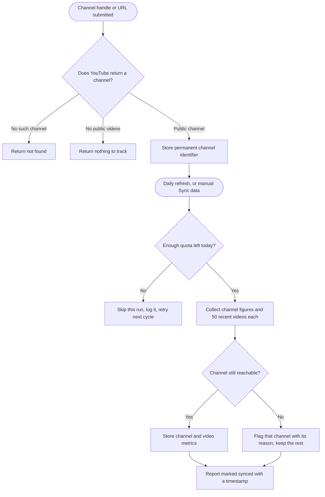
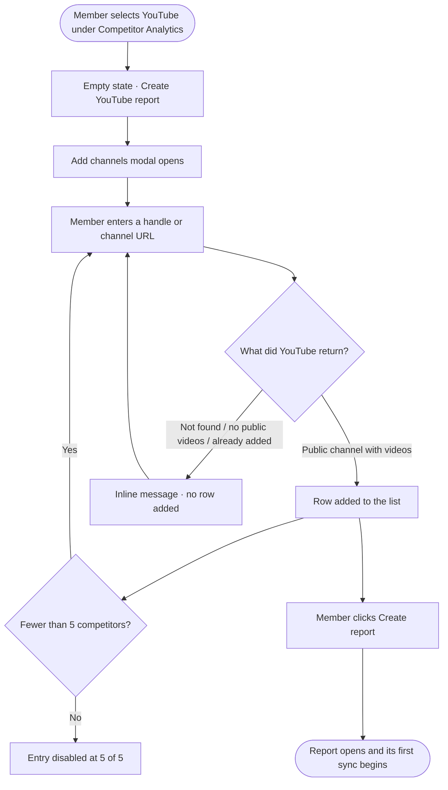

# 04 — Epic + Stories: YouTube Competitor Analytics

**Feature slug:** `youtube-competitor-analytics`
**Pipeline:** `/feature` — Step 4 (Epic + Stories)
**Date:** 2026-08-21
**Depends on epics:** Competitor Analytics Revamp (Facebook + Instagram) → X (Twitter) Competitor Analytics

> These stories are documentation for the Product Owner to recreate in the tracker by hand. Nothing is pushed anywhere. Web only — no mobile stories.

> **No money changes hands in this epic.** YouTube's API is free, so there is no wallet, no metering, no cost preview, no balance gate and no spend permission anywhere in these stories. The limits are a daily quota we cannot buy and a data-retention policy we must obey. That makes this a materially smaller epic than X competitor analytics, which needed all of the above.

---

## Epic

**Title:** YouTube Competitor Analytics

**Description:**

Competitor analytics lets a workspace compare up to five rival profiles against its own connected profile — followers, posting activity, engagement, hashtags, bios, and best and worst performing content, side by side. It ships for Facebook and Instagram today, with X in flight. This epic adds **YouTube** as another platform in the same module, with the same five-competitor cap and the same report shape: a full report is six channels, the workspace's own plus five rivals.

YouTube is the opposite problem from X. X was a money problem — the data is rich but every read costs cash. YouTube is a **permission and policy** problem: the API costs nothing, but almost everything that makes YouTube analytics valuable is visible **only to the channel owner**, and how long we may keep what we do collect is capped by Google's developer policies. Our own-channel YouTube report shows ten overview metrics; five of them — watch time, average view duration, dislikes, shares, and daily subscriber movement — can never appear in a competitor comparison, at any price.

What is left is still worth shipping, and in two places it is better than what the market offers. **Video tags are public**, so the hashtag widget we already ship for three networks works here unchanged and no competing tool exploits it. **Video duration is public**, so a Shorts-versus-long-form strategy comparison and a video length distribution both fall out for free. Because the data is free, YouTube also gets the Facebook and Instagram treatment rather than the X treatment: a **daily refresh**, with a manual **Sync data** button, and no price anywhere in the interface.

The two things that need care are honesty devices, not features. **YouTube rounds every subscriber count above 1,000 to three significant figures** for anyone who is not the channel owner, so a 48,217-subscriber channel reports 48.2K and small movements do not register at all — the report says so inline rather than leaving someone to file a bug. And **Google's policy caps how long we may store video titles and descriptions at 30 days** even where metrics may be kept for longer, so top-video cards refresh their text rather than serving it indefinitely from storage.

---

## PO-locked decisions

| # | Decision | Consequence |
|---|---|---|
| **D1** | **No metering, no wallet, no cost preview, no balance gate.** The API is free. | Removes an entire story's worth of work compared with X. The sync control behaves exactly as it does on the Facebook and Instagram reports. |
| **D2** | **Daily automatic refresh, plus a manual Sync data action.** | Matches Facebook and Instagram. The manual action is rate-limited per report because it draws on shared quota. |
| **D3** | **50 most recent videos per channel per sync.** | About 13 quota units per report sync, which keeps a daily refresh viable within our allocation. |
| **D4** | **Channels are added by handle or channel URL.** No keyword search. | Keyword search costs 100 quota units — more than seven full report syncs — and handle resolution costs 1. |
| **D5** | **Subscriber counts are presented as approximate**, with an inline explanation, and net change is labelled as movement in a rounded figure. | YouTube rounds to three significant figures above 1,000 subscribers. The workspace's own channel is exact, which the copy states. |
| **D6** | **The Dislikes metric is hidden inside competitor comparisons**, including for the workspace's own channel. | Dislikes are owner-only, so leaving the column in would produce a table where exactly one row is ever filled. |
| **D7** | **Three YouTube-only widgets are in scope:** views comparison, video length distribution, and content category mix. | All three come free from public fields and none has a Facebook, Instagram or X equivalent. |
| **D8** | **The hashtag widget is reused for video tags.** | `snippet.tags` is public. Keeps the module consistent across four platforms. |
| **D9** | **Access is governed by the existing competitor-analytics plan gate only.** No unlock gate. | There is no spending to consent to, so the second gate that X needs is not needed here. |
| **D10** | **Built on the revamped Facebook and Instagram components, after X competitor analytics.** | X opens the multi-platform seams in the competitor module. YouTube built afterwards is materially cheaper. |

**Assumption pending confirmation, written so either answer works:** whether Google's **derived-metrics and data-storage amendment** is already accepted for our project. With it, collected metrics may be kept for up to 36 months and trend charts can look back that far. Without it, everything is capped at 30 days. The stories below require the retention window to be **configuration, not a hardcoded constant**, and require the report to degrade to a 30-day window without breaking. Confirming this is the first story.

---

## What the report shows

Every widget below is buildable from public YouTube Data API v3 fields. Nothing here depends on owner-only access.

| Widget | Metrics | Note |
|---|---|---|
| Channel tiles | Subscribers, engagement rate, total views | Third stat is YouTube-specific |
| Performance comparison | Engagement rate against subscribers, sized by uploads per week | |
| Comparative table | Subscribers, net change, videos published, uploads per week, views, average views per video, engagement rate by subscribers, engagement rate by views, likes, comments | Subscribers rounded |
| Subscribers vs net change | Total subscribers and movement over the range | Degraded by rounding, disclosed inline |
| Posting activity by video type | Video count and engagement per type: Short, long-form, live or premiere | Type derived from duration and broadcast status |
| Video type insights grid | One chart per video type, two per row | |
| Activity by competitors, per type | Videos, total engagement, average engagement rate, per type | |
| Most engaged tags | Tag, channels using it, times used, engagement per video, engagement per subscriber | Video tags are public |
| Video engagement | Average engagement against uploads per week | |
| Engagement over time | Videos published and engagement per day, one channel at a time | |
| **Views comparison** | Total views and average views per video | **New, YouTube only** |
| **Video length distribution** | Duration spread per channel, bucketed | **New, YouTube only** |
| **Content category mix** | Share of uploads per YouTube category | **New, YouTube only** |
| Engagement split | Likes against comments per channel | Only two public engagement types exist |
| Top performing videos | 5 per channel, switchable by views or by engagement | Matches our own-channel report's toggle |
| Least performing videos | Same field set, inverted | |
| Channel profile analysis | Description and length, country, join date, lifetime video count, lifetime views, channel keywords, handle | Richer than the Meta bio widgets |
| AI insights | Inherited from the other competitor reports | Must never reference watch time or retention |

**Deliberately absent, because YouTube does not expose it for channels we do not own:** watch time, average view duration and view percentage, audience retention, impressions, click-through rate, traffic sources, demographics, daily subscriber gains and losses, shares, dislikes, revenue, exact subscriber counts, unlisted and private videos, and any history before a report's first sync.

---

## Analytics events (Usermaven)

Only two new events. There is no billing to instrument, and the guidelines say to default to not tracking. Report export reuses the existing `analytics_report_sections_customized` event with the YouTube competitor platform value.

| Event Name | Trigger | Payload | What we measure |
|---|---|---|---|
| `youtube_competitor_report_created` | Member saves a new YouTube competitor report (FE) | `{ competitor_count }` | Adoption, and whether people fill all five slots |
| `youtube_competitor_report_refreshed` | Member triggers a manual Sync data action (FE) | `{ channel_count }` | Whether the daily refresh is enough, or people reach for the button |

**Not tracked:** opening a report, changing the date range, switching the selected channel in a chart, sorting a table, adding or removing a channel. All read-only navigation or trivial interaction.

---

## Stories

| # | Title | Type | Priority | Depends on |
|---|---|---|---|---|
| 1 | [BE] Confirm YouTube API quota headroom and data-retention compliance for competitor reads | Backend | High (P0) | — |
| 2 | [Design] Design the YouTube competitor analytics experience | Design | High (P0) | Revamp epic |
| 3 | [BE] Build the YouTube competitor data pipeline: resolve channels, collect videos, store metrics | Backend | High (P0) | Compliance story |
| 4 | [BE] Serve the YouTube competitor report data endpoints | Backend | High (P0) | Data pipeline story |
| 5 | [BE] Add YouTube competitor reports to the PDF report generator | Backend | Medium (P1) | Report data endpoints story |
| 6 | [FE] Add YouTube to competitor analytics: platform switcher, reports list, and Add channels modal | Frontend | High (P0) | Design + data pipeline stories |
| 7 | [FE] Build the YouTube competitor report screen | Frontend | High (P0) | Design + report data endpoints stories |

---

## Story 1 — `[BE]` Confirm YouTube API quota headroom and data-retention compliance for competitor reads

### Description
As the team about to add competitor channel reads on top of our existing YouTube integration, I want to know exactly how much API quota we have, whether we are permitted to keep collected metrics beyond 30 days, and whether our approved use case covers reading channels a customer does not own, so that we build the retention and quota behaviour to match reality instead of guessing and discovering the answer in production.

This is a short confirmation-and-configuration story, not an application. We already have a working YouTube integration with owner-scoped access, so nothing here is about gaining access. It exists because three specific facts are not recorded anywhere in our own systems, and every trend window in this epic depends on one of them.

### Workflow
1. Engineering checks the current YouTube Data API v3 quota allocation for our project and records it.
2. Engineering establishes whether Google's derived-metrics and data-storage amendment has been accepted, and records the answer.
3. Engineering confirms whether our approved use case covers reading public channels the customer does not own.
4. The retention windows and the quota guard are configured to match what was found.
5. If any answer blocks the planned behaviour, the gap is raised to the Product Owner before the data-pipeline work starts.

### Acceptance criteria
- [ ] The project's current daily YouTube Data API v3 quota allocation is recorded, along with how much of it existing YouTube analytics already consumes on a typical day.
- [ ] Whether the derived-metrics and data-storage amendment has been accepted is recorded as a yes or no, with a link to the submission if one exists.
- [ ] Whether our approved use case covers reading channels the customer does not own is recorded, and if it does not, an amendment is submitted before competitor reads go live.
- [ ] A **metric retention window** is configurable, defaulting to the maximum the amendment permits when it is in force and to 30 days when it is not.
- [ ] A **text retention window** is configurable and capped at 30 days for video titles, descriptions and channel names, independent of the metric window, because the longer allowance never covers text.
- [ ] Existing YouTube analytics storage is audited against both windows, and any data held beyond what policy allows is reported to the Product Owner with a proposed remediation.
- [ ] A quota guard refuses to start new competitor collection when the day's remaining allocation would not cover a full report sync, and records that it did so.
- [ ] Quota exhaustion is distinguishable from a channel being unavailable, so a quota failure never marks a competitor as broken.
- [ ] An operational alarm fires when daily quota consumption crosses a configured share of the allocation.
- [ ] Findings are written up somewhere the team can find them later, so this question does not have to be asked a third time.

### Mock-ups
N/A — backend and operational only.

### Impact on existing data
May reveal that existing YouTube analytics data is retained longer than policy permits. Any remediation is scoped separately once the finding is confirmed — this story reports it rather than acting on it.

### Impact on other products
The quota allocation is shared with YouTube publishing and our own-channel YouTube analytics, so the guard added here protects those too. No customer-facing change.

### Dependencies
- None. This is the first story in the epic and gates the data pipeline.

### Global quality & compliance (wherever applicable)

- [ ] Mobile responsiveness — N/A, backend only
- [ ] Multilingual support — N/A, no user-facing copy
- [ ] UI theming support — N/A, backend only
- [ ] White-label domains impact review
- [ ] Cross-product impact assessment (web, mobile apps, Chrome extension)

---

## Story 2 — `[Design]` Design the YouTube competitor analytics experience

### Description
As the design owner for this epic, I want to design and sign off every YouTube competitor analytics surface so that engineering has one consistent visual spec for the platform entry, the Add channels modal, the report screen including its three YouTube-only widgets, and the states that arise when a tracked channel disappears — all matched to the revamped Facebook and Instagram competitor screens.

This story also carries a **design review pass**. A first-pass mock-up of the populated report screen already exists and is the input here, not the output. It needs checking against the shipped competitor screens, and it has three known gaps listed below.

### Workflow
1. Designer reviews the revamped Facebook and Instagram competitor screens so the YouTube versions read as another platform in an existing module rather than a standalone tool.
2. Designer reviews our own-channel YouTube report to establish which metrics customers will expect to see, and confirms which of those cannot appear in a competitor comparison.
3. Designer walks the existing first-pass mock-up and resolves its known gaps.
4. Designer produces the states listed in Acceptance criteria, annotated with copy, spacing and design-system component usage.

### Acceptance criteria

#### Review pass on the existing mock-up
- [ ] The channel tile row and the comparative table show the **same set of channels**. The current mock-up shows four tiles and five table rows.
- [ ] The screen caption and the data agree on how many rivals are being tracked. The current mock-up says four and shows five.
- [ ] A **Least performing videos** section is designed. The current mock-up has Top only, while Facebook, Instagram and X all ship the pair.
- [ ] Colours are taken from the shipped design-system tokens rather than from earlier mock-up decks, since the two disagree on the primary colour.

#### Platform entry and empty state
- [ ] YouTube appears in the competitor platform navigation alongside Facebook, Instagram and X.
- [ ] The YouTube empty state is designed with a headline, supporting copy, a short explainer of what the report compares, and a primary call to action.
- [ ] No price, balance, or cost copy appears anywhere in any YouTube screen.

#### Add channels modal
- [ ] The modal is designed with the workspace's own channel pinned above a divider, labelled as theirs, with no remove control and not counted toward the five slots.
- [ ] A channel entry field is designed that accepts a handle or a channel URL, with a confirm action, replacing any keyword-search treatment.
- [ ] Five channel-check result states are designed: confirmed, not found, no public videos, already added, and limit reached with the field and confirm action disabled.
- [ ] The confirmed row is designed showing avatar, channel name, handle and subscriber count.

#### Report screen
- [ ] Every widget in the epic's widget table is designed, in a defined render order, matched to the revamped Facebook report layout.
- [ ] The three YouTube-only widgets — views comparison, video length distribution, content category mix — are designed as new cards.
- [ ] The engagement split card is designed for two series only, likes and comments, and reads as deliberate rather than unfinished.
- [ ] A **subscriber-rounding disclosure** is designed inline on the report, not hidden in a tooltip or a help article, explaining that counts above 1,000 are approximate and that the workspace's own channel is exact.
- [ ] Net change is designed so it cannot be misread as a precise figure.
- [ ] The comparative table is designed with a treatment for horizontal scrolling inside its own card at narrow widths.
- [ ] Top and least performing videos are designed with a by-views and by-engagement switch, matching our own-channel YouTube report.
- [ ] Video cards are designed to show duration and to mark Shorts distinctly from long-form.
- [ ] Per-channel problem states are designed: a channel terminated, made private, or renamed since it was added, each shown without breaking the rest of the report.
- [ ] A never-synced state is designed for a report that exists but has no data yet.
- [ ] Loading, empty and error states are designed for every widget.
- [ ] A state is designed for a channel that hides its like count or has comments disabled, so a missing value never reads as zero.
- [ ] The date-range control is designed to communicate when the available history is shorter than the range selected.
- [ ] The export modal is designed with the YouTube competitor section list.
- [ ] The shared read-only view is designed, with no sync control.

#### Quality
- [ ] All designs use existing design system components and theme variables, with no hardcoded colours, so white-label domains render correctly.
- [ ] Designs specify responsive behaviour down to mobile widths for every screen.
- [ ] Any control the design needs that does not exist in the design system today is called out explicitly as a library gap.

### Mock-ups
This story produces the final mock-ups. The existing first-pass deck is the input.

### Impact on existing data
None. Design only.

### Impact on other products
Web only. The mobile app and Chrome extension do not surface competitor analytics.

### Dependencies
- Depends on **[FE] Revamp Facebook competitor analytics: empty state, Add Competitor modal, report screen, and PDF export** being designed and available to match against.

### Global quality & compliance (wherever applicable)

- [ ] Mobile responsiveness (design specifies responsive behaviour for web)
- [ ] Multilingual support (copy handed off for translation into all 8 supported languages)
- [ ] UI theming support (default + white-label, design library components are being used)
- [ ] White-label domains impact review
- [ ] Cross-product impact assessment (web, mobile apps, Chrome extension)

---

## Story 3 — `[BE]` Build the YouTube competitor data pipeline: resolve channels, collect videos, store metrics

### Description
As a workspace owner tracking rivals on YouTube, I want ContentStudio to confirm a channel exists when I add it and then collect its public channel figures and recent videos on a daily schedule, so that the report is accurate, keyed to the right channel even if the rival changes its handle, and honest about channels it can no longer see.

### Workflow

1. A workspace member submits a competitor's handle or channel URL. The system confirms with YouTube whether that channel exists and has public videos, and returns one of: confirmed with a channel summary, not found, or nothing to track.
2. A confirmed competitor is stored against the report by its permanent channel identifier, not its handle, so a later rename does not orphan it.
3. Every day, and whenever a member triggers a manual refresh, the system collects for every channel in the report — the workspace's own plus each competitor — the current channel figures and its 50 most recent videos.
4. Each channel's display name and handle are refreshed as part of the collection, so a renamed competitor shows its current name.
5. If an individual channel has become unreachable since it was added, that channel is flagged with the reason and the run completes for everyone else rather than failing outright.
6. If the day's remaining quota would not cover a full run, the run is skipped and logged rather than half-completed.

### Acceptance criteria

#### Adding a channel
- [ ] A channel is resolvable from a handle with or without a leading `@`, from a full channel URL, and from a bare channel identifier.
- [ ] Resolving a channel uses a single direct lookup. **Keyword search is never used**, because it costs 100 quota units against 1 for a direct lookup.
- [ ] A confirmed channel returns its name, handle, subscriber count and avatar.
- [ ] A handle that does not resolve returns a distinct not-found outcome.
- [ ] A channel with no public videos returns a distinct nothing-to-track outcome and cannot be added.
- [ ] A channel already in the report returns a distinct already-added outcome without contacting YouTube.
- [ ] A confirmed competitor is stored by its permanent channel identifier; the handle and name are stored for display only.
- [ ] Channel identifiers are stored as text so they are never truncated or reformatted.

#### Collection
- [ ] A run collects data for the workspace's own channel plus every competitor in the report — six channels for a full report.
- [ ] The **50 most recent videos** per channel are collected, and the figure is configurable without a release.
- [ ] Videos are collected from each channel's uploads listing, batched so that video details are requested for up to 50 videos in one call.
- [ ] For every collected video, the system stores views, likes, comments, publish time, duration, tags, category, whether it is a live broadcast or premiere, and a link to the video.
- [ ] For every channel, the system stores subscriber count, lifetime video count, lifetime view count, description, country, join date, custom handle and channel keywords.
- [ ] Video type is derived and stored as **Short, long-form, or live or premiere**, using duration and broadcast status, with the Shorts duration threshold held in configuration rather than hardcoded.
- [ ] A video with no like count available is stored as unknown, not zero, because a creator can hide like counts.
- [ ] A video with no comment count available is stored as unknown, not zero, because comments can be disabled.
- [ ] **The dislike count is never collected or stored**, since it is owner-only.
- [ ] Each channel's display name and handle are refreshed on every run.
- [ ] A channel that has been terminated, made private, or deleted since it was added is flagged with that reason, and the run completes successfully for the remaining channels.
- [ ] A channel that returns fewer videos than requested is stored with what it returned, and the shortfall is not treated as an error.
- [ ] The report records its last successful collection time.
- [ ] Two runs for the same report at the same time result in one collection, not two — including when a manual refresh coincides with the daily schedule.
- [ ] A run that fails before collecting anything leaves the report's previous data intact and viewable.

#### Quota and retention
- [ ] A full run for a six-channel report at 50 videos each consumes no more than **15 quota units**, verified by measurement rather than assumption.
- [ ] Before a run starts, the quota guard confirms the day's remaining allocation covers it; otherwise the run is skipped and logged.
- [ ] Quota exhaustion is handled as a distinct condition from a channel being unavailable, and never marks a competitor as broken.
- [ ] Manual refreshes are rate-limited per report so a member cannot exhaust shared quota by repeatedly clicking.
- [ ] Collected metrics are retained according to the configured metric retention window.
- [ ] Video titles, descriptions and channel names are retained no longer than the configured text window, and are refreshed rather than served indefinitely from storage.
- [ ] When stored text has expired but its metrics have not, the affected video is still countable in aggregates and its text is re-collected before it is displayed.
- [ ] Subscriber counts are stored exactly as YouTube reports them, with no attempt to interpolate or smooth the rounding.
- [ ] Follower and view history is derived only from collections this system has performed. No history is implied or fabricated for the period before a report's first run.

### Mock-ups
N/A — backend only.

### Impact on existing data
Adds YouTube competitor channel and video storage alongside the existing Facebook and Instagram competitor storage. Existing competitor records already carry a platform marker, so no migration or backfill is required. No YouTube competitor history exists before this ships, so every report starts empty by definition. Our own-channel YouTube analytics storage is untouched.

### Impact on other products
Draws on the same daily API allocation as YouTube publishing and our own-channel YouTube analytics. The quota guard protects all three.

### Dependencies
- Depends on **[BE] Confirm YouTube API quota headroom and data-retention compliance for competitor reads** for the retention windows and the quota guard.

### Global quality & compliance (wherever applicable)

- [ ] Mobile responsiveness — N/A, backend only
- [ ] Multilingual support (channel-state reasons returned as codes the frontend can translate, not English strings)
- [ ] UI theming support — N/A, backend only
- [ ] White-label domains impact review
- [ ] Cross-product impact assessment (web, mobile apps, Chrome extension)

---

## Story 4 — `[BE]` Serve the YouTube competitor report data endpoints

### Description
As a workspace member reading a YouTube competitor report, I want every table and chart to load its own data for the date range I have chosen, so that the report is responsive rather than waiting on one large request, and a single failing section does not blank the page.

### Workflow
1. A member opens a synced YouTube competitor report and picks a date range.
2. Each section requests the data it needs and renders as soon as it arrives.
3. Sections that focus on one channel at a time request data for the channel the member has selected, and update when they change it.
4. Every response is derived from data already collected. Opening or filtering a report never collects anything new and never consumes quota.

### Acceptance criteria
- [ ] An endpoint returns the comparative table figures per channel: subscribers, net change, videos published, uploads per week, views, average views per video, engagement rate by subscribers, engagement rate by views, likes and comments.
- [ ] An endpoint returns subscribers and net change per channel over the selected range, based only on collections taken since the report's first run.
- [ ] An endpoint returns performance comparison figures: engagement rate, subscribers and uploads per week per channel.
- [ ] An endpoint returns posting activity by video type per channel across Short, long-form, and live or premiere.
- [ ] An endpoint returns per-video-type activity figures per channel: videos, total engagement and average engagement rate.
- [ ] An endpoint returns the most engaged tags across the report, with the channels using each tag, times used, engagement per video and engagement per subscriber, plus a breakdown of a single tag by channel.
- [ ] An endpoint returns average engagement against uploads per week per channel.
- [ ] An endpoint returns videos published and engagement per day for a single selected channel.
- [ ] An endpoint returns total views and average views per video per channel.
- [ ] An endpoint returns the video length distribution per channel, bucketed, with bucket boundaries held in configuration.
- [ ] An endpoint returns the content category mix per channel.
- [ ] An endpoint returns the engagement split per channel as likes and comments.
- [ ] An endpoint returns the top and the least performing videos for a single selected channel, orderable **by views or by engagement**, each with views, likes, comments, total engagement, publish time, duration, video type and a link to the video.
- [ ] An endpoint returns channel profile figures per channel: description and its length, country, join date, lifetime video count, lifetime views, channel keywords and handle.
- [ ] Total engagement for a video is likes plus comments, and the definition is applied identically everywhere it appears.
- [ ] Engagement rate by subscribers is calculated the same way the Facebook and Instagram competitor endpoints calculate it, so the same channel compares consistently across platforms.
- [ ] Engagement rate by views is returned as total engagement over total views for the range.
- [ ] Videos with an unknown like or comment count are excluded from engagement averages rather than counted as zero, and the count of excluded videos is available so the frontend can disclose it.
- [ ] Every response marks which returned figures are calculated by ContentStudio rather than reported by YouTube, so the frontend can distinguish them as policy requires.
- [ ] A channel flagged as terminated, private or deleted is still returned, carrying its flag, with whatever data was collected before it became unreachable.
- [ ] A report with no successful collection yet returns an explicit never-synced state rather than empty data sets.
- [ ] Requesting a range that predates the report's first collection returns only the data that exists, together with the date tracking began.
- [ ] Requesting a range longer than the configured retention window returns the data that remains, together with the earliest date still held.
- [ ] Every endpoint is available to a valid shared read-only report link without authentication, and returns the same figures an authenticated member sees.
- [ ] No endpoint returns watch time, average view duration, audience retention, traffic sources, demographics, shares or dislikes for any channel, including the workspace's own.
- [ ] AI insights are generated for YouTube competitor reports using terminology the data supports, never referencing watch time, retention or discovery.

### Mock-ups
N/A — backend only.

### Impact on existing data
Read-only over the storage added by **[BE] Build the YouTube competitor data pipeline: resolve channels, collect videos, store metrics**. No change to Facebook, Instagram or X competitor endpoints.

### Impact on other products
Shared report links serve these endpoints unauthenticated, so they must not expose anything beyond what the report itself shows.

### Dependencies
- Depends on **[BE] Build the YouTube competitor data pipeline: resolve channels, collect videos, store metrics**.

### Global quality & compliance (wherever applicable)

- [ ] Mobile responsiveness — N/A, backend only
- [ ] Multilingual support (AI insight text generated in the requested language, English fallback)
- [ ] UI theming support — N/A, backend only
- [ ] White-label domains impact review
- [ ] Cross-product impact assessment (web, mobile apps, Chrome extension)

---

## Story 5 — `[BE]` Add YouTube competitor reports to the PDF report generator

### Description
As a workspace member who reports to a client or a manager, I want to export a YouTube competitor report as a PDF in the language I choose, so that I can share a channel comparison with people who do not have a ContentStudio login.

### Workflow
1. A member opens a synced YouTube competitor report and chooses to export it.
2. They pick which sections to include and which language the PDF should be written in.
3. The generated PDF contains the chosen sections, in the report's own order, in the chosen language.

### Acceptance criteria
- [ ] The report generator recognises YouTube competitor reports as an exportable report type.
- [ ] Every widget in the epic's widget table is available as an exportable section, including the three YouTube-only widgets.
- [ ] Top and least performing video sections render one block per channel, so a six-channel report produces six blocks per section.
- [ ] No section is offered for any owner-only metric, so a reader cannot request watch time or retention and receive an empty page.
- [ ] Exporting with a subset of sections selected produces a PDF containing exactly those sections.
- [ ] The PDF renders in each of the 8 supported report languages, with English as the fallback for any missing translation.
- [ ] Calculated figures are visually distinguished from figures YouTube reports directly, consistently with the on-screen treatment.
- [ ] The subscriber-rounding disclosure appears in the PDF wherever subscriber figures do, so an exported report is no less honest than the screen.
- [ ] Channels flagged as terminated, private or deleted appear in the PDF with their flag rather than being silently omitted.
- [ ] A report with no successful collection yet cannot be exported, and the refusal reason is returned as a code the frontend can present.
- [ ] Generating an export never collects new data and never consumes quota.
- [ ] Exporting from a shared read-only link produces the same PDF an authenticated member gets.

### Mock-ups
N/A — backend only. The section picker and language selector are specified in **[FE] Build the YouTube competitor report screen**.

### Impact on existing data
Adds one report type to the generator's catalog. Facebook, Instagram and X competitor exports keep their existing section lists.

### Impact on other products
The export modal is shared with platform analytics exports, so the section list added here must not alter the sections offered for any other report type.

### Dependencies
- Depends on **[BE] Serve the YouTube competitor report data endpoints**.
- Depends on the language selector delivered by **[FE] Revamp Facebook competitor analytics: empty state, Add Competitor modal, report screen, and PDF export**.

### Global quality & compliance (wherever applicable)

- [ ] Mobile responsiveness — N/A, backend only
- [ ] Multilingual support (all 8 report languages, English fallback)
- [ ] UI theming support — N/A, backend only
- [ ] White-label domains impact review
- [ ] Cross-product impact assessment (web, mobile apps, Chrome extension)

---

## Story 6 — `[FE]` Add YouTube to competitor analytics: platform switcher, reports list, and Add channels modal

### Description
As a workspace member who competes on YouTube, I want to create a YouTube competitor report by entering my rivals' channel handles, so that I can compare their subscribers, views and posting habits against my own channel without leaving ContentStudio or paying for a second tool.

### Workflow

1. Member goes to Analytics, then Competitor Analytics, and selects **YouTube**.
2. With no YouTube reports yet, they see the empty state and click **Create YouTube report**.
3. The **Add channels** modal opens. Their own connected YouTube channel is already pinned at the top, labelled as theirs, and does not use one of the 5 competitor slots.
4. Member pastes a channel URL or types a handle and clicks **Add channel**.
5. A confirmed channel appears as a row with its avatar, name, handle and subscriber count.
6. A channel that cannot be tracked shows an inline message explaining why, and no row is added.
7. Member repeats until they have up to 5 competitors, names the report, and clicks **Create report**.
8. The report opens and its first collection begins straight away — there is nothing to confirm and nothing to pay.

### Acceptance criteria

#### Platform entry and reports list
- [ ] YouTube appears in the competitor platform navigation alongside Facebook, Instagram and X, and is selectable.
- [ ] Selecting YouTube lists only YouTube competitor reports; the other platforms' reports are unaffected and keep their current behaviour.
- [ ] Each report tile shows the report name, its competitor count, a YouTube mark, and when it was last synced or that it has never been synced.
- [ ] The header action reads **Create YouTube report** when YouTube is selected.
- [ ] A member whose plan does not include competitor analytics sees the existing upgrade gate, unchanged.
- [ ] **No price, balance, wallet, credit or cost copy appears anywhere** in any YouTube competitor screen.

#### Add channels modal
- [ ] The modal uses the `Modal` component and lists the workspace's own connected YouTube channel above a divider under a **Your channel** heading, labelled **(you)**, with no remove control.
- [ ] The own channel is not counted toward the 5 competitor slots.
- [ ] Competitor rows sit under a **Competitors** heading, each with an `Avatar`, channel name, handle, subscriber count and a remove control.
- [ ] The competitor count is shown once, in the section heading, as **{n} of 5 competitors added**.
- [ ] A report name field is required, and the modal cannot be saved without it.
- [ ] At 5 competitors the entry field and **Add channel** are both disabled.
- [ ] Opening the modal for an existing report pre-fills its name and channels, and the title and save button reflect that this is an edit.
- [ ] Cancelling discards unsaved changes and resets the form.
- [ ] The save button is disabled while a lookup or save is in flight, so a double click cannot create two reports.

#### Adding a channel
- [ ] The entry field is a `TextInput` with an **Add channel** `Button` beside it, and there is no search-as-you-type behaviour anywhere in the modal.
- [ ] A handle is accepted with or without a leading `@`, a full channel URL is accepted, and surrounding whitespace is ignored.
- [ ] While a lookup is in flight the field shows a `Loader` and the button is disabled.
- [ ] A confirmed channel is added as a row and the field clears, ready for the next one.
- [ ] Each of the five outcomes — confirmed, not found, no public videos, already added, limit reached — shows its own message, and only the confirmed outcome adds a row.
- [ ] When a report is saved, a `youtube_competitor_report_created` Usermaven event fires with `{ competitor_count }`.

### UI copy

#### Empty state
- **Headline:** No YouTube competitor reports yet
- **Subtext:** Add up to 5 channels and compare them against your own — subscribers, views, engagement rate and what they're publishing, side by side. Updates every day automatically.
- **Step 1 title:** Add competitor channels
- **Step 1 body:** Paste a channel link or type its @handle and we'll confirm it exists. Up to 5 channels per report.
- **Step 2 title:** Compare and share
- **Step 2 body:** Charts, tables and a PDF export in one view. Your report refreshes every day, and you can refresh it yourself any time.
- **CTA:** Create YouTube report

#### Add channels modal
- **Title:** Add channels
- **Subtitle:** Compare up to 5 YouTube channels against your own.
- **Report name label:** Report name
- **Report name placeholder:** e.g. Social tools benchmark
- **Report name error:** Please enter a report name.
- **Own channel heading:** Your channel
- **Own channel label:** (you)
- **Competitors heading:** Competitors — **{n} of 5 competitors added**
- **Entry field label:** Channel link or handle
- **Entry field placeholder:** youtube.com/@handle
- **Add button:** Add channel
- **Helper text:** Paste the channel's link, or type its @handle exactly. We'll confirm the channel exists before adding it.
- **Info icon (`ℹ`) beside the helper text:** You can find a channel's handle on its YouTube page, just under the channel name. It always starts with an @, for example @contentstudio.
- **Empty entry error:** Enter a channel link or handle to add.
- **Primary CTA:** Create report
- **Secondary CTA:** Cancel
- **Info band:** Your report refreshes every day on its own. You can also refresh it yourself whenever you want fresher numbers.

#### Channel result messages
- **Confirmed row:** {Channel name} · {@handle} · {subscriber count} subscribers
- **Not found:** We couldn't find that channel on YouTube. Check the link or handle and try again.
- **No public videos:** {Channel name} has no public videos, so there's nothing to compare yet.
- **Already added:** {Channel name} is already in this report.
- **Limit reached:** You've added 5 of 5 competitors. Remove one to add another.
- **Lookup failed:** We couldn't reach YouTube just now. Try again in a moment.
- **Own channel not connected:** Connect a YouTube channel before building a competitor report, so we have something to compare against. — CTA **Connect YouTube**

#### Loading and error states
- **Reports list loading:** Skeleton report tiles.
- **Reports list failed to load:** We couldn't load your YouTube competitor reports. — CTA **Try again**
- **Lookup in flight:** Inline `Loader` in the entry field, **Add channel** disabled.
- **Save failed:** We couldn't create your report. — CTA **Try again**

### Mock-ups
See the mock-up deck produced by **[Design] Design the YouTube competitor analytics experience**.

### Impact on existing data
No change to existing Facebook, Instagram or X competitor reports, their tiles, or their add-competitor flow. Adding YouTube to the platform navigation changes which reports the list shows but not how any report is stored.

### Impact on other products
The reports list and add-competitor modal are shared across competitor platforms, so all of them must be re-tested for regressions. Competitor analytics is web only.

### Dependencies
- Depends on **[Design] Design the YouTube competitor analytics experience**.
- Depends on **[BE] Build the YouTube competitor data pipeline: resolve channels, collect videos, store metrics** for channel resolution and the five outcome states.
- Depends on **[FE] Revamp Facebook competitor analytics: empty state, Add Competitor modal, report screen, and PDF export**, whose revamped empty state and modal this story extends.
- No standalone tooltip component exists in the design system today, so the `ℹ` hover content needs the existing popover approach rather than a new component.

### Global quality & compliance (wherever applicable)

- [ ] Mobile responsiveness (frontend only, N/A for backend-only stories)
- [ ] Multilingual support (frontend + backend, translations available or fallback handled)
- [ ] UI theming support (default + white-label, design library components are being used)
- [ ] White-label domains impact review
- [ ] Cross-product impact assessment (web, mobile apps, Chrome extension)

---

## Story 7 — `[FE]` Build the YouTube competitor report screen

### Description
As a workspace member tracking rivals on YouTube, I want one screen that compares my channel against theirs on subscribers, views, engagement, what they publish and how long it is, so that I can see where I stand and decide what to change about my own channel — and I want the screen to be straight with me about the figures YouTube rounds and the metrics it will never share.

### Workflow
1. Member opens a YouTube competitor report from the reports list.
2. If the report has never synced, they see a prompt to sync rather than an empty dashboard.
3. On a synced report they pick a date range and every section loads for that range.
4. Member reads the comparison top to bottom: channel tiles, performance comparison, comparative table, subscribers, views, posting activity, video length, engagement split, category mix, tags, top and least videos, channel profiles.
5. In sections that focus on one channel, the member switches channel from a dropdown in the section heading and only that section changes.
6. Member switches top and least videos between **By views** and **By engagement**.
7. Member clicks a video to open it on YouTube.
8. Member exports a PDF, shares a read-only link, or clicks **Sync data** for fresher numbers.

### Acceptance criteria

#### Screen shell
- [ ] The screen shows the report name, a YouTube mark, the competitor count, the last synced time, a date range picker, **Manage competitors**, **Sync data** and **Export PDF**.
- [ ] A report that has never synced shows a prompt to sync instead of empty charts, and no section requests data.
- [ ] Changing the date range reloads every section and never triggers a collection.
- [ ] **Sync data** triggers a manual refresh, shows progress while it runs, and is disabled while a refresh is already running for that report.
- [ ] **Sync data** carries no price, and its tooltip explains that refreshing is free.
- [ ] When a manual refresh is rate-limited, the control is disabled with an explanation of when it can be used again.
- [ ] When a manual refresh completes, a `youtube_competitor_report_refreshed` Usermaven event fires with `{ channel_count }`.
- [ ] Each section loads independently, so a slow or failing section does not block the rest of the screen.
- [ ] Every section has its own skeleton loading state, empty state, and error state with a retry action.

#### Honesty devices
- [ ] A **subscriber-rounding disclosure** appears inline on the report, not only in a tooltip, stating that YouTube rounds counts above 1,000 for anyone who is not the channel owner, that small movements may not register, and that the workspace's own channel is exact.
- [ ] Net change is presented so it cannot be read as a precise figure.
- [ ] Figures calculated by ContentStudio are visually distinguished from figures YouTube reports directly, with an explanation of what the distinction means.
- [ ] Videos with an unknown like or comment count show a dash rather than a zero, and any section whose averages excluded such videos says so.
- [ ] Where the selected date range extends further back than the data held, the affected section states the earliest date it has.
- [ ] No section, tooltip or empty state implies that watch time, average view duration, retention, traffic sources, demographics, shares or dislikes are coming later.

#### Comparison sections
- [ ] Channel tiles show, per channel, avatar, name, subscribers and engagement rate, with the highest and lowest values in the report visually marked.
- [ ] The member's own channel is visually distinguished from the competitors in the tiles and everywhere channels are listed.
- [ ] The tiles and the comparative table show the **same set of channels** — no channel appears in one and not the other.
- [ ] A performance comparison plots engagement rate against subscribers per channel.
- [ ] The comparative table shows, per channel: subscribers, net change, videos published, uploads per week, views, average views per video, engagement rate by subscribers, engagement rate by views, likes and comments.
- [ ] The comparative table scrolls horizontally inside its own card at narrow widths, and the page body never scrolls sideways.
- [ ] **No dislikes column appears anywhere**, including for the member's own channel.
- [ ] A subscribers section shows total subscribers and net change per channel.
- [ ] A views comparison shows total views and average views per video per channel.
- [ ] A posting activity section shows video count and engagement per video type: Short, long-form, and live or premiere.
- [ ] A video type insights grid shows one chart per video type, two per row.
- [ ] Per-video-type activity tables show videos, total engagement and average engagement rate per channel.
- [ ] A video length distribution shows the duration spread per channel, bucketed, with the buckets labelled in plain language.
- [ ] A content category mix shows the share of uploads per YouTube category per channel.
- [ ] An engagement split shows likes against comments per channel, and reads as complete rather than truncated despite having only two series.
- [ ] A tags section lists the most engaged tags with the channels using each, times used, engagement per video and engagement per subscriber, and expanding a tag shows its breakdown by channel.
- [ ] A video engagement section compares average engagement against uploads per week per channel.
- [ ] An engagement over time section shows videos published and engagement per day for one selected channel at a time.
- [ ] A channel profile section shows, per channel: description, description length, country, join date, lifetime video count, lifetime views, channel keywords and handle.
- [ ] AI insights appear on the report and never reference watch time, retention or how viewers found a video.

#### Top and least performing videos
- [ ] **Top performing videos** and **Least performing videos** are two separate stacked sections, in that order, each with its own visible heading.
- [ ] Each section has a **By views / By engagement** switch, matching our own-channel YouTube report, and the two sections keep independent switch states.
- [ ] Each section shows up to 5 videos for the selected channel.
- [ ] Each section heading includes a `Dropdown` listing every channel in the report with its avatar, defaulting to the member's own channel.
- [ ] Changing one section's channel does not change the other's.
- [ ] Each video card shows the thumbnail, title, duration, publish date, views, likes and comments, and marks Shorts distinctly from long-form.
- [ ] Clicking a video opens it on YouTube in a new tab.
- [ ] A channel with no videos in the range shows an empty state naming that channel.

#### Channel-level problem states
- [ ] A channel terminated, made private, or deleted since it was added shows an inline notice with the reason, and its historical data stays visible.
- [ ] A channel whose handle or name changed shows its current one, noted as previously something else.
- [ ] Channel problem states never blank the report or stop other channels from rendering.

#### Export and share
- [ ] The export modal offers the YouTube competitor section list, matching the sections on screen.
- [ ] The export modal keeps its existing behaviour: all sections ticked by default, select all, section search, selected count, and validation when nothing is selected.
- [ ] The export modal's language selector offers the 8 supported languages and defaults to the member's interface language.
- [ ] Export is disabled while report data is loading, with an explanatory tooltip, and on a never-synced report.
- [ ] When export sections are customised, the existing `analytics_report_sections_customized` Usermaven event fires carrying the YouTube competitor platform value — no new export event is introduced.
- [ ] A shared read-only link renders the full report without authentication, with no **Sync data** and no **Manage competitors** action.

#### Quality
- [ ] Every chart, table and card uses design system components and theme tokens, with no hardcoded colours, so white-label domains render correctly.
- [ ] All copy renders through translations and exists in all 8 locales, falling back to English rather than showing a raw key.
- [ ] Every section stays readable and usable down to mobile widths, with wide tables and charts scrolling inside their own cards.

### UI copy

#### Section headings
- Channels · Channels' performance comparison · Channels' comparative table · Subscribers vs net change · Views comparison · Posting activity by video type · Video type insights · Activity by channels · Video length distribution · Content category mix · Engagement split · Most engaged tags · Video engagement · Engagement over time · Top performing videos · Least performing videos · Channel profile analysis

#### The rounding disclosure
- **Headline:** Subscriber counts are approximate
- **Body:** YouTube rounds every channel's subscriber count for anyone who isn't the channel owner, so 48,217 shows as 48.2K. Growth smaller than the rounding step won't move the number at all — treat small week-to-week changes as noise. **Your own channel is exact.** Video views, likes and comments are exact for every channel.

#### Tooltips
- **Sync data:** Refresh this report with the latest numbers from YouTube. This is free — YouTube doesn't charge us for this data.
- **Engagement rate by subscribers:** How much engagement an average video gets compared to the channel's subscriber count. Example: a channel with 10,000 subscribers averaging 400 likes and comments per video has a 4% engagement rate.
- **Engagement rate by views:** How much engagement a video gets compared to how many people watched it. Example: a video with 5,000 views and 250 likes and comments has a 5% rate. This tells you whether viewers actually reacted.
- **Average views per video:** Total views in this date range divided by the number of videos published in it. A channel that posts less but gets more views per video is often the stronger performer.
- **Video length distribution:** How long this channel's videos are. A channel weighted towards videos under a minute is running a Shorts-first strategy; longer videos usually mean tutorials or interviews.
- **Content category mix:** The categories this channel files its videos under on YouTube, such as Education or Howto & Style.
- **Most engaged tags:** The keyword tags channels attach to their videos, which is how YouTube understands what a video is about. Tags getting high engagement show you which topics are working in your category.
- **Uploads per week:** How often this channel publishes, on average, over the period you've selected.
- **Calculated figures:** We work this out from YouTube's data rather than reading it directly, so we mark it to keep the difference clear.

#### Notes and disclaimers
- **History start note:** This report has tracked these channels since {date}. YouTube doesn't share history from before you started, so charts fill in over time.
- **Retention note:** We keep {n} months of history for this report. Ranges further back than that show what we still have.
- **Hidden counts note:** {n} videos aren't included in these averages because their channel hides likes or has comments turned off.
- **Owner-only note, shown once near the comparative table:** Watch time, average view duration and audience retention only show for channels you own, so they can't appear in a competitor comparison. You'll find them in your own YouTube report.
- **Stale data note:** Last synced {relative time}. Refresh for the latest numbers.

#### Empty, loading and error states
- **Never synced:** This report has no data yet — **sync it to compare your channel against your competitors.** — CTA **Sync now**
- **Syncing:** Collecting YouTube data. This usually takes under a minute, and you can leave this page.
- **Section empty:** No data for {channel} in this date range. Try a wider range.
- **Section error:** We couldn't load this section. — CTA **Try again**
- **Whole report failed:** We couldn't load this report. — CTA **Try again**
- **Refresh rate-limited:** You've just refreshed this report. You can refresh it again in {n} minutes.
- **Refresh failed:** We couldn't refresh this report. Your existing data is unchanged. — CTA **Try again**

#### Channel problem states
- **Terminated:** {Channel name} has been removed from YouTube. The figures below are from your last sync.
- **Private:** {Channel name} is no longer public, so we can't collect new data for it. The figures below are from your last sync while it was public.
- **Renamed:** {Channel name} was previously {previous name}.

### Mock-ups
See the mock-up deck produced by **[Design] Design the YouTube competitor analytics experience**.

### Impact on existing data
None. This story renders data collected by the pipeline; it stores nothing. The export modal and the shared-report view are shared with the other platforms and with platform analytics, so both need regression testing.

### Impact on other products
The export modal is shared with platform analytics exports, so adding the YouTube competitor section list must not change the sections offered for any other report. Competitor analytics is web only.

### Dependencies
- Depends on **[Design] Design the YouTube competitor analytics experience**.
- Depends on **[BE] Serve the YouTube competitor report data endpoints**.
- Depends on **[BE] Add YouTube competitor reports to the PDF report generator** for the export to produce a PDF.
- Depends on **[FE] Revamp Facebook competitor analytics: empty state, Add Competitor modal, report screen, and PDF export** for the revamped report layout, the split top and least sections, and the export language selector.
- Opens the modal delivered by **[FE] Add YouTube to competitor analytics: platform switcher, reports list, and Add channels modal**.

### Global quality & compliance (wherever applicable)

- [ ] Mobile responsiveness (frontend only, N/A for backend-only stories)
- [ ] Multilingual support (frontend + backend, translations available or fallback handled)
- [ ] UI theming support (default + white-label, design library components are being used)
- [ ] White-label domains impact review
- [ ] Cross-product impact assessment (web, mobile apps, Chrome extension)

---

## Suggested build order

1. **[BE] Confirm YouTube API quota headroom and data-retention compliance for competitor reads** — first, because the retention answer decides how far back every chart can look, and it may surface an existing compliance issue.
2. **[Design] Design the YouTube competitor analytics experience** — runs in parallel with the above and unblocks both frontend stories.
3. **[BE] Build the YouTube competitor data pipeline: resolve channels, collect videos, store metrics** — nothing else can be tested without data.
4. **[BE] Serve the YouTube competitor report data endpoints**.
5. **[FE] Add YouTube to competitor analytics: platform switcher, reports list, and Add channels modal**.
6. **[FE] Build the YouTube competitor report screen**.
7. **[BE] Add YouTube competitor reports to the PDF report generator** — last, being the only P1 in the epic.

## Out of scope

Deferred to a follow-up: competitor spike alerting, comment volume and sentiment, an upload time-of-day heatmap, playlist strategy comparison, an average-of-tracked-channels benchmark row, a topics breakdown from YouTube's own video classification, a per-channel language mix, and one report spanning Facebook, Instagram, X and YouTube together.

Out entirely, because YouTube does not expose the data for channels we do not own: watch time, average view duration and view percentage, audience retention, impressions, click-through rate, traffic sources, demographics, daily subscriber gains and losses, shares, dislikes, revenue, exact subscriber counts, unlisted and private videos, and any history before a report's first sync.

## No mobile story

Competitor analytics is a web-only module and the mobile app does not surface it, so this epic has no `[Flutter]` story. This matches the X competitor analytics epic.
