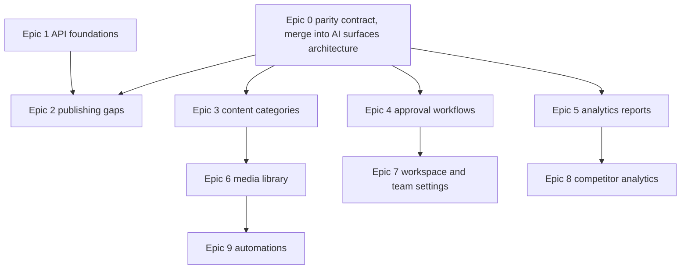

# Public API parity — program plan

Date: 2026-08-23
Grounding: `docs/technical/public-api-gap-analysis-2026-08-23.md`

Nine epics closing the confirmed public API gaps, each landing on **every** developer surface rather than the REST endpoint alone. Local markdown only. The PO creates the epics and stories by hand.

---

## 1. Scope decisions taken

Triaged from the gap analysis. What was decided **in** and, just as importantly, what was decided **out**.

### In

| Area | Decision |
|---|---|
| Content categories | Full CRUD, slots, per-member access |
| Approval workflows | Definition CRUD and the workflow actions |
| Media library | Folders, archive, move, delete, notes, stats and limits |
| Team social-account access | In |
| Workspace settings | Timezone, pause and resume posting, and the rest of the workspace-level settings |
| Analytics reports | In |
| Analytics scheduled reports | In |
| Shareable report links | In |
| Analytics account preferences | In |
| Competitor analytics | In |
| Automations | In: evergreen, RSS, CSV bulk |

### Out, deliberately

- **Cross-workspace / org-level reports.** Explicitly not wanted.
- **Inbox auto-reply rules.** Explicitly not wanted.
- **Inbox brand help docs.** Explicitly not wanted.
- **The inbox, entirely.** No inbox work at all, API or product. Decided 2026-08-24. See section 3.

### Confirmed in a second pass

| Area | Decision |
|---|---|
| Single post read | In |
| Account and platform filter on the post list | In |
| Repeat posts | In |
| Post share links | In |
| Webhook management on the public API | In |
| OpenAPI document resync | In |
| Limits and consumption read endpoint | In |

### Still not triaged

Named so they are not forgotten. Considered, not scoped, no epic exists:

- Bulk post operations
- Post version history
- Queue shuffling
- Planner saved views
- Calendar notes
- Analytics job triggers, which force a data refresh before reading
- White-label configuration, custom domains and SSO on the API, which may be a deliberate never

---

## 2. The epics

| # | Epic | Priority | Stories |
|---|---|---|---|
| 0 | Developer surface parity contract | **P0** | 3 |
| 1 | API foundations: webhooks, limits, OpenAPI sync | **P0** | 4 |
| 2 | Publishing gaps: single post, filters, repeat, share links | P1 | 4 |
| 3 | Content categories | P1 | 3 |
| 4 | Approval workflows | P1 | 3 |
| 5 | Analytics reports and shareable links | P1 | 4 |
| 6 | Media library management | P2 | 3 |
| 7 | Workspace settings and team account access | P2 | 3 |
| 8 | Competitor analytics | P2 | 3 |
| 9 | Automations | P3 | 4 |

**34 stories** across 10 epics. Folder per epic under `docs/stories/`:

`public-api-parity-contract`, `public-api-foundations`, `public-api-publishing-gaps`, `public-api-content-categories`, `public-api-approval-workflows`, `public-api-analytics-reports`, `public-api-media-library`, `public-api-workspace-settings`, `public-api-competitor-analytics`, `public-api-automations`.

There is no inbox epic. See section 3.

### Why Epic 0 is P0

"Everything everywhere" is the requirement, and today it is satisfied by hand-copying. The existing precedent shows the cost: `publishing-api-labels-campaigns` needed **ten** stories to ship one small capability, because Zapier, Make, n8n, the GPT app, the Claude extension and the MCP server each got their own ticket for the same change.

Eight capability epics at that ratio is roughly eighty stories of largely mechanical duplication, and every one is a chance for a surface to drift.

Epic 0 builds the thing that makes the other eight cheap: one definition source for capabilities, a propagation checklist every new endpoint must satisfy, and a guard that fails when a surface is missed. After it lands, each capability epic needs **one** surface story instead of six.

This is the same problem the existing `ai-surfaces-architecture` epic is already chartered to solve for AI tool definitions. **Epic 0 should be merged into that epic rather than run beside it**, and its research story should be treated as an input to that epic's plan story, not a competing one. Flagged for the PO to reconcile before creating either.

### Consequence for the story shape

Each capability epic below is written with **one** combined surface-parity story, enumerating every surface in its acceptance criteria. If the team would rather have a separate ticket per surface — because different people own the Zapier app and the MCP server — that one story splits into six along the lines the AC already draws. That is a tracker-level choice and does not change the work.

---

## 3. The inbox, and a correction

**No inbox work is planned.** Not the API items, and not the product capability behind them. Decided 2026-08-24. This section records why, and one error worth not repeating.

The gap analysis said the product persists inbox filter configurations and the API does not expose them. **That was wrong.** The inbox filter drawer keeps a value locally as a browser convenience. There is no persisted, server-side saved view: no collection, no endpoint, nothing in the inbox service. Planner saved views exist and are a separate feature. So inbox views were never an API gap, and exposing them would have meant building the product capability first.

The remaining inbox API items, conversation sidebar details and inbox saved replies, are both real and both small. They are not in this programme. If they come back, they come back as their own decision:

- **Conversation sidebar details.** The inbox service already returns a conversation's full context in one call and the public API does not proxy it, so a caller makes several round trips for what could be one.
- **Inbox saved replies.** They exist in full, with merge-field variables, and have no API surface.

Deferring costs little, because the inbox is already the best-covered area of the public API: the proxy exposes nearly the whole inbox service surface, including search, bulk triage, tags, notes, messages with media, comment moderation and review replies. Nothing outstanding blocks an integration from doing useful work today.

Auto-reply rules and brand help docs were separately and explicitly excluded, and stay excluded.

---

## 4. Sequencing

Epics 0 and 1 first, and they are independent of each other. Epic 1 is deliberately P0 alongside the parity contract because its first three stories are small, self-contained, and each one removes a reason an integration has to fall back to the browser or to guesswork. It needs no research and blocks nothing, so it can start immediately and finish before the contract work lands.

Then the P1 epics can run in parallel, since they touch different controllers. Epic 9 is last because automations are the largest surface and benefit most from the parity contract being proven on smaller epics first.

One overlap to manage: Epic 1's OpenAPI resync story and Epic 0's OpenAPI generation are the same problem at different depths. Epic 1 fixes today's drift and adds a check; Epic 0 later replaces the check by generating the document. Epic 1's story says so explicitly, so the supersession is planned rather than discovered.

If Epic 0 slips, the P1 epics can still ship their endpoint stories and defer their surface story. That is the honest fallback, and it should be a conscious decision rather than a surprise, because a shipped endpoint with no Zapier action is exactly the drift this program exists to stop.

---

## 5. Conventions for every epic below

Applied uniformly so the stories stay comparable:

1. **Endpoint stories** cover the REST surface, its authorization, and its validation. Authorization reuses the existing permission model rather than inventing one per endpoint.
2. **Surface story** covers the CLI, the agent skill, the MCP server (and therefore the GPT and Claude connectors, which consume it), Zapier, Make, n8n, the public documentation, and the OpenAPI document.
3. **Versioning.** The publishing API has a running minor-version convention (v1.13 account connection, v1.15 team members, v1.16 labels and campaigns, v1.17 workspace management, v2.0 to v2.2 threads and carousel). Each epic here should claim its own version number, and the PO should assign them in priority order so the changelog reads sensibly.
4. **No per-endpoint product analytics events.** API usage is already logged through the API request log and the existing `api_call_used` event. Adding a Usermaven event per endpoint would be exactly the noise the story guidelines warn against. Adoption of a whole capability is worth one event; that belongs in the surface story if anywhere, and is called out there.
5. **A UI wizard is not an API contract.** Several of these capabilities are built through multi-step wizards in the product. In every case checked, the wizard is a UI affordance over a backend save that already accepts the whole configuration in one request, with a separate draft endpoint holding step state purely so a human can resume a half-finished form. The API exposes the single call and does not expose the draft or step endpoints. Where a caller needs the incremental feedback a wizard gives a human, it gets per-field validation errors and an optional validate-without-creating call instead. The automations epic works through this in full, and the same reasoning applies to any other wizard-fronted capability in this programme.
6. **Settings in the call, collections as sub-resources.** The counterpart to convention 5: a single call is right for a configuration and wrong for an unbounded collection. Where a payload would otherwise embed one, the collection becomes a sub-resource with its own add, remove and paginated read, and media is referenced by id rather than embedded. So an evergreen automation's settings go in the create call while its content library can be built up separately, and both paths produce an identical automation. This keeps request bodies to roughly a dozen fields without reintroducing step state.
7. **Read-only is not a milestone.** The recurring failure in the current API is a capability that can be listed but not created. No epic here ships a read endpoint without its writes, unless the write genuinely has no product equivalent.
8. **Every epic states its plan gating.** Some of these capabilities are not on every plan, and the API must respect that rather than exposing them to a plan that does not include the feature.

---

## 6. What to confirm before creating these

1. **Epic 0 versus the existing AI surfaces architecture epic.** This was raised and is still the open question. Epic 0 exists as its own folder, but it is the same problem that epic is already chartered on for AI tool definitions. Three options: fold Epic 0's three stories into that epic, keep Epic 0 and narrow that epic to AI tools only, or keep both and accept the overlap. **The recommendation is to fold.** Whichever is chosen, it should be decided before either is created in the tracker, because creating both puts two teams on one problem.
2. **The still-untriaged list in section 1.** Six items plus the white-label question.
3. **Version numbers** per epic, assigned in priority order.
4. **Whether the surface story splits per surface** in your tracker.
5. **Epic 1's limits endpoint versus the usage visibility epic.** Both produce a consumption picture. One of them has to be the source of truth, and the story says so, but the decision is yours.
