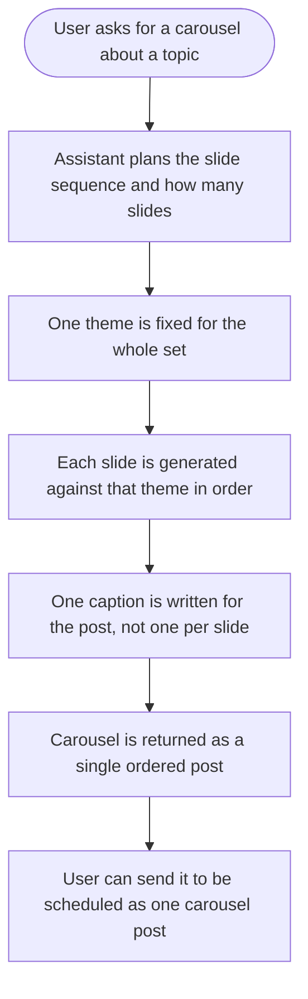
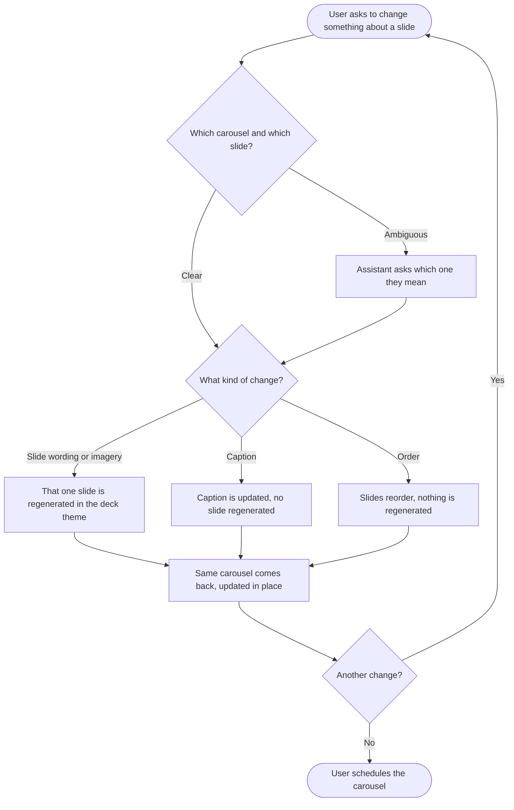
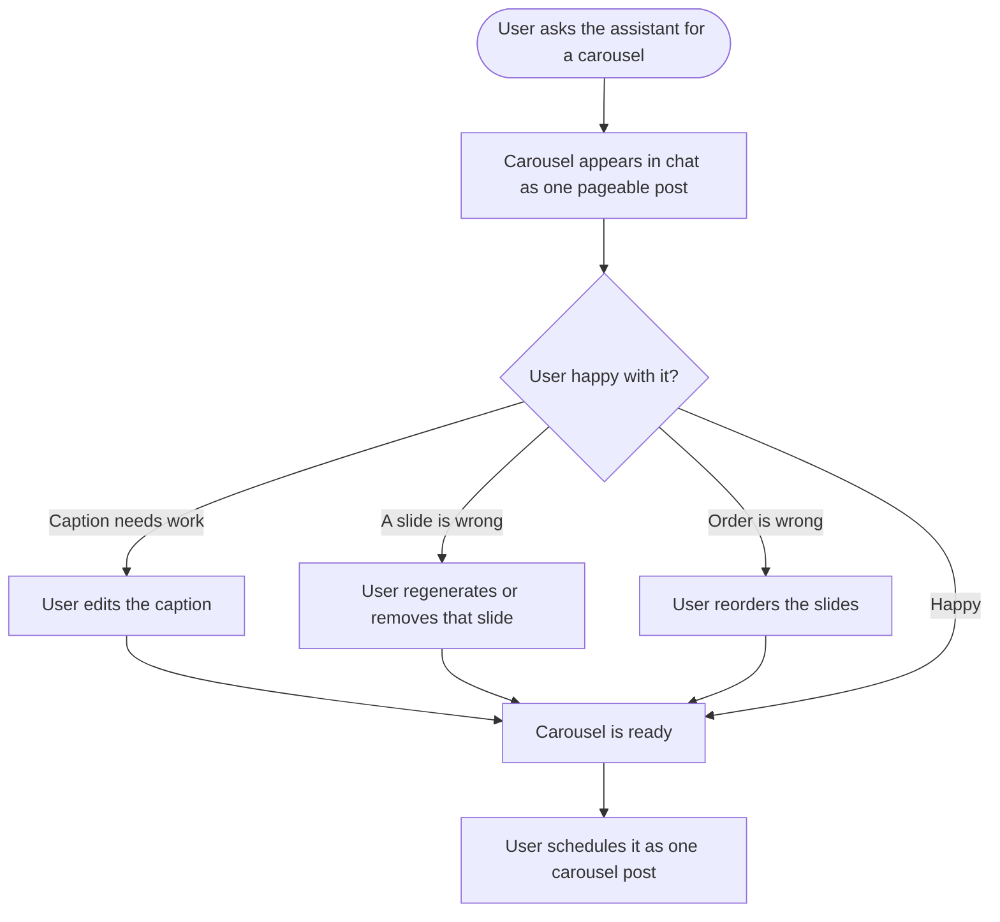

# Epic: Carousel post generation in the AI agents platform

## Problem

Asking the AI agent for a carousel gets you several images. It does not get you a carousel.

The generator returns a flat list where each item carries **its own caption**, no item is marked as the cover or the closing slide, order carries no meaning, and nothing binds the set together visually. The style hint is a single free-text string per batch, and the variation path deliberately changes the seed per image, which is the opposite of what a deck needs.

There is also a rule standing directly in the way: the content-analysis prompt forbids the model from baking any words, letters or numbers into an image. That rule is right, because model-drawn text is unreliable, but a carousel cover is defined by its title.

Text on an image is drawn by a model today: `brand_pass.py` runs a second image-to-image pass against a model chosen for being good at text. **v1 keeps that as-is.** No new rendering capability is introduced, and every edit goes back through the model.

That is a deliberate scoping decision, taken to ship carousel handling end to end without new infrastructure. Its ceiling is recorded under *Known ceiling* below so it can be revisited on evidence rather than rediscovered.

The publishing half already works. The scheduling tool accepts `post_type: carousel` and an ordered list of image URLs, so once a coherent set exists it can be scheduled today.

## Goal

Make a carousel a thing the agent produces, not a side effect of asking for several images: an ordered set of slides with roles, one caption for the post, one locked theme across every slide, and title text that is rendered as a real layer rather than drawn by the model. Then hand it to the existing scheduling path as a single post.

## Walkthrough

An interactive mock of the chat experience, showing the carousel card, the two edit paths and what an in-place edit does: https://claude.ai/code/artifact/98ee326f-331d-47eb-9ec2-c5fa66f9b251

It is a mock for discussion, not a design spec. The slide art is drawn with CSS, so its type is crisper than model-drawn text will be. Deck behaviour is accurate: one caption, a role per slide, patched in place, only the named slide regenerated.

## Scope

Five stories: three in `contentstudio-ai-agents`, one frontend, one design. **No new rendering, imaging or font infrastructure.** Everything uses generation paths that already exist.

## Sequencing

Story 1 defines the carousel artifact and is the foundation, including the slide identity everything downstream addresses. Story 2 wires slide text through the existing overlay pass and needs story 1's slide roles. Story 3 needs both: stable identity to address a slide, and the generation path to re-run for it. Story 4 consumes all three. Design should start immediately and feeds stories 2, 3 and 4.

## How editing works

Worth stating up front, because it shapes three of the five stories. A carousel is a **stateful artifact that is patched in place**, not re-emitted. When a user says "change slide 3", the agent resolves that to a slide, mutates it, and returns the same carousel with a version bump. It does not produce a second carousel in the conversation.

**Every edit to a slide is a regeneration of that slide**, using the generation path that already exists. There is no cheap text-only path in v1, and the design deliberately does not build one.

| The user asks for | What runs |
|---|---|
| Different wording on a slide | That slide is regenerated against the deck's theme, with the new text |
| Different imagery on a slide | That slide is regenerated against the deck's theme |
| A different caption | Nothing is regenerated. The caption is a field on the carousel. |
| Reorder or remove | Nothing is regenerated. The deck's order changes. |

Two things still hold, and they are what make this workable rather than chaotic:

- **Only the named slide is regenerated.** The other slides are untouched, so a user does not lose work they were happy with.
- **The regeneration is against the deck's stored theme.** This is why the theme lock in story 1 matters more here than it would with a text layer: it is the only thing keeping a re-rolled slide looking like it belongs to the set.

## Known ceiling

Accepted for v1, recorded so it is revisited on evidence rather than rediscovered:

- **Text is re-rolled on every edit.** Fixing a typo asks the model to spell again. It usually will. It may also produce a different one, and the cover title is the most visible place for that to happen.
- **Art can drift on every edit.** `brand_pass` spends a paragraph instructing the model to keep everything *"pixel-for-pixel identical"* precisely because an i2i pass can change it. A slide edited three times has been through three passes.
- **Every wording change costs a generation.** Copy is the thing users iterate on most, so the most common edit is also the most expensive and the slowest.
- **Slide text is pixels, not data.** It cannot be translated, corrected, restyled or reused for alt text without going back to the model, and the Composer cannot show or edit it.
- **The brand's actual typeface is approximated**, not used.

The fix for all five is the same and is deliberately out of v1: a real rendered text layer. The company already runs one in the analytics reports service (a Node render sidecar on k8s, SVG composition, managed fonts, cairo rasterization), so if these limits start costing users, the work is extending an existing renderer rather than building one. Revisit when there is evidence, not before.

## Decisions needed before implementation

- **Slide count.** Agent-chosen from the content, user-specified, or both with a default. Instagram permits up to 20; 5 to 7 is a likely default.
- **Networks in v1.** Instagram is the obvious target. LinkedIn carousels are document posts, a different mechanism entirely, and should be explicitly in or out.
- **Editing depth.** Whether a user can edit a slide's overlay text directly or only regenerate the slide. Direct editing is much more useful and materially more work.
- **Positional versus semantic slide references.** "Slide 3" is positional and moves when the deck is reordered. Confirm that references resolve against the deck's current visible order rather than its generation order, and how the agent should behave when a reference is ambiguous.
- **Templates.** A defined set of slide layouts, or free composition within a theme. A small template set is more predictable and more likely to look designed.
- **How much text a slide should carry.** Model-drawn text gets less reliable as it gets longer. A cover title of a few words is safe; a paragraph is not. The design story should cap this deliberately rather than letting the agent decide.

## Out of scope

- LinkedIn document carousels, unless the decision above brings them in. They are a different format with a different upload path.
- Video carousels.
- Changing how single-image generation works.
- **A rendered text layer, and any new rendering, imaging or font infrastructure.** See *Known ceiling*.
- Generating carousels on mobile. AI generation is web only.

## Stories

1. `[BE] Generate carousels as an ordered, themed slide set with one caption`
2. `[BE] Put title and headline text on carousel slides using the existing overlay pass`
3. `[BE] Edit a carousel by regenerating the slide the user names`
4. `[FE] Review, edit and schedule a generated carousel from AI chat`
5. `[Design] Carousel slide composition and the AI chat carousel experience`

---
---

# 1. [BE] Generate carousels as an ordered, themed slide set with one caption

### Description

As someone asking the AI assistant for a carousel, I want it to produce an actual carousel — a cover that draws people in, slides that deliver the point in order, and a closing slide that asks for something — all looking like one deck and sharing one caption, so I can post it rather than assemble it myself from a pile of loose images.

### Workflow

*(The user here is someone talking to the AI assistant. The generation contract is what this story delivers.)*

1. User asks the assistant for a carousel on a topic.
2. The assistant works out what the deck should say and across how many slides.
3. It fixes a single visual theme for the set before generating anything.
4. It generates the slides in order: a cover, the body slides, and a closing slide.
5. It writes one caption for the post as a whole.
6. The user receives one carousel, not several images, and can schedule it as a carousel post.

### Acceptance criteria

- [ ] A carousel is returned as a single artifact: an ordered list of slides, one caption for the post, and the theme applied to the set.
- [ ] Every slide carries a role, at minimum cover, body and closing, and the roles appear in a coherent order.
- [ ] Exactly one cover slide and at most one closing slide are produced.
- [ ] Slide order is explicit in the output and is preserved end to end, so the deck cannot be reassembled in the wrong sequence.
- [ ] The carousel is addressable: it carries a stable identifier that survives edits, so a later instruction can target this carousel rather than a copy of it.
- [ ] Every slide carries a stable identifier that is independent of its position, so a slide remains addressable after the deck is reordered.
- [ ] The carousel carries a version that changes when it is edited, so a consumer can tell an updated deck from the original.
- [ ] One caption is produced for the carousel as a whole. Per-slide captions are not the post caption, and if per-slide text is retained it is clearly distinct from the caption.
- [ ] The slides share a single visual theme, so a person looking at the set recognises it as one deck rather than unrelated images.
- [ ] Whatever generation parameters are needed for visual continuity are held constant across the set rather than varied per slide.
- [ ] Where the workspace has brand knowledge, the theme is derived from it, so a brand's carousels look like that brand.
- [ ] Where the workspace has no brand knowledge, a sensible default theme is used and the result is still cohesive.
- [ ] Slide count is chosen per the decision recorded in the epic, respects the target network's maximum, and never produces a single-slide carousel.
- [ ] Slide dimensions are consistent across the set and appropriate for the target network.
- [ ] A single slide can be regenerated without regenerating the deck, and the regenerated slide still matches the set's theme.
- [ ] If a slide fails to generate, the failure is reported against that slide and the rest of the deck survives, rather than the whole request failing.
- [ ] The carousel can be handed to the existing scheduling path as one post with ordered images, one caption and the carousel post type.
- [ ] Asking for a single image still produces a single image. Existing generation behaviour is unchanged.
- [ ] Alt text is produced per slide, since each slide is a separate image to anyone using a screen reader.

### Mock-ups

N/A. Generation contract. Slide layouts come from the design story.

### Impact on existing data

No change to stored media. A carousel introduces a grouping over images that did not exist before; how that grouping is persisted needs to survive the hand-off to the composer so a scheduled carousel keeps its order.

### Impact on other products

- Web app: consumed by the frontend story in this epic.
- The existing publishing and scheduling path already accepts carousels, so no change is needed there.
- Mobile: carousel generation is web only. See the note in the frontend story about mobile AI chat encountering a carousel in history.

### Dependencies

- The four decisions in the epic should be answered first, particularly slide count and target networks.
- Pairs with **[BE] Put title and headline text on carousel slides using the existing overlay pass**, which supplies the cover title and slide headlines.

### Global quality and compliance checklist

- [ ] Mobile responsiveness tested (frontend only, N/A for backend-only stories) — N/A, backend only
- [ ] Multilingual support verified (frontend + backend, translations available or fallback handled) — a carousel generated for a non-English brand should read in that language
- [ ] UI theming supported (default + white-label, design library components are being used) — N/A, no UI
- [ ] White-label domains impact reviewed
- [ ] Cross-product impact assessed (web, mobile apps, Chrome extension)

### Implementation references

*Pointers from research — not a contract. Engineering may choose a different approach.*

- The starting point is `contentstudio-ai-agents/src/agents/image/image_generator.py::generate_multiple_image_prompts(content, image_style=None, max_images=5)` at line 196, and the schemas it fills in `src/agents/image/schemas.py`. `ImagePromptItem` currently carries `prompt`, `filename`, `alt` and a per-item `caption`; `ImagePromptOutput` is a flat `images: list[ImagePromptItem]`. A carousel needs a role and an index on the item, and the caption moved up to the set.
- Visual continuity is where the current code works against the goal. `image_generator.py` line 789 uses `seed=42 + i` in the variation path, deliberately varying the seed per image. `GeneratedImage` already carries `seed`, so the machinery to hold it constant exists.
- Theme sourcing already exists per image: `src/agents/image/prompt_builder.py` falls back to `BrandVoiceParser.get_visual_style_description(brand_voice)` when no explicit style is supplied (lines 119 and 153). The change is resolving that once per carousel and reusing it, rather than per image.
- Carousel-appropriate dimensions are already described in `prompt_builder.py` lines 309 to 311: `portrait_3_4` for taller carousels, `landscape_3_2` for covers, `landscape_16_9` for carousel posts. Nothing consumes them as a carousel yet.
- The scheduling contract to hand off to is `src/integrations/contentstudio/toolkits/publishing_write.py`, which lists `carousel` and `carousel+story` as valid post types (lines 38 and 43) and takes `post_type` plus an `image_urls` list (lines 326 to 327). Note its existing instruction that images from earlier turns must be carried through the `[Image handles]` block — a carousel has to survive that mechanism as an ordered set.

---
---

# 2. [BE] Put title and headline text on carousel slides using the existing overlay pass

### Description

A carousel cover is its title, and body slides usually carry a headline. The content-analysis prompt forbids the model from baking text into an image, because model-drawn text is unreliable — but a separate path already exists that deliberately does put text on an image: `brand_pass` runs a second image-to-image pass and asks the model to render the given text verbatim.

This story wires carousel slides through that existing path so each slide gets its text, with a treatment consistent across the deck. It builds no new rendering capability. The limits of model-drawn text are accepted for v1 and recorded in the epic's *Known ceiling*.

### Workflow

*(Backend story. What the user sees is a deck whose slides carry their title and headline text.)*

1. The assistant writes the deck's text: a cover title, a headline per body slide, and closing text.
2. Each slide's art is generated with no text in it.
3. That slide's text is applied through the existing overlay pass.
4. The text treatment is consistent from slide to slide, so the deck reads as one set.
5. Text that is too long for a slide is shortened before it reaches the model, rather than being sent and rendered badly.

### Acceptance criteria

- [ ] Each slide's text is applied through the existing overlay pass rather than by a new mechanism.
- [ ] The base art for each slide is generated with no text, preserving the existing no-rendered-text rule for the generation step.
- [ ] The cover carries a title, body slides carry a headline where the design calls for one, and the closing slide carries its closing text.
- [ ] The text treatment is consistent across a deck: the same styling intent is passed for every slide so they do not each get their own look.
- [ ] Text length is capped before generation, at the limits the design story sets, so a slide is never sent text the model cannot render legibly.
- [ ] Text that exceeds the cap is shortened deliberately, with the shortened text stored as the slide's text, rather than silently truncated mid-word by the model.
- [ ] Where the workspace has brand knowledge, the brand's styling informs the text treatment through the existing brand inputs.
- [ ] Where a logo is applied, it is placed consistently across slides rather than re-decided per slide.
- [ ] The text the assistant wrote is stored on the slide, so the deck knows what each slide is supposed to say even though the pixels are what ship.
- [ ] If the rendered text comes back visibly wrong, the slide can be re-run without regenerating the rest of the deck.
- [ ] A failure applying text to one slide is reported for that slide and does not fail the deck.
- [ ] Existing single-image brand and logo behaviour is unchanged.

### Mock-ups

Text placement, scale, length caps and per-role treatment come from **[Design] Carousel slide composition and the AI chat carousel experience**.

### Impact on existing data

Slides store the text they were generated with. No new storage systems, no new rendering assets.

### Impact on other products

- Uses the existing overlay path, so single-image branding is unaffected.
- No new infrastructure, fonts or services.

### Dependencies

- Depends on the slide-role vocabulary from **[BE] Generate carousels as an ordered, themed slide set with one caption**.
- Depends on **[Design] Carousel slide composition and the AI chat carousel experience** for text length caps and per-role treatment.

### Global quality and compliance checklist

- [ ] Mobile responsiveness tested (frontend only, N/A for backend-only stories) — N/A, backend only
- [ ] Multilingual support verified (frontend + backend, translations available or fallback handled) — model-drawn text in non-Latin scripts is a known weak point; the story should establish which languages are viable
- [ ] UI theming supported (default + white-label, design library components are being used) — N/A, no UI
- [ ] White-label domains impact reviewed
- [ ] Cross-product impact assessed (web, mobile apps, Chrome extension)

### Implementation references

*Pointers from research — not a contract. Engineering may choose a different approach.*

- The path to reuse is `contentstudio-ai-agents/src/agents/image/brand_pass.py`. Its `apply_brand_pass` takes an `overlay_text` argument, `_build_brand_edit_prompt` (line 249) instructs the model to *"Add this exact text, rendered verbatim with correct spelling"*, and `_text_style_hint` (line 201) already derives styling from brand guidelines. The composite model is configured at line 195 via `config.brand_composite_model`, defaulting to nano-banana-pro for being strong at text.
- Note what that prompt already asks for, since it is close to slide-text needs: place the text in clear negative space, never across the subject's face, sized for the composition, strong contrast, even margins from every edge, even optical letter-spacing.
- The generation step should keep the existing no-rendered-text rule from `src/agents/image/prompt_builder.py` line 54. Text arrives in the second pass, not the first.
- Length is the main lever on reliability. Model-drawn text degrades as it gets longer, so the cap the design story sets is doing real work and should be enforced before the model is called, not after.
- `_resolve_logo` and `logo_utils.py` handle logo placement and need no change.

---
---

# 3. [BE] Edit a carousel by regenerating the slide the user names

### Description

Once the assistant produces a carousel, the natural next thing a user says is "change slide 3" or "make the last one say something else". Today there is no way to act on that: the only option would be regenerating the whole deck, which throws away the slides the user was happy with and re-rolls the theme, producing a set that no longer matches what they just approved.

This story lets the assistant regenerate one named slide, or change the caption, and hand back the same carousel with that one thing different. Every other slide is left exactly as it was.

Every slide change is a regeneration. There is no text-only shortcut in v1, by decision.

### Workflow

1. User has a carousel in the conversation and asks to change something about one slide.
2. The assistant works out which carousel and which slide they mean. If that is genuinely unclear, it asks rather than guessing.
3. That slide is regenerated against the deck's stored theme, with whatever the user asked for applied.
4. A caption change updates the caption and regenerates nothing.
5. Reordering or removing changes the deck and regenerates nothing.
6. The same carousel comes back updated. The user does not end up with two carousels in the conversation.
7. The user can keep making changes, and can then schedule the deck.

### Acceptance criteria

- [ ] The assistant can regenerate a single named slide without regenerating the other slides.
- [ ] Slides the user did not name are unchanged, including their text, their art and their order.
- [ ] A regenerated slide is produced against the carousel's stored theme, so it still matches the rest of the deck rather than looking imported.
- [ ] A change to the caption updates the caption alone and regenerates nothing.
- [ ] Reordering and removing change the deck without regenerating anything.
- [ ] The result is the same carousel, updated, with its version changed. A second carousel is not created in the conversation.
- [ ] A positional reference such as "slide 3" resolves against the deck's current order, so it still means the right slide after the user has reordered.
- [ ] A relative reference such as "the last slide" or "the cover" resolves correctly.
- [ ] When the target slide is genuinely ambiguous, or more than one carousel could be meant, the assistant asks which one rather than picking.
- [ ] A reference to a slide that does not exist, such as slide 9 of a 5-slide deck, gets a clear answer rather than a silent failure or an out-of-range error.
- [ ] Because a regeneration re-rolls the slide's text as well as its art, the user is told plainly that the slide is being remade, so a small wording fix does not look like a bug when the art shifts slightly.
- [ ] The previous version of a regenerated slide is retained for the session, so a user who preferred the old one is not stranded.
- [ ] Adding a slide is supported, respects the network maximum, and the new slide is generated in the deck's theme.
- [ ] Removing a slide is supported and cannot take the deck below the minimum a carousel requires.
- [ ] A failed regeneration leaves the carousel exactly as it was, rather than in a half-updated state with one slide missing or blank.
- [ ] Editing a carousel generated earlier in the conversation works, including after other messages have been exchanged in between.
- [ ] The edited carousel is what gets scheduled. An earlier version cannot be scheduled by mistake.

### Mock-ups

N/A. Agent capability. How the update appears in chat is covered by **[FE] Review, edit and schedule a generated carousel from AI chat**.

### Impact on existing data

The carousel becomes mutable, so its state has to persist across turns for long enough to be edited and then scheduled. Slide identity must be stable across edits, or references break as soon as a deck is reordered. Retaining the previous version of a regenerated slide for the session needs somewhere to live.

### Impact on other products

- Web app: the visible result is covered by the frontend story.
- Every slide edit costs a generation, so editing is a real cost driver. Worth watching once it is live, since it is the strongest evidence for or against building a text layer later.

### Dependencies

- Depends on **[BE] Generate carousels as an ordered, themed slide set with one caption** for stable carousel and slide identity, and for the stored theme a regenerated slide is matched against.
- Depends on **[BE] Put title and headline text on carousel slides using the existing overlay pass**, since regenerating a slide has to reapply its text.

### Global quality and compliance checklist

- [ ] Mobile responsiveness tested (frontend only, N/A for backend-only stories) — N/A, backend only
- [ ] Multilingual support verified (frontend + backend, translations available or fallback handled)
- [ ] UI theming supported (default + white-label, design library components are being used) — N/A, no UI
- [ ] White-label domains impact reviewed
- [ ] Cross-product impact assessed (web, mobile apps, Chrome extension)

### Implementation references

*Pointers from research — not a contract. Engineering may choose a different approach.*

- Regenerating one slide in-theme depends entirely on story 1 having stored the theme as data rather than as a prompt string discarded after generation. Confirm that early; it is the difference between a re-roll that matches and one that does not.
- Reference resolution is a known-hard area. Positional ("slide 3"), ordinal ("the last one") and role-based ("the cover") are cheap. Semantic ("the one about pricing") is not. Scoping v1 to the first three is defensible; say so explicitly rather than leaving semantic references to fail oddly.
- Retaining the previous slide version is cheap insurance. Because every edit re-rolls the text, a user fixing a typo can end up with a worse slide than they started with, and being able to go back one step turns that from a support ticket into a shrug.
- The existing conversation mechanism to work with is the `[Image handles]` block referenced in `src/integrations/contentstudio/toolkits/publishing_write.py` (line 327), which already carries every image forward so a later turn can schedule an earlier image. A carousel needs the same continuity but as an ordered, mutable set.
- `src/orchestration/handlers/image.py` and `src/api/routers/image_router.py` are the existing entry points where an edit path would most likely hang.

---
---

# 4. [FE] Review, edit and schedule a generated carousel from AI chat

### Description

When the assistant generates a carousel, the user currently sees a stack of separate images and has to work out for themselves what order they go in and which caption belongs to the post. This story renders the result as an actual carousel they can page through, adjust and schedule as one post.

### Workflow

1. User asks the assistant for a carousel.
2. It appears in chat as a single carousel they can page through, with the caption shown once beneath it.
3. User pages through the slides to review the deck.
4. User edits the caption inline.
5. User removes a slide they do not want, or regenerates one that missed, and the rest of the deck stays as it was.
6. User reorders slides by dragging.
7. User schedules the carousel, and it goes out as one carousel post with the slides in the order they set.

### Acceptance criteria

- [ ] A generated carousel renders in AI chat as one pageable carousel, not as separate stacked images.
- [ ] Slides appear in their generated order, and the current position in the deck is visible.
- [ ] The caption is shown once, for the post, rather than once per slide.
- [ ] The caption can be edited inline, and the edit is what gets scheduled.
- [ ] A slide can be removed, and the remaining slides keep their relative order.
- [ ] A slide can be regenerated individually, with the rest of the deck untouched, and the regenerated slide is shown in place.
- [ ] Slides can be reordered, and the new order is what gets scheduled.
- [ ] Removing slides cannot take the deck below the minimum a carousel requires, and the user is told why rather than left with a broken post.
- [ ] Adding beyond the target network's maximum is prevented, with a clear message.
- [ ] Scheduling sends one carousel post with the ordered slides and the single caption, not several separate posts.
- [ ] While a slide is regenerating, that slide shows a loading state and the rest of the carousel stays usable.
- [ ] A slide that fails to generate shows a failed state with a retry, rather than silently missing from the deck.
- [ ] The carousel survives the conversation: scrolling away and back, or returning to the conversation later, shows the deck with its order and edits intact.
- [ ] When the user asks the assistant to change a slide in chat, the existing carousel updates in place. A second carousel is not appended to the conversation.
- [ ] After an in-chat edit, the user is looking at the updated deck without having to scroll to find a new copy of it.
- [ ] While an assistant-driven edit is running, the affected slide shows a busy state and the rest of the carousel stays usable, matching the behaviour of the per-slide regenerate control.
- [ ] Because every slide edit is a regeneration, the user is told the slide is being remade rather than being led to expect an instant text tweak.
- [ ] After a slide is regenerated, the user can undo back to the previous version of that slide for the rest of the session.
- [ ] Edits made through the UI controls and edits made by asking the assistant produce the same result and cannot leave the deck in two different states.
- [ ] Whatever the user last accepted is what gets scheduled. An earlier version of the deck cannot be scheduled by mistake.
- [ ] Existing single-image and video responses in chat are unaffected.
- [ ] All new strings are translated and present in every locale directory.
- [ ] When the user schedules a generated carousel, an `ai_carousel_scheduled` Usermaven event fires with `{ slide_count, platform }`.

### UI copy

**Slide position indicator**
- `Slide {current} of {total}`

**Caption field**
- Label: `Caption`
- Placeholder: `Write a caption for this carousel`
- Helper: `One caption is used for the whole carousel, the same way it works on the network.`

**Slide actions**
- Regenerate: `Regenerate this slide`
- Remove: `Remove slide`
- Reorder hint: `Drag to reorder`

**Minimum slides reached**
- `A carousel needs at least {min} slides. Add another slide before removing this one.`

**Maximum slides reached**
- `{platform} allows up to {max} slides in a carousel.`

**Slide failed to generate**
- `This slide didn't generate. Try again, or remove it from the carousel.`
- Button: `Try again`

**Regenerating**
- `Creating a new version of this slide...`
- Helper, shown while a slide is being remade: `The whole slide is being remade, so the picture may look a little different too.`

**Carousel updated after an assistant edit**
- `Slide {number} updated.`
- With an undo affordance: `Slide {number} updated.` + `Undo`

All strings go through translation and land in every locale directory in the same change. Note the deliberate absence of em dashes.

### Mock-ups

Provided by **[Design] Carousel slide composition and the AI chat carousel experience**.

An interactive mock of this story's surface, useful for agreeing behaviour before the visual design lands: https://claude.ai/code/artifact/98ee326f-331d-47eb-9ec2-c5fa66f9b251. Caption above the slide, arrows either side of it, filmstrip beneath with working drag-to-reorder, and a demo of an in-chat edit updating the deck in place. Treat the arrangement as a proposal and the behaviour as the intent.

### Impact on existing data

None on stored media. The carousel's order and caption edits must persist with the conversation so the deck can be scheduled later in the session.

### Impact on other products

- Web app only for generation and editing. AI generation is web only.
- **Mobile AI chat needs checking.** AI chat exists on mobile, so a carousel generated on web can appear in a conversation a user later opens on a phone. Mobile does not need to generate or edit carousels, but it must render or gracefully degrade rather than break on an unfamiliar response type. Confirm with the mobile team; if a change is needed there, it is a separate story.
- Scheduling reuses the existing carousel publishing path, unchanged.

### Dependencies

- Depends on **[BE] Generate carousels as an ordered, themed slide set with one caption** for the carousel contract.
- Depends on **[BE] Edit a carousel by regenerating the slide the user names**, which is what makes an in-chat edit update the deck in place rather than producing a second one.
- Depends on **[Design] Carousel slide composition and the AI chat carousel experience**.

### Global quality and compliance checklist

- [ ] Mobile responsiveness tested (frontend only, N/A for backend-only stories)
- [ ] Multilingual support verified (frontend + backend, translations available or fallback handled)
- [ ] UI theming supported (default + white-label, design library components are being used)
- [ ] White-label domains impact reviewed
- [ ] Cross-product impact assessed (web, mobile apps, Chrome extension)

### Implementation references

*Pointers from research — not a contract. Engineering may choose a different approach.*

- The AI chat surface that renders generated media is under `contentstudio-frontend/src/components/dashboard/`, alongside `ChatInput.vue`.
- Carousel presentation components already exist and should be reused rather than rebuilt: `src/modules/common/components/social-previews/SwipeCarousel.vue` and `SocialPreviews/InstagramMultimediaPreview.vue`. Reusing them also keeps the chat preview consistent with how the same post will look in Composer and Planner.
- Before naming the Usermaven event, check the existing catalogue for an AI generation event that already covers this action rather than adding a near-duplicate. `ai_posts_generated` exists for the AI Content Library and may or may not be the right precedent.
- The scheduling hand-off should go through the same path the assistant already uses for scheduling with images, which carries `post_type` and an `image_urls` list, so the carousel's order has to survive as a list rather than a set.

---
---

# 5. [Design] Carousel slide composition and the AI chat carousel experience

### Description

A generated carousel has to look designed, not like several images with words on them. Because v1 has the model draw the text, the design's job is not to produce render templates — it is to produce **guidance the generator can actually follow**: how much text a slide can carry, where it should sit, and what the deck's visual language is. It also needs the chat experience specified: how a deck is reviewed, reordered and fixed before scheduling.

### Workflow

N/A. Design deliverable.

### Acceptance criteria

- [ ] A slide composition is specified for each role: cover, body and closing, described in terms a generation prompt can carry rather than as a pixel layout.
- [ ] **A maximum text length per role is specified**, and it is treated as a hard constraint. This is the single strongest lever on how reliable model-drawn text is, so it needs a number, not a preference.
- [ ] What to do when the assistant's text exceeds the cap is specified: shortened to fit before generation, with a stated rule for how.
- [ ] Legibility over generated imagery is solved explicitly. If slides need a reserved quiet zone, a scrim or a band behind the text, that is specified, because with model-drawn text it is a generation instruction, not a layer.
- [ ] The design acknowledges that exact typography cannot be guaranteed in v1, and specifies the visual language in terms the model can honour (weight, placement, contrast, restraint) rather than in terms it cannot (an exact typeface at an exact size).
- [ ] Logo placement across a deck is specified, including whether it appears on every slide or only the cover and closing.
- [ ] How a brand's styling informs the deck is specified, so a workspace with brand knowledge gets its own look rather than a generic one, within what the generator can honour.
- [ ] A default theme is specified for workspaces with no brand knowledge, and it looks intentional rather than unbranded.
- [ ] Slide dimensions are specified per supported network.
- [ ] The AI chat carousel is specified: how the deck is paged through, where the position indicator sits, and where the caption appears relative to the slides.
- [ ] The per-slide actions are specified: regenerate, remove and reorder, including how they are revealed without cluttering the chat.
- [ ] Loading, failed and regenerating states are specified at slide level, so one slide can be busy while the rest are usable.
- [ ] The caption editing affordance is specified.
- [ ] Behaviour is specified at every supported width, including the narrow chat panel.
- [ ] Colours are specified as theme tokens where they are brandable, and it is stated which parts of a slide are deliberately the brand's rather than the app's.
- [ ] The design names the design-library components to reuse for the chat experience and flags anything unavailable as a component gap.

### Mock-ups

This story produces them.

Starting reference, not a design to reproduce: https://claude.ai/code/artifact/98ee326f-331d-47eb-9ec2-c5fa66f9b251. It exists to make the mechanics legible (what is shared across the deck versus per slide, what an edit does, how reordering behaves) and takes no position on how any of it should look. The composition, type treatment and text caps are this story's to decide.

### Impact on existing data

None.

### Impact on other products

- Web app only.
- The slide guidance is a generation input as much as a visual spec, so the handoff has to be expressed in terms a prompt can carry, not only as static mockups.

### Dependencies

None. Should start immediately, since both backend stories depend on its output.

### Global quality and compliance checklist

- [ ] Mobile responsiveness tested (frontend only, N/A for backend-only stories)
- [ ] Multilingual support verified (frontend + backend, translations available or fallback handled) — templates must hold with longer translated text and with non-Latin scripts
- [ ] UI theming supported (default + white-label, design library components are being used)
- [ ] White-label domains impact reviewed
- [ ] Cross-product impact assessed (web, mobile apps, Chrome extension)

### Implementation references

*Pointers from research — not a contract. Engineering may choose a different approach.*

- The existing carousel preview components are `contentstudio-frontend/src/modules/common/components/social-previews/SwipeCarousel.vue` and `SocialPreviews/InstagramMultimediaPreview.vue`. Designing the chat experience against those keeps it consistent with Composer and Planner, where the same post will be previewed again.
- Carousel-appropriate dimensions are already named in `contentstudio-ai-agents/src/agents/image/prompt_builder.py` lines 309 to 311: `portrait_3_4`, `landscape_3_2` for covers, and `landscape_16_9`.
- The legibility question is the one most worth resolving early. In v1 the text is drawn by the model in a second pass, so "leave a quiet area for the text" is an instruction to the first pass, and it is the main thing standing between a readable cover and a title lost in a busy image.
- Worth reading `brand_pass.py`'s existing text prompt before designing: it already asks for clear negative space, no text across a face, strong contrast, even margins and even optical letter-spacing. The design should extend that vocabulary rather than invent a parallel one.
- Brand styling available to draw on comes through `BrandVoiceParser.get_visual_style_description`, and the logo through the brand pass, so the templates have a real source for a brand's look rather than needing new inputs.
