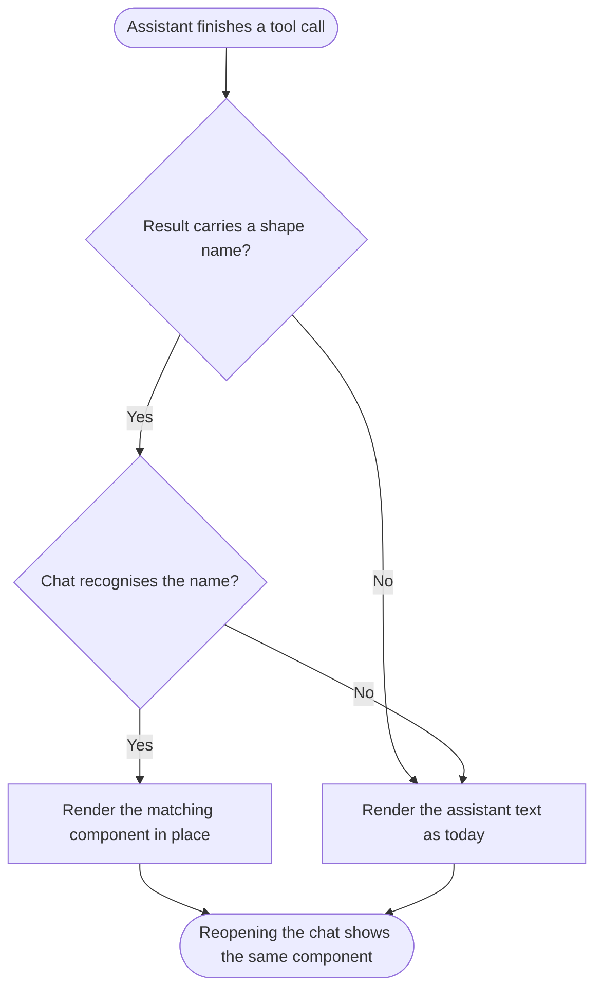
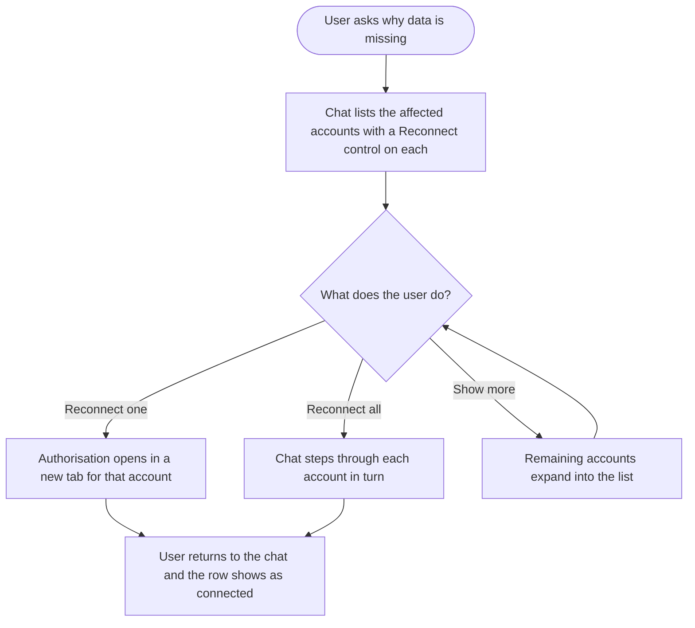
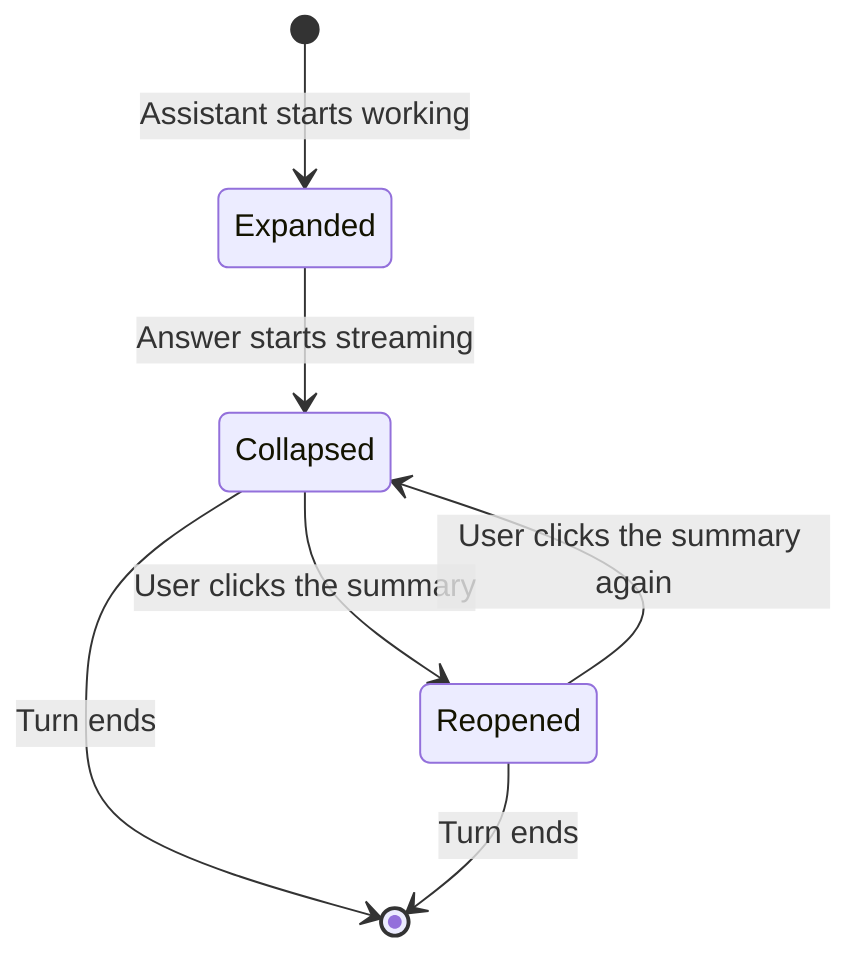
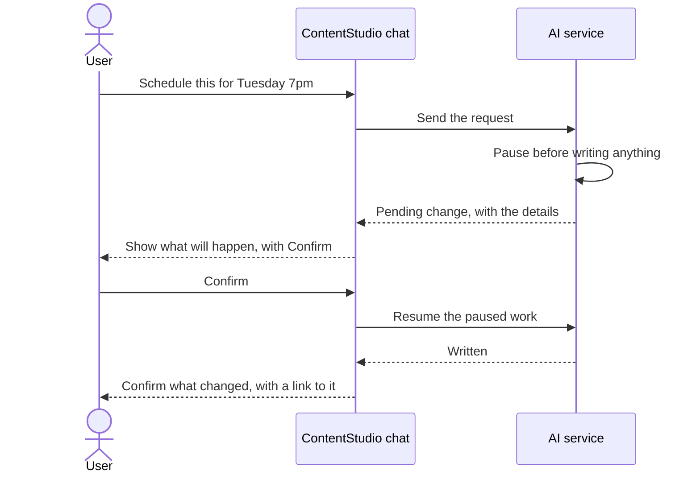
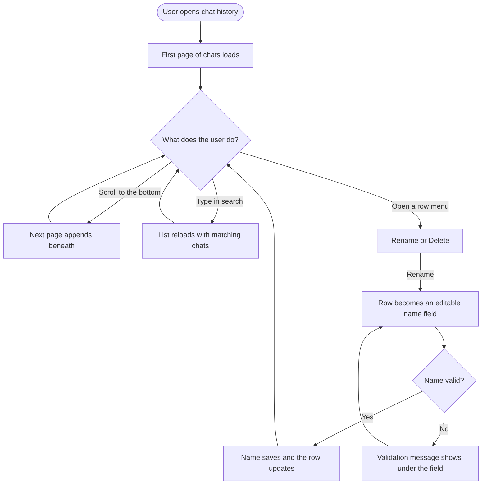

# Epic: AI chat renders tool results as components

## Problem

Ask ContentStudio answers every question with one markdown string. When a tool fetches analytics, the figures are handed to the model, the model retypes them into prose, and the client renders the prose. The result is emoji used as section headings, the same numbers restated across several paragraphs, broken accounts listed with no way to fix them, and, when a user asks for a graph, an apology plus instructions to paste the data into a spreadsheet.

The tool layer already solved most of this on the Python side. Every result from the internal toolkits travels in a single envelope that carries a status of `ok`, `partial`, `no_data` or `error`, a size ceiling that truncates honestly rather than silently, and a `render` hint naming the shape the result should take. Nine of the twenty-nine tools already emit that hint. Nothing downstream reads it.

## Goal

Read the hint and render it. Analytics arrive as figures and charts, lists arrive as tables, accounts arrive with the button that fixes them, and the model writes only the sentence of interpretation beside each one. Prose stays prose where a card would only add weight.

## Scope

Twelve stories across three services: the Vue web app, the Python AI service, and the Flutter mobile app. Five frontend stories cover components whose hints the toolkits already emit. One backend story adds the hint that charts need. One story covers the confirmation gate that every write now sits behind. One covers the model instruction that stops it repeating figures. One covers mobile. The last two fix the chat history list, which loads every conversation at once and gives the user no way to name one.

## Prerequisite outside this epic

The `render` hint does not currently reach the browser, and tool results are not persisted on the chat message. Two behaviours have to be true before any frontend story here can be tested:

1. The hint that the AI service publishes with each completed tool call is passed through to the client rather than filtered out.
2. A tool result is stored on the chat message, so a rendered component survives a page reload instead of vanishing.

Both are small changes in the chat streaming layer of the Laravel backend and are being handled as fixes rather than stories. Every frontend story below assumes them.

## Out of scope

- Removing the MCP subsystem and its `mcp_operation` content blocks. That belongs with the MCP removal work.
- Inbox tool results. The inbox toolkit does not exist yet.
- Hints for top-performing content and best posting times. Deferred by product.

## Sequencing

**[FE] Add a component registry for AI chat tool results, with a prose fallback** lands first and unblocks every other frontend story. **[BE] Emit chart render hints from the analytics toolkit** must land before **[FE] Show analytics trends as charts in AI chat**. Everything else can run in parallel. Mobile trails the web work.

## Stories

1. `[FE] Add a component registry for AI chat tool results, with a prose fallback`
2. `[FE] Show analytics figures as stat tiles in AI chat`
3. `[BE] Emit chart render hints from the analytics toolkit`
4. `[FE] Show analytics trends as charts in AI chat`
5. `[FE] Show list results as tables, media grids and note threads in AI chat`
6. `[FE] Show account results with inline reconnect and connect actions in AI chat`
7. `[FE] Auto-collapse the AI chat step timeline once the response starts streaming`
8. `[FE] Run every AI chat write only after the user confirms it`
9. `[BE] Stop the assistant restating figures that components already show`
10. `[Flutter] Render AI chat tool results as components in the mobile app`
11. `[BE] Paginate the AI chat history list and support renaming a chat`
12. `[FE] Paginate the AI chat history and let users rename a chat`

---
---

# 1. [FE] Add a component registry for AI chat tool results, with a prose fallback

### Description

As a ContentStudio user asking the AI chat about my accounts and performance, I want results to arrive as interface rather than paragraphs of retyped numbers, so that I can read them at a glance and act on them without leaving the conversation.

This story builds the mechanism only. Each completed tool call arrives with a hint naming the shape its result should take. The chat keeps a map from that name to a component and renders it in place. A name the chat does not recognise falls back to the assistant's own text, so results always render something and new shapes can ship one at a time without breaking older conversations.

No new visual components are delivered here. This is the socket the following stories plug into, verified with the simplest possible shape.

### Workflow

1. User asks the AI chat a question that needs data, for example "how did we do last week".
2. The assistant works, then returns its answer. Where a result has a known shape, the user sees a component in the flow of the reply rather than a block of text.
3. Where a result has a shape the chat does not yet support, the user sees the assistant's written answer exactly as they do today, with nothing missing and no error.
4. User scrolls up through older conversations from before this change and sees them render normally.
5. User reloads the page or reopens the thread and sees the same components in the same positions.

### Acceptance criteria

- [ ] A tool result carrying a recognised shape name renders its component inside the assistant's reply, in the position the result occurred
- [ ] A tool result carrying an unrecognised shape name renders the assistant's text instead, with no console error, no blank space, and no partial component
- [ ] A tool result carrying no shape name renders the assistant's text, matching today's behaviour exactly
- [ ] Conversations created before this change render without visual regression
- [ ] Components persist across a page reload and when navigating away from and back to the chat
- [ ] A reply containing both text and a component renders them in the order they arrived, not grouped by type
- [ ] While a tool is still running, the reply shows the existing loading treatment and no empty component frame
- [ ] Adding a new shape name to the registry requires no change to the reply rendering itself

### Mock-ups

[AI chat component prototype](https://claude.ai/code/artifact/30f28453-7cc8-4eed-8869-3758b6dbfa28)

The prototype shows a full session with every shape in place. The left gutter labels each one and notes where it comes from. That gutter is annotation for this epic and is not part of the interface.

### Impact on existing data

None. Existing chat messages are unchanged and continue to render through the text path.

### Impact on other products

The mobile app receives the same chat payload and needs its own registry. Covered by **[Flutter] Render AI chat tool results as components in the mobile app**.

### Dependencies

- Requires the two chat streaming behaviours listed in the epic's prerequisite section: the shape hint reaching the client, and tool results persisting on the chat message.

### Global quality & compliance (wherever applicable)

- [ ] Mobile responsiveness (frontend only, N/A for backend-only stories)
- [ ] Multilingual support (frontend + backend, translations available or fallback handled)
- [ ] UI theming support (default + white-label, design library components are being used)
- [ ] White-label domains impact review
- [ ] Cross-product impact assessment (web, mobile apps, Chrome extension)

### Implementation references

*Pointers from research, not a contract. Engineering may choose a different approach.*

**Primary entry points:**
- `contentstudio-frontend/src/modules/AI-tools/utils/reduceStreamEvent.ts` handles streamed tool-call events. Today it branches on a result type and handles only web sources, images and videos.
- `contentstudio-frontend/src/modules/AI-tools/composables/useBotMessageView.ts` derives the view model for one assistant bubble. Its message text getter currently filters the content array to text entries and joins them, which is where per-item ordering is lost.
- `contentstudio-frontend/src/modules/AI-tools/BotChatTemplate.vue` renders the bubble.

**Existing patterns to follow:**
- The video and image content types already round-trip through the content array and re-render after reload. That is the closest working precedent for a persisted, typed block.

**Gotcha:**
- `mcp_operation` content blocks are currently read only as a boolean, to hide the bubble footer. They become dead once the MCP subsystem is removed, so avoid building on them.

---

# 2. [FE] Show analytics figures as stat tiles in AI chat

### Description

As a user asking the AI chat how my accounts performed, I want the headline numbers shown as figures I can scan with their change against the previous period, so that I can see the result immediately instead of hunting for numbers inside a paragraph.

Today the assistant retypes each figure into prose, often repeating the same number across several messages. This story renders the figures from the tool result directly, so they are shown once and cannot be mistyped.

### Workflow

1. User asks the AI chat about performance, for example "how did we do last week" or "how is Bloomville Home doing".
2. The assistant confirms the period it used and the account or accounts it covered.
3. User sees up to four figures side by side. Each shows its name, its value, its percentage change against the previous period, and the previous value for context.
4. An increase reads in green with an upward triangle. A decrease reads in red with a downward triangle. A period with no comparison available shows the value alone with no change indicator.
5. Below the figures, the assistant adds a sentence interpreting them, without restating the numbers.
6. On a narrow screen the figures stack into two columns rather than shrinking.

### Acceptance criteria

- [ ] Figures render with name, value, percentage change and previous value, taken from the tool result and not from the assistant's text
- [ ] Values use thousands separators and align on their digits when stacked
- [ ] An increase renders in the success colour with an upward triangle. A decrease renders in the error colour with a downward triangle
- [ ] A figure with no previous-period value renders the value alone, with no change indicator and no zero percent
- [ ] A genuine zero renders as `0`, not as missing or blank
- [ ] The card header shows the account name with its platform, and the period compared, using the exact period the tool resolved
- [ ] Up to four figures render in one row on desktop and two columns below 640px
- [ ] Header copy for a single account reads `{account name}` with the period as `{start} to {end} vs {previous start} to {previous end}`
- [ ] Loading state shows the `Loader` component in place of the figures while the tool is still running
- [ ] Where a figure cannot be retrieved for one account in a multi-account answer, the missing account is named in the assistant's sentence and no placeholder tile is rendered

### Mock-ups

[AI chat component prototype](https://claude.ai/code/artifact/30f28453-7cc8-4eed-8869-3758b6dbfa28)

See the `metric_strip` specimen in the first turn.

### Impact on existing data

None.

### Impact on other products

Covered for mobile by **[Flutter] Render AI chat tool results as components in the mobile app**.

### Dependencies

- **[FE] Add a component registry for AI chat tool results, with a prose fallback**

### Global quality & compliance (wherever applicable)

- [ ] Mobile responsiveness (frontend only, N/A for backend-only stories)
- [ ] Multilingual support (frontend + backend, translations available or fallback handled)
- [ ] UI theming support (default + white-label, design library components are being used)
- [ ] White-label domains impact review
- [ ] Cross-product impact assessment (web, mobile apps, Chrome extension)

### Implementation references

*Pointers from research, not a contract. Engineering may choose a different approach.*

**Component gap to confirm before starting:**
- There is no Pill or Chip component in the design system catalogue. The change indicator needs either the `Badge` component or plain Tailwind markup. Confirm which with design.

**Colour rules:**
- Do not hardcode colour values. Brand colour comes from the `primary-cs-*` classes so white-label domains theme correctly. Success and error states use the existing semantic status classes rather than raw hex.

**Existing patterns to follow:**
- The analytics module already renders comparable figure tiles on its platform dashboards. Reuse that presentation rather than inventing a second one.

---

# 3. [BE] Emit chart render hints from the analytics toolkit

### Description

As a user who asks the AI chat to plot something, I want a chart, so that I do not have to read a trend out of a list of numbers or copy them into a spreadsheet.

The analytics toolkit currently describes its metric results as a table. A table cannot express a trend over time, so the assistant either renders rows or, as observed in a real conversation, explains that it cannot draw graphs and suggests using Google Sheets. This story adds a chart shape to the toolkit's vocabulary so a time series announces itself as one.

This work is in the `contentstudio-ai-agents` service, not the Laravel backend.

### Workflow

The consumer here is the chat client rather than a person. When the analytics toolkit returns a result covering more than one point in time, the result declares itself as a chart, states whether it suits a line or a column presentation, and names which field is the time axis and which fields are the series. A result covering a single period continues to declare itself as it does today.

### Acceptance criteria

- [ ] A metric result spanning more than one time period declares a chart shape in addition to its data
- [ ] The declaration names the time field and the value fields, so the client does not have to infer them
- [ ] The declaration states a presentation of line or column, chosen from the shape of the data rather than by the model
- [ ] A metric result covering a single period keeps its current declaration and does not become a chart
- [ ] Series values, dates and any deltas are computed in the service, with no arithmetic left to the model
- [ ] A result that is partially available still declares its chart shape, and the accounts or platforms missing from it remain listed in the result's missing field
- [ ] The declaration is omitted rather than guessed when the result has no time dimension
- [ ] Existing consumers that ignore the new declaration continue to work unchanged
- [ ] The result stays within the toolkit's existing serialised size ceiling, truncating the series honestly and flagging it when it would exceed it

### Mock-ups

[AI chat component prototype](https://claude.ai/code/artifact/30f28453-7cc8-4eed-8869-3758b6dbfa28)

The `chart` specimen in the second turn shows both presentations this hint needs to describe.

### Impact on existing data

None. No stored data changes. The addition is to the result envelope only.

### Impact on other products

The same declaration is consumed by the web app and by the mobile app. It is additive, so any consumer that does not read it is unaffected.

### Dependencies

None. This story can start immediately and is a prerequisite for **[FE] Show analytics trends as charts in AI chat**.

### Global quality & compliance (wherever applicable)

- [ ] Mobile responsiveness (N/A, no user interface in this story)
- [ ] Multilingual support (frontend + backend, translations available or fallback handled)
- [ ] UI theming support (N/A, no user interface in this story)
- [ ] White-label domains impact review
- [ ] Cross-product impact assessment (web, mobile apps, Chrome extension)

### Implementation references

*Pointers from research, not a contract. Engineering may choose a different approach.*

**Primary entry points:**
- `contentstudio-ai-agents/src/integrations/contentstudio/envelope.py` holds the shared result envelope and the existing table hint builder, whose columns come from one central map so that nine tools cannot each invent their own vocabulary. A chart builder belongs beside it, following the same pattern.
- `contentstudio-ai-agents/src/integrations/contentstudio/toolkits/analytics.py` is where the metric tools build their results.
- `contentstudio-ai-agents/src/api/helpers/sse_mapper.py` already lifts a result's render hint to the top level of the completed-tool-call event, so no change should be needed there.

**Existing decisions to respect:**
- The analytics contract in the service's own architecture notes fixes the toolkit at six tools and treats all arithmetic as the service's job, never the model's. A chart shape is a property of a result, not a new tool, and must not become one.

**Existing behaviour to preserve:**
- The envelope must never return a falsy value, because the agent framework turns a falsy tool return into an empty string.

---

# 4. [FE] Show analytics trends as charts in AI chat

### Description

As a user who wants to see how a number moved rather than what it ended at, I want the AI chat to draw the chart, so that I can spot a spike or a flat line without reading a column of figures or exporting anything.

Today asking for a graph produces an apology and a suggestion to use a spreadsheet, inside a product whose main job is analytics.

### Workflow

1. User asks the AI chat for a trend, for example "plot the LinkedIn trend" or "show me impressions over the last two weeks".
2. User sees a chart inside the reply, titled with the account and the period it covers.
3. Where the result has two measures, a legend names both above the plot and the last point of each line is labelled directly, so the two are never told apart by colour alone.
4. User hovers anywhere over the plot and sees a marker on the nearest date with every series value for that date.
5User moves the pointer away and the marker clears.
6. Below the chart the assistant adds a sentence about what the shape means, without listing the values again.
7. On a narrow screen the chart keeps its full width and scrolls inside its own container rather than squeezing the page sideways.

### Acceptance criteria

- [ ] A result declaring a line presentation renders as a line chart with a soft area fill under each series
- [ ] A result declaring a column presentation renders as columns, with the highest column labelled with its value and the rest read from the axis
- [ ] A chart with two or more series always shows a legend, and the final point of each series is labelled with its value
- [ ] A chart with a single series shows no legend, because the title already names what is plotted
- [ ] Hovering shows a marker at the nearest date and a tooltip listing every series value for that date, with the date as the tooltip heading
- [ ] The tooltip clears when the pointer leaves the plot
- [ ] Axis values use thousands separators and round to whole numbers
- [ ] Series values come from the tool result, never parsed out of the assistant's text
- [ ] The chart is never drawn with two different value scales. Two measures of very different magnitude render as two charts
- [ ] Wide charts scroll inside their own container and the page body never scrolls horizontally
- [ ] Loading state shows the `Loader` component in the chart area while the tool is still running
- [ ] A result declaring a chart shape but arriving with a single data point renders the figure as a stat tile instead of a one-point chart

### Mock-ups

[AI chat component prototype](https://claude.ai/code/artifact/30f28453-7cc8-4eed-8869-3758b6dbfa28)

The `chart` specimen shows both presentations, the legend, the endpoint labels and the hover behaviour.

### Impact on existing data

None.

### Impact on other products

Covered for mobile by **[Flutter] Render AI chat tool results as components in the mobile app**.

### Dependencies

- **[FE] Add a component registry for AI chat tool results, with a prose fallback**
- **[BE] Emit chart render hints from the analytics toolkit**

### Global quality & compliance (wherever applicable)

- [ ] Mobile responsiveness (frontend only, N/A for backend-only stories)
- [ ] Multilingual support (frontend + backend, translations available or fallback handled)
- [ ] UI theming support (default + white-label, design library components are being used)
- [ ] White-label domains impact review
- [ ] Cross-product impact assessment (web, mobile apps, Chrome extension)

### Implementation references

*Pointers from research, not a contract. Engineering may choose a different approach.*

**Existing patterns to follow:**
- The analytics module renders all of its charts through its existing ECharts composable. Use it here rather than adding a charting dependency, so the chat and the dashboards stay visually consistent.

**Series colours:**
- The two-series palette used in the prototype was checked for colour-blind separation and passes comfortably. The second series sits below a 3 to 1 contrast ratio against white, which is why both endpoints carry a visible label. Keep the labels if the palette changes, or re-check the palette.

---

# 5. [FE] Show list results as tables, media grids and note threads in AI chat

### Description

As a user who asks the AI chat what is scheduled, what is in my media library, or what my team said about a post, I want the answer laid out so I can scan it, so that I do not have to read a list of items as a run of sentences.

Most of the read tools already describe their results as a table and name the columns worth showing. This story renders those results properly, and gives two of them a better shape than a table: media as thumbnails, and internal notes as a thread.

### Workflow

1. User asks the AI chat for a list, for example "what is queued for next week", "what is in the media library", or "any notes on that post".
2. For scheduled posts, workspaces, team members, labels, campaigns, content categories and connectable platforms, the user sees a table with the columns the result named, a status pill where the item has a status, and small platform marks where the item targets social accounts.
3. For media, the user sees a grid of thumbnails with the filename beneath each, and a duration badge on anything with a runtime.
4. For internal notes, the user sees a thread with each author's initials, their name, the date, and the note text, oldest first.
5. Where the result was truncated because it was too long, the user sees a "Show {n} more" control at the foot rather than a silently shortened list.
6. Where the list is empty, the user sees the assistant say so in a sentence with a suggested next action, not an empty table.
7. On a narrow screen a table scrolls sideways inside its own container.

### Acceptance criteria

- [ ] A table result renders only the columns named in the result, and never a column the rows do not carry
- [ ] Post rows show caption, target accounts, scheduled time and status. A post with no scheduled time shows a dash rather than an empty cell
- [ ] Status renders as a pill with both a colour and its text label, so status is never conveyed by colour alone. Labels read `Scheduled`, `Draft`, `In review`, `Published`, `Failed`
- [ ] Long captions truncate on one line with an ellipsis and reveal in full on hover
- [ ] Media results render as a grid of thumbnails with filename beneath, wrapping responsively, with a duration badge on video items
- [ ] Internal notes render as a thread with author initials, author name, date and note text, oldest first, with an "Add a note" action beneath
- [ ] A truncated result shows a control reading `Show {n} more` at the foot of the list
- [ ] An empty list renders as an assistant sentence with a next action and no empty container. Copy for scheduled posts reads "Nothing is scheduled for that period." with a `Schedule a post` action
- [ ] Tables scroll horizontally inside their own container and the page body never scrolls sideways
- [ ] Times render in the workspace timezone, matching the timezone the tool resolved
- [ ] Loading state shows the `Loader` component in place of the list while the tool is still running

### Mock-ups

[AI chat component prototype](https://claude.ai/code/artifact/30f28453-7cc8-4eed-8869-3758b6dbfa28)

See the `entity_table` specimen for the scheduled queue, `media_grid` for the library, and `note_thread` for the notes.

### Impact on existing data

None.

### Impact on other products

Covered for mobile by **[Flutter] Render AI chat tool results as components in the mobile app**.

### Dependencies

- **[FE] Add a component registry for AI chat tool results, with a prose fallback**

### Global quality & compliance (wherever applicable)

- [ ] Mobile responsiveness (frontend only, N/A for backend-only stories)
- [ ] Multilingual support (frontend + backend, translations available or fallback handled)
- [ ] UI theming support (default + white-label, design library components are being used)
- [ ] White-label domains impact review
- [ ] Cross-product impact assessment (web, mobile apps, Chrome extension)

### Implementation references

*Pointers from research, not a contract. Engineering may choose a different approach.*

**Component gap to confirm before starting:**
- The design system catalogue does not list a Table component, although the frontend design system documentation mentions one in the package. Confirm whether a `Table` component exists and is ready for use, or whether this story builds the table markup. If it is built here, use `Badge` for the status pills and `Avatar` for note authors, both of which are in the catalogue.

**Entities this covers:**
- The read tools already name these result kinds: post, media, internal note, workspace, account, team member, content category, connectable platform, and a generic named kind used for labels and campaigns. One table component driven by the named columns covers all of them except media and internal notes, which get their own shapes in this story.

---

# 6. [FE] Show account results with inline reconnect and connect actions in AI chat

### Description

As a user told by the AI chat that some of my accounts have stopped reporting, I want to fix them from the conversation, so that I do not have to go hunting through settings to work out which ones and where.

In a real conversation the assistant listed eight broken accounts inside a quoted block with no controls at all, and separately pasted a one-time authorisation link as plain blue text alongside a warning not to share it. Both are dead ends, and the second turns a credential into something a user can copy into a chat thread.

### Workflow

1. User asks the AI chat why data is missing, or receives an answer where some accounts could not be read.
2. User sees the affected accounts as rows. Each row shows the account name, its platform, how long it has been disconnected, and a `Reconnect` control.
3A `Reconnect all {n}` control sits in the card header for doing them in sequence.
4. Where more accounts are affected than are shown, a `Show {n} more` control expands the rest.
5. User clicks `Reconnect` on a row. Authorisation opens in a new tab. The chat explains in one line that it opens in a new tab and that the link works once and only for them.
6. User completes authorisation, returns to the chat, and the row shows as connected without needing to resend the question.
7. Where the assistant is offering to connect a platform for the first time rather than repair an existing account, the user sees the platform name, a one-line explanation, and a `Continue` control instead of a list.

### Acceptance criteria

- [ ] Accounts needing attention render as rows with account name, platform, time since disconnection, and a `Reconnect` control on each row
- [ ] A `Reconnect all {n}` control appears in the card header when more than one account is affected
- [ ] More accounts than are displayed collapse behind a `Show {n} more` control, and the header count states the true total
- [ ] A one-time authorisation link is never rendered as text or as a copyable link. It is only reachable through a control
- [ ] Copy beneath a connect control reads "Opens in a new tab. Valid once, and only for you."
- [ ] Clicking a reconnect or connect control opens authorisation in a new tab and leaves the conversation intact
- [ ] Returning to the chat after successful authorisation shows the affected row as connected without the user resending their question
- [ ] Time since disconnection renders in whole days, reading `{n} days`, and reads `Today` when under 24 hours
- [ ] When authorisation fails or is cancelled, the row stays in its disconnected state and the chat shows "That did not complete. Nothing has changed, you can try again." with the control still available
- [ ] When the existing social account connection event fires from an authorisation started in the chat, it carries `{ platform, source: 'ai_chat' }` so chat-originated connections can be measured separately
- [ ] Loading state shows the `Loader` component in place of the rows while the tool is still running

### Mock-ups

[AI chat component prototype](https://claude.ai/code/artifact/30f28453-7cc8-4eed-8869-3758b6dbfa28)

See the `account_actions` and connect specimens in the ninth turn.

### Impact on existing data

None. Reconnection uses the existing account authorisation flow and writes nothing new.

### Impact on other products

Covered for mobile by **[Flutter] Render AI chat tool results as components in the mobile app**. Note that the mobile authorisation flow differs and should be scoped in that story rather than assumed.

### Dependencies

- **[FE] Add a component registry for AI chat tool results, with a prose fallback**

### Global quality & compliance (wherever applicable)

- [ ] Mobile responsiveness (frontend only, N/A for backend-only stories)
- [ ] Multilingual support (frontend + backend, translations available or fallback handled)
- [ ] UI theming support (default + white-label, design library components are being used)
- [ ] White-label domains impact review
- [ ] Cross-product impact assessment (web, mobile apps, Chrome extension)

### Implementation references

*Pointers from research, not a contract. Engineering may choose a different approach.*

**Existing patterns to follow:**
- Account reconnection already exists in settings. Reuse that flow rather than building a second one, so token handling and the callback stay in one place.
- The account connect tool in the AI service deliberately has no confirmation gate, because it hands off to a browser flow where a confirmation turn would add a round trip and buy nothing.

**Gotcha:**
- The reconnect entry point is the highest-value part of this epic and the cheapest to build, because the underlying flow already exists. Worth landing early even if other components slip.

---

# 7. [FE] Auto-collapse the AI chat step timeline once the response starts streaming

### Description

As a user watching the AI chat work through a question, I want to see what it is doing while it is doing it and then have that detail fold away once the answer starts arriving, so that a finished conversation reads as answers rather than as a log of machinery.

The chat already narrates its steps, but they stay expanded forever. After a few questions the thread is mostly progress messages.

### Workflow

1. User asks a question. The timeline appears expanded, showing each step as it happens: finished steps with a tick and how long they took, the current step with a spinner, and queued steps dimmed.
2. As soon as the answer begins streaming, the timeline folds itself into a single summary line, so the answer is what the user is reading.
3. The summary line states what was done and the totals, for example a tick, "Analysed 21 accounts across 6 platforms", and "2.2s · 4 steps".
4. Where a step was skipped or failed, the summary carries a warning mark instead of a tick so the user knows detail is worth opening.
5. User clicks the summary to reopen the full step list, and clicks again to fold it.
6. A user who reopened the timeline mid-answer keeps it open for the rest of that turn. It is not folded a second time underneath them.
7. On reload, timelines from previous turns render collapsed.

### Acceptance criteria

- [ ] The timeline renders expanded from the moment the assistant starts working
- [ ] The timeline collapses automatically when the answer begins streaming, not when the whole turn completes
- [ ] The collapsed summary shows an outcome mark, a one-line description of what was done, and the total duration with the step count
- [ ] The summary carries a warning mark rather than a success mark when any step was skipped or failed
- [ ] Clicking the summary expands the full step list. Clicking again collapses it
- [ ] A timeline the user expanded manually is not collapsed again automatically for the remainder of that turn
- [ ] Finished steps show a tick and their duration, the running step shows a spinner, queued steps render dimmed
- [ ] Steps whose text is longer than the available width wrap onto a second line rather than being cut off
- [ ] On reload, timelines belonging to earlier turns render collapsed
- [ ] The expand and collapse control is reachable by keyboard and announces its expanded state to assistive technology
- [ ] Collapse and expand respects reduced-motion preferences

### Mock-ups

[AI chat component prototype](https://claude.ai/code/artifact/30f28453-7cc8-4eed-8869-3758b6dbfa28)

The first turn shows the collapsed summary and the second shows the expanded running state. Both are clickable in the prototype.

### Impact on existing data

None.

### Impact on other products

Covered for mobile by **[Flutter] Render AI chat tool results as components in the mobile app**.

### Dependencies

None. This story is independent of the component registry and can run in parallel.

### Global quality & compliance (wherever applicable)

- [ ] Mobile responsiveness (frontend only, N/A for backend-only stories)
- [ ] Multilingual support (frontend + backend, translations available or fallback handled)
- [ ] UI theming support (default + white-label, design library components are being used)
- [ ] White-label domains impact review
- [ ] Cross-product impact assessment (web, mobile apps, Chrome extension)

### Implementation references

*Pointers from research, not a contract. Engineering may choose a different approach.*

**Primary entry points:**
- `contentstudio-frontend/src/modules/AI-tools/utils/reduceStreamEvent.ts` already receives per-step start and complete events and pushes them into a chain-of-thought string on the message. Today that is a single replaced line rather than a list, so this story needs the steps kept as a list with their outcomes and durations.

**Existing components:**
- The `Collapsible` component is in the design system catalogue and may fit, provided the auto-collapse trigger can be driven from outside it.

**Suggested treatment:**
- The timeline is chrome rather than content, so it reads better without a card border around it. The prototype renders it as a plain row that tints on hover.

---

# 8. [FE] Run every AI chat write only after the user confirms it

### Description

As a user who asks the AI chat to schedule, delete, remove or approve something, I want to see exactly what it is about to do and approve it first, so that a misread instruction never quietly changes my workspace.

Every write in the AI service now sits behind a confirmation gate. When the assistant calls one, the work pauses before anything is written and waits. Today that pause never reaches the browser, so there is nothing for the user to confirm and no way to complete the action. This story carries the pause through to the user and back.

This is a full-stack story. It spans the AI service, the chat streaming layer, and the web app. The confirm card and its copy are the substance, so it is grouped as frontend, but the work is not frontend only.

### Workflow

1. User asks the AI chat to do something that changes their workspace, for example schedule a post, delete a post, send something for approval, or remove a team member.
2. Nothing is written yet. User sees a card headed "Confirm before anything is written" listing every change about to be made.
3. Each change shows its own summary and the fields that matter. For a post that means the caption in full, the target accounts, the exact date and time with timezone, and the post type with any attached media.
4. Where one request produces several changes, all of them are listed in the same card and a single `Confirm both` or `Confirm all {n}` control approves them together, so the user is never approving more than they can see.
5. User can choose `Change something` to adjust the request in their own words, or `Cancel` to discard it.
6. Where the action has knock-on effects, the card says so before the user decides. Removing a team member who is still an approver on live posts shows what is affected and offers to deal with that first.
7. User confirms. The change is made and the chat confirms what happened in a sentence with a link to the result.
8. A confirmation left unanswered expires after thirty minutes. Reopening the chat later shows it as expired and offers to ask again rather than acting on a stale approval.

### Acceptance criteria

- [ ] A write is never executed before the user confirms it
- [ ] The confirmation card header reads "Confirm before anything is written" and states the number of changes
- [ ] Every pending change from one request is listed in the same card. Confirming approves all of them, and the control names the count
- [ ] A pending post shows the caption in full, the target accounts, the date and time with the workspace timezone, and the post type with any attached media
- [ ] Controls read `Confirm all {n}` or `Confirm both` for two, `Change something`, and `Cancel`
- [ ] `Change something` returns the user to the conversation to restate the request, and the pending change remains pending
- [ ] `Cancel` discards every pending change from that request and the chat confirms nothing was written
- [ ] Where the action carries consequences, a warning appears inside the card before the controls, naming what is affected. For removing a team member who is an approver on live posts, the heading reads "{name} is still an approver on {n} posts" and the body explains that those posts will sit in review until someone else is assigned
- [ ] The consequence case offers a third control that resolves the cause first, reading `Reassign her posts first` or the equivalent for the action
- [ ] The card states its expiry, reading "Expires in 30 min"
- [ ] A confirmation that has expired renders as expired, offers to ask again, and cannot be confirmed
- [ ] Confirming carries out the change exactly as it was shown, with no re-derivation of the values from the conversation
- [ ] After a successful write, the chat states what changed in a sentence and links to it, without repeating the whole card
- [ ] When a write fails after confirmation, the chat says what did not happen and whether anything partially changed
- [ ] When the user confirms, an `ai_chat_write_confirmed` Usermaven event fires with `{ tool, change_count }`
- [ ] When the user cancels, an `ai_chat_write_cancelled` Usermaven event fires with `{ tool, change_count }`
- [ ] The confirmation card is reachable by keyboard, and the primary control is not focused by default so confirmation cannot happen on a stray keypress

### Mock-ups

[AI chat component prototype](https://claude.ai/code/artifact/30f28453-7cc8-4eed-8869-3758b6dbfa28)

The fourth turn shows a request producing two changes in one card. The fifth shows the consequence variant for removing a team member.

### Impact on existing data

Pending writes are held in the AI service's session state until they are confirmed, declined or expire. Nothing is written to the workspace until confirmation. No existing records change shape.

### Impact on other products

The mobile app can currently trigger writes through the same chat. Until the mobile side handles the pause, a gated write started on mobile will wait and never complete, so mobile behaviour needs deciding as part of this story even if the mobile UI ships later. Mobile rendering is covered by **[Flutter] Render AI chat tool results as components in the mobile app**.

### Dependencies

None within this epic. It does not need the component registry, because a pending write is not a tool result.

### Global quality & compliance (wherever applicable)

- [ ] Mobile responsiveness (frontend only, N/A for backend-only stories)
- [ ] Multilingual support (frontend + backend, translations available or fallback handled)
- [ ] UI theming support (default + white-label, design library components are being used)
- [ ] White-label domains impact review
- [ ] Cross-product impact assessment (web, mobile apps, Chrome extension)

### Implementation references

*Pointers from research, not a contract. Engineering may choose a different approach.*

**What already exists:**
- The gate is real and wired. In the AI service, the publishing write toolkit gates post create, delete, approval and internal note. The organisation write toolkit gates groupings create, update and delete, workspace create, update and delete, team member invite, and team member remove. The cross-request plumbing for finding and resuming a paused run lives in `contentstudio-ai-agents/src/integrations/contentstudio/hitl.py`, and the team is configured with the persistence it needs.
- The write executes inside the resumed run, which is why resuming is the right mechanism rather than making a separate call after the user says yes.

**What is missing:**
- The paused run never becomes a streamed event, so nothing reaches the chat. This story has to emit one from `contentstudio-ai-agents/src/api/helpers/sse_mapper.py`, pass it through the chat streaming layer of the Laravel backend, and render it.

**Gotchas:**
- One request can pause several writes and a single confirmation resolves all of them. A prompt that describes only the first is a known way for one yes to delete three things. The card must list every pending change.
- Removing a team member is refused by the API until a confirmed flag is passed, and only when the member sits in approval workflows or has in-flight posts. That refusal is the source of the consequence warning, so the reason has to be surfaced rather than retried blindly.
- Parked writes share their expiry with the run store, so the pointer and the run it points at expire together. Do not extend one without the other.
- The old MCP subsystem has its own text-based confirmation preview. It is being removed, so do not build on it or copy its state machine.

---

# 9. [BE] Stop the assistant restating figures that components already show

### Description

As a user reading an AI chat answer, I want the assistant to tell me what the numbers mean rather than list them again underneath the chart, so that each figure appears once and there is no chance of the written version disagreeing with the rendered one.

In a real conversation the same three LinkedIn figures were retyped in three separate messages, section headings were faked with emoji because the assistant had no components to hand back, and an internal note about unverified reporting lag leaked into the answer.

This work is in the `contentstudio-ai-agents` service, not the Laravel backend.

### Workflow

The change is to the instructions the assistant works under. Where a result is being rendered as a component, the assistant writes only the interpretation beside it. It does not restate the values, does not build headings out of emoji, and does not pass through internal notes about data quality that belong in the result rather than the prose.

### Acceptance criteria

- [ ] Where a result renders as a component, the answer does not restate the figures that the component displays
- [ ] The answer still names anything the result reports as missing, so a partial answer is never presented as complete
- [ ] Emoji are not used as section headings or as substitutes for structure
- [ ] Internal metadata about data quality or verification status does not appear in the user-facing answer
- [ ] Where no component is rendered, the answer keeps its current level of detail, including the figures, so a fallback answer is still complete on its own
- [ ] The answer never states a total or a ranking position that the result did not compute
- [ ] Existing behaviour is preserved for a result the answer must speak in full, for example a written insight from the analytics insight tool

### Mock-ups

[AI chat component prototype](https://claude.ai/code/artifact/30f28453-7cc8-4eed-8869-3758b6dbfa28)

Every sentence in the prototype that sits beside a component is an example of the intended output. None of them repeat a figure shown above them.

### Impact on existing data

None. Stored conversations are unchanged.

### Impact on other products

Applies to every surface using the same assistant, including the mobile app.

### Dependencies

- Best landed alongside **[FE] Add a component registry for AI chat tool results, with a prose fallback**. Landing it before any component renders would remove figures from answers with nothing shown in their place.

### Global quality & compliance (wherever applicable)

- [ ] Mobile responsiveness (N/A, no user interface in this story)
- [ ] Multilingual support (frontend + backend, translations available or fallback handled)
- [ ] UI theming support (N/A, no user interface in this story)
- [ ] White-label domains impact review
- [ ] Cross-product impact assessment (web, mobile apps, Chrome extension)

### Implementation references

*Pointers from research, not a contract. Engineering may choose a different approach.*

**Existing decisions to respect:**
- The analytics contract already requires the assistant to state honestly when a result is partial, and forbids it from naming a best or worst account when a ranking came back incomplete. This story narrows what the assistant says about figures, and must not weaken either of those.
- All arithmetic is the service's job. This story should make that easier to hold, not harder.

**Gotcha:**
- Prose instructions asking the assistant to be honest about gaps are known not to hold on their own, which is why the required missing-items field exists in the member's output. Keep that structural check rather than relying on the instruction alone.

---

# 10. [Flutter] Render AI chat tool results as components in the mobile app

### Description

As a ContentStudio user asking the AI chat a question from my phone, I want the same figures, charts and lists I see on the web, so that the mobile assistant is as useful as the desktop one rather than a wall of text.

Unlike AI image and video generation, which are web only, AI chat exists on mobile. The same chat payload reaches the app, so the same results arrive with the same shape hints and are currently rendered as prose.

### Workflow

1. User opens the AI chat in the mobile app and asks a question that needs data.
2. User sees the step timeline while the assistant works, folded into a summary once the answer starts arriving.
3. User sees figures, charts and lists rendered for the phone rather than as paragraphs. Figures stack, tables scroll sideways within their own area, and charts fill the width.
4. Where a result has a shape the app does not support yet, the user sees the assistant's written answer with nothing missing.
5. User taps a reconnect or connect action and completes authorisation through the app's existing account connection flow.
6. Where a request would change something, the user sees the pending change and confirms it before anything is written.

### Acceptance criteria

- [ ] Results carrying a recognised shape render as components, and unrecognised shapes fall back to the assistant's text with nothing missing
- [ ] Figures, charts, tables, media grids, note threads and account rows render legibly at phone width without horizontal page scrolling
- [ ] Tables and charts scroll within their own area
- [ ] The step timeline collapses once the answer starts streaming and can be reopened by tapping the summary
- [ ] A pending write is shown for confirmation before anything is written, and cannot be confirmed after it has expired
- [ ] Account actions use the app's existing account connection flow, and a one-time authorisation link is never shown as copyable text
- [ ] Components persist when the user leaves the chat and returns, and after the app is backgrounded and resumed
- [ ] Conversations created before this change render without regression

### Mock-ups

[AI chat component prototype](https://claude.ai/code/artifact/30f28453-7cc8-4eed-8869-3758b6dbfa28)

The prototype is the web layout. Mobile adaptation needs its own design pass with the design team before this story starts.

### Impact on existing data

None.

### Impact on other products

This story completes coverage for the chat surface. Behaviour should match the web app so an answer does not differ by device.

### Dependencies

- **[FE] Add a component registry for AI chat tool results, with a prose fallback** should land first so the shape names and fallback behaviour are settled before they are implemented twice.
- **[FE] Run every AI chat write only after the user confirms it** settles the confirmation contract this story consumes.
- Needs a mobile design pass. The web prototype is not a mobile specification.

### Global quality & compliance (wherever applicable)

- [ ] Mobile responsiveness (frontend only, N/A for backend-only stories)
- [ ] Multilingual support (frontend + backend, translations available or fallback handled)
- [ ] UI theming support (default + white-label, design library components are being used)
- [ ] White-label domains impact review
- [ ] Cross-product impact assessment (web, mobile apps, Chrome extension)

### Implementation references

*Pointers from research, not a contract. Engineering may choose a different approach.*

**Scope note:**
- Mobile AI chat is native iOS today and moving to Flutter. This story is written for the Flutter app. If it has to ship before the migration reaches the chat screen, split it rather than writing the same work twice.

**Existing behaviour to preserve:**
- Until the app handles a paused write, a gated write started on mobile will wait and never complete. Whichever ships first, mobile must not be left able to start a write it cannot finish.

---

# 11. [BE] Paginate the AI chat history list and support renaming a chat

### Description

As a user who has been using the AI chat for a while, I want my chat history to load quickly and let me name conversations, so that finding an earlier chat does not mean waiting for every conversation I have ever had and then reading first lines to guess which one it was.

The history endpoint currently returns every chat in the workspace for that user with no limit. It also has no name to return, because a chat has no title field. The list is labelled with the first message of each conversation, and fetching those first messages is what makes the endpoint expensive: for every chat in the list it runs two further lookups, one for the first user message and one for the first assistant message. A user with two hundred chats produces four hundred and one queries for a single list.

Giving a chat a title solves both problems at once. The title becomes the label, so the per-chat message lookups are no longer needed, and it gives the user something to rename.

### Workflow

The consumer here is the web app and the mobile app rather than a person.

1. The client requests a page of chat history and receives a fixed number of chats with the paging information it needs to request the next page.
2. Each chat in the page carries its own title, so the client does not need a second call or a derived label.
3. A chat that has never been named carries a title generated from its first user message. A chat the user has renamed carries the name the user gave it.
4. The client requests a page of results filtered by a search term, and the server returns only chats whose title matches.
5. The client sends a new title for a chat and the server stores it, provided the caller owns that chat.

### Acceptance criteria

- [ ] The chat history endpoint returns a page of chats rather than all of them, defaulting to 20 per page
- [ ] The response carries the current page, the page size, and the last page, so the client can tell whether more exist
- [ ] A caller may request a different page size up to a maximum of 100, and a request above the maximum is clamped rather than rejected
- [ ] Each chat in the response carries a title
- [ ] A chat is given a title automatically from its first user message, trimmed at a word boundary rather than mid-word
- [ ] A chat the user has renamed keeps that name, and is never overwritten by the automatic title when new messages arrive
- [ ] Existing chats are backfilled with a title from their first user message, and a chat with no messages receives a neutral default
- [ ] The endpoint no longer performs a per-chat lookup for the first user and assistant message in order to build the list
- [ ] Chats are ordered by most recently updated first, so a conversation just used appears on the first page
- [ ] Passing a search term returns only chats whose title matches, case insensitively, with paging applied to the filtered set
- [ ] A rename request stores the new title and returns the updated chat
- [ ] A rename is rejected when the title is empty or only whitespace, with a stable error code
- [ ] A rename is rejected when the title is longer than 100 characters, with a stable error code
- [ ] A rename is rejected when the caller is not the owner of that chat, and when the chat belongs to a different workspace
- [ ] The fields the list sorts and filters by are indexed
- [ ] All response messages are localised rather than hardcoded English

### Mock-ups

N/A, backend only. The list and rename interface is specified in **[FE] Paginate the AI chat history and let users rename a chat**.

### Impact on existing data

Adds a title to existing chat records. Every existing chat needs backfilling from its first user message, including chats with no messages, which take a neutral default. The backfill must be safe to re-run, since it may be interrupted.

No messages are modified and no chats are deleted. Clients that ignore the new title field and the paging fields continue to work, although they will only receive the first page.

### Impact on other products

The mobile app reads the same history endpoint. Once the endpoint pages its results, a mobile client that does not request further pages will show only the most recent 20 chats. That needs coordinating with the mobile team before this ships, and is called out in **[Flutter] Render AI chat tool results as components in the mobile app**.

### Dependencies

None. Independent of the rendering work in this epic and can ship on its own.

### Global quality & compliance (wherever applicable)

- [ ] Mobile responsiveness (N/A, no user interface in this story)
- [ ] Multilingual support (frontend + backend, translations available or fallback handled)
- [ ] UI theming support (N/A, no user interface in this story)
- [ ] White-label domains impact review
- [ ] Cross-product impact assessment (web, mobile apps, Chrome extension)

### Implementation references

*Pointers from research, not a contract. Engineering may choose a different approach.*

**Primary entry points:**
- `contentstudio-backend/app/Repository/AiChat/AiChatRepo.php` holds `getChats`, which currently ends in a plain `get()` and then maps each chat to attach a `first_message` pair. Both halves of the problem live in that one method.
- `contentstudio-backend/app/Repository/AiChat/AiChatMessagesRepo.php` holds `getFirstAiChatMessageByRole`, which is the call made twice per chat.
- `contentstudio-backend/app/Models/AiChat/AiChat.php` is the model that needs the title field.
- `contentstudio-backend/routes/web/ai.php` defines the list route as `fetchChats`, which takes no paging parameters today.
- `AiChatRepo::updateChat` already exists as a generic updater and is a natural home for the rename.

**Gotchas:**
- The chat model has an empty `$fillable` array, so any mass assignment of a new title will be silently dropped until the field is added to it.
- Mongo will not warn about a missing index on the fields this list sorts and filters by, so the index has to be added deliberately.
- The current sort is on creation date. Switching to last updated is what makes pagination usable, but it changes the order of the existing list, so it is a visible behaviour change rather than a pure addition.
- Search currently happens entirely in the browser over the full list, so moving it server-side is a contract change for the frontend, not just an addition. Both stories need to ship together.

---

# 12. [FE] Paginate the AI chat history and let users rename a chat

### Description

As a user with a long AI chat history, I want the history list to load a page at a time and let me rename a conversation, so that I can find something from last month without scrolling past every chat I have had and squinting at first lines.

Today the history modal loads every conversation at once and searches them in the browser. Chat labels are the first 42 characters of the first message with an ellipsis always appended, so a short message reads as though it were truncated when it was not, and two chats that opened with a similar question are impossible to tell apart.

### Workflow

1. User opens the chat history and sees the most recent conversations, most recently used first, with a loading state while the first page arrives.
2. User scrolls to the bottom of the list and the next page appends beneath, with a loading indicator while it arrives. Reaching the end of the history shows no further indicator.
3. User types in the search field and the list reloads with matching chats. Searching matches the chat name.
4. User hovers a row and an actions control appears at its right. Opening it offers `Rename` and the existing `Delete`.
5. User picks `Rename`. The row turns into an editable name field pre-filled with the current name, with the text selected so typing replaces it.
6. User presses Enter or clicks `Save` to keep the name, or presses Escape or clicks `Cancel` to discard. A saved name updates the row immediately and a toast confirms it.
7. User leaves the field empty and sees a validation message without the row closing.
8. User has no chats at all and sees an empty state with a way to start one.
9. User searches for something with no matches and sees a distinct no-results state that keeps the search field in place.

### Acceptance criteria

- [ ] The history list loads one page at a time rather than every conversation, and appends the next page when the user scrolls to the bottom
- [ ] A loading state shows while the first page arrives, using the `Loader` component
- [ ] A separate, smaller loading indicator shows while an additional page appends, and the already-loaded rows stay visible and scrolled where they were
- [ ] No loading indicator appears once the last page has loaded
- [ ] Chats are listed most recently used first
- [ ] Each row shows the chat name and its date
- [ ] A chat name longer than the row truncates with an ellipsis, and a name that fits shows no ellipsis
- [ ] Search filters against the chat name and reloads the list rather than filtering only what is already loaded
- [ ] Searching resets the list to the first page of results, and clearing the search restores the full list
- [ ] Hovering a row reveals an actions control. Opening it shows `Rename` and `Delete`
- [ ] Choosing `Rename` turns the row into an editable field pre-filled with the current name, with the existing text selected
- [ ] Enter saves, Escape cancels, and clicking outside the field cancels without saving
- [ ] Saving shows a toast reading "Chat renamed."
- [ ] An empty or whitespace-only name shows the validation message "Please enter a name for this chat." and the field stays open
- [ ] A name longer than 100 characters shows the validation message "Keep the name under 100 characters." and the field stays open
- [ ] A failed rename shows "Could not rename that chat. Please try again." and leaves the original name in place
- [ ] Empty state shows the headline "No chats yet", the subtext "Ask ContentStudio about your accounts, your analytics or what is scheduled, and your conversations will appear here.", and a `Start a chat` action
- [ ] No-results state shows the headline "No chats match that search", the subtext "Try a different word, or search the name you gave the chat.", and keeps the search field and its text in place
- [ ] A failure loading the list shows "Could not load your chat history. Please try again." with a `Retry` action
- [ ] The actions control, the rename field, and its save and cancel actions are reachable by keyboard
- [ ] The list and the rename field are usable at mobile widths without the modal scrolling sideways

### Mock-ups

[AI chat component prototype](https://claude.ai/code/artifact/30f28453-7cc8-4eed-8869-3758b6dbfa28)

The prototype covers the conversation surface rather than the history modal, so this story needs its own design pass for the row actions and the inline rename field. The prototype's row treatments for account lists are the closest existing reference for how a hoverable row with a trailing action should look.

### Impact on existing data

None from the frontend. Chat names come from the backend, which handles the backfill.

### Impact on other products

The mobile app has its own chat history list reading the same endpoint. Once the endpoint pages its results, mobile will show only the first page until it requests more.

### Dependencies

- **[BE] Paginate the AI chat history list and support renaming a chat**. These two must ship together, because search moves from the browser to the server and the existing client-side filter stops working against a paged list.

### Global quality & compliance (wherever applicable)

- [ ] Mobile responsiveness (frontend only, N/A for backend-only stories)
- [ ] Multilingual support (frontend + backend, translations available or fallback handled)
- [ ] UI theming support (default + white-label, design library components are being used)
- [ ] White-label domains impact review
- [ ] Cross-product impact assessment (web, mobile apps, Chrome extension)

### Implementation references

*Pointers from research, not a contract. Engineering may choose a different approach.*

**Primary entry points:**
- `contentstudio-frontend/src/modules/AI-tools/ChatHistoryModal.vue` is the whole list. It receives the full history as a prop and filters it in a computed with a lowercase match against the first user and assistant messages, which is the client-side search that has to move server-side.

**Components available for this:**
- `ActionIcon` for the trailing row control, `Dropdown` with `DropdownItem` for the Rename and Delete menu, `TextInput` for the inline name field, and `Loader` for both loading states. All four are in the design system catalogue.
- A `Pagination` component also exists if the team would rather use explicit pages than scroll-to-load. Scroll-to-load reads better inside a modal, which is what the acceptance criteria assume.

**Existing bug to fix while here:**
- The row label is built by slicing the first message to 42 characters and appending an ellipsis unconditionally, so a first message shorter than 42 characters still renders with a trailing ellipsis. Reading the name from the backend removes the slice, but check the truncation is handled with CSS rather than by cutting the string, so a short name shows no ellipsis.

**Not instrumented deliberately:**
- No Usermaven event is specified for renaming a chat. It is a low-signal organisational action, and the guidance is to default to not tracking when the value is unclear. Worth revisiting if history search turns out to be a heavily used surface.
