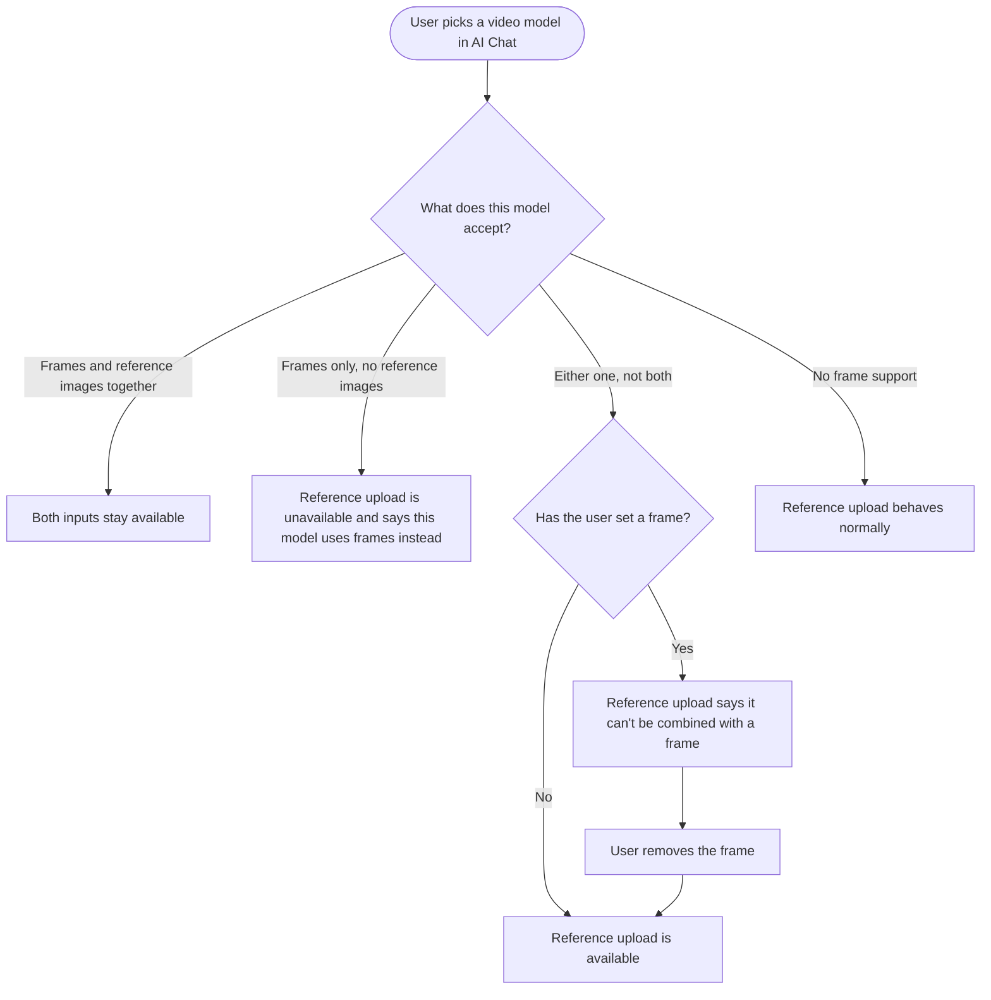

# Story: Fix the AI Chat upload gate that blocks reference images with no frame set

One frontend story. Small, contained, and worth getting exactly right because the current message actively misleads.

---

## [FE] Tell users the real reason a video model won't take a reference image

### Description

In AI Chat, a user picks a video model, tries to add a reference image, and finds the upload button disabled with the message "Start/end frames and reference images can't be used together." They have not added a start or end frame. There is nothing to remove, and no way to act on the message.

The cause is one message covering two different situations. Some video models accept frames but no reference images at all. Others accept both, but not at the same time. Both currently produce the same sentence, so on the first group of models the app describes a conflict the user never created and offers no route forward.

This story separates the two, so a user is told what the model they picked actually accepts.

### Workflow

1. User opens AI Chat and turns on video generation.
2. They pick a model that works from start and end frames only. The reference-image upload is unavailable, and the reason given is that this model uses start and end frames instead of reference images.
3. They pick a model that accepts either frames or reference images but not both, with no frame set. The reference-image upload is available and works.
4. They add a start frame on that model. The reference-image upload now says it cannot be combined with a frame, and removing the frame makes it available again.
5. They pick a model that accepts both. Frames and reference images are both available at the same time.
6. They pick an ordinary video model with no frame inputs. Reference-image upload behaves as it always has.

### Acceptance criteria

- [ ] On a model that accepts frames but not reference images, the reference-image upload explains that the model uses start and end frames instead of reference images. It no longer says the two cannot be used together.
- [ ] On a model where frames and reference images are mutually exclusive, with no frame set, the reference-image upload is available and a reference image can be added successfully.
- [ ] On a model where frames and reference images are mutually exclusive, with a frame set, the reference-image upload is unavailable and the reason given is that it cannot be combined with a start or end frame.
- [ ] Removing the frame on such a model makes reference-image upload available again, without needing a model switch or a page reload.
- [ ] On a model that accepts frames and reference images together, both are available at the same time with no warning.
- [ ] On a model with no frame support, reference-image upload behaves exactly as before this change.
- [ ] The frame slots follow the same rule in reverse: on a model where the two are mutually exclusive, adding a reference image explains that frames cannot be combined with a reference image; on a model that does not accept reference images at all, the frame slots are never disabled by a reference, because there cannot be one.
- [ ] No validation message reports a frames-versus-references conflict when no start or end frame is set.
- [ ] The existing frame validation messages still fire in their own cases: needing both frames on models that require both, and needing a start frame before an end frame.
- [ ] The behaviour is verified on every model that declares frame support, in all three groups, and on at least one ordinary video model with no frame support.
- [ ] The compact toolbar and the full toolbar show the same availability and the same reason. They cannot disagree.
- [ ] Switching between models with different support still cleans up inputs the new model cannot accept, unchanged from current behaviour.
- [ ] Every string is translated and present in every locale directory.

### UI copy

**Reference upload unavailable, because the model does not accept reference images** (new key)
- `This model creates video from start and end frames, so it doesn't use reference images.`

**Reference upload unavailable, because a frame is set and the model can't combine them** (existing key, reworded)
- `Remove your start or end frame to add a reference image. This model can use one or the other, not both.`

**Frame slots unavailable, because a reference image is set and the model can't combine them** (existing key, reworded)
- `Remove your reference image to add a start or end frame. This model can use one or the other, not both.`

**Existing messages, unchanged**
- `Add both a start and end frame, or neither.`
- `Add a start frame to use an end frame.`
- `Frame upload failed. Please try again.`

Note that the current single string is replaced by two direction-specific ones, because the old wording had to serve both directions and therefore told the user what the rule was rather than what to do. All strings go through translation and land in every locale directory in the same change. Note the deliberate absence of em dashes.

### Mock-ups

N/A. No layout change. Existing disabled states and tooltips, corrected wording and corrected conditions.

### Impact on existing data

None. Client-side validation and copy only. No change to what is sent to the generation service.

### Impact on other products

- Web app only. AI chat exists on mobile, but the frame and reference-image video inputs are a web AI-generation surface.
- No backend or AI-service change. The model support table is already correct; only the frontend's interpretation of it is being fixed.

### Dependencies

None.

### Global quality and compliance checklist

- [ ] Mobile responsiveness tested (frontend only, N/A for backend-only stories)
- [ ] Multilingual support verified (frontend + backend, translations available or fallback handled)
- [ ] UI theming supported (default + white-label, design library components are being used)
- [ ] White-label domains impact reviewed
- [ ] Cross-product impact assessed (web, mobile apps, Chrome extension)

### Implementation references

*Pointers from research — not a contract. Engineering may choose a different approach.*

**The three places one message currently serves two causes**, all in `contentstudio-frontend/src/components/dashboard/ChatInput.vue`:

1. `genericUploadsAllowed` (line 1436) is `support.allowReferences && (support.referencesWithFrames || !hasFrames.value)`. False for either cause. It drives `:disabled="!genericUploadsAllowed"` on the upload dropdown (line 454) and `:can-upload="genericUploadsAllowed"` on the compact toolbar (line 433), with the same tooltip string at lines 443 to 445.
2. `framesDisabled` (line 1448) is `hasReferences.value && (!support.allowReferences || !support.referencesWithFrames)`. Also two causes, and the `!support.allowReferences` half is unreachable in practice once references are cleared on model switch, so it may be dead. Worth checking before keeping it. Drives the frame-slot tooltip and disabled state at lines 116 to 127.
3. `frameReferenceConflict` (line 1429) has the clearest defect: `if (!support.allowReferences) return true` returns a conflict without consulting `hasFrames` at all. It feeds `frameSelectionInvalid` (line 1395) and `frameValidationMessage` (line 1405).

Splitting the boolean into two named computeds, one per cause, and selecting the message from which one is true, is the smallest change that fixes all three sites consistently.

**The support table** is in `contentstudio-frontend/src/composables/useVideoGeneration.ts`, documented at lines 61 to 71 with `bothRequired`, `allowReferences` and optional `referencesWithFrames`. It is correct and should not need changing. The affected group is `allowReferences: false`, which today is `kling-video-v2.5-turbo-pro` and `flux-3`. The both-together group is `kling-video-v3-standard` and `kling-video-o1`. Everything else with frame support is mutually exclusive.

**Do not break the existing normalisation.** `contentstudio-frontend/src/composables/useAIChatMessage.ts` `updateVideoModel` (line 248) already drops frames the new model cannot accept and, at line 272, drops references when switching to a frames-only model. That logic is correct and is why the frames-only case never has both set at once.

**`hasReferences` counts three things** (line 1422): uploaded images, and `referenceFiles`, with `referenceClips` factored in elsewhere. The reference audio and video inputs added for MiniMax H3 feed the same computed, so check that story's behaviour still holds after the change.

**Suggested test matrix**, one case per row: frames-only model with a reference attempt; mutually exclusive model with no frame; mutually exclusive model with a start frame; mutually exclusive model with both frames; both-together model with a frame and a reference; a `bothRequired` model with one frame; an ordinary model with no frame support; and a switch from each group to each other group.
