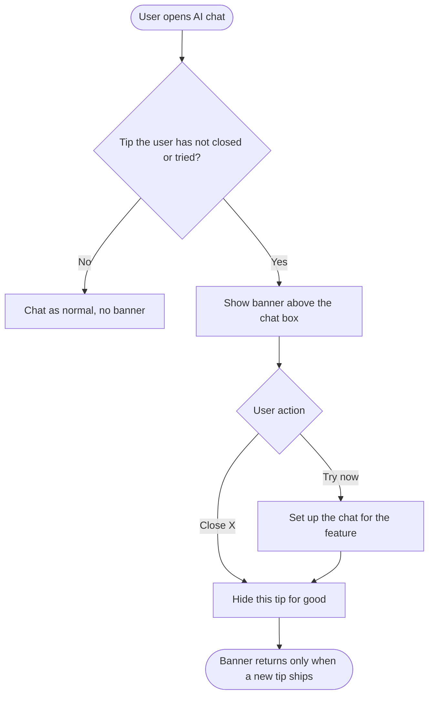

# Stories: AI chat polish

Epic: **Q3 - 2026: AI updates**

1. `[Design] Design the live step timer and the "What's new" banner in AI chat`
2. `[FE] Show a live elapsed timer on the running step in AI chat`
3. `[BE] Remove logo backgrounds and place logos with enough contrast in generated images, carousels and videos`
4. `[FE] Make typing and streaming in AI chat feel smooth`
5. `[FE] Show a "What's new" banner above the AI chat box with a Try now button`

---

# [Design] Design the live step timer and the "What's new" banner in AI chat

### Description

As a designer, I want to define how a running AI step shows its elapsed time and how the new "What's new" banner looks above the AI chat box, so that devs build both from one agreed reference and the banner feels like part of the chat rather than an interruption.

The timer is a small change to an existing row. The banner is new. The PO approved its direction on the prototype (link below): a slim banner docked directly above the chat box, holding only a badge, a headline, one line of subtext, a **Try now** button and a close (X). No image, no counter, no next or previous arrows. This story turns that prototype into final designs.

---

### Workflow

1. Designer reviews the AI chat step timeline as it is today: the running step shows "running", finished steps show their time.
2. Designer defines the running state with a ticking timer (for example "4s") in place of "running", and the header while the turn is still working.
3. Designer reviews the approved prototype of the "What's new" banner.
4. Designer finalises the banner in its two variants: **New** (a new feature) and **Did you know** (an existing feature).
5. Designer places it above the chat box on the full AI chat page and in the AI chat side panel, and shows how it wraps at narrow widths.
6. Designer defines how the banner enters and leaves.

---

### Acceptance criteria

**Live step timer**

- [ ] The running step state is designed with a live timer in place of "running", plus the finished state for comparison

**What's new banner**

- [ ] The banner is designed docked directly above the chat box, the same width as the chat box
- [ ] It contains only: a badge, a headline, one line of subtext, a **Try now** button and a close (X). No image, no counter, no arrows
- [ ] Two variants are designed: **New** (primary-coloured "NEW" badge) and **Did you know** (lighter "Did you know" badge). The badge sits inline, just before the headline on the same line, not on its own at the left edge of the banner
- [ ] It is shown on the full AI chat page and in the narrow AI chat side panel, including how headline, subtext and buttons wrap when space is tight
- [ ] Entry and exit motion is specified
- [ ] Colours follow the workspace's primary theme colour, and a white-label version with a non-blue primary is shown
- [ ] Every element is mapped to an existing `@contentstudio/ui` component (`Badge`, `Button`, `ActionIcon`, `Icon`), or flagged as a gap
- [ ] Designs are handed off to **[FE] Show a live elapsed timer on the running step in AI chat** and **[FE] Show a "What's new" banner above the AI chat box with a Try now button**

---

### Mock-ups:

Approved prototype (New and Did you know variants): https://claude.ai/artifact/YRL6ukhZXD1QG12YgyjG8p

---

### Impact on existing data:

None.

---

### Impact on other products:

Web app. AI chat also exists in the mobile app. Designs should note whether the same banner would carry over if a mobile story is added later.

---

### Dependencies:

None. Blocks **[FE] Show a live elapsed timer on the running step in AI chat** and **[FE] Show a "What's new" banner above the AI chat box with a Try now button**.

---

### Global quality & compliance (wherever applicable)

- [ ] Mobile responsiveness (frontend only, N/A for backend-only stories)
- [ ] Multilingual support (frontend + backend, translations available or fallback handled)
- [ ] UI theming support (default + white-label, design library components are being used)
- [ ] White-label domains impact review
- [ ] Cross-product impact assessment (web, mobile apps, Chrome extension)
- [ ] Developer surfaces coverage: N/A, design only, nothing API-facing changes

---

# [FE] Show a live elapsed timer on the running step in AI chat

### Description

As a ContentStudio user waiting on the AI, I want the step it is working on to count up the seconds as they pass, so that I can see it is still making progress and roughly how long it is taking, instead of staring at a static "running" label.

Today every finished step shows how long it took, but the step that is still running only says "running". For longer steps, like building a carousel or generating a video, that looks the same after 2 seconds as after 40, and users can't tell whether anything is happening. This story shows the live elapsed time on the running step, and when the step finishes it settles on its final time exactly as today.

---

### Workflow

1. User asks AI chat to create a carousel about their product launch.
2. User sees the step list start. The running step shows its title, for example "Building the slides", with a timer counting up: "1s", "2s", "3s" and so on.
3. When the step finishes, the timer stops and the row shows the final time it took, the same way finished steps show it today.
4. The next step starts and its own timer begins from "0s".
5. While the turn is still working, the timeline header shows the total time so far, for example "Working for 12s". When the turn finishes it shows "Worked for 18.4s" as today.
6. If the user reloads the page or comes back to the chat while a step is still running, the timer shows the real time since the step started, not "0s".

---

### Acceptance criteria

- [ ] The running step shows a live elapsed timer in place of the "running" label
- [ ] The timer updates once per second and starts at "0s"
- [ ] Under a minute it reads in whole seconds ("7s"). From one minute it reads minutes and seconds ("1m 5s")
- [ ] When the step finishes, the timer stops and the row shows the step's final time from the server, formatted as finished steps are today
- [ ] Only the step that is running ticks. Finished steps never change after they finish
- [ ] While the turn is working, the timeline header reads "Working for {time}" with the live total. When the turn ends it reads "Worked for {time}" as today
- [ ] The timer is based on when the step actually started, so reloading the page, switching chats and coming back, or reopening the side panel mid-step shows the true elapsed time
- [ ] If a step fails or the user stops the turn, its timer stops at the moment it ended and the existing failed or stopped state is shown
- [ ] The timer never shows a negative value or jumps backwards
- [ ] Running several chats or a long turn doesn't slow the page: timers stop ticking once their step or turn ends
- [ ] "Working for" comes from a translation key in every supported language

---

### Mock-ups:

From **[Design] Design the live step timer and the "What's new" banner in AI chat**.

---

### Impact on existing data:

None. Uses the timing the chat stream already carries.

---

### Impact on other products:

- **Mobile app (Flutter):** no separate story. The PO expects the app to pick up the timer once the web and backend work lands.
- **Chrome extension:** none.

---

### Dependencies:

**[Design] Design the live step timer and the "What's new" banner in AI chat**

---

### Global quality & compliance (wherever applicable)

- [ ] Mobile responsiveness (frontend only, N/A for backend-only stories)
- [ ] Multilingual support (frontend + backend, translations available or fallback handled)
- [ ] UI theming support (default + white-label, design library components are being used)
- [ ] White-label domains impact review
- [ ] Cross-product impact assessment (web, mobile apps, Chrome extension)
- [ ] Developer surfaces coverage: N/A, nothing API-facing changes

---

# [BE] Remove logo backgrounds and place logos with enough contrast in generated images, carousels and videos

### Description

As a brand using ContentStudio's AI to create images, carousels and videos, I want my logo to sit cleanly on whatever the AI creates, without a white box around it and without disappearing into a background of the same colour, so that the result looks professionally branded and I can post it without fixing the logo by hand.

Many logos, especially ones fetched from a website, come with a solid white (or other flat) background. When the AI places that logo on a dark image or a dark carousel slide, the white box shows and it looks bad. The opposite also happens: a dark logo placed on a dark area, or a light logo on a light area, can't be seen.

This story fixes both ends:

- **When the logo comes in** (fetched from the website during brand analysis, uploaded in Brand Knowledge, or added as a logo brand asset), ContentStudio removes a flat background and keeps a transparent version, alongside the original.
- **When the AI places the logo** in an image, a carousel slide or a video, it checks whether the logo will be visible on the spot it is going to, and if not, adjusts: a subtle outline or plate behind it, or a light or dark single-colour version of the mark.
- **Videos get the logo too.** Today generated videos have no logo at all. With brand on, the logo is now added to generated videos as well, with the same clean, visible treatment.

The user's own logo is never changed. Brand Knowledge keeps showing exactly what they uploaded. The transparent copy is used only behind the scenes when the AI places the logo.

---

### Workflow

1. User enters their website during onboarding. ContentStudio fetches their logo, a round mark on a white square.
2. ContentStudio stores a transparent version of the logo with the white square removed, and keeps the original.
3. User asks AI chat for an image with a dark background for their new product.
4. The image comes back with the logo in a corner. There is no white box around it.
5. User's logo is dark navy, and the chosen corner is also dark. Instead of the logo disappearing, it appears with a light outline (or as a white version of the mark) so it can be read.
6. User generates a carousel with a dark template. Every slide shows the logo cleanly, with a contrast plate only on the slides that need one.
7. User generates a 10-second product video with brand on. The logo sits as a small mark in a corner through the video, visible against both light and dark scenes, with no white box.
8. User uploads a new logo in Brand Knowledge that also has a white background. Brand Knowledge shows it as uploaded. The same cleanup happens behind the scenes, and the next generation uses the transparent version.

---

### Acceptance criteria

**Cleaning the logo at intake**

- [ ] When a logo is fetched from the user's website, uploaded in Brand Knowledge, or added as a logo brand asset, ContentStudio checks whether it has a flat background (a single solid colour touching the image edges, most often white)
- [ ] If it does, a transparent PNG version is created with that background removed and saved alongside the original. The original is kept unchanged
- [ ] Brand Knowledge, onboarding and every other screen keep showing the logo exactly as the user uploaded or approved it. The transparent copy is never shown to the user and never replaces their logo
- [ ] Logos that are already transparent are left as they are
- [ ] The cleanup doesn't eat into the logo: white or light shapes *inside* the mark (for example white lettering on a coloured circle) are kept, and only the background connected to the image edges is removed
- [ ] If the cleanup can't separate the logo from its background with confidence (for example a photo or a gradient backdrop), the original is used and nothing breaks
- [ ] Existing brand profiles get a transparent version the next time a generation needs their logo, with no manual action from the user

**Placing the logo in generated images**

- [ ] Image generation always uses the transparent version of the logo when one exists
- [ ] Before a logo is placed as an overlay, the contrast between the logo and the area it will cover is measured
- [ ] When the contrast is too low, the logo is made visible by one of: a subtle outline, a soft plate behind it, or a white or black single-colour version of the mark. The logo's own colours are used whenever contrast is fine
- [ ] When the logo is worked into the scene by the image model (on a product, in the scene), the model is told the logo has a transparent background, must not be drawn on a box, and must stay readable against its surroundings
- [ ] A test set of at least: dark logo on dark image, light logo on light image, white-background logo on dark image, and transparent logo on busy photo all produce a visible logo with no background box

**Placing the logo on carousel slides**

- [ ] Carousels use the transparent version of the logo, so a white-background logo no longer shows as a white box on dark slides
- [ ] The existing contrast plate is applied per slide only where the logo would otherwise be hard to see, and never on slides where it is already clear

**Placing the logo in generated videos**

- [ ] With brand on and a logo available, generated videos (text-to-video and image-to-video) carry the logo as a small corner mark for the whole video. With brand off, no logo is added
- [ ] The video logo uses the transparent version, so no background box shows
- [ ] The corner is chosen so the logo stays readable through the video: contrast is checked across the frames, and an outline, soft plate or single-colour version is used when the scene is too close to the logo's colours
- [ ] The mark is small and slightly transparent, and never covers faces or on-screen text where these can be detected
- [ ] Videos made from an image that already shows the logo don't get a second logo
- [ ] A test set of at least a dark video, a light video and a video that changes from light to dark shows a visible logo with no background box

**Limits**

- [ ] SVG logos keep working as they do today or are converted so they can be used. They are never silently dropped without a fallback
- [ ] Nothing changes about the white-label app logo, which is a separate setting

---

### Mock-ups:

None. Behaviour change in generated output. Before and after samples of the image, carousel and video test cases should be attached to the pull request.

---

### Impact on existing data:

A transparent version of the logo is stored alongside the existing one for each brand profile and logo brand asset. The original is never overwritten, so the change can be rolled back.

---

### Impact on other products:

- **Videos:** generated videos get the logo for the first time. The video price and generation time must not change noticeably because of it.
- **Mobile app:** AI generation is web-only. No mobile impact.
- **Brand Knowledge:** always shows the logo exactly as the user uploaded it. The cleaned copy is never shown to the user and never replaces their logo. It is only used behind the scenes when the AI places the logo (PO decision, 2026-09-30).

---

### Dependencies:

None.

---

### Global quality & compliance (wherever applicable)

- [ ] Mobile responsiveness: N/A, backend only
- [ ] Multilingual support (frontend + backend, translations available or fallback handled)
- [ ] UI theming support: N/A, backend only
- [ ] White-label domains impact review
- [ ] Cross-product impact assessment (web, mobile apps, Chrome extension)
- [ ] Developer surfaces coverage (any new or changed API is reflected in the public API, CLI, MCP server and automation apps, N/A when nothing API-facing changes)

---

# [FE] Make typing and streaming in AI chat feel smooth

### Description

As a ContentStudio user chatting with the AI, I want typing my message and reading the AI's answer to feel as smooth and instant as in Claude, ChatGPT or Grok, so that AI chat feels like a premium tool I enjoy using, not one I wait on.

Today the chat can feel less fluid than those apps, both while the user types and while a long answer streams in. This story starts with research: profile what causes the lag, compare our input and streaming against the leading chat apps, and agree the target feel. Then it fixes what the research finds.

Early suspects from the code:

- Every time a few more characters of the answer are revealed, the whole answer is processed again from the start, so long answers get heavier as they grow.
- The word-by-word fade adds a lot of moving pieces to the page on long answers.
- The `@` and `/` menus listen on every keystroke.
- Scrolling can fight the user while an answer streams.

---

### Workflow

1. User opens AI chat and types a long message quickly, including an `@` mention of an image and a `/` skill.
2. Every character appears the moment the key is pressed, with no stutter, even while a previous answer is still streaming.
3. The `@` and `/` menus open instantly and don't slow typing down.
4. User sends the message and the answer streams in at a steady, readable pace, with no stutter, even when it runs to several screens with lists, tables and code blocks.
5. User scrolls up to reread an earlier line while the answer is still streaming. The chat stays where the user put it and doesn't pull them back to the bottom.
6. A small "Jump to latest" control lets the user return to the live end of the answer.
7. When the answer finishes, nothing on the page jumps or re-flows.

---

### Acceptance criteria

**Research (first half of the story)**

- [ ] A short written comparison of typing and streaming in AI chat vs Claude, ChatGPT and Grok, covering input delay, reveal pace, how unfinished formatting (half-written lists, tables, code) is shown, scroll behaviour and the end-of-answer settle
- [ ] Profiling results for AI chat on a mid-range laptop, naming the top causes of input delay and dropped frames
- [ ] A recommendation the PO signs off before the fixes start

**Typing**

- [ ] Characters appear with no visible delay while typing at speed, including while an answer is streaming in the same chat
- [ ] Opening the `@` mention menu or the `/` skills menu doesn't pause typing
- [ ] Pasting a long block of text (around 5,000 characters) doesn't freeze the input

**Streaming**

- [ ] A long answer (several screens with headings, lists, a table and a code block) streams without stutter, and the effort per update doesn't grow with the length of the answer
- [ ] Half-written formatting never flashes raw symbols (for example a table shows as a table as it fills in, not as rows of pipes)
- [ ] When an answer finishes, the page doesn't jump or re-flow

**Scrolling**

- [ ] While the user is at the bottom, the chat follows the answer as it streams
- [ ] If the user scrolls up during streaming, the chat stays where they left it
- [ ] A "Jump to latest" control appears when the user is away from the bottom during streaming, and takes them back to the end

**Checks**

- [ ] Before and after measurements for input delay and frame rate are attached to the pull request

---

### Mock-ups:

None expected, unless the research recommends a visible change (for example the "Jump to latest" control or a new reveal style). In that case the designer is looped in through **[Design] Design the live step timer and the "What's new" banner in AI chat** or a follow-up.

---

### Impact on existing data:

None.

---

### Impact on other products:

- **Mobile app (Flutter):** covered by **[Flutter] Make typing and streaming in AI chat feel smooth** in the Flutter AI chat epic.
- **AI Studio:** uses the same chat input and answer rendering, so it benefits too.

---

### Dependencies:

None.

---

### Global quality & compliance (wherever applicable)

- [ ] Mobile responsiveness (frontend only, N/A for backend-only stories)
- [ ] Multilingual support (frontend + backend, translations available or fallback handled)
- [ ] UI theming support (default + white-label, design library components are being used)
- [ ] White-label domains impact review
- [ ] Cross-product impact assessment (web, mobile apps, Chrome extension)
- [ ] Developer surfaces coverage: N/A, nothing API-facing changes

---

# [FE] Show a "What's new" banner above the AI chat box with a Try now button

### Description

As a ContentStudio user opening AI chat, I want a short note above the chat box telling me about something I can do there, with a button that lets me try it straight away, so that I discover features like Skills and image mentions instead of never finding them.

AI chat keeps gaining abilities, and nothing in the chat tells users they exist. This story adds a slim **"What's new" banner** docked directly above the chat box. It holds only a badge, a headline, one line of subtext, a **Try now** button and a close (X). There is no image, no counter and no next or previous arrows: one tip at a time.

There are two kinds of tips:

- **New**: a feature released recently. Shows first, with a "NEW" badge.
- **Did you know**: a feature that is already live and worth knowing about, with a "Did you know" badge.

When the user closes a tip, it doesn't come back. There is deliberately no "don't show again" option: the banner reappears only when the team ships a new tip, so users always hear about new releases. Adding a tip is one new entry in a list.

**Launch tips:** New = Skills with `/`. Did you know = tagging an uploaded image with `@`.

---

### Workflow

1. User opens AI chat. Above the chat box they see a banner: a **NEW** badge, **"Use Skills with /"**, *"Save instructions you use often, like your brand's tone, and add them to any message by typing /."*, a **Try now** button and an X.
2. User clicks **Try now**. The banner closes, `/` is typed into the chat box and the skills list opens.
3. Next time they open AI chat, they see the next tip: a **Did you know** badge, **"Point the AI at an image with @"**, *"Attached a few images? Type @ and pick one to tell the AI exactly which image you mean."*
4. User clicks the X. The banner goes away and doesn't come back.
5. Weeks later the team ships a new AI chat feature and adds a New tip. The next time the user opens AI chat, the banner appears again with that tip.

---

### Acceptance criteria

**When the banner shows**

- [ ] The banner shows above the chat box when AI chat opens (full AI chat page and the AI chat side panel) and there is at least one tip the user hasn't closed or tried
- [ ] Only one tip shows at a time. New tips show before Did you know tips, newest first
- [ ] It never shows while an answer is streaming, and it disappears once the user sends their first message in that chat. It shows again on the next visit if the user neither closed nor tried it
- [ ] A tip for a feature the user can't use (their plan or role doesn't include it) is not shown
- [ ] When there is no tip left to show, there is no banner and no empty space above the chat box

**Banner content**

- [ ] The banner holds only: a badge, a headline, one line of subtext, a **Try now** button and a close (X). No image, no counter, no arrows
- [ ] New tips use a primary-coloured "NEW" badge. Did you know tips use a lighter "Did you know" badge (`Badge` component). The badge sits inline, just before the headline on the same line, not on its own at the left edge of the banner
- [ ] Try now uses `Button` from `@contentstudio/ui` and the close uses `ActionIcon` with the accessible label "Close". No hardcoded colours, so white-label domains show their own primary colour
- [ ] The banner is the same width as the chat box. In the narrow side panel, the subtext wraps and the buttons stay on the banner

**Try now**

- [ ] **Skills** tip: focuses the chat box, types `/` and opens the skills list
- [ ] **Image mention** tip: when the chat has attached images, focuses the chat box, types `@` and opens the attachment list. When there are none, it opens the attach control with the hint "Attach an image, then type @ to point the AI at it."
- [ ] Any text already in the chat box is kept. What Try now adds goes after it, with a space
- [ ] Try now never sends a message by itself
- [ ] Try now closes the banner and counts that tip as done, the same as the X

**Closing**

- [ ] The X hides the banner straight away, and that tip never shows again for that user
- [ ] There is no "don't show again" or "hide all tips" option. A newly added tip always shows, even to users who closed earlier ones
- [ ] Closed and tried tips are remembered per user across devices and sessions

**Adding tips**

- [ ] Tips come from one list. Each entry has: id, type (New or Did you know), release date, headline, subtext, and Try now action (open skills, open mentions, or fill a prompt)
- [ ] Adding a tip needs only a new entry in that list, with no other code changes

**Tracking**

- [ ] Try now fires `ai_chat_tip_tried` with `{ tip_id, tip_type }` (`tip_type` is `new_feature` or `did_you_know`)
- [ ] The X fires `ai_chat_tip_dismissed` with `{ tip_id, tip_type }`

**Launch copy**

- [ ] New: badge "NEW" / headline "Use Skills with /" / subtext "Save instructions you use often, like your brand's tone, and add them to any message by typing /." / button "Try now"
- [ ] Did you know: badge "Did you know" / headline "Point the AI at an image with @" / subtext "Attached a few images? Type @ and pick one to tell the AI exactly which image you mean." / button "Try now"
- [ ] All banner copy comes from translation keys in every supported language

---

### Mock-ups:

Approved prototype: https://claude.ai/artifact/YRL6ukhZXD1QG12YgyjG8p (both variants are clickable: Try now and close work). Final designs from **[Design] Design the live step timer and the "What's new" banner in AI chat**.

---

### Impact on existing data:

Adds closed and tried tip ids to the user's saved preferences, the same place the app already remembers seen "New" badges. No other data changes.

---

### Impact on other products:

- **Mobile app (Flutter):** AI chat exists there too. Not in scope for this story.
- **App-wide changelog:** the existing changelog in the navigation stays as it is. This banner covers AI chat abilities only.

---

### Dependencies:

**[Design] Design the live step timer and the "What's new" banner in AI chat**

---

### Global quality & compliance (wherever applicable)

- [ ] Mobile responsiveness (frontend only, N/A for backend-only stories)
- [ ] Multilingual support (frontend + backend, translations available or fallback handled)
- [ ] UI theming support (default + white-label, design library components are being used)
- [ ] White-label domains impact review
- [ ] Cross-product impact assessment (web, mobile apps, Chrome extension)
- [ ] Developer surfaces coverage: N/A, nothing API-facing changes
