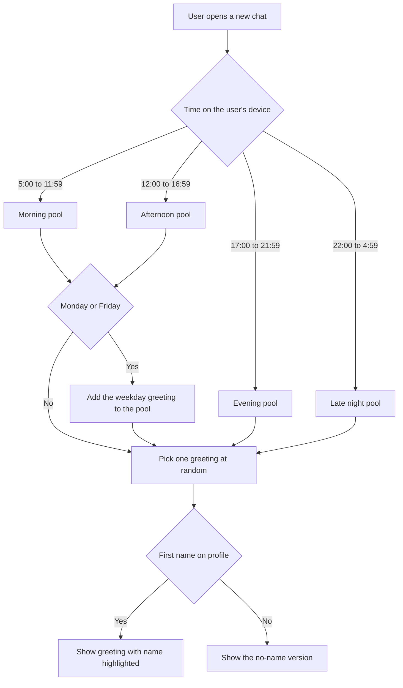

# AI Chat: time-of-day greeting on the new chat screen — Stories

Two stories:

1. [Design] Design the time-of-day greeting headline for the AI Chat new chat screen
2. [FE] Show a personalised time-of-day greeting above the AI Chat composer

---

## [Design] Design the time-of-day greeting headline for the AI Chat new chat screen

### Description:

As a ContentStudio user opening AI Chat, I want the headline above the chat box to feel warm and clearly readable, so that the new chat screen feels welcoming and personal instead of a small grey line of text.

Today the new chat screen shows "Let's make something scroll-stopping" in a small, regular-weight grey heading that gets cut off on narrow screens and gets lost against the dotted gradient background. This story sets the look for the greeting that replaces it.

---

### Workflow:

1. Designer reviews the current new chat screen (full AI Chat page and the AI Chat modal) and the greeting copy pool in **[FE] Show a personalised time-of-day greeting above the AI Chat composer**.
2. Designer defines the headline style: font size, weight, line height and colour for desktop and for phone width.
3. Designer defines how the user's first name is highlighted inside the greeting, using the workspace's primary brand colour.
4. Designer confirms the 600px cut-off between wide screens (all greetings) and narrow screens (short greetings only).
5. Designer checks the longest greetings (for example "Winding down or just getting started, Alexandra?" and the German and Greek translations) to confirm they wrap to two lines cleanly and never collide with the chat box.
6. Designer defines the entrance motion when a new chat opens (a short fade and rise, or none) and the spacing between greeting and chat box.
7. Designer hands off the specs to the FE story.

---

### Acceptance criteria:

- [ ] Headline spec covers desktop and phone width: font family, size, weight, line height, colour and max width
- [ ] Name highlight uses the primary theme colour (so it follows white-label brand colours), never a fixed blue
- [ ] Spec shows the greeting both with a name ("Good morning, Ghulam!") and without one ("Good morning!")
- [ ] Spec shows a Long greeting on a wide screen and a Short greeting at phone width, plus one greeting wrapping to two lines in a long-word language (German or Greek)
- [ ] Spacing between the greeting and the chat box is defined for both the full AI Chat page and the AI Chat modal
- [ ] Entrance motion is defined (duration and easing), including the reduced-motion behaviour (no animation)
- [ ] Specs are shared as a Figma frame linked on this story

---

### Mock-ups:

Current state: the new chat screen shows "Let's make something scroll-stopping" above the chat box, in small grey type.

Interactive previewer of every greeting, time band, weekday, name and screen width: [Greeting Previewer](https://claude.ai/artifact/R8gfb4a2LzEK9JLwhdWszR)

---

### Impact on existing data:

None.

---

### Impact on other products:

- **White-label:** the name highlight must use the primary theme colour so it matches each white-label brand.
- **Mobile app (Flutter):** not in scope. The Flutter AI assistant has its own empty state and can adopt this design later.
- **Chrome extension:** not affected.

---

### Dependencies:

None. Blocks **[FE] Show a personalised time-of-day greeting above the AI Chat composer**.

---

### Global quality & compliance (wherever applicable)

- [ ] Mobile responsiveness (frontend only, N/A for backend-only stories)
- [ ] Multilingual support (frontend + backend, translations available or fallback handled)
- [ ] UI theming support (default + white-label, design library components are being used)
- [ ] White-label domains impact review
- [ ] Cross-product impact assessment (web, mobile apps, Chrome extension)
- [ ] Developer surfaces coverage — N/A, nothing API-facing changes

---

## [FE] Show a personalised time-of-day greeting above the AI Chat composer

### Description:

As a ContentStudio user opening a new AI Chat, I want to be greeted by name with a message that fits the time of day, so that the assistant feels personal and friendly instead of showing the same static line every time.

The static headline "Let's make something scroll-stopping" is replaced by a greeting such as "Good morning, Ghulam!" or "Hey there, night owl!". The greeting is picked from a small pool of variations for the current time of day, so it feels fresh without being random noise. It appears in every supported language and uses the new, more prominent headline style.

---

### Workflow:

1. User opens AI Chat (full page) or the AI Chat modal and lands on the new chat screen.
2. Above the chat box, the user sees a large greeting that matches the time on their own device, with their first name highlighted in the brand colour. Example at 9:15 AM: "Good morning, **Ghulam**!".
3. The user types in the chat box. The greeting stays the same while they type.
4. The user sends a message. The greeting disappears as the conversation starts, exactly as the current headline does today.
5. Later that evening the user clicks **New chat**. They see a greeting from the evening pool, for example "Evening, **Ghulam**! One more great post?".
6. A user with no first name on their profile sees the version without a name, for example "Good evening!".
7. A user whose ContentStudio language is set to German sees the greeting in German. Nothing needs setting up: time, day and language are all picked up automatically.

#### Time bands

Based on the clock on the user's own device (not the workspace timezone, which is for publishing):

| Band | Hours |
|---|---|
| Morning | 5:00 to 11:59 |
| Afternoon | 12:00 to 16:59 |
| Evening | 17:00 to 21:59 |
| Late night | 22:00 to 4:59 |

#### Short and long greetings

Every greeting is marked **Short** or **Long**:

- **Wide screens** (chat area 600px wide or more, for example the full AI Chat page on a laptop) pick from the whole pool, short and long.
- **Narrow screens** (chat area under 600px, for example a phone, or the AI Chat modal when it is narrow) pick from the **short greetings only**. Long greetings never appear there, including when the user clicks **New chat**.

This is set per greeting, not measured from the text, so every language behaves the same way even when a translation runs longer.

#### UI copy: greeting pool

`{name}` is the user's first name and is shown in the brand colour. Every greeting ends with an exclamation mark or a question mark. The punctuation after the name stays in the normal text colour.

| Band | Size | With name | Without name |
|---|---|---|---|
| Morning | Short | Good morning, {name}! | Good morning! |
| Morning | Long | Morning, {name}! What are we posting today? | Morning! What are we posting today? |
| Morning | Short | Rise and create, {name}! | Rise and create! |
| Afternoon | Short | Good afternoon, {name}! | Good afternoon! |
| Afternoon | Long | Afternoon, {name}. Let's make something good! | Afternoon! Let's make something good! |
| Afternoon | Short | Back at it, {name}? | Back at it? |
| Evening | Short | Good evening, {name}! | Good evening! |
| Evening | Short | Still going strong, {name}? | Still going strong? |
| Evening | Long | Evening, {name}! One more great post? | Evening! One more great post? |
| Evening | Long | Winding down or just getting started, {name}? | Winding down or just getting started? |
| Late night | Short | Hey there, night owl! | Hey there, night owl! |
| Late night | Short | Still up, {name}? | Still up? |
| Late night | Long | Burning the midnight oil, {name}? | Burning the midnight oil? |
| Late night | Long | Late night ideas hit different, {name}! | Late night ideas hit different! |

Weekday greetings, added to the morning and afternoon pools on that day only. Both are Long, so they only appear on wide screens:

| Day | Size | With name | Without name |
|---|---|---|---|
| Monday | Long | Happy Monday, {name}. Let's plan the week! | Happy Monday! Let's plan the week! |
| Friday | Long | Happy Friday, {name}. Let's line up the weekend! | Happy Friday! Let's line up the weekend! |

Every time band has at least two short greetings, so narrow screens still get some variety.

**Note for translators:** adapt each greeting so it sounds natural in your language. A literal translation is not required. If "night owl" or "midnight oil" has no natural equivalent, use a friendly late-night greeting that does.

---

### Acceptance criteria:

- [ ] The headline "Let's make something scroll-stopping" no longer appears on the new chat screen of the full AI Chat page or the AI Chat modal
- [ ] The new chat screen shows a greeting from the pool that matches the current time band on the user's device (for example, at 14:30 on a wide screen it shows one of the three afternoon greetings)
- [ ] Band boundaries are respected: 4:59 shows a late night greeting, 5:00 a morning greeting, 12:00 an afternoon greeting, 17:00 an evening greeting, 22:00 a late night greeting
- [ ] On Mondays and Fridays, the morning and afternoon pools on wide screens also include that day's weekday greeting; on other days the weekday greetings never appear
- [ ] When the chat area is under 600px wide (phone, or a narrow AI Chat modal), only greetings marked Short are shown, including after clicking **New chat**
- [ ] When the chat area is 600px wide or more, both Short and Long greetings can be shown
- [ ] The user's first name is shown in the primary brand colour; on a white-label domain it takes that domain's primary colour
- [ ] When the profile has no first name, the matching no-name version is shown, with no stray comma, space or "undefined"
- [ ] The greeting is picked once when the new chat screen opens and does not change while the user types, attaches media, toggles Brand, or resizes the window
- [ ] Clicking **New chat** picks a greeting again, so the user can see a different variation
- [ ] The greeting follows the headline style from **[Design] Design the time-of-day greeting headline for the AI Chat new chat screen** (size, weight, colour, spacing, entrance motion)
- [ ] Any greeting wraps to a maximum of two lines and is never cut off with an ellipsis, on wide screens and at phone width (including longer translations such as German and Greek)
- [ ] With reduced motion turned on in the operating system, the greeting appears with no animation
- [ ] All greetings are translated in every supported language (English, Spanish, Italian, Greek, French, German, Chinese, Swedish, Czech, Polish); if a translation is missing, the English greeting is shown
- [ ] The greeting is shown in the user's ContentStudio language automatically, with no setting to turn on
- [ ] Switching the app language changes the greeting language on the next new chat
- [ ] Time band and weekday are picked up automatically from the user's device, with no setting to turn on
- [ ] Every greeting ends with "!" or "?", and the punctuation after the name is not in the brand colour
- [ ] The dashboard AI Studio widget is unchanged and keeps its "Plan, create & schedule smarter with AI Studio" headline
- [ ] The starter prompt pills (Post, Write, Media, Reporting, Workspace) and the chat box behave exactly as before

---

### Mock-ups:

See the Figma frame from **[Design] Design the time-of-day greeting headline for the AI Chat new chat screen**.

Interactive previewer of every greeting, time band, weekday, name and screen width: [Greeting Previewer](https://claude.ai/artifact/R8gfb4a2LzEK9JLwhdWszR)

---

### Impact on existing data:

None. No stored data changes. The greeting uses the first name already on the user's profile.

---

### Impact on other products:

- **Mobile app (Flutter):** not in scope. The Flutter AI assistant keeps its current empty state. A follow-up can reuse this copy pool.
- **White-label:** name highlight follows the white-label primary colour. Greetings contain no ContentStudio branding, so they are safe on white-label domains.
- **Chrome extension:** not affected.
- **Dashboard AI Studio widget:** not affected (it hides this headline and shows its own).

---

### Dependencies:

- **[Design] Design the time-of-day greeting headline for the AI Chat new chat screen**

---

### Global quality & compliance (wherever applicable)

- [ ] Mobile responsiveness (frontend only, N/A for backend-only stories)
- [ ] Multilingual support (frontend + backend, translations available or fallback handled)
- [ ] UI theming support (default + white-label, design library components are being used)
- [ ] White-label domains impact review
- [ ] Cross-product impact assessment (web, mobile apps, Chrome extension)
- [ ] Developer surfaces coverage — N/A, nothing API-facing changes
