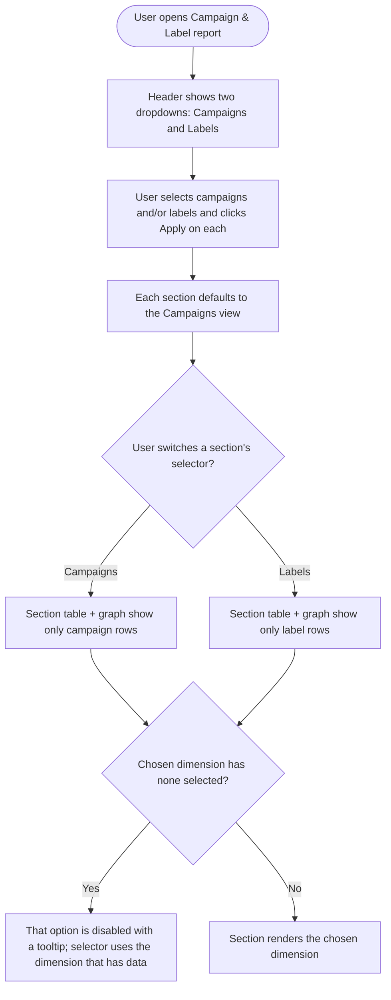

# Stories — Split Campaign & Label in Performance Analytics

---

## [FE] Separate Campaign and Label into dedicated selectors in the Campaign & Label performance report

### Description:

As a ContentStudio user analyzing my content performance, I want **campaigns and labels to be two separate controls** — not merged into one — so that I can filter and read each dimension on its own without them being mixed together.

Today, in **Analytics → Performance Analytics → Campaign & Label** report, campaigns and labels are combined in two ways:

1. The top filter is a **single dropdown** that stacks campaigns and labels together behind one count and one Apply button, so I can't tell at a glance how many of each I've picked.
2. The section tables ("Post breakdown", "Post impressions", "Post engagements") show **campaign rows and label rows interleaved in the same table**, making it hard to compare within a single dimension.

This story splits the top filter into **two dedicated dropdowns** (one Campaigns, one Labels) and adds a **Campaigns / Labels selector to each section heading** so I view one dimension at a time.

This is a **Web App** UI improvement only — no data or reporting logic changes. The same accounts, date range, campaigns, and labels I already select continue to drive the report.

### Workflow:

**Top filter (header row):**
1. User opens the Campaign & Label report. In the header, instead of one combined dropdown, the user now sees **two separate dropdowns side by side: "Campaigns" and "Labels"**, each next to the existing account selector and date range.
2. User clicks the **Campaigns** dropdown. It opens a list of the workspace's campaigns with checkboxes, a "Select all" option, an "Only" shortcut on hover, and a "View all / View less" expander — identical to today's campaigns section, just on its own. User picks campaigns and clicks **Apply**.
3. User clicks the **Labels** dropdown and does the same for labels.
4. Each dropdown's button shows its **own count badge** (e.g., a Campaigns dropdown reading "3 Campaigns selected" and a Labels dropdown reading "2 Labels selected").

**Section dimension selector (per section):**
5. Below the header, each of the three sections — **Post breakdown**, **Post impressions**, **Post engagements** — shows a small **Campaigns / Labels selector** next to its title. Every section **defaults to Campaigns**.
6. When the user switches a section's selector to **Labels**, that section's table (and its paired graph, for Impressions and Engagements) re-renders to show **only label rows**. Switching back to **Campaigns** shows only campaign rows. Each section's selector is **independent** — changing one section does not change the others.
7. If the user has selected **no labels** in the header, the **Labels** option in every section selector is **disabled** (greyed, with a tooltip), and the section stays on Campaigns. Likewise, if the user has selected **no campaigns**, the **Campaigns** option is disabled and the section automatically shows Labels. A section never lands on a dimension that has nothing selected.
8. If the user has selected neither any campaign nor any label, the existing "select a campaign or label" prompt over the report is shown, exactly as today.

### UI copy

**Top filter — Campaigns dropdown**
- Button label (with count badge): **"Campaigns"** with subtext **"selected"** (badge shows the number of selected campaigns; "99+" above 99)
- Section list controls (unchanged from today): "Select all", hover **"Only"** shortcut, **"View all"** / **"View less"**
- Empty list text: **"No campaigns available"**
- Apply button: **"Apply"**

**Top filter — Labels dropdown**
- Button label (with count badge): **"Labels"** with subtext **"selected"** (badge shows the number of selected labels)
- Empty list text: **"No labels available"**
- Apply button: **"Apply"**

**Per-section dimension selector** (`SegmentedControl`, two segments)
- Segment 1: **"Campaigns"**
- Segment 2: **"Labels"**
- Tooltip on the disabled **Labels** segment: **"Select at least one label from the Labels filter at the top to view label data here."**
- Tooltip on the disabled **Campaigns** segment: **"Select at least one campaign from the Campaigns filter at the top to view campaign data here."**

**Section table first-column header** (reflects the selected dimension)
- When Campaigns is selected: **"Campaigns"**
- When Labels is selected: **"Labels"**
- (Today this column reads "Campaigns & Labels"; with a single dimension shown it should name just that dimension.)

### Acceptance criteria:

**Top filter split**
- [ ] The Campaign & Label report header shows **two separate dropdowns** — "Campaigns" and "Labels" — in place of the single combined dropdown.
- [ ] The **Campaigns** dropdown lists only campaigns; the **Labels** dropdown lists only labels. Each has its own checkboxes, "Select all", "Only" on hover, "View all / View less", and "Apply" button.
- [ ] Each dropdown's button shows its **own selected count** badge (campaigns count on the Campaigns dropdown, labels count on the Labels dropdown); counts over 99 show "99+".
- [ ] Applying a selection in one dropdown does not clear or alter the other dropdown's selection.
- [ ] The Campaigns dropdown shows **"No campaigns available"** when the workspace has no campaigns; the Labels dropdown shows **"No labels available"** when there are no labels.
- [ ] Selected campaigns and labels persist across visits exactly as they do today (no change to saved preferences behavior).

**Per-section dimension selector**
- [ ] Each of the three sections (Post breakdown, Post impressions, Post engagements) shows a **Campaigns / Labels `SegmentedControl`** next to its title, defaulting to **Campaigns**.
- [ ] Selecting **Labels** on a section shows only label rows in that section's table; selecting **Campaigns** shows only campaign rows. The Impressions and Engagements sections' graphs reflect the same selected dimension as their table.
- [ ] Each section's selector is **independent** — switching one section does not change the dimension shown in the other two sections.
- [ ] The section table's first-column header reads **"Campaigns"** when Campaigns is selected and **"Labels"** when Labels is selected.
- [ ] When no labels are selected in the header, the **Labels** segment is disabled in every section selector and shows the tooltip **"Select at least one label from the Labels filter at the top to view label data here."**; the section stays on Campaigns.
- [ ] When no campaigns are selected in the header, the **Campaigns** segment is disabled and each section automatically shows Labels (with the matching Campaigns-disabled tooltip).
- [ ] A section never displays a dimension that has zero items selected.
- [ ] When neither any campaign nor any label is selected, the existing "select a campaign or label" prompt over the report displays as it does today.

**No regressions**
- [ ] Account selector, date-range picker, export/report actions, fullscreen (maximize) table modal, sorting, and the empty/loading/error states all continue to work as before.

### Mock-ups:

N/A — refinement of an existing view. No new mockups provided; copy and component names are specified above.

### Impact on existing data:

None. This is a client-side UI change. Campaign/label data, the reporting API, and saved analytics preferences (which already store campaigns and labels as separate lists) are unchanged.

### Impact on other products:

- **Mobile (iOS/Android):** No impact — this detailed Campaign & Label performance report is Web App only.
- **Chrome extension:** No impact.
- **White-label:** Must render correctly on white-label domains (uses theme-aware components/colors).

### Dependencies:

None.

### Global quality & compliance (wherever applicable)

- [ ] Mobile responsiveness (frontend only, N/A for backend-only stories)
- [ ] Multilingual support (frontend + backend, translations available or fallback handled)
- [ ] UI theming support (default + white-label, design library components are being used)
- [ ] White-label domains impact review
- [ ] Cross-product impact assessment (web, mobile apps, Chrome extension)

### Implementation references
*Pointers from research — not a contract. Engineering may choose a different approach.*

**Primary entry points:**
- `contentstudio-frontend/src/modules/analytics/views/performance-report/label-and-campaign/components/FilterBar.vue` — header layout; today renders one `<LabelAndCampaignSelect />`. Split into a Campaigns dropdown + a Labels dropdown here.
- `contentstudio-frontend/src/modules/analytics/views/performance-report/label-and-campaign/components/LabelAndCampaignSelect.vue` — currently one dropdown with two internal `Collapsible` sections (campaigns + labels) and one Apply. Consider extracting a single reusable dimension selector that takes a `type` ('campaigns' | 'labels') and reuse it twice, rather than duplicating the markup.
- `contentstudio-frontend/src/modules/analytics/views/performance-report/label-and-campaign/components/OverviewSection.vue` — renders the three `LableAndCampaignTable` instances (types `breakdown` / `impressions` / `engagements`) plus the Impressions/Engagements graphs. Add per-section dimension state here and pass it down.
- `contentstudio-frontend/src/modules/analytics/views/performance-report/label-and-campaign/components/LableAndCampaignTable.vue` — the table already receives rows; each row carries a `type` of `'labels'` or `'campaigns'`. Filter by the selected dimension here and render the section `SegmentedControl` in the header row (the "Campaigns & Labels" first-column header string comes from `analytics.label_and_campaign.components.table.campaigns_labels_header`).
- `graphs/ImpressionsGraph.vue`, `graphs/EngagementsGraph.vue` — honor the section's selected dimension.

**Existing patterns to preserve:**
- Selections already flow through `selectedCampaignsAndLabels = { campaigns: [], labels: [] }` and persist via `updatePreferences(PREFERNCES_TYPES.campaigns_and_labels)` in `composables/useLabelAndCampaign.js` — the two arrays are already separate, so the split needs no preference-shape change.
- Breakdown rows are built from `keys = [...selectedLabels, ...selectedCampaigns]` in `transformBreakdownData` / `transformBreakdownDatabyImpression` / `transformBreakdownDatabyEngagements`, each row tagged with `type`. Client-side filtering by `type` is enough — no API change.
- Empty/loading/"data fetching"/no-data and the maximize modal already live in `LableAndCampaignTable.vue`; keep them intact.

**Component note (needs PO/design confirmation):**
- The user described the per-section control as a "dropdown". This story specs a `SegmentedControl` (Campaigns / Labels) instead, since it's the design-system control for a two-option single-select toggle and supports disabling the empty dimension cleanly. If a dropdown is preferred, use `Dropdown` / `DropdownItem` from `@contentstudio/ui`.

**i18n:** Add keys under the `analytics` namespace (e.g., `analytics.label_and_campaign.components.select.campaigns` / `.labels` already exist for the section headers — reuse where possible; add new keys for the two dropdown button labels, the section selector segments, and the two disabled-segment tooltips) in **all** locale directories under `src/locales/`.

---

### Shortcut fields

- **Template:** New Feature Template
- **Story type:** feature
- **Project:** Web App
- **Group:** Frontend
- **Epic:** Q2 - 2026: Miscellaneous
- **Priority:** Medium (P1)
- **Product Area:** Analytics
- **Skill Set:** Frontend
- **Estimate:** *(empty — devs estimate during sprint planning)*
- **Labels:** *(none)*
- **Iteration:** *(PO assigns current/target sprint at creation)*
