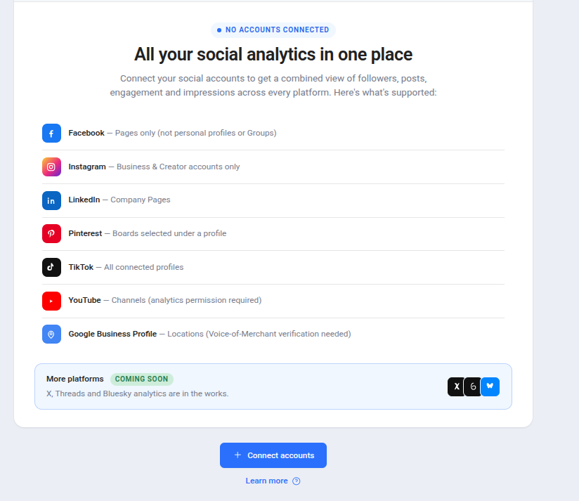
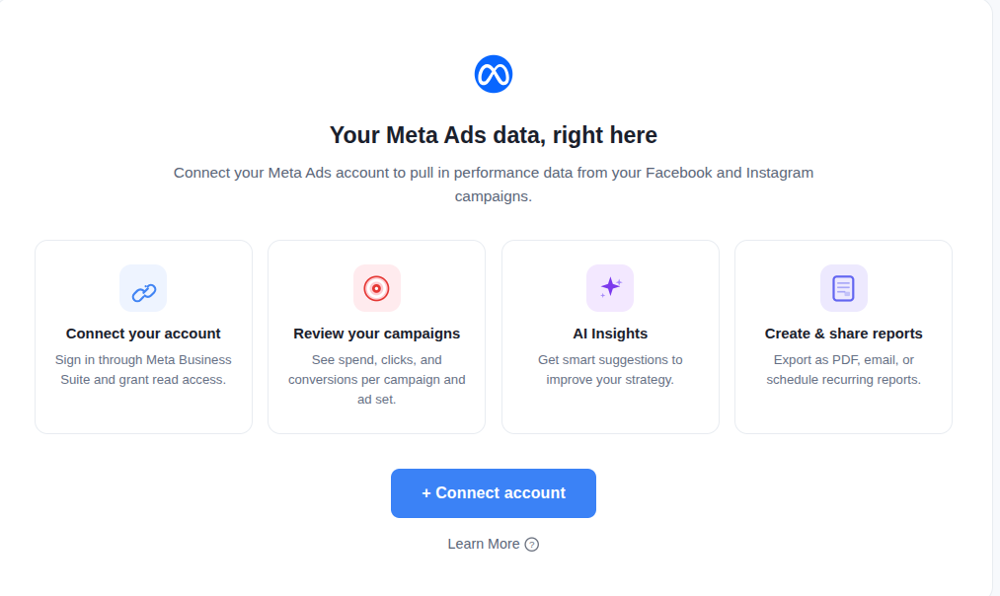
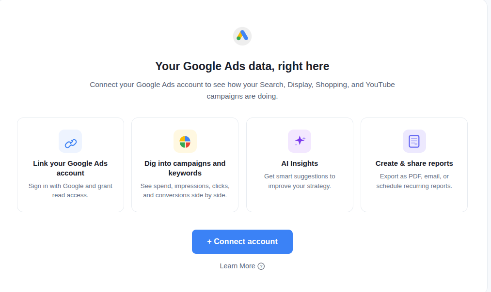
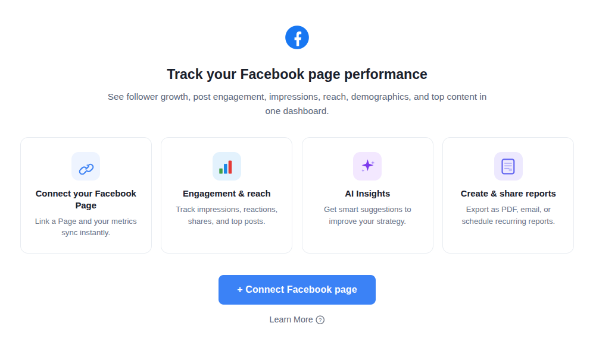
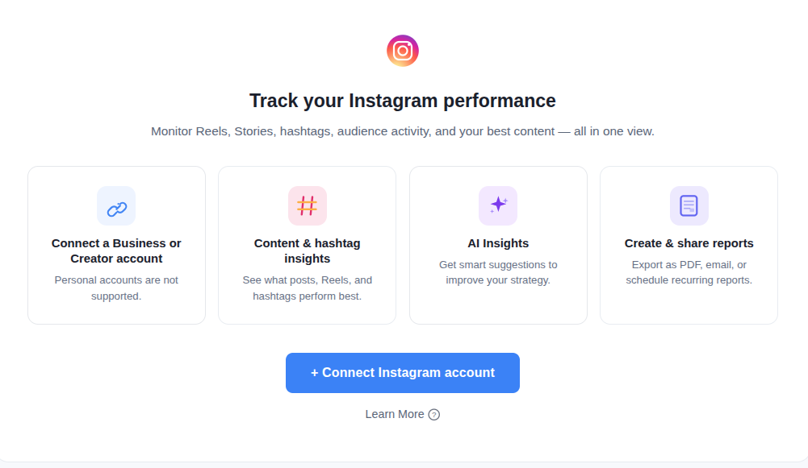
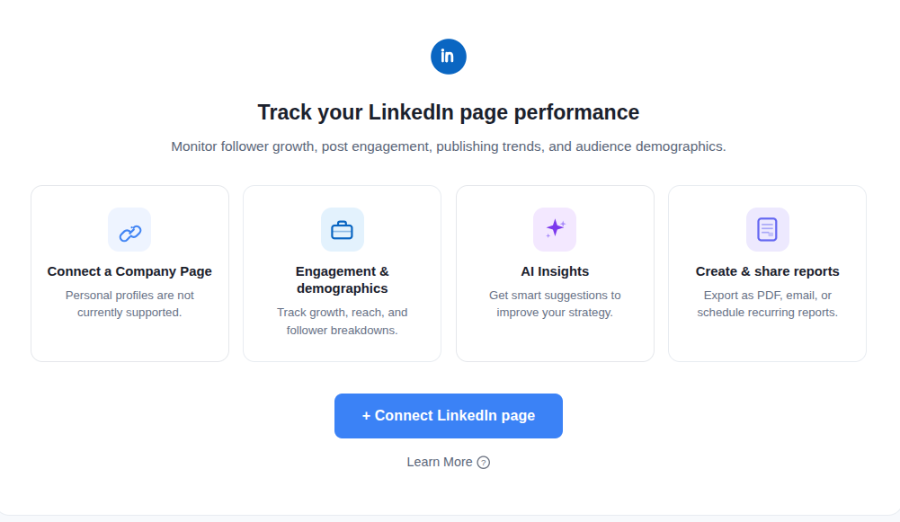
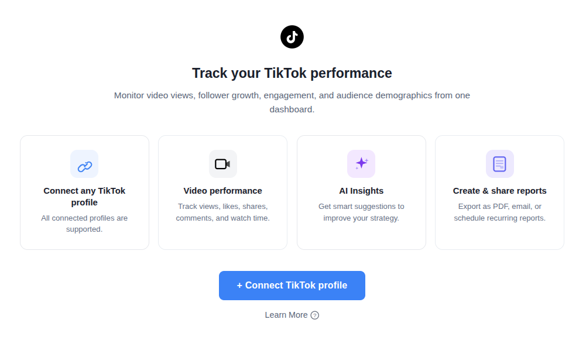
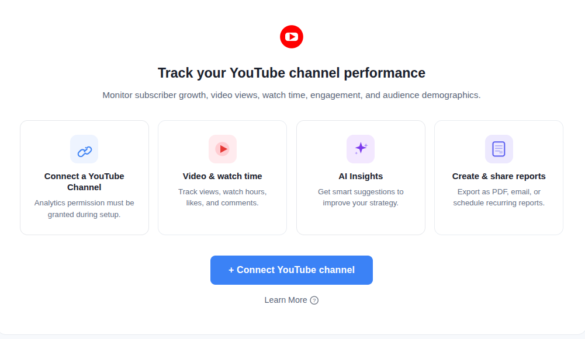
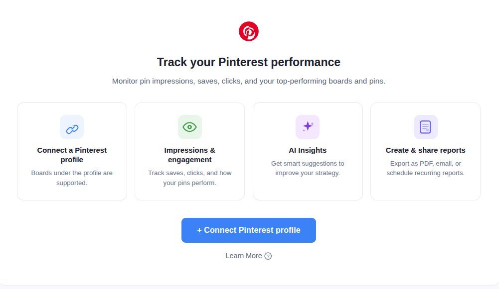
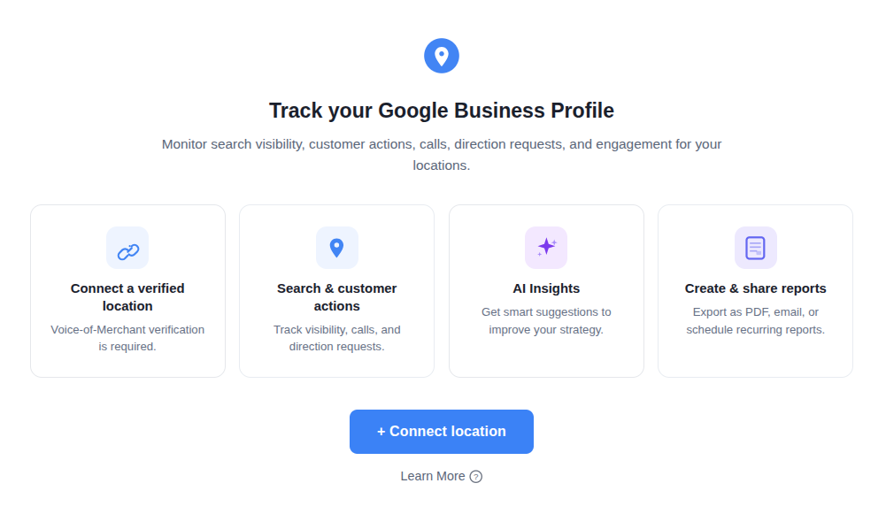

# Story — Analytics empty-state (connect account) onboarding screens

One frontend story. Create with the **New Feature Template**. Nothing is pushed to Shortcut.

This is a single shared-component change: build one reusable empty-state component and
use it across all analytics screens, driven by per-platform copy.

---

## [FE] Redesign the Analytics empty-state screens with connect-account onboarding

### Description

As a user who opens an Analytics screen before connecting the relevant account(s), I
want a clear, friendly screen that tells me what this dashboard does, which account
types are supported, and how to connect — so I know exactly what to do instead of seeing
a bare "No account connected" message.

Today each analytics screen shows a plain image + "No [platform] Connected" line + a
Connect button. This story replaces that with a consistent onboarding empty state:
a centered white card with the platform logo, a title and subtitle, a row of 4 short
info cards (what you can do), a primary **Connect** button, and a **Learn More** link.
The **Overview** screen uses a variant: a supported-platforms list plus a "Coming soon"
banner instead of the 4 cards.

**Screens in scope (10):** Overview, Meta Ads, Google Ads, Facebook, Instagram,
LinkedIn, TikTok, YouTube, Pinterest, Google Business Profile.
**Out of scope:** X (Twitter) — its existing empty state is unchanged; X appears only in
Overview's "Coming soon" row.

### Workflow

1. The user opens an Analytics screen (e.g. Publish → Analytics → Facebook) without a
   connected account for that platform.
2. Instead of the old "No account connected" block, the user sees the onboarding empty
   state — logo, title, subtitle, 4 info cards, a Connect button, and a Learn More link.
3. The user clicks the **Connect** button and the existing connect flow opens (the
   social-account connect modal; Meta Ads / Google Ads open their own account
   connection).
4. The user clicks **Learn More** and the platform's help article opens in the in-app
   help panel.
5. Once an eligible account is connected, the screen shows the analytics dashboard as
   normal (unchanged).

The **Overview** screen is the same flow, but instead of 4 cards it shows a list of
supported platforms and a "Coming soon" banner, then the same Connect / Learn More.

### Acceptance criteria

**Shared behavior**
- [ ] Each in-scope Analytics screen shows the new onboarding empty state when no eligible account is connected for that platform, replacing the old "No account connected" block.
- [ ] The card is centered on the light-grey page background: white card, rounded corners, subtle border.
- [ ] Platform screens (all except Overview) show the platform logo centered above the title; **Overview shows no logo** and starts with the title.
- [ ] Platform screens show a horizontal row of **4 cards** that wraps to fewer columns on smaller widths; each card is center-aligned with a colored icon in a rounded-square background, a heading, and one body line. **No step labels** ("STEP 1", etc.) anywhere. Cards have a subtle hover effect.
- [ ] Cards 3 and 4 are identical on every platform screen: **AI Insights** — "Get smart suggestions to improve your strategy."; **Create & share reports** — "Export as PDF, email, or schedule recurring reports."
- [ ] The **Connect** button is the primary theme button (styled via design-system tokens so it recolors on white-label — not a hardcoded blue) with white text; its label is per-screen (see copy).
- [ ] Clicking **Connect** opens the existing account-connect flow for that platform.
- [ ] A **Learn More** link with a small question-mark icon sits below the button; clicking it opens that platform's existing help article.
- [ ] No emojis are used in the UI; all icons are SVG.
- [ ] All copy renders via i18n in all 8 locales (`en fr de it es el zh pl`), falling back to English (never a raw key).
- [ ] Colors use theme tokens (no hardcoded hex/`blue-*`); the screens render correctly on white-label domains.
- [ ] Layout is responsive: the 4-card row wraps and the card stays centered/readable down to mobile widths.

**Per-screen content** — each screen shows exactly the title, subtitle, Card 1 (Connect), Card 2 (unique), and CTA label in the copy tables below:
- [ ] **Overview** — list layout: supported-platforms list (7 rows) + "Coming soon" banner (X, Threads, Bluesky) + CTA. No logo.
- [ ] **Meta Ads**, **Google Ads**, **Facebook**, **Instagram**, **LinkedIn**, **TikTok**, **YouTube**, **Pinterest**, **Google Business Profile** — 4-card layout with the per-screen copy below.
- [ ] **X (Twitter)** shows no onboarding screen — its existing empty state is unchanged.

### UI Copy

**Shared across all platform screens (not Overview):**

| Element | Heading | Body |
|---|---|---|
| Card 3 — AI Insights (purple sparkle icon) | AI Insights | Get smart suggestions to improve your strategy. |
| Card 4 — Reports (document icon) | Create & share reports | Export as PDF, email, or schedule recurring reports. |
| Learn More link | Learn More | (with a small `?` icon; opens the platform's help article) |

**Screen 1 — Overview** (list layout, no logo)
- **Title:** All your social analytics in one place
- **Subtitle:** Connect your social accounts to get a combined view of followers, posts, engagement, and impressions across every platform. Here's what's supported:
- **Supported-platforms list** (small circular logo · **name** — description, rows divided by a light border):
  | Platform | Note |
  |---|---|
  | Facebook | Pages only (not personal profiles or Groups) |
  | Instagram | Business & Creator accounts only |
  | LinkedIn | Company Pages |
  | Pinterest | Boards selected under a profile |
  | TikTok | All connected profiles |
  | YouTube | Channels (analytics permission required) |
  | Google Business Profile | Locations (Voice-of-Merchant verification needed) |
- **Coming soon banner** (light-blue background, subtle blue border, rounded):
  - Row 1: **More platforms** + green badge **Coming soon**
  - Row 2 (left): We're working on adding support for these platforms.
  - Row 2 (right): three small circular icons — X, Threads, Bluesky
- **CTA button:** + Connect accounts

**Screen 2 — Meta Ads** (logo: Meta Ads)
- **Title:** Your Meta Ads data, right here
- **Subtitle:** Connect your Meta Ads account to pull in performance data from your Facebook and Instagram campaigns.
- **Card 1 — Connect:** Connect your account — Sign in through Meta Business Suite and grant read access.
- **Card 2 — unique (target icon):** Review your campaigns — See spend, clicks, and conversions per campaign and ad set.
- **CTA button:** + Connect account

**Screen 3 — Google Ads** (logo: Google Ads)
- **Title:** Your Google Ads data, right here
- **Subtitle:** Connect your Google Ads account to see how your Search, Display, Shopping, and YouTube campaigns are doing.
- **Card 1 — Connect:** Link your Google Ads account — Sign in with Google and grant read access.
- **Card 2 — unique (multicolor pie-chart icon):** Dig into campaigns and keywords — See spend, impressions, clicks, and conversions side by side.
- **CTA button:** + Connect account

**Screen 4 — Facebook** (logo: Facebook)
- **Title:** Track your Facebook page performance
- **Subtitle:** See follower growth, post engagement, impressions, reach, demographics, and top content in one dashboard.
- **Card 1 — Connect:** Connect your Facebook Page — Link a Page and your metrics sync instantly.
- **Card 2 — unique (bar-chart icon):** Engagement & reach — Track impressions, reactions, shares, and top posts.
- **CTA button:** + Connect Facebook page

**Screen 5 — Instagram** (logo: Instagram)
- **Title:** Track your Instagram performance
- **Subtitle:** Monitor Reels, Stories, hashtags, audience activity, and your best content — all in one view.
- **Card 1 — Connect:** Connect a Business or Creator account — Personal accounts are not supported.
- **Card 2 — unique (hashtag icon):** Content & hashtag insights — See what posts, Reels, and hashtags perform best.
- **CTA button:** + Connect Instagram account

**Screen 6 — LinkedIn** (logo: LinkedIn)
- **Title:** Track your LinkedIn page performance
- **Subtitle:** Monitor follower growth, post engagement, publishing trends, and audience demographics.
- **Card 1 — Connect:** Connect a Company Page — Personal profiles are not currently supported.
- **Card 2 — unique (briefcase icon):** Engagement & demographics — Track growth, reach, and follower breakdowns.
- **CTA button:** + Connect LinkedIn page

**Screen 7 — TikTok** (logo: TikTok)
- **Title:** Track your TikTok performance
- **Subtitle:** Monitor video views, follower growth, engagement, and audience demographics from one dashboard.
- **Card 1 — Connect:** Connect any TikTok profile — All connected profiles are supported.
- **Card 2 — unique (video-camera icon):** Video performance — Track views, likes, shares, comments, and watch time.
- **CTA button:** + Connect TikTok profile

**Screen 8 — YouTube** (logo: YouTube)
- **Title:** Track your YouTube channel performance
- **Subtitle:** Monitor subscriber growth, video views, watch time, engagement, and audience demographics.
- **Card 1 — Connect:** Connect a YouTube Channel — Analytics permission must be granted during setup.
- **Card 2 — unique (play-triangle icon):** Video & watch time — Track views, watch hours, likes, and comments.
- **CTA button:** + Connect YouTube channel

**Screen 9 — Pinterest** (logo: Pinterest)
- **Title:** Track your Pinterest performance
- **Subtitle:** Monitor pin impressions, saves, clicks, and your top-performing boards and pins.
- **Card 1 — Connect:** Connect a Pinterest profile — Boards under the profile are supported.
- **Card 2 — unique (eye icon):** Impressions & engagement — Track saves, clicks, and how your pins perform.
- **CTA button:** + Connect Pinterest profile

**Screen 10 — Google Business Profile** (logo: GBP)
- **Title:** Track your Google Business Profile
- **Subtitle:** Monitor search visibility, customer actions, calls, direction requests, and engagement for your locations.
- **Card 1 — Connect:** Connect a verified location — Voice-of-Merchant verification is required.
- **Card 2 — unique (map-pin icon):** Search & customer actions — Track visibility, calls, and direction requests.
- **CTA button:** + Connect location

### Mock-ups

One per screen (attach these to the Shortcut story when creating it):

**Overview**

**Meta Ads**

**Google Ads**

**Facebook**

**Instagram**

**LinkedIn**

**TikTok**

**YouTube**

**Pinterest**

**Google Business Profile**

### Impact on existing data

None. No schema, API, or data changes — this replaces empty-state UI only. The connect
flows and analytics data pipelines are unchanged.

### Impact on other products

- **Mobile apps (iOS/Android):** N/A — analytics dashboards are a web surface.
- **Chrome extension:** N/A.
- **White-label:** the CTA, links, and accents must use theme tokens so they follow the
  white-label primary color.

### Dependencies

- **Card-2 decorative icons / brand icons:** the unique per-platform Card-2 icons (target,
  pie chart, bar chart, hashtag, briefcase, video camera, play triangle, eye, map pin)
  are multi-color SVGs that may not all exist in the design library. If they aren't
  available, a small set of SVG assets needs to be added (a `[Design]` asset drop) before
  or alongside this work. Platform logos already exist.

### Global quality & compliance (wherever applicable)

- [ ] Mobile responsiveness (frontend only, N/A for backend-only stories)
- [ ] Multilingual support (frontend + backend, translations available or fallback handled)
- [ ] UI theming support (default + white-label, design library components are being used)
- [ ] White-label domains impact review
- [ ] Cross-product impact assessment (web, mobile apps, Chrome extension)

### Implementation references
*Pointers from research — not a contract. Engineering may choose a different approach.*

**Primary entry points:**
- Empty state is currently hand-rolled in each `views/<platform>/MainComponent.vue` (the
  `!hasAccounts` branch) — e.g.
  `contentstudio-frontend/src/modules/analytics/views/facebook/MainComponent.vue` renders
  an image + `analytics.facebook.main.status.no_account_connected` + a button that calls
  `$cstuModal.show('social-connect-modal')`. Same shape in
  `views/{overview,meta_ads,google_ads,instagram,linkedin,tiktok,youtube,pinterest,gmb}/MainComponent.vue`.
- Suggested: build one shared
  `contentstudio-frontend/src/modules/analytics/views/common/AnalyticsEmptyState.vue`
  with a `type` prop + a `layout` of `cards | list`, and swap each MainComponent's
  empty-state branch to use it. Keeps all 10 screens consistent from one place.

**Reuse:**
- **Learn More** article ids already exist in
  `contentstudio-frontend/src/modules/analytics/components/common/PlatformTooltip.vue`
  (`learnMoreBeacons` map: overview, facebook, instagram, linkedin, tiktok, youtube,
  pinterest, gmb, meta_ads, google_ads) opened via `window.Beacon('article', id, { type: 'modal' })`.
- **Connect** CTA should reuse the existing connect flow already wired in these
  components (`social-connect-modal`); Meta Ads / Google Ads use their own connect entry.
- `@contentstudio/ui`: `Button` (primary variant), `Badge` (green "Coming soon"), `Icon`.
  Platform logos via the existing social-image helper (`getSocialImageRounded`).

**Suggested i18n keys** (add to `src/locales/<locale>/analytics.json`, all 8 locales),
e.g. under `analytics.empty_state.<platform>`: `title`, `subtitle`, `connect_heading`,
`connect_body`, `unique_heading`, `unique_body`, `cta`; shared `analytics.empty_state.shared.{ai_insights_*, reports_*, learn_more}`; Overview `analytics.empty_state.overview.{title, subtitle, platforms.*, coming_soon_*}`.

**Existing behavior to preserve:** which accounts count as "connected" per platform is
decided by `getPlatformAccounts` in
`components/common/composables/useAnalyticsUtils.ts` — this story only changes what the
empty state looks like, not the connected/empty decision.

**No analytics event:** the Connect button reuses the existing connect flow, which
already fires its own tracking. No new Usermaven event is added by this empty-state
redesign (connection events fire from the connect flow itself).

---

### Shortcut fields

- **Template:** New Feature Template
- **Story type:** feature
- **Project:** Web App
- **Group:** Frontend
- **Epic:** Q2 - 2026: Miscellaneous
- **Priority:** Medium
- **Product Area:** Analytics
- **Skill Set:** Frontend
- **Estimate:** _(empty — devs estimate during sprint planning)_
- **Labels:** _(none)_
- **Iteration:** _(PO assigns the current/target sprint at creation)_
