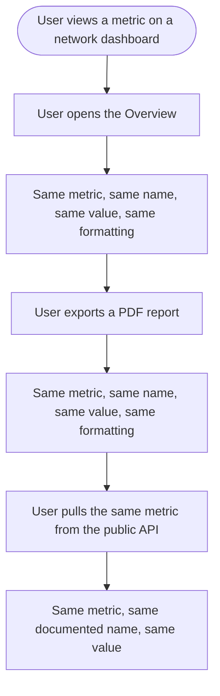

# Stories: Analytics metric consistency

> **Scope note.** The original request had four parts. Two are already authored and are not repeated here:
>
> - *Finalize Analytics report widget selection* is **[Full Stack] Let users pick which sections to include in analytics reports**.
> - *Standardize the number of Top Posts and Account Insights* is **[Full Stack] Cap overview top posts and account insights at five and hide metrics a platform does not report**, with **[Full Stack] Add the Top Posts sort dropdown + Least Posts to Facebook, Instagram, LinkedIn & TikTok analytics** covering the related sort and least-posts gap.
>
> What follows covers the two parts that are not yet authored: the metric audit, and reconciling the divergences it finds across widgets, reports and exports.

Two stories. The audit produces a decision list; the fix story executes it. They are separate on purpose, because fixing before agreeing what each metric means just produces a different set of inconsistencies.

| # | Title |
|---|---|
| 1 | `[Full Stack]` Audit Analytics metrics and publish one canonical metric definition set |
| 2 | `[Full Stack]` Reconcile metric naming, derivation and formatting across Analytics surfaces |

---
---

# 1. [Full Stack] Audit Analytics metrics and publish one canonical metric definition set

### Description

The same metric can appear on a per-network dashboard, the Overview, a competitor view, a Campaign and Label report, an ads view, an exported PDF, the public API and the Looker Studio connector. Each of those has its own rendering path, its own formatting helpers and its own label keys, and nothing enforces that they agree. Users notice: a number on screen and the same number in the PDF they send a client do not always match, and the same word can mean two different calculations on two screens.

This story is the audit. It produces one canonical definition per metric and a decided list of every divergence, so the fix work that follows is execution rather than investigation.

### Workflow

*(Investigation and documentation story. No user-facing change ships from it.)*

1. Every Analytics surface is inventoried: per-network dashboards, Overview, competitor, Campaign and Label, ads, exported and emailed PDF reports, the public analytics API, and the Looker Studio connector.
2. Every metric each surface displays is catalogued with the name it uses, how it is derived, and how it is formatted.
3. Metrics that are the same underlying thing are grouped, regardless of what each surface calls them.
4. For each group, one canonical name, definition, unit, formatting rule and abbreviation rule is agreed.
5. Every divergence from the canonical definition is recorded and classified.
6. Each divergence gets a decision: align it, or keep it and document why.
7. The canonical set is published somewhere the team and the API docs can both cite.

### Acceptance criteria

- [ ] Every Analytics surface is inventoried, and the inventory is explicit about which surfaces were checked so nothing is silently skipped.
- [ ] A canonical definition set is published covering every metric Analytics displays, with, per metric: display name, plain-language definition, unit, formatting rule, abbreviation rule, and the platforms that report it.
- [ ] Each metric's definition states how it is derived, in terms a non-engineer can check against a screen.
- [ ] Metrics that mean different things on different platforms are documented as per-platform variants rather than forced into one definition, and the difference is stated in user-facing terms.
- [ ] Every divergence found is recorded with the surfaces it affects, and classified as a naming difference, a derivation difference, a formatting difference, or a legitimate per-platform difference.
- [ ] Every divergence carries a decision: align to canonical, or keep and document, with a reason either way.
- [ ] Divergences are prioritised, so the fix story has an order rather than a flat list.
- [ ] Divergences that would be a breaking change for an external consumer are flagged explicitly, covering the public analytics API and the Looker Studio connector.
- [ ] The Top Posts and Account Insights count question is answered: whether YouTube's ten and the label-and-campaign ten should become five like the overview cards, or stay as they are because they are a different surface.
- [ ] Where a surface shows a metric a platform does not actually report, it is recorded, and the treatment agreed in the overview-cards work is applied as the standard rather than re-decided.
- [ ] The canonical set is published in a location both the engineering team and the public API documentation can cite, so there is one dictionary rather than two.
- [ ] The metric label keys in the locale files are mapped to canonical metrics, so it is visible where two screens use different keys for one metric.
- [ ] The audit covers exported PDF reports as a first-class surface, not as an afterthought, since that is where the mismatch is most visible to a user's client.

### Mock-ups

N/A. Documentation deliverable.

### Impact on existing data

None. Investigation only.

### Impact on other products

- Web app: informs the fix story.
- Public analytics API and the Looker Studio connector: the audit determines whether any rename or recalculation is a breaking change for external consumers. It does not make the change.
- The public Ads Analytics API documentation story needs a metric glossary and should cite this set rather than writing a second one.

### Dependencies

- Should be coordinated with the analytics API consistency stories, which standardize payload shape per platform. Both should converge on one dictionary, not two.

### Global quality and compliance checklist

- [ ] Mobile responsiveness tested (frontend only, N/A for backend-only stories) — N/A, documentation
- [ ] Multilingual support verified (frontend + backend, translations available or fallback handled) — the audit records which locale keys map to which metric, so the fix story can keep translations aligned
- [ ] UI theming supported (default + white-label, design library components are being used) — N/A
- [ ] White-label domains impact reviewed
- [ ] Cross-product impact assessed (web, mobile apps, Chrome extension)

### Implementation references

*Pointers from research — not a contract. Engineering may choose a different approach.*

- Formatting and derivation are spread across `contentstudio-frontend/src/modules/analytics/components/common/helper.ts`, `components/common/composables/useAnalytics.ts`, `composables/analyticsDataHelpers.ts`, `composables/usePDFReports.ts`, the per-network composables under `views/*/composables/`, and per-view helpers such as `views/meta_ads/composables/useMetaAdsTableFormatting.ts`. Those are the files to inventory.
- Metrics are actually computed in `contentstudio-social-analytics-go/src/api/analytics/`, one package per platform. Derivation questions are answered there, not in the frontend.
- Labels live in `src/locales/*/analytics.json`, which is where two screens using different names for one metric will show up.
- Concrete count divergence to resolve: `views/facebook/components/OverviewSection.vue:69` and `views/instagram/components/OverviewSection.vue:99` both set `TOP_POSTS_LIMIT = 5`, while `views/youtube/composables/useYoutubeAnalytics.ts:170` sets `DEFAULT_TOP_AND_LEAST_POSTS_LIMIT = 10` and `views/performance-report/label-and-campaign/composables/useLabelAndCampaignPosts.ts:130` exports `DEFAULT_POSTS_LIMIT = 10`.
- `components/common/helper.ts` contains several per-platform payload builders with their own `accounts_limit` values, mostly 10 and one 0. Worth checking whether that is intentional.
- A naming smell worth starting from: `views/overview/composables/useOverviewAnalytics.ts:995` uses the literal `'Platform-Specific Account Insights'` as a map key while the section is Account Insights elsewhere.
- The module's conventions doc is `contentstudio-frontend/src/modules/analytics/CLAUDE.md`, which is the natural place to record where the canonical set lives.

---
---

# 2. [Full Stack] Reconcile metric naming, derivation and formatting across Analytics surfaces

### Description

Users export an analytics report to send a client and the numbers do not always match what they just looked at on screen, or the same metric carries a different name in the PDF than on the dashboard. This story applies the decisions from the metric audit so a metric means one thing, is named one thing, and is formatted one way everywhere in Analytics.

### Workflow

1. User looks at a metric on a network dashboard.
2. They open the Overview. The same metric carries the same name and the same value.
3. They open a Campaign and Label report. Same again.
4. They export a PDF. The number and its label match what they saw on screen.
5. They pull the same metric from the public API. It matches, under the documented name.
6. Where a metric genuinely differs by platform, the difference is visible and explained rather than silently different.

### Acceptance criteria

- [ ] Every divergence the audit marked "align" is resolved.
- [ ] Every divergence the audit marked "keep and document" is documented in the product where a user can see it, not only in an internal doc.
- [ ] A given metric carries the same display name on every Analytics surface: per-network dashboards, Overview, competitor, Campaign and Label, ads, and exported PDF reports.
- [ ] A given metric is derived the same way on every surface, so the value a user sees on screen equals the value in the exported report for the same account and date range.
- [ ] A given metric is formatted the same way on every surface, including abbreviation of large numbers, decimal places, percentage formatting and currency formatting.
- [ ] Duration and rate metrics are formatted consistently, since those are the most likely to have drifted.
- [ ] Where a metric is not reported by a platform, it is omitted rather than shown as 0, consistent with the treatment agreed in the overview-cards work.
- [ ] The Top Posts and Account Insights counts follow the decision the audit recorded, consistently across the surfaces that decision covers.
- [ ] Metric label keys are consolidated so two surfaces cannot show different names for one metric, and all locale directories are updated in the same change.
- [ ] Changes that are breaking for external consumers are handled as the audit specified, and the public analytics API documentation and Looker Studio connector are updated in step rather than left behind.
- [ ] No metric's value changes without that change being an intentional audit decision. Any value that moves is listed in the change notes so support can answer "why did my number change".
- [ ] Exported and emailed PDF reports are verified against the on-screen dashboards for at least one account per platform, and match.
- [ ] Every user-visible string changed is translated and present in every locale directory.

### UI copy

Metric display names come from the audit's canonical set. This story changes labels rather than inventing them.

One new pattern is needed where the audit decided a difference should be visible rather than removed:

**Per-platform metric difference note** (info affordance next to the metric)
- `This metric is calculated differently on {platform}. {explanation}`

Where `{explanation}` is the plain-language sentence the audit recorded for that metric and platform.

All strings go through translation and land in every locale directory in the same change. Note the deliberate absence of em dashes.

### Mock-ups

N/A. Renames and formatting changes within existing layouts. If the audit's decisions require a new info affordance next to a metric, the treatment comes from **[Design] Define the Analytics chart standard**, which specifies chart card chrome including the info affordance.

### Impact on existing data

None to stored data. Some displayed values will change where the audit found a derivation that was wrong on one surface. Those changes are user-visible and must be listed in change notes.

### Impact on other products

- Web app: the bulk of the change.
- Exported and emailed PDF reports: verified against the dashboards as part of this story.
- Public analytics API and the Looker Studio connector: updated in step where the audit's decisions reach them. A rename that ships on the dashboard and not in the API recreates the problem in a new place.
- Mobile apps and Chrome extension: unaffected, Analytics is web only.

### Dependencies

- Depends on **[Full Stack] Audit Analytics metrics and publish one canonical metric definition set**. This story executes that story's decisions and should not make new ones.
- Related to **[Full Stack] Cap overview top posts and account insights at five and hide metrics a platform does not report**, which establishes the omit-rather-than-zero treatment this story generalises. If that story has not shipped, sequence it first.
- Related to the analytics API consistency stories. If those are in flight, the payload standardization and this display standardization should reference the same dictionary.
- Best done after **[FE] Build the shared chart option layer and adopt it in the per-network charts**, since that story consolidates value formatting into one place, which is where several of these fixes will land.

### Global quality and compliance checklist

- [ ] Mobile responsiveness tested (frontend only, N/A for backend-only stories)
- [ ] Multilingual support verified (frontend + backend, translations available or fallback handled)
- [ ] UI theming supported (default + white-label, design library components are being used)
- [ ] White-label domains impact reviewed
- [ ] Cross-product impact assessed (web, mobile apps, Chrome extension)

### Implementation references

*Pointers from research — not a contract. Engineering may choose a different approach.*

- Formatting fixes concentrate in `contentstudio-frontend/src/modules/analytics/components/common/helper.ts`, `composables/analyticsDataHelpers.ts` and `composables/usePDFReports.ts`. The PDF path is the one most likely to have its own copy of a formatter.
- Derivation fixes are most likely in `contentstudio-social-analytics-go/src/api/analytics/`, one package per platform, rather than in the frontend. A frontend-only fix to a derivation difference will drift again.
- Label consolidation touches `src/locales/*/analytics.json` across all locale directories. Deleting a metric label key needs a repo-wide reference search first, since keys are string-referenced.
- The four Top Posts limit constants to reconcile are named in the audit story's references.
- If the shared chart option layer from the chart standardization epic has landed, its value-formatting hook is the right home for the abbreviation and percentage rules rather than a per-view helper.
