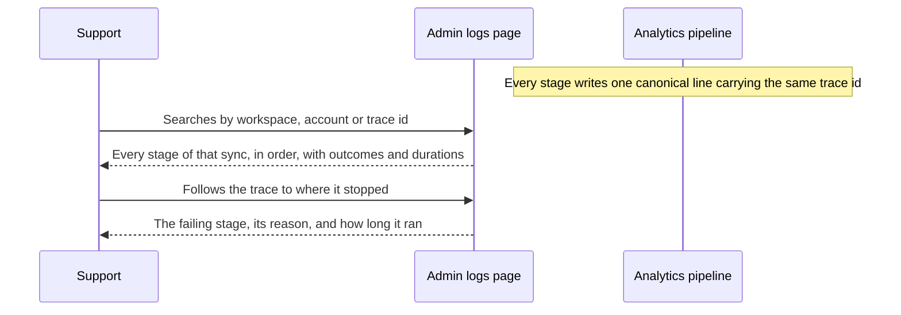
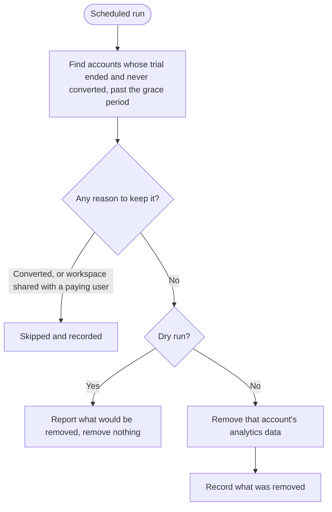

# Stories: Analytics observability, retention, and trial data removal

Three concerns over the same data, asked for together. They share a theme (nobody currently knows what the analytics pipeline is doing, or how long its data lives) but they are separable work with different risk profiles, so they are three stories rather than one.

Each has an in-house precedent to follow. One of those precedents has two defects, and the trial story fixes rather than inherits them.

No design story: the observability work deliberately reuses the existing admin logs page rather than adding a screen.

| # | Title |
|---|---|
| 1 | `[BE]` Make the analytics pipeline observable end to end |
| 2 | `[BE]` Define and enforce a retention policy for analytics data |
| 3 | `[BE]` Remove analytics data for accounts that never converted from trial |

---
---

# 1. [BE] Make the analytics pipeline observable end to end

### Description

When a customer says their analytics look stale or wrong, we cannot answer why. The analytics service reports errors to Sentry and exposes a health check, and that is the whole of it: no metrics, no traces, no way to follow one account's sync through the pipeline. Support escalates, an engineer reads logs by hand, and the answer arrives days later or not at all.

This story makes a single account's analytics sync followable from schedule to stored row, so the question *"why is this workspace's data stale?"* has an answer somebody can look up.

### Workflow

*(Backend story. The "user" is whoever is diagnosing: support, or an engineer on call.)*

1. A customer reports stale or missing analytics for an account.
2. Whoever is investigating searches the existing admin logs page by workspace or account.
3. They see that account's sync runs, each stage in order, with what happened and how long it took.
4. Where a run stopped, they see which stage stopped it and why.
5. Where a run never started, they can see that too, and distinguish it from one that started and failed.
6. They answer the customer without escalating to an engineer reading raw logs.

### Acceptance criteria

**Being able to follow one sync**

- [ ] Every stage of the analytics pipeline emits one canonical record per unit of work, covering what ran, for which workspace and account, on which platform, its outcome, and how long it took.
- [ ] A single trace identifier is carried through every stage of one sync, including across Kafka boundaries, so the whole run can be retrieved together.
- [ ] The records for one sync can be retrieved in order, so the stage a run stopped at is visible rather than inferred.
- [ ] A failed unit of work records why it failed, in terms specific enough to act on, not only that it failed.
- [ ] A sync that never started is distinguishable from one that started and failed.
- [ ] Records carry workspace and account identifiers, so an investigation can begin from a customer's account rather than from a log timestamp.
- [ ] Every platform's pipeline is covered, not only the ones easiest to instrument. The story is not done with two platforms instrumented.

**Where it lands and how it is read**

- [ ] Records are written into the existing ClickHouse log store used by the rest of the platform, following the mapping the sibling service established.
- [ ] Records are readable on the existing admin logs page. No new admin screen, no new query API, no new storage table.
- [ ] Analytics records are identifiable among other services' records, and a whole flow can be followed by searching the trace identifier.
- [ ] The analytics service remains write-only for logs. It does not take on a read path or a query layer.

**Health of the pipeline itself**

- [ ] Queue depth and consumer lag between pipeline stages are observable, so a backlog is visible before customers notice stale data.
- [ ] Per-stage throughput and failure rates are observable over time, so a degrading stage can be spotted rather than discovered.
- [ ] A stage that has stopped consuming entirely is detectable, and distinguishable from a stage with nothing to do.

**Not making things worse**

- [ ] Instrumentation does not measurably slow the pipeline. The cost is measured and stated, not assumed.
- [ ] Log volume is bounded, with a stated expected volume per sync, so this does not become the platform's largest log producer by accident.
- [ ] No credential, token or personal data is written into a log record. Existing redaction behaviour is preserved and extended to the new records.
- [ ] Existing Sentry error reporting keeps working and is not duplicated by the new records.
- [ ] If the log write path is unavailable, the pipeline keeps processing. Observability failing never stops analytics working.

### Mock-ups

N/A. Reuses the existing admin logs page.

### Impact on existing data

No change to analytics data. New records are added to the existing platform log store, which increases its volume; the expected volume is a stated output of this story.

### Impact on other products

- Support and engineering gain a diagnostic path they do not have today.
- The shared log store and admin logs page take on another writer, so the volume added has to be sized against what that table already carries.
- No customer-facing change.

### Dependencies

None, though it is worth reading the sibling service's implementation before starting rather than after.

### Global quality and compliance checklist

- [ ] Mobile responsiveness tested (frontend only, N/A for backend-only stories) — N/A, backend only
- [ ] Multilingual support verified (frontend + backend, translations available or fallback handled) — N/A, internal diagnostics
- [ ] UI theming supported (default + white-label, design library components are being used) — N/A, no new UI
- [ ] White-label domains impact reviewed
- [ ] Cross-product impact assessed (web, mobile apps, Chrome extension)

### Implementation references

*Pointers from research — not a contract. Engineering may choose a different approach.*

- **Read `social-inbox-manager/PRD-structured-logging-and-observability.md` first, especially the 2026-06-05 amendment.** That team designed a dedicated `observability_logs` table with its own query layer and admin UI, then reversed the decision and mapped onto the existing `logs.app_logs` table and the existing admin `/logs` page instead. Repeating the first design would be repeating a mistake they already paid for.
- The surviving architecture: a canonical line per unit of work, a `trace_id` threaded through including across Kafka, published to Kafka, then into ClickHouse via a Kafka engine table plus a materialized view. DDL precedent: `social-inbox-manager/app/observability/clickhouse/app_logs_ingest.sql`. Identification by `log_name = <service>[:channel]`, flow retrieval by `trace_message = trace_id`.
- The implementation to mirror in Go: `social-inbox-manager/app/observability/` — `canonical.py` (the line), `context.py` and `trace.py` (trace propagation), `kafka_consume.py` (carrying trace across Kafka, which is the part most easily got wrong), `logging.py`, `httpx_hooks.py` (outbound call timing).
- The original reference architecture both trace back to is `contentstudio-backend`'s API request-log pipeline (Middleware → Kafka → ClickHouse), so there are two existing implementations to compare.
- Current state in the analytics service: Sentry via `src/logger/sentry_hook.go` and `src/logger/sentry_writer.go`; `/health` registered in `src/cmd/api-server/main.go` and allowlisted in `src/api/middleware/auth.go`. There is no `/metrics` endpoint, and the OpenTelemetry entries in `src/go.mod` are all `// indirect`, pulled in by the GCP libraries rather than used.
- Redaction already exists and is tested (`src/logger/redaction_test.go`); the new records need to go through it rather than around it.
- The stages to instrument are per-platform under `src/services/`: `facebook`, `instagram`, `linkedin`, `twitter`, `tiktok`, `youtube`, `pinterest`, `gmb`, `meta-ads`, `google-ads`, plus `listening`, `thumbnails`, `reports` and `unified`.

---
---

# 2. [BE] Define and enforce a retention policy for analytics data

### Description

Analytics data has never been expired. Every insight row, post row and media-asset row we have ever ingested is still stored, for every account that has ever been connected, including accounts and workspaces that no longer exist. That grows cost and query times indefinitely, and it means we cannot answer a customer or an auditor asking how long we keep their data.

This story decides the retention policy, reconciles it against what the product actually lets users ask for, and enforces it.

### Workflow

*(Backend story. The visible effect is that data older than the policy stops being stored.)*

1. A retention window is agreed per class of analytics data, and written down.
2. The window is checked against the longest date range the product lets a user select, and against any commitments made to customers.
3. Data older than its window stops being retained, on a schedule.
4. Users selecting a range within the window see their data as before.
5. Users selecting a range beyond the window are told the data is outside the retained period, rather than shown an empty chart.

### Acceptance criteria

**Deciding it**

- [ ] A retention window is defined and documented for each class of analytics data, rather than one number applied to everything. Raw per-post rows, aggregated insights, and data behind generated reports are considered separately.
- [ ] The window is reconciled against the longest date range the analytics UI allows a user to select, including custom ranges and period-over-period comparisons in scheduled reports. A window shorter than a selectable range is not shipped without the UI change in the criteria below.
- [ ] Existing customer commitments are checked before the window is fixed, including enterprise and agency contracts that may assume multi-year history.
- [ ] The current storage footprint is measured per platform and per data class before anything is deleted, so the effect of the policy is known rather than hoped.

**Enforcing it**

- [ ] Data past its retention window is removed on a schedule, without manual intervention.
- [ ] Enforcement runs at a cost proportional to what it removes, using the monthly partitioning the tables already have rather than row-level deletion where that is avoidable.
- [ ] Enforcement is idempotent and safe to re-run.
- [ ] A dry run reports what would be removed, per table and per partition, without removing it.
- [ ] Each run records what it removed, so the history of enforcement is auditable.
- [ ] Enforcement never removes data inside the retention window, and this is verified rather than assumed.
- [ ] A failure part-way through leaves the store consistent and the run resumable.

**Not breaking the product**

- [ ] A user selecting a date range fully inside the window sees exactly what they see today.
- [ ] A user selecting a range that extends beyond the window is told the earlier period is outside the retained window, and is not shown a chart that reads as zero.
- [ ] Scheduled reports whose comparison period falls outside the window behave predictably and say so, rather than silently reporting a drop to zero.
- [ ] The public analytics API behaves consistently with the UI for out-of-window ranges, and the retained window is documented for API consumers.
- [ ] Data the product derives and stores separately, such as generated report files, is covered by a stated policy too rather than being left implicitly permanent.

### Mock-ups

N/A for the backend work. If the design decides the out-of-window message needs a specific treatment beyond a standard notice, that is a small addition to the analytics chart standard rather than a story of its own.

### Impact on existing data

This is the story that deletes data. The first enforcement run will remove everything already past the window, which on a store that has never expired anything could be a large proportion of it. That run must be dry-run, measured and approved before it executes, and it should be treated as a one-off migration rather than a routine run.

### Impact on other products

- Analytics UI: out-of-window ranges need handling.
- Public analytics API and the Looker Studio connector: consumers can currently request any range; the retained window becomes part of that contract and needs documenting.
- Reports: a report comparing to a period outside the window changes behaviour.
- Storage cost and query performance should both improve, and the expected improvement is a stated output.

### Dependencies

- The retention windows must be agreed with product and whoever owns customer commitments before implementation starts. This is the blocking decision.
- Benefits from **[BE] Make the analytics pipeline observable end to end** being in place first, so enforcement runs are visible in the same place as everything else.

### Global quality and compliance checklist

- [ ] Mobile responsiveness tested (frontend only, N/A for backend-only stories) — N/A, backend only
- [ ] Multilingual support verified (frontend + backend, translations available or fallback handled) — the out-of-window message is user-facing and needs translating in all locale directories
- [ ] UI theming supported (default + white-label, design library components are being used) — N/A for the backend work
- [ ] White-label domains impact reviewed
- [ ] Cross-product impact assessed (web, mobile apps, Chrome extension)

### Implementation references

*Pointers from research — not a contract. Engineering may choose a different approach.*

- **There is no `TTL` clause anywhere** in `contentstudio-social-analytics-go/src/deployments/clickhouse/`. Nothing expires today.
- The partitioning is the lever. Tables are `ReplacingMergeTree(updated_at)` partitioned monthly, for example in `schema/facebook_schema.sql`: `facebook_insights` by `toYYYYMM(created_date)`, `facebook_posts` by `toYYYYMM(created_time)`, `facebook_media_assets` by `toYYYYMM(created_at)`. Dropping a whole partition is near-free; a TTL expression or a row-level delete on a large table is a mutation. The per-platform schema files repeat this shape.
- Note the partition key differs per table (`created_date`, `created_time`, `created_at`), so "older than N months" is not one expression across the store. Worth enumerating rather than assuming.
- `src/deployments/clickhouse/SCHEMA_CONVENTIONS.md` is the conventions doc and should record whatever policy is chosen, so the next table added inherits it.
- `schema/materialized_views_schema.sql` matters: materialized views derived from a table need their own retention thinking, or dropping a source partition leaves derived data inconsistent.
- Listening data (`schema/listening_schema.sql`) has its own commercial model with a monthly mention allowance, so its retention question is not the same as organic analytics and should be decided separately rather than swept in.

---
---

# 3. [BE] Remove analytics data for accounts that never converted from trial

### Description

We keep analytics data indefinitely for every account that has ever connected, including trials that ended and never became customers. That is storage and query cost for data nobody will ever look at, and it is data we have no reason to still hold.

An equivalent job already exists for inbox data. This story does the same for analytics, and fixes the two things wrong with that job rather than copying them: it is not scheduled, so in practice it does not run, and it infers the trial end date from a field that moves whenever anything about the user changes.

### Workflow

*(Backend story.)*

1. The job runs on a schedule, without anyone remembering to trigger it.
2. It identifies accounts whose trial ended, never converted, and are past the grace period.
3. It skips anything with a reason to be kept, and records why it skipped.
4. It removes those accounts' analytics data.
5. It records what it removed, so the run is auditable afterwards.

### Acceptance criteria

**Identifying the right accounts, reliably**

- [ ] Trial end is determined from a dedicated timestamp recorded when the trial actually ended, not inferred from a field that changes on unrelated writes.
- [ ] Where that timestamp does not exist for historical accounts, the backfill or fallback is explicit and documented, and errs toward keeping data rather than deleting it.
- [ ] An account that converted to a paid plan at any point is never selected, including one that converted, churned and is now inactive.
- [ ] A trial still within the grace period is never selected.
- [ ] The grace period is configurable and its default is documented.
- [ ] A workspace shared with, or owned by, a paying user is never selected on the basis of a different member's trial.
- [ ] The selection query is verifiable: it can be run to produce the list of accounts it would act on, without acting on them.

**Removing the data**

- [ ] The analytics data for a selected account is removed across every platform table that holds it.
- [ ] Removal accounts for ClickHouse's cost model rather than assuming row-level deletes are cheap, since the target rows sit inside monthly partitions shared with every other workspace.
- [ ] Removal is scoped to the selected accounts. No other workspace's data is affected, and this is verified after the run.
- [ ] A dry run reports exactly what would be removed, per account and per table, and removes nothing.
- [ ] The job is idempotent: re-running it does not fail and does not double-count.
- [ ] A failure part-way through leaves the store consistent, records what was already removed, and is resumable.
- [ ] Each run records the accounts acted on, the data removed per table, and anything skipped with its reason.

**Actually running**

- [ ] The job is scheduled and runs without manual intervention.
- [ ] It is visible in the same place as the rest of the analytics pipeline's activity, so a failed run is noticed rather than silent.
- [ ] The first run is treated as a one-off backfill: dry-run, measured and approved before it executes, since it will clear a backlog accumulated since launch.

**Not repeating the inbox job's problems**

- [ ] The dedicated trial-end timestamp introduced here is usable by the existing inbox cleanup job, so the same defect is not left in place next door.
- [ ] Whether the existing inbox cleanup job should be scheduled at the same time is raised as a decision, not silently left unscheduled.

### Mock-ups

N/A. Scheduled backend job.

### Impact on existing data

This story deletes data. The first run clears everything accumulated since launch for accounts that never converted, which is potentially a large volume. Dry-run, measure and approve before executing. Nothing belonging to a current or former paying customer is in scope.

### Impact on other products

- Storage cost and query performance should improve; the expected saving is a stated output of the dry run.
- If a former trial user returns and signs up again, their old analytics will not be there. Worth confirming that is acceptable, since it is a support-visible consequence.
- The trial-end timestamp is a change to user records that other features may want, so it is worth naming rather than treating as internal to this job.

### Dependencies

- The dedicated trial-end timestamp is a prerequisite, and it is a backend data change outside the analytics service.
- Benefits from **[BE] Make the analytics pipeline observable end to end** so runs and failures are visible.
- Related to **[BE] Define and enforce a retention policy for analytics data**: both delete analytics data on a rule and should share their dry-run, verification and audit mechanics rather than implementing them twice.

### Global quality and compliance checklist

- [ ] Mobile responsiveness tested (frontend only, N/A for backend-only stories) — N/A, backend only
- [ ] Multilingual support verified (frontend + backend, translations available or fallback handled) — N/A, no user-facing text
- [ ] UI theming supported (default + white-label, design library components are being used) — N/A, no UI
- [ ] White-label domains impact reviewed — white-label resellers' trial users are in scope and should be confirmed as intended
- [ ] Cross-product impact assessed (web, mobile apps, Chrome extension)

### Implementation references

*Pointers from research — not a contract. Engineering may choose a different approach.*

- The pattern to follow is `contentstudio-backend/app/Console/Commands/CleanupTrialInboxData.php`: signature `trial:cleanup-inbox-data` with a `--dry-run` option, a stated grace period (14-day trial plus 30 days), workspace resolution, then one bulk delete per collection with counts logged. The bones are good.
- **Do not copy its date logic.** It selects `User::where('state', 'trial_finished')->where('updated_at', '<=', $cutoff)`, and its own comment admits the assumption: *"We assume the change-time is `updated_at`. If you track it with a dedicated `trial_finished_at`, swap that in."* Because `updated_at` moves on any write to the user document, an account whose trial ended long ago but whose record was touched recently is excluded indefinitely. It fails safe but silently, and skips exactly the records most likely to be touched.
- **Do not copy its scheduling, because it has none.** Grepping the backend for `CleanupTrialInboxData` or `trial:cleanup-inbox-data` outside the command file returns nothing; it is in neither `app/Console/Kernel.php` nor `routes/console.php`.
- `app/Console/Commands/Authentication/TrialMonitorCommand.php` already deals with trial state and is the natural place to look for where a `trial_finished_at` should be written.
- `app/Console/Commands/Storage/DeleteWorkspaceMediaCommand.php` is an existing workspace-scoped deletion command and worth reading for its safety patterns before writing another one.
- The data to remove is in ClickHouse, per platform, under `contentstudio-social-analytics-go/src/deployments/clickhouse/schema/`. Unlike the inbox job's MongoDB `deleteMany`, deleting one workspace's rows from monthly partitions shared across all workspaces is a mutation, so the approach needs deciding rather than assuming. Materialized views in `schema/materialized_views_schema.sql` derived from those tables need the same consideration.
