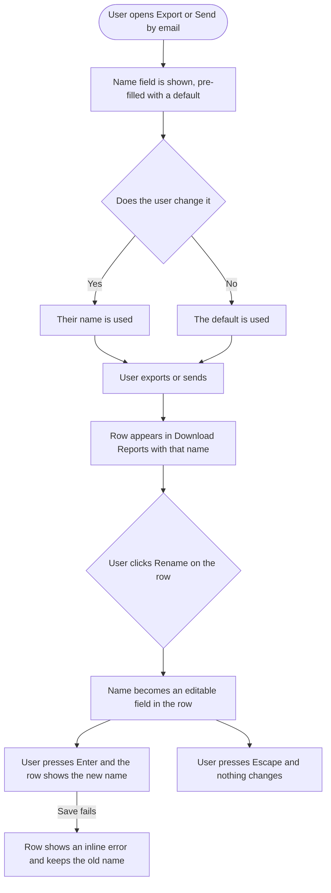

# Stories: Report names for exported and emailed reports, and renaming from the lists

**Date:** 2026-09-11
**Stories:** 3
**Research:** `01-research.md`

---

## Overview

Analytics has three ways to produce a report from the same export control: **Export PDF**, **Send by email**, and **Schedule**. Only Schedule lets the user name the report, and only the Scheduled Reports list shows a name. So a user who exports four PDFs in a week ends up with four rows in Download Reports distinguished by nothing but a timestamp and a platform label.

This closes that gap. The name field appears in all three flows, the Download Reports list gets a name column, and both lists let a user rename from the row. Rename matters because these things get reused: a downloaded report can be downloaded again, and a scheduled report goes out again, so the name chosen once may need changing later.

### What makes this smaller than it looks

The Schedule modal **already serves Export and Email** for every platform except Campaign and Label. It is one tri-modal component, and it currently hides the name field in those two modes behind a single condition. For most platforms, adding the field is removing that condition. The field, its state, its payload key and its validation already exist.

The `name` field also **already exists on both underlying collections**. The browser's export and email flows simply never send it.

### Scope

- The name field in the Export flow and the Send-by-email flow, in both the tri-modal and the two standalone modals that serve Campaign and Label and competitor reports.
- A name column in the Download Reports list.
- Rename from the row on the Download Reports list and on the Scheduled Reports list.
- The name carried onto the report so it reaches the PDF cover and future emails.

### Out of scope

- **Changing the generated PDF file name for reports that already exist.** See the decision below.
- **Backfilling names onto historical reports.** Rows without a name fall back to the label the list already shows.
- **Making names unique.** Two reports may share a name.
- **Search by name**, pagination, or the thirty-row cap on the Download Reports list. Flagged in research, not included.
- **The cross-workspace reports list** in settings, which has its own naming already.

### Decisions taken

- **The name field is pre-filled, not required-and-empty.** It defaults to the name the system would generate anyway, so a user who does not care is never blocked and the list never shows a blank. This deliberately differs from the Schedule modal's current behaviour, which accepts an empty name and then fails with a toast after submit.
- **Rename is metadata only.** It changes the list, the PDF cover on any future generation, and future scheduled emails. It does **not** rewrite the file that was already generated, because that file is an immutable stored object whose name was fixed when it was produced.
- **Renaming a schedule applies to future runs only.** Runs already produced keep the name they were generated under, which is how the current scheduled path already behaves.
- **Names are not unique.**
- **Rename is available to whoever can already manage the report**, which means the owner always, plus admins. Collaborators and approvers can rename their own reports and not others', which is the existing rule and needs no change.

### Open before build

1. **Should the downloaded file name follow a rename?** The decision above says no, and that is the cheap answer, but it only partly serves the stated reason for the feature. "Scheduled reports go out again" is fully served, because those emails read the name live. "Reports can be downloaded again" is not: the row would show the new name while the downloaded file still carried the old one. Making the file name follow a rename needs a download route that sets the filename at download time. **Decide this before the backend story starts**, because it changes its shape.
2. **Should one-off exports and emailed reports be distinguishable in the list?** They are currently the same rows with the same marker, so the list cannot say which was which.
3. **Should the two lists get a proper error state?** Neither has one today, so a failed load renders as "no reports". Rename makes that worse, because a failed rename on a table that cannot show errors reads as nothing happening. Either include it or rule it out explicitly.

---

## Story 1

### Title

**[BE] Store a report name for exported and emailed reports, and add rename endpoints**

### Description

As someone who exports and emails analytics reports, I want the name I gave a report to be stored with it and to be able to change it later, so that my list of reports is readable and stays readable when a report's purpose changes.

The name field already exists on both the report and the schedule records. What is missing is that the one-off export and email flows never send it, the Download Reports list does not return it for every row type, and there is no way to change a name once set. Renaming in particular has nothing to build on: reports have no update endpoint at all, and the schedule update endpoint is a full replace that would clear other fields and move the next run time if used for a rename.

---

### Endpoints

| Endpoint | Description |
|---|---|
| **Report save**, the endpoint the export and email flows already post to | Accepts and stores the user-supplied name for one-off exports and emailed reports, which it does not receive today. Where no name is supplied, stores the generated default so no report is nameless. |
| **Download Reports list** | Returns the name on every row, including competitor rows, whose aggregation currently omits it. |
| **Rename a report**, new | Takes a report and a new name and changes only the name. Scoped to the workspace, carrying the same permission middleware and the same manage-reports gate that the existing remove and retry endpoints carry. Must not trigger regeneration. |
| **Rename a schedule**, new or a partial variant of the existing update | Takes a schedule and a new name and changes only the name. Must not clear the other fields and must not recompute the next run time, both of which the existing full-replace update would do. |
| **Rename a report, public API** | The same capability for API consumers, since reports have no update route today. |

---

### Workflow

The user here is a developer, so developer terms are used deliberately.

1. An export or email request arrives carrying a name. The name is stored on the report alongside everything else.
2. A request arriving without a name gets the generated default stored instead, so no report is left nameless.
3. The Download Reports list returns each report's name, whatever its type.
4. A rename request for a report changes that report's name and nothing else. It does not regenerate, does not re-send, and does not alter the stored file.
5. A rename request for a schedule changes that schedule's name and nothing else. Its accounts, recipients, timing and next run time are untouched.
6. The next time that schedule runs, the new name is what appears on the run and in its email.

---

### Acceptance criteria

**Storing the name**

- [ ] A one-off PDF export stores the name the user supplied
- [ ] An emailed report stores the name the user supplied
- [ ] A request with no name supplied stores the generated default name, so no report is stored nameless
- [ ] A name longer than 255 characters is rejected with a clear validation error rather than being truncated silently
- [ ] An empty or whitespace-only name is treated as no name supplied, falling back to the generated default
- [ ] Scheduled reports continue to store their name exactly as they do today
- [ ] Names are not required to be unique, and two reports with the same name are both accepted

**Returning the name**

- [ ] The Download Reports list returns a name for every row
- [ ] Competitor rows return their name, which requires extending the aggregation that currently omits the field
- [ ] Reports created before this change return no name, and the response makes that distinguishable from an empty string so the client can fall back to its existing label
- [ ] The Scheduled Reports list continues to return names as it does today

**Renaming a report**

- [ ] A report's name can be changed through a dedicated endpoint that changes only the name
- [ ] The endpoint is scoped to a workspace, so a report in another workspace cannot be renamed even with a valid id
- [ ] The endpoint requires the same permission as removing or retrying a report, so the report's owner can always rename it and other roles follow the existing manage-reports rule
- [ ] Renaming does not trigger regeneration, does not re-send any email, and does not alter the stored file or its download link
- [ ] Renaming a report that does not exist returns a not-found rather than creating one
- [ ] The new name is validated the same way as a name supplied at creation
- [ ] The same capability is available through the public API

**Renaming a schedule**

- [ ] A schedule's name can be changed without supplying its other fields
- [ ] Renaming a schedule leaves its accounts, recipients, frequency, time, timezone and callback untouched
- [ ] **Renaming a schedule does not change when it next runs**, verified by a test that asserts the next run time is identical before and after
- [ ] Renaming a schedule does not affect runs already produced, which keep the name they were generated under
- [ ] The next run of a renamed schedule uses the new name, both on the produced report and in its email

**Downstream use of the name**

- [ ] A report's name reaches the generated PDF cover, as it already does for reports that have one
- [ ] The report-ready notification includes the report's name, rather than the current generic wording
- [ ] Where an emailed report's subject or body names the report, it uses the stored name

---

### Mock-ups

N/A, backend only.

---

### Impact on existing data

No schema change and no migration. The `name` field already exists on both collections, and the repositories write attribute by attribute rather than through a fillable list, so nothing needs declaring.

Reports created before this ships have no name. They are deliberately **not** backfilled: the client falls back to the label the list already derives, so there are no blank cells and no migration.

Two things worth knowing rather than discovering:

- The report save endpoint currently accepts its whole request body with no validation and writes every key onto the document. Adding validation for the name is a small, contained improvement, but the endpoint also lacks permission middleware and its record lookup is not scoped by workspace. The new rename endpoint should not copy that pattern.
- Schedules have no permission gate today, on either the internal or the public route, so any workspace member can already rename any schedule. The new rename path should carry a gate even though its neighbours do not.

---

### Impact on other products

- **Public API:** the new rename capability is additive. Existing integrations are unaffected, but the reference needs the new endpoint documented, and the report resource should document the name field.
- **Scheduled report emails:** these read the schedule live, so a rename changes them immediately. Because the email job runs on a delay after generation, a rename inside that window will change the email for a run generated under the old name. That is acceptable and worth knowing.
- **Demo and sample workspaces:** a mutating route is denied there by default, which is correct for rename. It should not be added to the read-safe route list to "fix" a denial.
- **Mobile app and Chrome extension:** no impact, neither surfaces analytics reports.
- Related: **[BE] Rewrite the send-by-email analytics report so it addresses the recipient, names the sender and platform, and downloads the PDF** rewrites the same emails. If both are in flight, the email templates are the shared surface, and that story is the natural place for the report name to start appearing in the subject.

---

### Dependencies

None. This story leads.

---

### Global quality & compliance (wherever applicable)

- [ ] Mobile responsiveness, N/A for this backend-only story
- [ ] Multilingual support (frontend + backend, translations available or fallback handled)
- [ ] UI theming support, N/A for this backend-only story
- [ ] White-label domains impact review
- [ ] Cross-product impact assessment (web, mobile apps, Chrome extension)

---

## Story 2

### Title

**[FE] Add the report name to the export and email flows, show it in Download Reports, and allow renaming from both lists**

### Description

As someone who produces analytics reports, I want to name a report when I export or email it, see that name in my list of downloads, and change it later from the row, so that my reports are identifiable and stay identifiable when their purpose changes.

Today only the Schedule flow offers a name, and only the Scheduled Reports list shows one. The Download Reports list identifies rows by a derived platform label and a timestamp, so four exports of the same dashboard in a week are indistinguishable.

There is less to build than it appears. The Schedule modal already serves the Export and Email flows for every platform except Campaign and Label, and it hides the name field in those modes behind a single condition. For most platforms this is that condition coming off. The two standalone modals that serve Campaign and Label and competitor reports are separate implementations and need the field added properly.

---

### Workflow

1. User opens Export PDF or Send by email from the analytics export control.
2. A **Report name** field appears, pre-filled with a sensible default describing the workspace, platform and period.
3. User either accepts it or types their own, then exports or sends.
4. The report appears in Download Reports with that name in its own column.
5. User later wants a different name. They click **Rename** on the row, the name becomes an editable field in place, they type and press Enter, and the row shows the new name.
6. Pressing Escape, or clicking away, cancels without changing anything.
7. The same rename works on the Scheduled Reports list, where the name column already exists.
8. If a rename fails, the row shows the reason inline and keeps its old name.

---

### Acceptance criteria

**The name field in the three flows**

- [ ] The Export PDF flow shows a **Report name** field for every platform
- [ ] The Send-by-email flow shows a **Report name** field for every platform
- [ ] The Schedule flow continues to show its name field, unchanged in position
- [ ] The field appears in the two standalone modals that serve Campaign and Label and competitor exports, as well as in the shared modal that serves every other platform
- [ ] The field is pre-filled with a generated default naming the workspace, the platform and the selected period
- [ ] Clearing the field and submitting uses the default rather than blocking the user or submitting an empty name
- [ ] The field uses the design system text input with a maximum length, and shows the remaining characters as the user approaches it
- [ ] A name over the maximum cannot be typed, rather than being accepted and rejected after submit
- [ ] The name is included in what is sent when the user exports, emails or schedules
- [ ] The Schedule flow's existing empty-name failure, which currently appears as a message after submit, is replaced by the pre-filled default so it can no longer occur

**The Download Reports name column**

- [ ] The Download Reports list shows a **Report name** column
- [ ] The name is the first readable column, so a row is identifiable at a glance
- [ ] A long name is truncated with the full name available on hover, matching how the Scheduled Reports list already handles it
- [ ] A report created before this feature shows the derived label the list shows today, rather than an empty cell
- [ ] The existing columns remain, with the derived report type still visible
- [ ] The existing expand, select, download, delete and retry row actions all continue to work unchanged

**Renaming from a row**

- [ ] Each row on the Download Reports list offers a **Rename** action
- [ ] Each row on the Scheduled Reports list offers a **Rename** action, alongside its existing edit and delete actions
- [ ] Choosing Rename turns the name into an editable field in place, focused, with the current name selected ready to overwrite
- [ ] Pressing Enter saves, and the row shows the new name without a full list reload
- [ ] Pressing Escape cancels and the row is unchanged
- [ ] Clicking away cancels rather than saving, so an accidental click does not commit a half-typed name
- [ ] Saving an unchanged name, or an empty one, cancels silently and sends no request
- [ ] The name is trimmed before saving
- [ ] The same maximum length applies as in the modals, enforced on the input
- [ ] While a rename is saving, the row shows it is in progress and cannot be submitted twice
- [ ] A failed rename shows the reason **inline on the row** and keeps the old name, rather than only raising a message elsewhere
- [ ] Renaming one row never alters another, **verified with the Download Reports list refreshing in the background**, since that list reorders itself on a timer
- [ ] Renaming a scheduled report does not change its schedule, its recipients, or when it next runs
- [ ] A user who cannot manage a report does not see the Rename action on it

**Translations**

- [ ] The field label, its placeholder, the rename action, the inline error and any confirmation copy are added as translation keys across every supported locale in the same change, with no hardcoded English left in a component

---

### UI copy

**Name field in all three flows**

> **Label:** Report name
> **Placeholder:** A name to recognize this report in the list
> **Helper text:** Used in your reports list, on the report cover, and in the email when you send it.
> **Character counter:** shown as the user approaches the limit, for example "212 / 255"

This replaces the existing "Export Name" label and "Enter a name for export..." placeholder, which are less clear and inconsistent with the equivalent field already shipped in the cross-workspace reports feature.

**Download Reports column**

> **Header:** Report name
> **Fallback for reports with no name:** the derived report type label the column shows today

**Rename action**

> **Menu or action label:** Rename
> **Tooltip:** Rename this report

**Rename inline errors**

> **Too long:** Names can be up to 255 characters.
> **Save failed:** We could not rename this report. Please try again.

**Rename success**

> Toast: Report renamed.

**Loading state**

While a rename is saving, the inline field is disabled and the row shows a progress indicator in place of the confirm affordance. The list's existing skeleton is unchanged.

**Empty state**

Unchanged. Both lists keep their existing empty states. The Download Reports empty state still reads "You have not exported any report yet."

**Component notes**

> Uses the design system text input for both the modal field and the inline rename, and the existing dropdown and action icon components for the row action. No new component is required.
>
> **Follow the existing edit-in-place pattern** used for renaming folders elsewhere in the app: the label swaps for a text input in the same row, Enter saves, Escape and blur cancel, an unchanged or empty value cancels without a request, and a failed save shows its reason inline on the row rather than only as a toast. That pattern also updates the cached row optimistically and rolls back on failure, which is the behaviour wanted here.
>
> **Two hazards specific to these lists.** The Download Reports list refreshes on a timer and reorders itself, and its existing row mutations locate rows by position, so a rename must identify the row by its id or a refresh landing mid-edit will rename the wrong one. And the two lists share no code at all, so the rename affordance has to be built twice or newly extracted into something shared.

---

### Mock-ups

See **[Design] Design the report name field and the inline rename on both report lists**.

---

### Impact on existing data

None on the frontend. Names are stored by **[BE] Store a report name for exported and emailed reports, and add rename endpoints**.

---

### Impact on other products

- **Mobile app and Chrome extension:** no impact, neither surfaces analytics reports.
- **Public API:** no impact from this story.
- **Cross-workspace reports in settings:** unchanged. It already has its own name field and name column. Worth aligning the copy so the two features read the same, since this story adopts its wording.

---

### Dependencies

Depends on **[BE] Store a report name for exported and emailed reports, and add rename endpoints**, for storing the name, returning it in the list, and both rename endpoints.

Design input from **[Design] Design the report name field and the inline rename on both report lists** should land before build starts.

---

### Global quality & compliance (wherever applicable)

- [ ] Mobile responsiveness (frontend only, N/A for backend-only stories)
- [ ] Multilingual support (frontend + backend, translations available or fallback handled)
- [ ] UI theming support (default + white-label, design library components are being used)
- [ ] White-label domains impact review
- [ ] Cross-product impact assessment (web, mobile apps, Chrome extension)

---

## Story 3

### Title

**[Design] Design the report name field and the inline rename on both report lists**

### Description

As the developers adding a field to three modals and an inline editor to two unrelated tables, we want an agreed treatment, so that a feature touching five surfaces lands as one thing rather than five.

The inline rename is the real design problem. Both tables are dense, sticky-headed and narrow in their first columns, and one of them refreshes underneath the user on a timer. An input appearing inside a row has to be unmistakable, easy to escape from, and able to show an error without pushing the row apart.

---

### Workflow

1. Designer reviews the copy specified in the frontend story, which is agreed and should be treated as the content to design around rather than placeholder text.
2. Designer reviews the existing edit-in-place rename used for folders elsewhere in the app, which is the pattern this feature follows, and the existing name field in the cross-workspace reports feature, whose copy this feature adopts.
3. Designer produces the states listed below.
4. Designer reviews with product and frontend, and the agreed designs become the reference for the frontend story.

---

### Acceptance criteria

**The name field**

- [ ] The field in the shared modal, shown in all three of its modes, confirming it sits in the same place whether the user is exporting, emailing or scheduling
- [ ] The field in the two standalone modals, whose layouts differ from the shared one, including the email modal where a recipients field currently comes first
- [ ] The field pre-filled with a long generated default, confirming it does not overflow and that the user can see enough of it to decide whether to change it
- [ ] The character counter as the limit is approached, and the field at its maximum

**The inline rename**

- [ ] The Download Reports row in its normal state with the new name column, and the same row mid-rename
- [ ] The Scheduled Reports row in the same two states, where a name column already exists and is truncated
- [ ] The inline field showing an error, confirming the row does not jump or reflow the table when the error appears
- [ ] The row while a rename is saving
- [ ] Where the Rename action lives on each list, given the Download Reports row already carries delete, retry and download, and the Scheduled Reports row already carries edit and delete
- [ ] A row whose user cannot rename it, confirming the action's absence does not leave a visual gap

**General**

- [ ] The name column's width and truncation on both lists, at full width and at the narrowest width the tables support
- [ ] A recommendation on whether the two lists should share one extracted row-rename treatment, given they currently share no code
- [ ] Every state uses components from the existing design system, and any genuine gap is called out explicitly rather than drawn as a one-off
- [ ] All colour use is theme-aware, with no hardcoded colours, and designs are delivered for both the default primary colour and a non-blue white-label primary colour

---

### Mock-ups

This story produces them.

---

### Impact on existing data

None.

---

### Impact on other products

- **Cross-workspace reports in settings:** not in scope, but it has the same field and a name column already, so the treatment should be compatible with it rather than diverging.
- **Mobile app and Chrome extension:** no impact.

---

### Dependencies

None. Should start first, before **[FE] Add the report name to the export and email flows, show it in Download Reports, and allow renaming from both lists**.

---

### Global quality & compliance (wherever applicable)

- [ ] Mobile responsiveness (frontend only, N/A for backend-only stories)
- [ ] Multilingual support (frontend + backend, translations available or fallback handled)
- [ ] UI theming support (default + white-label, design library components are being used)
- [ ] White-label domains impact review
- [ ] Cross-product impact assessment (web, mobile apps, Chrome extension)
