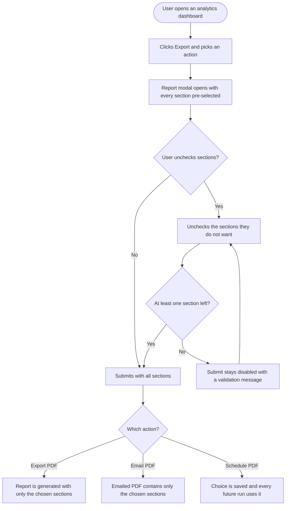

# EPIC: Analytics Report Customization and Overview Card Cleanup

Make analytics reports something users can shape, and make the numbers on them trustworthy.

Today every exported, emailed, or scheduled analytics report contains every section, so a user who only cares about reach and top posts still sends a twenty page PDF. This epic brings the section picker that workspace level reports already have to normal analytics: Overview, the per platform social dashboards, competitor analytics, Campaign and Label, and ad analytics.

Alongside that, it cleans up the Overview dashboard cards. Top posts and Accounts insights are capped at five items instead of growing without limit, and metrics a platform does not actually report stop being shown as 0, so a zero on screen always means a real zero. Facebook and YouTube also gain the publishing behaviour breakdown table that Instagram and LinkedIn already have.

---

Four stories. Backend and frontend are merged into full-stack stories where the change is one coherent piece of behavior.

| # | Story | Covers |
|---|---|---|
| 1 | [Full Stack] Let users pick which sections to include in analytics reports | Request item 1 |
| 2 | [Full Stack] Cap overview top posts and account insights at five and hide metrics a platform does not report | Request items 2 and 3, merged |
| 3 | [Full Stack] Add the publishing behaviour breakdown table to Facebook and YouTube analytics | Request item 4 |
| 4 | [Design] Design the report section picker and the revised overview cards | Design support for stories 1 and 2 |

---

## 1. [Full Stack] Let users pick which sections to include in analytics reports

### Description

Today a user who exports, emails, or schedules an analytics report always gets every section of that report. A user who only cares about top posts and engagement still receives a fifteen page PDF with demographics, active hours, and everything else, and there is no way to trim it.

Workspace level reports already solve this: when creating one, the user picks exactly which sections go into the PDF. This story brings the same control to normal analytics: Overview, the per platform social dashboards (Facebook, Instagram, LinkedIn, X, Pinterest, TikTok, YouTube, Google Business Profile), competitor analytics (Facebook and Instagram), Campaign and Label, and ad analytics (Meta Ads and Google Ads).

The value is a shorter, more relevant report. A user reporting to a client who only asks about reach and top posts can send a three page PDF instead of a twenty page one, and a scheduled report keeps that choice on every future run.

Every section stays selected by default, so a user who does not care about this sees no change beyond one extra confirmation step when exporting.

### Workflow

1. The user opens any analytics dashboard in scope and sets their accounts and date range as they do today.
2. The user clicks **Export** and picks **Export PDF**, **Email PDF**, or **Schedule PDF**.
3. A modal opens. Alongside the options that already exist for that action, the user sees a **Sections to include** area listing every section of that report, all checked.
4. The list matches the dashboard they are on. On Instagram they see Instagram sections, on Meta Ads they see Meta Ads sections. They can never be offered a section that report does not have.
5. The user unchecks whatever they do not want. A counter under the label keeps count. On dashboards with a long section list, the user can filter the list by typing.
6. If the user unchecks everything, the submit button disables and a validation message explains why.
7. The user submits. For **Export PDF** and **Email PDF** the report is produced immediately with only the chosen sections, in that report's normal section order. For **Schedule PDF** the choice is saved with the schedule and every future run uses it.
8. Reopening an existing scheduled report shows the previously saved selection. A scheduled report created before this change shows every section checked and keeps behaving exactly as it does today.

### UI copy

**Section picker (shared by all three actions and by the competitor export)**

- Field label: `Sections to include`
- Info icon (`?`) next to the label, tooltip: `Pick only the parts you want in the PDF. For example, uncheck Demographics if you only care about top posts and engagement. Everything is selected by default.`
- Hint text under the label: `All sections are selected. Uncheck anything you do not want in this report.`
- Select all row label: `Select all`
- Selection counter: `{selected} of {total} sections selected`
- Filter input placeholder (shown when the report has more than 10 sections): `Search sections`
- No filter matches: `No sections match your search.`
- Validation message when nothing is selected: `Select at least one section to include in your report.`
- Section list loading: skeleton rows in place of the checkboxes
- Section list failed to load: `We could not load the section list. Your report will include every section.` The user can still submit, and the report includes everything.

**New Export report modal (Export PDF previously ran with no modal)**

- Title: `Export report`
- Subtext: `Choose what to include, then download this report as a PDF.`
- Primary button: `Export PDF`
- Secondary button: `Cancel`
- On submit, the existing report generating toast is reused, no new copy

**Email PDF modal and Schedule PDF modal**

- No title or button changes. The section picker is added to the existing form using the copy above.

**Section names**

Section labels come from the report engine's own catalog, so a label can never drift from what the PDF actually renders. Existing overview labels stay as they are today: `Overview cards`, `Reach across platforms`, `Engagement across platforms`, `Impressions across platforms`, `Platforms engagement breakdown`, `Performance comparison of platforms`, `Performance comparison of accounts`, `Accounts insights`, `Top posts`.

### Acceptance criteria

- [ ] Export, Email, and Schedule report actions on Overview, Facebook, Instagram, LinkedIn, X, Pinterest, TikTok, YouTube, Google Business Profile, Campaign and Label, Meta Ads, and Google Ads all present a section picker
- [ ] The competitor analytics export (Facebook and Instagram competitor reports) presents the same section picker
- [ ] The sections offered for a report always match the sections that report can actually render, per platform
- [ ] Every section is pre-selected when the modal opens
- [ ] Unchecking all sections disables the submit button and shows: `Select at least one section to include in your report.`
- [ ] The selection counter updates as the user checks and unchecks, in the form `{selected} of {total} sections selected`
- [ ] `Select all` toggles the whole list, and shows an indeterminate state when only some sections are selected
- [ ] A filter input appears when the report has more than 10 sections and narrows the list as the user types
- [ ] An exported PDF contains only the selected sections, in that report's normal section order, with no blank pages or gaps where an unselected section would have been
- [ ] An emailed PDF contains only the selected sections
- [ ] A scheduled report saves its section selection, and every subsequent automated run produces a PDF with exactly those sections
- [ ] Reopening a scheduled report created after this change shows its saved selection
- [ ] A report or schedule created before this change includes every section, unchanged from today
- [ ] Submitting with every section selected produces a PDF identical to today's full report
- [ ] If the section list cannot be loaded, the user sees `We could not load the section list. Your report will include every section.`, can still submit, and receives the full report
- [ ] A report request naming a section that does not belong to that platform does not fail the report, the unknown section is skipped
- [ ] The export and schedule actions remain gated by the existing export and schedule reports entitlement, with no change to who can reach them
- [ ] When a user submits a report with fewer than all sections selected, an `analytics_report_sections_customized` Usermaven event fires with `{ platform, action, sections_selected, sections_total }` where `action` is one of `export`, `email`, `schedule`
- [ ] No event fires when the user leaves every section selected

### Mock-ups

To be provided by the product designer, see **[Design] Design the report section picker and the revised overview cards**.

### Impact on existing data

- Reports and scheduled reports gain a stored section selection. Existing records have none, which already means "every section" in the render engine, so no backfill or migration is needed.
- No analytics data, no ClickHouse schema, and no report output changes for any existing report.

### Impact on other products

- Mobile apps: no impact, analytics report export and scheduling are web only.
- Chrome extension: no impact.
- White-label domains: report branding and cover pages are untouched, so no impact beyond the new modal inheriting the customer's primary color through the existing theming.
- Workspace level reports keep their own existing picker and are not changed by this story.

### Dependencies

- **[Design] Design the report section picker and the revised overview cards** for the picker layout, the long-list treatment, and the new Export report modal.

### Global quality & compliance (wherever applicable)

- [ ] Mobile responsiveness tested
- [ ] Multilingual support verified (translations available or fallback handled)
- [ ] UI theming supported (default + white-label, design library components are being used)
- [ ] White-label domains impact reviewed
- [ ] Cross-product impact assessed (web, mobile apps, Chrome extension)

### Implementation references

*Pointers from research, not a contract. Engineering may choose a different approach.*

**Most of this already exists. The engine, the catalog, and the payload plumbing are done.**

- The report engine's widget catalog is authoritative and already per platform: `contentstudio-social-analytics-go/src/services/reports/catalog/` holds 15 catalogs (`overview`, `facebook`, `instagram`, `linkedin`, `twitter`, `pinterest`, `tiktok`, `youtube`, `gmb`, `meta_ads`, `google_ads`, `campaign_label`, and `competitor` which registers `facebook_competitor` plus `instagram_competitor`).
- `catalog.Resolve(ids, platform)` already validates requested ids against the platform and returns them in the requested order, skipping unknown ids gracefully. `DefaultWidgets(platform)` is the full report. Called from `src/services/reports/builder/widget.go:117`. An empty selection already means "render the default full report", which is exactly the backwards-compatible behavior the AC needs.
- `GET /reports/widgets?platform=…` already exists (`src/api/reports/handler.go:36`) and its package doc says it is there so "the UI can never offer a widget the engine cannot render". Entry shape is `{ id, title, type, platforms, data_deps, chart }` from `src/models/reports/catalog.go`. Nothing needs building on the Go side for this story, only a route to reach it from the SPA.
- `GoReportsClient::buildDefinition()` already forwards `'widgets' => $report->widgets ?? []` (`contentstudio-backend/app/Services/Analytics/GoReportsClient.php:959`). The comment just above it saying "when the widget selector ships, pass `$report->widgets` here" is stale and can be deleted.
- `ReportsModel` already documents `@property array $widgets`.

**What is actually missing:**

- `AnalyticsReports::store()` and `ScheduleReports::store()` neither validate nor persist `widgets`. `WorkspaceReportsController` shows the pattern to copy: `'widgets' => 'sometimes|array'` then `$request->get('widgets', [])`.
- No Laravel route proxies the Go widget catalog to the SPA.
- The competitor export payload is built in `contentstudio-frontend/src/modules/analytics/composables/competitor/useReportExport.ts` and needs the selection added.

**Frontend entry points:**

- All three actions live in one place: `src/modules/analytics/views/common/ExportButton.vue`, mounted from `views/common/AnalyticsFilterBarWrapper.vue`. Its `type` prop is already the report platform key, which is what the catalog endpoint needs. Export PDF currently fires `useRenderReportMutation()` with no modal, so that action needs a modal it does not have today. Email and Schedule already open `components/reports/modals/SendReportByEmailModal.vue` and `ScheduleReportModal.vue`.
- `src/modules/setting/components/WorkspaceReportModal.vue` is the working reference for the picker: `Checkbox` grid, "Sections to include" label with hint, submit blocked at zero selected, and all-selected collapsed to `[]` before sending so the engine renders its default. Worth lifting that into a shared component rather than copying it a third time.
- Report mutations live in `src/modules/analytics/queries/useReportsQueries.ts` and `reportsQueryOptions.ts`.

**Gotchas:**

- Overview reports use platform key `group` or `individual` on the frontend but `overview` in the report catalog. Map before calling the catalog endpoint.
- Campaign and Label uses `campaign-and-label` on the frontend and `campaign_label` in the catalog. `ExportButton` already special-cases this string in three places.
- Instagram, YouTube, Google Ads, and Facebook each expose roughly 17 to 22 sections. The 9-item two-column grid from the workspace modal will not scale to that, which is what the filter input and the design story are for.
- The catalog has no grouping field, so the list can only be flat and ordered by the platform's default order. If grouped headings are wanted, `WidgetCatalogEntry` needs a `group` field added in Go first.
- No existing Usermaven event covers report export. `userMaven.track(` across `src/` has nothing report related, so `analytics_report_sections_customized` is a genuinely new event rather than a duplicate.

---

## 2. [Full Stack] Cap overview top posts and account insights at five and hide metrics a platform does not report

### Description

Two problems in Overview analytics, both in the same two sections, so they are fixed together.

First, the Top posts and Accounts insights sections grow without a sensible limit. Top posts starts at five and then offers a control to load more. Accounts insights shows between two and eight cards depending on the browser window width, and then loads every remaining account at once. A user with twenty connected accounts ends up scrolling a wall of cards, and the same sections in a generated PDF report run to page after page. Both sections should show at most five items, on the dashboard and in the report.

Second, both card types display metrics the platform does not actually report, and those always render as 0. A YouTube account card shows a Reach figure of 0 because YouTube does not report reach at all. A Pinterest account card does the same. A LinkedIn top post shows a views based figure that is always 0. Showing a real zero and showing "this platform has no such metric" look identical to the user, which makes them distrust the numbers that are correct.

After this story, a card only shows metrics that platform genuinely reports, so a zero on screen always means an actual zero.

### Workflow

1. The user opens Overview analytics and sets their accounts and date range.
2. In **Accounts insights** the user sees at most five account cards. Each card shows only the metrics that account's platform reports. A YouTube or Pinterest card no longer carries a Reach row.
3. The metric selector on each account card offers only the metrics that platform reports, so the sparkline can never be a flat line at zero for a metric that does not exist.
4. In **Top posts** the user sees at most five posts for the selected sort. Each post card shows only the metrics its platform reports.
5. Switching the platform tab in either section shows at most five items for that platform.
6. Neither section offers a load more control any more, because there is nothing further to load.
7. Exporting or scheduling an Overview report produces a PDF whose Top posts and Accounts insights sections carry the same five item limit and the same per platform metrics as the dashboard.

**Note for the reviewer:** capping Accounts insights at five needs a rule for which five accounts when a workspace has more. This story assumes **the five accounts with the highest engagement in the selected date range**, with the existing platform tabs left in place so a user can still reach the rest by filtering to one platform. Confirm before build if a different rule is wanted.

### UI copy

- Top posts section tooltip, replacing the current text: `Your five best performing posts for the selected date range, ranked by the sorting you pick above.`
- Accounts insights section tooltip, replacing the current text: `A snapshot of your five most engaged accounts for the selected date range. Use the platform tabs to see accounts from a specific network.`
- The `Load more` control is removed from Accounts insights, and the show more control is removed from Top posts. No replacement copy.
- No other copy changes. Metric rows that are hidden simply do not render, with no placeholder, no dash, and no "not available" text.

### Metrics to show per platform

Taken from what the analytics service actually returns. Anything marked as not reported is currently zero filled at the query layer and is what this story hides.

**Account insight cards**

| Platform | Followers | Posts | Engagement | Impressions | Reach |
|---|---|---|---|---|---|
| Facebook | yes | yes | yes | yes | yes |
| Instagram | yes | yes | yes | yes | yes |
| LinkedIn | yes | yes | yes | yes | yes |
| TikTok | yes | yes | yes | yes | hide, it is the views figure repeated |
| YouTube | yes | yes | yes | yes | hide, not reported |
| Pinterest | yes | yes | yes | yes | hide, not reported |

**Top post cards**

| Platform | Metrics to show |
|---|---|
| Facebook | Post type, Likes, Comments, Shares, plus the sort metric (reach, engagement, or impressions) |
| Instagram | Post type, Views, Likes, Comments, Saves, plus the sort metric |
| LinkedIn | Post type, Likes, Comments, Shares, plus the sort metric, with impressions excluded because LinkedIn reports no views figure |
| TikTok | Post type, Likes, Comments, Shares, Views, plus the sort metric, with reach excluded because it repeats views |
| YouTube | Post type, Likes, Comments, Shares, Views, plus the sort metric, with reach excluded because it repeats views |
| Pinterest | Post type, Impressions, Pin clicks, Outbound clicks, Saves |

### Acceptance criteria

- [ ] Accounts insights shows at most five account cards on the Overview dashboard, at every browser window width
- [ ] The five accounts shown are those with the highest engagement in the selected date range
- [ ] The `Load more` control no longer appears in Accounts insights
- [ ] Top posts shows at most five post cards for the selected sort
- [ ] The show more control no longer appears in Top posts
- [ ] Selecting a platform tab in either section shows at most five items for that platform
- [ ] An account card for a YouTube account does not show a Reach row
- [ ] An account card for a Pinterest account does not show a Reach row
- [ ] An account card for a TikTok account does not show a Reach row
- [ ] Facebook, Instagram, and LinkedIn account cards still show all five metrics as they do today
- [ ] The metric selector on an account card only offers metrics that account's platform reports, and a metric that is hidden from the card is also absent from the selector
- [ ] A LinkedIn top post card never shows an impressions or views based metric
- [ ] A TikTok or YouTube top post card never shows a Reach row
- [ ] A Pinterest top post card shows Impressions, Pin clicks, Outbound clicks, and Saves, and no Likes, Comments, or Shares rows
- [ ] Facebook top post cards show Likes, Comments, and Shares, and no Saves row
- [ ] Instagram top post cards are unchanged from today
- [ ] Hiding a metric leaves no gap, placeholder, dash, or empty row in the card layout, cards with fewer metrics stay aligned with cards that have more
- [ ] A card whose platform reports none of the optional metrics still shows its post type and its sort metric
- [ ] A generated or scheduled Overview PDF report shows at most five items in its Top posts section and at most five in its Accounts insights section
- [ ] The Top posts and Accounts insights sections in a generated PDF report apply the same per platform metric rules as the dashboard
- [ ] A zero shown anywhere in either section is a real zero from the data, not a metric the platform does not report

### Mock-ups

To be provided by the product designer, see **[Design] Design the report section picker and the revised overview cards**. The visual question is how the account and post cards stay aligned when some carry fewer metric rows than others.

### Impact on existing data

- No data, schema, or API response changes. The zero filling in the analytics query layer stays as it is, this story stops presenting those zeros.
- No stored user preference is affected, and the sort and platform tab behavior in both sections is unchanged.

### Impact on other products

- Mobile apps: no impact, Overview analytics cards and PDF reports are web only.
- Chrome extension: no impact.
- White-label domains: no impact, no new branding surface.
- Shared analytics links render the same Overview components, so a shared link inherits the same five item cap and metric rules. Worth a check during QA.

### Dependencies

- **[Design] Design the report section picker and the revised overview cards** for the card layout with a variable number of metric rows.

### Global quality & compliance (wherever applicable)

- [ ] Mobile responsiveness tested
- [ ] Multilingual support verified (translations available or fallback handled)
- [ ] UI theming supported (default + white-label, design library components are being used)
- [ ] White-label domains impact reviewed
- [ ] Cross-product impact assessed (web, mobile apps, Chrome extension)

### Implementation references

*Pointers from research, not a contract. Engineering may choose a different approach.*

**Frontend entry points:**

- `contentstudio-frontend/src/modules/analytics/views/overview/components/TopPostsComponent.vue`. `postsPerView` defaults to 5 but is a page size, not a cap: `visiblePostsCount` starts there and `hasMorePosts` reveals the rest. Capping means dropping the load more path rather than changing the default.
- `contentstudio-frontend/src/modules/analytics/components/competitor/AccountStatisticsWrapper.vue`. Despite the `competitor/` folder this is the Overview Accounts insights section, i18n lives under `analytics.overview.account_statistics.*`. `visibleAccountsCount` is set from `window.innerWidth` (8 at 2xl, 6 at xl, 4 at lg, 2 below) via a resize listener, and `loadMore()` expands to the full list. Capping at five removes the need for the whole responsive count mechanism and its resize listener.
- `contentstudio-frontend/src/modules/analytics/components/competitor/AccountStatistics.vue`. The `statistics` computed emits the same five rows for every platform, and the `metrics` computed always offers engagement, reach, impressions, posts. Both need to be filtered by platform.
- `contentstudio-frontend/src/modules/analytics/views/overview/composables/useOverviewAnalytics.ts`, `getPlatformMetrics()` around line 1345. The `platformMetrics` map already has correct explicit entries for `instagram` and `pinterest`, everything else falls through to a shared `default` of Likes, Comments, Shares. Adding explicit `facebook`, `linkedin`, `tiktok`, and `youtube` entries is the smallest change that satisfies the matrix. Separately, the primary metric is chosen from the sort dropdown with no platform check, and the impressions branch reads `post.views > 0 ? post.views : post.reach`, which is why LinkedIn silently borrows reach.
- The report page reuses both components via `isReportView`, in `views/reports/OverviewReport.vue`.

**Report engine:**

- `contentstudio-social-analytics-go/src/services/reports/builder/widgets_overview.go` registers `accounts_insights` and `overview_top_posts` through the shared `registerAccountInsightsWidget` and `registerTopPostCardsWidget` helpers. Neither caps item counts nor filters metrics per platform.

**Where the metric matrix comes from, if it needs re-verifying:**

- `contentstudio-social-analytics-go/src/db/clickhouse/analytics-get-queries/overview/repository.go`. The per account totals query zero fills reach for YouTube and Pinterest with the inline comment "reach metric not available", and sets TikTok and YouTube reach to the views figure. The graph series builder repeats this around lines 968 and 1001 to 1005. The top posts union query around lines 1805 to 1950 shows the per platform `toInt32(0) AS …` columns for every metric a platform does not report.
- The zero filling is deliberate, so the responses cannot distinguish "absent" from "actually zero". That is why this story uses a declared per platform metric list rather than a null check. Making the service omit unsupported fields instead would be cleaner but is a breaking response change for every Overview consumer, and is out of scope here.

**Gotcha:**

- `AccountStatisticsWrapper.vue` hides the load more button when `isReportView` is true but still derives its count from `window.innerWidth`, so today the account count in a PDF depends on the render viewport. The cap removes that non-determinism, which is worth calling out in QA as an intentional change to report output.

---

## 3. [Full Stack] Add the publishing behaviour breakdown table to Facebook and YouTube analytics

### Description

Instagram and LinkedIn analytics each have a Publishing behaviour breakdown table: one row per content type, showing how many posts of that type went out and how they performed side by side. It answers a question users ask constantly, which is whether reels beat photos, or whether carousels are worth the effort.

Facebook does not have it, even though Facebook has the richest set of post types of any platform we support: photos, videos, reels, carousels, links, text posts, and shared posts. YouTube does not have it either, and shorts versus long form is one of the main decisions a YouTube creator makes.

This story adds the same table to both platforms, on the dashboard and in the PDF report.

Other platforms were assessed and are out of scope: TikTok is video only, X and Google Business Profile store no content type at all, and Pinterest only ever distinguishes image from video, which makes a two row table not worth the plumbing.

### Workflow

1. The user opens Facebook analytics and sets their account and date range.
2. In the overview area, below the publishing behaviour chart, the user sees a **Publishing behaviour breakdown** table.
3. Each row is one Facebook post type used in the selected date range, with a total row at the bottom. Each row carries an icon and a plain language type name.
4. Columns show the post count and the performance metrics for that type, so the user can compare types at a glance.
5. If the account published nothing in the range, the user sees the standard no data state instead of an empty table.
6. The same table appears in the Facebook PDF report, and can be included or excluded like any other report section.
7. The user does the same on YouTube analytics and sees the equivalent table split by video and short.

### UI copy

**Facebook**

- Table title: `Publishing behaviour breakdown`
- Title info icon tooltip: `See how each kind of post performs. For example, compare how your reels did against your photos over the selected date range.`
- Columns: `Post type`, `Total posts`, `Engagement`, `Reactions`, `Comments`, `Shares`, `Clicks`, `Impressions`, `Reach`
- Post type labels: `Photo`, `Video`, `Reel`, `Carousel`, `Link`, `Text`, `Shared post`, and `Total` for the summary row
- Unrecognised type label: `Other`
- No data state: `No publishing data for the selected date range.`

**YouTube**

- Table title: `Publishing behaviour breakdown`
- Title info icon tooltip: `See how each kind of video performs. For example, compare how your shorts did against your long form videos over the selected date range.`
- Columns: `Content type`, `Total videos`, `Engagement`, `Likes`, `Comments`, `Shares`, `Views`, `Watch time (minutes)`
- Content type labels: `Video`, `Short`, and `Total` for the summary row
- No data state: `No publishing data for the selected date range.`

**Both**

- Loading state: skeleton block in place of the table, matching the Instagram and LinkedIn tables
- Cell with no value for that type: `N/A`, with tooltip `Data not available`, matching the existing tables
- Report section names in the report section picker: `Publishing behaviour breakdown`

### Acceptance criteria

- [ ] Facebook analytics shows a Publishing behaviour breakdown table in the overview area
- [ ] The Facebook table has one row per post type published in the selected date range, plus a visually distinct total row
- [ ] Facebook post types are labelled in plain language and carry the same style of type icon as the Instagram and LinkedIn tables
- [ ] Facebook columns are Post type, Total posts, Engagement, Reactions, Comments, Shares, Clicks, Impressions, and Reach
- [ ] A Facebook post type with no posts in the selected range does not appear as a row
- [ ] YouTube analytics shows a Publishing behaviour breakdown table split by video and short, plus a total row
- [ ] YouTube columns are Content type, Total videos, Engagement, Likes, Comments, Shares, Views, and Watch time in minutes
- [ ] Each table's totals row equals the sum of its type rows for every numeric column
- [ ] Changing the date range or the selected account refreshes both tables
- [ ] Both tables show a skeleton while loading and the no data state when the account published nothing in the range
- [ ] Both tables scroll horizontally on narrow screens without the page itself scrolling sideways
- [ ] The Facebook PDF report includes the table, and the YouTube PDF report includes the table
- [ ] Both new sections appear in the report section picker for their platform and can be excluded from a report like any other section
- [ ] The existing Instagram and LinkedIn breakdown tables are unchanged in content and layout

### Mock-ups

N/A. The table reuses the existing Instagram and LinkedIn breakdown table pattern, only the columns and type labels differ.

### Impact on existing data

- The Facebook and YouTube publishing behaviour responses gain a per type rollup. Existing fields are unchanged, so nothing that reads those responses today breaks.
- No ClickHouse schema change. Facebook post types come from the `media_type` and `status_type` columns already stored on Facebook posts, and YouTube from the `media_type` column already stored on videos.
- Two new report sections are registered. Existing reports that predate them keep rendering their previous section set.

### Impact on other products

- Mobile apps: no impact, per platform analytics dashboards and PDF reports are web only.
- Chrome extension: no impact.
- White-label domains: no impact.
- Shared analytics links render the same dashboard sections, so the table appears there too.

### Dependencies

- **[Full Stack] Let users pick which sections to include in analytics reports** for the two new sections to be selectable in the picker. The tables themselves do not depend on it, and either story can ship first.

### Global quality & compliance (wherever applicable)

- [ ] Mobile responsiveness tested
- [ ] Multilingual support verified (translations available or fallback handled)
- [ ] UI theming supported (default + white-label, design library components are being used)
- [ ] White-label domains impact reviewed
- [ ] Cross-product impact assessed (web, mobile apps, Chrome extension)

### Implementation references

*Pointers from research, not a contract. Engineering may choose a different approach.*

**The pattern to copy:**

- `contentstudio-frontend/src/modules/analytics/views/instagram/components/PublishingBehaviourBreakdownTable.vue` and the near identical `views/linkedin/components/PublishingBehaviourBreakdownTable.vue`. Both read `publishing_behaviour_rollup.current` off the existing `publishingBehaviour` section response, render a `Table` inside `AnalyticsCardWrapper`, map type codes to icons and translated labels, and highlight the `TOTAL` row.
- Mounted from `views/<platform>/components/OverviewSection.vue` (Instagram line 283, LinkedIn line 321) and from `views/reports/InstagramReport_v2.vue` and `views/reports/LinkedinReport_v2.vue`.
- Two near duplicate components already exist, so adding two more copies would make four. Worth extracting one shared component driven by a per platform column and type-label config instead.

**Backend shape:**

- `contentstudio-social-analytics-go/src/models/analytics/instagram/types.go:109` and `linkedin/types.go:123` both use `PublishingBehaviourRollup map[string][]PublishingBehaviourMediaType`, where the entry carries `media_type`, `total_posts`, and the platform's metrics. Facebook's `PublishingBehaviourRollup map[string]*PublishingRollup` (`facebook/types.go:151`) is aggregate only, with `post_count`, `post_engagement`, `post_reactions`, `post_comments`, `post_clicks`, `post_impressions`, `post_shares`, and no type dimension. Matching the Instagram and LinkedIn shape keeps the frontend component shared.
- Facebook reach per post is `post_impressions_unique` on `facebook_posts`, which is what the overview top posts query already uses.
- Facebook post type values seen in the parsers are photo/image, video, reel, album/carousel, link, share, and text (`src/utils/parsing/facebook_competitor_parser*.go`). The Facebook analytics API already accepts a `media_type` filter param (`src/api/analytics/facebook/handler.go:46`), so the dimension is queryable today.
- YouTube `media_type` is `"video"` or `"short"` and nothing else (`src/models/kafka/youtube.go:57`). Watch time is `minutes_watched` on `youtube_videos`.

**Report engine:**

- Register the new sections in `src/services/reports/catalog/facebook.go` and `catalog/youtube.go`, matching how Instagram registers `ig_publishing_breakdown` and LinkedIn registers `publishing_breakdown`, then add them to the platform's default section list and wire the adapter in `src/services/reports/adapters/facebook/adapter.go` and `adapters/youtube/adapter.go`.

**Assessment of the platforms left out, if it needs re-checking:**

- TikTok hardcodes `'video' AS media_type` in its queries, single type by definition.
- X and Google Business Profile have no media or post type column in their ClickHouse schemas.
- Pinterest pins do store `media_type` and `creative_type`, but the analytics query layer only ever distinguishes image from video (`src/db/clickhouse/analytics-get-queries/pinterest/repository.go:455` restricts to exactly those two values), so the table would be two rows and a total.

---

## 4. [Design] Design the report section picker and the revised overview cards

### Description

Two of the stories in this batch need design input before frontend work starts. This story covers both so the designer produces one consistent set of screens.

**Report section picker.** Users need to choose which sections go into an analytics report. Workspace level reports already have a version of this, a simple two column checkbox grid, but that only ever handles nine sections. Normal analytics reports have many more, up to roughly 22 on Instagram, and the picker has to appear in three different places: a brand new Export report modal, the existing Email PDF modal, and the existing Schedule PDF modal, each of which already carries its own form fields.

**Revised overview cards.** Top posts cards and account insight cards will start showing a variable number of metric rows, because metrics a platform does not report get hidden rather than rendered as 0. A Pinterest card and a Facebook card will no longer have the same number of rows, and the cards sit side by side in a grid. Both sections also drop to a hard maximum of five items, which removes the load more control from Accounts insights and changes how the section closes off.

### What the designer needs to deliver

**Report section picker**

- The picker at three list sizes: short (Overview, 9 sections), medium (LinkedIn, roughly 16), and long (Instagram, roughly 22). The long case is the one that needs a real answer, whether that is a scroll area, grouped headings, a two panel selected-versus-available layout, or something else.
- Select all and indeterminate states, and the selection counter placement.
- The filter input treatment for long lists, including the no matches state.
- The validation state when the user has unchecked everything and submit is disabled.
- The loading state for the section list, and the failure state where the list cannot be loaded but the user can still submit.
- The new Export report modal in full, since Export PDF has no modal today.
- The picker as it sits inside the existing Email PDF and Schedule PDF modals, showing how it coexists with the fields already there without making either modal feel long.

**Revised overview cards**

- Top post card with the shortest and longest metric lists side by side in the grid, showing how alignment holds.
- Account insight card with and without the Reach row, side by side.
- The account card metric selector when it offers fewer options than today.
- How each section terminates now that there is a hard five item limit and no load more control.
- Both sections at mobile, tablet, and desktop widths, plus how they appear in the PDF report layout where the render viewport is fixed.

**Both**

- Note any component that does not exist in the design library yet, so it can be added before frontend work starts. The picker's long list treatment is the likely candidate.
- Use the existing analytics card and modal patterns rather than new shells, and specify redlines only where the new layout departs from them.

### Acceptance criteria

- [ ] Section picker designs delivered for short, medium, and long section lists, with a clear answer for the long case
- [ ] Select all, indeterminate, counter, filter, no matches, zero selected, loading, and load failure states all covered
- [ ] New Export report modal designed in full
- [ ] Section picker shown in place inside the existing Email PDF and Schedule PDF modals
- [ ] Top post card and account insight card designed with variable metric row counts, showing grid alignment
- [ ] Account card metric selector designed with a reduced option set
- [ ] Both overview sections designed at mobile, tablet, and desktop widths, and in the PDF report layout
- [ ] Any missing design library component is named and flagged
- [ ] Designs handed off to frontend before implementation of the two full-stack stories begins

### Mock-ups

This story produces them.

### Impact on existing data

N/A, design only.

### Impact on other products

N/A, both features are web only.

### Dependencies

None. This story unblocks **[Full Stack] Let users pick which sections to include in analytics reports** and **[Full Stack] Cap overview top posts and account insights at five and hide metrics a platform does not report**.

### Global quality & compliance (wherever applicable)

- [ ] Mobile responsiveness tested, N/A for a design story beyond specifying the breakpoints
- [ ] Multilingual support verified, designs must tolerate longer translated section names and column headers
- [ ] UI theming supported (default + white-label, design library components are being used)
- [ ] White-label domains impact reviewed
- [ ] Cross-product impact assessed (web, mobile apps, Chrome extension), N/A, both features are web only
