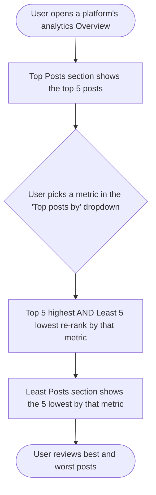

# Story — Top Posts sort dropdown + Least Posts consistency across platform analytics

One full-stack story. Create with the **New Feature Template**. Nothing is pushed to Shortcut. The backend portion is the **Go analytics service** (`contentstudio-social-analytics-go`), not the Laravel backend.

---

## [Full Stack] Add the Top Posts sort dropdown + Least Posts to Facebook, Instagram, LinkedIn & TikTok analytics

### Description
As a user viewing platform analytics, I want the **Top Posts** section on **Facebook, Instagram, LinkedIn, and TikTok** to behave like it already does on **Pinterest and YouTube** — with a "Top posts by …" dropdown in the heading and a **Least Posts** section beneath — so I can rank my best and worst posts by the metric I care about, consistently on every platform.

Today these four platforms are inconsistent with the rest: Facebook, Instagram, and LinkedIn have neither the sort dropdown nor a Least Posts section; TikTok already shows Least Posts but has no dropdown. This story closes that gap.

### Workflow

1. The user opens the analytics Overview for Facebook, Instagram, LinkedIn, or TikTok.
2. The **Top Posts** heading is now a **"Top posts by …" dropdown** (replacing the plain heading), defaulting to **Engagement**.
3. The user picks a metric from the dropdown (options depend on the platform — see UI copy). The **top 5 posts** re-rank by that metric.
4. A **Least Posts** section shows the **5 lowest** posts by the same metric (the one dropdown controls both Top and Least).
5. Each section shows the **5 top and 5 least** posts — matching the Pinterest/YouTube layout.

### Acceptance criteria

**Top Posts sort dropdown (Facebook, Instagram, LinkedIn, TikTok)**
- [ ] On each platform's analytics Overview, the Top Posts section heading is a dropdown ("Top posts by {metric}"), matching the Pinterest/YouTube pattern.
- [ ] The dropdown options per platform are exactly:
  - **Facebook:** Engagement, Impressions, Reach
  - **Instagram:** Engagement, Views, Reach
  - **LinkedIn:** Engagement, Impressions, Reach
  - **TikTok:** Engagement, Views
- [ ] The default selection is **Engagement** on every platform.
- [ ] Changing the metric re-ranks the Top Posts (top 5 highest by that metric).

**Least Posts section**
- [ ] Facebook, Instagram, and LinkedIn Overviews show a **Least Posts** section (they don't today), displaying the 5 lowest posts by the selected metric.
- [ ] TikTok's existing Least Posts section is driven by the new dropdown (TikTok already shows Least Posts; it just needs the dropdown wired in).
- [ ] The **single dropdown controls both** the Top and Least lists — picking a metric updates both together.

**Shared behavior (match Pinterest/YouTube)**
- [ ] Each of the Top and Least lists shows up to **5 posts** — no "show more" button and no full-list modal.
- [ ] Loading shows the existing skeleton placeholders; if a platform/date range has no posts, the section shows the existing empty state; fetch errors surface the existing error handling.
- [ ] No change to the metric values shown on each post card — only the ordering and the new Least section.

**Backend (Go analytics service)**
- [ ] Facebook, Instagram, and LinkedIn expose a **least-performing posts** result (the 5 lowest by the selected metric) — new to those platforms.
- [ ] The top and least lists honor the selected metric (`order_by`) for engagement / impressions / reach / views as applicable per platform.
- [ ] TikTok requires **no backend change** — its combined top+least endpoint already returns both with a sort parameter.

### UI copy
- **Dropdown trigger:** "Top posts by {metric}" (e.g., "Top posts by Engagement").
- **Dropdown option labels:** "Engagement", "Impressions", "Reach", "Views" (show only the options valid for that platform, per the table above).
- **Least Posts section heading:** "Least Posts".
- **Empty state:** reuse the platform's existing Top Posts empty-state copy for the Least Posts section too.
- No new tooltips required — the dropdown labels are self-explanatory.

### Mock-ups
N/A — this mirrors the existing Pinterest/YouTube Top-and-Least layout. See those reports for the visual reference.

### Impact on existing data
None. The Least Posts lists are computed from existing analytics data (no schema change); the frontend re-orders and adds a section.

### Impact on other products
- **Mobile apps / Chrome extension:** not affected (analytics reports are web-only).
- **White-label:** no impact — reuses the shared `AnalyticsDropdown` and existing post-card components/tokens.

### Dependencies
None.

### Global quality & compliance (wherever applicable)
- [ ] Mobile responsiveness (frontend only, N/A for backend-only stories)
- [ ] Multilingual support (frontend + backend, translations available or fallback handled)
- [ ] UI theming support (default + white-label, design library components are being used)
- [ ] White-label domains impact review
- [ ] Cross-product impact assessment (web, mobile apps, Chrome extension)

### Implementation references
*Pointers from research — not a contract. Engineering may choose a different approach.*

**Reference implementation to copy (frontend):**
- `contentstudio-frontend/src/modules/analytics/views/pinterest/components/TopAndLeastEngagingPosts.vue` (and the YouTube equivalent) — the target pattern: shared `views/common/AnalyticsDropdown.vue` + `AnalyticsDropdownItem.vue`, one `selectedTopLeastSortType` driving both top and least lists (5 each; **do not** add the "show more"/`TopPostsModal` affordance for this story).

**Frontend targets:**
- `views/facebook/components/TopPosts.vue`, `views/instagram/components/TopPosts.vue`, `views/linkedin/components/TopPosts.vue` — today these are plain top-5 lists with no dropdown/least; adopt the Top-and-Least pattern (dropdown + least section). Each `use<Platform>Analytics` composable already exposes a `TopLeastEngagementDropdown` / `selectedTopLeastSortType` scaffold — extend its options to the per-platform metrics and pass the selection as `order_by` to the top query + a new least query.
- `views/tiktok/components/TopAndLeastEngagingPosts.vue` — already renders top+least; **add only the `AnalyticsDropdown`** (Engagement, Views) and wire it to the existing sort.
- i18n: add the option labels + "Least Posts" heading under `analytics.<platform>.*` in **all 8 locale dirs**.

**Backend (Go — `contentstudio-social-analytics-go`):**
- `src/api/analytics/{facebook,instagram,linkedin}/handler.go` (+ their `service`/types) — **add a least-performing posts endpoint** for each, modeled on `pinterest/handler.go` `HandleTopPins` (parses `order_by` + `limit`) and YouTube's dual top/least (`parseTopAndLeastVideosRequest`). Least lists exist today only for Pinterest/YouTube/TikTok/competitors.
- Top-posts `order_by` already exists on FB (`HandleOverviewTopPosts`), IG (`HandleTopPosts` → `topReq.OrderBy`), and LinkedIn (`handleTopPostsWithDefault`) — **confirm the accepted `order_by` values cover** engagement/impressions/reach (FB, LinkedIn) and engagement/views/reach (IG); extend if any is missing.
- `src/api/analytics/tiktok/handler.go` `HandleTopAndLeastPerformingPosts` — **no change** (already returns top+least with `sort_order`).

**No analytics event** — this is a view-only sort/consistency change (per story guidelines §19).

---

## Shortcut fields

### [Full Stack] Add the Top Posts sort dropdown + Least Posts to Facebook, Instagram, LinkedIn & TikTok analytics
- **Template:** New Feature Template
- **Story type:** feature
- **Project:** Web App
- **Group:** Full Stack
- **Epic:** Q2 - 2026: Miscellaneous (id `115078`) — *PO: confirm the current-quarter Miscellaneous epic; config lists Q2-2026.*
- **Priority:** Medium
- **Product Area:** Analytics
- **Skill Set:** Backend + Frontend *(backend = the Go analytics service, not Laravel)*
- **Estimate:** _(empty — set during sprint planning)_
- **Labels:** _(none)_
- **Iteration:** _(PO assigns current/target sprint)_
