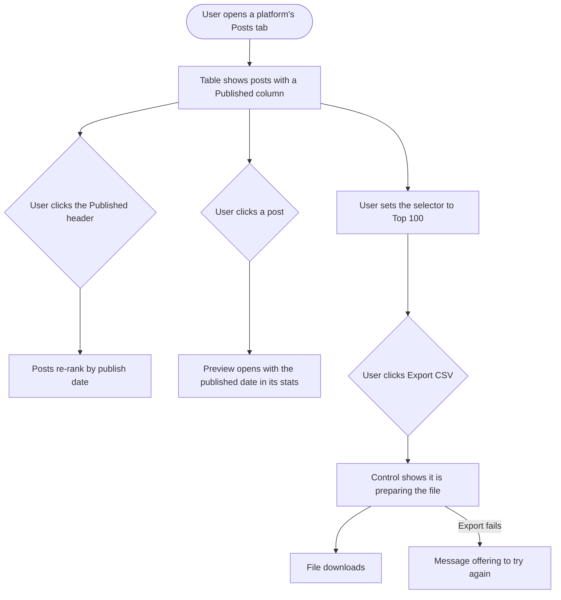

# Stories: Published date column and CSV export for the analytics Top Posts table

**Date:** 2026-09-11
**Stories:** 3
**Research:** `01-research.md`

---

## Overview

The analytics Top Posts table, the Posts tab surface with the "Top 100" selector, tells a user which posts performed best but never tells them **when** those posts went out. And there is no way to get the table out of the product: a user who wants to sort their top hundred posts by date, or hand them to a client, has to read numbers off the screen.

Two changes fix both. A **published date column** on the table, and the same date in the **post preview stats**, so the date is visible wherever a post is. And a **CSV export** of the table, so a user can pull up to a hundred top posts into a spreadsheet, sort by date or any other column, and share it.

Applies to **every analytics posts table**:

- The eleven platform Posts tabs, all of which use the same shared table: Facebook, Instagram, LinkedIn, Twitter/X, Pinterest, YouTube, TikTok, Threads, Bluesky and GMB/GBP.
- The **Campaign and Label performance report Posts tab**, which uses a different and newer table, already shows a published date under the caption, and is served by its own endpoint.

### What is not in scope

- **Mobile.** The app has no analytics posts table, and a CSV download is not a mobile-shaped action.
- **Exporting more than the table holds.** The selector tops out at a hundred and so does the export.
- **Card grids, because there is no table to export.** The Overview and group top posts, the competitor top and least performing posts, and the per-platform Overview "Top posts" section are card grids with no column set. The per-platform "show more" modal is the exception: it mounts the shared table and so inherits both changes for free.
- **The Meta Ads and Google Ads tables.** They use the same newer table as Campaign and Label, but they are campaign, keyword and ad tables rather than posts tables.
- **Changing which posts rank, or how they rank.** Only the date column, the date in the preview, and the export.

### Sequencing

The backend story leads: the frontend needs a single consistent date field to read, and an endpoint to call for the export. The design story can start immediately and in parallel.

### Decisions taken

- **The export is built in the Go analytics service, not in the browser.** Both halves already exist as precedent in the codebase, and the table only holds the currently loaded page in memory, so a browser-side export could not honour "up to 100" independently of what is on screen.
- **The CSV date is written in a sortable form**, `YYYY-MM-DD HH:MM` in the workspace timezone, with the timezone named in the column header. The whole point of the export is sorting, and two of the four supported display formats do not sort. The on-screen column still uses the user's own format.
- **One normalized date field is added to the API response** so the shared table reads one field rather than nine different ones.
- **The export exports the current selection.** Whatever number the selector is set to is exactly how many rows the CSV contains, so the selector stays the single control and the file always matches the screen.
- **The export control is hidden on analytics share links.** A share-link viewer is not a workspace member, so they can read the table but cannot pull the data out of it. The date column itself still shows on share links.
- **No extra gate. Whoever can access analytics can export.** Not plan-gated and not role-gated. The export carries exactly the access the top-posts endpoints already carry. Deliberately different from the existing analytics PDF export, which is gated on a paid plan feature, because a table CSV is far cheaper to produce.
- **Twitter/X gains a published-date sort field**, so the column sorts on every platform rather than being inert on one.
- **The published date is its own sortable column on every posts table, Campaign and Label included.** Not a line tucked under the caption. A column is what makes it sortable on screen and what makes it a real field in the export, which is the entire point of the feature. Campaign and Label currently shows the date under the caption rather than as a column, so it gains a column like every other table.

### Before build

Nothing is open. One practical note: **Threads analytics exists and is on the QA environment**, but its service-side code sits on a branch that has not reached the branch this research searched. Threads is in scope. Whoever picks up the backend story should find that branch and coordinate, and if Threads merges after this work starts it needs the same treatment applied rather than inheriting it automatically.

---

## Story 1

### Title

**[BE] Return a consistent published date for analytics top posts and add a CSV export**

### Description

As someone looking at my top posts in analytics, I want to know when each one was published and be able to pull the whole table into a spreadsheet, so that I can see which posts worked and when, sort them by date, and hand the list to a client without retyping it.

Every platform already knows when each post was published, and every platform returns it differently. Some call it one thing and some another, two platforms ignore the workspace timezone, one returns a date in a shape nothing else uses, and on two platforms the field that looks like a publish date is actually the day the data was collected. Left alone, a visible date column would publish that inconsistency to customers, showing one platform in local time and another in UTC on the same screen.

So this story does two things: it makes the published date consistent and correct across every platform, and it adds a streamed CSV export of the table, honouring the same filters, ordering and limit that produced the table on screen.

---

### Endpoints

| Endpoint | Description |
|---|---|
| **Top posts, per platform** (the existing endpoints behind the Posts tab table) | Response gains a single normalized published-date field, present on every platform, sourced from the correct underlying column for that platform, in a consistent format, converted to the workspace timezone. Existing date fields stay exactly as they are so nothing that reads them breaks. |
| **Top posts ordering, per platform** | Ordering by published date is accepted on every platform, so the table's date column can sort server-side like every other column. |
| **Export top posts as CSV, per platform** | Takes the same parameters as the top-posts endpoint, being the account, date range, timezone, ordering and limit, and streams a CSV of exactly those rows. Responds as a file download with a meaningful filename. Applies the same maximum of a hundred rows. |
| **Campaign and Label top posts** | The Campaign and Label performance report Posts tab is served by its own endpoint rather than the per-platform ones. It already returns a published date, so it needs the field named consistently with the others, and it needs its own export. |
| **Export Campaign and Label top posts as CSV** | Same contract as the per-platform export, taking that report's own parameters. |
| **Public API top posts** | Inherits the normalized date field automatically, since it proxies the same response. No separate work, but the API reference needs the new field documented. |

---

### Workflow

The user here is a developer, so developer terms are used deliberately.

1. A request for a platform's top posts arrives with an account, a date range, a timezone, an ordering and a limit.
2. The response returns each post with a published date in one consistent field name and format, converted into the requested timezone, taken from the column that genuinely represents when the post went live on that platform.
3. A request can order by published date on any platform.
4. A request to the export endpoint, carrying the same parameters, streams back a CSV of those same rows as a file download.
5. The CSV carries a header row, one row per post, the published date in a sortable form with its timezone named, and a byte-order mark so spreadsheets read non-Latin captions correctly.

---

### Acceptance criteria

**A consistent published date**

- [ ] Every platform's top-posts response includes a single normalized published-date field, with the same name on every platform
- [ ] The Campaign and Label top-posts response uses that same field name, so every posts surface in analytics agrees
- [ ] The value is the date the post was published on the platform, not the date ContentStudio fetched or stored it
- [ ] On the two platforms where the existing date-looking field is the data-collection day rather than the publish date, the normalized field uses the real publish date instead
- [ ] The value is converted into the timezone supplied with the request, on every platform without exception
- [ ] The value has the same format on every platform
- [ ] When a post genuinely has no publish date, the field is returned empty rather than as a placeholder date or an epoch date
- [ ] Every date field that exists today continues to be returned, unchanged, so existing consumers are unaffected
- [ ] The timezone conversion is applied by one shared implementation rather than the several near-copies that exist today, and the platforms that currently ignore the timezone use it
- [ ] Test coverage asserts, per platform, that a post with a known publish time in one timezone comes back converted correctly for another

**Fixing the specific platform defects**

- [ ] Twitter/X returns the published date in the same format as every other platform, converted to the requested timezone, rather than the raw unconverted string it returns today
- [ ] Bluesky returns the published date converted to the requested timezone, rather than always UTC
- [ ] YouTube's normalized date is its publish date, not the daily snapshot date
- [ ] Bluesky's normalized date is its publish date, not the daily snapshot date

**Ordering by date**

- [ ] Ordering by published date is accepted on every platform that serves the Posts tab table, and on the Campaign and Label Posts tab
- [ ] Twitter/X accepts ordering by published date, which it does not today
- [ ] An unrecognised ordering value continues to fall back to the existing default rather than erroring, matching today's behavior

**The CSV export**

- [ ] An export endpoint exists per platform, taking the same parameters as that platform's top-posts endpoint
- [ ] An export endpoint exists for the Campaign and Label Posts tab, taking that report's own parameters
- [ ] The CSV contains exactly the posts the equivalent top-posts request would return, in the same order, so the file always matches the table on screen
- [ ] The response is a file download with a filename that identifies the platform and the date it was exported
- [ ] The CSV begins with a byte-order mark, so a spreadsheet opens captions containing non-Latin characters correctly rather than as mojibake
- [ ] The first row is a header row naming every column
- [ ] The published date column is written in a sortable form, being a four-digit year, month and day followed by the time, and its header names the timezone the values are in
- [ ] Sorting the exported file by the published date column in a spreadsheet produces correct chronological order
- [ ] The columns match the columns of the table for that platform, plus the post caption or title and a link to the post
- [ ] A caption containing a comma, a quotation mark or a line break is escaped so the CSV stays valid and opens correctly
- [ ] Numeric metrics are written as plain numbers with no thousands separators, so spreadsheets treat them as numbers rather than text
- [ ] The CSV contains exactly as many rows as the selector was set to, so a selection of twenty exports twenty rows and not a hundred
- [ ] The export is capped at the same maximum of a hundred rows as the table
- [ ] The export is streamed rather than assembled in memory
- [ ] Requesting an export for an account with no posts in the range returns a CSV with only the header row, rather than an error or an empty file
- [ ] The response carries the headers a browser needs to read the filename when the request crosses origins, since the app and this service are on different origins
- [ ] The export requires exactly the access the equivalent top-posts endpoint requires, with no additional plan check and no additional role check
- [ ] A caller who can read a platform's top posts can export them, and a caller who cannot read them cannot export them
- [ ] When an export completes, an `analytics_top_posts_exported` event is recorded server-side with `{ workspace_id, platform, row_count }`

---

### Mock-ups

N/A, backend only.

---

### Impact on existing data

No change to stored data, no migration, and no change to the data pipeline. The publish timestamp is already persisted per post for every platform. This story changes how it is read, converted and presented.

One thing to know for QA: `day_of_week` and `hour_of_day` are derived at ingest from the raw platform timestamp, so they are fixed to whatever offset the platform reported. They will not always agree with a workspace-timezone published date at day boundaries. That is pre-existing and not introduced here, but it will become visible once the date is on screen.

---

### Impact on other products

- **Public API:** the normalized date field appears automatically, since the public endpoints proxy this response. Additive, so no existing integration breaks, but the API reference should document it.
- **Analytics PDF reports:** the report layouts for Facebook, Instagram and LinkedIn maintain their own column lists. They are unaffected unless the date is added there too, which is a separate decision.
- **Share links:** analytics share links read the same endpoints, so a shared analytics view will show the date column once the frontend renders it. Worth confirming that is wanted, since a share link is visible to people outside the workspace.
- **Mobile app:** no impact, it has no analytics posts table.
- **Chrome extension:** no impact.
- Related: **[BE] Show dates and times in analytics reports using the user's own format and timezone** covers the same preference system for PDF reports. The date mapping that story relies on is the one this story should reuse rather than re-implement.

---

### Dependencies

None. This story leads.

Note for planning: **[Full Stack] Add the Top Posts sort dropdown + Least Posts to Facebook, Instagram, LinkedIn & TikTok analytics** also works in this service and touches top-posts ordering. If both are in flight, the ordering whitelists are the shared surface.

---

### Global quality & compliance (wherever applicable)

- [ ] Mobile responsiveness, N/A for this backend-only story
- [ ] Multilingual support (frontend + backend, translations available or fallback handled)
- [ ] UI theming support, N/A for this backend-only story
- [ ] White-label domains impact review
- [ ] Cross-product impact assessment (web, mobile apps, Chrome extension)

---

## Story 2

### Title

**[FE] Add a published date column and CSV export to the analytics Top Posts table**

### Description

As someone reviewing my best posts in analytics, I want to see when each one was published and be able to download the table, so that I can tell a post from last week apart from one from three months ago, and pull the list into a spreadsheet to sort, filter and share it.

The table currently shows what performed well but never when. This story adds a **Published** column, shows the same date in the **post preview stats**, and adds an **Export CSV** control at the far right of the table header, next to the "Top 100" selector.

One detail worth calling out: the date shown on screen uses the date format the user has already chosen in their settings, in their workspace's timezone, so it matches the rest of the product. The exported file deliberately uses a sortable date form instead, because sorting by date in a spreadsheet is the whole reason the export exists and two of the four formats users can pick do not sort.

---

### Workflow

1. User opens a platform's analytics and goes to the Posts tab.
2. The table shows the existing columns plus a **Published** column, in the user's own date format and their workspace's timezone.
3. User clicks the Published column header to rank posts by when they went out.
4. User clicks a post. The preview opens and its stats list includes the published date, this time with the time of day as well.
5. User sets the selector to "Top 100" so the table holds their hundred best posts.
6. User clicks **Export CSV** at the right of the table header. The control shows it is preparing the file and then the download starts.
7. User opens the file in a spreadsheet, sorts by the published date column, and it sorts correctly.
8. If the export fails, the user sees a message offering to try again, and nothing about the table changes.

---

### Acceptance criteria

**The Published column**

- [ ] A **Published** column appears in the Top Posts table on every platform that has a Posts tab: Facebook, Instagram, LinkedIn, Twitter/X, Pinterest, YouTube, TikTok, Threads, Bluesky and GMB/GBP
- [ ] A **Published** column appears on the Campaign and Label performance report Posts tab, which uses a different table, and reads and sorts the same as it does on the platform tables
- [ ] The Campaign and Label column is sortable, so a user can rank that report's posts by publish date like any other column
- [ ] The under-caption published date that Campaign and Label shows today is left in place. It duplicates the new column, so design may choose to trim it, but removing it is not required by this story
- [ ] The column shows the date in the date format the user has saved in their settings
- [ ] The date is shown in the workspace's timezone, not in UTC
- [ ] A post with no publish date shows an empty cell rather than a placeholder or a 1970 date
- [ ] The column header carries a tooltip explaining what the date is and which timezone it is in
- [ ] The column can be sorted, and sorting it re-ranks the posts by publish date
- [ ] The column sits in a consistent position across every platform, so the table does not reshuffle as the user moves between platforms
- [ ] The column appears in the "show more" modal that opens from the Overview's Top Posts section, which uses the same table
- [ ] Existing columns keep their current order, widths and behaviour
- [ ] The table still scrolls horizontally where the columns exceed the available width, with no column clipped
- [ ] The frontend reads a single date field from the API rather than a different field name per platform

**The published date in the post preview**

- [ ] Opening a post's preview shows the published date in the stats list alongside the metrics
- [ ] The preview shows the date **and** the time of day, in the user's saved date and clock formats and the workspace's timezone
- [ ] The date appears in the preview on every platform whose posts open a preview
- [ ] A post with no publish date omits the row rather than showing an empty one

**The export control**

- [ ] An **Export CSV** control sits at the far right of the table header, to the right of the "Top 100" selector
- [ ] Clicking it downloads a CSV of the posts currently in the table, honouring the selector, the date range, the selected account and the current sort
- [ ] While the file is being prepared the control shows a loading state and cannot be clicked again
- [ ] When there are no posts for the current selection, the control is disabled and explains why on hover
- [ ] When the export fails, a message appears offering to try again, and the table is unchanged
- [ ] The downloaded file has a name identifying the platform and the export date
- [ ] The export control appears on every platform with a Posts tab, and on the Campaign and Label Posts tab
- [ ] The CSV contains exactly as many posts as the selector is set to, so a user on "Top 20" gets twenty rows
- [ ] The export control is **not** shown when the table is being viewed through an analytics share link
- [ ] The Published column **is** still shown through an analytics share link, so a share-link viewer can read the dates even though they cannot export them
- [ ] The export control does not appear in the PDF report layouts, which are a separate rendering of the table
- [ ] The export does not interfere with the existing analytics export control elsewhere on the page, which handles PDF reports, and the two are visually distinguishable enough that a user does not confuse them
- [ ] At narrow widths the table header wraps so the selector and the export control both stay reachable, and neither overlaps the table title
- [ ] The export event is recorded server-side, so the frontend must **not** fire a duplicate analytics event for the same action

**Translations**

- [ ] The new column header, its tooltip, the export control label, its tooltip, its disabled explanation and the failure message are all added as translation keys across every supported locale in the same change, with no hardcoded English left in a component

---

### UI copy

**Column header**

> **Label:** Published
> **Header tooltip:** When this post went live, shown in your workspace's timezone.

**Empty cell**

> Blank. No placeholder text and no dash, so the column stays easy to scan and sorting is not affected.

**Post preview stats row**

> **Label:** Published
> **Value:** the date and time in the user's saved formats, for example "Oct 07, 2026 2:15 PM"
> **Tooltip:** When this post went live, shown in your workspace's timezone.

**Export control**

> **Label:** Export CSV
> **Tooltip:** Download these posts as a CSV file you can open in Excel or Google Sheets, then sort and share however you like.
> **Preparing state label:** Preparing...
> **Disabled tooltip, when there are no posts:** There are no posts to export for this date range.

**Failure message**

> Shown as a toast: We could not export your posts. Please try again.

**Loading state**

While the table itself is loading, the Published column uses the same skeleton placeholder treatment as the other columns. The export control is disabled until the table has loaded.

**Empty state**

N/A as a new state. When a platform or date range has no posts, the table shows its existing empty state, and the only change is that the export control is disabled with the explanation above.

**Component notes**

> The export control uses the `Button` component in its secondary variant with a download `Icon`, sized to sit level with the existing selector. The preparing state uses the `Loader` component in place of the label.
>
> **Two different tables.** The eleven platform Posts tabs share one table component, while the Campaign and Label Posts tab uses a newer one with a real column config array and a toolbar that already has a trailing slot for a control like this. The newer one is the easier of the two for both changes. Expect the work to be shaped differently on each rather than a single change covering both.
>
> **Worth knowing for estimation:** the shared table takes its columns as a plain list of header keys with formatter callbacks supplied per platform, and every existing formatter is a number formatter. The Published column is the first non-numeric cell this table has rendered, so it needs a new formatter shape rather than an addition to an existing map. The header list, titles, tooltips and formatters are declared separately in each of the platform composables, and three of them deviate from the common naming. This is mechanical work, but it is wide rather than deep, and Facebook, Instagram and LinkedIn each maintain a second header list for the PDF report layout that should deliberately be left alone.
>
> The design system has no standalone tooltip component, so tooltips here should follow the existing popover approach used elsewhere in the app.

---

### Mock-ups

See **[Design] Design the Top Posts published date column and export control**.

---

### Impact on existing data

None. This story renders a field the API already returns and triggers an export the service already produces.

---

### Impact on other products

- **Analytics share links:** share links render the same table, so the Published column appears to anyone holding a share link, which is intended. The export control is deliberately hidden there, since a share-link viewer is not a workspace member and should be able to read the table without pulling the data out of it.
- **Analytics PDF reports:** the report layouts use separate column lists and are intentionally untouched.
- **Mobile app:** no impact.
- **Chrome extension:** no impact.
- Related: **[Full Stack] Add the Top Posts sort dropdown + Least Posts to Facebook, Instagram, LinkedIn & TikTok analytics** changes the same table's header area. If both are in flight, the header row is the shared surface and the two should be coordinated so the sort dropdown, the selector and the export control lay out sensibly together.

---

### Dependencies

Depends on **[BE] Return a consistent published date for analytics top posts and add a CSV export**, for both the normalized date field and the export endpoint.

Design input from **[Design] Design the Top Posts published date column and export control** should land before build starts.

---

### Global quality & compliance (wherever applicable)

- [ ] Mobile responsiveness (frontend only, N/A for backend-only stories)
- [ ] Multilingual support (frontend + backend, translations available or fallback handled)
- [ ] UI theming support (default + white-label, design library components are being used)
- [ ] White-label domains impact review
- [ ] Cross-product impact assessment (web, mobile apps, Chrome extension)

---

## Story 3

### Title

**[Design] Design the Top Posts published date column and export control**

### Description

As the developers adding a column and a control to a table that already carries up to fifteen columns on some platforms, we want an agreed treatment, so that one more column and one more control do not tip an already dense table into being unreadable.

The table header is the pressure point. It already holds a title, a description and the "Top 100" selector, and a separate story may add a sort dropdown to the same row. The export control has to fit that row on the widest platform and still work when the row wraps on a laptop screen.

---

### Workflow

1. Designer reviews the copy specified in the frontend story, which is agreed and should be treated as the content to design around rather than placeholder text.
2. Designer reviews the table as it exists on the densest platform, which carries around fifteen columns, and on the sparsest.
3. Designer produces the states listed below.
4. Designer reviews with product and frontend, and the agreed designs become the reference for the frontend story.

---

### Acceptance criteria

- [ ] The Published column shown in the table, including where it sits relative to the post cell and the metric columns, and the same position confirmed on both the densest and the sparsest platform
- [ ] The column in its sorted states, ascending and descending, matching how the existing columns indicate sort
- [ ] A cell with no date, confirming the blank treatment reads as intentional rather than broken
- [ ] The table header row with the title, the description, the "Top 100" selector and the export control together, at full width
- [ ] The same header row at laptop width and at tablet width, showing how it wraps and confirming nothing overlaps the title
- [ ] A version of the header row that also includes the sort dropdown from the related Top Posts story, so the two are not designed into the same space independently
- [ ] The export control in its default, hover, preparing and disabled states
- [ ] The published date row in the post preview stats list, shown among the existing metric rows
- [ ] The Published column shown on the Campaign and Label Posts tab, which uses a different table component, confirming it reads and sorts the same as on the platform tables
- [ ] A view on whether Campaign and Label should keep the published date under the caption now that it also has a column. Keeping it is the default and removing it is a small trim, so this is a tidiness call rather than a blocker
- [ ] The table header as a share-link viewer sees it, with the export control absent and the Published column present, confirming the row still balances without the control
- [ ] Every state uses components from the existing design system, and any genuine gap is called out explicitly rather than drawn as a one-off
- [ ] All colour use is theme-aware, with no hardcoded colours, and designs are delivered for both the default primary colour and a non-blue white-label primary colour

---

### Mock-ups

This story produces them.

---

### Impact on existing data

None.

---

### Impact on other products

- **Mobile app:** out of scope, no analytics posts table.
- **Chrome extension:** no impact.

---

### Dependencies

None. Should start first, before **[FE] Add a published date column and CSV export to the analytics Top Posts table**.

---

### Global quality & compliance (wherever applicable)

- [ ] Mobile responsiveness (frontend only, N/A for backend-only stories)
- [ ] Multilingual support (frontend + backend, translations available or fallback handled)
- [ ] UI theming support (default + white-label, design library components are being used)
- [ ] White-label domains impact review
- [ ] Cross-product impact assessment (web, mobile apps, Chrome extension)
