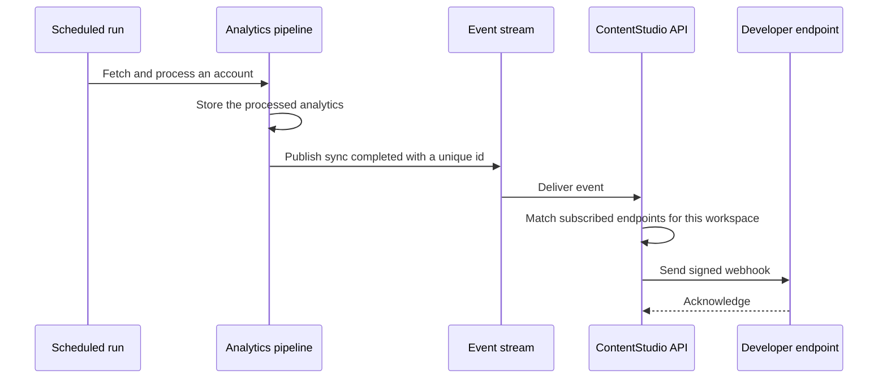

# Analytics Webhook Events — Epic & Stories

Date: August 4, 2026

---

## Epic

**Title:** Analytics Webhook Events

**Summary:** Emit outbound webhooks when analytics data refreshes and when reports finish, so external tools can pull fresh numbers at the right moment instead of polling.

**Description:**

ContentStudio's public API exposes analytics for every supported platform, but a developer building on it has no way to know when the numbers changed. Analytics is computed in batches on a schedule, so the data behind an endpoint can sit unchanged for hours and then move all at once. Without a signal, the only options are to poll and mostly get nothing, or to refresh on a timer and hope it lines up with our pipeline. Both waste the developer's time and our API credits.

This epic adds four events on the delivery engine already built for publishing webhooks. Two cover data freshness: `analytics.sync.completed` when an account's analytics finish processing, carrying the new data-through date, and `analytics.sync.failed` when a sync breaks. Two cover reports: `report.completed` when a scheduled or on-demand report finishes, carrying its download URL, and `report.failed` when generation fails.

Analytics is a different shape from the inbox and publishing. There is no moment when a metric happens, so the events describe the lifecycle of the data rather than the data itself. That is deliberately narrow: threshold and anomaly alerting needs user-defined rules and comparison state and is a separate product, not a webhook.

Endpoint management, signing, retries, delivery logs, and the test-event button are all reused unchanged. The work is producing the events. Most of it sits in the analytics pipeline, where scheduled runs currently finish without announcing themselves to anything.

Practically this closes the loop for anyone building on the analytics API: refresh a client dashboard the moment new numbers land, file a finished report to storage or a client portal automatically, and know when an account stopped reporting rather than discovering it in a stale chart.

---

## Stories

---

## Story 1 — [BE] Add analytics events and payloads to the webhook catalog

### Description:

As a developer building on the ContentStudio API, I want analytics and report events available in the webhook catalog, so that I can subscribe to them with the same endpoints, secrets, and delivery logs I already use for publishing events.

Four event types are added along with the payload each carries. Delivery, signing, retries, and logging are unchanged. Because both the settings UI and the catalog endpoint read from the event catalog, adding the types here is what makes them selectable everywhere else.

---

### Workflow:

1. Developer calls the webhook event types endpoint and sees the four new events listed with human-readable labels.
2. Developer creates or edits a webhook endpoint and subscribes to the analytics or report events they want.
3. Developer clicks Send test event for one of them and receives a correctly shaped, correctly signed sample payload.
4. When a real sync or report completes, the developer's endpoint receives the event with the same signature headers, retry behavior, and delivery-log entry as any publishing event.
5. Developer opens the delivery log and sees analytics deliveries listed alongside the rest, filterable and exportable in the same way.

---

### Acceptance criteria:

- [ ] The webhook event catalog includes `analytics.sync.completed`, `analytics.sync.failed`, `report.completed`, and `report.failed`
- [ ] Each new event has a human-readable label suitable for display in the settings UI
- [ ] An event arriving on the ingress topic with any of the four new types is accepted and fanned out rather than dead-lettered
- [ ] `analytics.sync.completed` payloads identify the workspace, the platform, the connected account, and the date the data is now current through
- [ ] `analytics.sync.failed` payloads identify the workspace, the platform, the connected account, and a reason the developer can act on, distinguishing at minimum an authorization failure from a processing failure
- [ ] `report.completed` payloads identify the workspace, the report, its type, and the download URL
- [ ] `report.failed` payloads identify the workspace, the report, its type, and the failure reason
- [ ] No payload contains platform access tokens, internal service URLs, or any workspace's data other than the subscribing one
- [ ] Send test event produces a valid sample payload for each of the four events without requiring a real sync or report run
- [ ] Analytics deliveries appear in the existing delivery log with the same fields, filtering, and CSV export as publishing deliveries
- [ ] Subscribing to an analytics event on one workspace never delivers another workspace's analytics activity

---

### Mock-ups:

N/A. No user-facing interface in this story.

---

### Impact on existing data:

No schema change. Existing webhook endpoints are unaffected, and an endpoint that has not subscribed to an analytics event sees no change in behavior.

---

### Impact on other products:

- **Public analytics API.** Developers will pair these events with the existing analytics endpoints, receiving an event and then fetching the numbers. Payloads should carry enough identifiers to make that follow-up call without guesswork.
- **Billing.** Each delivery draws on the shared API credit pool. Sync events fire per account per sync, which is a far lower volume than inbox events but still worth sizing against a workspace with many connected accounts.

---

### Dependencies:

- Depends on **[BE] Build the webhook event dispatch & delivery engine (with metering)**
- Depends on **[BE] Build webhook delivery-log & test-event APIs**
- Paired with **[BE] Publish analytics sync events from the analytics pipeline** and **[BE] Publish report lifecycle events when a report finishes or fails**, which produce the events this story defines

---

### Global quality & compliance (wherever applicable)

- [ ] Mobile responsiveness (frontend only, N/A for backend-only stories) — N/A, backend only
- [ ] Multilingual support (frontend + backend, translations available or fallback handled) — N/A, event names and payloads are API surface and stay in English
- [ ] UI theming support (default + white-label, design library components are being used) — N/A, no UI
- [ ] White-label domains impact review
- [ ] Cross-product impact assessment (web, mobile apps, Chrome extension)

---

### Implementation references

*Pointers from research — not a contract. Engineering may choose a different approach.*

**Primary entry points:**
- `contentstudio-backend/app/Data/Webhooks/Enums/WebhookEventType.php` — adding a case is what makes an event selectable in the UI and acceptable to the consumer
- `contentstudio-backend/app/Services/Webhooks/PostWebhookPayload.php` — the payload-builder pattern to mirror

**Existing behavior to preserve (no change needed):**
- Routing is resolved from current workspace membership and never from the envelope, so a producing service cannot influence who receives an event
- Deduplication is handled by the consumer on the envelope's event id
- Delivery, signing, retry, credit checks, and logging are all event-type agnostic

**Suggestion:**
- `analytics.sync.failed` is more useful if the reason is a small closed set the developer can branch on rather than a free-text string. Authorization failure versus processing failure is the minimum useful split, since only the first is something the customer can fix

---

## Story 2 — [BE] Publish analytics sync events from the analytics pipeline

### Description:

As a developer building on the analytics API, I want to be told when an account's analytics have refreshed, so that I can pull the new numbers at the moment they land instead of polling on a guess.

The analytics pipeline is the only place that knows when a sync finished or failed. This story has it publish those moments onto the webhook ingress topic the backend already consumes.

The larger part of this work is that **scheduled syncs currently finish without announcing themselves anywhere**. Only user-triggered syncs notify, because historically a user was watching. Webhooks invert that: the unattended overnight run is the one a developer most needs to hear about.

---

### Workflow:

1. An account's analytics are refreshed, either on the regular schedule or because a user pressed refresh.
2. ContentStudio processes and stores the data as it does today, and the dashboard updates exactly as before.
3. In the same moment, an event is published saying which account refreshed and what date the data is now current through.
4. Any workspace endpoint subscribed to that event receives a signed webhook within seconds.
5. If the sync fails instead, an event is published with the reason, whether or not anyone was watching at the time.
6. If no endpoint in the workspace subscribes, nothing is delivered and nothing is charged.

---

### Acceptance criteria:

- [ ] A completed **scheduled** analytics sync publishes `analytics.sync.completed`, carrying the platform, the account, and the date the data is current through
- [ ] A completed **user-triggered** analytics sync publishes the same event with the same payload shape
- [ ] A failed analytics sync publishes `analytics.sync.failed` with the platform, the account, and the reason
- [ ] Sync failures publish regardless of whether the sync was scheduled or user-triggered, so an unattended overnight failure is still delivered
- [ ] An expired or revoked platform token during a sync publishes `analytics.sync.failed` with a reason that distinguishes it from a processing failure
- [ ] Every published event carries a unique, stable id so a retried or duplicated publish is delivered to the customer only once
- [ ] Events are published for every platform whose analytics ContentStudio syncs, not only the platforms whose processors already notify today
- [ ] If publishing an event fails, the analytics data is still stored and the dashboard is unaffected
- [ ] Existing behavior is unchanged: the in-app sync indicator, the reconnect banner, and dashboard refresh all continue to work exactly as they do today
- [ ] A sync for an account in no active workspace publishes no event

---

### Mock-ups:

N/A. No user-facing interface in this story.

---

### Impact on existing data:

No schema change and no change to what is stored. This story adds an outbound publish alongside existing behavior.

The behavioral risk to watch is that the existing failure notification only fires for user-triggered syncs. Extending that to scheduled runs is the point of the story, but the in-app reconnect banner should keep its current behavior rather than starting to appear in new situations.

---

### Impact on other products:

- **Analytics dashboards.** No user-visible change. Sync, the in-app progress indicator, and the reconnect banner all behave as they do today.
- **Billing.** Publishing is free; delivery draws credits. Volume scales with connected accounts times sync frequency, which is modest compared with inbox events but should be sized for a workspace with many accounts.
- **Follow-up worth tracking separately.** An expired token breaks publishing as well as analytics, so an `account.disconnected` event in an accounts family would be more useful than surfacing it only under an analytics name. Out of scope here, worth its own epic.

---

### Dependencies:

- Depends on **[BE] Add analytics events and payloads to the webhook catalog**, which defines the event names this story publishes
- Depends on **[BE] Build the webhook event dispatch & delivery engine (with metering)**

---

### Global quality & compliance (wherever applicable)

- [ ] Mobile responsiveness (frontend only, N/A for backend-only stories) — N/A, backend only
- [ ] Multilingual support (frontend + backend, translations available or fallback handled) — N/A, no user-facing strings
- [ ] UI theming support (default + white-label, design library components are being used) — N/A, no UI
- [ ] White-label domains impact review
- [ ] Cross-product impact assessment (web, mobile apps, Chrome extension)

---

### Implementation references

*Pointers from research — not a contract. Engineering may choose a different approach.*

**Where the existing seam is:**
- `contentstudio-social-analytics-go/src/services/facebook/facebook-immediate-processor/processor/processor.go` around lines 530 to 595 — `sendPusherNotification` already emits a processed state with a data-through date, and `sendTokenExpiredNotification` emits a failure with an error type. The same shape repeats across nine platform immediate processors: Facebook, Instagram, LinkedIn, YouTube, TikTok, Pinterest, Meta Ads, Google Ads, Twitter

**Where the seam does not exist, and this is the bulk of the work:**
- The scheduled path runs fetcher, posts parser, analytics sink, then clickhouse sink, and none of those emit any notification today. `analytics.sync.completed` for scheduled runs needs a new emit point rather than a reuse

**Producer plumbing already available:**
- The pipeline already produces to Kafka in `src/cmd/jobs`, `src/cmd/api-server`, and several fetchers, so publishing to the ingress topic is existing capability

**The envelope the backend consumer expects:**
- An event id used as the deduplication key, the event type, the workspace id, an optional list of recipient user ids, and a data object. Sync events broadcast, so recipient user ids should be omitted
- The consumer never trusts the envelope for routing and resolves recipients from current membership

**Gotcha:**
- `sendTokenExpiredNotification` returns early unless the sync type is immediate, with the comment that this is the only time a user is watching. That reasoning is correct for an in-app banner and backwards for a webhook. The webhook publish must sit outside that gate, otherwise the highest-value failure event, an unattended overnight sync breaking, is the one case that never fires

---

## Story 3 — [BE] Publish report lifecycle events when a report finishes or fails

### Description:

As a developer or agency automating client reporting, I want a webhook when a report finishes generating, so that I can file it, forward it, or attach it somewhere automatically instead of watching for the email.

Reports already have a single point where every run resolves, for both scheduled and on-demand generation. This story publishes an event from that point.

---

### Workflow:

1. A report runs, either on its schedule or because a user generated one on demand.
2. When it finishes, the report becomes available to download exactly as it does today, and the existing in-app notification and email are unchanged.
3. In the same moment, an event is published carrying the report, its type, and the download URL.
4. Any workspace endpoint subscribed to that event receives a signed webhook within seconds.
5. If generation fails instead, an event is published with the failure reason.
6. If no endpoint in the workspace subscribes, nothing is delivered and nothing is charged.

---

### Acceptance criteria:

- [ ] A report that finishes generating publishes `report.completed` carrying the workspace, the report, its type, and the download URL
- [ ] A report that fails to generate publishes `report.failed` carrying the workspace, the report, its type, and the reason
- [ ] Both scheduled and on-demand reports publish events, with the payload indicating which kind it was
- [ ] Competitor reports publish through the same two events, distinguished by the report type in the payload rather than by separate event names
- [ ] A report run that resolves more than once publishes only one event, matching the existing behavior where a report already marked finished is not finalized twice
- [ ] The download URL in the payload is the same one the user would receive, and it works for the recipient without additional authentication steps beyond those already required
- [ ] If publishing an event fails, the report is still marked finished, still downloadable, and the existing notification and email still go out
- [ ] Existing behavior is unchanged: in-app notifications, report emails, and schedule run history all continue to work exactly as they do today

---

### Mock-ups:

N/A. No user-facing interface in this story.

---

### Impact on existing data:

No schema change. Report records, run history, and export URLs are unchanged. This story adds an outbound publish at an existing completion point.

---

### Impact on other products:

- **Reports.** No user-visible change. Generation, notification, email, and download all behave as they do today.
- **White-label.** Report download URLs are built from per-workspace white-label configuration, so the URL in a payload must be the correct branded one for that workspace rather than a default.

---

### Dependencies:

- Depends on **[BE] Add analytics events and payloads to the webhook catalog**, which defines the event names this story publishes
- Depends on **[BE] Build the webhook event dispatch & delivery engine (with metering)**

---

### Global quality & compliance (wherever applicable)

- [ ] Mobile responsiveness (frontend only, N/A for backend-only stories) — N/A, backend only
- [ ] Multilingual support (frontend + backend, translations available or fallback handled) — N/A, no user-facing strings
- [ ] UI theming support (default + white-label, design library components are being used) — N/A, no UI
- [ ] White-label domains impact review
- [ ] Cross-product impact assessment (web, mobile apps, Chrome extension)

---

### Implementation references

*Pointers from research — not a contract. Engineering may choose a different approach.*

**Primary entry point:**
- `contentstudio-backend/app/Services/Analytics/ReportCompletionService.php` — `succeed()` and `fail()` are where every report run resolves, for both scheduled and on-demand. Both already have workspace id, user id, report id, name, type, and for success the export URL, so the payload needs no extra lookups

**Existing behavior to preserve (no change needed):**
- `succeed()` already returns early when the report is finalized or already carries an export URL, which is what makes the one-event-per-run criterion achievable without new deduplication logic
- `markScheduleHistory()` and the existing notification and Pusher calls should keep firing exactly as they do

**Related context:**
- `contentstudio-backend/app/Models/Analytics/ReportRunHistory.php` tracks pending, running, success, failed, and emailed. This story emits on success and failure only. An emitted state exists but adds little for a developer who already received the completed event with the URL
- Report rendering itself runs in the Go reports service via `GoReportsClient`, but completion is recorded in Laravel, so Laravel is the right place to publish from

---

## Story 4 — [FE] Add analytics events to the webhook event picker

### Description:

As a ContentStudio user setting up a webhook, I want analytics and report events grouped in the event picker alongside the others, so that I can subscribe to data refreshes and finished reports without reading API documentation to work out what each event means.

---

### Workflow:

1. User goes to Settings and opens the API and Webhooks area, then the Webhooks tab.
2. User clicks to create a new webhook or edits an existing one.
3. In the Events section the user sees two additional groups: Analytics and Reports.
4. Each group has a Select all control and each event has a checkbox with a one-line description of when it fires.
5. User selects the events they want and saves the webhook.
6. User clicks Send test event, picks one of the analytics events, and confirms their endpoint receives a sample payload.

---

### Acceptance criteria:

- [ ] The Events section shows two new groups, Analytics and Reports, following the existing groups
- [ ] Each group has a Select all control that toggles every event in that group
- [ ] Each event renders as a `Checkbox` from `@contentstudio/ui` with its name and description
- [ ] Group labels and event descriptions use this exact copy:
  - **Analytics**
    - `analytics.sync.completed` — "Analytics data for a connected account finishes updating."
    - `analytics.sync.failed` — "Analytics data for a connected account fails to update, for example when the account needs reconnecting."
  - **Reports**
    - `report.completed` — "A report finishes generating and is ready to download."
    - `report.failed` — "A report fails to generate."
- [ ] A webhook saved with at least one analytics event selected persists that selection and shows it again when reopened
- [ ] The event list is driven by the event catalog returned from the server, so an event added on the backend appears without a frontend change
- [ ] If the catalog fails to load, the Events section shows: "We could not load the event list. Please refresh the page and try again."
- [ ] While the catalog is loading, the Events section shows a skeleton placeholder rather than an empty area
- [ ] Send test event offers the analytics events in its event selector
- [ ] All labels, descriptions, and messages in this story go through i18n and exist in every supported locale
- [ ] When a user saves a webhook with at least one analytics event selected, the existing `webhook_created` Usermaven event fires with `{ event_count, events }`, with no new event name introduced

---

### Mock-ups:

Covered by **[Design] Design the inbox event groups in the webhook event picker**, which establishes the grouped picker pattern. This story adds two groups to it and needs no separate design work.

---

### Impact on existing data:

None. Event subscriptions are stored on the webhook endpoint record in the existing shape, and endpoints saved before this story keep their selections untouched.

---

### Impact on other products:

- **Mobile apps and Chrome extension.** Not affected. Webhook management is a web settings surface only.
- **White-label.** The Webhooks tab follows existing settings theming, so the new groups inherit it as long as design system components are used.

---

### Dependencies:

- Blocked by **[FE] Build the Webhooks tab (manage webhooks + per-webhook delivery logs)**, which does not exist yet. There is no webhook UI in the frontend today
- Blocked by **[FE] Restructure the API page into `API` and `Webhooks` tabs with a usage readout**
- Depends on **[BE] Add analytics events and payloads to the webhook catalog** for the events to appear in the catalog
- Pattern established by **[FE] Add inbox events to the webhook event picker** and **[Design] Design the inbox event groups in the webhook event picker**. If those land first, this story is a small addition to an existing grouped picker rather than new work

---

### Global quality & compliance (wherever applicable)

- [ ] Mobile responsiveness (frontend only, N/A for backend-only stories)
- [ ] Multilingual support (frontend + backend, translations available or fallback handled)
- [ ] UI theming support (default + white-label, design library components are being used)
- [ ] White-label domains impact review
- [ ] Cross-product impact assessment (web, mobile apps, Chrome extension)

---

### Implementation references

*Pointers from research — not a contract. Engineering may choose a different approach.*

**Component notes:**
- `Checkbox` is available in `@contentstudio/ui` and should be used directly
- **Component gap carried over from the inbox story:** the library has no standalone tooltip and no accordion or collapsible section. With analytics added, the picker reaches nine groups' worth of events, which makes collapsible groups more likely to be wanted. If the design calls for them, that gap needs raising before this story starts

**Existing patterns:**
- Render from the server's event-type catalog rather than a hardcoded frontend list, so backend additions need no frontend release
- Reuse the grouping and Select all behavior from the existing groups rather than introducing a second pattern
