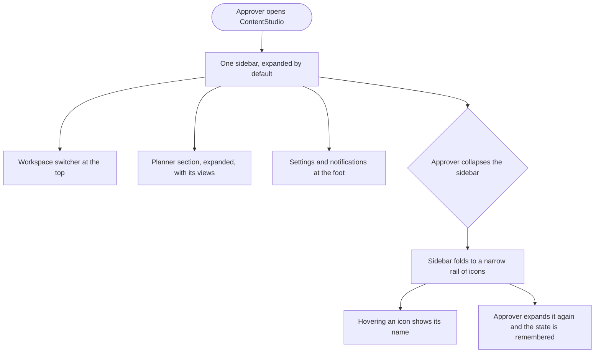

# Story: Merge the approver's navigation into one sidebar

**Date:** 2026-09-14
**Stories:** 1

---

## Story 1

### Title

**[FE] Merge the module rail and the sidebar when a user can reach only one module**

### Description

As an approver, I want one sidebar instead of three stacked navigation panels, so that the left of the screen looks like a considered part of the product rather than a set of mostly empty columns.

An approver can reach one module, Publisher, and one section inside it, Planner. That currently arrives as three levels: a narrow module rail holding a single icon, a sidebar holding a single "Publisher" item, and then the Planner section that actually does the work. Two of those three levels offer no choice at all, and together they take up roughly the same width as a full sidebar while looking empty.

This merges them into one sidebar. Nothing is taken away: the same links, the same custom view action, the same settings and notifications. The two levels that disappear are the ones that never gave the user anything to decide.

**The rule is about how many modules a user can reach, not about which role they hold.** A module rail exists to let someone choose between modules. With only one to choose from it is decoration, and the sidebar that names that single module is repeating what the rail already said. So the behaviour is: **when a user can reach exactly one module, there is no rail and no module-name item, and that module's own navigation becomes the sidebar.**

Written that way it covers whoever ends up in that position rather than only today's approvers, and it does not need revisiting when roles or permissions change. Approvers are the case we know about and the one that must be verified. The **client** role may land in the same state and should be checked during build: if it does, it is covered automatically, and if it does not, nothing about it changes.

---

### Workflow

1. An approver signs in and sees a single sidebar on the left, expanded.
2. At the top is the workspace switcher, showing the current workspace's logo and name.
3. Below it is the **Planner** section, expanded by default, with its add control and its views: All Posts, My Approval Requests, My Pending Approvals and New comments.
4. Beneath those is **New Custom View** with its help icon.
5. At the foot are Settings and the notification counters.
6. The approver selects a view and the content area changes, exactly as it does now.
7. The approver collapses the sidebar. It folds to a narrow rail: the workspace logo at the top, the Planner icon in the middle, and the notification counters and their profile picture at the foot.
8. Hovering any icon in the collapsed rail shows its name, so nothing becomes a guess.
9. To expand it again the approver clicks anywhere on the rail that is not an icon. The cursor tells them that is what will happen.
10. The choice is remembered next time they sign in.

---

### Acceptance criteria

**The merged sidebar**

- [ ] A user who can reach exactly one module sees **one** navigation sidebar, not a module rail plus a sidebar plus a section panel
- [ ] The behaviour is driven by **how many modules the user can reach**, not by their role name, so it applies to anyone in that position without naming them
- [ ] **Verified for an approver**, who is the case this came from
- [ ] **Checked for the client role.** If a client also reaches only one module they get the same merged sidebar with no extra work. If they reach more than one, their navigation is unchanged
- [ ] If a user's access changes so that a second module becomes reachable, the module rail returns and their navigation behaves as it does for everyone else
- [ ] Where the single module has more than one section, every section still appears in the merged sidebar, each collapsible as it is today
- [ ] The sidebar is expanded by default
- [ ] The order from top to bottom is: workspace switcher, the Planner section, then settings and notifications pinned at the foot
- [ ] The workspace switcher shows the workspace logo and name and still opens the workspace list
- [ ] The Planner section is expanded by default and can still be collapsed and expanded, behaving exactly as it does today
- [ ] The Planner section keeps its add control, and using it does not fold the section
- [ ] All four views are present and unchanged: All Posts, My Approval Requests, My Pending Approvals, New comments
- [ ] The currently selected view is clearly marked, as it is today
- [ ] **New Custom View** and its help icon are present and work as they do today
- [ ] Settings and both notification counters sit at the foot, with their counts
- [ ] The single module's name is not shown as a navigation item, because it offers no choice and leads to the only place it could lead. For an approver that means the **Publisher** item is gone
- [ ] No navigation an approver has today is lost

**Collapsing**

- [ ] The sidebar is collapsed from a single control in its header
- [ ] Collapsed, it shows the workspace logo at the top, the Planner icon in the body, and the notification counters and the profile picture stacked at the foot
- [ ] **There is no separate settings icon in the collapsed rail.** The profile picture is the route to settings, as it is when expanded
- [ ] **There is no expand button.** Clicking anywhere on the rail that is not an icon expands it
- [ ] The cursor over that clickable area indicates the sidebar will expand
- [ ] Clicking an icon does what that icon does and does **not** also expand the sidebar
- [ ] Collapsing the sidebar leaves it collapsed. It must not fold and immediately reopen, which is the natural failure when the same click that collapses it is also treated as a click on the collapsed rail
- [ ] Neither the rail nor anything inside it scrolls horizontally at any window size
- [ ] Hovering any icon in the collapsed rail shows that item's name, and the label is not clipped by the edge of the rail
- [ ] The selected view is still indicated on the Planner icon when collapsed
- [ ] Notification counts remain visible on their icons when collapsed
- [ ] The collapsed or expanded choice is remembered for that user between sessions, matching how the sidebar behaves elsewhere in the product
- [ ] Collapsing and expanding does not change which view is open or reload the content area

**Everything else stays put**

- [ ] The content area to the right is unchanged, including its filters, accounts and labels controls and the posts list
- [ ] The width the sidebar takes is close enough to today's three panels that the posts list is no less usable than it is now
- [ ] Approvers who have been granted extra permissions, such as creating or editing posts, still see everything they are entitled to
- [ ] **Anyone who can reach more than one module keeps the module rail exactly as it is.** This story changes nothing for them
- [ ] The sidebar is usable at laptop widths without the content area becoming cramped
- [ ] Keyboard users can reach every item in both the expanded and collapsed states, and the collapse control is reachable and clearly labelled

---

### UI copy

**Workspace switcher**

> The workspace name, as today. No new copy.

**Section header**

> Planner

**Views**

> All Posts
> My Approval Requests
> My Pending Approvals
> New comments

**Custom view action**

> **Label:** New Custom View
> **Help icon:** the existing help content, unchanged

**Foot**

> **Label:** Settings
> Notification counters carry their counts, as today.

**Collapsed rail hover labels**

> The workspace name, "Planner", "Approvals", "Notifications", "Settings"

**Collapse control**

> **Expanded, tooltip:** Collapse sidebar
> **Collapsed:** no control. The rail itself expands on click, with a hover title of "Expand sidebar".

**Empty, loading and error states**

> None are introduced. The sidebar shows the same items for every approver, so there is no empty variant. Notification counts follow their existing loading behaviour.

**Component notes**

> No new component is needed. This is an arrangement change using the sidebar, section, list item and icon-button treatments the product already has, plus the hover labels the module rail already uses on its icons.

---

### Mock-ups

**Interactive mockup:** https://claude.ai/code/artifact/70e2506b-64ce-44c4-b388-81185b6221f7

Shows today's three panels beside the merged sidebar. In the proposed one, the Planner section collapses, and the sidebar itself collapses to the rail. Once collapsed, clicking any empty part of the rail expands it again, which is the behaviour to build rather than a dedicated expand control.

---

### Impact on existing data

None. Nothing is stored beyond the user's collapsed or expanded preference, which follows the same behaviour the sidebar already has elsewhere.

---

### Impact on other products

- **Anyone with more than one module:** unchanged. The module rail stays exactly as it is today.
- **The client role:** possibly in scope, depending on how many modules a client can reach. Worth confirming during build. If a client reaches only one module they are covered by the same rule with no extra work.
- **Mobile app:** no impact, its navigation is separate.
- **Chrome extension:** no impact.
- **White label:** the workspace logo and the theme colours in the sidebar follow the existing white-label rules and should be checked on a non-default primary colour.

---

### Dependencies

None.

---

### Global quality & compliance (wherever applicable)

- [ ] Mobile responsiveness (frontend only, N/A for backend-only stories)
- [ ] Multilingual support (frontend + backend, translations available or fallback handled)
- [ ] UI theming support (default + white-label, design library components are being used)
- [ ] White-label domains impact review
- [ ] Cross-product impact assessment (web, mobile apps, Chrome extension)
