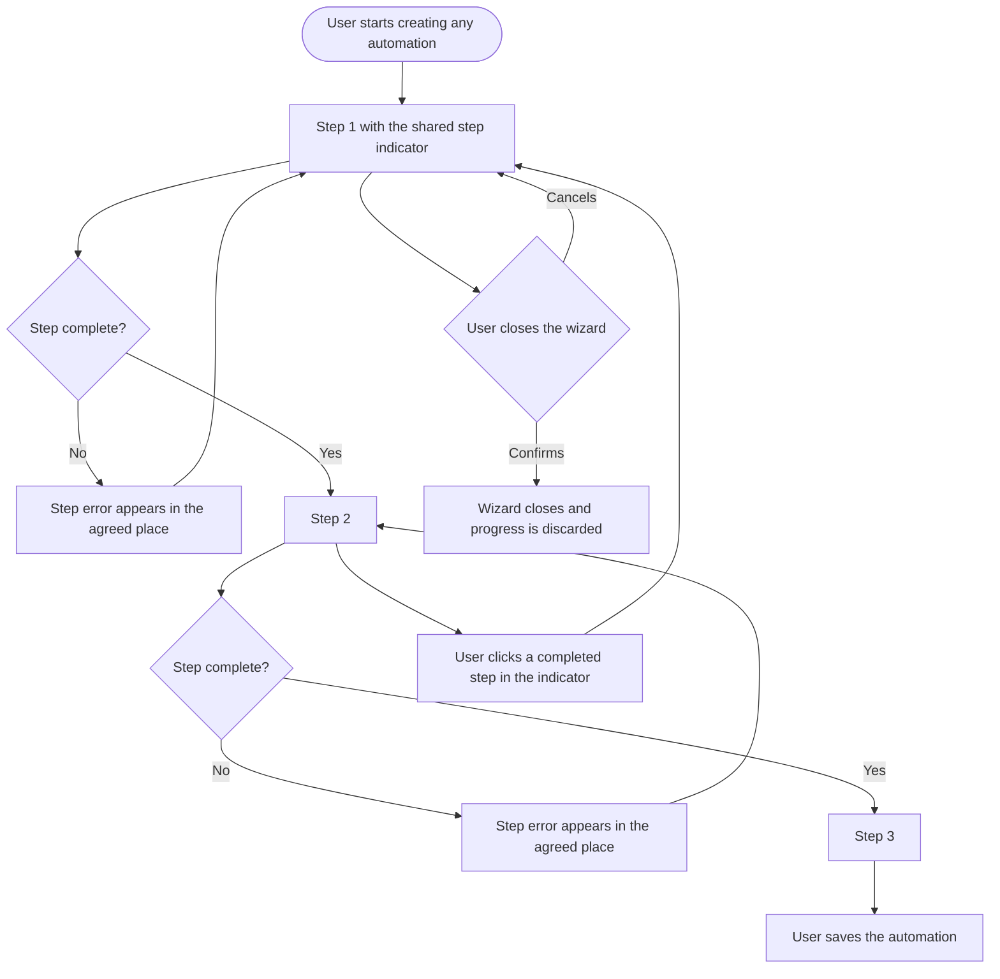

# Stories: Finalize the Automations wizard UI

Three automation create flows (RSS Auto-Post, Bulk Schedule CSV, Evergreen / Recycle) are all three-step wizards, and all three look and behave slightly differently. Two share the app's step indicator; the third hand-rolls its own with a different hardcoded colour per step, which also means it cannot follow a white-label customer's brand colour. Step state, step visibility, validation feedback, clickable-step rules and exit confirmation are each done three different ways.

Two stories: a design pass that settles the standard, and a frontend pass that applies it to all three flows.

| # | Title |
|---|---|
| 1 | `[Design]` Define the Automations wizard standard across all three create flows |
| 2 | `[FE]` Apply the Automations wizard standard to the RSS, Bulk CSV and Evergreen flows |

---
---

# 1. [Design] Define the Automations wizard standard across all three create flows

### Description

Setting up an RSS automation, a bulk CSV schedule and an Evergreen campaign are three versions of the same task, and today they look like three products. The step header is different, the progress colours are different, error feedback lands in different places, and it is not consistently clear which step a user can jump back to. This story defines one wizard standard the three flows share, so a user who has set up one automation already knows how to set up the next.

### Workflow

N/A. Design deliverable.

### Acceptance criteria

- [ ] All three create flows are reviewed side by side and the inconsistencies are listed explicitly, not just implied by the mockups.
- [ ] One step-indicator treatment is specified for all three flows, including active, completed, upcoming and disabled step states.
- [ ] Step colours are specified using theme tokens only. No step gets its own fixed colour.
- [ ] The wizard header is specified: title, step indicator placement, and the close or exit affordance.
- [ ] Step labels are specified for each of the three flows, with a consistent naming style across them.
- [ ] Rules for which steps are clickable are specified: whether a user can jump forward, jump back, or only move one step at a time, and how a non-clickable step looks.
- [ ] Footer navigation is specified: back, next and save button placement, labels, and which is the primary action at each step.
- [ ] Validation feedback is specified: where a step-level error appears when a user tries to advance with something missing, and how a field-level error appears within a step.
- [ ] Loading, empty and error states within a step are specified, including what a step looks like while it waits on something.
- [ ] Exit-confirmation behaviour is specified and is the same in all three flows, including the dialog copy pattern with the flow name as a variable.
- [ ] The design accounts for Evergreen having more sub-steps than the other two, so the standard does not assume exactly three simple steps.
- [ ] Responsive behaviour is specified down to the smallest supported width, including how the step indicator behaves when three labels no longer fit.
- [ ] The design names the existing design-library components to reuse and explicitly flags anything not available as a component gap.
- [ ] The design changes no automation's step order, fields or behaviour. Anything that looks functionally wrong is raised as a separate finding rather than redesigned here.

### Mock-ups

This story produces them.

### Impact on existing data

None.

### Impact on other products

- Web app only. Automation create flows are not in the mobile apps or the Chrome extension.
- White-label domains render these flows, which is the main reason the per-step fixed colours have to go.

### Dependencies

- Should be coordinated with **[FE] Reuse composer EditorBox + MediaBox in Evergreen/Recycle automation**, which changes what sits inside the Evergreen steps while this changes the chrome around them.

### Global quality and compliance checklist

- [ ] Mobile responsiveness tested (frontend only, N/A for backend-only stories)
- [ ] Multilingual support verified (frontend + backend, translations available or fallback handled) — step labels must survive longer translated strings without wrapping into a broken indicator
- [ ] UI theming supported (default + white-label, design library components are being used)
- [ ] White-label domains impact reviewed
- [ ] Cross-product impact assessed (web, mobile apps, Chrome extension)

### Implementation references

*Pointers from research — not a contract. Engineering may choose a different approach.*

- The shared component already exists: `contentstudio-frontend/src/components/common/StepIndicator.vue`, with `getStepColorClass`, `getStepBorderClass` and `getStepBackgroundClass` driving its states off a `steps` array. RSS (`SaveRSSAutomation.vue:73`) and Bulk CSV (`BulkUploadAutomationSave.vue:233`) already use it, so designing to it means two of the three flows are already close.
- The outlier is `components/evergreen/create/TabsContent.vue`, which hand-rolls the header with `#7272FF` for step 1, `#4CCE88` for step 2, `#FF9472` for step 3, `#EAF0F6` inactive borders and `#4A4A4A` inactive text. Those are the colours the design has to replace with tokens.
- Evergreen's real shape is larger than three steps: `EvergreenAccountSelection`, `AddEvergreenPost`, `EvergreenBulk`, `EvergreenOptimization`, `EvergreenFinalization`, plus `URLVariationModal` and three removal-confirmation dialogs. Worth walking that flow first, since a standard defined only against RSS will not fit it.
- RSS's exit confirmation currently passes a literal flow name at the call site (`' RSS Auto-Post'`, with a stray leading space). If the standard specifies a shared dialog, that string becomes a translated variable.

---
---

# 2. [FE] Apply the Automations wizard standard to the RSS, Bulk CSV and Evergreen flows

### Description

Users setting up their second automation currently have to relearn the interface, because the three create flows differ in their step header, their progress colours, where errors appear and whether they can click back to an earlier step. This story applies one standard across all three so the flows behave the same, and removes the fixed per-step colours that stop the Evergreen wizard from following a white-label customer's brand colour.

Behaviour of the automations themselves does not change. Same steps, same fields, same outcomes.

### Workflow

1. User starts creating an RSS automation. The step indicator at the top matches the one they have seen elsewhere in the app.
2. They fill step one and click next. If something required is missing, the error appears in the same place it appears in every other automation flow.
3. They move through the steps. Completed steps are visibly completed and clickable; upcoming steps are visibly not yet available.
4. They click a completed step in the indicator and are taken back to it with their input intact.
5. They finish and save.
6. They then create a Bulk CSV automation and an Evergreen campaign. Both look and behave the same way, with the same button placement, the same error handling and the same exit confirmation.
7. On a white-label domain, the wizard's step colours follow the customer's brand colour rather than fixed purple, green and orange.

### Acceptance criteria

- [ ] All three create flows use the shared step indicator. No flow renders its own.
- [ ] No brandable colour is hardcoded anywhere in the wizard chrome of any of the three flows.
- [ ] On a white-label domain, the step indicator follows the customer's primary colour in all three flows.
- [ ] Active, completed, upcoming and disabled step states render identically across the three flows.
- [ ] Step labels follow the agreed naming style in all three flows.
- [ ] Which steps are clickable follows the agreed rule, consistently in all three flows, and non-clickable steps are visibly not clickable rather than silently inert.
- [ ] Clicking back to a completed step preserves everything the user has already entered in every step.
- [ ] Back, next and save buttons sit in the same place with the same labels and the same primary-action emphasis in all three flows.
- [ ] The next or save action is disabled while a save is in progress, so a double click cannot submit twice.
- [ ] A step-level validation error appears in the agreed place with the agreed treatment in all three flows.
- [ ] Field-level validation errors within a step follow the agreed treatment in all three flows.
- [ ] Loading, empty and error states within steps follow the agreed treatment.
- [ ] Closing the wizard mid-flow shows the same exit confirmation in all three flows, with the flow name coming from a translated string rather than a literal at the call site.
- [ ] Confirming the exit discards progress and returns the user to the relevant automation listing; cancelling returns them to the step they were on.
- [ ] All three flows work down to the smallest supported width, with the agreed step-indicator behaviour when labels no longer fit. No horizontal page scroll.
- [ ] Every wizard string is translated and present in every locale directory.
- [ ] No automation's step order, fields or saved output changes. Creating each of the three automation types still produces the same result as before.
- [ ] Evergreen's additional sub-steps still work: account selection, adding posts, bulk, optimization and finalization, plus the URL variation modal and the removal confirmations.

### UI copy

Final strings come from the approved design. These are the ones this story standardises:

**Footer navigation**
- Back: `Back`
- Next: `Next`
- Final step primary action: `Save automation`
- While saving: `Saving...`

**Step-level validation error**
- `Please complete this step before continuing.`

**Exit confirmation dialog**
- Title: `Leave without saving?`
- Body: `Your {automationName} setup won't be saved. You can start again at any time.`
- Primary button: `Leave`
- Secondary button: `Keep editing`

`{automationName}` resolves to the translated flow name (RSS Auto-Post, Bulk Schedule, Evergreen). No leading or trailing spaces baked into the value.

All strings go through translation and land in every locale directory in the same change. Note the deliberate absence of em dashes.

### Mock-ups

Provided by **[Design] Define the Automations wizard standard across all three create flows**.

### Impact on existing data

None. No change to stored automations. An automation created before this change behaves identically after it.

### Impact on other products

- Web app only.
- White-label domains: this is the story that makes the Evergreen wizard theme correctly.

### Dependencies

- Depends on **[Design] Define the Automations wizard standard across all three create flows**.
- Overlaps with **[FE] Reuse composer EditorBox + MediaBox in Evergreen/Recycle automation**, which rewrites content inside the Evergreen steps. Whichever ships second must not revert the other's changes. Doing the chrome first is likely the lower-conflict order.
- Independent of **[FE] Add empty state UI for Evergreen/Recycle Automation listing** and the other listing empty-state stories, which touch the listings rather than the wizards.

### Global quality and compliance checklist

- [ ] Mobile responsiveness tested (frontend only, N/A for backend-only stories)
- [ ] Multilingual support verified (frontend + backend, translations available or fallback handled)
- [ ] UI theming supported (default + white-label, design library components are being used)
- [ ] White-label domains impact reviewed
- [ ] Cross-product impact assessed (web, mobile apps, Chrome extension)

### Implementation references

*Pointers from research — not a contract. Engineering may choose a different approach.*

- Adopt `contentstudio-frontend/src/components/common/StepIndicator.vue` in Evergreen. RSS (`components/rss/SaveRSSAutomation.vue:73`) and Bulk CSV (`components/csv/BulkUploadAutomationSave.vue:233`) already render it with `:steps="stepIndicatorSteps"` and `@step-click="handleStepClick"`, so Evergreen needs an equivalent `stepIndicatorSteps` shape and a `handleStepClick`.
- The colours to remove live in `components/evergreen/create/TabsContent.vue`: `#7272FF`, `#4CCE88`, `#FF9472`, `#EAF0F6`, `#4A4A4A`. That file also mixes Tailwind important-overrides with the hex values, so it is the file most likely to need rewriting rather than patching.
- Step state is represented three ways today: `getRssAutomationTabStatus.first` style booleans in RSS, `getCsvAutomationTabStatus.first` in CSV, and an `activeTab` string of `'first' | 'second' | 'third'` in Evergreen (`EvergreenMain.vue`, `TabsContent.vue`). Converging on one representation is optional for this story but would make the shared indicator simpler to feed.
- Step visibility also differs: RSS uses `v-show`, CSV uses a `hidden` class binding, Evergreen switches on `activeTab`. These have different mount behaviour, so if the team converges them, check that no step relies on staying mounted while hidden.
- Evergreen already has explicit per-step validation entry points (`isValidStep`, `processStepFirst`, `processStepSecond`, `processStepThird` in `EvergreenMain.vue`), which is the cleanest of the three and a reasonable model for the others.
- The `automation` module has no module-level `CLAUDE.md` and contains some of the repo's largest files. Per the repo's own guidance, keep the change scoped to the wizard chrome rather than turning it into a full typing or decomposition pass.
