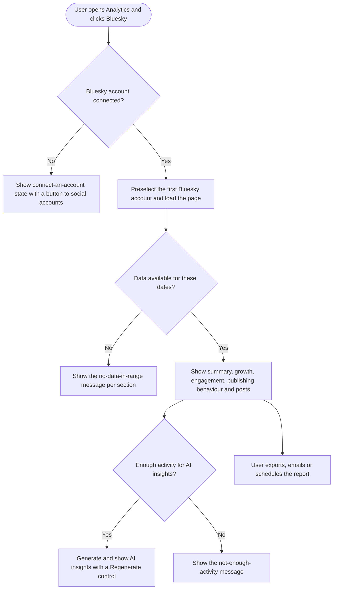
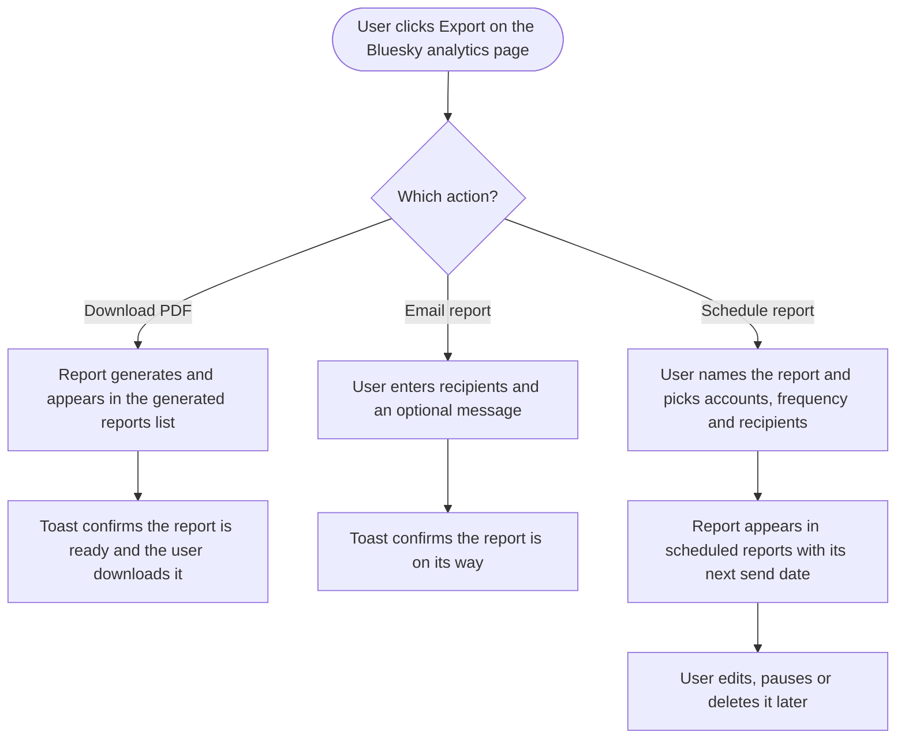

# Bluesky analytics integration — Stories

Three stories that surface the Bluesky analytics integration the dev team has already built: Bluesky in Overview analytics, a dedicated Bluesky analytics page with AI insights, and Bluesky in report creation and management.

## Scope

- A user who has connected a Bluesky account can see that account's analytics wherever they already see analytics for their other networks.
- Bluesky sits alongside the existing networks in Overview, gets its own dedicated analytics page, and can be exported, emailed, and scheduled as a report.
- Metrics Bluesky does not provide are labelled as unavailable, never shown as zero.

## Rules

- All three stories are frontend work. They assume the analytics API already returns Bluesky data for every section referenced. Any section that does not is a companion `[BE]` story and blocks the FE story that needs it.
- Bluesky's platform colour and icon stay literal platform constants. Everything themeable uses the `primary-cs-*` classes so white-label domains are unaffected.
- No new Usermaven events. Selecting an account, switching a tab, and adding a platform to an existing export flow are not new trackable actions.

## Sequencing

**[FE] Build the dedicated Bluesky analytics page with AI insights** first, because it establishes the Bluesky metric set, the unsupported-metric messaging, and the platform label and icon that the other two reuse. **[FE] Add Bluesky to Overview analytics** and **[FE] Add Bluesky to analytics report creation and management** can then run in parallel.

## Not in this batch

Campaign and Label analytics for Bluesky, public analytics API coverage, competitor analytics, mobile, and the `[Design]` companion story that a batch of frontend work normally carries.

---
---

# [FE] Add Bluesky to Overview analytics

### Description:

As a social media manager with a connected Bluesky account, I want my Bluesky performance included in Overview analytics so that I can see how Bluesky compares to my other networks without leaving the page I already start my day on.

Bluesky currently does not appear anywhere in Overview. A user who connected a Bluesky account and has been publishing to it sees an Overview that silently excludes it, which makes the totals wrong from their point of view.

This story adds Bluesky to every part of Overview that already lists networks: the account selector, the platform filter, the summary cards, the platform breakdown charts, the publishing behaviour section, and the top posts section. Because Bluesky does not report impressions, reach, or profile visits, cards built on those metrics must say so instead of counting Bluesky as zero.

**UI copy**

Platform filter tab:
- Label: `Bluesky`
- Tooltip on hover: `Show only your Bluesky accounts in the numbers below.`

Account selector:
- Bluesky accounts appear in the same grouped list as the other networks, under the group heading `Bluesky`, each row showing the account avatar, display name, and handle.
- Long handles truncate with an ellipsis and show the full handle on hover.

Platform breakdown charts:
- Legend and row label: `Bluesky`
- Row tooltip: `Likes, reposts, replies and quotes on your Bluesky posts for the selected dates.`

Summary cards that Bluesky cannot contribute to (impressions, reach, profile visits, and any card built on them):
- Info icon next to the card value, tooltip: `Bluesky does not share impressions or reach data, so your Bluesky accounts are not counted in this card. Your Bluesky likes, reposts, replies and quotes are included in the engagement numbers.`
- The card value itself never changes when a Bluesky account is added to the selection.

Publishing behaviour section:
- Bluesky posts counted the same as any other network, labelled `Bluesky` in the legend.

Top posts section:
- Bluesky posts appear with the `Bluesky` network badge, ranked by total engagement, deep-linking to the post on Bluesky in a new tab.

Empty state when the workspace has no Bluesky account connected:
- Bluesky does not appear at all. No tab, no legend entry, no empty row. Nothing changes for these users.

Empty state when a Bluesky account is selected but has no posts in the date range:
- Bluesky row shows `No Bluesky posts in this date range` in the breakdown table rather than a zero row.

Loading state:
- Bluesky uses the same skeleton loaders as the other networks, per card and per chart, so a slow Bluesky response never blocks the rest of Overview from rendering.

Error state when Bluesky data fails to load while other networks succeed:
- Inline notice inside the affected card or chart: `We could not load your Bluesky data. Try refreshing the page.` with a `Retry` text button. Other networks stay visible and usable.

---

### Workflow:

1. User navigates to Analytics, then Overview.
2. User opens the account selector and sees their Bluesky accounts listed under a Bluesky group, alongside Facebook, Instagram, LinkedIn, X, and their other connected networks.
3. User selects one or more Bluesky accounts and picks a date range.
4. User sees engagement totals rise to include Bluesky likes, reposts, replies, and quotes.
5. User hovers the info icon on the impressions card and reads that Bluesky does not share impressions data, so it is not counted there.
6. User scrolls to the platform breakdown and sees a Bluesky row with its own colour, sitting alongside the other networks.
7. User clicks the Bluesky filter tab and the whole page narrows to Bluesky accounts only.
8. User scrolls to top posts and sees their best performing Bluesky posts ranked with the rest, and clicks one to open it on Bluesky.

---

### Acceptance criteria:

- [ ] Bluesky accounts appear in the Overview account selector, grouped under `Bluesky`, with avatar, display name, and handle
- [ ] A `Bluesky` platform filter tab appears when the workspace has at least one connected Bluesky account
- [ ] Nothing Bluesky related appears anywhere in Overview when the workspace has no Bluesky account connected
- [ ] Engagement totals include Bluesky likes, reposts, replies, and quotes for the selected accounts and dates
- [ ] Impressions, reach, and profile visit cards are unchanged when a Bluesky account is added to the selection, and each shows the unsupported-metric tooltip
- [ ] Platform breakdown charts show Bluesky as its own row with the Bluesky platform colour and icon
- [ ] Publishing behaviour charts include Bluesky posts
- [ ] Bluesky posts appear in top posts, ranked by total engagement, with a Bluesky badge and a working link to the post on Bluesky
- [ ] Selecting a Bluesky account with no posts in the date range shows `No Bluesky posts in this date range` instead of a zero row
- [ ] A Bluesky data failure shows the inline retry notice in the affected card or chart only, and the rest of Overview still renders
- [ ] Bluesky sections use the same skeleton loading pattern as the other networks
- [ ] A long Bluesky handle truncates with an ellipsis and reveals in full on hover, in both the selector and the breakdown
- [ ] Bluesky's platform colour is a fixed platform constant and does not change on a white-label domain whose primary colour is also blue
- [ ] All new labels and tooltips go through i18n translations with no hardcoded strings
- [ ] No hardcoded colour classes for themeable elements, `primary-cs-*` classes used throughout

---

### Mock-ups:

N/A. Bluesky follows the existing pattern for how every other network appears in Overview: same selector grouping, same tab, same breakdown row, same top posts card.

---

### Impact on existing data:

None. Display only. No schema change, no migration, no backfill triggered by this story. Existing Overview numbers change only in the sense that a user who selects a Bluesky account now sees Bluesky engagement counted, which is the intent.

---

### Impact on other products:

- **Mobile apps:** No change in this story. If the Flutter app surfaces Overview analytics, decide separately whether Bluesky needs to appear there too.
- **Chrome extension:** No impact.
- **White-label:** Bluesky's platform colour must stay a platform constant. Every other new element uses theme-aware classes so a white-label domain with a custom primary colour renders correctly.

---

### Dependencies:

- Depends on the Overview analytics endpoints returning Bluesky data for summary, platform breakdown, publishing behaviour, and top posts. If any of those does not yet include Bluesky, a companion `[BE]` story is required first.
- Reuses the platform label, icon, colour, and unsupported-metric messaging established in **[FE] Build the dedicated Bluesky analytics page with AI insights**. Best sequenced after it.

---

### Global quality & compliance (wherever applicable)

- [ ] Mobile responsiveness (frontend only, N/A for backend-only stories)
- [ ] Multilingual support (frontend + backend, translations available or fallback handled)
- [ ] UI theming support (default + white-label, design library components are being used)
- [ ] White-label domains impact review
- [ ] Cross-product impact assessment (web, mobile apps, Chrome extension)

---
---

# [FE] Build the dedicated Bluesky analytics page with AI insights

### Description:

As a social media manager, I want a dedicated Bluesky analytics page so that I can study one Bluesky account in depth, understand what is working, and read AI insights that tell me what to do next, the same way I can for my other networks.

Every other supported network has its own analytics page reached from the Analytics section. Bluesky has none, so the only way to judge Bluesky performance today is to open the Bluesky app. This story adds that page: account picker, date range, summary of the key numbers, follower growth over time, engagement over time, posting behaviour, best and worst performing posts, and an AI insights section.

Bluesky reports public engagement counts and follower numbers, and nothing about delivery. The page must be honest about that: sections that would need impressions, reach, profile visits, clicks, or audience demographics are not built as empty shells, they are simply not on the page, and a short note explains why so users do not assume the page is broken or unfinished.

**Page structure**

1. Header with the account picker, date range picker, and Export button
2. Summary cards
3. Audience growth
4. Engagement over time
5. Publishing behaviour
6. Top and least performing posts
7. AI insights

**UI copy**

Navigation entry:
- Label in the Analytics section: `Bluesky`

Page header:
- Page title: `Bluesky analytics`
- Account picker placeholder: `Select a Bluesky account`
- Account picker helper text when more than one account is connected: `Pick the account you want to analyse. Switch any time.`
- Date range picker: existing shared component and its existing presets, no change

Summary cards, each with the value, the change against the previous period, and an info tooltip:
- `Followers`, tooltip: `How many accounts follow you on Bluesky right now, and how that changed over the dates you picked.`
- `Posts published`, tooltip: `How many posts you published on Bluesky in this date range, including posts made outside ContentStudio.`
- `Likes`, tooltip: `Total likes across the posts you published in this date range.`
- `Reposts`, tooltip: `Total reposts across the posts you published in this date range. A repost is when someone shares your post to their own followers.`
- `Replies`, tooltip: `Total replies people left on the posts you published in this date range.`
- `Quotes`, tooltip: `Total quote posts. A quote post is when someone shares your post and adds their own comment on top.`
- `Total engagement`, tooltip: `Likes, reposts, replies and quotes added together. Example: 40 likes, 5 reposts, 3 replies and 2 quotes is 50 total engagement.`
- `Engagement rate`, tooltip: `Total engagement divided by your follower count, shown as a percentage. It tells you how much of your audience reacted, not just how many people did.`

Note under the summary cards explaining the missing metrics:
- `Bluesky does not share impressions, reach, profile visits, clicks or audience demographics with any tool, so those sections are not available here. Everything Bluesky does share is on this page.`

Audience growth section:
- Section title: `Audience growth`
- Subtext: `How your Bluesky follower count moved over the dates you picked.`
- Chart: follower count over time, with net change for the period shown above the chart
- Empty state: `Not enough follower history yet. Come back in a few days and your growth will start showing here.`

Engagement over time section:
- Section title: `Engagement over time`
- Subtext: `Likes, reposts, replies and quotes on the posts you published, day by day.`
- Chart: stacked series per engagement type, with a legend that can toggle each type on and off

Publishing behaviour section:
- Section title: `Publishing behaviour`
- Subtext: `When you posted, and how much engagement those posts earned. Use it to find the days and times your audience responds best.`
- Chart: posts published per day alongside engagement earned

Top and least performing posts section:
- Section title: `Your posts`
- Two tabs, using the `SegmentedControl` component: `Top performing` and `Least performing`
- Sort control label: `Sort by` with options `Total engagement`, `Likes`, `Reposts`, `Replies`, `Quotes`
- Each post card shows the post text preview, any attached media thumbnail, the publish date, the per-type engagement counts, and a `View on Bluesky` link that opens the post in a new tab
- Empty state: `No Bluesky posts in this date range. Try a wider date range, or publish something and check back.`

AI insights section:
- Section title: `AI insights`
- Subtext: `A plain-language read on your Bluesky performance for the dates you picked, plus what to try next.`
- Generating state: `Reading your Bluesky data...`
- Refresh control: `Regenerate`
- Not-enough-data state: `We need a bit more Bluesky activity before we can generate insights. Publish a few more posts and check back.`
- Error state: `We could not generate insights right now. Try again in a moment.` with a `Try again` text button

Page-level states:
- No Bluesky account connected. Headline: `Connect a Bluesky account to see your analytics`. Subtext: `Once you connect a Bluesky account, your followers, engagement and best performing posts will show up here.` Primary button: `Connect Bluesky account`, going to the social accounts screen.
- Account connected, no data yet. Headline: `No Bluesky data yet`. Subtext: `We are still gathering data for this account. Your first numbers usually appear within a few hours of connecting.`
- Page-level error: `We could not load your Bluesky analytics. Try refreshing the page.` with a `Retry` button.
- Loading: skeleton loaders per section, so each section renders as its data arrives rather than the page waiting on the slowest one.

---

### Workflow:

1. User navigates to Analytics and clicks Bluesky in the list of networks.
2. User sees their first connected Bluesky account already selected, with the default date range applied.
3. User reads the summary cards: followers, posts published, likes, reposts, replies, quotes, total engagement, and engagement rate, each with its change against the previous period.
4. User reads the short note explaining that Bluesky does not share impressions, reach, or demographics, so they understand nothing is missing by mistake.
5. User scrolls to audience growth and sees how their follower count moved across the period.
6. User scrolls to engagement over time and toggles reposts off in the legend to see likes and replies on their own.
7. User scrolls to publishing behaviour and spots which days earned the most engagement.
8. User switches the posts section from Top performing to Least performing, sorts by replies, and clicks View on Bluesky to open a post.
9. User scrolls to AI insights and reads a plain-language summary of the period with suggestions for what to try next, then clicks Regenerate after widening the date range.
10. User changes the account in the picker and the whole page reloads for that account.

---

### Acceptance criteria:

- [ ] A `Bluesky` entry appears in the Analytics navigation for workspaces with at least one connected Bluesky account
- [ ] The page loads with the first connected Bluesky account selected and the default date range applied
- [ ] Switching accounts in the picker reloads every section for the newly selected account
- [ ] Changing the date range reloads every section, including AI insights
- [ ] All eight summary cards render with a value, a change against the previous period, and the specified tooltip
- [ ] Engagement rate is total engagement divided by follower count, shown as a percentage
- [ ] The note explaining unavailable Bluesky metrics appears under the summary cards
- [ ] No section, card, or placeholder for impressions, reach, profile visits, clicks, or audience demographics exists anywhere on the page
- [ ] Audience growth shows follower count over time with the net change for the period
- [ ] Engagement over time shows likes, reposts, replies, and quotes as separate toggleable series
- [ ] Publishing behaviour shows posts published per day against engagement earned
- [ ] The posts section switches between Top performing and Least performing using the `SegmentedControl` component
- [ ] Sort by works for total engagement, likes, reposts, replies, and quotes
- [ ] Each post card shows text preview, media thumbnail when present, publish date, per-type engagement, and a `View on Bluesky` link that opens the post in a new tab
- [ ] Posts published on Bluesky outside ContentStudio are included in the posts section and the counts
- [ ] AI insights generate for the selected account and date range, and `Regenerate` produces a fresh read
- [ ] AI insights show the not-enough-activity message rather than an error when there is too little data
- [ ] AI insights failure shows the error message with a working `Try again` control, and the rest of the page stays usable
- [ ] No connected Bluesky account shows the connect state with a button that goes to the social accounts screen
- [ ] A connected account with no data yet shows the no-data-yet message, not an error
- [ ] Each section shows its own skeleton loader and renders as its data arrives
- [ ] A page-level failure shows the retry message with a working `Retry` button
- [ ] The Export button is present in the page header and behaves as specified in **[FE] Add Bluesky to analytics report creation and management**
- [ ] Long Bluesky handles truncate with an ellipsis in the account picker and reveal in full on hover
- [ ] The page is usable at tablet and mobile widths, with charts scrolling horizontally inside their own container rather than the page scrolling sideways
- [ ] All labels, tooltips, empty states, and error messages go through i18n translations with no hardcoded strings
- [ ] No hardcoded colour classes for themeable elements, `primary-cs-*` classes used throughout
- [ ] Charts use the shared analytics chart components so this page matches the other network pages visually

---

### Mock-ups:

N/A for layout. The page follows the established structure of the existing per-network analytics pages: header with account and date pickers plus Export, summary cards, then stacked chart sections, then posts, then AI insights. A `[Design]` story is worth adding if the team wants the reduced section set reviewed before build, since Bluesky has fewer sections than any existing network page and the page will look sparser than its siblings.

---

### Impact on existing data:

None. Display only. No schema change and no migration. The page reads the Bluesky analytics data the existing integration already ingests.

---

### Impact on other products:

- **Mobile apps:** No change in this story. If the Flutter app has per-network analytics screens, a separate `[Flutter]` story is needed to add Bluesky there.
- **Chrome extension:** No impact.
- **White-label:** Bluesky's platform colour and icon stay platform constants. All themeable elements use theme-aware classes so a custom primary colour renders correctly.
- **AI insights:** AI insights here are a read on analytics data, which is the same pattern the other network pages already use. No new AI surface is introduced.

---

### Dependencies:

- Depends on the Bluesky analytics endpoints returning summary, follower history, engagement over time, publishing behaviour, and post-level data for a selected account and date range.
- Depends on a Bluesky AI insights endpoint. If AI insights are not yet available for Bluesky, a companion `[BE]` story is required, and the AI insights section ships behind it rather than blocking the rest of the page.
- Blocks **[FE] Add Bluesky to analytics report creation and management**, which exports the sections this page defines.
- Establishes the platform label, icon, colour, and unsupported-metric messaging reused by **[FE] Add Bluesky to Overview analytics**.

---

### Global quality & compliance (wherever applicable)

- [ ] Mobile responsiveness (frontend only, N/A for backend-only stories)
- [ ] Multilingual support (frontend + backend, translations available or fallback handled)
- [ ] UI theming support (default + white-label, design library components are being used)
- [ ] White-label domains impact review
- [ ] Cross-product impact assessment (web, mobile apps, Chrome extension)

---
---

# [FE] Add Bluesky to analytics report creation and management

### Description:

As an agency user reporting to a client, I want to export, email, and schedule Bluesky analytics reports so that Bluesky performance reaches my client the same way every other network already does, without me rebuilding it by hand.

Reports are how analytics leaves ContentStudio. A network that cannot be exported is a network the client never sees. This story adds Bluesky to the full report lifecycle: the Export action on the Bluesky analytics page, one-off PDF download, email delivery, recurring scheduled reports, inclusion in all-network reports, and the management views where generated and scheduled reports are listed, edited, and deleted.

The report contains the same sections as the Bluesky analytics page, in the same order, and carries the same note about metrics Bluesky does not share, so a client reading the PDF is not left wondering where impressions went.

**UI copy**

Export control on the Bluesky analytics page, using the existing Export dropdown:
- Button label: `Export`
- Menu items: `Download PDF`, `Email report`, `Schedule report`

Download PDF:
- Toast on start: `Your Bluesky report is being generated. We will let you know when it is ready.`
- Toast on completion: `Your Bluesky report is ready to download.` with a `Download` action
- Toast on failure: `We could not generate your report. Try again.`

Email report modal:
- Title: `Email Bluesky report`
- Subtext: `Send this report as a PDF. Separate multiple addresses with a comma.`
- Field label: `Recipients`, placeholder: `name@company.com, name@agency.com`
- Validation on an invalid address: `Please enter a valid email address.`
- Validation on empty: `Add at least one recipient.`
- Optional field label: `Message`, placeholder: `Add a short note for your recipients`, helper text: `This appears at the top of the email, above the report.`
- Buttons: `Send report` and `Cancel`
- Toast on success: `Your Bluesky report is on its way.`

Schedule report modal:
- Title: `Schedule Bluesky report`
- Subtext: `Send this report automatically, on a schedule, so your recipients always have the latest numbers.`
- Field label: `Report name`, placeholder: `Bluesky monthly report`, helper text: `This is what you will see in your list of scheduled reports.`
- Field label: `Accounts`, helper text: `Choose which Bluesky accounts this report covers.`
- Field label: `Frequency` with options `Weekly`, `Monthly`, `Quarterly`
- Field label: `Recipients`, placeholder: `name@company.com`
- Buttons: `Schedule report` and `Cancel`
- Toast on success: `Report scheduled. The first one goes out on {date}.`

All-network report:
- Bluesky appears as a selectable network wherever a report covers more than one network, labelled `Bluesky` with the Bluesky icon.
- When the user picks every network, Bluesky is included automatically.

Generated reports list:
- Report name format: `Bluesky report, {date range}`
- Status values: `Generating...`, `Ready to download`, `Failed`
- Row actions: `Download`, `Delete`
- Failed row helper text: `Generation failed. Try exporting again from the Bluesky analytics page.`

Scheduled reports list:
- Row shows the report name, `Bluesky` network label, frequency, recipient count, and next send date
- Row actions: `Edit`, `Pause`, `Delete`
- Delete confirmation title: `Delete this scheduled report?`
- Delete confirmation subtext: `Recipients will stop receiving it. This cannot be undone.`
- Buttons: `Delete report` and `Cancel`

Report PDF contents:
- Cover shows the workspace or white-label branding, the account display name and handle, and the date range
- Sections in page order: summary cards, audience growth, engagement over time, publishing behaviour, top performing posts, least performing posts, AI insights
- Footer note: `Bluesky does not share impressions, reach, profile visits, clicks or audience demographics, so those are not included in this report.`

Email subject line:
- `Bluesky analytics report for {account handle}, {date range}`

Feature gating:
- Where scheduled reports are a paid capability, Bluesky follows the same gate as every other network, with the same existing upgrade prompt. No Bluesky-specific gating.

---

### Workflow:

1. User is on the Bluesky analytics page with an account and date range selected, and clicks Export.
2. User picks Download PDF and sees a toast saying the report is being generated.
3. User is notified when it is ready and downloads a PDF containing the same sections as the page, including AI insights.
4. Another time, user picks Email report, enters two client addresses and a short note, and clicks Send report.
5. Another time, user picks Schedule report, names it Bluesky monthly report, picks the account, sets Monthly, adds the client address, and clicks Schedule report.
6. User goes to the reports area and sees the Bluesky report in the generated list and the scheduled Bluesky report with its next send date.
7. User edits the scheduled report to add a second recipient, then pauses it while the client is on holiday.
8. User builds an all-network report, ticks Bluesky alongside their other networks, and the delivered PDF includes a Bluesky section.

---

### Acceptance criteria:

- [ ] The Export dropdown on the Bluesky analytics page offers `Download PDF`, `Email report`, and `Schedule report`
- [ ] `Download PDF` generates a Bluesky report for the selected account and date range, with start, success, and failure toasts as specified
- [ ] The generated PDF contains summary cards, audience growth, engagement over time, publishing behaviour, top performing posts, least performing posts, and AI insights, in that order
- [ ] The PDF cover shows workspace or white-label branding, the account display name and handle, and the date range
- [ ] The PDF footer carries the note about metrics Bluesky does not share
- [ ] `Email report` opens the email modal, validates recipient addresses, sends to all valid recipients, and shows the success toast
- [ ] An invalid address shows `Please enter a valid email address.` and blocks sending
- [ ] An empty recipient field shows `Add at least one recipient.` and blocks sending
- [ ] The optional message appears at the top of the delivered email
- [ ] The email subject line follows `Bluesky analytics report for {account handle}, {date range}`
- [ ] `Schedule report` creates a recurring report with a name, selected Bluesky accounts, frequency of weekly, monthly, or quarterly, and recipients
- [ ] The schedule success toast names the date the first report goes out
- [ ] Bluesky is selectable as a network in all-network report configuration, and is included when the user selects every network
- [ ] Generated Bluesky reports appear in the generated reports list with the `Bluesky report, {date range}` name, the Bluesky icon, and a working `Download` action
- [ ] A failed generation shows the `Failed` status with its helper text, and does not silently disappear
- [ ] Scheduled Bluesky reports appear in the scheduled reports list with name, network label, frequency, recipient count, and next send date
- [ ] A scheduled Bluesky report can be edited, paused, resumed, and deleted
- [ ] Deleting a scheduled report requires confirmation using the specified copy
- [ ] Scheduled report access follows the existing plan gate with the existing upgrade prompt, with no Bluesky-specific rules
- [ ] Exported file names identify the report as Bluesky
- [ ] A report for a Bluesky account with no data in the range still generates, with each section showing its no-data message rather than failing
- [ ] Modals use the `Modal` component from the design system and inputs use the standard form components
- [ ] All labels, placeholders, helper text, validation messages, and toasts go through i18n translations with no hardcoded strings
- [ ] Report PDFs and emails respect white-label branding, with no ContentStudio branding on a white-label domain
- [ ] No hardcoded colour classes for themeable elements, `primary-cs-*` classes used throughout

---

### Mock-ups:

N/A. Bluesky reuses the existing Export dropdown, email modal, schedule modal, generated reports list, and scheduled reports list without layout changes. Only the PDF section set is new, and it mirrors the Bluesky analytics page.

---

### Impact on existing data:

- No schema change from the frontend. Bluesky becomes a valid network value in report configuration, so existing all-network scheduled reports start including a Bluesky section once a Bluesky account is connected.
- Worth calling out to the PO: an existing scheduled all-network report will change shape for clients who have Bluesky connected. That is the intent, but it changes a document a client already receives, so it is a communication point rather than a silent improvement.

---

### Impact on other products:

- **Mobile apps:** No impact. Report creation and management is web only.
- **Chrome extension:** No impact.
- **White-label:** Report PDFs and delivery emails must carry white-label branding, not ContentStudio branding, on white-label domains. This is the highest-risk item in the story because it is the artifact that reaches the end client.

---

### Dependencies:

- Depends on **[FE] Build the dedicated Bluesky analytics page with AI insights**, which defines the sections the report renders and hosts the Export control.
- Depends on the report generation service being able to render Bluesky sections, including AI insights. If Bluesky is not yet a supported report type, a companion `[BE]` story is required first.
- Depends on Bluesky being an accepted network value in scheduled report configuration.

---

### Global quality & compliance (wherever applicable)

- [ ] Mobile responsiveness (frontend only, N/A for backend-only stories)
- [ ] Multilingual support (frontend + backend, translations available or fallback handled)
- [ ] UI theming support (default + white-label, design library components are being used)
- [ ] White-label domains impact review
- [ ] Cross-product impact assessment (web, mobile apps, Chrome extension)
