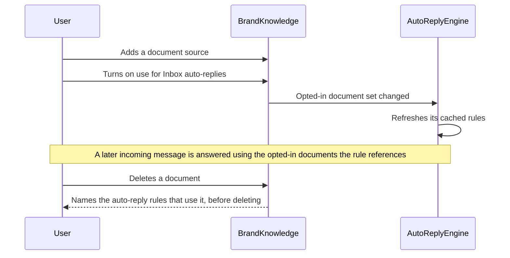
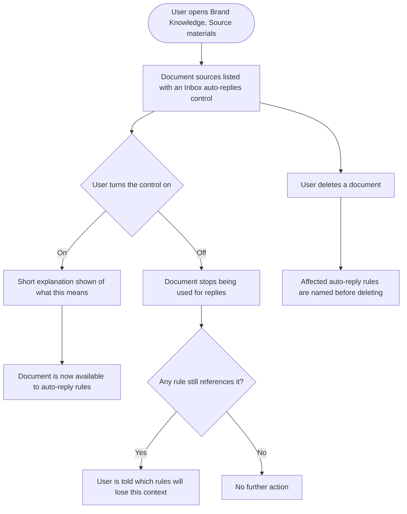
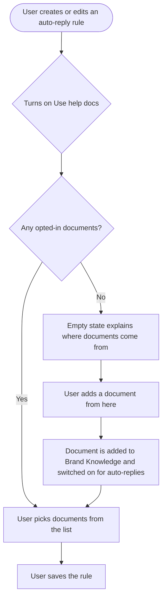

# Epic: Manage Inbox auto-reply help docs from Brand Knowledge

## Problem

We ask users for their documents twice. Brand Knowledge already accepts documents as a source type, sitting alongside websites, social accounts and free text in its Source Materials tab. Inbox AI auto-replies has an entirely separate document store, with its own upload flow, its own quota, its own management modal, its own delete-confirmation flow and its own per-rule picker.

The two know nothing about each other. A user who has already set up Brand Knowledge with their policies, FAQs and pricing guides opens the auto-reply form and is told "No help documents uploaded yet". They then upload the same files a second time. Nothing keeps the two copies in sync afterwards.

## Goal

Make Brand Knowledge the single place a workspace's documents live, and let the user decide per document whether it should also be used as context for Inbox auto-replies. Per document, not globally, because an internal pricing sheet or a partner agreement should not automatically become something the AI quotes back to a customer in a public reply.

## Scope

Four stories. One backend, two frontend, one design. Web only. Also touches the inbox service, since the auto-reply engine has to receive the opted-in document set and invalidate its rule cache when that set changes.

## Rules

- **The opt-in is per document and defaults to off.** A document being in Brand Knowledge does not mean it is safe to quote in a public reply.
- **Nothing a user relies on today breaks.** Existing Inbox help docs and existing rules referencing them keep working through and after the change.
- **Deleting a document keeps its warning.** The Inbox modal currently warns which rules are affected before deleting. Once Brand Knowledge owns the document, the Brand Knowledge delete has to carry that warning.
- **The Inbox upload shortcut survives.** A user configuring auto-replies can still add a document from where they are; it just lands in Brand Knowledge with the opt-in already set.
- **Rewrite the em dashes.** Two existing auto-reply tooltips use them, against current copy convention.

## Sequencing

The backend story defines the flag and the engine contract and must land first. The two frontend stories can then run in parallel, though the Brand Knowledge one is the more natural first since it is where the opt-in is set. The design story runs alongside and must deliver before the Brand Knowledge document row is rebuilt. The migration decision listed below has to be made before the backend story starts, not during it.

## Decisions needed before implementation

- **Migration of existing Inbox help docs.** Migrate them into Brand Knowledge as document sources with the opt-in set, or read both stores during a transition period. Migration is cleaner, a transition is safer. Either way, no user loses a working auto-reply.
- **Quotas.** The Inbox store has its own document limit and Brand Knowledge has its own source limits. One limit or two after unification, and whether an opted-in document counts against both.
- **Storage accounting.** Inbox help docs are described today as using workspace media storage. Confirm a unified document is counted once, not twice.

## Out of scope

- Changing how auto-replies generate their text, or how documents are chunked, embedded or retrieved. This is about which documents are in scope, not about retrieval quality.
- Changing Brand Knowledge's website, social or text source types.
- Mobile. Brand Knowledge and auto-reply configuration are both web only.

## Stories

1. `[BE] Add an Inbox auto-reply opt-in to Brand Knowledge documents and serve them to the auto-reply engine`
2. `[FE] Add the Inbox auto-reply control to the Brand Knowledge Source Materials tab`
3. `[FE] Point the auto-reply help-docs selector at Brand Knowledge documents`
4. `[Design] Brand Knowledge document row with the Inbox auto-reply control`

---
---

# 1. [BE] Add an Inbox auto-reply opt-in to Brand Knowledge documents and serve them to the auto-reply engine

### Description

Documents live in two unrelated places today, so a user has to upload the same policy twice to use it for both content generation and auto-replies. This story makes Brand Knowledge documents the single source, adds a per-document opt-in for Inbox auto-replies, and serves the opted-in set to the auto-reply engine so a rule can reference documents the user already gave us.

### Workflow

*(Backend story. The user-visible behaviour is specified in the frontend stories.)*

1. A user adds a document to Brand Knowledge.
2. They mark it as usable for Inbox auto-replies.
3. Auto-reply rules can then reference that document as context.
4. When an incoming message matches a rule, the reply is generated using the documents that rule references, and only documents that are still opted in.
5. If the user turns the opt-in off, the document stops being used for replies without being deleted from Brand Knowledge.
6. If the user deletes the document, they are told which auto-reply rules depend on it first.

### Acceptance criteria

- [ ] Each Brand Knowledge document source carries an Inbox auto-reply opt-in flag that defaults to off.
- [ ] The flag can be turned on and off per document without affecting the document's use in Brand Knowledge itself.
- [ ] An endpoint returns the workspace's Brand Knowledge documents that are opted in, for the auto-reply rule form to pick from.
- [ ] An auto-reply rule can reference one or more opted-in Brand Knowledge documents as its context.
- [ ] Auto-reply generation uses only documents that are both referenced by the rule and currently opted in. Turning the opt-in off takes effect on the next incoming message without the rule being edited.
- [ ] Turning the opt-in off or on invalidates the auto-reply engine's cached rules, so the change takes effect promptly rather than at the next natural cache expiry.
- [ ] Deleting a Brand Knowledge document reports which auto-reply rules reference it before the deletion is confirmed, matching the warning the Inbox flow gives today.
- [ ] A rule whose only referenced document has been deleted or opted out still runs, falling back to its non-document behaviour rather than failing or replying with nothing.
- [ ] Existing Inbox help docs and the rules referencing them keep working. No user's live auto-reply stops replying because of this change.
- [ ] A document uploaded through the Inbox flow is created as a Brand Knowledge document source with the opt-in already on.
- [ ] Document quota and storage accounting are applied per the decision recorded in the epic, and a document is never counted twice.
- [ ] Only documents belonging to the caller's workspace are ever returned or referenceable.
- [ ] The opt-in state is included wherever the document is read, so no caller has to make a second request to find out whether a document is in scope for replies.

### Mock-ups

N/A. Backend contract.

### Impact on existing data

Brand Knowledge document sources gain an opt-in field, defaulting to off for everything that exists today. Existing Inbox help docs are either migrated into Brand Knowledge with the opt-in on, or remain readable during a transition, per the decision recorded in the epic. Auto-reply rules keep their existing document references working either way. No rule loses its context as a result of the deploy.

### Impact on other products

- Web app: consumed by both frontend stories in this epic.
- Inbox service: receives the opted-in document set and must invalidate its cached rules on change.
- Brand Knowledge content generation: unaffected. Documents keep contributing to brand knowledge exactly as they do now, opt-in or not.
- Mobile apps and Chrome extension: unaffected.

### Dependencies

- The migration, quota and storage decisions in the epic must be settled first.

### Global quality and compliance checklist

- [ ] Mobile responsiveness tested (frontend only, N/A for backend-only stories) — N/A, backend only
- [ ] Multilingual support verified (frontend + backend, translations available or fallback handled)
- [ ] UI theming supported (default + white-label, design library components are being used) — N/A, no UI
- [ ] White-label domains impact reviewed
- [ ] Cross-product impact assessed (web, mobile apps, Chrome extension)

### Implementation references

*Pointers from research — not a contract. Engineering may choose a different approach.*

- Brand Knowledge documents already exist as a source type. `SourceMaterialsTab.vue` reads `profile.source_materials` with types website, social, document and text, so the flag hangs off an existing document record rather than needing a new entity.
- The Inbox side to unify is in `contentstudio-frontend/src/modules/inbox-revamp/composables/useAutoReplies.ts`, which calls `fetchBrandDocsApi`, `uploadBrandDocApi`, `deleteBrandDocApi` and `fetchAffectedRulesApi`, and tracks its own `max_docs` / `current_docs`. `fetchAffectedRulesApi` is the existing implementation of the affected-rules warning, and is worth reusing rather than rewriting.
- Rules store their selection as `guidance_doc_ids` (see `useAutoReplyForm.ts`), so the reference mechanism already exists. The question is what those ids point at after unification.
- Cache invalidation is the part most likely to be missed. `social-inbox-manager/app/services/auto_reply/rule_cache.py` caches rules and `app/workers/auto_reply_rule_change_worker.py` propagates rule changes. An opt-in toggle is not a rule change, so it will not invalidate through the existing path unless that path is extended.
- The engine entry point is `social-inbox-manager/app/services/auto_reply/engine.py`, with `intent_checker.py` handling the AI smart-filtering step and `reply_executor.py` producing the reply. `models.py` defines the `EvaluationContext` the engine works from, which is where the document set would need to reach.
- `contentstudio-backend/app/Jobs/AI/BrandKnowledgeGenerationJob.php` is the enrichment path for sources. Confirm the opt-in flag survives a Brand Knowledge sync, since sync currently re-derives from sources and prunes.

---
---

# 2. [FE] Add the Inbox auto-reply control to the Brand Knowledge Source Materials tab

### Description

Users who have already given us their FAQs and policies in Brand Knowledge are told, in the Inbox auto-reply form, that they have no help documents. This story lets them mark a Brand Knowledge document as usable for Inbox auto-replies, right where the document already lives, so they do not have to upload it a second time. The control is per document and off by default, because not every brand document is something the AI should quote back to a customer in a public reply.

### Workflow

1. User opens Brand Knowledge and goes to the Source materials tab.
2. Each document source row shows whether it is being used for Inbox auto-replies.
3. User turns the control on for their refund policy. A short explanation tells them what that means.
4. The document is now selectable in the Inbox auto-reply form.
5. User turns it off later. If any rule still references it, they are told which rules will lose that context.
6. User deletes a document. Before it is deleted, they are told which auto-reply rules depend on it.
7. Non-document sources (websites, social accounts, free text) show no such control, because the control does not apply to them.

### Acceptance criteria

- [ ] Each document source row in the Source materials tab shows an Inbox auto-reply control reflecting the document's current state.
- [ ] The control appears only on document sources. Website, social and text sources do not show it.
- [ ] The control defaults to off for every document that existed before this change.
- [ ] Turning the control on makes the document available to auto-reply rules, and the change is visible without a page reload.
- [ ] Turning the control off, when at least one rule still references the document, tells the user which rules will lose that context before the change is applied.
- [ ] Turning the control off when no rule references the document applies immediately with no interruption.
- [ ] Deleting a document names the auto-reply rules that reference it before the deletion is confirmed.
- [ ] A failure to save the control's new state surfaces an error and returns the control to its previous state, rather than showing a state that was not saved.
- [ ] The control is disabled while its change is in flight, so a rapid double click cannot produce conflicting saves.
- [ ] An explanation of what the control does is available on the row without leaving the tab, written for a non-technical user.
- [ ] The tab still works for a workspace with no document sources, with an empty state that mentions documents can be used for auto-replies.
- [ ] The tab renders correctly on a white-label domain, with no fixed brand colour on the new control.
- [ ] All new strings are translated and present in every locale directory.
- [ ] When a user turns the control on for the first time in a workspace, an `auto_reply_docs_enabled` Usermaven event fires with `{ source_type: 'document' }`.

### UI copy

**Column header**
- `Use for Inbox auto-replies`

**Control tooltip, when off**
- `Turn this on to let AI auto-replies use this document when answering messages and comments. Good for FAQs, refund policies and pricing guides. Leave it off for anything you would not want quoted to a customer.`

**Control tooltip, when on**
- `AI auto-replies can use this document when answering messages and comments. Turn it off to stop using it without deleting it.`

**Turning it off with rules still referencing it**
- Title: `Stop using this document for auto-replies?`
- Body: `{ruleCount} auto-reply rule(s) currently use this document: {ruleNames}. They will keep running, but without this document as context.`
- Primary button: `Stop using it`
- Secondary button: `Cancel`

**Deleting a document that rules reference**
- Title: `Delete this document?`
- Body: `{documentName} will be removed from Brand Knowledge. {ruleCount} auto-reply rule(s) use it: {ruleNames}. They will keep running, but without this document as context.`
- Primary button: `Delete`
- Secondary button: `Cancel`

**Save failure**
- `We couldn't save that change. Please try again.`

**Empty state addition**
- Subtext: `Add documents like FAQs, policies and product guides. You can also choose which of them AI auto-replies may use when answering messages.`

All strings go through translation and land in every locale directory in the same change. Note the deliberate absence of em dashes.

### Mock-ups

Provided by **[Design] Brand Knowledge document row with the Inbox auto-reply control**.

### Impact on existing data

None from the frontend. The opt-in field is added by the backend story.

### Impact on other products

- Web app only. Brand Knowledge is web only.
- The Inbox auto-reply form reads the result, covered by **[FE] Point the auto-reply help-docs selector at Brand Knowledge documents**.

### Dependencies

- Depends on **[BE] Add an Inbox auto-reply opt-in to Brand Knowledge documents and serve them to the auto-reply engine**.
- Depends on **[Design] Brand Knowledge document row with the Inbox auto-reply control**.

### Global quality and compliance checklist

- [ ] Mobile responsiveness tested (frontend only, N/A for backend-only stories)
- [ ] Multilingual support verified (frontend + backend, translations available or fallback handled)
- [ ] UI theming supported (default + white-label, design library components are being used)
- [ ] White-label domains impact reviewed
- [ ] Cross-product impact assessed (web, mobile apps, Chrome extension)

### Implementation references

*Pointers from research — not a contract. Engineering may choose a different approach.*

- The tab is `contentstudio-frontend/src/modules/publisher/ai-content-library/components/brand-knowledge/SourceMaterialsTab.vue`. It already renders a per-row action column (sync, delete) and derives rows from `props.profile.source_materials`, with a `type` per row, so the new control has a natural home and a natural condition.
- Types are read in the component today, and the row's type badge already maps type to a variant. The document type is the one this control attaches to.
- `queries/useBrandKnowledgeQueries.ts` owns the profile query and already polls while a profile is generating, so it is the place to invalidate or patch after a control change.
- `types/brand-knowledge.ts` holds the source-material types and will need the new flag.
- The affected-rules warning already exists on the Inbox side as `fetchAffectedRulesApi` in `modules/inbox-revamp/composables/useAutoReplies.ts`, and its confirmation dialog is `components/autoreplies/BrandHelpDocsModal.vue`. Reusing that call rather than writing a second one keeps the two warnings identical.
- Before naming the Usermaven event, check the existing `auto_reply_brand_doc_uploaded` and `auto_reply_brand_doc_deleted` events in `useAutoReplies.ts`, and confirm the new name fits alongside them rather than overlapping.

---
---

# 3. [FE] Point the auto-reply help-docs selector at Brand Knowledge documents

### Description

The auto-reply rule form has its own document list, separate from Brand Knowledge, so a user who has already uploaded their policies to Brand Knowledge sees "No help documents uploaded yet" here. This story points the form's document picker at the Brand Knowledge documents the user has opted in, and keeps the quick-add path working by having it create a Brand Knowledge document with the opt-in already set.

### Workflow

1. User creates or edits an auto-reply rule and turns on the help-docs option.
2. The picker lists the Brand Knowledge documents that are switched on for auto-replies.
3. Documents the user already added to Brand Knowledge appear here without being uploaded again.
4. If there are none, the empty state explains that documents live in Brand Knowledge and offers to add one from here.
5. Adding one from here uploads it into Brand Knowledge with the auto-reply option already on, and it appears in the picker.
6. User selects the documents this rule should use and saves.
7. A document later switched off in Brand Knowledge stops being used by this rule, and the rule keeps running without it.

### Acceptance criteria

- [ ] The help-docs picker lists the workspace's Brand Knowledge documents that are switched on for auto-replies.
- [ ] Documents added through Brand Knowledge appear in the picker without any re-upload.
- [ ] The picker's search and select-all behaviour still work over the new list.
- [ ] The empty state explains that documents live in Brand Knowledge, and offers both adding one from here and a link to Brand Knowledge.
- [ ] Adding a document from the auto-reply form creates it as a Brand Knowledge document with the auto-reply option already on, and it appears in the picker without a reload.
- [ ] Upload progress, file-size display and upload errors behave as they do today. The quick-add path is not a downgrade.
- [ ] A rule that references a document later switched off in Brand Knowledge saves and runs without error, and the form shows that the document is no longer available rather than silently dropping it.
- [ ] A rule that references a deleted document behaves the same way.
- [ ] Existing rules with existing document references open correctly and keep their selection after this change.
- [ ] The help-docs toggle's tooltips are rewritten without em dashes and mention that documents are managed in Brand Knowledge.
- [ ] The manage link points at the Brand Knowledge Source materials tab rather than the standalone Inbox modal, if the epic's decision is to retire that modal. If the modal is kept, it is clearly the same document set.
- [ ] Document quota messaging reflects the unified quota decided in the epic, and does not show two different limits.
- [ ] All changed and new strings are translated and present in every locale directory.
- [ ] The existing `uses_brand_docs` reporting on rule save still reflects reality after the change.

### UI copy

**Toggle label** (unchanged)
- `Use Help Docs`

**Toggle tooltip, when documents are available** (rewritten, em dashes removed)
- `AI will use your Brand Knowledge documents, such as FAQs, policies and pricing guides, to give accurate answers in your brand's voice.`

**Toggle tooltip, when no documents are available** (rewritten, em dashes removed)
- `No documents are switched on for auto-replies yet. Add your FAQs, policies or product guides in Brand Knowledge and switch them on so AI can give more accurate answers.`

**Picker empty state**
- Headline: `No documents available yet`
- Subtext: `Documents are managed in Brand Knowledge. Add one here, or open Brand Knowledge to switch on documents you have already added.`
- Primary button: `Add a document`
- Secondary link: `Open Brand Knowledge`

**Manage link**
- `Manage documents in Brand Knowledge`

**Referenced document no longer available**
- `One or more documents this rule used are no longer available for auto-replies. The rule will keep running without them.`

All strings go through translation and land in every locale directory in the same change.

### Mock-ups

Reuses the existing picker and modal layouts. Any new arrangement comes from **[Design] Brand Knowledge document row with the Inbox auto-reply control**.

### Impact on existing data

None from the frontend. Existing rule document references are handled by the backend story's migration decision.

### Impact on other products

- Web app only. Auto-reply rule configuration is web only.
- Depends on the inbox service honouring the opt-in, covered by the backend story.

### Dependencies

- Depends on **[BE] Add an Inbox auto-reply opt-in to Brand Knowledge documents and serve them to the auto-reply engine**.
- Best done after **[FE] Add the Inbox auto-reply control to the Brand Knowledge Source Materials tab**, so there is a way to switch documents on before this picker starts reading them.

### Global quality and compliance checklist

- [ ] Mobile responsiveness tested (frontend only, N/A for backend-only stories)
- [ ] Multilingual support verified (frontend + backend, translations available or fallback handled)
- [ ] UI theming supported (default + white-label, design library components are being used)
- [ ] White-label domains impact reviewed
- [ ] Cross-product impact assessed (web, mobile apps, Chrome extension)

### Implementation references

*Pointers from research — not a contract. Engineering may choose a different approach.*

- The picker is `contentstudio-frontend/src/modules/inbox-revamp/components/autoreplies/DocSelector.vue`, which reads `brandDocs` and `fetchBrandDocs` from `composables/useAutoReplies.ts` and implements its own search and select-all. Repointing the source of `brandDocs` may be most of the work.
- The toggle and its tooltips live in `components/autoreplies/AutoReplyForm.vue` (around the `brand_docs` label and `brandDocsTooltip` computed), with state in `composables/useAutoReplyForm.ts` (`showBrandDocs`, `form.guidance_doc_ids`, and the `uses_brand_docs` tracking payload).
- The standalone management modal is `components/autoreplies/BrandHelpDocsModal.vue`. It accepts `.pdf, .txt, .md, .csv, .docx` and has a working upload-with-progress and delete-with-affected-rules flow. Whether it is retired or repurposed as the quick-add path is the epic decision; repurposing preserves the better upload experience.
- `useAutoReplyForm.ts` currently derives `showBrandDocs` from whether the rule already has `guidance_doc_ids`. If a referenced document can now become unavailable, that derivation needs to survive an empty-but-intentional state.
- The two tooltips to rewrite are `inbox.auto_replies.form.brand_docs_tooltip_with_docs` and `brand_docs_tooltip_no_docs` in `src/locales/*/inbox.json`. Both currently contain em dashes.

---
---

# 4. [Design] Brand Knowledge document row with the Inbox auto-reply control

### Description

Brand Knowledge's Source materials tab lists websites, social accounts, documents and free text in one table with a shared row treatment and a per-row action column. Adding a per-document control that only applies to one of the four source types needs designing rather than bolting on, and the two confirmation dialogs it introduces need copy and layout that match the tab's existing delete flow.

### Workflow

N/A. Design deliverable.

### Acceptance criteria

- [ ] The document row is designed with the Inbox auto-reply control, in both on and off states, alongside the existing sync and delete actions.
- [ ] It is visually clear that the control applies to document rows only, without the table looking broken on rows that do not have it.
- [ ] The control's in-flight and error states are designed, so a save that fails does not look like a save that succeeded.
- [ ] A way to read what the control does is designed, at the row level, without the user leaving the tab.
- [ ] The confirmation dialog for switching the control off while rules still reference the document is designed, including how the affected rules are listed when there are many.
- [ ] The delete-confirmation dialog is designed with the affected-rules warning, consistent with the existing Inbox delete confirmation so the two do not diverge.
- [ ] The Source materials empty state is updated to mention that documents can be used for auto-replies.
- [ ] The design is specified at every breakpoint the tab supports, including how the table behaves when the extra column no longer fits.
- [ ] Colours are specified as theme tokens. No fixed brand colour on the new control.
- [ ] The design names the design-library components to reuse and explicitly flags anything unavailable as a component gap.
- [ ] The design covers the auto-reply picker's empty state, since that is the other place this feature becomes visible.

### Mock-ups

This story produces them.

### Impact on existing data

None.

### Impact on other products

- Web app only.

### Dependencies

None. Should start immediately so it does not block the frontend stories.

### Global quality and compliance checklist

- [ ] Mobile responsiveness tested (frontend only, N/A for backend-only stories)
- [ ] Multilingual support verified (frontend + backend, translations available or fallback handled) — the column header and control labels must tolerate longer translated strings
- [ ] UI theming supported (default + white-label, design library components are being used)
- [ ] White-label domains impact reviewed
- [ ] Cross-product impact assessed (web, mobile apps, Chrome extension)

### Implementation references

*Pointers from research — not a contract. Engineering may choose a different approach.*

- The tab to design against is `contentstudio-frontend/src/modules/publisher/ai-content-library/components/brand-knowledge/SourceMaterialsTab.vue`. Its existing columns are name, type, last synced, added and actions, with a type badge per row and an unreachable status for websites.
- The existing Inbox delete confirmation is in `contentstudio-frontend/src/modules/inbox-revamp/components/autoreplies/BrandHelpDocsModal.vue`, including the affected-rules list. Matching it rather than inventing a second treatment keeps the two consistent while both exist.
- Sibling Brand Knowledge tabs (`BrandProfileTab`, `BrandVoiceTab`, `BrandStyleTab`, `MediaAssetsTab`) set the visual expectations for this surface, so the new control should not look imported from the Inbox module.
