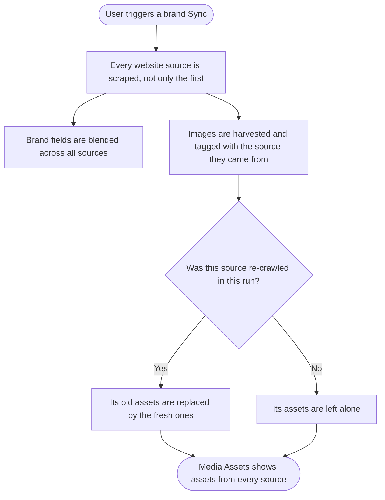
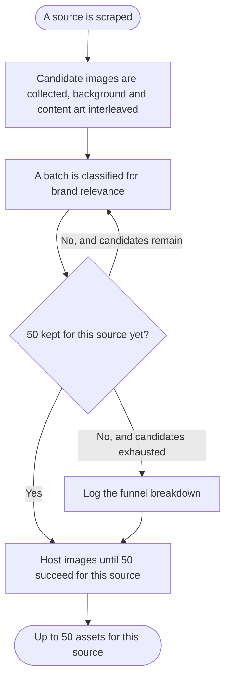

# Epic: Brand Knowledge collects usable images from every source

## Problem

Brand Knowledge v2 harvests images from a brand's sources into the Media Assets tab. Three faults in that pipeline mean the tab is often empty even when a harvest reports success.

**The cap is applied to candidates, not to keepers.** Fifty images enter the funnel and every stage after that only subtracts: a vision pass drops icons and screenshots with no floor, then the backend drops anything under 200px or wider than 4:1. A site can legitimately finish with zero brand assets. Worse, the parser collects CSS background images before markdown content images and truncates afterwards, so a page carrying more than fifty decorative backgrounds starves out every real content image before the vision pass even runs.

**Only the first website source is ever used.** The extraction payload carries a single website URL. A second website source added by a user contributes no images at all, and on a whole-brand Sync it contributes nothing whatsoever, because a newly added source is seeded with no cached text. Separately, the enrich path that runs after every source is added harvests document images only and discards the website images the AI service just parsed. Both together are why adding a second source produces text enrichment and no media.

**Social accounts contribute no media at all.** A brand's own posts are used to sample brand colours and nothing else. Ten images, capped, read for colour vision, never stored. Captions arrive as one space-joined blob with no platform, date or engagement attached. LinkedIn and Google Business Profile post images are skipped silently because their analytics builders have no image query. A social-only workspace ends up with an empty Media Assets tab and a brand voice derived from an undifferentiated wall of text.

## Goal

Make the yield per source explicit and reachable: **50 kept assets for each source**, not 50 candidates across the whole brand. Make every source contribute, not just the first. Treat a brand's own social posts as first-class brand media, named and ranked from the post itself.

## Scope

Nine stories. Seven in `contentstudio-backend`, one of which also changes `contentstudio-ai-agents`, one in `contentstudio-ai-agents` alone, one frontend, one design.

## Sequencing

The order below is deliberate and differs from the order the faults were reported in.

**Phase 1** is a single-argument fix that unblocks the most visible complaint and depends on nothing.

**Phase 2 comes before Phase 3** because a per-source target needs to know which source an asset came from. On the enrich path that is free, since that path already runs for one source at a time. On a whole-brand Sync it is not: that path processes every source in one run, and without the originating source recorded on each asset there is no way to count fifty for one source separately from another. Phase 2 establishes that attribution, so Phase 3's Sync behaviour depends on it.

**Phase 4** is the largest surface and can run in parallel with Phases 2 and 3, except that its pruning behaviour inherits the per-source scoping from Phase 2.

## Deploy note

**[BE] Keep 50 brand assets per source instead of 50 across the whole brand** and **[BE] Send per-post social records for brand voice extraction** both change the contract between `contentstudio-ai-agents` and `contentstudio-backend`. Per the standing Brand Knowledge rule, ship those repos together, and ship the frontend alongside **[FE] Show platform and source on social brand asset tiles**.

## Out of scope

- **Widening candidate supply beyond the root page.** Scraping additional internal paths, or scraping with main-content extraction disabled, was considered and dropped. The consequence is stated in the yield story: on many sites fifty keepers will not be reachable from one page, and the funnel logging is what will tell us whether that is a supply problem or over-filtering.
- **Video posts.** The planner collection path deliberately skips video objects. Harvesting video thumbnails is a follow-up.
- **Mobile.** Brand Knowledge and the Media Assets tab are web only.

## Stories

1. `[BE] Harvest website images when a brand source is enriched`
2. `[BE] Derive brand knowledge from every website source and prune per source`
3. `[BE] Keep 50 brand assets per source instead of 50 across the whole brand`
4. `[BE] Return post records from the analytics social queries across all platforms`
5. `[BE] Harvest social posts as named brand media assets`
6. `[BE] Send per-post social records for brand voice extraction`
7. `[BE] Rank brand assets for generation by relevance instead of insertion order`
8. `[FE] Show platform and source on social brand asset tiles`
9. `[Design] Social brand asset tile and source row treatment`

## Decisions needed before implementation

- **Multi-website extraction approach** for story 2: a backend loop calling the AI service once per website URL, or a wire-contract change so the service accepts several URLs and merges the results itself. The story's acceptance criteria are written to be true either way.
- **Curation policy for social assets** in story 5: a brand's own posts arguably should not face a keep-or-drop verdict from a vision pass tuned to reject icons and screenshots, but a description is still wanted for relevance ranking. Either a describe-only path, or reuse the caption as the description and skip vision.
- **Twitter** in story 4: currently excluded from both the caption and the image analytics paths. In or out.
- **How the per-source target interacts across source types** once social assets are harvested: fifty per website source and fifty per social source, or a shared ceiling.

---
---

# 1. [BE] Harvest website images when a brand source is enriched

### Description

As a user who adds a website to my brand sources, I want the images from that website to appear in my Media Assets tab, so that the brand I just told ContentStudio about actually has its visuals available for generation.

Adding a source triggers an enrichment run. That run extracts the brand from the new source and harvests images from it, but only document images. The website images the AI service parsed and curated for that same source are returned in the result and then dropped on the floor. Since adding a source is the normal way a brand grows, this is the default path, and it is why adding a website produces text enrichment and no new media.

### Workflow

The consumer is the enrichment flow rather than a person, but the user-visible effect is direct.

1. User adds a website in Source Materials and confirms.
2. ContentStudio extracts the brand from that website and harvests its images.
3. Once the queued harvest finishes, the images appear in the Media Assets tab.
4. Assets already harvested from other sources are untouched.

### Acceptance criteria

- [ ] Adding a website source results in that website's images being harvested as brand assets
- [ ] The images appear in the Media Assets tab once the queued harvest completes
- [ ] Document images continue to be harvested from document sources exactly as they are today
- [ ] The harvest triggered by an enrichment run does not remove assets belonging to any other source
- [ ] An enrichment run that returns no website images completes without error and leaves existing assets in place
- [ ] The harvest is queued rather than run inline, so adding a source does not block on image downloads

### Mock-ups

N/A, backend only. No interface changes. The Media Assets tab already refreshes when the harvest settles.

### Impact on existing data

Creates new brand asset media rows for website sources added through the enrich path. No existing rows are modified or removed, because this path does not prune.

### Impact on other products

None. Brand Knowledge is web only.

### Dependencies

None. This is the smallest change in the epic and has no prerequisites.

### Global quality & compliance (wherever applicable)

- [ ] Mobile responsiveness (N/A, backend only)
- [ ] Multilingual support (frontend + backend, translations available or fallback handled)
- [ ] UI theming support (N/A, backend only)
- [ ] White-label domains impact review
- [ ] Cross-product impact assessment (web, mobile apps, Chrome extension)

### Implementation references

*Pointers from research, not a contract. Engineering may choose a different approach.*

**Primary entry points:**
- `contentstudio-backend/app/Http/Controllers/AI/AiContentLibrary/AiContentLibraryProfileController.php`, in `enrichSources` (starts at line 549). Lines 613 and 614 read `document_assets` out of the extraction result and pass it to the harvest. The result's website assets are never referenced anywhere in the file.
- `contentstudio-backend/app/Services/AI/BrandAnalysisService.php`, `harvestDocumentImages` at line 246, dispatches the harvest job at line 253 with an empty array in the web-assets position and the prune flag already set to false.

**Why this is small:**
- The harvest job's signature already has a parameter for website assets and a non-pruning mode. The fix is populating the argument that is currently hardcoded empty, not adding a new path.

**Gotcha:**
- Keep the non-pruning behaviour. This path appends one source's images, and switching it to prune would make adding a second source delete the first source's assets.

---

# 2. [BE] Derive brand knowledge from every website source and prune per source

### Description

As a user with more than one website in my brand sources, I want a Sync to read all of them and I want each source's assets to survive, so that adding a second site genuinely broadens my brand rather than being ignored and then quietly wiped.

Two faults compound here. The extraction payload carries a single website URL, so a Sync only ever scrapes the first website source and every later one degrades to whatever cached text it has, which for a newly added source is nothing. And the harvest replaces rather than appends: it deletes any of the brand's harvested assets that are not in the fresh set. Since the fresh set only ever comes from the first website, a Sync deletes everything harvested from every other source. That second half will undo **[BE] Harvest website images when a brand source is enriched** on the next Sync unless it is fixed here.

Recording which source each asset came from is also what makes a per-source target possible, so this story is a prerequisite for **[BE] Keep 50 brand assets per source instead of 50 across the whole brand**.

### Workflow

1. User has two or more website sources and triggers a Sync from Source Materials.
2. ContentStudio reads every website source, not only the first one added.
3. Brand fields are re-derived from all of them together.
4. Images from each source are harvested and remembered against the source they came from.
5. Assets belonging to a source that was re-crawled in this run are refreshed. Assets belonging to a source that was not are left in place.
6. User removes a source, and only that source's harvested assets disappear.

### Acceptance criteria

- [ ] A Sync re-derives the brand from every website source in the profile, not only the first
- [ ] A website source added through the interface, which has no cached text, is scraped on a Sync rather than contributing nothing
- [ ] Each harvested asset records which source material it came from
- [ ] A Sync removes stale assets only for the sources it actually re-crawled in that run
- [ ] Assets belonging to a source that was not part of a run survive that run
- [ ] A source that is unreachable during a Sync does not cause its previously harvested assets to be deleted
- [ ] Deleting a source removes that source's harvested assets and no others
- [ ] Assets harvested before this change, which carry no source attribution, are not deleted by a Sync

### Mock-ups

N/A, backend only.

### Impact on existing data

Adds a source reference to brand asset media rows. Rows harvested before this change have no source recorded, so the pruning logic has to treat unattributed assets as protected rather than as orphans, otherwise the first Sync after deploy deletes every existing brand asset. That is called out as an acceptance criterion because it is the main migration risk in this epic.

### Impact on other products

None. Brand Knowledge is web only.

### Dependencies

- Builds on **[BE] Harvest website images when a brand source is enriched**, which is what puts second-source assets there in the first place.
- Prerequisite for **[BE] Keep 50 brand assets per source instead of 50 across the whole brand** and for the pruning behaviour in **[BE] Harvest social posts as named brand media assets**.

### Global quality & compliance (wherever applicable)

- [ ] Mobile responsiveness (N/A, backend only)
- [ ] Multilingual support (frontend + backend, translations available or fallback handled)
- [ ] UI theming support (N/A, backend only)
- [ ] White-label domains impact review
- [ ] Cross-product impact assessment (web, mobile apps, Chrome extension)

### Implementation references

*Pointers from research, not a contract. Engineering may choose a different approach.*

**Primary entry points:**
- `contentstudio-backend/app/Helpers/Ai/ContentLibraryHelper.php`, `buildSourceExtractionPayload` at line 1605. The website branch at lines 1617 to 1625 assigns the URL only when it is still empty, so every later website source falls through to its cached text. The payload returns a single scalar website URL at line 1650. `buildEnrichExtractionPayload` at line 1665 has the same shape.
- `contentstudio-backend/app/Jobs/AI/HostBrandAssetsJob.php`, the prune call at line 89.
- `contentstudio-backend/app/Repository/Utilities/MediaRepository.php`, `pruneBrandAssetsExcept` around line 374 to 390, which matches on the stored source URL. The save payload it would need to extend is around lines 596 to 598, where the brand category and source URL are already written.

**Two approaches to the multi-website half:**
- A backend loop that calls the AI service once per website URL and blends the results. No wire-contract change, costs one scrape per source per Sync, simplest to reason about.
- A wire-contract change so the AI service accepts several URLs, scrapes them in parallel and merges the sections itself. Cleaner and faster, but both the plain and streaming extraction endpoints have to stay in step.

**Existing behaviour to preserve:**
- The enrich path already passes prune as false, which is correct. Do not make it prune as part of unifying the two paths.

---

# 3. [BE] Keep 50 brand assets per source instead of 50 across the whole brand

### Description

As a user adding a source to my brand, I want that source to contribute up to fifty usable images of its own, so that a brand built from three sources has three sources' worth of visuals rather than fifty candidates shared between them, most of which get filtered away.

Today fifty is a candidate cap applied once across the whole brand, and every stage after it only subtracts. There is no floor, so a harvest can report success and produce nothing. This story turns fifty into a yield target scoped to a single source, sized with a candidate budget above it and a top-up loop so a low keep rate raises supply instead of producing an empty grid.

It also fixes the ordering fault that makes a total wipeout likely: background images are collected before content images and the truncation happens afterwards, so a page with many decorative backgrounds can crowd out every real content image before any filtering runs.

This story changes both the AI service and the backend. They ship together.

### Workflow

The consumer is the harvest pipeline. The funnel and where the target now applies:

1. A source is scraped and its candidate images are collected, with background art and content images interleaved so neither can crowd out the other.
2. Candidates are classified in batches for brand relevance. Kept images accumulate.
3. If fewer than fifty have been kept and candidates remain, another batch is classified. This repeats until fifty are kept or the candidates run out.
4. The kept images are downloaded and hosted. Images rejected on size or shape are backfilled by later candidates, so the count reaches fifty successes rather than fifty attempts.
5. If nothing survives for a source that had candidates, that is recorded loudly rather than silently.

### Acceptance criteria

- [ ] The fifty target counts assets successfully hosted for one source, not candidates entering the pipeline
- [ ] A brand with three sources can hold up to fifty assets from each, rather than fifty in total
- [ ] Candidate collection interleaves background art and content images, so a page with many background images still contributes its content images
- [ ] Classification runs in batches and keeps drawing from the remaining candidates until fifty are kept for that source or the candidates are exhausted
- [ ] Hosting continues past individual failures until fifty succeed for that source or the candidate list is exhausted
- [ ] A hard ceiling on attempts prevents a pathological payload from running the harvest job to its timeout
- [ ] A single log line reports the funnel for each source: candidates collected, candidates classified, assets kept, assets hosted
- [ ] Zero assets kept from a source that had at least one candidate raises a warning containing that funnel breakdown
- [ ] Fifty successful hosts complete within the harvest job's timeout, or the work is split so that a timeout cannot discard everything already downloaded
- [ ] A harvest that times out or fails part way leaves the assets it already hosted in place
- [ ] A source that yields fewer than fifty keepers completes normally, with the shortfall visible in the funnel log and no error surfaced to the user

### Mock-ups

N/A, backend only.

### Impact on existing data

No change of shape. Existing brand assets are unaffected. Volume grows: a brand with several sources can now hold several times what it held before, which is worth checking against the Media Assets tab's paging and against storage expectations.

### Impact on other products

None directly, though the volume increase is what makes **[BE] Rank brand assets for generation by relevance instead of insertion order** matter, since generation still sends a fixed twenty-five.

### Dependencies

- **[BE] Derive brand knowledge from every website source and prune per source**, for the per-source attribution the target counts against on a whole-brand Sync. The enrich path already runs one source at a time and does not need it.

### Global quality & compliance (wherever applicable)

- [ ] Mobile responsiveness (N/A, backend only)
- [ ] Multilingual support (frontend + backend, translations available or fallback handled)
- [ ] UI theming support (N/A, backend only)
- [ ] White-label domains impact review
- [ ] Cross-product impact assessment (web, mobile apps, Chrome extension)

### Implementation references

*Pointers from research, not a contract. Engineering may choose a different approach.*

**AI service entry points:**
- `contentstudio-ai-agents/src/api/routers/business_info/business_info_router.py`. The cap is `MAX_BRAND_ASSETS = 50` at line 428. `_parse_brand_assets` starts at line 500: pass one appends CSS background images at lines 518 to 531, pass two appends markdown content images at lines 534 to 564, and the truncation is a single slice at line 566. That ordering is deliberate, the comment says background art is prioritised so a hero survives the cap, so the interleave has to preserve hero-first intent without letting backgrounds consume the whole list.
- `_curate_brand_assets` at line 584 is the vision keep-or-drop pass and currently runs once over all candidates.
- The existing parsed and curated log lines are at 568 to 580 and are the natural place to consolidate into one funnel line.

**Backend entry points:**
- `contentstudio-backend/app/Jobs/AI/HostBrandAssetsJob.php`. `MAX_ASSETS = 50` at line 25 is applied as `array_slice` at line 59, which caps attempts. `timeout = 120` at line 17 and `tries = 1` at line 19 need rechecking against fifty sequential downloads and uploads per source.
- `contentstudio-backend/app/Repository/Utilities/MediaRepository.php`, `hostBrandImageFromUrl` at line 455. The geometry guards are at lines 548 and 551, using a 200px minimum dimension declared at line 24 and a 4:1 maximum aspect ratio at line 27. Worth confirming the minimum is not rejecting legitimate responsive crops just under it.

**Gotchas:**
- `tries = 1` with no retry means a mid-job failure loses everything after the cut. Splitting the work or raising the timeout both address it, but a single job doing fifty downloads per source across several sources is the risk to size first.
- The candidate budget drives vision cost. Classification batches at ten per call with a per-call timeout, so a large budget multiplies concurrent calls. Check provider limits and the effect on the extraction progress stage, which the streaming interface currently expects to be brief.

---

# 4. [BE] Return post records from the analytics social queries across all platforms

### Description

As a developer building brand knowledge from a workspace's own social posts, I need the analytics queries to return the post rather than a bare image URL, so that a harvested asset can be named and ranked from the post it came from instead of a content-delivery filename.

The image query returns one column, the media URL, with no caption, link, date or engagement. Two platforms have no image query at all and are skipped without a trace. And the caption path splices account identifiers into a ClickHouse string literal without the sanitising the image path applies, which is a correctness and safety gap rather than a stylistic inconsistency.

### Workflow

The consumer is the brand extraction pipeline.

1. Brand extraction asks for a workspace's recent posts for a set of accounts on a platform.
2. It receives post records: the image or images, the caption, a link to the post, when it was posted, and its engagement.
3. Every platform that exposes post analytics answers, including the two that are currently skipped.
4. A platform with no analytics support is skipped in a way that is visible in logs rather than silent.
5. A failure reaching the analytics store degrades to an empty result rather than propagating.

### Acceptance criteria

- [ ] The post query returns, per post, the image or images, the caption, a permalink, the posted timestamp, and an engagement figure
- [ ] Facebook, Instagram, TikTok, Pinterest and YouTube return post records
- [ ] LinkedIn and Google Business Profile return post records, rather than being skipped because no image query exists for them
- [ ] A platform with no analytics post support is skipped with a log line naming the platform, not silently
- [ ] Account identifiers are stripped of quotes and backslashes before being placed into the analytics query, on the caption path as well as the image path
- [ ] A failure reaching the analytics store on the caption path returns an empty result instead of raising
- [ ] Posts are returned most recent first, and the per-platform limit is respected
- [ ] A platform returning no posts yields an empty result rather than an error

### Mock-ups

N/A, backend only.

### Impact on existing data

None. These are read queries. The existing caption and image queries stay available until their callers move over.

### Impact on other products

None. The analytics warehouse is read-only from here.

### Dependencies

None. Can start immediately and is a prerequisite for **[BE] Harvest social posts as named brand media assets**.

### Global quality & compliance (wherever applicable)

- [ ] Mobile responsiveness (N/A, backend only)
- [ ] Multilingual support (frontend + backend, translations available or fallback handled)
- [ ] UI theming support (N/A, backend only)
- [ ] White-label domains impact review
- [ ] Cross-product impact assessment (web, mobile apps, Chrome extension)

### Implementation references

*Pointers from research, not a contract. Engineering may choose a different approach.*

**Primary entry points:**
- `contentstudio-backend/app/Builders/Analytics/Analyze/`. Only five builders define an image query for multiple accounts: Facebook, Instagram, TikTok, Pinterest and YouTube. LinkedIn and Google Business Profile have none, which is why the `method_exists` guard at `ContentLibraryHelper.php:360` skips them without a trace.
- `contentstudio-backend/app/Helpers/Ai/ContentLibraryHelper.php`. The caption path builds its account list at lines 272 to 274 by joining the raw values. The image path at lines 364 to 368 strips quotes and backslashes first, with a comment explaining why. The image path also wraps its analytics call in a best-effort catch at lines 380 to 384, which the caption path does not have.
- `contentstudio-backend/app/Builders/Analytics/Analyze/InstagramBuilder.php` line 1777 is the current single-column image query and the clearest model for what the new shape replaces.

**Sequencing note:**
- The account identifier sanitising is independent of the rest of this story and is two lines. It can be cherry-picked and shipped ahead of the query rework if wanted.

**Decision carried into this story:**
- Twitter is currently excluded from both the caption path and the image path. Confirm whether it comes into scope here or stays out.

---

# 5. [BE] Harvest social posts as named brand media assets

### Description

As a user whose brand lives mostly on social media, I want my own posts to become brand assets I can see and reuse, so that a workspace with no website still has a populated Media Assets tab and generation has real brand imagery to work from.

Today a brand's social images are read for colour and discarded. Nothing from social ever becomes a stored asset. This story harvests them through the same pipeline as website images, so they land in the Media Assets tab with no interface change, named from the post rather than from a content-delivery filename, and selected by how the post actually performed rather than by whichever ten came back first.

### Workflow

1. User builds or syncs a brand whose sources include connected social accounts.
2. ContentStudio collects the workspace's recent posts for those accounts, from analytics and from posts scheduled through ContentStudio.
3. Posts are ranked by engagement, then by recency, and a per-account budget is taken from the top.
4. Their images are harvested through the same path as website images and appear in the Media Assets tab.
5. Each asset is named from its post, so the tab reads as a set of recognisable posts rather than a wall of filenames.
6. The post's caption becomes the asset's description, so relevance matching during generation has something to work with.

### Acceptance criteria

- [ ] A brand whose only sources are social accounts produces a non-empty Media Assets tab
- [ ] Harvested social assets appear in the same tab as website assets, with no frontend change required
- [ ] Each social asset carries a name derived from its post, containing the platform, the post date, and an excerpt of the caption
- [ ] Each social asset carries the post's caption as its description
- [ ] Each social asset records its platform, a link back to the post, and that it came from a social post rather than a website
- [ ] Posts are selected by engagement first and recency second, not by recency alone
- [ ] A per-account budget applies, so one high-volume account cannot consume the whole allowance
- [ ] Images from posts scheduled through ContentStudio are included alongside those from analytics, deduplicated against them
- [ ] The existing ten-image sample used for brand colour sampling is unchanged
- [ ] A social source's assets are removed only when that source is re-synced, matching the per-source pruning behaviour
- [ ] A post with no image contributes nothing and does not error
- [ ] Video posts are skipped without error, as they are today

### Mock-ups

Tile presentation is covered by **[Design] Social brand asset tile and source row treatment** and implemented in **[FE] Show platform and source on social brand asset tiles**. This story requires no interface change to make the assets visible.

### Impact on existing data

Creates brand asset media rows sourced from social posts, carrying new fields for platform and post link, and a category marking them as social posts. Existing rows are unaffected. Volume grows for social-heavy workspaces, which previously contributed nothing.

### Impact on other products

None. Brand Knowledge is web only.

### Dependencies

- **[BE] Return post records from the analytics social queries across all platforms**, which supplies the metadata this story names assets from.
- **[BE] Derive brand knowledge from every website source and prune per source**, for the per-source pruning this story inherits.

### Global quality & compliance (wherever applicable)

- [ ] Mobile responsiveness (N/A, backend only)
- [ ] Multilingual support (frontend + backend, translations available or fallback handled)
- [ ] UI theming support (N/A, backend only)
- [ ] White-label domains impact review
- [ ] Cross-product impact assessment (web, mobile apps, Chrome extension)

### Implementation references

*Pointers from research, not a contract. Engineering may choose a different approach.*

**Primary entry points:**
- `contentstudio-backend/app/Helpers/Ai/ContentLibraryHelper.php`. The current social image collection is capped by a constant declared at line 320 and sliced at line 340, and is used only to feed colour sampling. `collectPlannerPostImages` at line 453 already reads images out of posts scheduled through ContentStudio and is the second supply to merge, with its video skip explained at line 477.
- `contentstudio-backend/app/Repository/Utilities/MediaRepository.php`, `hostBrandImageFromUrl` at line 455. The asset name is currently derived from the URL path at line 569, which is what produces content-delivery filenames. The save payload at lines 596 to 598 already writes a brand category and source URL and is where the platform and post link would join them.

**Decision carried into this story:**
- Whether social assets go through the vision keep-or-drop pass. They are the brand's own content, and heuristics tuned to reject icons and screenshots will misfire on legitimate posts. But a description is still wanted for relevance ranking during generation. Either add a describe-only path, or use the caption as the description and skip vision entirely. This overlaps a known gap where uploaded assets also have no describe step.

---

# 6. [BE] Send per-post social records for brand voice extraction

### Description

As a user whose brand voice should sound like my best posts, I want brand extraction to see my posts individually with their performance, so that a well-received post carries more weight than a one-line repost.

Captions from every connected account are currently flattened into a single space-joined string with no platform, date or engagement attached. The voice and topics extraction cannot tell a top-performing Instagram caption from a throwaway LinkedIn share, so a brand voice derived from social sources is averaged across everything the workspace has ever posted.

This story changes the contract between the backend and the AI service, so it ships with the backend.

### Workflow

The consumer is the extraction pipeline.

1. Brand extraction receives the workspace's posts as individual records, each with its platform, date, caption and engagement.
2. Voice and topics extraction weights the better-performing posts more heavily than the rest.
3. Extraction still works when engagement is unavailable for a platform, falling back to recency.

### Acceptance criteria

- [ ] Social captions reach brand extraction as per-post records carrying platform, date, caption and engagement, rather than one concatenated string
- [ ] Voice and topics extraction distinguishes a high-engagement post from a low-engagement one
- [ ] Extraction completes normally when engagement is missing for some or all posts
- [ ] A workspace with no social posts extracts from its other sources without error
- [ ] The existing single-string field either continues to be accepted or is removed in the same release as its last caller, so the two services are never mismatched in production

### Mock-ups

N/A, no interface in this story.

### Impact on existing data

None stored. This changes a request payload between services.

### Impact on other products

None. Brand Knowledge is web only.

### Dependencies

- **[BE] Return post records from the analytics social queries across all platforms**, which supplies the per-post records.
- Ships with the backend, per the epic's deploy note.

### Global quality & compliance (wherever applicable)

- [ ] Mobile responsiveness (N/A, no user interface in this story)
- [ ] Multilingual support (frontend + backend, translations available or fallback handled)
- [ ] UI theming support (N/A, no user interface in this story)
- [ ] White-label domains impact review
- [ ] Cross-product impact assessment (web, mobile apps, Chrome extension)

### Implementation references

*Pointers from research, not a contract. Engineering may choose a different approach.*

**Primary entry points:**
- `contentstudio-backend/app/Helpers/Ai/ContentLibraryHelper.php`, `processSocialAccounts` at line 218, which ends by joining every account's captions into one string.
- `contentstudio-ai-agents/src/api/routers/business_info/business_info_router.py` and the business info agent's prompt, which currently consume that single field.

**Gotcha:**
- Both the plain and the streaming extraction endpoints have to accept the new field in the same release, or one path silently loses the social signal.

---

# 7. [BE] Rank brand assets for generation by relevance instead of insertion order

### Description

As a user generating content with my brand applied, I want the brand images sent to generation to be the most relevant ones, so that having more brand assets improves my output instead of burying the good ones.

Generation takes a fixed twenty-five brand assets per request, selected in stored order. That was tolerable when a brand held at most fifty. Once each source contributes up to fifty, a brand with three sources holds a hundred and fifty assets competing for the same twenty-five slots, chosen by nothing at all. The first sources added win permanently.

### Workflow

The consumer is the generation pipeline.

1. Generation requests brand assets for a workspace's brand.
2. The selection returns the most relevant assets for that request rather than the earliest stored.
3. Relevance considers what kind of asset it is and what it depicts, not the order it arrived in.
4. Assets from different sources are represented, so one source cannot monopolise the selection.

### Acceptance criteria

- [ ] Brand assets sent to generation are selected by relevance rather than stored order
- [ ] Selection draws on the asset's category and description, both of which are already stored
- [ ] A brand holding more assets than the per-request limit still returns a mix across its sources rather than only the earliest
- [ ] The per-request limit remains configurable in one place, and its current value is confirmed as correct or changed deliberately
- [ ] A brand with fewer assets than the limit returns all of them, unchanged from today
- [ ] Assets with no description are still eligible, ranked below described ones rather than excluded

### Mock-ups

N/A, backend only.

### Impact on existing data

None. This changes selection at read time.

### Impact on other products

Affects every AI surface that applies brand knowledge during generation, so the change is visible in composer, AI chat and the content library at once.

### Dependencies

- Only becomes material once **[BE] Keep 50 brand assets per source instead of 50 across the whole brand** has landed, because that is what makes stored volume exceed the request limit.
- Benefits from the descriptions written by **[BE] Harvest social posts as named brand media assets**.

### Global quality & compliance (wherever applicable)

- [ ] Mobile responsiveness (N/A, backend only)
- [ ] Multilingual support (frontend + backend, translations available or fallback handled)
- [ ] UI theming support (N/A, backend only)
- [ ] White-label domains impact review
- [ ] Cross-product impact assessment (web, mobile apps, Chrome extension)

### Implementation references

*Pointers from research, not a contract. Engineering may choose a different approach.*

**Primary entry points:**
- `contentstudio-backend/app/Helpers/Ai/ContentLibraryHelper.php` line 1372 requests brand assets with a limit of twenty-five. The limit is an argument to the repository call rather than a chained take, so it is a single place to change.
- `contentstudio-backend/app/Repository/Utilities/MediaRepository.php`, `getBrandAssets` at line 352, which applies the limit today with no ordering by relevance.

---

# 8. [FE] Show platform and source on social brand asset tiles

### Description

As a user looking at my Media Assets tab, I want to see where each asset came from, so that I can tell a post I published on Instagram from an image scraped off my website and pick the right one.

Once social posts are harvested, the tab mixes website images and social posts with nothing to distinguish them. The tile already shows a small pill when an asset has been used in generation, so the pattern for a corner marker exists.

### Workflow

1. User opens the Media Assets tab in Brand Knowledge and sees assets from every source.
2. An asset harvested from a social post shows its platform on the tile.
3. User hovers the tile and sees the full post name, including the date and caption excerpt, which is otherwise truncated.
4. User opens the asset and can follow a link to the original post.
5. In Source Materials, a connected social source shows how many accounts it covers instead of a generic label.

### Acceptance criteria

- [ ] A tile for an asset harvested from a social post shows the platform it came from
- [ ] The platform marker uses the platform's own brand colour from the design system, never a hardcoded colour value
- [ ] A tile for a website-harvested or uploaded asset is unchanged
- [ ] Hovering a social asset tile reveals its full name when the name is truncated
- [ ] Opening a social asset offers a link to the original post, labelled `View original post`, which opens in a new tab
- [ ] An asset whose post link is missing shows no link rather than a dead control
- [ ] The Source Materials row for a social source shows the number of connected accounts, reading `{n} accounts connected` and `1 account connected` for a single account, replacing the current generic label
- [ ] Existing tile behaviour for the used-in-generation pill is unaffected
- [ ] Tiles remain legible at the tab's smallest grid width, with the platform marker never overlapping the used pill
- [ ] Loading state uses the existing tab skeleton, unchanged
- [ ] Empty state copy for a brand with no assets reads "No brand assets yet" with the subtext "Add a website or connect a social account in Source Materials, and ContentStudio will collect your brand's images here." and a `Go to Source Materials` action
- [ ] All new strings are added through the translation system and exist in every locale

### Mock-ups

See **[Design] Social brand asset tile and source row treatment**.

### Impact on existing data

None.

### Impact on other products

The Media Assets tile is shared with the media library. Confirm the platform marker does not alter tiles outside Brand Knowledge, where the source fields are absent.

### Dependencies

- **[BE] Harvest social posts as named brand media assets**, which supplies the platform, post link and name.
- **[Design] Social brand asset tile and source row treatment**.

### Global quality & compliance (wherever applicable)

- [ ] Mobile responsiveness (frontend only, N/A for backend-only stories)
- [ ] Multilingual support (frontend + backend, translations available or fallback handled)
- [ ] UI theming support (default + white-label, design library components are being used)
- [ ] White-label domains impact review
- [ ] Cross-product impact assessment (web, mobile apps, Chrome extension)

### Implementation references

*Pointers from research, not a contract. Engineering may choose a different approach.*

**Primary entry points:**
- `contentstudio-frontend/src/modules/publish/components/media-library/components/Asset.vue` is the shared tile. It already declares a `brand_used` flag and renders a pill from it at lines 414 to 419 with a tooltip, which is the closest precedent for a corner marker.
- The Source Materials social row currently falls back to a generic translated label for social sources. The key lives in the publisher translation namespace as `default_name_social`, currently "Social profiles".

**Components:**
- `Badge` is available in the design system for the platform marker. There is no dedicated pill or chip component, so if the marker needs a shape the `Badge` variants do not cover, that is a gap to raise with design rather than a Tailwind override on a design system component.
- Platform colours come from the existing social colour classes. Do not hardcode a hex value.

---

# 9. [Design] Social brand asset tile and source row treatment

### Description

As the team building social brand assets, we need the tile and source row treatments designed, so that the frontend has a specification rather than inventing one, and so mixed asset types read clearly in one grid.

### Workflow

Not applicable. This story produces designs, not a user flow.

### Acceptance criteria

- [ ] A design exists for a Media Assets tile representing an asset harvested from a social post, showing its platform, and coexisting with the used-in-generation pill without collision
- [ ] The treatment is specified at every grid width the tab uses, including the narrowest
- [ ] A design exists for how a truncated social asset name reveals in full
- [ ] A design exists for the asset detail view including the link to the original post
- [ ] A design exists for the Source Materials social row showing connected account count
- [ ] Empty state for a brand with no assets is designed, with copy agreed
- [ ] Treatments use existing design system components and tokens, and any gap requiring a new component is called out explicitly
- [ ] Designs work on a white-label domain where the brand colour is not the default blue
- [ ] Designs are reviewed with engineering before **[FE] Show platform and source on social brand asset tiles** starts

### Mock-ups

This story produces them.

### Impact on existing data

None.

### Impact on other products

The tile is shared with the media library outside Brand Knowledge. The design should state what those tiles look like when no source information exists.

### Dependencies

Blocks **[FE] Show platform and source on social brand asset tiles**.

### Global quality & compliance (wherever applicable)

- [ ] Mobile responsiveness (frontend only, N/A for backend-only stories)
- [ ] Multilingual support (frontend + backend, translations available or fallback handled)
- [ ] UI theming support (default + white-label, design library components are being used)
- [ ] White-label domains impact review
- [ ] Cross-product impact assessment (web, mobile apps, Chrome extension)
