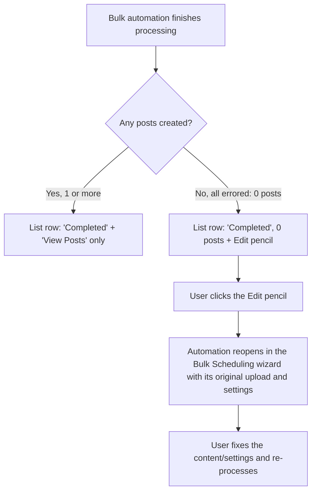

# Stories — Bulk Automation fixes (Publisher)

> Deliverable for the Product Owner to create in Shortcut manually. Nothing is pushed to Shortcut. Each story ends with a **Shortcut fields** block. Create both stories with the **New Feature Template** so the standard sections + 5 quality-checklist tasks are pre-populated.

Two stories: one combined **[FE]** covering all three fixes, and one **[BE]** enabling fix #3 (reopening automations that completed with zero posts).

---

## Epic

**Epic title:** `Bulk Scheduling: Flow Clarity & Error Recovery Fixes`

**Epic description:**

> Tighten up the Publisher Bulk Scheduling (bulk automation) flow across three rough edges: wrong CSV wording showing in the image-upload flow, the image preview and date overlapping the background when the Finalizing Posts table is scrolled, and automations that finish with every post errored being left as unusable "Completed / 0 posts" entries. Together these fixes make the flow clearer to follow, cleaner to read, and recoverable when things go wrong — the user can reopen and fix a fully-errored automation instead of starting over. Spans a frontend story (all three UI fixes) and a backend story (reopening zero-post automations for editing).

**Epic state:** To Do

Both stories below reference this epic (replacing the Miscellaneous epic in their Shortcut fields blocks).

---

## Story 1

# [FE] Fix Bulk Scheduling issues: image-flow banner copy, Finalizing scroll overlap & edit action for empty completed automations

### Description

As a user creating bulk-scheduled posts in Publisher, I want the Bulk Scheduling flow to be clear and reliable, so that I'm not confused by wrong wording, I can read the Finalizing step without visual glitches, and I can recover an automation whose posts all failed instead of being stuck with an unusable, empty result.

This story fixes three separate issues in the Bulk Scheduling (bulk automation) flow:
1. The Scheduling-step note banner shows CSV-specific wording even in the image-upload flow.
2. On the Finalizing Posts step, the image preview and date overlap the background when the table is scrolled.
3. An automation where every post errored shows as "Completed" with 0 posts and offers no way to fix it — it needs an Edit action like drafts have.

---

### Workflow

**Fix 1 — Correct, clearer banner wording per flow**
1. The user starts Bulk Scheduling and picks the **image-upload** option (instead of CSV).
2. On the Scheduling step, the note banner now reads with **image** wording (not "CSV"), and the copy is clearer for both flows.

**Fix 2 — Clean Finalizing Posts table on scroll**
1. The user reaches the **Finalizing Posts** step, which shows a scrollable table of posts.
2. As the user scrolls (up/down and left/right), the image preview thumbnail and the date stay inside their cells and no longer bleed into or collide with the sticky header, sticky columns, or the page background.

**Fix 3 — Edit action for automations that completed with 0 posts**

1. A bulk automation finishes where **every post errored**, so it lands in the automations list as **"Completed" with 0 posts**.
2. That row now shows a **pencil Edit** action (the same affordance drafts have). Normal completed automations that produced posts still show only "View Posts".
3. The user clicks the Edit pencil; the automation reopens in the Bulk Scheduling wizard with its original upload and settings so they can fix what went wrong and re-process.

---

### Acceptance criteria

**Fix 1 — Banner wording**
- [ ] In the **image-upload** bulk flow, the Scheduling-step note banner uses image wording, not "CSV".
- [ ] Banner copy (image flow): **"Please review your settings before continuing — your images will be turned into posts, and you won't be able to go back to previous steps."**
- [ ] Banner copy (CSV flow): **"Please review your settings before continuing — your CSV will be turned into posts, and you won't be able to go back to previous steps."**
- [ ] The **"Note:"** prefix is unchanged and still shown before the message.
- [ ] Both messages exist in all 8 locale directories.

**Fix 2 — Finalizing Posts scroll overlap**
- [ ] On the Finalizing Posts step, scrolling the table **vertically** keeps the image preview thumbnail and the date within their row cells — they do not overlap or show through the sticky header.
- [ ] Scrolling the table **horizontally** keeps those cells behind the sticky first (checkbox) and last (actions) columns — no bleed-through.
- [ ] The sticky header and sticky columns keep an opaque background and stay layered above the scrolling row content.
- [ ] No change to the data shown, column order, or any other step.

**Fix 3 — Edit action for completed-with-0-posts automations**
- [ ] In the automations list, a row that is **Completed and has 0 posts** shows a **pencil Edit** action with tooltip **"Edit and retry"**.
- [ ] Completed rows that have **1 or more posts** do **not** show the Edit pencil — they keep only the existing "View Posts" action.
- [ ] Draft rows are unchanged — they keep their existing Edit (pencil) and Delete actions.
- [ ] Clicking the Edit pencil on a completed-with-0-posts row reopens that automation in the Bulk Scheduling wizard, pre-loaded with its original upload (CSV or images) and settings.
- [ ] After the user fixes and re-processes, the automation reflects the newly created posts (no duplicate automation is created).
- [ ] (Reopening depends on **[BE] Allow reopening and editing Bulk Scheduling automations that completed with zero posts**.)

---

### Mock-ups

N/A — no mockups provided. Visual behavior and copy are specified in the acceptance criteria.

---

### Impact on existing data

- No frontend data changes. Fix 3's reopen behavior relies on the backend retaining/returning the automation's source data (see the BE story).

---

### Impact on other products

- **Mobile apps (iOS/Android) & Chrome extension:** Not impacted — Bulk Scheduling is a web-only Publisher feature.
- **White-label:** No brand-color coupling introduced; existing theme tokens are reused. No impact.

---

### Dependencies

- Fix 3 depends on **[BE] Allow reopening and editing Bulk Scheduling automations that completed with zero posts** for the reopen-for-editing behavior. Fixes 1 and 2 are independent frontend changes with no dependency.

---

### Global quality & compliance (wherever applicable)

- [ ] Mobile responsiveness (frontend only, N/A for backend-only stories)
- [ ] Multilingual support (frontend + backend, translations available or fallback handled) — new/updated banner copy and the "Edit and retry" tooltip via `t()` in all 8 locale dirs
- [ ] UI theming support (default + white-label, design library components are being used)
- [ ] White-label domains impact review
- [ ] Cross-product impact assessment (web, mobile apps, Chrome extension)

*Analytics (Usermaven): N/A — copy fix, CSS fix, and an edit action that reuses the existing bulk-automation edit navigation. No new tracked user action.*

---

### Implementation references
*Pointers from research — not a contract. Engineering may choose a different approach.*

**Fix 1 — banner wording:**
- `contentstudio-frontend/src/modules/automation/components/csv/BulkUploadAutomationSave.vue:715` — the `CstAlert` renders `automation.csv_bulk_schedule.save.scheduling.note_message`. The image vs CSV flow is already known via the `isImageMode` flag (imported at line 33) — pick the message by `isImageMode`.
- `contentstudio-frontend/src/locales/en/automation.json:227-228` — `note_prefix` / `note_message`. Add an image-flow variant key (e.g. `note_message_image`) alongside the reworded `note_message`, in all 8 locale dirs.

**Fix 2 — Finalizing table stacking:**
- `BulkUploadAutomationSave.vue` — the Finalizing Posts table (grid starts ~line 851, `v-dragscroll`). Sticky header `sticky top-0 z-40 bg-[#FBFBFB]` (line 858); sticky first/last columns `sticky left-0 / right-0 z-30/35 bg-white` (lines 859, 893, 918, 1253); fixed bottom gradient `z-20` (line 1407). The image-preview and date cells sit in the middle scrollable columns without the same opaque-background/stacking treatment — give them a proper background/z-index so they stay behind the sticky header/columns on scroll.

**Fix 3 — edit pencil for completed-0-post:**
- `contentstudio-frontend/src/modules/automation/components/csv/listing/CsvProcessListing.vue` — Edit pencil for drafts at lines 209-217 (`v-if="item.is_draft"` → `editDraft(item)`); "View Posts" for completed at 227-235 (`v-if="!item.is_draft"`). Add the pencil for `!item.is_draft && (item.approved_posts || 0) === 0`. Total-posts value is `item.approved_posts` (line 176); status derives from `is_draft` (lines 182-192).
- `editDraft(item)` (lines 409-418) navigates to route `save-bulk-csv-automation` with `{ draft_id: item._id, mode: 'image' if item.image_mode }`. Reuse this path for the completed-0-post case (may pass a flag distinguishing "edit completed" from "edit draft").
- `src/modules/automation/components/csv/composables/useCsvDraft.ts` — `loadDraftForEditing` currently forces `SET_CSV_IS_DRAFT(true)`; confirm the reopened completed automation loads correctly (coordinate with the BE story on what the fetch returns).

---
---

## Story 2

# [BE] Allow reopening and editing Bulk Scheduling automations that completed with zero posts

### Description

As a user whose bulk automation finished with every post errored (0 posts created), I want to reopen and fix that automation instead of starting over, so that I don't lose the CSV/images and settings I already uploaded and can recover from the errors.

This story is the backend support for the Edit action in **[FE] Fix Bulk Scheduling issues: image-flow banner copy, Finalizing scroll overlap & edit action for empty completed automations**: a completed automation that produced zero posts must be retrievable in an editable state, with its original source data intact.

---

### Workflow

1. A bulk automation is processed and **every post errors**, so it is recorded as completed with 0 posts.
2. From the automations list, the user chooses to edit that automation (frontend Edit action).
3. The system returns the automation's original data — uploaded CSV or images, account/name settings, scheduling settings, and rows — so it can be reopened in the Bulk Scheduling wizard.
4. The user fixes the issues and re-processes; the automation is updated with the newly created posts rather than being duplicated.

---

### Acceptance criteria

- [ ] A completed bulk automation with **0 successful posts** (all errored) can be fetched by id in an **editable state** — its source (uploaded CSV file or images), account/name settings, scheduling settings, and rows are returned.
- [ ] The single-automation fetch used for editing returns completed-with-0-posts automations, not only drafts.
- [ ] The **source data for a fully-errored automation is retained** (not purged on completion) so it can be reopened.
- [ ] Re-processing an edited completed-with-0-posts automation **updates the same automation** (creates the posts) without creating a duplicate automation record.
- [ ] Completed automations that produced **1 or more posts are unaffected** — they are not made editable by this change.
- [ ] Drafts continue to load and save exactly as they do today (no regression to the existing draft edit/save/delete behavior).

---

### Mock-ups

N/A — backend story.

---

### Impact on existing data

- May require **retaining source data** (uploaded CSV/images + settings + rows) for automations that complete with 0 posts, where it might previously have been eligible for cleanup. No change to schemas is expected beyond ensuring this data is preserved and returnable; confirm whether existing fully-errored automations (created before this change) still have their source and how to handle those that don't (they simply won't offer edit).

---

### Impact on other products

- **Mobile apps (iOS/Android) & Chrome extension:** Not impacted — Bulk Scheduling is web-only.
- **White-label:** No impact.

---

### Dependencies

- Unblocks fix #3 in **[FE] Fix Bulk Scheduling issues: image-flow banner copy, Finalizing scroll overlap & edit action for empty completed automations**. Align on the response shape and any flag distinguishing "edit a completed-0-post automation" from "edit a draft".

---

### Global quality & compliance (wherever applicable)

- [ ] Mobile responsiveness — N/A, backend-only story
- [ ] Multilingual support (frontend + backend, translations available or fallback handled)
- [ ] UI theming support — N/A, backend-only story
- [ ] White-label domains impact review
- [ ] Cross-product impact assessment (web, mobile apps, Chrome extension)

---

### Implementation references
*Pointers from research — not a contract. Engineering may choose a different approach.*

**Primary entry points:**
- `contentstudio-backend/routes/web/automation.php` — CSV automation routes: `fetchCSVAutomations` (list), `fetchCsvAutomation` (single by id — the likely fetch used for editing), `saveDraftCsvAutomation`, `deleteDraftCsvAutomation`, `fetchCsvPosts`.
- The controller behind `fetchCsvAutomation` / `saveDraftAutomation` — allow a completed-0-post automation to be returned in an editable shape and re-saved/re-processed in place.

**Frontend side that consumes this (for contract alignment):**
- `contentstudio-frontend/src/modules/automation/components/csv/composables/useCsvDraft.ts` — `loadDraftForEditing` restores `file_url`, images, and settings and currently sets `is_draft = true`; the reopened completed-0-post automation must populate the same fields.
- `contentstudio-frontend/src/api/automation.ts` / `src/modules/automation/queries/useAutomationQueries.ts` — `getCsvDraftOptions` / `fetchCsvDraft` is the query used to load an automation for editing.

**Gotcha:**
- The current edit path is modeled around drafts (`is_draft = true`). Decide whether a completed-0-post automation is reopened as-is or transitioned to a draft-like editable state on reopen — and ensure re-processing updates the existing record rather than duplicating it.

---

## Shortcut fields

### For **[FE] Fix Bulk Scheduling issues: image-flow banner copy, Finalizing scroll overlap & edit action for empty completed automations**
- **Template:** New Feature Template
- **Story type:** bug
- **Project:** Web App
- **Group:** Frontend
- **Epic:** Bulk Scheduling: Flow Clarity & Error Recovery Fixes *(new — see Epic section above; fallback: Q2 - 2026: Miscellaneous, id `115078`)*
- **Priority:** Medium
- **Product Area:** Automation
- **Skill Set:** Frontend
- **Estimate:** _(empty — devs estimate during sprint planning)_
- **Labels:** _(none)_
- **Iteration:** _(PO assigns current/target sprint at creation)_

### For **[BE] Allow reopening and editing Bulk Scheduling automations that completed with zero posts**
- **Template:** New Feature Template
- **Story type:** bug
- **Project:** Web App
- **Group:** Backend
- **Epic:** Bulk Scheduling: Flow Clarity & Error Recovery Fixes *(new — see Epic section above; fallback: Q2 - 2026: Miscellaneous, id `115078`)*
- **Priority:** Medium
- **Product Area:** Automation
- **Skill Set:** Backend
- **Estimate:** _(empty — devs estimate during sprint planning)_
- **Labels:** _(none)_
- **Iteration:** _(PO assigns current/target sprint at creation)_
